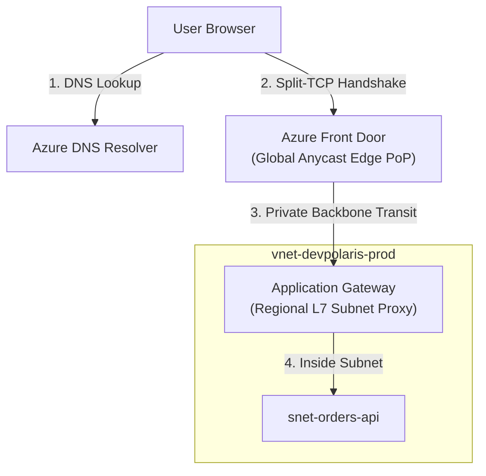
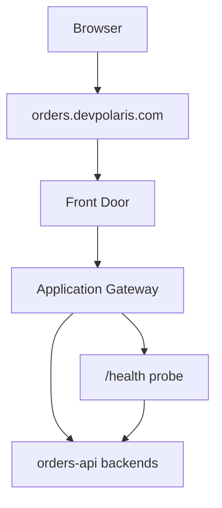

## Table of Contents

1. [Public Entry Point Architectures](#public-entry-point-architectures)
2. [Public DNS Caching and Resolution Paths](#public-dns-caching-and-resolution-paths)
3. [TLS Edge Termination Physics](#tls-edge-termination-physics)
4. [Azure Front Door: The Global Edge Gateway](#azure-front-door-the-global-edge-gateway)
5. [Application Gateway: The Regional L7 Proxy](#application-gateway-the-regional-l7-proxy)
6. [Azure Load Balancer: The Layer 4 Transport Switch](#azure-load-balancer-the-layer-4-transport-switch)
7. [Active Health Probe Polling Algorithms](#active-health-probe-polling-algorithms)
8. [Choosing The Entry Point](#choosing-the-entry-point)
9. [Sample Entry Shape](#sample-entry-shape)
10. [Putting It All Together](#putting-it-all-together)
11. [What's Next](#whats-next)

## Public Entry Point Architectures

Public entry points serve as the administrative edge routing gateways that securely connect external internet traffic to your private virtual network resources.

To build a secure, high-performance cloud deployment, you must treat public ingress as a structured, multi-layer chain rather than a single portal switch. In local loopback architectures, a user's browser talks directly to your backend process. In the cloud, exposing your application servers directly to the internet is a severe vulnerability. 

You need specialized entry services to act as shields, absorbing DDoS attacks, decrypting secure connections close to the user, and routing requests only to healthy compute nodes inside your private subnets.



The public entry path begins long before a single byte of application code is executed. It is a highly coordinated delivery chain: DNS resolves the custom hostname, TLS establishes a cryptographically secure socket, edge firewalls filter out malicious payloads, and load balancers distribute connections across healthy, private servers. If any coordinate in this delivery chain is broken, your application remains completely unreachable to the public.

## Public DNS Caching and Resolution Paths

Public Domain Name System (DNS) is the translation engine that maps human-friendly hostnames (like `api.devpolaris.com`) to the public IP addresses of your Azure entry points.

When a user's browser initiates a connection, it does not send an HTTP payload immediately. It first queries a hierarchical chain of recursive DNS resolvers. Understanding this path is vital:

*   **CNAME Resolution Chains**: Azure services (like Front Door or Application Gateway) utilize managed default domain names (such as `fd-devpolaris.azurefd.net`). To assign a custom domain, you map a CNAME record in your DNS zone pointing `api.devpolaris.com` to the managed name. The client's resolver must sequentially resolve this entire CNAME chain to retrieve the physical IP address.
*   **Time-To-Live (TTL) Caching**: Every DNS record carries a TTL value (in seconds) that tells resolvers how long they may cache the answer. If your custom domain points to an old gateway, and you update the record, users will continue hitting the old IP until their local ISP's recursive DNS cache fully expires. 

During cutovers, always lower the TTL values (e.g. to 300 seconds) several days in advance to ensure rapid client propagation.

## TLS Edge Termination Physics

Transport Layer Security (TLS) encrypts user connections and proves domain authenticity via public certificates. In a secure architecture, the physical location where the TLS handshake is terminated has profound performance and networking consequences:

### 1. Global Edge Termination (Split-TCP Handshake)
Azure Front Door terminates TLS at the global Microsoft edge Point of Presence (PoP) nearest to the user. This relies on **Split-TCP physics**. 

Establishing a TCP and TLS 1.3 connection requires multiple round-trips over the wire. If a user in London connects to a server in Singapore, each round-trip takes approximately 150 milliseconds due to the speed of light in glass fiber, resulting in a painful 600ms handshake delay. 

By terminating TLS at a London edge PoP, the handshake is completed in milliseconds. Front Door then routes the request to Singapore over Microsoft's high-speed private fiber backbone, using pre-established, warm TCP connection pools, cutting handshakes down to zero.

### 2. Regional Subnet Termination
Azure Application Gateway terminates TLS regionally inside your Virtual Network's delegated subnet. This is managed by dedicated, regional reverse proxy daemons (built on optimized IIS/Nginx-style fabrics). 

While it does not offer global Split-TCP acceleration, it provides a highly secure, localized boundary where Web Application Firewall (WAF) rules are evaluated right before packets are routed to your private compute subnets.

## Azure Front Door: The Global Edge Gateway

Azure Front Door is a global edge routing service that combines a content delivery network (CDN), Web Application Firewall (WAF), and global HTTP/HTTPS load balancer into a single, Microsoft-managed edge platform.

Front Door utilizes **Anycast routing** globally. When you configure Front Door, Microsoft broadcasts its public IP addresses from all edge PoPs worldwide. 

When a user connects, the internet's routing switches automatically direct their packets to the physically nearest edge facility. 

WAF rules are evaluated immediately at the edge, blocking SQL injection and cross-site scripting (XSS) payloads before they can cross regional boundaries. 

Front Door then proxies the clean HTTP headers to your regional backend origins over Microsoft's dedicated WAN backbone, maintaining high speed and reliability.

## Application Gateway: The Regional L7 Proxy

Azure Application Gateway is a regional, dedicated Layer 7 load balancer that operates inside your private Virtual Network.

Because Application Gateway is a Layer 7 proxy, it parses the actual HTTP application protocol headers. Unlike simple IP port forwarding, it executes **URL path-based routing rules**:

```text
HTTP Request to api.devpolaris.com 
  ├── Path starts with /api/* ──> Forward to snet-orders-api pool
  └── Path starts with /images/* ──> Forward to Blob Storage pool
```

This HTTP-level intelligence is highly robust but requires a dedicated subnet inside your VNet. Application Gateway operates multiple virtual instances inside this subnet, requiring a continuous flow of IP allocations. 

It handles regional TLS certificate bindings, evaluates local WAF rules, and performs backend header rewrites (such as injecting `X-Forwarded-For` headers to preserve the client's source IP) before routing requests to your compute subnets.

## Azure Load Balancer: The Layer 4 Transport Switch

Azure Load Balancer is a ultra-high-performance Layer 4 transport load balancer.

Unlike Application Gateway, Azure Load Balancer **does not parse HTTP headers, inspect URLs, or decrypt TLS certificates**. It operates strictly at the transport tier, evaluating packets using a 5-tuple hash: Source IP, Source Port, Destination IP, Destination Port, and Protocol.

```text
Incoming Packet: 52.174.12.34:5000 ──> Load Balancer ──> 5-Tuple Hash ──> Forward to VM 10.30.2.4:80
```

Because it does not execute expensive string parsing or cryptographic math, Azure Load Balancer has sub-millisecond latency and can handle millions of concurrent connections easily. It is the ideal tool for raw TCP/UDP traffic distribution (such as gaming protocols or database read-replicas) but is the wrong choice when your application needs host-header routing or edge security.

## Active Health Probe Polling Algorithms

To protect users from server crashes, public entry points run continuous **Active Health Probe Polling Algorithms** to monitor the state of backend nodes.

A health probe is an active polling loop. The entry service initiates short HTTP requests to a designated path (e.g. `/health` or `/ready`) at configured intervals (such as every 15 seconds):

```text
Health Probe Loop (Interval: 15s, Timeout: 5s, Unhealthy Threshold: 2)
  ├── Poll 1: Get /health ──> returns 200 OK (Healthy)
  ├── Poll 2: Get /health ──> returns 503 Service Unavailable (Failed count: 1)
  └── Poll 3: Get /health ──> Timeout (Failed count: 2 - MARKS UNHEALTHY)
```

If a backend node fails to respond with a successful HTTP status code (typically `200` through `399`) or times out, and the failures exceed your configured **Unhealthy Threshold**, the load balancer's routing controller physically extracts the degraded node from its active forwarding tables. 

All subsequent user traffic completely bypasses the unhealthy node, preventing the propagation of `502 Bad Gateway` or `504 Gateway Timeout` errors to your users. 

When writing backend code, always expose a dedicated health endpoint that audits database connectivity and cache states, and ensure that NSG rules allow the load balancer's public or internal system IP addresses to poll the port.

## Choosing The Entry Point

The entry choice starts with the kind of request, not the product menu.

| Need | Better starting point |
| --- | --- |
| Global public HTTP entry, edge WAF, global routing, CDN behavior | Front Door |
| Regional HTTP routing, path and host rules, WAF near the VNet | Application Gateway |
| TCP or UDP distribution by IP and port | Load Balancer |
| Private backend distribution inside the VNet | Internal Load Balancer or Application Gateway, depending on layer |

The services can also be combined. A common pattern is Front Door at the global edge and Application Gateway as a regional origin. That can be useful, but it adds more evidence to review: DNS, edge routing, TLS at one or more points, origin health, gateway health, NSG rules, and backend health.

Choose the smallest chain that explains the real requirement. A longer entry chain is not more professional by itself. It is only better when each component has a job.

## Sample Entry Shape

For the orders API, a reasonable public entry shape is:



The review evidence follows the same path:

| Layer | Evidence |
| --- | --- |
| DNS | `orders.devpolaris.com` points to the approved entry endpoint. |
| TLS | Certificate covers the hostname and is bound at the termination point. |
| Front Door | Route points to the intended origin group. |
| Application Gateway | Listener, rule, backend pool, and probe match the app. |
| Backend | Probe returns the expected status from the expected path. |

When users see 502 or 503, this table keeps the incident small. Check the chain in order. Do not start by changing app code if the entry point has no healthy backend.

## Putting It All Together

Operating a resilient public entry boundary requires connecting hostname resolution to secure, multi-layer routing paths:

*   **Audit CNAME Chains**: Track DNS resolution paths and cache TTL configurations to prevent hostname routing lag during migrations.
*   **Terminate TLS close to Users**: Leverage Front Door split-TCP physics to terminate TLS at the global edge, eliminating handshake latency loops.
*   **Decouple Layer 4 from Layer 7**: Use high-performance L4 load balancers for raw TCP/UDP packets, reserving L7 application proxies for path-based HTTP routing.
*   **Expose Dedicated Health Probes**: Build active health endpoint daemons that verify database and application states, monitoring failure thresholds to keep traffic directed to healthy nodes.
*   **Shield the VNet Boundary**: Keep your backend subnets private, routing internet traffic through WAF-enabled global edges or regional reverse proxies.

## What's Next

The public entry path gets users to the application. The last networking question is how the application reaches Azure services such as SQL, Key Vault, and Storage through private paths. That is private connectivity.

---

**References**

* [What is Azure Front Door?](https://learn.microsoft.com/en-us/azure/frontdoor/front-door-overview) - Global edge network and split-TCP TLS routing.
* [What is Azure Application Gateway?](https://learn.microsoft.com/en-us/application-gateway/overview) - Regional L7 proxy and path-based routing rules.
* [Azure Load Balancer Overview](https://learn.microsoft.com/en-us/azure/load-balancer/load-balancer-overview) - Transport-level L4 load balancing and 5-tuple hash forwarding.
