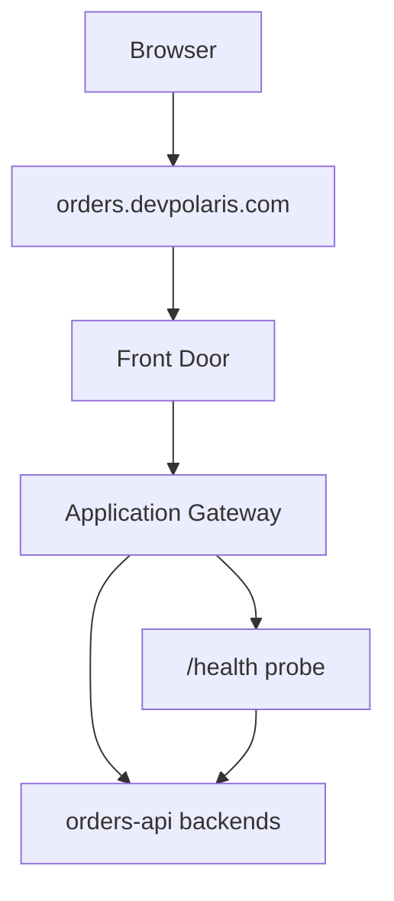

## Table of Contents

1. [The Problem](#the-problem)
2. [Public DNS](#public-dns)
3. [TLS](#tls)
4. [Front Door](#front-door)
5. [Application Gateway](#application-gateway)
6. [Load Balancer](#load-balancer)
7. [Health Probes](#health-probes)
8. [Choosing The Entry Point](#choosing-the-entry-point)
9. [Sample Entry Shape](#sample-entry-shape)
10. [Putting It All Together](#putting-it-all-together)
11. [What's Next](#whats-next)

## The Problem

A user does not see a VNet, route table, NSG, or private endpoint. A user sees a URL:

```text
https://orders.devpolaris.com/orders
```

When that URL fails, the public name can feel like the whole system. Inside Azure, it is a chain:

- DNS has to send the browser to the intended public entry point.
- TLS has to prove the site and protect the connection.
- The entry service has to route the request to the right backend.
- A health probe has to decide which backend is safe to receive traffic.
- The backend still has to be reachable and healthy.

This article owns the public entry chain. The earlier articles placed private workloads and packet rules. Now the question is different:

> When a browser asks for this hostname, which Azure service receives the request first, and what evidence proves it can reach a healthy backend?

## Public DNS

Public DNS turns a name people use into the destination a client can reach. For the orders API, `orders.devpolaris.com` might point to Azure Front Door, Application Gateway, an Azure Load Balancer, or another approved public endpoint.

DNS is not decoration after deployment. It is part of the traffic path. If the hostname points to an old gateway, a staging edge, or a deleted endpoint, the backend can be perfect and users still fail.

Common DNS records show different jobs:

| Record | Job |
| --- | --- |
| `A` | Points a name directly to IPv4 addresses. |
| `CNAME` | Points a name to another name, often a managed service hostname. |
| `TXT` | Proves domain ownership or stores verification text. |
| TTL | Tells resolvers how long they may cache an answer. |

The gotcha is cache time. A DNS cutover can be correct in the zone and still slow to appear for users because resolvers cached the previous answer. Lowering TTL before a planned cutover can reduce the waiting period, but it does not rewrite caches that already exist.

## TLS

TLS protects the connection and proves the public endpoint is allowed to serve the hostname. The browser checks the certificate before app code runs. If certificate binding, hostname coverage, or renewal is wrong, users may never reach the backend.

In Azure designs, TLS can terminate at different places:

| Termination point | When it appears |
| --- | --- |
| Front Door | Global edge entry, WAF, CDN, and routing close to users. |
| Application Gateway | Regional layer 7 gateway inside or near the VNet. |
| Backend app | End-to-end TLS or internal service requirements. |

Termination is not only a security detail. It affects where HTTP routing decisions can happen, where certificates are managed, and what evidence you inspect during an incident.

## Front Door

Azure Front Door is a global edge entry service for web applications, APIs, and content. It uses Microsoft's global edge network, can terminate TLS, route HTTP traffic, use health probes, integrate with WAF, and send users toward healthy origins.

Use Front Door when the problem is global public HTTP entry: users in multiple places, global routing, edge TLS, WAF at the edge, caching for eligible content, or failover between origins.

Front Door does not replace the private backend design. It receives public traffic first, then sends traffic to origins. Those origins still need health, routing, and access controls. If the origin is private, the design may also involve Private Link or a controlled backend path.

## Application Gateway

Azure Application Gateway is a regional layer 7 web traffic load balancer. It understands HTTP request attributes such as host names and paths, can terminate TLS, can integrate with WAF, and routes to backend pools.

Use Application Gateway when the problem is regional HTTP entry with application-layer routing. For example, `orders.devpolaris.com/api` might route to API servers while `orders.devpolaris.com/images` routes somewhere else. It also fits designs where the gateway lives close to private backend subnets.

Application Gateway needs its own subnet. That subnet becomes part of the network design. Backend health, NSG rules, routes, and certificates all become evidence for whether the gateway can actually serve users.

## Load Balancer

Azure Load Balancer is a layer 4 load balancer. It works at the transport layer, using IP address, port, and protocol rather than HTTP paths or headers.

Use Load Balancer when the problem is TCP or UDP distribution, not HTTP application routing. It can be public or internal. A public load balancer can expose a transport endpoint. An internal load balancer can distribute private traffic inside the network.

Load Balancer is the wrong tool when the main decision is "route `/api` here and `/admin` there" or "apply HTTP WAF rules." Those are layer 7 jobs. Keeping the layer clear avoids complicated workarounds.

## Health Probes

A public entry service should send traffic only to backends it considers healthy. Health probes are how the entry point checks that safety.

A health probe is not the same as a real user request. It is a smaller test that asks whether a backend should receive traffic. If the probe path is wrong, blocked by NSG rules, missing host headers, or too shallow, the entry point may remove good backends or keep bad ones.

For the orders API, a useful health probe record looks like this:

```text
Backend: orders-api
Probe path: /health
Expected status: 200
Probe source: public entry service
Backend port: 443
Failure meaning: do not send checkout traffic here
```

The practical habit is to treat probe configuration as production logic. A load balancer cannot make an unhealthy app healthy. It can only decide where traffic should go.

## Choosing The Entry Point

The entry choice starts with the kind of request, not the product menu.

| Need | Better starting point |
| --- | --- |
| Global public HTTP entry, edge WAF, global routing, CDN behavior | Front Door |
| Regional HTTP routing, path and host rules, WAF near the VNet | Application Gateway |
| TCP or UDP distribution by IP and port | Load Balancer |
| Private backend distribution inside the VNet | Internal Load Balancer or Application Gateway, depending on layer |

The services can also be combined. A common pattern is Front Door at the global edge and Application Gateway as a regional origin. That can be useful, but it adds more evidence to review: DNS, edge routing, TLS at one or more points, origin health, gateway health, NSG rules, and backend health.

Choose the smallest chain that explains the real requirement. A longer entry chain is not more professional by itself. It is only better when each component has a job.

## Sample Entry Shape

For the orders API, a reasonable public entry shape is:



The review evidence follows the same path:

| Layer | Evidence |
| --- | --- |
| DNS | `orders.devpolaris.com` points to the approved entry endpoint. |
| TLS | Certificate covers the hostname and is bound at the termination point. |
| Front Door | Route points to the intended origin group. |
| Application Gateway | Listener, rule, backend pool, and probe match the app. |
| Backend | Probe returns the expected status from the expected path. |

When users see 502 or 503, this table keeps the incident small. Check the chain in order. Do not start by changing app code if the entry point has no healthy backend.

## Putting It All Together

Return to the public URL. `orders.devpolaris.com` is not one setting. It is a chain:

- Public DNS chooses the first public destination.
- TLS proves the hostname and protects the connection.
- Front Door handles global HTTP entry when the app needs edge routing.
- Application Gateway handles regional layer 7 routing when HTTP details matter near the VNet.
- Load Balancer handles layer 4 distribution when the problem is IP, port, and protocol.
- Health probes decide which backends receive traffic.

The useful review sentence is:

```text
orders.devpolaris.com resolves to Front Door, Front Door routes to the regional Application Gateway origin, the gateway terminates or forwards TLS as designed, and only healthy orders-api backends receive checkout traffic.
```

That sentence is specific enough to test.

## What's Next

The public entry path gets users to the application. The last networking question is how the application reaches Azure services such as SQL, Key Vault, and Storage through private paths. That is private connectivity.

---

**References**

- [What is Azure Front Door?](https://learn.microsoft.com/en-us/azure/frontdoor/front-door-overview)
- [What is Azure Application Gateway?](https://learn.microsoft.com/en-us/azure/application-gateway/overview)
- [What is Azure Load Balancer?](https://learn.microsoft.com/en-us/azure/load-balancer/load-balancer-overview)
