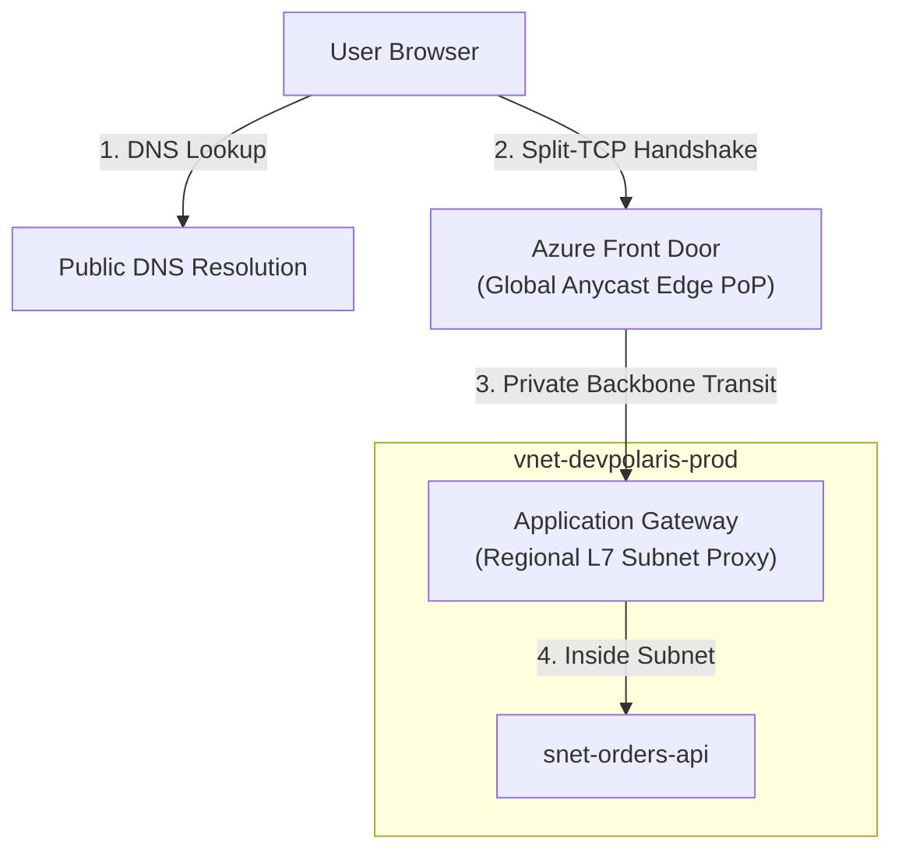
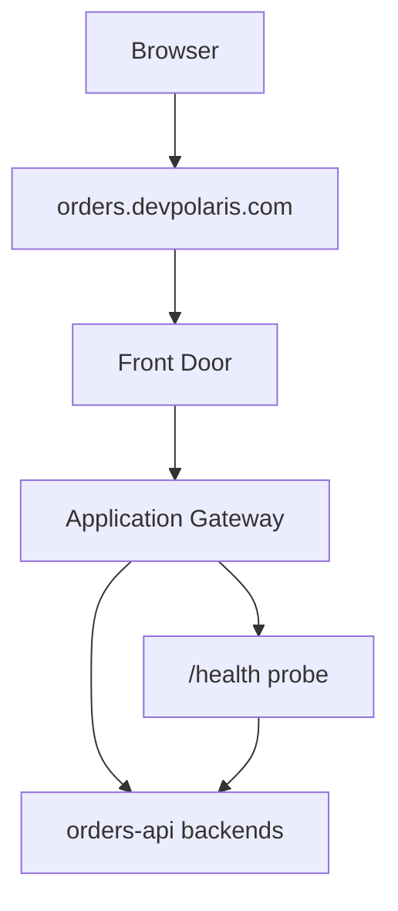

## Table of Contents

1. [Public Entry Point Architectures](#public-entry-point-architectures)
2. [Public DNS Caching and Resolution Paths](#public-dns-caching-and-resolution-paths)
3. [TLS Edge Termination Physics](#tls-edge-termination-physics)
4. [Azure Front Door: The Global Edge Gateway](#azure-front-door-the-global-edge-gateway)
5. [Application Gateway: The Regional L7 Proxy](#application-gateway-the-regional-l7-proxy)
6. [Azure Load Balancer: The Layer 4 Transport Switch](#azure-load-balancer-the-layer-4-transport-switch)
7. [Active Health Probe Polling Algorithms](#active-health-probe-polling-algorithms)
8. [Choosing The Entry Point](#choosing-the-entry-point)
9. [Sample Entry Shape](#sample-entry-shape)
10. [Putting It All Together](#putting-it-all-together)
11. [What's Next](#whats-next)

## Public Entry Point Architectures

Public entry points are the internet-facing services that receive user traffic, terminate or forward network connections, and route only valid requests toward private backend resources.

To build a secure, high-performance cloud deployment, you must treat public ingress as a structured, multi-layer chain rather than a single portal switch. In local loopback architectures, a user's browser talks directly to your backend process. In the cloud, exposing your application servers directly to the internet is a severe vulnerability.

You need specialized entry services to absorb DDoS pressure, decrypt secure connections close to the user when appropriate, apply web filtering, and route requests only to healthy compute nodes inside your private subnets.



The public entry path begins long before a single byte of application code is executed. It is a highly coordinated delivery chain: DNS resolves the custom hostname, TLS establishes a cryptographically secure socket, edge firewalls filter out malicious payloads, and load balancers distribute connections across healthy, private servers. If any coordinate in this delivery chain is broken, your application remains completely unreachable to the public.

## Public DNS Caching and Resolution Paths

Public Domain Name System (DNS) is the distributed name-resolution system that maps hostnames like `api.devpolaris.com` to the public addresses or managed names of your Azure entry points.

When a user's browser initiates a connection, it does not send an HTTP payload immediately. It first queries a hierarchical chain of recursive DNS resolvers. Understanding this path is vital:

*   **CNAME Resolution Chains**: Azure services (like Front Door or Application Gateway) utilize managed default domain names (such as `fd-devpolaris.azurefd.net`). To assign a custom domain, you map a CNAME record in your DNS zone pointing `api.devpolaris.com` to the managed name. The client's resolver must sequentially resolve this entire CNAME chain to retrieve the physical IP address.
*   **Time-To-Live (TTL) Caching**: Every DNS record carries a TTL value (in seconds) that tells resolvers how long they may cache the answer. If your custom domain points to an old gateway, and you update the record, users will continue hitting the old IP until their local ISP's recursive DNS cache fully expires.

During cutovers, always lower the TTL values (e.g. to 300 seconds) several days in advance to ensure rapid client propagation.

## TLS Edge Termination Physics

TLS termination is the point where an entry service completes the HTTPS handshake and can inspect or forward decrypted HTTP traffic. Transport Layer Security (TLS) encrypts user connections and proves domain authenticity via public certificates.

Example: `orders.devpolaris.com` can terminate TLS at Azure Front Door near the user, then forward the request over Microsoft's backbone to an Application Gateway in `uksouth`.

In a secure architecture, the physical location where the TLS handshake is terminated has profound performance and networking consequences:

### 1. Global Edge Termination (Split-TCP Handshake)
Global edge termination means the user completes the TCP and TLS handshakes with a nearby edge location instead of with the final regional backend. Azure Front Door terminates TLS at the global Microsoft edge Point of Presence (PoP) nearest to the user. This relies on Split-TCP behavior.

Establishing a TCP and TLS 1.3 connection requires multiple round-trips over the wire. If a user in London connects to a server in Singapore, each round-trip takes approximately 150 milliseconds due to the speed of light in glass fiber, resulting in a painful 600ms handshake delay.

By terminating TLS at a London edge PoP, the handshake is completed in milliseconds. Front Door then routes the request to Singapore over Microsoft's high-speed private fiber backbone, using pre-established, warm TCP connection pools, cutting handshakes down to zero.

### 2. Regional Subnet Termination
Azure Application Gateway terminates TLS regionally inside your Virtual Network's dedicated subnet. It is a managed Layer 7 reverse proxy service, so you configure listeners, certificates, routing rules, backend pools, and health probes instead of operating the proxy hosts yourself.

While it does not offer global Split-TCP acceleration, it provides a highly secure, localized boundary where Web Application Firewall (WAF) rules are evaluated right before packets are routed to your private compute subnets.

## Azure Front Door: The Global Edge Gateway

Azure Front Door is Azure's global HTTP/HTTPS entry service for routing user requests through Microsoft's edge network before they reach regional origins. It combines a content delivery network (CDN), Web Application Firewall (WAF), and global HTTP/HTTPS load balancer into a single, Microsoft-managed edge platform.

Front Door utilizes Anycast routing globally. When you configure Front Door, Microsoft broadcasts its public IP addresses from all edge PoPs worldwide. When a user connects, the internet's routing switches automatically direct their packets to the physically nearest edge facility. WAF rules are evaluated immediately at the edge, blocking SQL injection and cross-site scripting (XSS) payloads before they can cross regional boundaries. Front Door then proxies the clean HTTP headers to your regional backend origins over Microsoft's dedicated WAN backbone, maintaining high speed and reliability.

### Anycast Routing and Split-TCP Physics

Anycast is a routing pattern where the same public IP address is announced from many physical locations. The internet then sends a user to a nearby location that advertises that address.

Example: the same Front Door IP can be announced from London, Singapore, and Virginia. A London user reaches the London edge, while a Singapore user reaches the Singapore edge.

To appreciate why this edge routing design is powerful, compare it with standard unicast routing. In standard unicast routing, a public IP address belongs to a single physical data center. If a user in London wants to access a server in Singapore, every packet must travel the entire distance across under-sea fiber cables, taking roughly 150 milliseconds per round-trip.

Anycast changes this by advertising the exact same public IP address from over one hundred Microsoft Edge PoPs worldwide using the Border Gateway Protocol (BGP). The internet's standard routing systems naturally direct the user's packets to the closest physical PoP advertising that IP.

Once the packets reach this nearby Edge PoP, Front Door terminates the TCP and TLS connections immediately. This process relies on Split-TCP physics. A standard HTTPS handshake requires two round-trips over the wire (one for the TCP three-way handshake, and one for the TLS 1.3 cryptographic exchange) before any actual application data is sent. Under unicast, a London user would wait 300 milliseconds just to establish the secure socket with Singapore. With Split-TCP, the user completes the TCP and TLS handshakes with the London Edge PoP in under 10 milliseconds.

After completing the local handshake, the Edge PoP forwards the request to the regional origin server in Singapore over Microsoft's private global fiber network. Front Door maintains pre-established, warm TCP connection pools between all Edge PoPs and regional origins. Because these connection pools are already open and active, the Edge PoP can transmit the request to Singapore instantly, bypassing the handshake latency penalty entirely.

## Application Gateway: The Regional L7 Proxy

Azure Application Gateway is the regional Layer 7 proxy for HTTP and HTTPS traffic inside or at the edge of your virtual network. It is a dedicated Layer 7 load balancer that operates inside your private Virtual Network.

Because Application Gateway is a Layer 7 proxy, it parses the actual HTTP application protocol headers. Unlike simple IP port forwarding, it executes URL path-based routing rules:

```plain
HTTP Request to api.devpolaris.com
  ├── Path starts with /api/* ──> Forward to snet-orders-api pool
  └── Path starts with /images/* ──> Forward to Blob Storage pool
```

This HTTP-level intelligence is highly robust but requires a dedicated subnet inside your Virtual Network. Unlike a simple virtual appliance, Application Gateway operates as a set of managed instances that scale dynamically. It requires a continuous block of private IP addresses within its dedicated subnet to handle scaling events.

It handles regional TLS certificate bindings, evaluates local WAF rules, and performs backend header rewrites (such as injecting `X-Forwarded-For` headers to preserve the client's source IP) before routing requests to your compute subnets.

### Application Gateway Configuration Example

You can deploy and configure an Application Gateway declaratively using Bicep. The following sample Bicep template defines a standard public IP address, a virtual network subnet integration, and an Application Gateway resource configured for basic HTTP port 80 routing to a private backend pool:

```bicep
resource publicIp 'Microsoft.Network/publicIPAddresses@2023-09-01' = {
  name: 'pip-appgw-prod'
  location: 'eastus'
  sku: {
    name: 'Standard'
  }
  properties: {
    publicIPAllocationMethod: 'Static'
  }
}

resource appGateway 'Microsoft.Network/applicationGateways@2023-09-01' = {
  name: 'agw-orders-prod'
  location: 'eastus'
  properties: {
    sku: {
      name: 'WAF_v2'
      tier: 'WAF_v2'
      capacity: 2
    }
    gatewayIPConfigurations: [
      {
        name: 'appGatewayIpConfig'
        properties: {
          subnet: {
            id: resourceId('Microsoft.Network/virtualNetworks/subnets', 'vnet-prod', 'snet-agw')
          }
        }
      }
    ]
    frontendIPConfigurations: [
      {
        name: 'appGatewayFrontendIp'
        properties: {
          publicIPAddress: {
            id: publicIp.id
          }
        }
      }
    ]
    frontendPorts: [
      {
        name: 'port_80'
        properties: {
          port: 80
        }
      }
    ]
    backendAddressPools: [
      {
        name: 'apiv2-backend-pool'
        properties: {
          backendAddresses: [
            {
              ipAddress: '10.30.2.4'
            }
          ]
        }
      }
    ]
    backendHttpSettingsCollection: [
      {
        name: 'apiv2-http-settings'
        properties: {
          port: 80
          protocol: 'Http'
          cookieBasedAffinity: 'Disabled'
          requestTimeout: 20
        }
      }
    ]
    httpListeners: [
      {
        name: 'apiv2-listener'
        properties: {
          frontendIPConfiguration: {
            id: resourceId('Microsoft.Network/applicationGateways/frontendIPConfigurations', 'agw-orders-prod', 'appGatewayFrontendIp')
          }
          frontendPort: {
            id: resourceId('Microsoft.Network/applicationGateways/frontendPorts', 'agw-orders-prod', 'port_80')
          }
          protocol: 'Http'
        }
      }
    ]
    requestRoutingRules: [
      {
        name: 'apiv2-routing-rule'
        properties: {
          ruleType: 'Basic'
          priority: 100
          httpListener: {
            id: resourceId('Microsoft.Network/applicationGateways/httpListeners', 'agw-orders-prod', 'apiv2-listener')
          }
          backendAddressPool: {
            id: resourceId('Microsoft.Network/applicationGateways/backendAddressPools', 'agw-orders-prod', 'apiv2-backend-pool')
          }
          backendHttpSettings: {
            id: resourceId('Microsoft.Network/applicationGateways/backendHttpSettingsCollection', 'agw-orders-prod', 'apiv2-http-settings')
          }
        }
      }
    ]
  }
}
```

## Azure Load Balancer: The Layer 4 Transport Switch

Azure Load Balancer is the Layer 4 distribution service for TCP and UDP flows. Layer 4 means it looks at IP addresses, ports, and protocol, not HTTP paths, cookies, or hostnames.

Example: a public Load Balancer can distribute TCP port `443` across three VM instances running the same service, but it cannot route `/api` to one backend and `/images` to another.

Unlike Application Gateway, Azure Load Balancer **does not parse HTTP headers, inspect URLs, or decrypt TLS certificates**. It operates strictly at the transport tier, evaluating packets using a 5-tuple hash: Source IP, Source Port, Destination IP, Destination Port, and Protocol.

```plain
Incoming Packet: 52.174.12.34:5000 ──> Load Balancer ──> 5-Tuple Hash ──> Forward to VM 10.30.2.4:80
```

Because it does not parse HTTP or terminate TLS, Azure Load Balancer is built for high-throughput TCP/UDP distribution. It is the right tool for raw transport traffic, but it is the wrong choice when your application needs host-header routing, URL path routing, WAF policies, or edge security.

## Active Health Probe Polling Algorithms

A health probe is the entry service's repeated check that a backend target is ready to receive traffic. To protect users from server crashes, public entry points run continuous active health probe polling to monitor the state of backend nodes.


*A public entry service must prove the connection, choose a route, and keep unhealthy backends out of the active pool.*

A health probe is an active polling loop. The entry service initiates short HTTP requests to a designated path (e.g. `/health` or `/ready`) at configured intervals (such as every 15 seconds):

```plain
Health Probe Loop (Interval: 15s, Timeout: 5s, Unhealthy Threshold: 2)
  ├── Poll 1: Get /health ──> returns 200 OK (Healthy)
  ├── Poll 2: Get /health ──> returns 503 Service Unavailable (Failed count: 1)
  └── Poll 3: Get /health ──> Timeout (Failed count: 2 - MARKS UNHEALTHY)
```

If a backend node fails to respond with a successful HTTP status code (typically `200` through `399`) or times out, and the failures exceed your configured **Unhealthy Threshold**, the load balancer's routing controller physically extracts the degraded node from its active forwarding tables.

Subsequent user traffic bypasses the unhealthy node when the entry service has healthy alternatives available. Health probes reduce the chance of routing to a broken backend, but they cannot prevent every `502 Bad Gateway` or `504 Gateway Timeout` symptom. If all backends are unhealthy, the probe path is blocked by NSGs, or the application fails after accepting the request, users can still see gateway errors.

When writing backend code, always expose a dedicated health endpoint that audits database connectivity and cache states, and ensure that NSG rules allow the load balancer's public or internal system IP addresses to poll the port.

## Choosing The Entry Point

The entry choice starts with the kind of request, not the product menu. Decide whether the request needs global HTTP routing, regional HTTP inspection, raw TCP/UDP distribution, or private backend routing.

Example: a public browser API usually starts with Front Door or Application Gateway, while a private TCP service between VM tiers may only need an internal Load Balancer.


*Choose the entry point by the job it performs: global HTTP edge, regional layer 7 routing, or raw layer 4 transport.*

| Need | Better starting point |
| --- | --- |
| Global public HTTP entry, edge WAF, global routing, CDN behavior | Front Door |
| Regional HTTP routing, path and host rules, WAF near the VNet | Application Gateway |
| TCP or UDP distribution by IP and port | Load Balancer |
| Private backend distribution inside the VNet | Internal Load Balancer or Application Gateway, depending on layer |

The services can also be combined. A common pattern is Front Door at the global edge and Application Gateway as a regional origin. That can be useful, but it adds more evidence to review: DNS, edge routing, TLS at one or more points, origin health, gateway health, NSG rules, and backend health.

Choose the smallest chain that explains the real requirement. A longer entry chain is not more professional by itself. It is only better when each component has a job.

:::expand[Leaving Application Gateway Reachable Behind Front Door]{kind="pitfall"}
When combining Azure Front Door at the global edge with an Application Gateway (AGW) as a regional origin, a major security vulnerability is leaving the AGW listener exposed to the public internet. If the AGW subnet's Network Security Group (NSG) allows traffic on port `443` from `0.0.0.0/0`, anyone who discovers the AGW's public IP address can bypass Front Door entirely. This completely neutralizes Front Door's edge WAF policies, geographic access restrictions, and DDoS protections.

This directly mirrors the AWS equivalent of securing an Application Load Balancer (ALB) behind Amazon CloudFront. In AWS, you must restrict the ALB's security group to allow inbound traffic only from the managed CloudFront IP Prefix List, or validate a custom header injected by CloudFront to block direct bypasses.

To secure this boundary, you must enforce a two-layer lockdown:

1.  **Restrict the Subnet NSG:** Modify the Application Gateway's subnet NSG to block all inbound HTTP/HTTPS traffic except that originating from Front Door's dynamic IP range:

    *   **Before (Exposed):**
        ```plain
        Allow Inbound TCP 443 from Source: *
        ```
    *   **After (Hardened):**
        ```plain
        Allow Inbound TCP 443 from Source: AzureFrontDoor.Backend
        ```

2.  **Validate the Front Door ID (FDID):** Configure the Application Gateway's routing rules or your application's Web Application Firewall (WAF) custom rules to inspect the `X-Azure-FDID` header. The gateway must reject any request where this header is missing or does not match your specific Front Door profile ID.

**Rule of thumb:** An origin gateway is only secure if it forces traffic through the edge. Every Application Gateway deployed behind Front Door must enforce BOTH the `AzureFrontDoor.Backend` NSG service tag restriction and the `X-Azure-FDID` header validation - relying on either alone is insufficient.
:::

## Sample Entry Shape

For the orders API, a reasonable public entry shape is:



The review evidence follows the same path:

| Layer | Evidence |
| --- | --- |
| DNS | `orders.devpolaris.com` points to the approved entry endpoint. |
| TLS | Certificate covers the hostname and is bound at the termination point. |
| Front Door | Route points to the intended origin group. |
| Application Gateway | Listener, rule, backend pool, and probe match the app. |
| Backend | Probe returns the expected status from the expected path. |

When users see 502 or 503, this table keeps the incident small. Check the chain in order. Do not start by changing app code if the entry point has no healthy backend.

## Putting It All Together

Operating a resilient public entry boundary requires connecting hostname resolution to secure, multi-layer routing paths:

*   **Audit CNAME Chains**: Track DNS resolution paths and cache TTL configurations to prevent hostname routing lag during migrations.
*   **Terminate TLS close to Users**: Leverage Front Door split-TCP physics to terminate TLS at the global edge, eliminating handshake latency loops.
*   **Decouple Layer 4 from Layer 7**: Use high-performance L4 load balancers for raw TCP/UDP packets, reserving L7 application proxies for path-based HTTP routing.
*   **Expose Dedicated Health Probes**: Build active health endpoint daemons that verify database and application states, monitoring failure thresholds to keep traffic directed to healthy nodes.
*   **Shield the VNet Boundary**: Keep your backend subnets private, routing internet traffic through WAF-enabled global edges or regional reverse proxies.

## What's Next

The public entry path gets users to the application. The last networking question is how the application reaches Azure services such as SQL, Key Vault, and Storage through private paths. That is private connectivity.


*Use this as the public entry chooser: pick Front Door for global HTTP edge routing, Application Gateway for regional layer 7/WAF behavior, and Load Balancer for regional layer 4 traffic.*


---

**References**

* [What is Azure Front Door?](https://learn.microsoft.com/en-us/azure/frontdoor/front-door-overview) - Global edge network and split-TCP TLS routing.
* [What is Azure Application Gateway?](https://learn.microsoft.com/en-us/application-gateway/overview) - Regional L7 proxy and path-based routing rules.
* [Azure Load Balancer Overview](https://learn.microsoft.com/en-us/azure/load-balancer/load-balancer-overview) - Transport-level L4 load balancing and 5-tuple hash forwarding.
