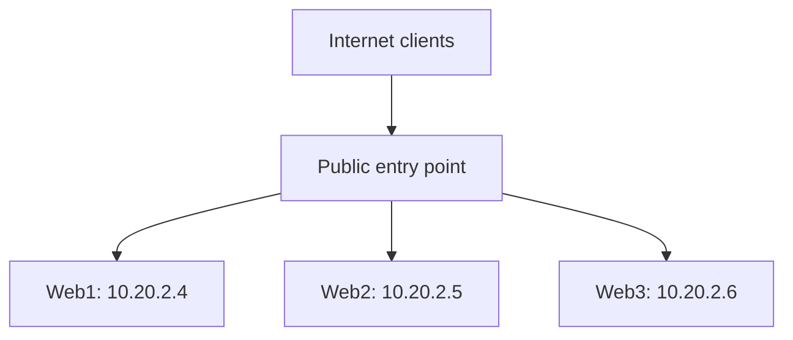
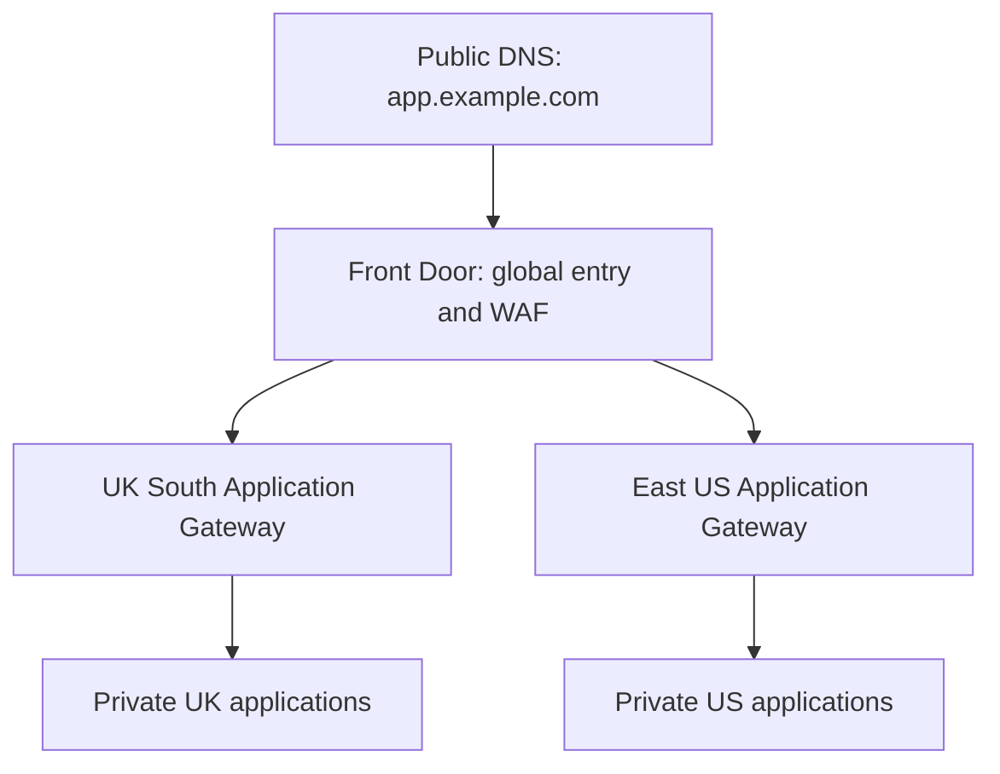

## Table of Contents

1. [What Is a Public Entry Point?](#what-is-a-public-entry-point)
2. [How Do Public DNS and TLS Establish the Connection?](#how-do-public-dns-and-tls-establish-the-connection)
3. [When Should You Use Azure Front Door?](#when-should-you-use-azure-front-door)
4. [When Should You Use Application Gateway?](#when-should-you-use-application-gateway)
5. [When Should You Use Azure Load Balancer?](#when-should-you-use-azure-load-balancer)
6. [How Do Health Probes Protect Traffic?](#how-do-health-probes-protect-traffic)
7. [How Do You Choose the Entry Path?](#how-do-you-choose-the-entry-path)
8. [How Do You Verify the Complete Request Path?](#how-do-you-verify-the-complete-request-path)
9. [Check Your Answers](#check-your-answers)
10. [References](#references)

Someone visiting `https://app.example.com` does not need to know which VM, container, or region will serve the page. They need the name to resolve, the secure connection to work, and a healthy application to answer. The infrastructure behind that address can change without asking the visitor to learn new server addresses.

A **public entry point** receives that internet connection and provides the controlled path into the application. DNS helps the client find it, TLS protects the connection, and the entry service forwards traffic to an appropriate backend. Choosing the service requires understanding which of those decisions it makes and which remain the application's responsibility.

We will start with the public connection, then follow it through routing, health checks, and the private network behind it:

1. **What Is a Public Entry Point?**
2. **How Do Public DNS and TLS Establish the Connection?**
3. **When Should You Use Azure Front Door?**
4. **When Should You Use Application Gateway?**
5. **When Should You Use Azure Load Balancer?**
6. **How Do Health Probes Protect Traffic?**
7. **How Do You Choose the Entry Path?**
8. **How Do You Verify the Complete Request Path?**

## What Is a Public Entry Point?
<!-- section-summary: A public entry point gives internet clients a stable controlled destination while backend machines remain private and replaceable. -->

Suppose three web servers have addresses `10.20.2.4`, `10.20.2.5`, and `10.20.2.6`. These are private RFC1918 addresses, so public internet routers cannot deliver a visitor's packets directly to them. The system needs an intentional public-facing location through which visitors can reach the application.

One possibility is to give each web server a public IP. That introduces three separately reachable attack surfaces and leaves several decisions unresolved. Which address should DNS return? What happens when the first server is unhealthy? Where does TLS terminate? Where is WAF policy applied? How do you add a fourth server or remove the second for maintenance?

A stable entry point separates those concerns from the visitor's public address. Clients connect to the entry service, which forwards traffic to the backend servers. A **backend** is a destination serving the application behind that entry point; a **backend pool** is the collection of destinations eligible to receive forwarded traffic.

For example, public frontend `203.0.113.20` can represent a pool containing the three private server addresses. Clients use the frontend while the pool changes underneath it. Adding or removing backend capacity does not have to change the human-facing name or expose each machine independently.


```mermaid
flowchart TD
    users["Internet clients"] --> entry["Public entry point"]
    entry --> a["Web1: 10.20.2.4"]
    entry --> b["Web2: 10.20.2.5"]
    entry --> c["Web3: 10.20.2.6"]
    class users external
    class entry boundary
    class a,b,c workload
```

### Decide what should be public

Every public endpoint adds an externally reachable surface. A design that exposes VM1, VM2, an API VM, the database, and an administration server gives outside clients many places to attempt connections. For a web application, a more deliberate arrangement receives public traffic through approved ingress, then reaches private application servers and a private database.

**Ingress** means traffic entering the system. Front Door or Application Gateway can supply the approved web ingress layer, while the database ideally has no public entry point at all. The public website can therefore exist even though the application VM itself has only the private address `10.20.2.4`.

The VNet and public entry point have complementary jobs. The VNet supplies the private network in which the workloads live. Public ingress supplies the controlled route through which outside clients reach the parts of those workloads that are intended to be available. Creating ingress does not require making every downstream component public.

This separation also sets up the remaining questions. Before an entry service can select a healthy backend, the client has to locate the entry point and establish the expected secure connection to it. That begins with the name in the browser's address bar.

## How Do Public DNS and TLS Establish the Connection?
<!-- section-summary: DNS discovers the entry destination, while TLS authenticates its hostname and protects each connection; every TLS termination point has its own certificate relationship. -->

A browser visiting `https://shop.example.com` starts with a name. Routers forward packets to IP addresses, so DNS must identify an address or service destination for that name. **Azure Public DNS** can host the domain's public DNS zone and records, but Azure DNS itself is not the domain registrar. Microsoft's [DNS overview][1] explains this hosting and resolution role.

The browser normally asks a recursive resolver, which obtains the authoritative answer for the domain. An **authoritative DNS service** holds the published records for that zone. The answer returns to the browser, which can then begin its application connection to the resolved destination.

An A record can map `shop.example.com` to IPv4 address `203.0.113.20`. An AAAA record supplies an IPv6 address. A CNAME can instead point the name to another hostname, such as `something.azurefd.net`, which then resolves to Front Door infrastructure. Azure's [delegation and zone guidance][2] describes the public authoritative records.

That indirect mapping helps keep a stable name while infrastructure changes underneath it. Visitors continue using `shop.example.com`; the DNS configuration identifies the entry service rather than requiring them to know the backend machines or an Azure-generated hostname.

### Separate discovery from application traffic

If DNS returns `203.0.113.20`, the browser makes a separate TCP, QUIC, or HTTPS connection to the discovered destination as appropriate. DNS does not carry the application's HTTP requests after returning the answer. It supplies discovery; the connection is the next operation.

This distinction matters during an outage. A successful lookup proves that a destination was found, not that the client can contact it. Conversely, an unavailable backend does not necessarily mean the public DNS record is wrong. The two layers can be observed independently.

DNS answers are also cached. An answer mapping `app.example.com` to `203.0.113.10` with a **time to live**, or **TTL**, of `300` seconds may remain in a resolver's cache for that period. Changing DNS-based routing therefore does not necessarily move existing clients instantly when a destination fails.

A request-processing global proxy such as Front Door has different failover behavior from purely DNS-based global routing. Microsoft's [load-balancing comparison][5] identifies DNS caching as one reason Traffic Manager failover can be less immediate. This does not make DNS unimportant; it clarifies what changing a DNS answer can and cannot do to requests already using an earlier answer.

### Understand what HTTPS establishes

HTTPS protects HTTP using **Transport Layer Security**, or **TLS**. The client needs to authenticate that it is contacting the intended server name, prevent intermediaries from reading the traffic, and detect unauthorized changes to it. TLS provides server authentication, encryption, and integrity for that connection.

When the browser connects to `shop.example.com`, the TLS endpoint presents a certificate covering that name. The browser checks the certificate's validity, hostname coverage, expiration, and trust in the issuing Certificate Authority. A successful TLS negotiation establishes the cryptographic session used to protect communication.

Azure Front Door Standard/Premium supports TLS `1.2` and `1.3`, and custom domains can use Azure-managed or customer-managed certificates. The [TLS policy reference][3] documents those choices. The certificate needs to match the hostname the client actually uses, not merely some other name attached to the same application.

### Identify where each TLS connection ends

With **TLS passthrough**, an entry component forwards traffic without decrypting the application payload, and the backend participates in the TLS handshake. With **TLS termination**, the entry service completes the client-facing TLS connection and can read the HTTP request.

HTTP-aware proxies commonly terminate TLS because features such as URL routing, WAF inspection, header manipulation, and cookie affinity require HTTP information. Cookie affinity uses information associated with the client to keep related requests directed consistently; the important point here is that the proxy must understand the application protocol to perform that kind of work.

Termination does not require plaintext backend traffic. Front Door can terminate the browser's encrypted connection, then establish a separate encrypted connection to the origin. This is commonly called end-to-end TLS, although the proxy participates in two distinct TLS sessions. Microsoft's [TLS encryption guide][4] describes re-encryption toward the origin.

If Front Door connects over TLS to Application Gateway, and Application Gateway opens another TLS connection to the backend, there are three connection relationships to review. For each one, identify the initiator, the destination that terminates TLS, and the certificate used to authenticate that destination. “HTTPS everywhere” is less precise than checking each of those relationships separately.

## When Should You Use Azure Front Door?
<!-- section-summary: Front Door is a global HTTP(S) reverse proxy that applies application-aware routing, edge capabilities, and health-based selection across origins. -->

**Azure Front Door** is a global Layer-7 reverse proxy and application delivery entry point. Layer 7 means it understands HTTP and HTTPS rather than handling only transport addresses and ports. Global scope means it can sit in front of deployments across Azure regions. The [Azure service comparison][5] describes its load balancing, acceleration, caching, WAF integration, and cross-region routing capabilities.

An **origin** is a backend destination from which Front Door obtains the application's response. Users in London, New York, and Tokyo can connect through Front Door while the service chooses among appropriate UK or US origins. They do not need to know which region supplies the current response.

Suppose deployments run in UK South, West Europe, and East US. Without a global entry layer, a design might expose separate `uk.example.com`, `eu.example.com`, and `us.example.com` destinations. Front Door can instead sit behind a common name such as `www.example.com` and route requests to eligible origins.

### Understand the reverse-proxy position

A forward or client proxy sits between a client and the internet on the client's behalf. A **reverse proxy** sits in front of application servers. Internet clients connect to it as the public service, and it then handles the connection toward a backend origin.

For `www.example.com`, the client-facing TLS endpoint can be Front Door. After receiving and interpreting the request, Front Door creates the origin-side connection. This position gives it access to HTTP information needed for application-aware decisions while hiding regional backend details from the visitor.

For example, compare `GET /images/logo.png` with `POST /api/orders`. Both could arrive on destination port `443`, which gives a Layer-4 device little information about their different purposes. A Layer-7 proxy can see the host `shop.example.com`, the path `/api/orders`, and method `POST` after terminating the protected connection.

It can therefore route `/images/*` toward a static-content origin and `/api/*` toward an API origin. The distinction comes from the request's application-level fields, not simply the shared destination IP or transport port.

### Use health to select among regions

If UK South is unavailable while West Europe remains healthy, a global entry layer can stop directing new requests toward the failed origin and select the healthy alternative. Front Door monitors origin health and supports global routing and failover behavior; see its [FAQ][6].

This provides a failure-handling capability that a public IP attached to one server does not supply on its own. It still depends on having an appropriate healthy alternative and on routing and health configuration that reflect the intended application behavior. We will examine health probes separately because the decision that an origin can receive traffic deserves its own explanation.

Front Door fits public HTTP(S) services such as websites, REST APIs, HTTP APIs, and static content. A global SaaS application, multi-region API, or worldwide website can benefit from global entry, WAF, edge acceleration, caching, or cross-region failover when those are actual requirements.

It is not a generic entry service for every protocol. A custom TCP protocol, UDP game traffic, or another non-HTTP service usually needs a Layer-4 design instead. The [comparison guide][5] distinguishes Front Door's global HTTP(S) role from TCP/UDP load balancing.

For new designs, use Front Door Standard/Premium rather than Front Door classic. Classic retirement is scheduled for **March 31, 2027**, according to the [classic overview][14]. Product generation belongs in the design review alongside the functional capabilities, rather than being overlooked because older tutorials use the same product family name.

## When Should You Use Application Gateway?
<!-- section-summary: Application Gateway provides regional HTTP(S) ingress, listeners, host and path routing, TLS termination, and optional WAF protection for backend workloads. -->

**Azure Application Gateway** is also a Layer-7 reverse proxy, but its primary scope is regional. It receives web traffic for regional applications and makes routing decisions using HTTP properties such as host headers and URL paths. It supports TLS termination and WAF integration, as described in the [Application Gateway overview][7].

Consider VNet `10.20.0.0/16` with a gateway subnet and a separate application subnet containing App1, App2, and App3. Application Gateway provides the regional HTTP ingress path toward those applications, which can retain only private IP addresses.

This connects a public web endpoint to private VNet workloads without assigning a public IP to every backend. The [internet-ingress guide][8] describes Application Gateway's role in moving HTTP(S) traffic toward private web servers. The gateway's existence does not remove the need for a permitted private route and network policy to each backend.

### Match hosts and paths to the intended application

One gateway can serve `api.example.com`, `admin.example.com`, and `shop.example.com`, directing each hostname to the API, administration, or web backend respectively. This is **host-based routing**: the HTTP host identifies which application should handle the request.

For a single hostname such as `www.example.com`, **path-based routing** can send `/api/*` to API servers, `/images/*` to image servers, and the remaining `/*` paths to web servers. A basic network load balancer does not make these decisions because it does not interpret an HTTP path such as `/api/orders`.

A **listener** defines the traffic a web gateway accepts. An example listener uses hostname `shop.example.com`, HTTPS, port `443`, and a certificate that covers `shop.example.com`. A routing rule then connects that listener and a matching path, such as `/api/*`, to the relevant backend pool.

This gives a concrete chain to inspect: the listener accepts the intended hostname and port, the rule identifies the destination pool, and health determines which members are eligible. A gateway resource can exist while one of these pieces is absent or mismatched.

### Add web-request filtering when required

A Web Application Firewall can inspect HTTP methods, headers, request structure, and known web-attack patterns. With Application Gateway WAF, suspicious requests can be blocked before acceptable requests proceed to the backend. Microsoft's [ingress guidance][8] describes regional public-facing web applications that need these Layer-7 security capabilities.

An NSG, by contrast, sees network facts such as source IP, destination IP, protocol, and port. Consider this request:

```http
GET /products?id=<malicious-input>
```

An NSG can evaluate a TCP `443` flow from `198.51.100.7` to `10.20.2.8`, but that tuple does not describe the malicious HTTP input. A WAF operates at the level where the request contents can be evaluated. Network-flow filtering and web-request filtering therefore protect different aspects of the same communication.

Application Gateway is a useful fit for regional web applications, private VM backends, AKS or VM web workloads needing regional ingress, host or path routing, TLS termination, and regional WAF. The decision should come from these requirements rather than assuming every Azure website needs an extra gateway.

### Keep backend access restricted

Suppose the Application Gateway subnet is `10.20.1.0/24` and the application subnet is `10.20.2.0/24`. The intended private flow may allow TCP `443` from the gateway to the application while denying unrelated sources. NSG and routing policy still have to express that requirement.

Public ingress, load balancing, network policy, and application handling are separate layers. Adding the gateway does not automatically make every private backend correctly restricted or reachable. Verification has to include the gateway-to-backend path as well as the browser-to-gateway path.

## When Should You Use Azure Load Balancer?
<!-- section-summary: Azure Load Balancer distributes TCP/UDP flows without interpreting payloads or terminating TLS, making it suitable for generic Layer-4 services. -->

**Azure Load Balancer** works at Layer 4, handling TCP or UDP flows using addresses, ports, load-balancing rules, and health probes. It distributes traffic to backend VMs or VM scale sets, as described in the [Load Balancer overview][9].

For example, clients connect to public frontend `203.0.113.20:443`. Load Balancer selects a backend such as VM1 or VM2, each listening on port `443`. It does not need to interpret `GET /checkout` or `Host: shop.example.com` to assign the flow.

This is **payload transparency**: the load balancer forwards the transport flow without taking the same HTTP-proxy role as Front Door or Application Gateway. It does not provide their TLS offload behavior. The protocol handshake occurs with the backend, as the [Load Balancer concepts guide][10] explains.

If the client and VM establish TLS, the traffic remains part of that TLS exchange as it passes through Load Balancer. The backend VM is responsible for its side of the handshake and certificate relationship. This differs from a web proxy that terminates client TLS and opens a new origin-side TLS session.

### Match the service to the protocol

This Layer-4 model suits a custom network service, TCP database proxy, game server, UDP service, or another non-HTTP protocol. It can also fit a VM fleet in which TLS must terminate at each VM, or a design that needs transport-level distribution without HTTP-aware routing.

For example, a custom TCP service at `game.example.com:5000` can use public DNS to identify a public Load Balancer frontend. A rule for TCP port `5000` distributes flows toward healthy VM backends. There is no HTTP host or URL path to interpret in that protocol, so adding a web reverse proxy would not answer the actual networking requirement.

Load Balancer is primarily regional, but Standard Load Balancer also has a cross-region or global mode. That changes the geographic distribution model while retaining Layer-4 semantics; it does not turn the service into an HTTP reverse proxy. The [global Load Balancer overview][11] covers this distinction.

| Service | Principal scope | Protocol understanding |
| --- | --- | --- |
| Front Door | Global | Layer-7 HTTP(S) |
| Application Gateway | Regional | Layer-7 HTTP(S) |
| Load Balancer | Primarily regional, with a global mode | Layer-4 TCP/UDP flows |

Use **Standard Load Balancer** for new designs; **Basic Load Balancer retired on September 30, 2025**. The [product overview][9] provides the reference. As with Front Door, selecting the current product generation is separate from deciding whether Layer 4 is the appropriate abstraction.

Load balancing still needs to know which backends can accept traffic. Whether the entry service understands HTTP or only transport flows, distributing new work to failed destinations would defeat the purpose of the stable frontend. That brings us to health checks.

## How Do Health Probes Protect Traffic?
<!-- section-summary: Health probes determine which destinations should receive new traffic; useful checks assess readiness without turning every request into a dependency-wide transaction. -->

Imagine a pool containing Server A, Server B, and Server C. Sending all traffic to A wastes the other capacity, but simple rotation is not sufficient either. If C fails while A and B remain healthy, continuing equal distribution could send roughly one-third, or `33%`, of traffic to the failed destination.

A **health probe** is a synthetic check used to determine whether a backend should receive new traffic. The entry service can exclude C and direct new traffic to A and B instead. This makes health part of the eligible-backend decision rather than assuming every configured pool member remains usable forever.

An HTTP probe might periodically request `/health` and receive HTTP `200`. Repeated timeouts, connection failures, or unsuccessful HTTP responses can cause the backend to be removed from the eligible set. Azure Load Balancer supports TCP, HTTP, and HTTPS probes, described in the [health-probe overview][12].

```http
GET /health
```

The probe's meaning depends on what that endpoint checks. Returning success because the operating system and web process are running can be too weak if a broken database dependency prevents the instance from serving even its minimum required work.

### Check readiness without overloading the test

A useful routing health check asks whether the instance can accept new requests and perform the minimum work required by the application's failure model. This is close to **readiness**. **Liveness** asks whether the process is alive. A process can be alive while the instance is not ready for the traffic that would be sent to it.

The opposite mistake is turning `/health` into an entire business transaction. A probe that queries the database, calls the payment provider, calls the email provider, and contacts twelve microservices can mark every application instance unhealthy during a limited dependency outage.

Choose the check according to the decision the entry service needs to make. The endpoint should reveal whether this instance should receive the relevant traffic, while avoiding a sprawling dependency test that produces misleading all-instance failures. Neither “the process exists” nor “every downstream system is perfect” automatically captures that requirement.

These distinctions affect both false confidence and unnecessary traffic withdrawal. A probe that is too shallow continues sending users to an instance that cannot serve them. A probe that couples every destination too tightly can remove otherwise useful instances because one secondary dependency is unavailable.

### Distinguish new traffic from established connections

For Azure Load Balancer, an unhealthy probe result generally stops new flows from being sent to that backend. It does not necessarily reset every existing connection immediately. The [Load Balancer components reference][13] describes the relationship between probe state and flow handling.

During deployment or failure testing, record whether you are observing an established connection or opening a new one. An existing connection that remains active does not by itself prove the unhealthy backend is still receiving new flows. Likewise, stopping new flow assignment is a different claim from having terminated every earlier session.

Health also operates at different points in a multi-layer design. DNS identifies Front Door as the initial destination. Front Door evaluates the health of regional origins. A regional Application Gateway separately evaluates its own backend instances, such as A1, A2, and A3. These checks govern different downstream selections and should not be treated as one shared health result.

A healthy global entry point therefore does not automatically establish that every regional backend is ready. Inspect the health state at the layer making the routing decision for the request in question.

## How Do You Choose the Entry Path?
<!-- section-summary: Choose by public-access need, protocol, and geographic scope, then add only the routing, TLS, WAF, caching, and private-backend capabilities the design requires. -->

Begin by asking whether internet access is required at all. If the resource should be private-only, there may be no reason to create a public entry point. Public availability is a requirement to establish, not an automatic consequence of deploying something in Azure.

For a public service, the next two questions are protocol and geography. HTTP and HTTPS can benefit from application-aware Layer-7 routing. Generic TCP or UDP needs Layer-4 handling. A single-region design and a multi-region design also need different routing scopes.

| Traffic requirement | Regional starting point | Global starting point |
| --- | --- | --- |
| HTTP(S) | Application Gateway | Front Door |
| Generic TCP/UDP | Load Balancer | A suitable global Layer-4 design |

This is a starting framework, not a requirement to insert every named component. Microsoft's [selection guidance][5] uses the same protocol-and-scope distinction. Then evaluate the actual capabilities needed: WAF, TLS termination, caching, path routing, private backends, cross-region failover, a fixed public IP, or support for a non-HTTP protocol.

### Use a focused single-region design

A startup with one production region could publish `api.example.com` through public DNS and Application Gateway with WAF. Behind the gateway, API1, API2, and API3 run privately in the application subnet. Their Azure SQL access can use a Private Endpoint.

The gateway is public, while the API instances and database remain private. This concentrates the intended public-facing surface and leaves internal dependencies behind their own private networking and security configuration. TLS and the gateway's backend routing still need to be configured for the actual path.

A simpler application might be one App Service in one region. That requirement does not automatically justify placing Front Door, Application Gateway, and Load Balancer in front of it in sequence. Every additional layer brings configuration, cost, failure modes, TLS relationships, logs, health checks, and operational work.

The smallest architecture that meets the actual boundary is easier to explain because every service has a stated responsibility. More components are justified only when they provide capabilities the design needs.

### Combine global and regional gateways when their jobs differ

A global application can publish `app.example.com` through Front Door with global WAF, then use Application Gateway in UK South and East US to reach private regional applications. Front Door selects the appropriate healthy region; each Application Gateway selects the appropriate backend within its own region.


```mermaid
flowchart TD
    public["Public DNS: app.example.com"] --> fd["Front Door: global entry and WAF"]
    fd --> uk["UK South Application Gateway"]
    fd --> us["East US Application Gateway"]
    uk --> ukapps["Private UK applications"]
    us --> usapps["Private US applications"]
    class public control
    class fd boundary
    class uk,us control
    class ukapps,usapps workload
```

This combination can provide global entry, cross-region routing, failover, edge acceleration, caching, and global WAF capabilities at Front Door, together with regional VNet ingress, regional HTTP routing, optional regional WAF, and private backend connectivity at Application Gateway. Microsoft's [ingress architecture guide][8] includes this pattern.

There are two routing scopes in that design. “Which region?” and “which regional backend?” are different decisions even though both services understand HTTP. The extra gateway is justified when that regional boundary needs its own functions.

If appropriately secured regional application platforms are suitable origins directly, Front Door can instead route to those origins without an additional Application Gateway. The architecture still has global entry and origin selection, with fewer proxy layers. Choosing that simpler shape is appropriate when no separate regional gateway responsibility is required.

For a non-web application, retain the protocol boundary. A TCP service such as `game.example.com:5000` uses a Load Balancer design aimed at flows and healthy backends. Host routing, URL routing, and web-request inspection are not useful selectors for a protocol with no HTTP request structure.

## How Do You Verify the Complete Request Path?
<!-- section-summary: Trace a request through DNS, reachability, TLS, listeners, routing, health, private network policy, and the backend; use each failure as evidence about the layer reached. -->

Follow the request `https://shop.example.com/orders/123`. Public DNS identifies the Front Door endpoint, and the browser establishes its connection with the Front Door edge. Front Door presents a certificate covering `shop.example.com`, allowing the browser to authenticate the endpoint and negotiate encryption.

Inside that protected connection, the HTTP request identifies both the resource path and host:

```http
GET /orders/123
Host: shop.example.com
```

Because Front Door terminates the client-facing connection and understands HTTP, it can apply its routing logic. Suppose the UK and US origins are healthy while the EU origin is unhealthy. It selects an appropriate healthy origin and establishes the origin-side connection, which can use TLS again.

If the regional origin is Application Gateway, that gateway receives the request and uses its regional routing rule. A path rule for `/orders/*` can select the Orders API backend in this example. The response returns through the proxy chain to the browser.

The hostname and request path have served different purposes along this journey. DNS and the certificate establish the public destination's identity, while the HTTP routing rules select an origin and regional backend. Health determines whether those destinations are eligible. Each decision can be checked directly when this request fails.

### Verify each layer's result

Start with DNS: does `app.example.com` resolve, and is its destination the one intended? Then check whether the client can reach that public endpoint on TCP `443`. If reachability succeeds, examine the TLS handshake and whether the certificate matches the requested hostname.

Next inspect the gateway listener. Does it accept `app.example.com:443` with the appropriate protocol and certificate? Check the host and path routing rule to identify the selected origin or backend pool. Then inspect whether the entry service considers that destination healthy.

Finally, inspect the private path from gateway to backend. The route, NSG, firewall settings, and backend port must allow the connection. The application must actually be listening and able to respond. A correct public DNS name and valid client-facing certificate do not prove any of those later results.

This investigation divides “the website is down” into observable stages. It avoids assigning blame to Front Door or Application Gateway before determining how far the request traveled.

### Read errors as evidence

Different errors suggest different first checks:

| Observed failure | First layer to inspect |
| --- | --- |
| Public name does not resolve | DNS configuration |
| Connection times out before TLS | Public reachability and network path |
| Certificate-name error | TLS certificate and hostname configuration |
| `502` or backend-unavailable response | Origin/backend health and reachability |
| WAF-generated `403` | Web application security policy |
| Gateway path works but the application returns `500` | Application behavior |

The qualifier matters in these examples. A `403` known to come from WAF points to that policy layer; an arbitrary `403` without its source identified should not be treated as the same evidence. Similarly, a backend error is a reason to inspect health and reachability, not proof that the public DNS layer is broken.

### Review TLS and security across the whole chain

For each encrypted hop, record where TLS starts and ends and which certificate authenticates the destination. Browser-to-Front-Door, Front-Door-to-Application-Gateway, and Application-Gateway-to-backend are separate relationships when all three are present.

At the private network layer, confirm that the backend accepts the intended gateway traffic rather than broad access from unrelated sources. At the HTTP layer, inspect WAF decisions and routing. At the application layer, confirm the service's response. These checks provide different kinds of evidence about one request, rather than competing explanations for the entire network.

The complete public-ingress model is a connected sequence: the client uses a name, DNS identifies an entry destination, TLS authenticates and protects the connection, routing selects a healthy downstream target, network and web security apply the relevant policy, and the private backend handles the request. Keeping this sequence visible helps both architecture reviews and incident diagnosis.

A public entry point is therefore the intentional boundary between internet clients and private application infrastructure. Its success is measured by approved requests reaching healthy backends through the expected layers, while the infrastructure behind that boundary remains exposed only as the design requires.

## Check Your Answers

:::expand[What Is a Public Entry Point?]{kind="recap"}
It is the controlled public destination through which internet clients reach an application. It separates the stable public-facing address from changing backend servers, allowing those servers and their database dependencies to remain private.
:::

:::expand[How Do Public DNS and TLS Establish the Connection?]{kind="recap"}
DNS discovers the entry destination but does not carry HTTP traffic. TLS authenticates the hostname and protects the connection with encryption and integrity. A proxy can terminate one TLS session and open another, so every encrypted hop has its own certificate relationship.
:::

:::expand[When Should You Use Azure Front Door?]{kind="recap"}
Front Door fits public HTTP(S) applications needing global entry, cross-region routing and health selection, WAF, caching, or edge acceleration. It acts as an HTTP-aware reverse proxy in front of origins, rather than a generic TCP/UDP load balancer.
:::

:::expand[When Should You Use Application Gateway?]{kind="recap"}
Application Gateway fits regional HTTP(S) ingress into workloads that need listeners, host or path routing, TLS termination, and optional WAF. Its backend path still needs correct private routing, network policy, and a reachable application.
:::

:::expand[When Should You Use Azure Load Balancer?]{kind="recap"}
Load Balancer distributes Layer-4 TCP/UDP flows to healthy VM backends without interpreting HTTP payloads or offloading TLS. It fits generic network protocols and designs where the backend owns the handshake. Its global mode retains Layer-4 semantics.
:::

:::expand[How Do Health Probes Protect Traffic?]{kind="recap"}
Probes identify which backends should receive new traffic. They should reflect readiness for required work without turning the test into an entire dependency transaction. For Load Balancer, failed probes can stop new flows without immediately resetting every existing connection.
:::

:::expand[How Do You Choose the Entry Path?]{kind="recap"}
First decide whether public access is needed, then identify the protocol and regional or global scope. Add WAF, routing, caching, TLS, and private-backend features where required. Combine Front Door and Application Gateway only when separate global and regional responsibilities justify both.
:::

:::expand[How Do You Verify the Complete Request Path?]{kind="recap"}
Trace DNS, public reachability, TLS, the listener, host/path routing, backend health, the private path, and the application response. Interpret errors at the layer that produced them, and check each TLS and security relationship rather than assuming one healthy component proves the full request works.
:::

## References

- [Azure DNS overview][1]
- [Azure DNS delegation overview][2]
- [Front Door Standard/Premium TLS policy][3]
- [Front Door TLS encryption][4]
- [Azure load-balancing options][5]
- [Front Door frequently asked questions][6]
- [Application Gateway overview][7]
- [Azure internet ingress design][8]
- [Azure Load Balancer overview][9]
- [Load Balancer concepts][10]
- [Global Load Balancer overview][11]
- [Load Balancer health probes][12]
- [Load Balancer components][13]
- [Front Door classic overview][14]

[1]: https://learn.microsoft.com/en-us/azure/dns/dns-overview
[2]: https://learn.microsoft.com/en-us/azure/dns/dns-domain-delegation
[3]: https://learn.microsoft.com/en-us/azure/frontdoor/standard-premium/tls-policy
[4]: https://learn.microsoft.com/en-us/azure/frontdoor/end-to-end-tls
[5]: https://learn.microsoft.com/en-us/azure/architecture/guide/technology-choices/load-balancing-overview
[6]: https://learn.microsoft.com/en-us/azure/frontdoor/front-door-faq
[7]: https://learn.microsoft.com/en-us/azure/application-gateway/overview
[8]: https://learn.microsoft.com/en-us/azure/networking/design-guide/internet-ingress
[9]: https://learn.microsoft.com/en-us/azure/load-balancer/load-balancer-overview
[10]: https://learn.microsoft.com/en-us/azure/load-balancer/concepts
[11]: https://learn.microsoft.com/en-us/azure/load-balancer/cross-region-overview
[12]: https://learn.microsoft.com/en-us/azure/load-balancer/load-balancer-custom-probe-overview
[13]: https://learn.microsoft.com/en-us/azure/load-balancer/components
[14]: https://learn.microsoft.com/mt-mt/azure/frontdoor/classic-overview
