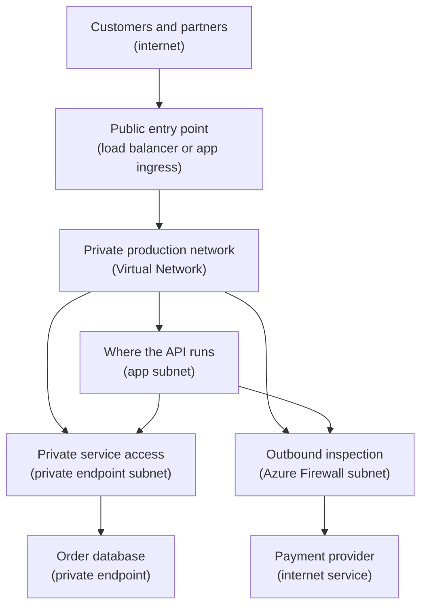

## Table of Contents

1. [The Network Check Before Production](#the-network-check-before-production)
2. [The AWS Translation](#the-aws-translation)
3. [The Production Network In One Picture](#the-production-network-in-one-picture)
4. [Address Space And CIDR](#address-space-and-cidr)
5. [Subnets Are Placement Decisions](#subnets-are-placement-decisions)
6. [System Routes And Custom Routes](#system-routes-and-custom-routes)
7. [Route Tables Belong To Subnets](#route-tables-belong-to-subnets)
8. [What A Route Changes And What It Does Not Change](#what-a-route-changes-and-what-it-does-not-change)
9. [Evidence Before You Blame The App](#evidence-before-you-blame-the-app)
10. [Failure Modes And Fix Directions](#failure-modes-and-fix-directions)
11. [A Practical Design Habit](#a-practical-design-habit)

## The Network Check Before Production

A production app does not only need compute.
It needs a place on the network where other systems can find it, where private dependencies can reach it, and where unwanted traffic has fewer paths to wander through.

That is the job this article teaches.
An Azure Virtual Network is the private network boundary you create inside Azure.
A subnet is a smaller range inside that network where you place resources with the same routing and filtering needs.
A route is an instruction that tells Azure the next hop for traffic leaving a subnet.

Those three ideas sound simple, but they control many production surprises.
If the address range overlaps with another network, peering or private connectivity becomes painful.
If the app lands in the wrong subnet, it may miss the route table, network security group, or private endpoint path it needs.
If a route points to the wrong firewall appliance, the app can lose internet access while the compute resource still looks healthy.

We will follow one service:
`devpolaris-orders-api` is moving into a production Azure network.
The app receives checkout requests, talks to a private database, sends logs, and calls a payment provider on the internet.
The team wants one production network shape that is easy to reason about before any deployment tool creates it.

This article is not a subnet naming checklist.
It is the mental model you use before you click through the portal, write Bicep, or run `az network` commands.
By the end, you should be able to read a VNet, subnet list, and route table and say:
"this traffic leaves from here, matches this route, and should go there next."

> Networking feels less mysterious when you ask where the packet starts, where it wants to go, and which subnet route table gets the first vote.

## The AWS Translation

If you have learned AWS before, Azure networking will feel familiar in the broad shape.
The closest AWS word for an Azure Virtual Network is VPC.
Both give you a private IP space in a cloud region.
Both contain subnets.
Both rely on routing and security rules to decide where traffic can go.

The bridge is useful, but do not turn it into a perfect dictionary.
Azure has its own resource scopes, route behavior, and default routes.
A VNet is an Azure resource that lives in a resource group, subscription, and region.
Subnets are child resources inside that VNet.
Route tables are separate Azure resources that you associate to subnets.

| AWS idea you may know | Azure idea to learn | Careful difference |
|-----------------------|---------------------|--------------------|
| VPC | Virtual Network or VNet | The private network resource in a region |
| VPC CIDR block | VNet address space | A VNet can have one or more address ranges |
| Subnet CIDR | Subnet address range | Subnet ranges must fit inside the VNet address space |
| Route table association | Route table associated to a subnet | In Azure, a route table is not associated to the whole VNet |
| Main route table habit | Azure system routes | Azure automatically creates system routes for every subnet |
| Custom route | User-defined route or UDR | A UDR can override some system routes when associated through a route table |
| Security group | Network security group or NSG | NSGs filter traffic, routes only choose the next hop |

The biggest Azure-specific idea is system routes.
Azure already knows how to route between subnets in the same VNet.
It also creates default routes for internet-bound traffic and private address ranges.
You do not create those system routes yourself.
You add custom routes only when the default path is not the path you want.

The second Azure-specific idea is subnet association.
A route table can exist by itself and do nothing.
It only affects traffic after it is associated to a subnet.
If `devpolaris-orders-api` is in `snet-app-prod`, the route table on `snet-app-prod` matters.
A route table on `snet-data-prod` does not change the app subnet's outbound path.

The third Azure-specific idea is scope.
The VNet, route table, NSG, and subnet all live under Azure Resource Manager.
That means you inspect them by resource group, subscription, region, and resource ID.
When something looks correct in one subscription but the app still fails, always check that you are looking at the same production resource scope.

## The Production Network In One Picture

Before we talk about CIDR math, start with the shape we want.
The orders API does not need every resource in one flat network.
It needs a few clear places.

One subnet can hold the app runtime.
One subnet can hold private endpoint network interfaces for services such as a database.
One subnet can hold an Azure firewall or network virtual appliance if the team wants traffic inspection.
The route table on the app subnet can send internet-bound traffic to that appliance.

Read this diagram from top to bottom.
The plain-English label comes first, and the Azure term follows in parentheses.



The diagram shows the traffic shape, not every subnet control.
Keep the controls beside the picture:

| Control | Where to inspect it | Job |
|---------|---------------------|-----|
| Route table | App subnet association | Sends selected outbound traffic toward the firewall |
| Network security group | App or data subnet association | Allows or denies new connections |
| Private endpoint subnet | Private endpoint network interfaces | Gives managed services private IP doors |

The route table does not sit in the middle like a physical router.
Azure checks the route table when traffic leaves a subnet.
So the route table attached to the app subnet influences packets that start in the app subnet.

For `devpolaris-orders-api`, the first production sketch might use these ranges:

| Network piece | Azure name | Address range | Why it exists |
|---------------|------------|---------------|---------------|
| Production VNet | `vnet-devpolaris-prod-uksouth` | `10.42.0.0/16` | Private address space for this production environment |
| App subnet | `snet-orders-app-prod` | `10.42.1.0/24` | Runtime placement for the orders API |
| Private endpoint subnet | `snet-orders-private-endpoints-prod` | `10.42.2.0/24` | Private network interfaces for managed services |
| Firewall subnet | `AzureFirewallSubnet` | `10.42.100.0/26` | Traffic inspection and controlled outbound path |

The exact numbers are not special by themselves.
The important part is that the VNet gets a larger private range, and each subnet gets a non-overlapping slice of that range.
The slices leave room for future subnets, such as build agents, admin jump hosts, or regional expansion.

## Address Space And CIDR

An address space is the private IP range that belongs to a VNet.
If the VNet is a fenced area on the Azure network, the address space is the range of house numbers allowed inside the fence.
Resources inside the VNet receive private IP addresses from subnet ranges that sit inside that larger address space.

CIDR means Classless Inter-Domain Routing.
That name is not friendly, so treat it as a compact way to write "this block of IP addresses."
In `10.42.0.0/16`, the `10.42.0.0` part is the start of the range, and `/16` says how much of the address stays fixed.
A smaller suffix number gives a larger block.
A larger suffix number gives a smaller block.

For beginner planning, this rough picture is enough:

| CIDR range | Rough size | Common use in this article |
|------------|------------|----------------------------|
| `10.42.0.0/16` | Large environment range | One production VNet |
| `10.42.1.0/24` | Medium subnet range | One app or private endpoint subnet |
| `10.42.100.0/26` | Smaller subnet range | A special subnet with limited growth |

The exact usable IP count depends on platform reservations and service needs, so do not design a subnet where every possible address must be used.
Leave room.
Cloud networks become expensive to redesign when every range is packed tightly.

Overlapping ranges are the mistake to avoid early.
If production Azure uses `10.42.0.0/16`, and the office network or another VNet also uses `10.42.0.0/16`, private connectivity becomes ambiguous.
When a packet wants to reach `10.42.1.15`, which network owns that address?
Both networks claim it.
That is why overlap breaks or blocks peering, VPN, ExpressRoute, and many support conversations.

For `devpolaris-orders-api`, a planning note might look like this:

```text
Production network plan

VNet:
  name: vnet-devpolaris-prod-uksouth
  address space: 10.42.0.0/16

Known connected networks:
  office VPN: 10.10.0.0/16
  shared platform hub: 10.20.0.0/16
  staging Azure VNet: 10.41.0.0/16

Decision:
  10.42.0.0/16 does not overlap with the known connected ranges.
```

This note is simple, but it prevents a painful future.
You want to discover overlap while the network is still a plan, not after a release is blocked by a peering error.

The AWS bridge is direct here.
If you learned to avoid overlapping VPC CIDR blocks before VPC peering or Transit Gateway, keep that habit.
In Azure, apply it to VNets before VNet peering, VPN gateways, ExpressRoute, and hub-and-spoke designs.

## Subnets Are Placement Decisions

A subnet is not only a smaller CIDR range.
It is a placement decision.
When you place a resource in a subnet, you give it the subnet's routing behavior and often the subnet's network security group behavior.

This is why "wrong subnet" is a real production bug.
The app might deploy successfully.
The container might start.
Health checks might even pass locally inside the runtime.
But the app can still fail when it tries to reach a private database or the internet because it inherited the wrong subnet's routes or rules.

For the orders API, a clean subnet plan separates different jobs:

| Subnet | Placed here | What to check |
|--------|-------------|---------------|
| `snet-orders-app-prod` | The API runtime or integration subnet | App outbound routes and NSG rules |
| `snet-orders-private-endpoints-prod` | Private endpoint network interfaces | Database and storage private IPs |
| `AzureFirewallSubnet` | Azure Firewall | Required name for Azure Firewall subnet |
| `GatewaySubnet` | VPN or ExpressRoute gateway when needed | Required name for virtual network gateway subnet |

Some Azure services require a dedicated subnet or a specific subnet shape.
Do not treat every subnet as a generic folder.
Before placing a managed service, check whether the service needs delegation, private endpoints, a reserved subnet name, or a minimum size.

Here is the kind of evidence you want before deploying production:

```bash
$ az network vnet show \
  --resource-group rg-devpolaris-network-prod \
  --name vnet-devpolaris-prod-uksouth \
  --query "{name:name,addressSpace:addressSpace.addressPrefixes,subnets:subnets[].{name:name,prefix:addressPrefix,routeTable:routeTable.id}}" \
  --output json
{
  "name": "vnet-devpolaris-prod-uksouth",
  "addressSpace": [
    "10.42.0.0/16"
  ],
  "subnets": [
    {
      "name": "snet-orders-app-prod",
      "prefix": "10.42.1.0/24",
      "routeTable": "/subscriptions/11111111-2222-3333-4444-555555555555/resourceGroups/rg-devpolaris-network-prod/providers/Microsoft.Network/routeTables/rt-orders-app-prod"
    },
    {
      "name": "snet-orders-private-endpoints-prod",
      "prefix": "10.42.2.0/24",
      "routeTable": null
    }
  ]
}
```

The important field is not just the subnet name.
Look at the prefix and the route table ID.
The app subnet has a route table.
The private endpoint subnet does not in this example.
That may be intentional, but it should never be unknown.

Subnets also sit inside Azure resource scopes.
The VNet and its subnets live in a resource group, subscription, and region.
A route table associated to a subnet must be in the same region and subscription as that VNet.
That is different from thinking of routing as only a network concept.
In Azure, it is also a resource management concept.

## System Routes And Custom Routes

Azure creates system routes for every subnet in a VNet.
That means the platform already has a route table view before you create your own route table resource.
You cannot delete system routes.
You can override some of them with user-defined routes when you need a different path.

The default behavior is intentionally useful.
Subnets inside the same VNet can talk to each other by default, assuming security rules allow it.
Traffic to destinations outside the VNet follows Azure's default routing unless you override it.
If you connect a VNet to another VNet or on-premises network, Azure can add more routes through peering or gateways.

For a beginner, a route has three parts:

| Route part | Plain meaning | Example |
|------------|---------------|---------|
| Address prefix | Destination range this route matches | `0.0.0.0/0` |
| Next hop type | Kind of place Azure sends traffic next | `VirtualAppliance` |
| Next hop IP | Specific appliance IP when needed | `10.42.100.4` |

The address prefix `0.0.0.0/0` means "everything IPv4 unless a more specific route matches first."
It is the default route.
That route is useful, but it is also dangerous when pointed at the wrong next hop.
If all app outbound traffic must go through a firewall, that default route must point to a working firewall path.

Azure chooses routes by destination IP.
The more specific matching prefix wins first.
For example, `10.42.2.0/24` is more specific than `10.42.0.0/16`.
If two routes have the same prefix, Azure prefers a user-defined route over a BGP route, and a BGP route over a system route.

Here is a small route table for the app subnet:

```text
Route table: rt-orders-app-prod

Name                  Address prefix    Next hop type       Next hop IP
default-to-firewall   0.0.0.0/0         VirtualAppliance   10.42.100.4
private-endpoints     10.42.2.0/24      VirtualNetwork     -
```

The first custom route says:
traffic from the app subnet to the internet should go to the firewall first.
The second route says:
traffic to the private endpoint subnet stays inside the VNet.
In many designs, Azure's system route for the VNet already handles that second path.
The explicit route is shown here because it is a useful teaching example, not because every production network needs it.

This is where the AWS comparison needs care.
AWS route tables are often one of the first things you create for public and private subnets.
Azure gives you working system routes first.
You create a UDR when the default path is not good enough, such as forcing internet-bound traffic through an appliance or steering subnet-to-subnet traffic through inspection.

## Route Tables Belong To Subnets

A route table in Azure is a separate resource.
By itself, it is only a list of custom routes.
It starts affecting traffic when you associate it to a subnet.

This detail is small and important:
a route table is not associated to the VNet as a whole.
It is associated to zero or more subnets.
Each subnet can have zero or one route table associated with it.
That means one route table can be reused across several subnets, but one subnet does not stack several route tables.

The orders API team wants only the app subnet to send outbound internet traffic through the firewall.
That means the route table belongs on `snet-orders-app-prod`.
If the route table is accidentally associated only to `snet-orders-private-endpoints-prod`, the app subnet keeps using the default route behavior.

The association command makes that relationship visible:

```bash
$ az network vnet subnet update \
  --resource-group rg-devpolaris-network-prod \
  --vnet-name vnet-devpolaris-prod-uksouth \
  --name snet-orders-app-prod \
  --route-table rt-orders-app-prod

{
  "name": "snet-orders-app-prod",
  "addressPrefix": "10.42.1.0/24",
  "routeTable": {
    "id": "/subscriptions/11111111-2222-3333-4444-555555555555/resourceGroups/rg-devpolaris-network-prod/providers/Microsoft.Network/routeTables/rt-orders-app-prod"
  }
}
```

The output proves the route table association at the subnet level.
When debugging, do not stop at "the route table exists."
Ask which subnet it is associated to.
Then ask whether the app is actually placed in that subnet.

This also affects change safety.
If a shared route table is associated to five subnets, changing one route changes traffic behavior for all five subnets.
That may be useful for consistency.
It may also create a wider blast radius than the person making the change expected.

For a small production service, I usually prefer route tables that match a clear subnet role.
For example, `rt-orders-app-prod` is easier to reason about than `rt-shared-prod-01`.
Shared route tables can work, but the name and ownership need to make the shared impact obvious.

## What A Route Changes And What It Does Not Change

A route changes the next hop for traffic leaving a subnet.
That sentence is the anchor.
It does not say "a route allows traffic."
It does not say "a route creates DNS."
It does not say "a route makes the destination healthy."

If `devpolaris-orders-api` cannot reach the database, a route may be involved.
But the route is only one layer.
The DNS name still has to resolve to the expected IP.
The NSG still has to allow the packet.
The database firewall or private endpoint configuration still has to accept the connection.
The return path still has to work.

Here is the practical split:

| Layer | Question it answers | Example failure |
|-------|---------------------|-----------------|
| DNS | What IP should this name use? | `orders-sql-prod.database.windows.net` resolves to a public IP instead of a private endpoint |
| Route | Where is the next hop for that destination? | `0.0.0.0/0` sends all traffic to a firewall that is down |
| NSG | Is this packet allowed at the subnet or NIC? | Port `5432` or `1433` is denied |
| Destination service | Is the service listening and accepting this client? | Database firewall denies the app subnet |
| App config | Is the app using the right hostname and port? | Production points to a staging database name |

This is why a route fix can make the path correct but still leave the app broken.
Suppose the app calls `https://api.stripe.com`.
The default route sends that traffic to the firewall.
The firewall allows the domain.
But DNS is blocked or misconfigured, so the app cannot resolve the name.
The route is fine.
The name lookup is not.

A realistic app log might look like this:

```text
2026-05-03T09:42:18Z devpolaris-orders-api[prod] error checkout payment call failed
request_id=ord_7f93c2
target=api.payment-provider.example
error=getaddrinfo ENOTFOUND api.payment-provider.example
```

That error is not a route error yet.
`ENOTFOUND` points to name resolution.
Check DNS before changing the route table.

Now compare it with a connection timeout:

```text
2026-05-03T09:47:02Z devpolaris-orders-api[prod] error database connection failed
request_id=ord_2a19bd
target=10.42.2.8:5432
error=connect ETIMEDOUT 10.42.2.8:5432
```

This one deserves a route and NSG check.
The name has already become an IP.
The app is trying to reach a private address.
Now you ask whether traffic from the app subnet to `10.42.2.8` has a valid route, whether an NSG blocks it, and whether the database endpoint accepts it.

## Evidence Before You Blame The App

Good network debugging is evidence-based.
You want to prove placement, route association, effective routes, and security direction before changing application code.
The app may be innocent.
It may simply be standing in the wrong subnet.

Start with the active Azure scope.
This avoids inspecting staging while production is broken:

```bash
$ az account show --query "{name:name,id:id,tenantId:tenantId}" --output json
{
  "name": "sub-devpolaris-prod",
  "id": "11111111-2222-3333-4444-555555555555",
  "tenantId": "aaaaaaaa-bbbb-cccc-dddd-eeeeeeeeeeee"
}
```

Then inspect the subnet where the app is supposed to live:

```bash
$ az network vnet subnet show \
  --resource-group rg-devpolaris-network-prod \
  --vnet-name vnet-devpolaris-prod-uksouth \
  --name snet-orders-app-prod \
  --query "{name:name,addressPrefix:addressPrefix,routeTable:routeTable.id,networkSecurityGroup:networkSecurityGroup.id}" \
  --output json
{
  "name": "snet-orders-app-prod",
  "addressPrefix": "10.42.1.0/24",
  "routeTable": "/subscriptions/11111111-2222-3333-4444-555555555555/resourceGroups/rg-devpolaris-network-prod/providers/Microsoft.Network/routeTables/rt-orders-app-prod",
  "networkSecurityGroup": "/subscriptions/11111111-2222-3333-4444-555555555555/resourceGroups/rg-devpolaris-network-prod/providers/Microsoft.Network/networkSecurityGroups/nsg-orders-app-prod"
}
```

This proves the subnet has both a route table and an NSG.
It does not prove the app is placed there.
You still need to inspect the app runtime or network interface depending on the Azure service you use.

For a virtual machine, the most useful proof is often the effective route table on its network interface:

```bash
$ az network nic show-effective-route-table \
  --resource-group rg-devpolaris-orders-prod \
  --name nic-orders-api-prod-01 \
  --output table
Source    State   Address Prefix    Next Hop Type       Next Hop IP
--------  ------  ----------------  ------------------  -----------
Default   Active  10.42.0.0/16      VNetLocal
User      Active  0.0.0.0/0         VirtualAppliance    10.42.100.4
Default   Active  10.0.0.0/8        None
Default   Active  172.16.0.0/12     None
Default   Active  192.168.0.0/16    None
```

The row to notice is the user route for `0.0.0.0/0`.
It proves internet-bound traffic from that network interface should go to `10.42.100.4`.
If that appliance is wrong, down, or unable to forward traffic, the app will feel like the internet disappeared.

Finally, inspect the route table itself:

```bash
$ az network route-table route list \
  --resource-group rg-devpolaris-network-prod \
  --route-table-name rt-orders-app-prod \
  --output table
Name                 AddressPrefix    NextHopType       NextHopIpAddress
-------------------  ---------------  ----------------  ----------------
default-to-firewall  0.0.0.0/0        VirtualAppliance  10.42.100.4
```

This output is useful because it is small.
It answers one question:
what custom routes did the team add?
You still need effective routes to see the combined result of system routes, BGP routes, and user-defined routes for a specific network interface.

## Failure Modes And Fix Directions

The same few mistakes appear again and again in beginner Azure networks.
They are not signs that you are bad at networking.
They are signs that cloud networking has several layers, and each layer needs its own check.

The first failure is overlapping address space.
It usually appears when the team tries to peer two VNets or connect Azure to an office network.
The error may look like this:

```text
Peering operation failed.
Virtual networks vnet-devpolaris-prod-uksouth and vnet-shared-hub-uksouth
have overlapping address spaces.
```

Do not try to solve this with a route table.
Routes cannot make two networks stop claiming the same addresses.
Fix direction:
choose a non-overlapping VNet address space, rebuild or migrate the affected network, and update the plan so future VNets reserve unique ranges before deployment.

The second failure is the app in the wrong subnet.
The app starts, but outbound traffic does not follow the production route table.
The subnet evidence often exposes it:

```text
Expected:
  app subnet: snet-orders-app-prod
  route table: rt-orders-app-prod

Actual:
  app subnet: snet-default-prod
  route table: null
```

Fix direction:
move or redeploy the app integration into the intended subnet.
For services that cannot move between subnets in place, plan a redeployment.
Then verify the route table and NSG on the subnet before sending traffic.

The third failure is a route table that exists but is not associated.
The team created `rt-orders-app-prod`, and the route list looks perfect.
The app still uses default routing because the subnet does not reference that route table.

```bash
$ az network vnet subnet show \
  --resource-group rg-devpolaris-network-prod \
  --vnet-name vnet-devpolaris-prod-uksouth \
  --name snet-orders-app-prod \
  --query "routeTable.id" \
  --output tsv

```

The empty output is the clue.
Fix direction:
associate the route table to the subnet that contains the source resources.
Then check effective routes from a real network interface or service-specific network view.

The fourth failure is a default route through the wrong appliance.
This is common when a team forces `0.0.0.0/0` through a firewall for inspection.
One wrong IP address can break every outbound call from the subnet.

```text
Route table: rt-orders-app-prod

Name                  Address prefix    Next hop type       Next hop IP
default-to-firewall   0.0.0.0/0         VirtualAppliance   10.42.200.4

Expected firewall IP:
  10.42.100.4
```

Fix direction:
correct the next hop IP, confirm the appliance is in a reachable subnet, and confirm IP forwarding or appliance forwarding is enabled when the design needs it.
Also check for routing loops.
An appliance should not usually sit in the same subnet whose route table sends traffic through that appliance.

The fifth failure is "the route is right, but something else blocks."
This is the one that wastes the most time.
The route points to the correct private endpoint or firewall, but NSG, DNS, service firewall, or app config still prevents the connection.

```text
Route check:
  10.42.2.8 matched 10.42.0.0/16 with next hop VNetLocal

NSG check:
  outbound deny matched destination port 5432

App symptom:
  connect ETIMEDOUT 10.42.2.8:5432
```

Fix direction:
keep the route, then inspect the next layer.
For NSG, allow the required source, destination, port, and protocol.
For DNS, make sure the app resolves the service name to the expected private IP.
For managed services, check the service firewall or private endpoint approval state.

The sixth failure is changing a shared route table without noticing every associated subnet.
A route table attached to several subnets can be a good standard.
It can also turn a small change into a large outage.

```text
Route table:
  rt-shared-prod-egress

Associated subnets:
  snet-orders-app-prod
  snet-billing-app-prod
  snet-admin-tools-prod

Change:
  default route next hop changed from 10.42.100.4 to 10.42.100.9
```

Fix direction:
inspect subnet associations before changing a route.
If only the orders API needs the change, create or use a route table with a narrower owner and associate it only to the intended subnet.

## A Practical Design Habit

The tradeoff in Azure network design is between simple defaults and controlled paths.
If you use only system routes, the network is easier to start with and easier to read.
Azure routes between subnets and toward common destinations without much setup.
The cost is that traffic may not pass through the inspection or egress controls your production environment expects.

If you add custom routes, you gain control over the next hop.
You can send internet traffic through a firewall.
You can force subnet-to-subnet traffic through an appliance.
You can shape a hub-and-spoke network more deliberately.
The cost is operational responsibility.
Every custom route becomes something you must name, associate, review, and troubleshoot.

For `devpolaris-orders-api`, a good beginner design habit is to write a short network intent before implementation:

```text
Network intent for devpolaris-orders-api production

VNet:
  vnet-devpolaris-prod-uksouth uses 10.42.0.0/16.

Placement:
  The API runtime belongs in snet-orders-app-prod.
  Private endpoints belong in snet-orders-private-endpoints-prod.
  Firewall resources belong in AzureFirewallSubnet.

Routing:
  The app subnet uses rt-orders-app-prod.
  Internet-bound traffic from the app subnet goes to 10.42.100.4.
  Traffic to private endpoint addresses stays inside the VNet.

Checks:
  The VNet range does not overlap with connected networks.
  The app is actually integrated with the app subnet.
  The route table is associated to the app subnet.
  NSG and DNS checks are separate from route checks.
```

That note is not busywork.
It is the simplest form of design review.
It gives a junior engineer, a platform engineer, and an incident responder the same map.

When you are unsure, return to four questions:
where is the source resource placed, what destination IP is it trying to reach, which route wins for traffic leaving that subnet, and what security or DNS layer might still block it?
Those questions are enough to make most VNet, subnet, and route problems smaller.

---

**References**

- [What is Azure Virtual Network?](https://learn.microsoft.com/en-us/azure/virtual-network/virtual-networks-overview) - Microsoft Learn overview of VNets, communication paths, filtering, routing, and service integration.
- [Azure virtual network traffic routing](https://learn.microsoft.com/en-us/azure/virtual-network/virtual-networks-udr-overview) - Microsoft Learn guide to system routes, user-defined routes, next hop types, and route selection.
- [Create, change, or delete an Azure route table](https://learn.microsoft.com/en-us/azure/virtual-network/manage-route-table) - Microsoft Learn operations guide for viewing route tables and associating them to subnets.
- [Plan virtual networks](https://learn.microsoft.com/en-us/azure/virtual-network/virtual-network-vnet-plan-design-arm) - Microsoft Learn planning guide for address spaces, subnets, segmentation, security, routing, and connectivity.
