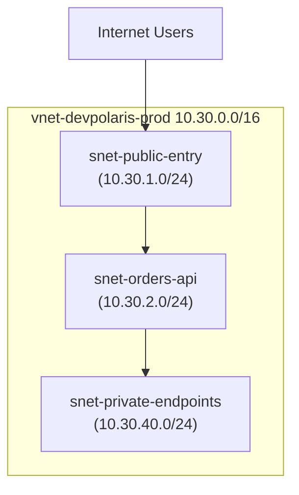
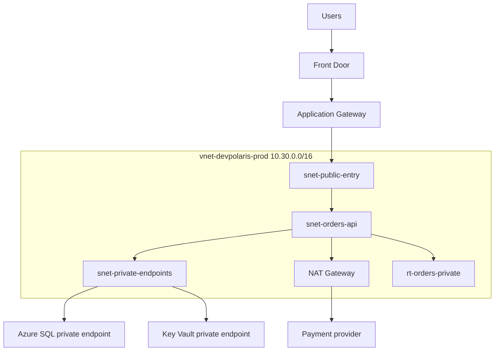

## Table of Contents

1. [Private Network Isolation: The Virtual Network Spine](#private-network-isolation-the-virtual-network-spine)
2. [Address Space](#address-space)
3. [Subnets and Address Masking](#subnets-and-address-masking)
4. [The Five Reserved IP Addresses](#the-five-reserved-ip-addresses)
5. [Route Tables](#route-tables)
6. [Routing Engines and Prefix Matching](#routing-engines-and-prefix-matching)
7. [System Routes](#system-routes)
8. [User-Defined Routes](#user-defined-routes)
9. [NAT Gateway and SNAT Port Exhaustion](#nat-gateway-and-snat-port-exhaustion)
10. [Sample Topology](#sample-topology)
11. [Putting It All Together](#putting-it-all-together)
12. [What's Next](#whats-next)

## Private Network Isolation: The Virtual Network Spine

An Azure Virtual Network (VNet) is the fundamental private security boundary that isolates and hosts your cloud infrastructure workloads in a specific geographic region.

To understand why this is the primary boundary of your infrastructure, you must understand the physical reality of a cloud datacenter. An Azure datacenter is a massive complex containing tens of thousands of physical server blades cabled to shared high-speed network switches. If you deploy a virtual machine or a container directly onto this physical network, your workload shares the same hardware interfaces and wire channels as every other company hosted in that facility.

Azure Virtual Network solves this physical sharing problem by establishing a highly secure **software-defined networking (SDN) overlay fabric**. 

When you provision a VNet, the Azure controller creates an isolated, logical namespace dedicated strictly to your resources. Under the hood, this SDN overlay encapsulates all data packets flowing between your virtual machines. The physical hypervisor hosts wrap your private packet bytes inside an outer network encapsulation header (typically using protocols like VXLAN or NVGRE). 

This encapsulation makes your network traffic completely invisible and unreachable to other tenants sharing the same physical blades, wires, and switches. It effectively creates a private, logical hardware environment dedicated strictly to your cloud services, serving as the spine onto which all subsequent firewall rules, gateways, and load balancers are cabled.

If you are coming from AWS, a VNet is the closest Azure equivalent to an AWS VPC. While they solve the same isolation requirements, their subnets are designed differently. In AWS, a subnet is physically bound to exactly one Availability Zone (AZ). 

In Azure, a VNet and its subnets span **all Availability Zones** globally inside the chosen region. A zonal virtual machine is still pinned to a single physical zone at deployment, but it sits within a unified subnet that spans multiple facilities. This difference simplifies your network drawings: you do not need to create separate public or private subnets for every zone just to maintain high availability. The subnet represents a logical role boundary, not a physical facility boundary.



## Address Space

Every VNet has one or more address spaces, such as `10.30.0.0/16`. This range is the private IP space from which subnets are carved.

Address space feels like setup work, but it becomes a future connectivity decision. A VNet can later peer with another VNet, connect to a hub network, or connect to an on-premises network through VPN or ExpressRoute. Those private networks need non-overlapping ranges. If two connected networks both use `10.0.0.0/16`, routing cannot cleanly decide which side owns a destination address.

For the orders platform, `10.30.0.0/16` is the production VNet range:

| Choice | Example | Why it matters |
| --- | --- | --- |
| VNet address space | `10.30.0.0/16` | Leaves room for multiple subnets and future growth. |
| Subnet range | `10.30.2.0/24` | Gives one workload role its own placement area. |
| Non-overlap | Avoid `10.30.0.0/16` elsewhere | Keeps peering and hybrid routing possible later. |
| Reserved room | Keep unused ranges | Leaves space for private endpoints, gateways, and new tiers. |

The practical habit is to record why the range was chosen. A neat-looking range is not enough. The range should fit the current workload and avoid future networks the platform is likely to connect.

## Subnets and Address Masking

A subnet is a smaller, contiguous block of IP addresses carved out of your parent VNet address space. It acts as both a logical workspace and an administrative boundary. Resources that perform different operational jobs should be isolated in separate subnets, allowing you to attach granular security filters (NSGs) and routing rules (UDRs) to each specific subnet role.

When planning subnets, you utilize Classless Inter-Domain Routing (CIDR) notation to define address masks. For example, a VNet address space of `10.30.0.0/16` contains $65,536$ unique IP addresses ($2^{16}$). If you carve this VNet into `/24` subnets (such as `10.30.2.0/24`), each subnet contains $256$ IP addresses ($2^{8}$).

To maintain a clean database and separate workload roles, you allocate subnets based on operational tiers:

*   **`snet-public-entry`**: Houses L7 reverse proxies (like Application Gateway) that receive direct user traffic.
*   **`snet-orders-api`**: Dedicated strictly to private microservice compute tiers (such as App Services or Container Apps).
*   **`snet-private-endpoints`**: Houses private IP interfaces for managed Azure PaaS services (such as SQL databases and Key Vaults).

One critical Azure-specific gotcha is **Subnet Delegation**. Some services, such as Azure Container Apps environments, App Service VNet integration adapters, or managed SQL instances, require exclusive control over the subnet they reside in. When you delegate a subnet to a service (such as `Microsoft.App/environments`), ARM blocks you from deploying other resource types (like standard VMs or network interfaces) into that subnet. Plan your subnet delegations and size allocations carefully before placing resources, because changing a busy subnet later is an expensive control plane transaction.

## The Five Reserved IP Addresses

For engineers transitioning from other environments, the most important subnet gotcha is the reservation of IP addresses. In standard networking, a subnet has exactly two reserved IP addresses: the network address (first address) and the broadcast address (last address).

> [!IMPORTANT]
> **Azure reserves exactly five IP addresses** in every single subnet you create. If you provision a `/24` subnet (which theoretically has $256$ IP addresses), only **$251$ addresses** are available for your resources.

These reserved coordinates are allocated to specific, mandatory system services under the hood:

1.  **First Address (`.0` - Network Address)**: Reserved by RFC standards to identify the subnet address space in routing tables.
2.  **Second Address (`.1` - Default Gateway)**: Allocated to the virtual gateway router interface that manages traffic routing between your subnets.
3.  **Third Address (`.2` - Azure DNS Service)**: Maps to the local Azure DNS recursive resolver daemon. This provides automatic name resolution for your VNet resources and private DNS zones.
4.  **Fourth Address (`.3` - Wire Server IP)**: Map to the internal Azure host-infrastructure wire server. This coordinate is used by Azure host agents, metadata daemons, and internal status monitors to coordinate hypervisor health.
5.  **Fifth Address (`.255` - Broadcast Address)**: Reserved by RFC standards for broadcast traffic, though the Azure software-defined network switch drops broadcast traffic by default.

This reservation rule is especially critical when designing small subnets (like `/28` blocks which contain only $16$ addresses). After subtracting the five reserved coordinates, only $11$ IP addresses remain, which can cause deployment failures if your container scaling rules exceed this limit.

## Route Tables

A route tells Azure the next hop for traffic leaving a subnet. A route table is the Azure resource where you put custom routes. The route table matters only after it is associated with a subnet.

The route question is plain:

```text
When traffic leaves snet-orders-api for this destination address, which route wins and what is the next hop?
```

That question catches many production mistakes. If `orders-api` calls a payment provider, the default route may send that traffic to the internet through Azure's default behavior, through a NAT Gateway, or through a firewall appliance. If `orders-api` calls a private endpoint, a more specific private route should keep that traffic inside the VNet path.

| Route table | Associated subnet | Destination | Next hop | Meaning |
| --- | --- | --- | --- | --- |
| `rt-orders-private` | `snet-orders-api` | `10.30.0.0/16` | VNet local | Traffic inside the VNet stays local. |
| `rt-orders-private` | `snet-orders-api` | `10.30.40.0/24` | VNet local | Private endpoint subnet stays reachable directly. |
| `rt-orders-private` | `snet-orders-api` | `0.0.0.0/0` | Firewall or NAT path | General outbound traffic uses the approved exit. |

The table is not a complete production design. It is a way to read intent. For each subnet, ask which destinations are local, which destinations go to an inspection device, and which destinations use a managed outbound path.

## Routing Engines and Prefix Matching

To design a robust network, you must understand the physical packet-forwarding mechanism implemented by the Azure hypervisors. When your container app transmits an IP packet, the local hypervisor host intercepts the packet at the virtual switch level before it hits any physical cable. The hypervisor's routing engine immediately parses the packet's destination IP address and queries the effective routing table associated with the source subnet.

The routing engine resolves conflicts using a strict **Longest Prefix Match (LPM)** algorithm. Under LPM, the engine matches the destination IP against the most specific CIDR prefix available in its table.

Suppose your route table contains two rules:
1.  **Rule A**: `10.30.0.0/16` -> Next Hop: `Virtual Network (VNet Local)`
2.  **Rule B**: `10.30.40.0/24` -> Next Hop: `Virtual Appliance (Firewall)`

If the container app sends a packet to `10.30.40.7` (a private endpoint address), the routing engine compares the destination to both prefixes. Because the `/24` prefix is more specific than the `/16` prefix, the LPM algorithm selects **Rule B** as the winner. The packet is routed directly to the firewall for inspection, completely bypassing the local VNet route. 

Understanding LPM is vital for diagnosing network connectivity; if a routing path is blocked, the cause is usually an unexpected, highly specific prefix rule taking priority.

## System Routes

Azure creates system routes automatically. You do not need to add a route for basic communication between subnets in the same VNet. Azure already knows how to route within the VNet address space.

Azure also has default routes for internet-bound traffic and for private address ranges that are not part of your VNet. The important beginner habit is to inspect the effective route alongside the route table you created. Effective routes combine system routes, custom routes, peering routes, gateway routes, service endpoint routes, and other platform-added routes.

This is where Azure differs from a simple whiteboard. A subnet can have routes you did not type into the route table. VNet peering can add routes. A gateway can propagate routes. Service endpoints can add service routes. A custom route can override some defaults.

For the orders API, the review should include:

```text
Subnet: snet-orders-api
Expected local range: 10.30.0.0/16
Expected private endpoint range: 10.30.40.0/24
Expected outbound default: approved egress path
Unexpected route: anything sending private service traffic to the wrong next hop
```

That evidence prevents a familiar waste of time: changing app settings while the subnet is sending packets to a next hop that cannot forward them.

## User-Defined Routes

A user-defined route, often called a UDR, is a custom route you add to a route table. UDRs are common when a team wants traffic to pass through a firewall, network virtual appliance, hub, or other inspection point.

The power is useful and dangerous. A single `0.0.0.0/0` UDR can move most outbound traffic from a subnet through a new next hop. If that next hop is wrong, unhealthy, missing IP forwarding, or unable to return traffic, many unrelated app symptoms can appear at once.

The route creates an operational dependency:

```text
Route: 0.0.0.0/0 -> 10.30.0.4
Meaning: traffic leaves through the firewall appliance
Hidden dependency: the appliance must be healthy, forwarding, and allowed to send return traffic
```

Use UDRs when the next hop is part of the design, not as a quick way to make a symptom disappear. Before adding one, write the packet path, the next hop, the return path, and the failure behavior.

## NAT Gateway and SNAT Port Exhaustion

A secure private subnet has no direct public inbound path. However, workloads inside the private subnet (like `snet-orders-api`) still need outbound internet access to call external payment APIs, download container updates, or stream telemetry. 

**Azure NAT Gateway** provides a fully managed Source Network Address Translation (SNAT) service that gives your private subnet a highly resilient outbound internet exit without exposing resources to public inbound attacks.

Under the hood, when a container app initiates a connection to an external API, the host hypervisor routes the packet to the NAT Gateway. The NAT Gateway dynamically translates the container's private IP (`10.30.2.7`) to its own assigned public IP (`52.174.12.34`), allocating a random outbound ephemeral port to handle the connection:

```text
Container Connection: 10.30.2.7:5000 ───> NAT Gateway ───> Translated Connection: 52.174.12.34:1024
```

This translation is crucial, but it introduces a major system limit: **SNAT Port Exhaustion**. Every public IP address assigned to a NAT Gateway provides exactly $64,000$ concurrent SNAT ports. If your microservice code is poorly written (e.g. initiating thousands of outbound HTTP requests without utilizing connection pooling or TCP reuse), the NAT Gateway can quickly consume all available ports.

When this limit is reached, subsequent outbound TCP handshakes are dropped at the gateway, returning generic "Connection Timeout" errors to your application code. 

To mitigate this under high concurrent load, you must implement persistent HTTP connection pools inside your application code and assign multiple public IP addresses to your NAT Gateway to multiply the available SNAT port pool.

## Sample Topology

Here is the small topology the rest of the networking module will keep using:



The diagram separates jobs. Front Door and Application Gateway are public-entry topics. Network security groups decide which packet flows are allowed. Private endpoints and DNS decide how the app reaches managed services privately. This article owns the foundation under those choices: VNet, subnets, routes, and outbound path.

## Putting It All Together

Return to the VNet design coordinates. Operating a secure, resilient cloud network requires absolute control over your private topological boundaries:

*   **Enforce SDN Isolation**: Build virtual networks to establish logical overlay boundaries, keeping your raw packet data encapsulated away from other cloud tenants.
*   **Account for Reserved Addresses**: Remember that Azure reserves exactly five IP addresses in every subnet, leaving fewer available slots in narrow CIDR blocks.
*   **Audit LPM Routing**: Understand that the hypervisor evaluates destination prefixes using Longest Prefix Match (LPM), which dictates which custom routes override defaults.
*   **Deploy NAT Gateways for Egress**: Secure private subnets with NAT Gateways to handle outbound internet connections safely, monitoring SNAT port allocations to prevent timeouts.
*   **Partition by Role**: Structure your VNet into dedicated subnets based on operational tiers, paving the way for granular packet filters and private service links.

## What's Next

Topology gives packets a possible path. It does not decide whether the packets are allowed. The next article covers the Azure packet filter you will read most often: network security groups.

---

**References**

* [What is Azure Virtual Network?](https://learn.microsoft.com/en-us/azure/virtual-network/virtual-networks-overview) - Architectural overview of VNets and subnets.
* [Virtual network traffic routing](https://learn.microsoft.com/en-us/azure/virtual-network/virtual-networks-udr-overview) - Detailed reference for route evaluation and effective tables.
* [NAT Gateway SNAT Port Allocation](https://learn.microsoft.com/en-us/azure/nat-gateway/nat-overview) - Technical mechanics of SNAT translation and port boundaries.
