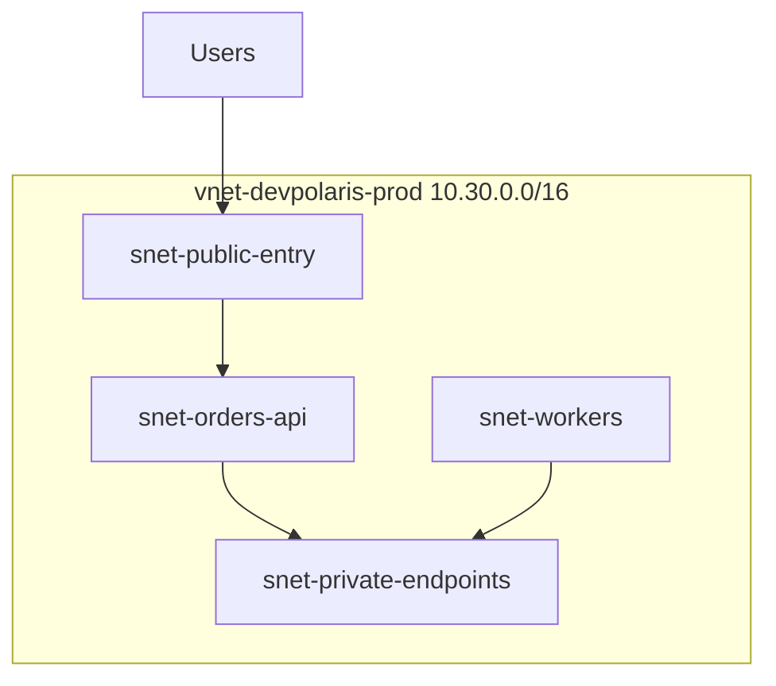
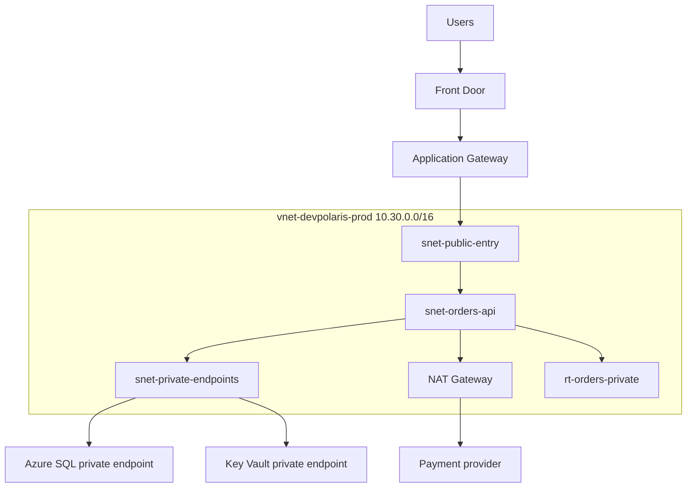

## Table of Contents

1. [The Problem](#the-problem)
2. [What Is a VNet](#what-is-a-vnet)
3. [Address Space](#address-space)
4. [Subnets](#subnets)
5. [Route Tables](#route-tables)
6. [System Routes](#system-routes)
7. [User-Defined Routes](#user-defined-routes)
8. [NAT Gateway](#nat-gateway)
9. [Sample Topology](#sample-topology)
10. [Putting It All Together](#putting-it-all-together)
11. [What's Next](#whats-next)

## The Problem

The orders API moves from a demo into Azure. The app runs, the database exists, the Key Vault secret is ready, and the deployment pipeline is green. Then production traffic starts and the team cannot explain where the packets go.

- The API calls Azure SQL, but nobody knows whether that request uses a private path or a public service endpoint.
- A new firewall route is added, and checkout starts timing out even though the app containers are healthy.
- A second environment needs to connect later, and the chosen address range overlaps with another network.
- The app needs outbound internet access for a payment provider, but the team cannot say which subnet owns that exit.

This article is about the first shape you give an Azure network so those questions have clear answers. The shape is not a firewall rule yet. It is topology: where the private network boundary is, which address ranges belong to it, where workloads sit, and which route a subnet uses when traffic leaves.

The working mental model is simple: create a Virtual Network for the private application area, divide it into subnets by job, associate route tables intentionally, and make outbound paths explicit.

## What Is a VNet

An Azure Virtual Network, usually shortened to VNet, is the private network boundary you create for Azure resources in one region. It gives resources private IP addresses, lets those resources communicate with each other, and gives you places to attach routing and packet controls.

If you learned AWS first, a VNet is the closest Azure equivalent to a VPC. The comparison is useful, but do not copy every AWS detail directly. In AWS, a subnet belongs to one Availability Zone. In Azure, a VNet and its subnets span the availability zones in the region. A zonal virtual machine still lands in a zone, but you do not create separate Azure subnets just because you use separate zones.

That difference changes the topology drawing. The Azure subnet is usually a role boundary, not an AZ boundary. You might create `snet-public-entry`, `snet-orders-api`, `snet-workers`, and `snet-private-endpoints`. The zone placement of compute resources is handled by the compute service and its zone settings.



The VNet also creates the place where later networking choices attach. Network security groups can filter packet flows. Route tables can change next hops. NAT Gateway can provide outbound internet access. Private endpoints can give managed services private addresses inside the VNet. Without a deliberate VNet shape, all of those choices become harder to review.

## Address Space

Every VNet has one or more address spaces, such as `10.30.0.0/16`. That range is the private IP space from which subnets are carved.

Address space feels like setup work, but it becomes a future connectivity decision. A VNet can later peer with another VNet, connect to a hub network, or connect to an on-premises network through VPN or ExpressRoute. Those private networks need non-overlapping ranges. If two connected networks both use `10.0.0.0/16`, routing cannot cleanly decide which side owns a destination address.

For the orders platform, `10.30.0.0/16` is the production VNet range:

| Choice | Example | Why it matters |
| --- | --- | --- |
| VNet address space | `10.30.0.0/16` | Leaves room for multiple subnets and future growth. |
| Subnet range | `10.30.2.0/24` | Gives one workload role its own placement area. |
| Non-overlap | Avoid `10.30.0.0/16` elsewhere | Keeps peering and hybrid routing possible later. |
| Reserved room | Keep unused ranges | Leaves space for private endpoints, gateways, and new tiers. |

The practical habit is to record why the range was chosen. A neat-looking range is not enough. The range should fit the current workload and avoid future networks the platform is likely to connect.

## Subnets

A subnet is a smaller address range inside the VNet. It is also a placement boundary. Many Azure resources land in or integrate with a subnet, and the subnet can carry route tables, network security groups, delegations, and service endpoint settings.

For beginners, the subnet is the place where a workload inherits network behavior.

| Subnet | What belongs there | Network behavior to review |
| --- | --- | --- |
| `snet-public-entry` | Application Gateway or other regional entry components | Public entry, health probes, backend routes. |
| `snet-orders-api` | API compute or delegated app environment | Private app traffic, outbound route, NSG rules. |
| `snet-workers` | Background workers | Private service calls and outbound dependencies. |
| `snet-private-endpoints` | Private endpoint network interfaces | Private IPs for Key Vault, SQL, Storage, and similar services. |

Names help humans, but Azure uses configuration. A subnet named `private` can still have a route that sends outbound traffic to the internet. A subnet named `data` can still be too broad if unrelated services share it. The route table, network security group, and service integration settings make the name true.

One Azure-specific gotcha is subnet delegation. Some services, such as Azure Container Apps environments or App Service VNet integration paths, may require or use dedicated subnet behavior. Plan subnet purpose before placing resources, because changing a busy subnet later is harder than drawing the shape clearly at the start.

## Route Tables

A route tells Azure the next hop for traffic leaving a subnet. A route table is the Azure resource where you put custom routes. The route table matters only after it is associated with a subnet.

The route question is plain:

```text
When traffic leaves snet-orders-api for this destination address, which route wins and what is the next hop?
```

That question catches many production mistakes. If `orders-api` calls a payment provider, the default route may send that traffic to the internet through Azure's default behavior, through a NAT Gateway, or through a firewall appliance. If `orders-api` calls a private endpoint, a more specific private route should keep that traffic inside the VNet path.

| Route table | Associated subnet | Destination | Next hop | Meaning |
| --- | --- | --- | --- | --- |
| `rt-orders-private` | `snet-orders-api` | `10.30.0.0/16` | VNet local | Traffic inside the VNet stays local. |
| `rt-orders-private` | `snet-orders-api` | `10.30.40.0/24` | VNet local | Private endpoint subnet stays reachable directly. |
| `rt-orders-private` | `snet-orders-api` | `0.0.0.0/0` | Firewall or NAT path | General outbound traffic uses the approved exit. |

The table is not a complete production design. It is a way to read intent. For each subnet, ask which destinations are local, which destinations go to an inspection device, and which destinations use a managed outbound path.

## System Routes

Azure creates system routes automatically. You do not need to add a route for basic communication between subnets in the same VNet. Azure already knows how to route within the VNet address space.

Azure also has default routes for internet-bound traffic and for private address ranges that are not part of your VNet. The important beginner habit is to inspect the effective route alongside the route table you created. Effective routes combine system routes, custom routes, peering routes, gateway routes, service endpoint routes, and other platform-added routes.

This is where Azure differs from a simple whiteboard. A subnet can have routes you did not type into the route table. VNet peering can add routes. A gateway can propagate routes. Service endpoints can add service routes. A custom route can override some defaults.

For the orders API, the review should include:

```text
Subnet: snet-orders-api
Expected local range: 10.30.0.0/16
Expected private endpoint range: 10.30.40.0/24
Expected outbound default: approved egress path
Unexpected route: anything sending private service traffic to the wrong next hop
```

That evidence prevents a familiar waste of time: changing app settings while the subnet is sending packets to a next hop that cannot forward them.

## User-Defined Routes

A user-defined route, often called a UDR, is a custom route you add to a route table. UDRs are common when a team wants traffic to pass through a firewall, network virtual appliance, hub, or other inspection point.

The power is useful and dangerous. A single `0.0.0.0/0` UDR can move most outbound traffic from a subnet through a new next hop. If that next hop is wrong, unhealthy, missing IP forwarding, or unable to return traffic, many unrelated app symptoms can appear at once.

The route creates an operational dependency:

```text
Route: 0.0.0.0/0 -> 10.30.0.4
Meaning: traffic leaves through the firewall appliance
Hidden dependency: the appliance must be healthy, forwarding, and allowed to send return traffic
```

Use UDRs when the next hop is part of the design, not as a quick way to make a symptom disappear. Before adding one, write the packet path, the next hop, the return path, and the failure behavior.

## NAT Gateway

Private workloads often need outbound internet access. They may call a payment provider, download packages, pull images, or send telemetry. NAT Gateway gives a subnet a managed outbound source address path without making the workloads themselves public inbound targets.

The direction matters. NAT Gateway helps workloads start outbound connections. It does not create a public entry point into the subnet. Users should still enter through a public HTTP entry service such as Front Door or Application Gateway when the app is web-facing.

NAT Gateway is also a design choice with cost and port-capacity implications. It is cleaner than letting every resource carry its own public IP, but it should be placed deliberately on the subnets that need managed outbound access. Some private Azure service traffic may be better served by private endpoints or service endpoints instead of general NAT egress.

For `orders-api`, the question is practical:

| Destination | Better path |
| --- | --- |
| Payment provider API | Managed outbound internet path, often NAT or firewall egress. |
| Azure SQL private endpoint | VNet private path, not NAT. |
| Key Vault private endpoint | VNet private path plus private DNS. |
| Blob Storage private endpoint | VNet private path plus private DNS. |

Do not use NAT as a substitute for private service connectivity. NAT is an outbound internet answer. Private endpoints and service endpoints answer a different question.

## Sample Topology

Here is the small topology the rest of the networking module will keep using:



The diagram separates jobs. Front Door and Application Gateway are public-entry topics. Network security groups decide which packet flows are allowed. Private endpoints and DNS decide how the app reaches managed services privately. This article owns the foundation under those choices: VNet, subnets, routes, and outbound path.

## Putting It All Together

Return to the opening problem. The orders API was healthy, but nobody could explain where traffic went. The VNet design gives that conversation a shape:

- The VNet creates the private network boundary.
- The address space leaves room for subnets and future connections.
- Subnets group resources by network job.
- Route tables make subnet exits reviewable.
- System routes exist even before you add custom routes.
- User-defined routes can redirect traffic through inspection points.
- NAT Gateway gives selected subnets managed outbound internet access.

The useful review sentence is now small:

```text
orders-api runs in snet-orders-api, uses rt-orders-private, reaches private endpoints in snet-private-endpoints, and uses the approved outbound path only for external dependencies.
```

That sentence does not solve every network problem. It makes the next layer readable.

## What's Next

Topology gives packets a possible path. It does not decide whether the packets are allowed. The next article covers the Azure packet filter you will read most often: network security groups.

---

**References**

- [What is Azure Virtual Network?](https://learn.microsoft.com/en-us/azure/virtual-network/virtual-networks-overview)
- [Azure virtual network traffic routing](https://learn.microsoft.com/en-us/azure/virtual-network/virtual-networks-udr-overview)
- [What is Azure NAT Gateway?](https://learn.microsoft.com/en-us/azure/nat-gateway/nat-overview)
