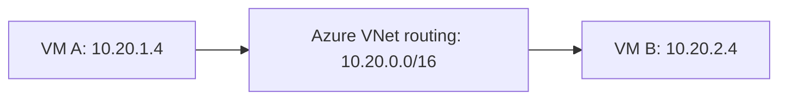
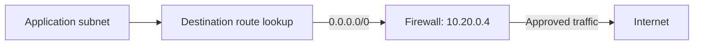
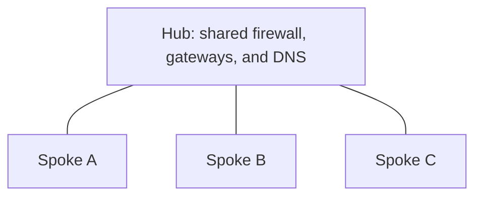

## Table of Contents

1. [What Does a VNet Do?](#what-does-a-vnet-do)
2. [How Do Regions, Address Spaces, and Subnets Shape It?](#how-do-regions-address-spaces-and-subnets-shape-it)
3. [How Do Routes Decide Packet Paths?](#how-do-routes-decide-packet-paths)
4. [When Do User-Defined Routes Change Those Paths?](#when-do-user-defined-routes-change-those-paths)
5. [How Should Outbound Access Work?](#how-should-outbound-access-work)
6. [How Do NAT Gateway and SNAT Affect Connections?](#how-do-nat-gateway-and-snat-affect-connections)
7. [How Do VNets Connect to Other Networks?](#how-do-vnets-connect-to-other-networks)
8. [What Does a Production VNet Look Like?](#what-does-a-production-vnet-look-like)
9. [Check Your Answers](#check-your-answers)
10. [References](#references)

Two computers have private addresses: `10.0.1.4` and `10.0.1.5`. The first wants to send a packet to the second. Writing the destination into the packet is only the beginning. Something has to know where that address lives, choose a path to it, and decide whether to allow the traffic.

In Azure, a **Virtual Network**, or **VNet**, supplies the private network in which those decisions make sense. You define its address range, and Azure's software-defined networking delivers traffic using addresses and routes. You can understand the rest of the design by following what happens to a packet as it stays inside that network or leaves for another destination.

The questions below follow that progression, from giving machines private addresses to checking whether a reply can get back:

1. **What Does a VNet Do?**
2. **How Do Regions, Address Spaces, and Subnets Shape It?**
3. **How Do Routes Decide Packet Paths?**
4. **When Do User-Defined Routes Change Those Paths?**
5. **How Should Outbound Access Work?**
6. **How Do NAT Gateway and SNAT Affect Connections?**
7. **How Do VNets Connect to Other Networks?**
8. **What Does a Production VNet Look Like?**

## What Does a VNet Do?
<!-- section-summary: A VNet defines a private address namespace, routing domain, and isolation boundary inside an Azure region. -->

A packet carries a source address and a destination address. For the two computers in the introduction, those values are `10.0.1.4` and `10.0.1.5`. The source identifies where this packet starts; the destination identifies where it needs to go. The network must locate that destination, determine a usable path, apply the relevant security policy, and perform address translation if the path requires it.

A physical datacenter uses switches, routers, firewalls, cables, VLANs, and NAT devices to do these jobs. A VLAN is a way of separating networks on shared physical networking equipment. A NAT device translates addresses as traffic crosses a boundary. Azure implements much of this networking behavior in software. Declaring a VNet with the range `10.0.0.0/16` gives that software the information needed to provide your private network without asking you to install its physical routers or cables.

There are three parts to the VNet model. Its **address namespace** identifies which private addresses belong to the network. Its **routing domain** provides the context for choosing packet paths. Its **isolation boundary** keeps separately created VNets apart until you deliberately connect them. These parts belong together: an address has to mean something within a particular network before Azure can route traffic to it. Microsoft describes this software-defined private network and its default internal connectivity in the [VNet design guide][1].

For example, `production-vnet` can own `10.20.0.0/16`, covering addresses from `10.20.0.0` through `10.20.255.255`. You might divide that address space into web, application, data, and private-endpoint subnets. Each subnet draws its addresses from the enclosing VNet.

Now place VM A at `10.20.1.4` and VM B at `10.20.2.4`. They occupy different subnets, but both addresses belong to `10.20.0.0/16`. Azure's network fabric can carry a packet from one to the other without sending it across the public internet. Azure supplies system routes for destinations inside the VNet address space; you do not need to build a public connection between these two machines. [Azure's routing documentation][2] explains those automatically created routes.

This is a useful starting point because the portal's resource hierarchy only shows part of the story. A VNet does more than group resources visually. It defines how private addresses belong together and gives Azure a routing context for the traffic between them. Later controls can allow or deny a flow, but first Azure needs to know which network contains its destination.

```mermaid
flowchart LR
    a["VM A: 10.20.1.4"] --> r["Azure VNet routing: 10.20.0.0/16"]
    r --> b["VM B: 10.20.2.4"]
    class a,b workload
    class r control
```

The diagram shows a private path, not a guarantee that every application connection succeeds. Routing provides a possible route to the machine. Packet filtering and the receiving application still have their own responsibilities. Keeping those responsibilities separate will matter when we diagnose a failed connection.

## How Do Regions, Address Spaces, and Subnets Shape It?
<!-- section-summary: A regional VNet needs non-overlapping address space and subnets sized for platform reservations and maximum concurrent workloads. -->

A VNet belongs to one Azure region. A network named `production-uk-vnet` in UK South can span availability zones within that region, but it remains a regional network. Resources in West Europe use a different VNet. If they need private communication with the UK South network, you create an explicit connection, such as global VNet peering. Regional scope and availability-zone support are described in the [VNet design guide][1].

### Read the address range

The suffix in `10.20.0.0/16` is **CIDR notation**. An IPv4 address contains 32 bits. The `/16` fixes the first 16 bits as the network portion and leaves 16 bits for addresses inside that range. Those remaining bits provide 65,536 total addresses, from `10.20.0.0` to `10.20.255.255`.

That total is room for partitioning the network; it does not mean you should create a single subnet with roughly 65,000 machines. You can reserve a large range for a VNet and allocate smaller ranges to different workloads as the environment grows. The address plan is easier to understand when each connected environment has an identifiable range of its own.

For example, consider an Azure network using `10.0.0.0/16` and an office using that same range. When the networks are connected, the address `10.0.5.20` could refer to a destination in either environment. The network configuration now has to deal with overlapping addresses instead of a clear destination. Two VNets both using `10.10.0.0/16` create the same planning problem if they later need to communicate directly.

A corporate plan could divide `10.0.0.0/8` as follows:

| Environment | Reserved range |
| --- | --- |
| London on-premises network | `10.10.0.0/16` |
| Azure UK production | `10.20.0.0/16` |
| Azure UK non-production | `10.21.0.0/16` |
| Azure EU production | `10.30.0.0/16` |
| Another cloud | `10.40.0.0/16` |

The value of this plan is the absence of overlap. It leaves addresses unambiguous when networking requirements expand beyond today's deployment. Reserving room early is much easier than renumbering connected environments later. Azure's [planning guidance][3] makes the same recommendation for VNets and on-premises networks.

### Give each subnet a purpose

A **subnet** is a smaller address range inside the VNet. For example, a first division of `10.20.0.0/16` might assign `10.20.1.0/24` to web workloads, `10.20.2.0/24` to application workloads, `10.20.3.0/24` to data, and `10.20.4.0/24` to private endpoints. These are subdivisions of the existing network, rather than independent VNets.

Subnets are useful because Azure attaches several networking controls at that level. A subnet can have a route table, a Network Security Group, a NAT Gateway association, or service-specific delegation. Delegation assigns a subnet for use by an Azure service with its own integration requirements. The subnet gives those settings a clearly defined collection of addresses to apply to.

Consider a web application whose traffic passes through Application Gateway, then web servers, application servers, and a database. You could place its components, including private endpoints, into one `10.20.1.0/24` subnet. That would give them one placement area even though their networking needs differ. A more deliberate division could assign these areas:

| Subnet purpose | Example range |
| --- | --- |
| Application Gateway | `10.20.1.0/24` |
| Web servers | `10.20.2.0/24` |
| Application servers | `10.20.3.0/24` |
| Data | `10.20.4.0/24` |
| Private endpoints | `10.20.5.0/24` |

This second example includes a dedicated gateway area, so its assignments differ from the earlier four-subnet example. The exact numbering is a choice; the important point is that every allocated range has a known purpose. It is then possible to express different routing and security policies for the gateway, web, application, and data traffic.

Creating those subnets does not itself enforce that intended traffic sequence. Azure normally provides routes between subnets in the same VNet. A subnet identifies where a workload lives; a route chooses where a packet goes; an NSG or firewall decides whether that traffic is permitted. A database subnet still needs appropriate security policy if only application servers should contact it.

### Count usable addresses and leave room to grow

A `/24` contains 256 IPv4 addresses, but Azure reserves five addresses in every IPv4 subnet. In `10.20.1.0/24`, the reservations are:

| Address | Reservation |
| --- | --- |
| `10.20.1.0` | Network address |
| `10.20.1.1` | Azure gateway |
| `10.20.1.2` | Azure DNS mapping |
| `10.20.1.3` | Azure DNS mapping |
| `10.20.1.255` | Reserved broadcast address |

Subtracting those five leaves 251 usable addresses. The [IP planning guidance][4] describes the first-four-and-last reservation and the smallest supported IPv4 subnet, `/29`. A `/29` contains eight addresses and therefore leaves just three usable addresses after the reservations.

The same arithmetic explains why a small subnet can cause trouble after a successful initial deployment. An application subnet of `10.20.3.0/28` has 16 total addresses and 11 usable addresses. Three VMs fit comfortably today. Later, autoscaling, deployment slots, internal load balancers, additional application instances, and service integrations may need addresses at the same time.

Size for the **maximum concurrent resource count**: how many address-consuming resources can exist together, including temporary overlap during deployment or scaling. Counting only today's three VMs misses the reason the subnet might fill up tomorrow. Address planning therefore covers both non-overlap between networks and enough space within each workload area.

## How Do Routes Decide Packet Paths?
<!-- section-summary: Effective routes combine system, user-defined, and learned routes; the most specific matching prefix normally selects the path. -->

Once an address has a place in the network, the next question is how traffic reaches it. Suppose a machine at `10.20.2.4` sends to `10.20.3.7`. A route lookup chooses the **next hop**, meaning the next network destination or forwarding mechanism that receives the packet on its way to the final address.

An effective route table might contain these entries:

| Destination prefix | Next hop |
| --- | --- |
| `10.20.0.0/16` | Virtual network |
| `10.30.0.0/16` | VNet peering |
| `172.16.0.0/16` | VPN gateway |
| `0.0.0.0/0` | Internet |

The destination `10.20.3.7` is inside `10.20.0.0/16`, so the VNet route provides a private path. Azure creates basic **system routes** for the VNet automatically. You ordinarily do not need to add a route from every subnet to every other subnet in that same network. The [routing reference][2] describes the system routes created for each subnet.

An **effective route table** is the combined routing information the network interface actually uses. Its entries can come from Azure's system routes, your user-defined routes, and routes learned using BGP through VPN or ExpressRoute connectivity. BGP is a protocol through which routers advertise the networks they know how to reach; we will return to it when connecting Azure to other networks.

This distinction matters during troubleshooting. Finding a route in a custom route table proves that you configured it. It does not, by itself, prove that Azure selected it for the destination you are testing. Another, more specific entry may match the address. Looking at effective routes answers the operational question: which route applies to this packet?

### Follow the longest matching prefix

Suppose Azure has routes for `10.0.0.0/8`, `10.20.0.0/16`, and `10.20.3.0/24`. The destination `10.20.3.50` falls within all three ranges. The `/24` route is the most specific because it describes the smallest matching address range, so it wins the longest-prefix comparison.

If that `/24` points to a firewall, the packet goes to the firewall even though a broader `/16` also describes its destination. This is why examining only the broad VNet route can give the wrong explanation of a packet's actual path. The source and destination may both be private addresses, yet a more specific route can deliberately steer traffic elsewhere first.

For matching routes with identical prefixes, Azure applies route-type precedence. User-defined routes generally take precedence over BGP routes and system routes, with documented exceptions. The [route-selection rules][2] are the reference for those exceptions. The beginner sequence is to compare prefix specificity first, then consider precedence between otherwise matching entries.

Routes explain forwarding, not authorization. A selected path through a firewall can lead to either an allowed or a rejected packet depending on the firewall's rules. Likewise, selecting a VNet route does not tell you whether an NSG permits the requested port. Reading the effective route is one part of the investigation, with security checks following it.

## When Do User-Defined Routes Change Those Paths?
<!-- section-summary: A user-defined route steers a destination prefix to an explicit next hop, while more specific routes still govern their own destinations. -->

A **User-Defined Route**, or **UDR**, lets you change the path Azure would otherwise choose. Suppose the application subnet can send directly toward the internet, but its security policy requires outbound connections to pass through a central firewall. The route needs to express that forwarding decision explicitly.

One route-table entry can use destination prefix `0.0.0.0/0`, next-hop type `Virtual appliance`, and next-hop address `10.20.0.4`. A virtual appliance is a network component, such as a firewall, that handles forwarded traffic. Associate this route table with the application subnet so its traffic uses the defined route.

An application packet destined for `8.8.8.8` then reaches a route lookup that selects the default route to `10.20.0.4`. The firewall receives the packet, evaluates its policy, and forwards approved traffic toward the internet. The UDR explains why the firewall is in the path; the firewall's own behavior explains what happens after it receives the packet.

```mermaid
flowchart LR
    app["Application subnet"] --> lookup["Destination route lookup"]
    lookup -->|"0.0.0.0/0"| firewall["Firewall: 10.20.0.4"]
    firewall -->|"Approved traffic"| internet["Internet"]
    class app workload
    class lookup control
    class firewall boundary
    class internet external
```

### Understand the default route

The prefix `0.0.0.0/0` matches every IPv4 destination. Because it fixes no network bits, every more specific matching route wins over it. In practice, it supplies a path for destinations that do not match a more specific route in the effective table.

Consider three entries: `10.20.0.0/16` points to the VNet, `10.50.0.0/16` points to a VPN, and `0.0.0.0/0` points to the firewall. A packet for `10.20.3.7` uses the VNet route. A packet for `10.50.4.8` uses the VPN route. A public address in the `151.101.x.x` range matches neither `/16`, so the default firewall path applies.

These examples show why a default route should not be read as “send absolutely every packet to the firewall.” It supplies the least-specific match, while the two private `/16` routes remain more specific. You have to inspect the complete effective table to see which destinations use which paths.

Deliberately directing the default route through a network appliance or gateway is commonly described as **forced tunnelling**. Azure's [routing diagnosis guidance][5] helps explain how to investigate those paths. The central idea is simple: your desired forwarding policy changes the next hop, and the route table records that decision.

The route still solves only one part of outbound connectivity. A private address can have a correct route toward the internet and still need a public source address for the response. That requirement leads to the distinction between choosing a path and translating the packet that travels along it.

## How Should Outbound Access Work?
<!-- section-summary: Choose an explicit outbound method; private-subnet behavior removes implicit access rather than forbidding deliberate internet connectivity. -->

Suppose a VM at `10.20.2.4` contacts `example.com`, which resolves to a public address such as `93.x.x.x`. Routing selects a next hop toward that destination. However, `10.20.2.4` is a private RFC1918 address: it is meaningful within private networks, and public internet routers do not provide a globally routable return path to it.

For a public server to reply, the outbound connection needs an appropriate public source address. **Source Network Address Translation**, or **SNAT**, provides that translation. Route selection answers where the packet should go; SNAT changes the source information used on the external part of the connection. The next section follows the translation in detail.

Azure historically offered **default outbound access** to some VMs without an explicitly configured outbound method. The platform supplied a Microsoft-controlled public IP, so a privately addressed VM could make internet connections even though its owner had not chosen an outbound resource. That convenience also made the path and egress address less explicit.

Azure's 2026 change moves newly created VNets using newer platform or API behavior toward private-subnet defaults. Existing VNets are not automatically broken by that change. The design lesson is to configure an outbound method deliberately instead of building a production dependency on implicit default access. Azure's [NAT Gateway design guidance][8] covers that direction.

### Select translation or inspection deliberately

For straightforward outbound internet connectivity, a subnet can use NAT Gateway. Its private workloads keep private addresses, while external services see the gateway's public address. If the requirement includes centralized filtering and inspection, an Azure Firewall or another network virtual appliance supplies those additional policy capabilities, with routing directing traffic to it.

These are different requirements. “Use a stable public source IP” describes outbound identity and translation. “Allow this external service and block another” describes filtering. Naming the requirement first helps explain why a particular outbound component is present. Azure's [egress guidance][7] distinguishes scalable fixed-IP outbound connectivity from firewall inspection.

The term **private subnet** can otherwise cause confusion. In this context it removes implicit default outbound behavior. It does not mean the subnet is permanently unable to contact external systems. An explicit path through NAT Gateway or Azure Firewall can still provide internet access. A private workload and an outbound-capable workload can be the same machine.

For an application subnet using `10.20.2.0/23`, the two choices are easy to describe. With NAT Gateway, application VMs use private addresses and public services see the gateway IP. With a `0.0.0.0/0` UDR toward Azure Firewall, the firewall handles the approved outbound path and applies central filtering. These are alternative descriptions of how egress is designed, rather than an assumption that every network must contain both paths.

## How Do NAT Gateway and SNAT Affect Connections?
<!-- section-summary: NAT Gateway translates outbound source addresses and ports, tracks replies, and needs enough SNAT mappings for new connections. -->

Follow one connection from the VM at `10.20.2.4`. It opens a connection using local source port `49152` to `api.vendor.com` at `203.0.113.50:443`. A port identifies the connection endpoint within the host, so the source is the address-and-port pair `10.20.2.4:49152`.

The NAT system can translate that pair into `51.100.20.10:12001`. The destination remains `203.0.113.50:443`; the external server now sees the translated source. Its reply goes to `51.100.20.10:12001`, and the NAT system uses its recorded mapping to deliver that reply back to `10.20.2.4:49152`.

| Part of the connection | Source | Destination |
| --- | --- | --- |
| Before translation | `10.20.2.4:49152` | `203.0.113.50:443` |
| After translation | `51.100.20.10:12001` | `203.0.113.50:443` |
| Reply at the NAT system | `203.0.113.50:443` | `51.100.20.10:12001` |
| Reply delivered privately | `203.0.113.50:443` | `10.20.2.4:49152` |

Recording that relationship is essential. Replacing the private address on the outbound packet without remembering the connection would leave the NAT system unable to identify the correct private recipient of the reply.

### Give a subnet a stable external address

**Azure NAT Gateway** is the managed service that provides this outbound translation for a subnet. Machines at `10.20.2.4`, `10.20.2.5`, and `10.20.2.6` can all keep their private addresses while external services see the gateway address `51.100.20.10`.

That is useful when a third-party API requires an IP allowlist. You can supply the deliberate NAT Gateway public address rather than tying the integration to separate instance-level egress addresses. The gateway handles return traffic for connections started from the subnet. It does not provide a path for arbitrary internet hosts to initiate new inbound connections through it. These behaviors are covered in the [NAT Gateway overview][6].

Translation does not substitute for destination or content filtering. NAT Gateway handles the public source mapping; it does not provide the same job as a firewall deciding whether `api.example.com`, a suspicious domain, or a particular HTTPS request should be allowed. Use the translation-versus-policy distinction when reading an architecture diagram, rather than assuming every network component performs both functions.

### Account for source-port capacity

Multiple private connections can use the same public IP because the NAT system assigns distinguishable source-port mappings. For example, the private sources `10.20.2.4:50000`, `10.20.2.5:50000`, and `10.20.2.6:50000` could map to public ports `10001`, `10002`, and `10003` on `51.100.20.10`.

Although all three private hosts selected local port `50000`, their external mappings remain distinguishable. The NAT system can therefore return each response to its originating host. A single public address cannot simply stand for tens of thousands of internal machines without maintaining these connection details.

The available translated ports form an **SNAT port pool**. If available mappings run out, new outbound connections can fail even though the subnet's route and public IP configuration still exist. This is **SNAT port exhaustion**. NAT Gateway provides 64,512 SNAT ports per public IPv4 address, with scaling across multiple public IPs; see the [egress guidance][7].

A useful diagnosis therefore distinguishes a missing outbound path from a lack of available connection mappings. The first is about routing or the configured outbound method. The second is about capacity within an otherwise configured translation path. Both can appear to the application as failed external connections, but they arise at different points in the packet's journey.

## How Do VNets Connect to Other Networks?
<!-- section-summary: Peering joins Azure networks without merging them; VPN and ExpressRoute extend private routing to other environments, often with BGP-learned routes. -->

Two VNets, `10.20.0.0/16` and `10.30.0.0/16`, start as separate networks. **VNet peering** establishes private connectivity between them using Microsoft's backbone network. Applications can communicate using private addresses rather than sending that traffic over the public internet. The [peering overview][9] explains this connection model.

The networks retain their separate identities after peering. They still have two address spaces, two collections of subnets, and their own policy boundaries. Peering supplies connectivity between those routing domains; it does not combine them into one VNet. This distinction matters when reviewing where routes and security settings are managed.

### Plan transit instead of assuming it

If VNet A is peered with B, and B is peered with C, ordinary peering does not automatically give A a path through B to C. This is the **non-transitive** property of VNet peering. Connectivity between two pairs of networks does not, by itself, configure forwarding between the remaining pair.

An architecture that needs transit can use additional routes and a network virtual appliance, gateway transit, Virtual WAN, or direct peering, depending on the design. The [cross-region networking guidance][10] describes the non-transitive boundary. For a beginner, the important test is whether the design actually provides the A-to-C path rather than merely drawing B between them.

This is particularly relevant to **hub-and-spoke networking**. Four applications named A, B, C, and D could be connected using all six pairwise peerings: A–B, A–C, A–D, B–C, B–D, and C–D. As the number of networks grows, that arrangement creates more individual connections to manage.

A hub gives shared networking services a common home. It can contain Azure Firewall, VPN Gateway, ExpressRoute Gateway, DNS infrastructure, and routing appliances. Each spoke contains an application or environment. For example, a hub can use `10.0.0.0/16`, a production spoke `10.20.0.0/16`, and a non-production spoke `10.30.0.0/16`.

```mermaid
flowchart TD
    hub["Hub: shared firewall, gateways, and DNS"]
    hub --- a["Spoke A"]
    hub --- b["Spoke B"]
    hub --- c["Spoke C"]
    class hub control
    class a,b,c workload
```

The diagram shows the organizational shape, not automatic spoke-to-spoke transit. The hub still needs the forwarding architecture appropriate to the intended paths. Remembering this limitation prevents a common mismatch between a diagram's appearance and the network's actual behavior.

### Connect an office or datacenter

Suppose the London office uses `172.16.0.0/16`, and Azure uses `10.20.0.0/16`. A laptop at `172.16.5.10` needs to contact an Azure server at `10.20.3.20` without exposing that server publicly. VPN and ExpressRoute are two major ways to connect these environments.

A **site-to-site VPN** carries an encrypted IPsec tunnel, typically across internet connectivity, between the on-premises network and Azure VPN Gateway. The routes on each side identify the remote range: Azure sends `172.16.0.0/16` through the VPN gateway, while the office sends `10.20.0.0/16` through its tunnel path. Encryption protects the tunnel contents while the routes direct private traffic into it.

**ExpressRoute** connects the on-premises environment through a connectivity provider and a Microsoft peering location. The path enters Microsoft's network and reaches the VNet through an ExpressRoute gateway. This supplies private connectivity rather than relying on an ordinary site-to-site tunnel over public internet connectivity. The [ExpressRoute architecture reference][11] explains private peering and its route exchange.

At larger scale, manually repeating static routes across routers is cumbersome. An on-premises environment may own `172.16.0.0/16`, `172.17.0.0/16`, and `172.18.0.0/16`, while Azure contains `10.20.0.0/16` and `10.30.0.0/16`. **Border Gateway Protocol**, or **BGP**, lets routers advertise which networks they know how to reach. These advertisements provide learned routes that participate in Azure's effective route selection alongside system routes and UDRs.

### Separate a connection from a successful flow

A network connection alone does not prove that a particular application call works. Consider VM A at `10.20.2.4` and a database at `10.20.4.10`. The networks can be connected, and a route can exist, while an NSG or firewall denies TCP port `1433`. The connection still fails. Conversely, allowing the port cannot compensate for a missing route.

Check connectivity, routing, and security separately. Then check the response path as well. These are independent requirements that have to agree for one flow; changing an allow rule does not repair every possible reason for failed communication.

## What Does a Production VNet Look Like?
<!-- section-summary: A production design separates workload areas and follows DNS, routing, filtering, translation, and the return path for each destination. -->

A moderate web application could use `prod-uks-vnet` with address space `10.20.0.0/16`. Its layout gives shared infrastructure and workloads separate areas:

| Area | Range |
| --- | --- |
| Azure Firewall | `10.20.0.0/26` |
| Application Gateway | `10.20.1.0/24` |
| Application workloads | `10.20.2.0/23` |
| Internal services | `10.20.4.0/24` |
| Private endpoints | `10.20.5.0/24` |
| Future subnets | Remaining reserved address space |

The specific CIDRs are illustrative. The design separates ingress, application execution, data and private endpoints, shared network infrastructure, and future growth. Putting everything into a single `prod-subnet` at `10.20.0.0/24` would hide those different placement and policy needs.

For outbound application traffic, the design can use the NAT Gateway or firewall paths already discussed. For Azure SQL access, it can place a **private endpoint** at `10.20.5.4`. This supplies a private address through which the application reaches the Azure service. The application must also resolve the SQL hostname to the intended private address.

### Resolve the name before reading the route

An application may request `database.internal.company`, but a router selects a path using its resolved IP address. DNS translates the name to `10.20.5.4`; route lookup then chooses how to reach that address. If DNS instead returns a public address, perfectly valid routes to `10.20.5.4` are irrelevant to the packet actually being sent.

That is why private DNS matters in private-endpoint and hybrid designs. Name resolution and networking belong to the same end-to-end investigation. Start by recording the address the application actually received, rather than assuming a private endpoint's existence means every caller uses it.

### Follow three destinations from one VM

An application VM at `10.20.2.10` calls `payment-provider.com`. DNS returns `203.0.113.90`. The operating system creates traffic for port `443`, with source `10.20.2.10` and destination `203.0.113.90`.

Suppose its effective routes include `10.20.0.0/16` to the VNet, `10.50.0.0/16` to a VPN, and `0.0.0.0/0` toward the internet. The public destination matches neither private `/16`, so the default route applies. With NAT Gateway configured for the subnet, source `10.20.2.10:52341` can be translated to `51.100.20.10:18412`. The provider replies to that public pair, and the gateway maps the response back to `10.20.2.10:52341`.

The same VM next contacts the SQL private endpoint at `10.20.5.4`. This destination matches `10.20.0.0/16`, so the VNet route keeps the packet on the private path. The packet is not going to a public internet destination, and this path does not need NAT Gateway.

Finally, the VM contacts on-premises address `172.16.20.8`. A BGP-learned route for `172.16.0.0/16` points to the virtual network gateway. That route directs the packet through the VPN or ExpressRoute gateway path to the on-premises environment. One source machine has used three different paths because its three destinations matched different routes.

| Destination from `10.20.2.10` | Selected path in these examples | Translation consequence |
| --- | --- | --- |
| `203.0.113.90:443` | Default internet route with NAT Gateway | Private source is translated to the public source pair |
| `10.20.5.4` | VNet route | No internet SNAT needed |
| `172.16.20.8` | Learned gateway route | Follow the private hybrid path |

### Diagnose the packet and its reply

When A cannot contact B, trace the layers in order. First check DNS: which IP did the name resolve to? Then identify the sending network interface and subnet. Inspect effective routes for that actual destination and identify the selected next hop, whether it is the VNet, a peer, a VPN, a firewall, or the internet.

Next check whether the relevant NSG and firewall permit the flow. Determine whether address translation is needed: SNAT changes the source, while DNAT changes the destination. Finally, inspect the return route. A working forward path alone cannot deliver a complete exchange.

Even a stateful component that permits response traffic still needs a valid route to carry that response back. “The firewall allows replies” and “the reply can reach the original source” are separate observations. This last check prevents a common mistake in which every investigation stops at successful delivery in one direction.

The full model is now ordinary networking expressed through Azure resources. CIDR defines address ranges; subnets partition them; routes select next hops; UDRs change chosen paths; NSGs and firewalls apply traffic policy; NAT Gateway supplies explicit public outbound translation; peering connects Azure routing domains; VPN and ExpressRoute extend private connectivity; and DNS provides the addresses those routes can evaluate. Reading these responsibilities separately makes the overall VNet design easier to explain and test.

## Check Your Answers

:::expand[What Does a VNet Do?]{kind="recap"}
A VNet defines a private address namespace, routing domain, and isolation boundary in Azure. Azure's software-defined network uses that information to deliver traffic between private addresses, including across subnets in the same VNet.
:::

:::expand[How Do Regions, Address Spaces, and Subnets Shape It?]{kind="recap"}
A VNet belongs to one region and can span its availability zones. Choose address space that does not overlap connected environments, then divide it into purposeful subnets. Account for five reserved IPv4 addresses per subnet and enough capacity for maximum concurrent resources.
:::

:::expand[How Do Routes Decide Packet Paths?]{kind="recap"}
Effective routes combine system routes, user-defined routes, and learned routes. Azure selects the most specific matching prefix, then applies precedence where prefixes tie. Inspecting the effective table shows which path applies to the actual destination.
:::

:::expand[When Do User-Defined Routes Change Those Paths?]{kind="recap"}
A UDR sends a chosen destination prefix toward an explicit next hop, such as a firewall. A default `0.0.0.0/0` route handles destinations without a more specific matching route, so private `/16` routes can still select their own paths.
:::

:::expand[How Should Outbound Access Work?]{kind="recap"}
Choose an explicit outbound method rather than relying on implicit default access. NAT Gateway supplies managed public-source translation; firewall-based egress adds inspection and filtering. A private subnet can still reach the internet through a deliberately configured outbound path.
:::

:::expand[How Do NAT Gateway and SNAT Affect Connections?]{kind="recap"}
SNAT translates a private source address and port into a public pair and records the mapping for replies. NAT Gateway supplies this service at subnet level. New outbound connections can fail if the available SNAT mappings are exhausted.
:::

:::expand[How Do VNets Connect to Other Networks?]{kind="recap"}
Peering provides private Azure-to-Azure connectivity without merging VNets or automatically enabling transit. VPN and ExpressRoute connect other environments, with BGP able to advertise routes. Connectivity, a valid route, and permitted traffic must all be checked separately.
:::

:::expand[What Does a Production VNet Look Like?]{kind="recap"}
Separate ingress, application, internal-service, private-endpoint, and shared-infrastructure areas, with room for growth. For each connection, follow DNS, the source subnet, effective route, next hop, security policy, any translation, and the return path.
:::

## References

- [Azure virtual networks and subnets][1]
- [Azure virtual network traffic routing][2]
- [Plan Azure virtual networks][3]
- [IP address planning for Azure virtual networks][4]
- [Diagnose an Azure virtual machine routing problem][5]
- [What is Azure NAT Gateway?][6]
- [Outbound internet access: control egress from Azure][7]
- [Design virtual networks with Azure NAT Gateway][8]
- [Azure Virtual Network peering][9]
- [Cross-region and multicloud connectivity][10]
- [Connect an on-premises network to Azure using ExpressRoute][11]

[1]: https://learn.microsoft.com/en-us/azure/networking/design-guide/vnets-subnets
[2]: https://learn.microsoft.com/en-us/azure/virtual-network/virtual-networks-udr-overview
[3]: https://learn.microsoft.com/en-us/azure/virtual-network/virtual-network-vnet-plan-design-arm
[4]: https://learn.microsoft.com/en-us/azure/networking/design-guide/ip-planning
[5]: https://learn.microsoft.com/en-us/azure/virtual-network/diagnose-network-routing-problem
[6]: https://learn.microsoft.com/en-us/azure/nat-gateway/nat-overview
[7]: https://learn.microsoft.com/en-us/azure/networking/design-guide/outbound-egress
[8]: https://learn.microsoft.com/en-us/azure/nat-gateway/nat-gateway-design
[9]: https://learn.microsoft.com/en-us/azure/virtual-network/virtual-network-peering-overview
[10]: https://learn.microsoft.com/en-us/azure/networking/design-guide/cross-region
[11]: https://learn.microsoft.com/en-us/azure/architecture/reference-architectures/hybrid-networking/expressroute-private-peering-connectivity
