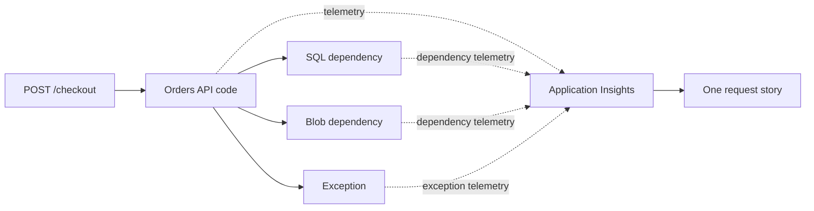

## Table of Contents

1. [The Problem](#the-problem)
2. [What Is Application Insights](#what-is-application-insights)
3. [Requests](#requests)
4. [Dependencies](#dependencies)
5. [Exceptions](#exceptions)
6. [Traces](#traces)
7. [Correlation](#correlation)
8. [Application Map](#application-map)
9. [OpenTelemetry](#opentelemetry)
10. [Putting It All Together](#putting-it-all-together)
11. [What's Next](#whats-next)

## The Problem

The previous article put logs in a workspace. That helps when you know what to search for. But a backend failure often starts as one messy user story:

```text
Customer 427 clicked Place order at 10:24.
The page spun for a few seconds and then showed an error.
```

The team can search logs, but they still need to connect the pieces. Which API route handled the request? Which dependency calls happened inside it? Did SQL succeed? Did Blob Storage fail? Was there an exception? Did the logs and dependency calls share one operation ID?

Application Insights is for that application-level story. It helps a backend team follow a request through code and dependencies instead of treating every log line as a separate clue.

## What Is Application Insights

Application Insights is an application performance monitoring feature of Azure Monitor. Application performance monitoring, usually shortened to APM, means watching live application behavior: requests, response times, failures, dependency calls, exceptions, traces, and related views.

Azure resource monitoring tells you what the platform sees. Application Insights tells you what the application sees. That distinction is important. A storage account metric can show failed requests. Application Insights can show which API operation made the storage call, how long it took, which exception was thrown, and which user request it belonged to.



Application Insights does not make the app correct. It makes the app's behavior easier to see. The app still needs proper instrumentation, useful logs, and careful handling of sensitive data.

## Requests

A request is the incoming work your application receives. For a web API, it is usually an HTTP request. Request telemetry records the route or operation name, response status, success flag, duration, timestamp, and role or service name.

For checkout, a useful request record might look like this:

```text
timestamp: 2026-05-16T10:24:18Z
name: POST /checkout
operation_Id: op_6f2a91
resultCode: 500
success: false
durationMs: 1840
cloud_RoleName: devpolaris-orders-api
```

This is the front door signal. It tells the team that the user-visible route failed, how long it took, and which operation ID can connect related telemetry. Without request telemetry, the team may see scattered errors but miss the shape of the user action.

Request telemetry is also useful when nothing has failed yet. A rising p95 duration for `POST /checkout` may reveal trouble before customers report errors. A sudden drop in request count may indicate routing, DNS, deployment, or authentication issues.

## Dependencies

A dependency is something your app calls while handling work. For a backend API, dependencies might include Azure SQL Database, Blob Storage, Cosmos DB, a queue, an internal service, or an external payment provider.

Dependency telemetry tells you which downstream call happened, how long it took, and whether it succeeded. That is often the fastest way to stop blaming the wrong layer.

```text
operation_Id: op_6f2a91
request: POST /checkout

dependency: Azure SQL Database
target: sql-devpolaris-prod.database.windows.net
durationMs: 160
success: true

dependency: Blob Storage
target: stordersprod.blob.core.windows.net
durationMs: 1220
success: false
resultCode: AuthorizationPermissionMismatch
```

Now the story is specific. SQL succeeded. Blob Storage failed. The first checks move toward receipt upload permission, managed identity role assignment, storage network access, or the blob operation itself.

Dependency telemetry is also where latency hides. A request can return `200` and still feel broken if one dependency takes 4 seconds. Logs might record success. Metrics might show slow response time. Dependency telemetry shows which call consumed the time.

## Exceptions

An exception records an error thrown by application code or runtime libraries. Exception telemetry is most useful when it belongs to the same operation as the failed request and dependency calls.

```text
timestamp: 2026-05-16T10:24:19Z
operation_Id: op_6f2a91
type: ReceiptUploadError
message: "receipt upload failed"
outerMessage: "AuthorizationPermissionMismatch"
```

The `operation_Id` makes this exception part of the checkout story. The type gives a code-level name. The outer message gives a dependency-level clue. Together, they help both application developers and cloud operators.

Bad exception telemetry is vague:

```text
Error: failed
```

Bad exception telemetry can also be too revealing. Do not log secrets, full tokens, connection strings, payment data, or sensitive personal data. The goal is enough evidence to debug the system, not a transcript of everything the system touched.

## Traces

Trace telemetry is application log-style evidence that belongs to an operation. It can show meaningful checkpoints inside the request: validation passed, inventory reserved, SQL write started, receipt upload attempted, retry scheduled.

Good trace messages are not random print statements. They create a readable path through the operation:

```text
operation_Id=op_6f2a91 level=INFO step=validate-cart result=ok
operation_Id=op_6f2a91 level=INFO step=create-order result=ok orderId=ord_812
operation_Id=op_6f2a91 level=ERROR step=upload-receipt result=failed error=AuthorizationPermissionMismatch
```

The key is consistent fields. If traces carry `operation_Id`, `step`, `result`, and safe identifiers, they become searchable and connectable. If they are only sentences, they may still help humans, but they are harder to query and summarize.

Traces should be intentional. Logging every loop iteration in production can create cost, noise, and privacy problems. Log the checkpoints that explain business and dependency behavior.

## Correlation

Correlation is how separate telemetry records become one story. The request, dependency call, exception, and trace message need a shared identifier. In Application Insights examples, that is often an operation ID or related trace context.

Correlation is why this set of records is powerful:

| Record | Shared field | What it contributes |
| --- | --- | --- |
| Request | `operation_Id=op_6f2a91` | The user-visible route, status, and duration. |
| Dependency | `operation_Id=op_6f2a91` | The downstream service call and failure. |
| Exception | `operation_Id=op_6f2a91` | The code-level error. |
| Trace | `operation_Id=op_6f2a91` | The business checkpoint before the failure. |

Without correlation, the team has four piles of evidence. With correlation, the team has one request timeline.

Correlation can break at boundaries. A custom HTTP client might not propagate trace context. A queue message might drop identifiers. A background worker might start a new operation without linking to the original request. When that happens, the application map and transaction views become less useful because the story has missing pages.

## Application Map

The application map is a visual view of application components and their dependencies. It can show the API, databases, storage, external HTTP calls, and failure or latency patterns between them.

Use the map as a starting picture, not as proof that the architecture is perfect. It shows what telemetry can see. If a dependency is missing from the map, the dependency might not exist, or it might not be instrumented, or correlation might be broken.

For the orders API, the map can help answer beginner questions:

| Question | What the map can reveal |
| --- | --- |
| What does checkout call? | SQL, Blob Storage, payment API, internal services. |
| Which dependency is failing? | Failure markers or high error rates on one edge. |
| Which dependency is slow? | Latency on a specific call path. |
| Is a component invisible? | Missing instrumentation or missing correlation. |

The useful habit is to click from the map into the evidence. A red edge is a clue. The request, dependency, exception, and trace records explain it.

## OpenTelemetry

OpenTelemetry is a vendor-neutral observability framework for collecting telemetry. Microsoft positions Application Insights around OpenTelemetry for supported scenarios. The exact setup depends on language, hosting model, libraries, and current Azure guidance, so treat implementation as a current-docs task.

For a beginner, the important idea is portability and consistency. OpenTelemetry gives applications a common way to describe traces, metrics, and logs. Application Insights gives Azure teams a place to analyze that telemetry alongside Azure Monitor.

Do not let the tooling word hide the engineering job. Instrumentation should name meaningful operations, propagate context across service and queue boundaries, record useful dependency calls, and avoid sensitive data. A standard library can carry the signal. The team still decides what the signal means.

## Putting It All Together

Return to the customer who clicked Place order.

- Request telemetry showed `POST /checkout` failed with `500` after 1840 ms.
- Dependency telemetry showed SQL succeeded and Blob Storage failed.
- Exception telemetry named `ReceiptUploadError` and carried the storage error.
- Trace messages showed validation and order creation succeeded before receipt upload failed.
- Correlation connected those records through one operation ID.
- The application map gave the team a quick picture of which component edge needed attention.

Application Insights made the backend request readable. It did not replace logs, metrics, Azure resource evidence, or alerting. It connected the application layer so the rest of the investigation could start in the right place.

## What's Next

Application Insights helps you follow one request. The next article zooms out to metrics, dashboards, alert rules, action groups, and alert noise so the team can see system shape and notify humans at the right time.

---

**References**

- [Application Insights overview](https://learn.microsoft.com/en-us/azure/azure-monitor/app/app-insights-overview)
- [Azure Monitor overview](https://learn.microsoft.com/en-us/azure/azure-monitor/fundamentals/overview)
- [Azure Monitor Logs overview](https://learn.microsoft.com/en-us/azure/azure-monitor/logs/data-platform-logs)
- [Azure Monitor OpenTelemetry overview](https://learn.microsoft.com/en-us/azure/azure-monitor/app/opentelemetry-overview)
