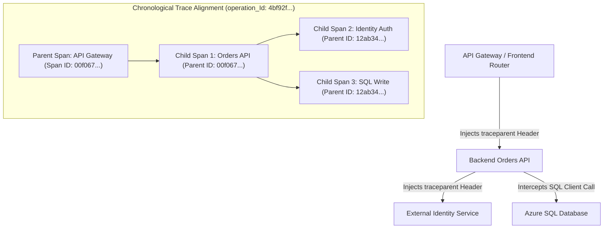
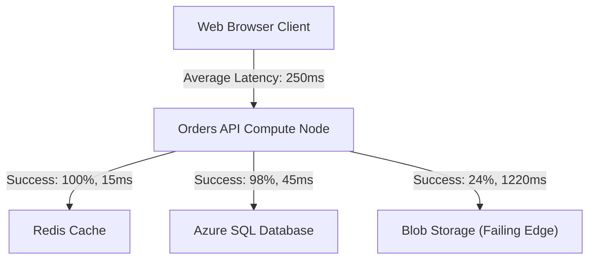
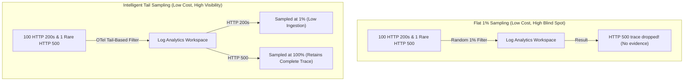

## Table of Contents

1. [What Is Application Insights](#what-is-application-insights)
2. [Application Telemetry Data Structures](#application-telemetry-data-structures)
3. [Trace Context Correlation and Operation IDs](#trace-context-correlation-and-operation-ids)
4. [The Application Map and Dependency Analysis](#the-application-map-and-dependency-analysis)
5. [OpenTelemetry and Portability Standards](#opentelemetry-and-portability-standards)
6. [Putting It All Together](#putting-it-all-together)
7. [What's Next](#whats-next)

## What Is Application Insights

Application Insights is a fully managed Application Performance Monitoring (APM) and distributed tracing service built into the Azure Monitor framework. While platform-level resource logs and metrics record the status of virtual machines, storage arrays, and network gateways from the outside, Application Insights captures telemetry from within your active application code. It automatically tracks incoming HTTP requests, intercepts outgoing database or remote REST dependency calls, captures runtime exceptions, and measures code-level execution durations, providing deep visibility into application execution pathways.

If you operate applications on AWS, Application Insights fulfills the exact systems role of AWS X-Ray and CloudWatch ServiceLens. However, their underlying deployment models differ:

* **Instrumentation Options**: AWS X-Ray often requires SDK, daemon, or agent configuration depending on the runtime. Application Insights also depends on instrumentation, but Azure provides several supported paths: automatic instrumentation for supported App Service and Functions scenarios, SDK or OpenTelemetry instrumentation in application code, and OpenTelemetry agents or exporters for container platforms such as Azure Container Apps.
* **Correlated Console Experiences**: In AWS, trace timelines and stack traces are divided across the X-Ray console and CloudWatch Logs log streams, requiring you to correlate them manually. Application Insights consolidates stack traces, SQL command queries, runtime logs, and request metadata into a single chronological timeline.

Understanding Application Insights means recognizing that you do not evaluate logs as separate, isolated rows. You capture, correlate, and trace execution pathways across distributed microservices using globally standardized context headers.

:::expand[Under the Hood: W3C Trace Context and Span Propagation Physics]{kind="design"}
Distributed tracing tracks execution paths across distributed systems by propagating transaction identifiers across network boundaries using the W3C Trace Context standard:

* **Trace ID and Span ID Generation**: When a client browser or API Gateway initiates a transaction, the OpenTelemetry-compliant SDK generates a global `trace_id` (a 16-byte random hexadecimal string representing the entire transaction) and a parent `span_id` (an 8-byte hexadecimal string representing the current unit of work).
* **HTTP Header Injection**: Before making an outgoing network call, the calling service's client library intercepts the request and injects a standard W3C HTTP header named `traceparent` into the payload:
    * **Header Format**: `00-[trace_id]-[parent_span_id]-[trace_flags]`
    * **Example**: `00-4bf92f3577b34da6a3ce929d0e0e4736-00f067aa0ba902b7-01` (where `01` indicates that the request has been sampled for tracing).
* **Context Extraction**: The destination service's agent intercepts the incoming HTTP request, extracts the `traceparent` header, and instantiates a new child span. The parent's `span_id` becomes the child's `parent_id`, and the child inherits the global `trace_id` (which maps to `operation_Id` in Log Analytics). This links the downstream execution thread to the parent transaction.


:::

This trace context propagation ensures that even if a request crosses multiple virtual networks, container runtimes, and message queues, all telemetry is indexed under a single unified ID.

## Application Telemetry Data Structures

When Application Insights is configured to write data to a Log Analytics Workspace, it populates a set of highly optimized, structured tables. Understanding these schemas allows you to write precise KQL queries during active incident investigations.

The core telemetry data structures are organized into four distinct tables:

### 1. Requests (`AppRequests`)
Records incoming HTTP requests or RPC calls handled by your application compute layer.
* **Core Schema Fields**: `Name` (the HTTP method and route, e.g., `POST /checkout`), `ResultCode` (HTTP status code), `DurationMs` (execution time), `Success` (Boolean state), and `operation_Id` (the global transaction trace ID).

### 2. Dependencies (`AppDependencies`)
Records outgoing database queries, object store transactions, or external API calls executed by your application.
* **Core Schema Fields**: `Name` (the target table, storage action, or API path), `DependencyType` (e.g., `SQL`, `HTTP`, `Blob`), `Target` (the network domain of the resource), `DurationMs`, and `Success`.

### 3. Exceptions (`AppExceptions`)
Records runtime exceptions, application crashes, and unhandled errors caught by the framework.
* **Core Schema Fields**: `ExceptionType` (e.g., `System.NullReferenceException`), `OuterMessage` (the primary error string), `Details` (the complete stack trace), and `operation_Id`.

### 4. Traces (`AppTraces`)
Records custom, in-line application logs and logical checkpoints emitted by your logging framework (e.g., Log4Net, Winston, Serilog, or Winston).
* **Core Schema Fields**: `Message` (the log text), `SeverityLevel` (e.g., `INFO`, `WARNING`, `ERROR`), and `operation_Id`.

## Trace Context Correlation and Operation IDs

The power of Application Insights lies in correlation. Because every request, dependency, exception, and trace record inherits the exact same `operation_Id` (which maps to the W3C `trace_id`), a single KQL query can reconstruct the timeline of a transaction.

If a user encounters a `500` error during checkout, run a query to isolate all events sharing that specific request's operation ID:

```text
union AppRequests, AppDependencies, AppExceptions, AppTraces
| where operation_Id == "op_6f2a91_checkout"
| order by TimeGenerated asc
| project TimeGenerated, Type, Name, Message, ResultCode, DurationMs
```

This KQL query returns a chronological, step-by-step transaction log:

| TimeGenerated | Type | Name / Message | ResultCode | DurationMs |
| --- | --- | --- | --- | --- |
| `10:24:18.005` | `AppRequests` | `POST /checkout` | `500` | 1840 |
| `10:24:18.012` | `AppTraces` | `Starting cart validation` | - | - |
| `10:24:18.062` | `AppDependencies`| `sql-prod.database.windows.net` | `200` | 160 |
| `10:24:18.224` | `AppTraces` | `Cart validated. Commencing invoice upload` | - | - |
| `10:24:18.252` | `AppDependencies`| `stordersprod.blob.core.windows.net`| `403` | 1220 |
| `10:24:19.474` | `AppExceptions` | `ReceiptUploadError: invoice upload failed` | - | - |

By analyzing this correlated timeline, the operator can see that the database write succeeded, but the subsequent Blob Storage upload timed out with an HTTP 403 error, causing the application code to throw an exception and return an HTTP 500 error to the client.

## The Application Map and Dependency Analysis

The Application Map is a visual topology diagram automatically generated by the Application Insights analysis engine. It evaluates the metadata inside the `AppRequests` and `AppDependencies` tables to map all active application components and downstream dependency nodes.


*Application maps help you see which downstream dependency is slow or failing instead of treating the API as one black box.*



The map aggregates telemetry data to calculate real-time performance indicators along each communication path:

* **Performance Bottlenecks**: The map displays the average response latency and call count along each dependency link, highlighting slow network connections or unindexed database queries.
* **Error Rate Heatmaps**: Paths that encounter high failure rates are marked in red. Clicking on a failing edge allows you to drill down directly into the specific `AppDependencies` or `AppExceptions` records associated with those failures.
* **Invisible Dependencies**: If your application accesses a database or third-party API that does not appear on the map, it indicates either that the application lacks the correct instrumentation agent or that trace correlation headers are being dropped along that path.

Use the Application Map to gain a high-level overview of system topology, then use KQL queries to drill down into the underlying tables to analyze specific failures.

## OpenTelemetry and Portability Standards

Historically, cloud providers required developers to compile proprietary, vendor-specific SDK libraries into their application code to gather telemetry. If you wanted to move an application from Azure to AWS or local environments, you were forced to refactor your code to replace Azure SDKs with CloudWatch or X-Ray SDKs.


*OpenTelemetry separates instrumentation from the storage backend, which makes telemetry less tied to one vendor path.*

Modern architectures decouple code instrumentation from the target backend by adopting the OpenTelemetry (OTel) standard:

* **OpenTelemetry Specification**: A vendor-neutral, CNCF (Cloud Native Computing Foundation) open standard that provides a unified set of APIs, SDKs, and tooling to generate and export traces, metrics, and logs.
* **Vendor Portability**: You instrument your application code once using standard OpenTelemetry libraries. By adjusting environment variables or editing a local collector configuration file, you can route the telemetry stream to Application Insights, AWS CloudWatch, Datadog, or an open-source Prometheus/Jaeger collector without changing a single line of application code.
* **Microsoft Alignment**: Application Insights supports OpenTelemetry-based collection for supported runtimes and scenarios, including the Azure Monitor OpenTelemetry Distro and exporters. Check the current language and hosting support matrix before choosing an instrumentation path.

Adopting OpenTelemetry ensures that your application code remains portable and standard-compliant while leveraging Azure Monitor's rich analysis interfaces.

:::expand[Pitfall: The Telemetry Sampling Cost Trap]{kind="pitfall"}
A common architectural pitfall when configuring Application Insights or OpenTelemetry is setting your trace sampling rate to a flat 100% in high-traffic production environments. Because every incoming HTTP request, outgoing SQL query, and internal log statement is written as a discrete row in Log Analytics, a busy microservice handling 1,000 requests per second will generate terabytes of daily ingestion logs. This can result in an Azure Monitor bill that costs more than your primary compute infrastructure.

However, if you attempt to solve this by blindly reducing the sampling rate to a flat 1% across all telemetry, you introduce a dangerous diagnostic blind spot. While you save on ingestion costs, you will miss rare, critical edge-case errors, transient database deadlocks, or occasional security exceptions that only occur once every few thousand requests.

To avoid this trap, you can deploy **adaptive, parent-aware, or tail-based sampling**, depending on the SDK, runtime, and collector path you use:

*   **Adaptive Sampling**: Supported by Application Insights SDK paths. It adjusts sampling volume dynamically based on telemetry volume, helping control ingestion while preserving representative request telemetry.
*   **Parent-Aware Sampling**: Ensures that if a parent span is selected for sampling, all child spans (such as outgoing SQL or HTTP calls) are also captured, preserving the complete distributed trace timeline.
*   **Tail-Based Sampling**: Evaluates the complete trace at an OpenTelemetry Collector gateway before exporting the data. If the transaction terminates with an HTTP 5xx or crosses a latency threshold (e.g. >2 seconds), the collector can keep the trace; if it succeeds normally, the collector can drop it.

This cost-vs-visibility tradeoff maps directly to AWS X-Ray. In AWS, you configure X-Ray Sampling Rules containing a "reservoir" (the guaranteed minimum traces to record per second to maintain baseline visibility) and a "fixed rate" (the percentage of requests sampled above the reservoir) to control bills while keeping essential evidence.

The top-down diagram below compares flat sampling vs intelligent parent-aware tail-based sampling:



**Rule of thumb:** Never deploy static 100% telemetry sampling to high-volume production workloads. Configure adaptive sampling or deploy an OpenTelemetry Collector with tail-based filtering to guarantee 100% capture of errors and high-latency anomalies, while aggressively pruning successful, low-value telemetry.
:::

## Putting It All Together

Application Insights provides deep runtime visibility by tracing, correlating, and mapping application-level behavior.

* **Decoupled Telemetry**: Focus on application-level execution (requests, dependencies, exceptions, and traces) to understand what is happening inside your code.
* **Context Propagation**: Rely on standard W3C `traceparent` headers to propagate transaction IDs across distributed systems.
* **Structured Data**: Query optimized tables (`AppRequests`, `AppDependencies`, `AppExceptions`, and `AppTraces`) in Log Analytics using `operation_Id` correlations to build chronological transaction timelines.
* **Visual Topologies**: Utilize the Application Map to visually analyze system dependencies, isolate slow network edges, and identify failing components.
* **Neutral Standards**: Standardize on OpenTelemetry APIs to ensure vendor portability across diverse cloud hosting environments.

## What's Next

Now that we have traced distributed requests and correlated application telemetry, we will explore Metrics and Alerts. We will examine how to track system-wide trends, create operational dashboards, construct high-signal alert rules, and coordinate action groups to notify on-call engineers.


*Use this as the trace correlation path: keep one operation ID moving across each hop so logs, spans, dependencies, and async work can be searched as one user request.*


---

**References**

* [Application Insights overview](https://learn.microsoft.com/en-us/azure/azure-monitor/app/app-insights-overview)
* [Distributed tracing in Azure Monitor](https://learn.microsoft.com/en-us/azure/azure-monitor/app/distributed-tracing-telemetry-correlation)
* [W3C Trace Context Standard](https://www.w3.org/TR/trace-context/)
* [Application Insights OpenTelemetry observability](https://learn.microsoft.com/en-us/azure/azure-monitor/app/opentelemetry)
* [OpenTelemetry data collection for Azure Container Apps](https://learn.microsoft.com/en-us/azure/container-apps/opentelemetry-agents)
