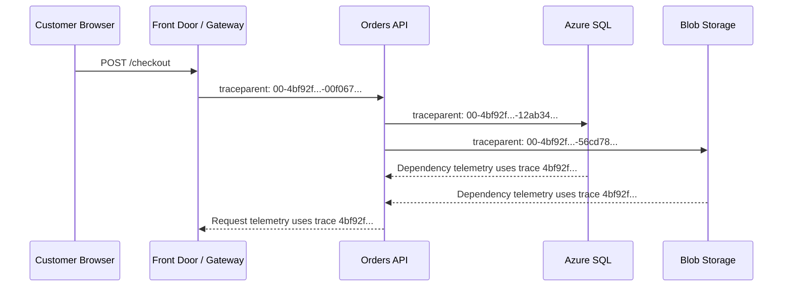
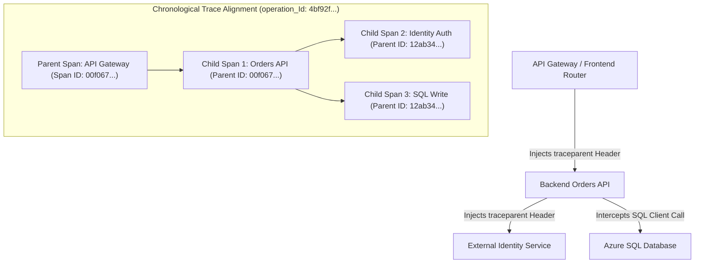
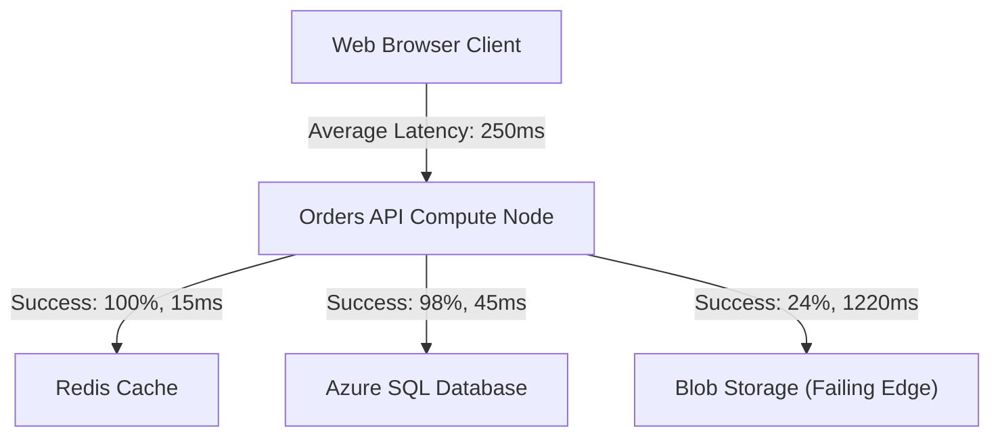
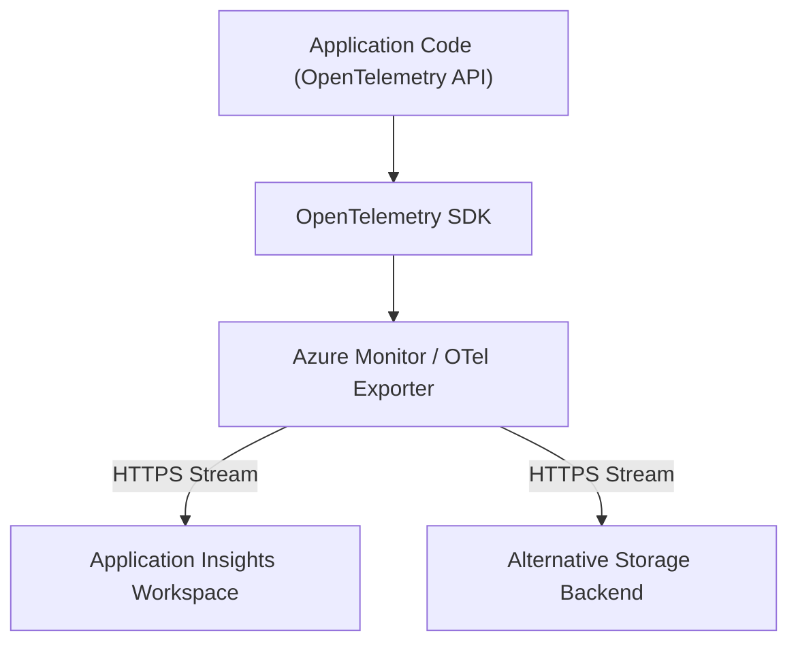
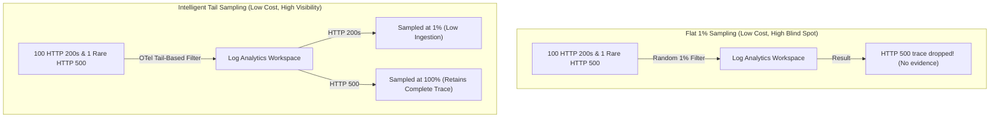

## Table of Contents

1. [The Diagnostic Gap inside Application Code](#the-diagnostic-gap-inside-application-code)
2. [What Is Application Insights](#what-is-application-insights)
3. [Application Telemetry Data Structures](#application-telemetry-data-structures)
4. [Trace Context Correlation and Operation IDs](#trace-context-correlation-and-operation-ids)
5. [W3C Trace Context and Span Propagation Physics](#w3c-trace-context-and-span-propagation-physics)
6. [Declarative Application Insights Bicep Configuration](#declarative-application-insights-bicep-configuration)
7. [The Application Map and Dependency Analysis](#the-application-map-and-dependency-analysis)
8. [OpenTelemetry and Portability Standards](#opentelemetry-and-portability-standards)
9. [Data Optimization: Telemetry Ingestion Sampling Tiers](#data-optimization-telemetry-ingestion-sampling-tiers)
10. [Putting It All Together](#putting-it-all-together)
11. [What's Next](#whats-next)

## The Diagnostic Gap inside Application Code

Platform-level resource metrics indicate the status of virtual machines, storage arrays, and network gateways from the outside.
However, they remain completely blind to logical errors occurring within the application's runtime compilation layer.
An App Service instance can report normal CPU usage and active network sockets while silently failing to process orders due to a null reference exception or a database lock timeout.

To resolve these errors, developers require deep diagnostic visibility inside the running application code.
Application performance monitoring (APM) tools bridge this gap by capturing request lifecycles, database execution metrics, and trace contexts from within the running application.
Azure Monitor provides this runtime tracking layer through Application Insights.

## What Is Application Insights

Application Insights is Azure's application telemetry service for tracking requests, dependencies, exceptions, traces, and distributed operation IDs. It is a fully managed Application Performance Monitoring (APM) and distributed tracing service built into the Azure Monitor framework.

It records what the application did at runtime so operators can reconstruct one request, one dependency failure, or one crash without logging into the compute host.

```plain
APM Telemetry Categories:
  Requests: Track incoming HTTP operations, routes, and response status codes
  Dependencies: Intercept outbound SQL queries, HTTP calls, and storage transactions
  Exceptions: Capture unhandled application crashes, errors, and stack traces
  Traces: Gather in-line application logs and logical execution checkpoints
```

It automatically tracks incoming HTTP requests, intercepts outgoing database or remote REST dependency calls, captures runtime exceptions, and measures code-level execution durations.
If you have built monitoring infrastructures on AWS, Application Insights fulfills the exact systems role of AWS X-Ray and CloudWatch ServiceLens.
It consolidates stack traces, SQL command queries, runtime logs, and request metadata into a single chronological timeline.

## Application Telemetry Data Structures

Application Insights stores application telemetry as typed records. A typed record is a log row with a known shape, such as a request, dependency call, exception, or trace message.

Example: one checkout attempt can create an `AppRequests` row for `POST /checkout`, an `AppDependencies` row for the SQL write, and an `AppExceptions` row if receipt upload fails.

When Application Insights is configured to write data to a Log Analytics Workspace, it populates a set of highly optimized, structured tables.
Understanding these schemas allows you to write precise KQL queries during active incident investigations.

The core telemetry data structures are organized into four distinct tables:

### 1. Requests (`AppRequests`)
This table records incoming HTTP requests or RPC calls handled by your application compute layer.
Key fields include:
- `Name`: The HTTP method and route, such as `POST /checkout`.
- `ResultCode`: The HTTP status code returned to the client.
- `DurationMs`: The total execution time of the request.
- `operation_Id`: The global transaction trace ID.

### 2. Dependencies (`AppDependencies`)
This table records outgoing database queries, object store transactions, or external API calls executed by your application.
Key fields include:
- `Name`: The target database table, storage action, or API path.
- `DependencyType`: The protocol type, such as `SQL`, `HTTP`, or `Blob`.
- `Target`: The network domain of the resource.
- `DurationMs`: The latency of the remote transaction.

### 3. Exceptions (`AppExceptions`)
This table records runtime exceptions, application crashes, and unhandled errors caught by the framework.
Key fields include:
- `ExceptionType`: The code-level error type, such as `System.NullReferenceException`.
- `OuterMessage`: The primary error message string.
- `Details`: The complete stack trace for code diagnostics.

### 4. Traces (`AppTraces`)
This table records custom, in-line application logs and logical checkpoints emitted by your logging framework.
Key fields include:
- `Message`: The log message string.
- `SeverityLevel`: The logging severity, such as `INFO`, `WARNING`, or `ERROR`.

## Trace Context Correlation and Operation IDs

Correlation is the mechanism that connects separate telemetry rows from the same user transaction.
The power of Application Insights lies in correlation.
Because every request, dependency, exception, and trace record inherits the exact same `operation_Id`, a single KQL query can reconstruct the timeline of a transaction.

If a user encounters a `500` error during checkout, run a query to isolate all events sharing that specific request's operation ID:

```plain
union AppRequests, AppDependencies, AppExceptions, AppTraces
| where operation_Id == "op_6f2a91_checkout"
| order by TimeGenerated asc
| project TimeGenerated, Type, Name, Message, ResultCode, DurationMs
```

This KQL query returns a chronological, step-by-step transaction log:

| TimeGenerated | Type | Name / Message | ResultCode | DurationMs |
| --- | --- | --- | --- | --- |
| `10:24:18.005` | `AppRequests` | `POST /checkout` | `500` | 1840 |
| `10:24:18.012` | `AppTraces` | `Starting cart validation` | - | - |
| `10:24:18.062` | `AppDependencies`| `sql-prod.database.windows.net` | `200` | 160 |
| `10:24:18.224` | `AppTraces` | `Cart validated. Commencing invoice upload` | - | - |
| `10:24:18.252` | `AppDependencies`| `stordersprod.blob.core.windows.net`| `403` | 1220 |
| `10:24:19.474` | `AppExceptions` | `ReceiptUploadError: invoice upload failed` | - | - |

By analyzing this correlated timeline, the operator can see that the database write succeeded, but the subsequent Blob Storage upload timed out with an HTTP 403 error.
This caused the application code to throw an exception and return an HTTP 500 error to the client.

## W3C Trace Context and Span Propagation Physics

Distributed tracing follows one user transaction across multiple services. It works by passing a shared trace ID through HTTP headers so every service can attach its work to the same timeline.

Example: a request to `POST /checkout` can pass from Front Door to `orders-api`, then to Azure SQL and Blob Storage, while all telemetry keeps the same trace ID.

Application Insights accomplishes this by adhering to the W3C Trace Context standard.

The W3C `traceparent` HTTP header carries the trace ID and parent span ID across service boundaries so separate processes can attach their telemetry to the same transaction.



The distributed trace propagation follows a structured execution sequence:
- When a client browser or API Gateway initiates a transaction, the OpenTelemetry-compliant SDK generates a global `trace_id`.
- The SDK also instantiates a parent `span_id` representing the first unit of work.
- Before making an outgoing network call, the calling service's client library intercepts the request.
- It injects the W3C HTTP header named `traceparent` into the payload.
- The destination service's agent intercepts the incoming HTTP request and extracts the `traceparent` header.
- The agent instantiates a new child span.
- The parent's `span_id` becomes the child's `parent_id`, and the child inherits the global `trace_id`.
- This link binds the downstream execution thread to the parent transaction.



This trace context propagation ensures that even if a request crosses multiple virtual networks, container runtimes, and databases, all telemetry remains indexed under a single unified ID.

## Declarative Application Insights Bicep Configuration

To manage application monitoring programmatically, we declare our Application Insights components using Bicep.
The template below provisions an Application Insights component and links it directly to a Log Analytics Workspace:

```bicep
param appInsightsName string = 'appi-devpolaris-prod'
param workspaceName string = 'law-devpolaris-prod'
param location string = resourceGroup().location

resource logAnalyticsWorkspace 'Microsoft.OperationalInsights/workspaces@2022-10-01' existing = {
  name: workspaceName
}

resource appInsights 'Microsoft.Insights/components@2020-02-02' = {
  name: appInsightsName
  location: location
  kind: 'web'
  properties: {
    Application_Type: 'web'
    WorkspaceResourceId: logAnalyticsWorkspace.id
    publicNetworkAccessForIngestion: 'Enabled'
    publicNetworkAccessForQuery: 'Enabled'
  }
}
```

This template establishes a secure, workspace-based Application Insights instance, ensuring all APM logs are stored in the shared Log Analytics data store.

## The Application Map and Dependency Analysis

The Application Map is a dependency graph built from request and dependency telemetry. It shows which application components call each other and which downstream services are slow or failing.

Example: the map can show `orders-api` calling Redis, Azure SQL, and Blob Storage, with the Blob Storage edge highlighted because receipt uploads have a high failure rate.

It evaluates the metadata inside the `AppRequests` and `AppDependencies` tables to map all active application components and downstream dependency nodes.

An Application Map is a dependency graph built from request and dependency telemetry, visually connecting active components and highlighting slow or failing paths.



The map aggregates telemetry data to calculate performance indicators along each communication path:
- **Performance Bottlenecks**: The map displays the average response latency along each dependency link, highlighting slow network connections or unindexed database queries.
- **Error Rate Heatmaps**: Paths that encounter high failure rates are marked in red, allowing operators to drill down directly into the specific failing dependencies.
- **Invisible Dependencies**: If a dependency does not appear on the map, it indicates either that the application lacks the correct instrumentation agent or that trace correlation headers are being dropped along that path.

Using the Application Map, support teams can isolate performance regressions to specific downstream services within seconds.

## OpenTelemetry and Portability Standards

OpenTelemetry is a vendor-neutral way to instrument code for metrics, logs, and traces. It exists so telemetry code is not tightly coupled to one cloud provider's monitoring backend.

Example: the same Node.js service can emit OpenTelemetry spans and send them to Application Insights today, then route them through a collector to another backend later.

Historically, cloud providers required developers to compile proprietary, vendor-specific SDK libraries into their application code to gather telemetry.
This created significant vendor lock-in, requiring code refactoring when migrating workloads between cloud environments.

OpenTelemetry is a vendor-neutral instrumentation API, SDK, and collector model for emitting standardized metrics, logs, and traces to different backends.



Modern architectures decouple code instrumentation from the target backend by adopting the OpenTelemetry (OTel) standard.
You instrument your application code once using standard OpenTelemetry libraries.
By adjusting environment variables or editing a local collector configuration file, you can route the telemetry stream to Application Insights, AWS CloudWatch, or open-source tools without changing a single line of application code.

### The OpenTelemetry Collector Architecture

The OpenTelemetry Collector is a telemetry processing service that runs outside your application process to receive, process, batch, and export metrics, logs, and traces.
In a containerized environment, such as Azure Kubernetes Service or Azure Container Apps, the collector can be deployed in two primary topologies:
- **Sidecar Pattern**: A collector container runs alongside each application container inside the same host or task boundary, receiving telemetry locally over loopback sockets. This keeps the application memory footprint lightweight, as the SDK offloads serialization tasks immediately to the sidecar.
- **Gateway Pattern**: A centralized, autoscaling cluster of collector instances runs independently inside your private virtual network. The local sidecars forward their data streams to this gateway, which performs batching, credential encryption, and resource attribute tag injection before routing the final payloads to Azure Monitor.

Using a centralized gateway ensures that individual application containers do not need Key Vault secrets or direct internet routes to Application Insights, keeping the network perimeter secure.


## Data Optimization: Telemetry Ingestion Sampling Tiers

Telemetry sampling is the rule for keeping only part of a high-volume telemetry stream. It exists because recording every successful request, dependency call, and trace line can become expensive at production scale.

Example: a service can keep 100 percent of failed requests and exceptions while sampling routine successful requests at 10 percent.

Ingesting high-volume telemetry logs introduces storage capacity costs.
Setting your trace sampling rate to a flat 100% in high-traffic production environments will write millions of daily database queries and log statements to Log Analytics, resulting in significant storage costs.

Telemetry sampling is a retention policy for high-volume telemetry streams, selectively recording a percentage of normal records to save money while retaining error-level incidents.

To optimize operational budgets without losing visibility, configure tail-based or adaptive sampling:
- **Adaptive Sampling**: Dynamically adjusts sampling volume based on resource activity to control ingestion while preserving representative request trends.
- **Parent-Aware Sampling**: Guarantees that if a parent span is selected for sampling, all associated child dependency spans are also captured, preserving the complete trace timeline.
- **Tail-Based Sampling**: Evaluates the complete trace at an OpenTelemetry Collector gateway before exporting. If the transaction terminates with an error or crosses a latency threshold, the collector retains the entire trace; if it succeeds normally, the collector drops it.



Intelligent sampling ensures that you capture critical failures and performance anomalies while keeping data storage costs predictable.

## Putting It All Together

Application Insights provides deep runtime visibility by tracing, correlating, and mapping application-level behavior.
- Application Insights captures requests, dependencies, exceptions, and traces inside running code.
- W3C `traceparent` headers propagate transaction IDs across distributed network boundaries.
- Log Analytics workspaces store APM data in optimized, structured tables (`AppRequests`, `AppDependencies`, `AppExceptions`, and `AppTraces`).
- Single KQL queries correlate multiple tables using unified `operation_Id` keys to reconstruct chronological timelines.
- Application Maps visualize microservice dependencies and highlight slow or failing nodes.
- OpenTelemetry serves as a universal translation adapter, enabling vendor portability across diverse cloud hosting platforms.
- Intelligent sampling strategies balance ingestion storage costs with high-signal troubleshooting data.

By implementing distributed request tracing, cloud teams gain the context required to resolve runtime errors and performance degradation.

## What's Next

The next article covers Metrics and Alerts.
We will examine how to track system-wide trends, create operational dashboards, construct high-signal alert rules, and coordinate action groups to notify on-call engineers.

---

**References**

- [Application Insights overview](https://learn.microsoft.com/en-us/azure/azure-monitor/app/app-insights-overview) - Guide to monitoring live applications with Application Insights.
- [Distributed tracing in Azure Monitor](https://learn.microsoft.com/en-us/azure/azure-monitor/app/distributed-tracing-telemetry-correlation) - Explanation of telemetry correlation and trace context propagation.
- [W3C Trace Context Standard](https://www.w3.org/TR/trace-context/) - Official specifications for distributed tracing headers.
- [Application Insights OpenTelemetry observability](https://learn.microsoft.com/en-us/azure/azure-monitor/app/opentelemetry) - Guide to instrumenting applications using OpenTelemetry standards.
- [OpenTelemetry data collection for Azure Container Apps](https://learn.microsoft.com/en-us/azure/container-apps/opentelemetry-agents) - Guide to deploying OpenTelemetry collectors in Container Apps environments.
