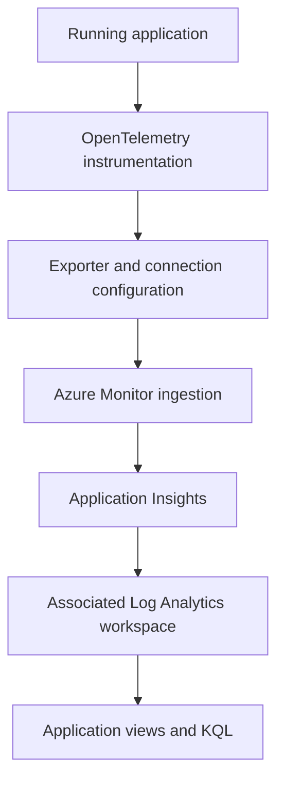
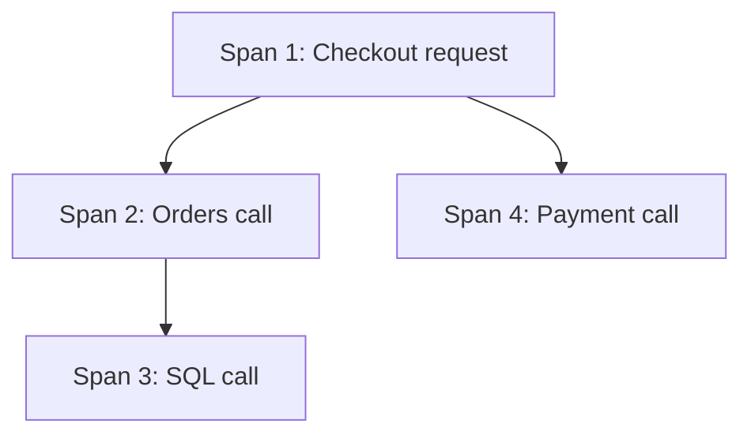

## Table of Contents

1. [What Does Application Insights Explain?](#what-does-application-insights-explain)
2. [How Do Workspace and Instrumentation Connect?](#how-do-workspace-and-instrumentation-connect)
3. [What Do Requests, Dependencies, Exceptions, and Traces Record?](#what-do-requests-dependencies-exceptions-and-traces-record)
4. [How Does Correlation Follow One Operation?](#how-does-correlation-follow-one-operation)
5. [How Do You Query One Checkout Failure?](#how-do-you-query-one-checkout-failure)
6. [What Do Application Map and Performance Views Show?](#what-do-application-map-and-performance-views-show)
7. [How Do Sampling, Privacy, and Cost Affect Telemetry?](#how-do-sampling-privacy-and-cost-affect-telemetry)
8. [How Do You Set Up and Validate OpenTelemetry?](#how-do-you-set-up-and-validate-opentelemetry)
9. [Check Your Answers](#check-your-answers)
10. [References](#references)

CPU, memory, storage, and network measurements can look healthy while customers cannot complete checkout. Those measurements describe infrastructure. To explain the failed purchase, you need to know what the application did with the request, which services it called, and where the failure occurred.

Application Insights provides that application-level view. Instrumentation records the work, correlation connects its parts, and investigation tools make it possible to follow a request from its incoming HTTP call to a slow dependency or exception.

1. **What Does Application Insights Explain?**
2. **How Do Workspace and Instrumentation Connect?**
3. **What Do Requests, Dependencies, Exceptions, and Traces Record?**
4. **How Does Correlation Follow One Operation?**
5. **How Do You Query One Checkout Failure?**
6. **What Do Application Map and Performance Views Show?**
7. **How Do Sampling, Privacy, and Cost Affect Telemetry?**
8. **How Do You Set Up and Validate OpenTelemetry?**

## What Does Application Insights Explain?
<!-- section-summary: Application Insights observes logical application work, exposing outcomes, duration, dependencies, versions, and instances that resource health alone cannot explain. -->

Suppose a VM reports CPU at 32% and memory at 51%, SQL CPU is 24%, and storage latency and networking appear healthy. Customers nevertheless report failed checkouts. The resource measurements do not explain what happened inside those requests.

Infrastructure monitoring examines machines and services: CPU, memory, disk, network, and related capacity. Application monitoring examines work such as request validation, inventory calls, payment calls, database operations, and the exception or response returned to the user.

For example, a Web API may call Redis, a Payment API, and SQL. CPU at 40% on the web application and 30% on SQL does not rule out a failing database operation. Application telemetry might show:

```text
Request: POST /checkout
Duration: 31.2 seconds
Result: HTTP 500

Redis:       4 ms       success
Payment:   180 ms       success
SQL:     30001 ms       failure

Exception: SqlTimeoutException
```

The evidence now identifies a user operation and the dependency that consumed most of its time. That is a more useful starting point than treating the entire environment as either healthy or unhealthy.

**Application Insights** is Azure Monitor's application-performance-monitoring capability. It uses application-level telemetry to describe what operations occurred, how long they took, where they failed, and which dependencies participated. For supported scenarios, Microsoft's guidance uses OpenTelemetry as a standards-based instrumentation path.

The **application signal** is the evidence about logical work. When a customer selects Place Order, useful questions include whether checkout succeeded, how long it took, which downstream calls it made, which dependency consumed time, whether an exception occurred, and which application version and instance handled the request.

Those questions fit into connected layers:

| Layer | Question |
| --- | --- |
| Business | Can customers buy products? |
| Application | Are checkout requests succeeding? |
| Dependency | Are SQL and Payments responding? |
| Runtime | Are threads or connections exhausted? |
| Infrastructure | Are CPU, network, and storage healthy? |

Application Insights focuses on application, dependency, and distributed-request behavior. Azure Monitor as a whole covers more of the stack. A complete explanation often moves across several of these layers.

The objective is to reduce the investigation's search space. Instead of “the application is broken,” the team should be able to identify the affected operation, dependency, instance, or deployed version and examine the evidence behind that conclusion.

## How Do Workspace and Instrumentation Connect?
<!-- section-summary: Instrumentation produces application evidence, connection configuration directs export, and the associated Log Analytics workspace stores telemetry for Application Insights and KQL. -->

An Application Insights resource does not automatically know every activity inside the application. The running code needs **instrumentation**: measurement around the operations whose behavior must be observed.

Consider receiving an HTTP request, querying SQL, calling a Payment API, and returning a response. Instrumentation records the beginning and end of those activities, their timing, outcome, and relevant context.

The result might describe a successful `POST /checkout` lasting 842 ms, with a 390 ms SQL dependency and a 201 ms Payment dependency. The measurements preserve application work that would otherwise disappear when the code finished executing.

Instrumentation is followed by export. A telemetry exporter sends the produced records to Azure Monitor ingestion, where Application Insights can process the application-oriented evidence.

The Azure Monitor OpenTelemetry Distro provides instrumentation for .NET, Java, Node.js, and Python. Supported automatic collection can capture common traces, metrics, logs, and exceptions, with custom instrumentation available for application-specific work. Support depends on the language and scenario rather than one universal library configuration.

### Separate the application resource from its data store

Workspace-based Application Insights associates the application resource with a **Log Analytics workspace**. Current Application Insights resources use this workspace-based model; classic resources have been retired.

The Application Insights resource provides application-oriented configuration and investigation experiences. The associated workspace stores the queryable log and trace telemetry. KQL and the Application Insights views use that evidence for different forms of investigation.


```mermaid
flowchart TD
    app["Running application"] --> instrument["OpenTelemetry instrumentation"]
    instrument --> export["Exporter and connection configuration"]
    export --> ingestion["Azure Monitor ingestion"]
    ingestion --> insights["Application Insights"]
    insights --> workspace["Associated Log Analytics workspace"]
    workspace --> views["Application views and KQL"]
```

The diagram distinguishes the responsibilities involved rather than implying that creating each resource alone establishes collection. The application still has to emit and export the intended operations.

### Configure the telemetry destination

The **Application Insights connection string** identifies the target resource and supplies endpoint information for ingestion. Production configuration should provide it outside the application source, such as through environment configuration.

Instrumentation answers what to observe. Connection configuration answers where to send the resulting telemetry. If instrumentation misses an operation, changing the destination cannot recreate it. If the destination is wrong, correct instrumentation may send the evidence somewhere other than the resource being inspected.

These are separate checks during setup and troubleshooting. Both must work before the workspace can contain useful records for the application.

### Combine automatic and application-specific instrumentation

Automatic instrumentation recognizes generic work such as incoming HTTP requests, outgoing HTTP calls, SQL dependencies, and runtime exceptions. It can supply a useful initial view with limited application-specific code.

It does not inherently understand the business meaning of `reserve_inventory()`. When that operation is important, manual instrumentation can add a `ReserveInventory` span or event inside checkout.

This difference also appears in custom events. Generic HTTP instrumentation can report that `POST /checkout` succeeded. A custom business event can report `order_created`, a value of £142, and payment provider A. Other meaningful events include `order_submitted`, `payment_authorized`, `basket_abandoned`, `subscription_renewed`, and `invoice_generated`.

Both forms are useful. Automatic telemetry describes common technical boundaries; manual additions describe the application semantics needed to operate the service. They should add context without copying unnecessary sensitive payloads.

OpenTelemetry reduces dependence on one monitoring vendor's proprietary instrumentation interface by providing a common model for traces, metrics, and logs. The backend still supplies storage, analysis, and product-specific experiences. The distinction lets the application describe its work through a more portable instrumentation standard.

## What Do Requests, Dependencies, Exceptions, and Traces Record?
<!-- section-summary: Requests describe incoming work, dependencies describe outgoing work, exceptions explain code failures, and correlated spans assemble the full distributed journey. -->

Application Insights records several kinds of application evidence. Understanding their direction and meaning makes both table queries and portal views easier to interpret.

### Requests describe incoming work

A **request** represents an operation arriving at the application. For a web service, an example is `POST /checkout` at 18:42:17, lasting 812 ms, returning result code 200, and marked successful.

The workspace table `AppRequests` contains incoming request telemetry. Useful fields include `TimeGenerated`, `Name`, `DurationMs`, `ResultCode`, `Success`, `OperationId`, and application-role information.

Request measurements help localize performance. If `GET /products` has p95 latency of 80 ms, `POST /login` has p95 of 140 ms, and `POST /checkout` has p95 of 4,800 ms, the checkout path deserves specific attention.

The p95 represents a point below which approximately 95% of measured request durations fall. It helps describe slower experiences that an average alone can obscure.

Outcome and duration must be considered together. An HTTP 200 response after 28 seconds can be technically successful while still delivering a poor user experience. Request telemetry preserves both whether the operation worked and how long the user waited.

### Dependencies describe outgoing work

A **dependency** is work the application asks another system to perform. SQL, Redis, a Payment API, Service Bus, or another microservice can all be dependencies.

A SQL call might record type SQL, target `orders-db`, duration 420 ms, and a successful result. The `AppDependencies` table preserves fields such as type, target, duration, success, result code, operation identifier, and parent information.

The distinction depends on perspective. A checkout call arriving at the Checkout API is its request. Its outgoing SQL call is its dependency. If it calls an instrumented Orders API, that network call can appear as an outgoing dependency at the caller and an incoming request at the callee.

These paired observations are the basis of following work across services. The caller describes what it asked another service to do; the callee describes the work it received.

### Traces connect timed operations

A **distributed trace** represents the whole connected request journey. Each timed operation within it is a **span**.

A checkout trace might contain an overall duration of 920 ms, a frontend request of 910 ms, an Orders API operation of 760 ms, and Inventory and SQL operations of 120 ms and 510 ms within the Orders work. The hierarchy shows which operations called others rather than treating every duration as unrelated.

The parent operation contains the time spent performing its work and waiting for required children. Reading the structure is therefore as important as reading the numbers. It identifies the place to inspect when an overall request is slow.

There is a naming distinction worth keeping clear: **`AppTraces` stores application log or trace messages**. It is not a table containing complete distributed trace trees by itself. The distributed journey is reconstructed from correlated requests, dependencies, exceptions, logs, and related telemetry.

| Table | Evidence |
| --- | --- |
| `AppRequests` | Incoming requests |
| `AppDependencies` | Outgoing dependency operations |
| `AppExceptions` | Exception details |
| `AppTraces` | Application log and trace messages |
| `AppMetrics` | Metric telemetry |

### Exceptions explain unexpected code failures

Suppose `OrdersService.Save()` raises `SqlTimeoutException` during checkout. The request might show result code 500 and failure. The dependency might show SQL failing after 30 seconds. Exception telemetry supplies the code-level information: type, message, method, stack information, and problem identifier.

The `AppExceptions` schema includes fields such as `OuterType`, `OuterMessage`, `Method`, `ProblemId`, `OperationId`, and severity.

An exception without context still leaves a question: did it affect login, checkout, report generation, or a background job? The next step is to connect it with the operation that produced it. Application logs can then add information about the state the code had reached before failure.

The record types complement each other. A failed request identifies user-facing harm, a failed dependency locates an external operation, an exception identifies the code-level fault, and a log can explain additional application context.

## How Does Correlation Follow One Operation?
<!-- section-summary: OperationId identifies the distributed journey, while individual IDs and parent relationships establish which operations caused others. -->

Consider 10,000 simultaneous requests producing 35,000 dependency records, 400 exceptions, and 80,000 logs. The total is 125,400 telemetry records. Without their relationships, the team must guess which exception belongs to which customer operation.

**Correlation** preserves those relationships. A shared `OperationId` can appear on the checkout request, its SQL and Payment dependencies, trace messages, and exception. The records can then be examined as one transaction.

Application Insights maps `OperationId` to the distributed trace identifier and uses parent relationships to reconstruct the operation structure. Its correlation model aligns with W3C Trace Context.

### Distinguish the journey from its individual spans

Suppose the entire checkout has trace ID `ABC`. Its incoming request is Span 1, an Orders call is Span 2, a SQL call within that Orders operation is Span 3, and a separate Payment call is Span 4.


```mermaid
flowchart TD
    request["Span 1: Checkout request"] --> orders["Span 2: Orders call"]
    orders --> sql["Span 3: SQL call"]
    request --> payment["Span 4: Payment call"]
```

The fields express different identities. `OperationId` identifies the overall distributed operation. `Id` identifies a particular request, dependency, or span. `ParentId` identifies the operation that caused that item.

A shared trace identifier groups the records, while parent links establish the causal hierarchy. Both are needed to turn flat records into a useful call graph.

### Reconstruct a failed checkout

A customer begins checkout at 18:41. Inventory and Payment succeed, but Orders SQL times out and the application records `SqlTimeoutException`.

The workspace can contain four connected records:

| Dataset | Evidence for operation 7F92 |
| --- | --- |
| `AppRequests` | POST /checkout, failure, duration 30.4 seconds |
| `AppDependencies` | Orders SQL, failure, duration 30.0 seconds |
| `AppExceptions` | SqlTimeoutException |
| `AppTraces` | Failed to persist order |

All four share `OperationId=7F92`. This is one request history represented in several schemas, not four unrelated failures.

The exception gains context from the request. The request gains an explanation from the dependency and exception. The log can state that persistence failed after other work had completed. Correlation preserves those relationships at production concurrency levels where timestamps and message wording alone are insufficient.

### Preserve logical service and instance identity

Correlation within one transaction is complemented by identity across the application's deployment. Ten containers may all run the Checkout service. They should normally appear as instances of that logical component rather than ten unrelated applications.

`AppRoleName` identifies the logical service or component, and `AppRoleInstance` identifies a concrete running instance. Correct role naming helps Application Map and other views group telemetry coherently.

These fields also let the team distinguish a service-wide issue from one instance's behavior. They are part of the instrumentation configuration, not cosmetic labels added after collection.

## How Do You Query One Checkout Failure?
<!-- section-summary: KQL locates failed requests, follows OperationId into dependencies and exceptions, and can join related datasets directly. -->

Workspace-based telemetry can be queried through KQL. Begin with failed checkout requests from the last 30 minutes:

```kusto
AppRequests
| where TimeGenerated > ago(30m)
| where Name contains "checkout"
| where Success == false
| project TimeGenerated,
          Name,
          ResultCode,
          DurationMs,
          OperationId,
          AppRoleName,
          AppVersion
| order by TimeGenerated desc
```

The query first chooses recent records, then checkout operations, then failures. Projection keeps the outcome, duration, correlation identifier, service role, and version needed for the next investigative step.

Suppose it returns operation `7F92`. Inspect the associated dependencies:

```kusto
AppDependencies
| where OperationId == "7F92"
| project TimeGenerated,
          DependencyType,
          Name,
          Target,
          DurationMs,
          Success,
          ResultCode
| order by TimeGenerated asc
```

The example result shows Inventory API succeeding in 42 ms, Payment API succeeding in 192 ms, and Orders SQL failing after 30,001 ms. The ordering helps inspect the sequence, while the target and type identify the system involved.

Now inspect the exception:

```kusto
AppExceptions
| where OperationId == "7F92"
| project TimeGenerated,
          OuterType,
          OuterMessage,
          Method,
          ProblemId
```

An `OuterType` of `SqlException` with an `OuterMessage` stating that a timeout expired while obtaining a connection narrows the failure further. The query has moved from an unsuccessful checkout to a particular dependency operation and code-level cause.

The short correlation queries emphasize the shared identifier. In an actual incident, preserve the relevant time window while moving between tables so the investigation remains scoped to the intended period.

### Join related evidence

When several failed operations need examination, KQL can connect requests and exceptions without manually copying each identifier:

```kusto
AppRequests
| where TimeGenerated > ago(1h)
| where Success == false
| where Name contains "checkout"
| join kind=leftouter (
    AppExceptions
    | where TimeGenerated > ago(1h)
) on OperationId
| project
    TimeGenerated,
    Name,
    ResultCode,
    DurationMs,
    OperationId,
    ExceptionType = OuterType,
    ExceptionMessage = OuterMessage
| order by TimeGenerated desc
```

The request side selects failures from the last hour. The exception side selects the same period. Joining on `OperationId` connects records from the same distributed operation, and the projection gives exception fields clear output names.

A left-outer join retains the selected request records while adding matching exception data where available. That matters because a failed request may still be worth investigating even when there is no matching exception record in the queried data.

The query expresses the same reasoning as the manual investigation: find affected work, retain its identity, and add evidence that explains its outcome. Microsoft's query examples use `OperationId` for this association.

### Relate the application fault to the underlying resource

Application Insights may show slow SQL dependencies while Azure SQL metrics show connection utilization at 100%. Together they suggest a capacity, connection leak, or concurrency issue to investigate.

The sequence starts with the user's slow checkout, identifies SQL as the slow dependency, and then examines database connections as a possible constraint. A log stating “SQL timeout” is useful, but the surrounding request, instance, version, previous operations, and subsequent outcome make it substantially more informative.

This is how Application Insights complements both ordinary application logs and infrastructure monitoring. It provides the application relationships that let evidence from those layers be interpreted together.

## What Do Application Map and Performance Views Show?
<!-- section-summary: Application Map, Performance, Failures, Transaction Diagnostics, Search, and Live Metrics answer different questions over collected application evidence. -->

Application Insights presents several views of the same underlying telemetry. Choose the view according to the question rather than treating each as an unrelated monitoring product.

### Application Map shows observed relationships

Suppose Web calls Checkout, which calls Inventory, Payments, and Orders, and Orders calls SQL. Application Map uses observed request and dependency telemetry to show application components and calls between them.

Nodes represent components or dependencies; edges represent observed calls. Failure or performance concentrations can reveal which relationship deserves closer attention.

The map is evidence of runtime behavior. An architecture document may say that Checkout calls a Payment API; Application Map indicates that telemetry observed that call. A missing relationship can mean the call never happened, instrumentation is absent, correlation is broken, dependency tracking is unsupported, role naming is wrong, or telemetry was sampled or lost.

A blank or incomplete map is therefore not automatically evidence that a service is unused. Investigate collection and identity before drawing that conclusion. Correct cloud role names are particularly important for grouping a service's instances consistently.

### Performance connects duration with volume

The Performance view summarizes operations and supports drilling into slow requests and their dependencies. A service might show:

| Operation | Request count | Duration |
| --- | ---: | ---: |
| /products | 2 million | 70 ms |
| /search | 1 million | 180 ms |
| /checkout | 200,000 | 1,900 ms |

Checkout is visibly slower than the other high-level operations and provides a useful starting point for investigation.

Priority still depends on more than the longest duration. An AdminReport taking 20 seconds three times per day may matter less than Checkout taking two seconds 500,000 times per day. A 100 ms regression on an operation used millions of times can have greater impact than a ten-second regression on an obscure internal screen.

Consider latency, traffic, and business importance together. The view reveals where time goes; the workload's purpose helps determine which delay deserves attention first.

### Failures identifies affected work

The Failures view aggregates unsuccessful operations and supports investigation of failed requests, exceptions, failed dependencies, affected operations, and affected users.

A useful sequence is to identify the operation, inspect its failure pattern, select a representative transaction, and then examine dependencies and exceptions. Search provides another way to locate telemetry, while KQL allows custom questions about the same stored evidence.

The result should connect a broad failure pattern to the underlying operations. Counting exceptions without knowing which service work they affected is an incomplete assessment of impact.

### Transaction Diagnostics follows a single request

Once a problematic transaction has been selected, Transaction Diagnostics presents the end-to-end operation with its timings, dependencies, exceptions, and related events.

A five-second checkout timeline might show short Inventory and Payment operations followed by long Orders API and SQL operations. The visual relationship reveals where the parent request waited and which child operation warrants examination.

This is the request-level complement to aggregate Performance and Failures views. Aggregates identify a pattern; transaction detail helps explain an actual occurrence.

### Live Metrics shows immediate activity

Most stored telemetry follows an event, ingestion, and later query sequence. During an active incident, the question may instead be what the application is doing right now.

Live Metrics supplies near-real-time application activity through the Azure Monitor OpenTelemetry Distro. It serves an immediate operating view rather than replacing historical queries.

A responder can use live signals while changing or observing the system, then use stored request and exception evidence for the more complete historical investigation. The two views serve different time needs.

### Keep versions visible

Suppose an error rate is 0.2% at 12:00, 0.3% at 12:10, 0.2% at 12:20, and 8.9% at 12:30. A record that version 4.18 was deployed at 12:28 creates a clear hypothesis to investigate.

Request telemetry includes `AppVersion`, and release annotations can connect deployments with changes in failures and performance in relevant views. The timing does not prove the version caused the incident, but it preserves a meaningful candidate explanation.

Version and role context therefore belong beside request outcomes and durations. They let the team examine whether a problem follows a particular release, service, or instance.

## How Do Sampling, Privacy, and Cost Affect Telemetry?
<!-- section-summary: Sampling controls volume but limits retained history, while privacy and cost decisions should preserve useful correlations without unnecessary payloads. -->

Telemetry can grow faster than the application request count suggests. At 10,000 requests per second, one request record, four dependency spans, and three log messages per request produce:

$$
10{,}000 \times 8 = 80{,}000\text{ telemetry items per second}
$$

Across 86,400 seconds in a day, that is approximately 6.9 billion items. Storing every successful operation may be expensive without adding proportionate diagnostic value.

**Sampling** retains a selected portion of telemetry. Its purpose is to preserve enough representative detail to understand behavior while reducing volume.

### Preserve complete relationships where possible

Sampling individual records independently can leave a request without one dependency or its exception. The result is a trace with gaps: the parent is retained, Dependency A is dropped, Dependency B remains, and the exception is missing.

Trace-aware sampling aims to make coherent decisions for a related trace so its request, dependencies, and logs can be retained or dropped together. Application Insights OpenTelemetry guidance emphasizes trace completeness while controlling volume.

Defaults and configuration vary by language and distro version. The actual sampler must be inspected rather than assuming a universal retention percentage or that every configuration automatically preserves the same kinds of records.

### Distinguish sampled diagnosis from complete audit history

Retaining 10% of traces can still support analysis of performance patterns, common dependency behavior, and recurring failure paths. It does not preserve every individual historical request.

If someone asks for the exact telemetry of a customer's request from yesterday, sampling may have removed it. Statistical observability and complete audit evidence therefore require different guarantees.

Application Insights is primarily an application observability system. It should not be treated as a replacement for a dedicated business audit ledger merely because it can record custom business events.

Metrics can preserve compact aggregate signals separately from detailed sampled traces. One million requests, 2,100 errors, and p95 latency of 420 ms can describe overall service behavior without a retained diagnostic record for every request. The metric and trace collection behavior still needs to be understood so queries are interpreted correctly.

### Relate collection to operational value

Workspace-based Application Insights telemetry is billed through its associated Log Analytics workspace. Ingestion volume, retention, and some query or feature costs can become significant.

For each telemetry source, ask which operational question it answers, how often it emits, whether the information can be aggregated, whether successful traces can be sampled, and whether DEBUG logs are needed in production.

These decisions should preserve the ability to explain failures. Removing context indiscriminately may reduce cost while making investigations ineffective; keeping repetitive detail nobody uses can raise the bill without improving understanding.

The practical objective is useful evidence at a justified cost. Sampling and retention are therefore part of the instrumentation design, not settings to consider only after an unexpectedly large invoice.

### Capture context without copying secrets

Application telemetry can include user IDs, IP information, URLs, query parameters, database commands, exception messages, and custom properties. These fields require deliberate privacy and security consideration.

Avoid sending passwords, access tokens, payment-card data, secret keys, or unnecessary personal data. Microsoft's FAQ notes that request POST bodies are not automatically logged by Application Insights. Adding custom payload collection introduces responsibilities that automatic instrumentation did not remove.

To identify a failed checkout, the team may need a trace ID, an appropriate order identifier, application version, region, service name, and dependency target. Full card details, authentication tokens, and passwords generally add no necessary explanation of the request path.

Correlation properties connect events without reproducing the entire business payload. Choose them according to privacy and cardinality requirements, and keep their operational purpose clear.

### Respect the browser/server boundary

Server instrumentation observes backend activity. Browser instrumentation can add page views, browser requests, client-side failures, and client timing, bringing evidence closer to the user experience.

Those client-side records have additional privacy and security implications because they originate on users' devices. Backend visibility should not be mistaken for complete browser visibility, and browser collection should be designed intentionally rather than assumed as a consequence of server instrumentation.

## How Do You Set Up and Validate OpenTelemetry?
<!-- section-summary: Instrument one important service, configure its destination and identity, generate known operations, and verify both the records and their relationships. -->

Begin with one service important to the workload. The conceptual setup is:

1. Create or select its Application Insights resource.
2. Associate it with a Log Analytics workspace.
3. Obtain the connection configuration.
4. Add and configure the supported OpenTelemetry instrumentation.
5. Configure logical service and instance identity.
6. Run the application.
7. Generate known traffic.
8. Verify telemetry and its relationships.

The specific installation and configuration follow the supported language and runtime guidance. The shared purpose is the same: instrument the work, send its evidence to the intended destination, and establish that it can be investigated.

### Prove collection with known operations

Generate a known successful request, such as `GET /health-test` at 18:20, followed by a controlled failure such as `/test/known-error` at 18:22.

Verify that `AppRequests` contains the request, `AppDependencies` contains the expected outgoing call, and `AppExceptions` contains the controlled exception. Check that the relevant operation identifiers connect the records, and that Application Map shows the expected relationships.

This test proves more than the existence of an Application Insights resource. It checks the application, instrumentation, export, storage, and investigation path against an event whose behavior is known.

A record in each table is still insufficient if the records cannot be associated. The useful outcome is the ability to open the known operation and follow its request, dependencies, exception, and context together.

### Debug missing telemetry by stage

If evidence does not appear, first confirm that the application performed the operation. Then check whether instrumentation is enabled and supports that operation.

Next, inspect export: connection configuration, network access, and authentication. Confirm that ingestion accepted the telemetry and that the correct Application Insights resource is selected.

Finally, check the associated workspace, table, time range, and query or investigation view. Most Application Insights telemetry normally arrives in under five minutes according to the cited FAQ, although some ingestion can take longer.

This sequence is more informative than repeatedly reinstalling SDKs. It separates an operation that never happened from missing instrumentation, failed export, wrong resource selection, and an overly narrow query.

### Establish the first useful questions

For the initial service, confirm incoming requests, outgoing dependencies, exceptions, application logs, and distributed correlation. Then test whether the collected data answers the operating questions:

- What is the request rate?
- What proportion fails?
- What is p95 latency?
- Which endpoints and dependencies are slow?
- Can one failed transaction be opened and followed through its complete path?

These questions assess the usable result rather than the number of configuration steps completed. If the team can answer them, it has a meaningful foundation for application observability.

### Add the business meaning the generic telemetry lacks

An endpoint such as `POST /api/v2/action` may be technically accurate but unclear during an incident. Adding `operation=Checkout` gives the work a recognizable meaning.

Relevant custom dimensions might include `paymentProvider`, `region`, `deployment`, and `orderType`, subject to privacy and cardinality constraints. The purpose is to connect the technical path to the service people actually operate.

Custom instrumentation should complement the captured HTTP and dependency operations. It should not replace their timings or correlation with a disconnected business message.

### Use a repeatable investigation path

When checkout failures rise, begin in Failures to identify the affected operation. Open Transaction Diagnostics for a representative transaction, locate the failing dependency, and inspect its exception and log evidence.

Use Application Map to understand the component relationship and Azure Monitor infrastructure signals to investigate the underlying constraint. For a SQL timeout, that might mean moving from checkout to the SQL span and then to connection utilization, resource capacity, or a concurrency change.

Performance, Failures, Search, Transaction Diagnostics, Application Map, and KQL are different ways to examine related evidence. Learning the question each view answers makes the workflow more efficient than clicking through the portal without a hypothesis.

The completed setup should turn a report such as “checkout failed at 18:41” into an identifiable request, operation ID, dependency path, SQL failure, exception, affected service and version, and a supported hypothesis to investigate.

That is the application-level capability being built. Instrumentation creates the evidence, the connection configuration delivers it, the workspace stores it, correlation preserves its structure, and Application Insights makes the application's observed behavior available for explanation and action.

## Check Your Answers

:::expand[What Does Application Insights Explain?]{kind="recap"}
It explains application work: request success, duration, dependencies, exceptions, version, and instance. Healthy infrastructure alone cannot establish that users can complete checkout.
:::

:::expand[How Do Workspace and Instrumentation Connect?]{kind="recap"}
Instrumentation records operations, connection configuration selects the destination, and the associated Log Analytics workspace stores queryable telemetry. Automatic instrumentation covers common technical work; manual additions supply application meaning.
:::

:::expand[What Do Requests, Dependencies, Exceptions, and Traces Record?]{kind="recap"}
Requests are incoming work, dependencies are outgoing work, exceptions describe code failures, and spans form the distributed journey. AppTraces stores log messages rather than complete distributed traces by itself.
:::

:::expand[How Does Correlation Follow One Operation?]{kind="recap"}
OperationId identifies the overall journey. Individual IDs and parent IDs preserve the span structure, while role and instance names identify the service and running instance that produced the evidence.
:::

:::expand[How Do You Query One Checkout Failure?]{kind="recap"}
Find recent failed checkout requests, retain OperationId, and inspect related dependencies and exceptions. KQL can join those datasets directly. Resource metrics then help explain the constraint identified in the application path.
:::

:::expand[What Do Application Map and Performance Views Show?]{kind="recap"}
Application Map shows observed component relationships; Performance examines duration and volume; Failures groups broken work; Transaction Diagnostics follows one operation; Live Metrics shows immediate activity. Version markers support change-related investigation.
:::

:::expand[How Do Sampling, Privacy, and Cost Affect Telemetry?]{kind="recap"}
Sampling limits retained detail and should preserve coherent traces. Sampled observability is not a complete audit ledger. Choose useful context, protect sensitive data, and balance collection and retention against diagnostic value.
:::

:::expand[How Do You Set Up and Validate OpenTelemetry?]{kind="recap"}
Configure the application resource, workspace, instrumentation, destination, and service identity. Generate known success and failure, verify records and correlation, and establish a repeatable path from service symptom to supporting evidence.
:::

## References

- [Application Insights overview](https://learn.microsoft.com/en-us/azure/azure-monitor/app/app-insights-overview)
- [Enable OpenTelemetry](https://learn.microsoft.com/en-us/azure/azure-monitor/app/opentelemetry-enable)
- [Workspace-based Application Insights](https://learn.microsoft.com/en-us/azure/azure-monitor/app/create-workspace-resource)
- [Connection strings](https://learn.microsoft.com/en-us/azure/azure-monitor/app/connection-strings)
- [AppRequests schema](https://learn.microsoft.com/en-us/azure/azure-monitor/reference/tables/apprequests)
- [AppDependencies schema](https://learn.microsoft.com/en-us/azure/azure-monitor/reference/tables/appdependencies)
- [OpenTelemetry filtering and table mapping](https://learn.microsoft.com/en-us/azure/azure-monitor/app/opentelemetry-filter)
- [AppExceptions schema](https://learn.microsoft.com/da-dk/azure/azure-monitor/reference/tables/appexceptions)
- [Application Insights correlation model](https://learn.microsoft.com/sr-latn-rs/azure/azure-monitor/app/classic-api)
- [AppRequests query examples](https://learn.microsoft.com/en-us/azure/azure-monitor/reference/queries/apprequests)
- [Application Map](https://learn.microsoft.com/sr-latn-rs/azure/azure-monitor/app/app-map)
- [Application Map troubleshooting](https://learn.microsoft.com/en-us/troubleshoot/azure/azure-monitor/app-insights/troubleshoot-application-map-issues)
- [Failures, performance, and transaction investigation](https://learn.microsoft.com/en-us/azure/azure-monitor/app/failures-performance-transactions)
- [Application Insights FAQ](https://learn.microsoft.com/en-us/azure/azure-monitor/app/application-insights-faq)
- [OpenTelemetry sampling](https://learn.microsoft.com/nb-no/azure/azure-monitor/app/opentelemetry-sampling)
- [Sampling and aggregate signals](https://learn.microsoft.com/uk-ua/azure/azure-monitor/app/opentelemetry-sampling?view=azps-1.0.0)
