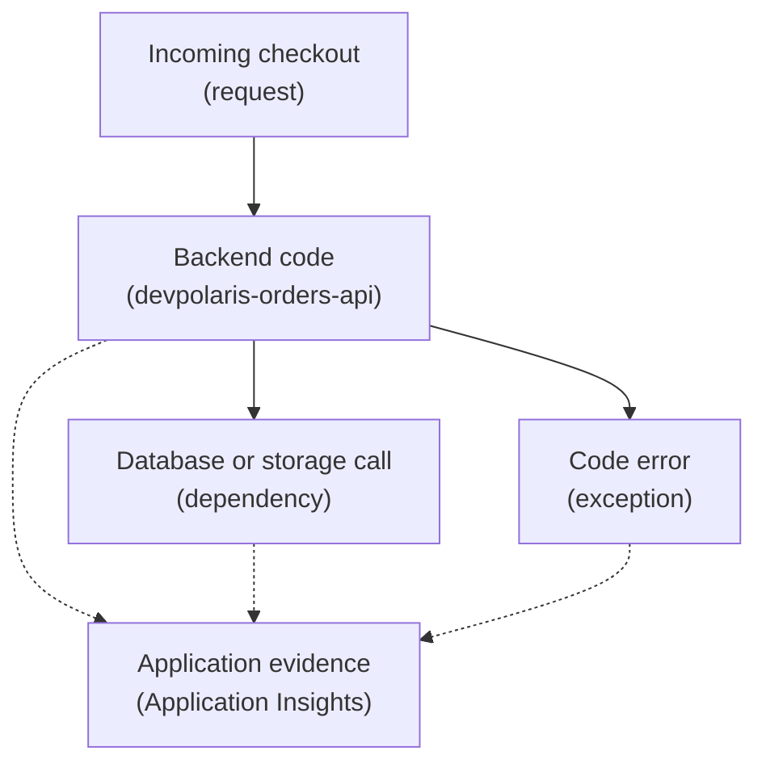

## Table of Contents

1. [A Backend Request Needs A Story](#a-backend-request-needs-a-story)
2. [If You Know X-Ray Or APM Tools](#if-you-know-x-ray-or-apm-tools)
3. [Application Insights Watches The Application Layer](#application-insights-watches-the-application-layer)
4. [Requests Are The Front Door Signal](#requests-are-the-front-door-signal)
5. [Dependencies Show What The API Called](#dependencies-show-what-the-api-called)
6. [Exceptions Explain Why The Code Failed](#exceptions-explain-why-the-code-failed)
7. [Correlation Connects The Pieces](#correlation-connects-the-pieces)
8. [Traces Help You Follow One Checkout](#traces-help-you-follow-one-checkout)
9. [Failure Modes And First Checks](#failure-modes-and-first-checks)
10. [A Practical Application Insights Review](#a-practical-application-insights-review)

## A Backend Request Needs A Story

A backend API request is not just one line in a log. It
is a small story. A request enters the app. The app
runs code. The app may call a database. It may call
Blob Storage. It may call another HTTP API. It returns
success or failure. When a user says checkout failed,
you need that story. Which request failed? Which route
handled it? Which dependency was called? How long did
each step take? Was there an exception? Did the app
return `500`, `401`, `409`, or a slower but successful
`200`?

Azure Application Insights exists to help answer those
questions at the application layer. It is part of Azure
Monitor. It focuses on application performance
monitoring, often shortened to APM. APM means watching
the behavior of live application code, including
requests, failures, dependencies, response times, and
traces. For `devpolaris-orders-api`, Application
Insights is the place a backend engineer can start when
checkout is slow or failing. It does not replace good
logs. It does not replace Azure SQL metrics. It
connects application-level evidence so you can follow a
request instead of hunting through disconnected
fragments.

## If You Know X-Ray Or APM Tools

If you know AWS X-Ray, Datadog APM, New Relic, or
OpenTelemetry ideas, Application Insights will feel
familiar. It helps show a request path and the calls
made during that request. It can connect requests,
dependencies, exceptions, traces, and performance
views. The Azure-specific part is where it lives and
how it connects to Azure Monitor.

| Idea you may know | Azure Application Insights idea | Beginner translation |
|---|---|---|
| Trace or segment | Transaction or request with related telemetry | Follow one user action across steps |
| Downstream call | Dependency | Database, HTTP, storage, or service call made by the app |
| Error event | Exception or failed request | Code failure or unsuccessful request |
| APM service map | Application map | Visual view of app components and dependencies |
| OpenTelemetry | Supported instrumentation path | A standard way to collect telemetry from app code |

The useful bridge is this: Application Insights is not
only a log bucket. It tries to understand application
behavior. That means you can ask higher-level questions
like: which API routes are slow? Which dependency calls
fail? Which exception caused these failed requests?
Which request ID connects this log line to this SQL
call? Those questions are exactly what a backend
developer needs during a production issue.

## Application Insights Watches The Application Layer

Azure resources can emit platform metrics and resource
logs. Those tell you what the platform sees.
Application Insights tells you what the app sees. For a
web backend, that usually includes request telemetry.
Request telemetry records incoming requests, their
duration, response status, and success or failure.
Dependency telemetry records calls the app makes to
other systems. Exception telemetry records errors
thrown by the application. Trace telemetry records
application log-style messages. Availability checks can
test whether an endpoint responds from outside the app.
Here is a small picture.



The app still needs to be instrumented. Instrumentation
means adding or enabling the code path that emits
telemetry. Modern Azure guidance often uses
OpenTelemetry for supported scenarios. Some hosting
environments can provide automatic collection for
certain workloads. The exact setup changes by runtime
and hosting choice, so use current Microsoft docs when
implementing it. The mental model stays stable:
Application Insights helps you observe the application
layer.

## Requests Are The Front Door Signal

Requests are the front door signal for a backend API.
They answer: which route was called? How long did it
take? Did it succeed? What status code came back? How
often is it failing? For `devpolaris-orders-api`, the
most important request might be:

```text
POST /checkout
```

A useful request record might look like this:

```text
timestamp: 2026-05-03T11:04:21.331Z
name: POST /checkout
operation_Id: op_6f2a91
resultCode: 500
success: false
durationMs: 1840
cloud_RoleName: devpolaris-orders-api
```

This tells you the route, status, duration, and
operation ID. The operation ID is important because it
can connect related telemetry. If the request failed,
you do not want only the failed request row. You want
the dependency calls, exceptions, and trace logs that
happened during that request. Request telemetry is
often the first place to start when a user-visible API
endpoint is slow or broken. It speaks the language of
the app: routes, responses, success, failure, and
duration.

## Dependencies Show What The API Called

A dependency is something your application calls. For a
backend API, common dependencies include databases,
HTTP services, storage accounts, queues, and file
systems. Application Insights dependency tracking helps
measure those calls. It can show the dependency name,
duration, result, and whether the call failed. For
checkout, dependencies might include: Azure SQL
Database for order writes. Blob Storage for receipt
uploads. Cosmos DB for idempotency or job status. A
payment provider API. Here is a small dependency
snapshot:

```text
operation_Id: op_6f2a91
request: POST /checkout

dependency: Azure SQL Database
target: devpolaris-prod-sql.database.windows.net
durationMs: 420
success: true

dependency: Blob Storage
target: devpolarisprodorders.blob.core.windows.net
durationMs: 1280
success: false
resultCode: AuthorizationPermissionMismatch
```

Now the story is clearer. The checkout request failed
after SQL succeeded. The Blob Storage dependency
failed. The first fix direction is not "rewrite
checkout." It is to inspect receipt upload permissions,
storage account network rules, managed identity role
assignments, or the blob operation being attempted.
Dependency tracking is valuable because backend
failures often happen outside your code. Your code may
be correct, but the identity, network path, database,
or storage service may reject the call. Application
Insights helps you see that boundary.

## Exceptions Explain Why The Code Failed

An exception is an error thrown by the application code
or runtime. Exceptions explain code-level failures.
They are especially useful when paired with requests
and dependencies. For example:

```text
timestamp: 2026-05-03T11:04:21.910Z
operation_Id: op_6f2a91
type: ReceiptUploadError
message: "receipt upload failed"
outerMessage: "AuthorizationPermissionMismatch"
```

This exception belongs to the checkout operation. It
gives a code-level name, `ReceiptUploadError`, and the
lower-level Azure storage message. That combination
helps both application developers and cloud operators.
The developer can inspect receipt upload handling. The
operator can inspect storage identity and network
access. Bad exception telemetry is either too vague or
too noisy. Too vague:

```text
Error: failed
```

Too noisy:

```text
Error includes full connection string, token, and customer private data
```

Useful exceptions include the type, safe message,
operation, and correlation context. They do not include
secrets. They do not dump sensitive user data.

## Correlation Connects The Pieces

Correlation is the practice of connecting related
telemetry. Without correlation, you may have a request
record, a log line, a dependency event, and an
exception that all describe the same checkout. But you
have to manually guess they belong together. With
correlation, those records share a common operation or
trace identity. For a beginner, the easiest term is
request thread. Not a CPU thread. A story thread. The
same checkout request should carry one story thread
through the app and its dependency calls. Application
Insights uses correlation concepts so related telemetry
can be shown together.

OpenTelemetry also uses trace context to connect work
across services. The exact field names depend on the
setup, but the idea is stable: one user action should
be followable. Here is the difference.

| Without correlation | With correlation |
|---|---|
| Search all logs around the same timestamp | Open one operation and see related telemetry |
| Guess which SQL call belonged to which request | Follow the request to its dependency calls |
| Ask several teams for separate screenshots | Share one operation ID or trace ID |
| Debug by time proximity | Debug by actual relationship |

Correlation does not remove the need to think. It makes
the evidence less scattered.

## Traces Help You Follow One Checkout

A trace view is most useful when you are asking: what
happened inside this one request? For checkout, a trace
might show:

```text
operation_Id: op_6f2a91
request: POST /checkout
duration: 1840 ms
result: failed

timeline:
  validate cart                18 ms
  read idempotency item        24 ms
  write order rows            420 ms
  upload receipt blob        1280 ms failed
  create response              12 ms
```

This is a teaching snapshot, not a promise that every
screen looks exactly like this. The important skill is
reading the shape. Where did most of the time go? Which
step failed? Did failure happen before or after the
database write? Did the app retry? Did a dependency
fail but the app still returned success? These
questions are hard with only separate logs. They become
much easier when the request, dependency calls,
exceptions, and traces are connected. That is why
Application Insights belongs in a backend API module,
not only an operations module. Developers need this
view to understand their own code in production.

## Failure Modes And First Checks

Application Insights can fail as an observability tool
too. If no request telemetry appears, check
instrumentation setup. Is the app configured with the
right Application Insights connection string or current
recommended setup? Is telemetry disabled in this
environment? Can the app reach ingestion endpoints? If
requests appear but dependencies do not, check
dependency tracking. Some dependencies may be collected
automatically in supported setups. Others may need
manual instrumentation. If telemetry appears in one
environment but not another, compare environment
variables, hosting configuration, network egress, and
deployment settings. If traces are disconnected,
inspect correlation. Does the app create or propagate
correlation IDs?

Do background jobs preserve the operation context when
work moves through queues? If telemetry is too noisy,
inspect sampling and logging choices. Too much
low-value telemetry makes real failures harder to find.
Here is a compact first-check table.

| Symptom | First check |
|---|---|
| No API requests visible | Instrumentation and connection configuration |
| Requests visible but no SQL or Blob dependency | Dependency tracking setup |
| Error appears but no stack or useful type | Exception handling and logging format |
| One checkout cannot be followed | Correlation context |
| Telemetry volume is too high | Sampling, log level, and noisy health checks |

The goal is not to make Application Insights perfect.
The goal is to make production requests understandable.

## A Practical Application Insights Review

Before shipping a backend API, ask whether Application
Insights can answer the first incident questions. For
`devpolaris-orders-api`, ask: can we see `POST
/checkout` request count, failures, and duration? Can
we find one failed checkout by operation ID or request
ID? Can we see Azure SQL dependency calls from that
request? Can we see Blob Storage dependency calls from
that request? Can we see exceptions with safe messages?
Can we connect app logs to request telemetry? Can we
tell the difference between app failure and dependency
failure? Can we avoid logging secrets and private
customer data?

Here is the review table.

| Evidence | Good first answer |
|---|---|
| Request telemetry | Route, status, duration, success, operation ID |
| Dependency telemetry | SQL, Blob Storage, Cosmos DB, external HTTP calls |
| Exception telemetry | Error type, safe message, operation context |
| Correlation | One checkout can be followed across related telemetry |
| Privacy | No secrets or sensitive payloads in telemetry |
| Debugging path | Failed checkout points to code, SQL, Blob, identity, or network direction |

That is enough to make Application Insights useful on
day one. You can tune dashboards, sampling, and custom
telemetry later. First make sure a real backend request
leaves a story someone can read.

---

**References**

- [Introduction to Application Insights](https://learn.microsoft.com/en-us/azure/azure-monitor/app/app-insights-overview) - Microsoft explains Application Insights as the Azure Monitor feature for application performance monitoring and OpenTelemetry-based collection.
- [Dependency tracking in Application Insights](https://learn.microsoft.com/en-us/azure/azure-monitor/app/dependencies) - Microsoft explains dependency telemetry and how requests can be correlated with dependency calls.
- [Investigate failures, performance, and transactions with Application Insights](https://learn.microsoft.com/en-us/azure/azure-monitor/app/transaction-diagnostics) - Microsoft explains transaction diagnostics for following request and dependency details.
- [Application map in Azure Application Insights](https://learn.microsoft.com/en-us/azure/azure-monitor/app/distributed-tracing-telemetry-correlation) - Microsoft explains correlation and the application map experience.
