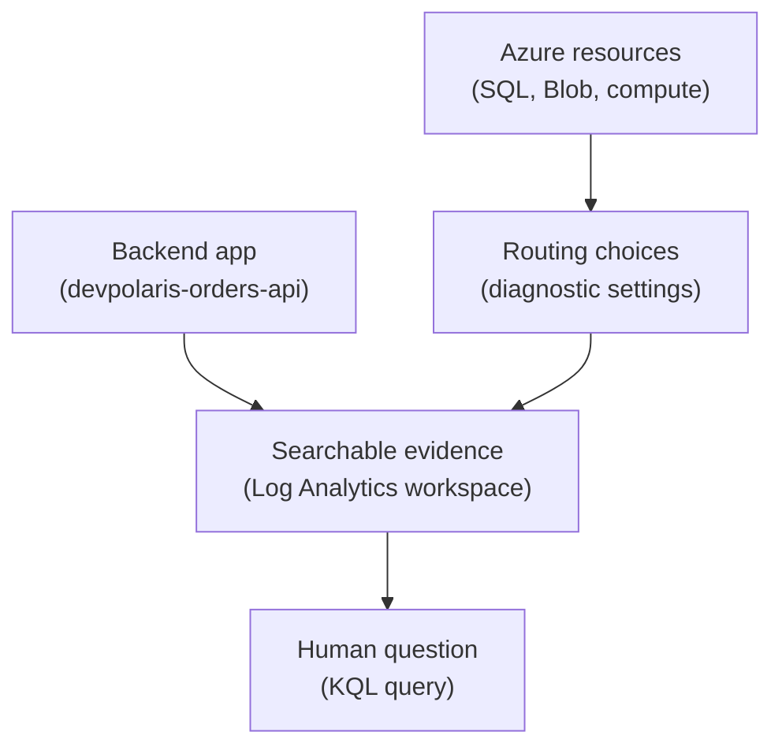

## Table of Contents

1. [Azure Monitor Is The Umbrella](#azure-monitor-is-the-umbrella)
2. [If You Know CloudWatch](#if-you-know-cloudwatch)
3. [Log Analytics Is The Searchable Workspace](#log-analytics-is-the-searchable-workspace)
4. [Diagnostic Settings Decide What Leaves A Resource](#diagnostic-settings-decide-what-leaves-a-resource)
5. [The Orders API Needs App Logs And Resource Logs](#the-orders-api-needs-app-logs-and-resource-logs)
6. [Tables Make Logs Queryable](#tables-make-logs-queryable)
7. [KQL Is How You Ask Better Questions](#kql-is-how-you-ask-better-questions)
8. [Retention Access And Cost Are Design Choices](#retention-access-and-cost-are-design-choices)
9. [Failure Modes And First Checks](#failure-modes-and-first-checks)
10. [A Practical Log Analytics Review](#a-practical-log-analytics-review)

## Azure Monitor Is The Umbrella

Azure observability has a lot of names.

Azure Monitor.

Log Analytics.

Application Insights.

Diagnostic settings.

Metrics explorer.

Workbooks.

Alerts.

The names get easier when you place them in the system.

Azure Monitor is the broad observability service.

It collects, analyzes, visualizes, and acts on telemetry from Azure resources, applications, and sometimes non-Azure systems.

Telemetry means evidence emitted by a system, such as logs, metrics, traces, and events.

Log Analytics is the tool and workspace experience for storing and querying logs.

Diagnostic settings are rules on Azure resources that send resource logs and metrics to destinations such as a Log Analytics workspace.

For a beginner, the simplest picture is:

Azure Monitor is the umbrella.

Log Analytics is where many logs become searchable.

Diagnostic settings are how many Azure resource logs get routed there.

This article follows `devpolaris-orders-api`.

The app runs in Azure.

It writes order data to Azure SQL Database.

It uploads receipt files to Blob Storage.

When checkout fails, the team needs app logs and Azure resource logs in places they can search.

That is where Azure Monitor and Log Analytics become practical.

## If You Know CloudWatch

If you know AWS CloudWatch, the Azure shape will feel familiar but not identical.

CloudWatch is often the first place AWS learners look for logs, metrics, and alarms.

Azure splits the experience across Azure Monitor, Log Analytics, Application Insights, metrics, and alerts.

Use this bridge:

| AWS idea you may know | Azure idea to compare first | What changes |
|---|---|---|
| CloudWatch Logs | Azure Monitor Logs and Log Analytics | Logs are stored in tables inside a workspace and queried with KQL |
| Log group | Log Analytics workspace plus tables | The workspace is a larger query boundary, not only one app log group |
| CloudWatch metrics | Azure Monitor Metrics | Platform metrics often exist without extra routing |
| CloudWatch alarms | Azure Monitor alerts | Alerts can use metric signals or log queries and notify action groups |
| Sending service logs to CloudWatch | Diagnostic settings | Many Azure resource logs need diagnostic settings to be collected |

The useful mental bridge is:

CloudWatch is where you may have looked for operational evidence in AWS.

In Azure, start with Azure Monitor, then ask whether the evidence is a metric, an application signal, or a log in a Log Analytics workspace.

That keeps you oriented without pretending the consoles are the same.

## Log Analytics Is The Searchable Workspace

A Log Analytics workspace is a data store for log data.

It stores logs in tables.

You query those tables with Kusto Query Language, usually called KQL.

If that sounds abstract, think of it like this:

the workspace is the place where many kinds of operational records can be searched together.

For `devpolaris-orders-api`, a workspace might hold:

application request logs.

application exception logs.

Azure SQL diagnostic logs.

Blob Storage resource logs.

Container or App Service platform logs.

Alert-related records.

The workspace gives the team one place to ask:

what happened around `2026-05-03T10:24Z`?

which requests failed with status 500?

which dependency was slow?

which storage account rejected writes?

Here is the simple path.



The important part is that logs do not become useful just because a resource exists.

The team must know which logs are collected and where they go.

## Diagnostic Settings Decide What Leaves A Resource

Many Azure resources can produce resource logs.

Resource logs are logs about operations inside an Azure resource.

Blob Storage can produce logs about storage operations.

Azure SQL can produce diagnostic and audit-style signals depending on configuration.

Other resources have their own categories.

Diagnostic settings decide which resource logs and metrics are sent to a destination.

Common destinations include Log Analytics workspaces, storage accounts, and Event Hubs.

For this module, the main destination is Log Analytics because the team wants searchable troubleshooting evidence.

The confusing beginner detail is that some signals exist automatically, while others need routing.

Azure platform metrics are often collected without extra setup.

Resource logs usually are not collected by default.

That means a missing log may not mean nothing happened.

It may mean nobody configured collection.

For `devpolaris-orders-api`, imagine Blob Storage rejects receipt uploads in production.

The app log says the upload failed.

The team wants to see the storage account side too.

If diagnostic settings for the storage account were never configured, the resource log may not be available in Log Analytics.

The fix is not during the incident only.

The fix is to decide ahead of time which resource logs matter for operating the app.

## The Orders API Needs App Logs And Resource Logs

Application logs and Azure resource logs answer different questions.

An application log tells you what the app code thought happened.

A resource log tells you what an Azure service saw.

For checkout, you often need both.

The app log might say:

```text
2026-05-03T10:24:18.441Z ERROR service=devpolaris-orders-api
requestId=req_7a91 operation=checkout dependency=blob-storage
message="receipt upload failed"
storageAccount=devpolarisprodorders container=receipts
error=AuthorizationPermissionMismatch
```

That tells you the backend tried to upload a receipt and Azure rejected it.

The storage resource log, if collected, can help confirm the operation from the storage side.

The two views protect you from guessing.

If the app never made the call, the resource log may be quiet.

If the app made the call and the resource rejected it, both sides may show evidence.

If the app log says success but the resource log says repeated failures, the app may be logging too early or catching the wrong error.

This is why "send everything to one workspace" can be useful for a small learning app.

It lets the team connect app behavior and resource behavior in one place.

For bigger organizations, workspace design can become more careful.

Location, cost, access, compliance, and team boundaries matter.

For now, keep the beginner idea:

app logs and resource logs are two sides of the same debugging story.

## Tables Make Logs Queryable

Log Analytics stores data in tables.

That means your question starts by choosing the right table or using a known query.

Application Insights telemetry can appear in tables for requests, dependencies, traces, and exceptions depending on the setup.

Azure resource logs appear in tables based on resource type and configuration.

The exact table names and schemas can vary by service and ingestion path.

Do not memorize every table on day one.

Learn the habit:

find the table that holds the signal, then narrow by time, resource, request ID, operation name, or error.

A useful first query often starts with a time window.

```text
Look at the last 30 minutes.
Filter to devpolaris-orders-api.
Find failed checkout requests.
Group by error message or dependency.
```

That sentence matters more than syntax at first.

The query is just the tool for asking it.

When a team lacks consistent fields, queries become harder.

If one log uses `requestId`, another uses `req_id`, and a third hides the ID inside a message string, humans suffer.

Good logging structure makes Log Analytics more useful.

The workspace cannot magically create clean fields from messy logs unless you design ingestion and parsing around that.

## KQL Is How You Ask Better Questions

KQL is the query language used by Azure Monitor Logs.

You do not need to become a KQL expert before you can debug.

You do need the idea that logs become more useful when you can filter, summarize, and sort them.

Here is a readable example, shown as a teaching artifact rather than a command to memorize:

```text
requests
| where timestamp > ago(30m)
| where cloud_RoleName == "devpolaris-orders-api"
| where name == "POST /checkout"
| summarize failures=countif(success == false), total=count() by bin(timestamp, 5m)
```

Read it like English.

Start from request records.

Look at the last 30 minutes.

Keep the orders API.

Keep checkout requests.

Count failures and total requests in five-minute groups.

The point is not the exact table name for every setup.

The point is that KQL lets you turn many records into an answer.

A second query might look for exceptions:

```text
exceptions
| where timestamp > ago(30m)
| where cloud_RoleName == "devpolaris-orders-api"
| project timestamp, operation_Id, type, outerMessage
| order by timestamp desc
```

This query helps you find recent exceptions and the operation ID that can connect to a trace.

That connection is where logs and tracing start to work together.

## Retention Access And Cost Are Design Choices

A Log Analytics workspace is not just a search box.

It has retention, access, and cost behavior.

Retention means how long data stays available.

Access means who can read it.

Cost is affected by the amount and kind of data ingested and retained.

These are design choices.

They should match the operating need.

For `devpolaris-orders-api`, a team may want recent interactive logs for debugging releases and incidents.

They may not need every debug line for a year.

They may need security or audit logs for longer.

Those are different retention needs.

Access matters too.

Logs can contain sensitive context.

They should not contain secrets, but they may still contain customer IDs, order IDs, IP addresses, or operational details.

Not everyone who can deploy the app should automatically read every log table.

Cost matters because collecting everything is easy until the bill arrives.

The answer is not "collect nothing."

The answer is to collect useful evidence intentionally.

Useful observability is designed, not dumped.

## Failure Modes And First Checks

When logs are missing, ask whether they were ever collected.

If Blob Storage resource logs are absent, check diagnostic settings for the storage account.

If app logs are absent, check whether the app sends telemetry, whether the connection string or instrumentation key setup is correct for the current approach, and whether the app environment can reach ingestion endpoints.

When logs exist but are hard to search, inspect structure.

Are request IDs consistent?

Are error fields separate from message text?

Is the service name present?

Are timestamps in a normal format?

When logs are too expensive, inspect volume.

Is the app logging every successful health check?

Is debug logging enabled in production?

Are resource categories collected that nobody uses?

When the wrong people can read logs, inspect workspace access.

Logs often feel harmless because they are "only text."

They are production evidence and should be treated with care.

Here is a practical first-check table.

| Problem | First check |
|---|---|
| No storage resource logs | Diagnostic settings on the storage account |
| No app request logs | Application instrumentation and ingestion configuration |
| Logs have no request ID | Application logging format |
| Queries are slow or expensive | Time range, table choice, and ingestion volume |
| Team cannot see logs | Workspace access and role assignments |

This is the shape of Azure log debugging.

First find whether evidence exists.

Then find where it lives.

Then ask a narrow question.

## A Practical Log Analytics Review

Before shipping a service, ask what evidence should exist when it fails.

For `devpolaris-orders-api`, the team should answer:

where do application request logs go?

where do exception logs go?

which Azure resource logs are enabled?

which workspace receives them?

which fields connect one request across app logs and dependency calls?

who can read the workspace?

how long are logs retained?

which logs are too noisy to keep?

which missing log would make an incident hard?

Here is a compact review.

| Area | Good first answer |
|---|---|
| App request evidence | Application Insights and Log Analytics |
| Azure SQL evidence | Metrics plus selected diagnostic logs |
| Blob Storage evidence | Diagnostic settings for operation logs if needed |
| Query habit | Start with time range, service, operation, request ID |
| Access | Monitoring readers can inspect needed logs |
| Cost | Keep useful production evidence, avoid noisy debug logs |

The goal is not a perfect logging platform.

The goal is a practical evidence path.

When checkout fails, a junior engineer should be able to ask:

what happened, where did it happen, and which Azure resource saw it?

Log Analytics is one of the main places that answer can live.

---

**References**

- [Azure Monitor overview](https://learn.microsoft.com/en-us/azure/azure-monitor/fundamentals/overview) - Microsoft explains the Azure Monitor umbrella and its data platform.
- [Log Analytics workspace overview](https://learn.microsoft.com/en-us/azure/azure-monitor/logs/log-analytics-workspace-overview) - Microsoft explains workspaces, tables, retention, access, and cost concepts.
- [Overview of Log Analytics in Azure Monitor](https://learn.microsoft.com/en-us/azure/azure-monitor/logs/log-analytics-overview) - Microsoft explains the Log Analytics query experience and KQL mode.
- [Diagnostic settings in Azure Monitor](https://learn.microsoft.com/en-us/azure/azure-monitor/platform/diagnostic-settings) - Microsoft explains how diagnostic settings collect and route resource logs, platform metrics, and activity logs.
