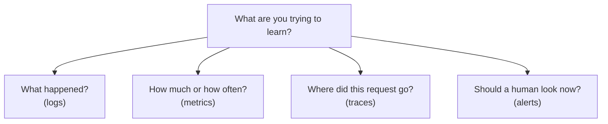
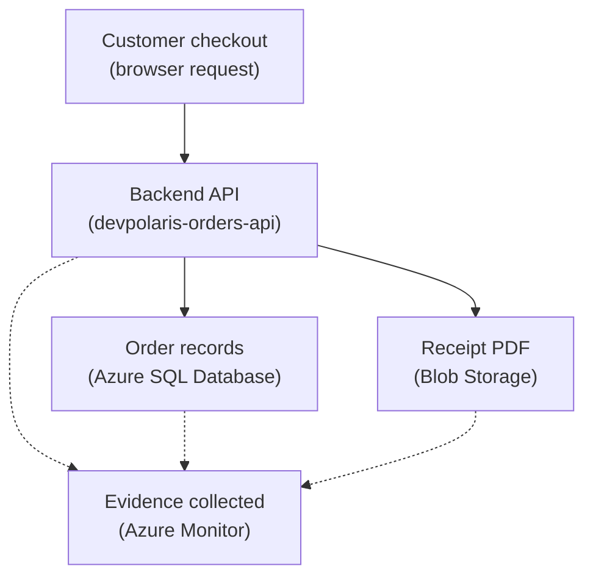

## Table of Contents

1. [Start With Evidence Not Guessing](#start-with-evidence-not-guessing)
2. [If You Know AWS Monitoring](#if-you-know-aws-monitoring)
3. [Four Signals With Different Jobs](#four-signals-with-different-jobs)
4. [The Checkout Request Creates Several Clues](#the-checkout-request-creates-several-clues)
5. [Logs Tell You What Happened](#logs-tell-you-what-happened)
6. [Metrics Tell You How Often And How Much](#metrics-tell-you-how-often-and-how-much)
7. [Traces Tell You Where Time Went](#traces-tell-you-where-time-went)
8. [Alerts Tell Humans When To Look](#alerts-tell-humans-when-to-look)
9. [What To Check First During A Checkout Failure](#what-to-check-first-during-a-checkout-failure)
10. [Tradeoffs In Observability](#tradeoffs-in-observability)

## Start With Evidence Not Guessing

After an app is deployed, the code is no longer the
only source of truth. The running system has its own
story. Requests arrive. Databases respond slowly.
Storage permissions fail. Containers restart. Users
retry actions. Some of those events leave evidence.
Some disappear unless the team planned for them.
Observability is the practice of collecting and reading
that evidence. It exists so engineers can understand a
system from the outside, after the system is already
running. That matters because production rarely gives
you the clean view your laptop gives you. On your
laptop, you can open the terminal, see the stack trace,
add `console.log`, and try again.

In Azure, `devpolaris-orders-api` may run in App
Service or Container Apps. It may call Azure SQL
Database. It may upload receipt files to Blob Storage.
It may use Cosmos DB for job status. It may have
several running copies. When checkout fails, you need
evidence across those pieces. Azure Monitor is the
broad Azure observability service. Application Insights
is the application performance monitoring part that
helps you understand web apps and APIs. Log Analytics
is a place where logs can be stored and queried.
Metrics, dashboards, alerts, and traces help you see
patterns, not just one event.

Those product names can feel like a lot, so start with the signal types.
Logs tell you what happened. Metrics tell you how much or how often.
Traces tell you where one request went. Alerts tell humans when to look.
The Azure product names make more sense after that model is clear.

## If You Know AWS Monitoring

If you have learned AWS, Azure observability has familiar ideas.
CloudWatch Logs has a similar job to Azure Monitor Logs and Log
Analytics. CloudWatch metrics have a similar job to Azure Monitor
Metrics. CloudWatch alarms have a similar job to Azure Monitor alert
rules. AWS X-Ray has a similar teaching role to Application Insights
tracing, even though the provider surfaces and data models differ.

| AWS idea you may know | Azure idea to compare first | What to remember |
|---|---|---|
| CloudWatch Logs | Azure Monitor Logs and Log Analytics | Log Analytics is where you query many Azure logs |
| CloudWatch metrics | Azure Monitor Metrics | Azure platform metrics exist for many resources without extra setup |
| CloudWatch alarms | Azure Monitor alerts | Alert rules can use metrics or logs, then call action groups |
| SNS notification target | Action group | Action groups decide who or what gets notified |
| X-Ray trace | Application Insights transaction and tracing views | Application Insights connects requests, dependencies, exceptions, and traces |

The useful AWS habit is asking which signal answers your question. If a
user says checkout failed once, start with logs and traces. If the API
is slow for everyone, start with metrics and traces. If nobody noticed a
database problem until customers complained, inspect alerts. Provider
names change, but the debugging questions stay surprisingly stable.

## Four Signals With Different Jobs

Observability signals are different kinds of evidence.
They answer different questions. Logs are event
records. A log line says something happened at a time.
It may include a request ID, user ID, error message,
status code, or component name. Logs are good when you
need detail. Metrics are numbers over time. A metric
says how much, how many, how fast, or how often.
Request count, error rate, CPU usage, database DTU
usage, and response time are metric-shaped. Metrics are
good when you need a trend or threshold. Traces connect
work inside one request. A trace lets you follow
checkout from the public API into the backend, then to
Azure SQL Database, Blob Storage, or another
dependency.

Traces are good when you need to know where time or
failure happened inside a request. Alerts are rules
that tell humans when a signal needs attention. An
alert is not a new kind of evidence. It is a decision
that a metric, log query, or other signal is important
enough to notify someone. Here is the compact model.



The diagram is simple on purpose. Do not start by
asking which Azure screen to click. Start by asking
what kind of evidence would answer the question. Then
choose the Azure tool that holds that evidence.

## The Checkout Request Creates Several Clues

The running example is one checkout request. A customer
clicks "Place order." The browser sends a request to
`devpolaris-orders-api`. The API validates the cart. It
writes order records to Azure SQL Database. It may
check an idempotency item in Cosmos DB. It uploads a
receipt PDF to Blob Storage. It returns an order ID.
That path can fail in several ways. The API code may
throw an exception.

Azure SQL may reject the connection. Blob Storage may
reject the upload permission. Cosmos DB may throttle a
job-status write. The app may return slowly because a
dependency is slow. Good observability lets you see the
difference. Here is the small checkout picture.



The dotted lines mean evidence is collected about the
system. They do not mean the monitoring service is part
of the checkout business flow. That distinction
matters. Observability should help you understand
checkout. It should not become the reason checkout
works.

## Logs Tell You What Happened

A log is a written event. When checkout fails, the
first useful log is not "something failed." The useful
log tells you where, when, and under which request. For
example:

```text
2026-05-03T10:24:18.441Z ERROR service=devpolaris-orders-api
requestId=req_7a91 operation=checkout
customerId=cus_77 dependency=azure-sql
message="checkout write failed"
error="Login failed for user '<token-identified principal>'"
```

This log gives a direction. The failure happened during
checkout. The dependency was Azure SQL Database. The
likely first checks are database identity, database
user mapping, and connection configuration. That is
much better than this:

```text
checkout failed
```

The second log may be true, but it is hard to use during an incident.
Good logs include context such as request IDs, operation names,
dependency names, and useful error details. They avoid leaking secrets
and use consistent field names. If one service logs `requestId` and
another logs `correlation_id`, humans and queries have to work harder.
Logs are especially good for finding the first meaningful error,
checking what the app thought it was doing, inspecting one customer or
request path, seeing exact exception messages, and confirming whether
code reached a step. For broad trends such as rising checkout errors
across all users, metrics are usually easier.

If you want to know whether one request spent most of
its time in SQL or Blob Storage, tracing is usually
easier.

## Metrics Tell You How Often And How Much

Metrics are numbers over time. They help you see shape.
One log line can tell you one checkout failed. A metric
can tell you checkout failures rose from 1 percent to
18 percent after a deployment. That pattern matters.
Here are metric-shaped questions: how many requests per
minute are hitting the API? What percentage of requests
fail? What is the average or percentile response time?
How often does Azure SQL reject connections? How much
storage is the account using? How many container
replicas are running? Metrics are useful because they
are compact. You do not need to read 40,000 log lines
to see that latency doubled.

You look at a chart. For `devpolaris-orders-api`, a
simple operating view might include:

| Metric | Why the team watches it |
|---|---|
| Request count | Shows traffic shape |
| Failed request rate | Shows user-visible pain |
| Response time | Shows whether checkout is getting slow |
| Azure SQL connection failures | Shows database access trouble |
| Blob upload failures | Shows receipt-generation trouble |

Metrics can hide detail. If the failed request rate
jumps, the metric does not tell you the exact exception
by itself. It tells you where to look next. That is why
metrics and logs work together. Metrics show the smoke.
Logs help you find the match.

## Traces Tell You Where Time Went

A trace follows one request through the work it caused.
For a backend developer, the easiest mental model is a
call stack across services. On your laptop, a stack
trace shows which functions led to an error. In the
cloud, one user request may cross the API, database,
storage service, and queue. A distributed trace helps
connect those steps. For checkout, the trace might
show:

```text
operation: checkout req_7a91
total duration: 1840 ms

devpolaris-orders-api  1840 ms
  validate-cart          18 ms
  azure-sql orders      420 ms
  blob upload receipt  1280 ms
  response write         12 ms
```

This tells a different story from a simple error count.
The request did not fail at validation. It spent most
of its time uploading the receipt. That points the team
toward Blob Storage, network path, file size, retry
behavior, or receipt generation. Traces become more
useful when every part of the request shares
correlation context. A correlation ID is a value that
lets you connect related telemetry. If the API log, SQL
dependency event, and blob dependency event all share
the same operation ID or trace ID, you can follow the
request. If each piece uses a different ID or no ID,
the investigation becomes manual.

Application Insights helps with this for instrumented applications. The
setup details matter later; the beginner concept is that one user action
should be followable.

## Alerts Tell Humans When To Look

Alerts are rules that turn signals into human attention. An alert might
say: failed checkout rate is above 5 percent for 10 minutes, API
response time is above the agreed limit, Azure SQL database CPU or DTU
pressure is high, or Blob upload failures are happening repeatedly. A
good alert catches important problems before users have to explain them
to you. It needs three things: the resource or data to watch, the
condition that matters, and the action group that decides who or what
gets notified.

An action group is the Azure Monitor object that holds
notification or automation actions. For a beginner,
read action group as: who gets told, and what should
happen when the alert fires? Good alerts are specific
enough to act on. "Something is wrong" is not a helpful
alert. "Checkout failed request rate is above 5 percent
for 10 minutes" gives the on-call engineer a direction.
Bad alerts teach people to ignore monitoring. Good
alerts protect attention.

## What To Check First During A Checkout Failure

When checkout fails, do not open every Azure screen at
once. Start with the question. Then choose the signal.

| Symptom | First signal | First Azure place to inspect |
|---|---|---|
| One customer reports one failed checkout | Logs and trace | Application Insights transaction or Log Analytics query by request ID |
| Many customers see failures | Metrics, then logs | Azure Monitor metrics, then Application Insights failures |
| Checkout is slow but succeeds | Trace and metrics | Application Insights performance and dependencies |
| Receipt files are missing | Logs and resource logs | App logs plus Blob Storage diagnostic logs if enabled |
| No one noticed until support reported it | Alerts | Azure Monitor alert rules and action groups |

Use this table as a thinking guide. The first check should match the
shape of the problem. If the problem is one request, find the request.
If the problem is a trend, find the metric. If the problem is a slow
path, find the trace. If the problem was missed, inspect the alerting
design.

## Tradeoffs In Observability

More telemetry is not automatically better. Every log,
metric, trace, and alert has a cost. Cost can mean
money. It can also mean noise, privacy risk, and human
attention. If you log too little, incidents become
guessing games. If you log too much, the useful line is
buried. If you trace nothing, slow requests are hard to
explain. If you trace everything at high volume without
thinking, the data can become expensive. If you alert
on every small movement, people stop trusting alerts.
If you alert only after a full outage, monitoring is
late.

A good observability design is not "collect
everything." It is: collect the evidence that answers
real operating questions. Keep enough context to debug.
Protect secrets and user data. Turn only important
signals into alerts. For `devpolaris-orders-api`, the
practical promise is clear. If checkout fails, the team
should know whether the failure came from app code,
Azure SQL Database, Blob Storage, Cosmos DB, identity,
or network access. If checkout gets slow, the team
should know where the time went. If errors rise, the
right human should know before support has to ask. That
is the mental model.

The next articles turn it into Azure tools.

---

**References**

- [Azure Monitor overview](https://learn.microsoft.com/en-us/azure/azure-monitor/fundamentals/overview) - Microsoft explains Azure Monitor as the unified service for metrics, logs, traces, events, analysis, visualization, and alerts.
- [Azure Monitor Metrics overview](https://learn.microsoft.com/en-us/azure/azure-monitor/metrics/data-platform-metrics) - Microsoft explains metrics as numeric time-series data and how platform metrics are collected.
- [Log Analytics workspace overview](https://learn.microsoft.com/en-us/azure/azure-monitor/logs/log-analytics-workspace-overview) - Microsoft explains the workspace that stores log data for querying and analysis.
- [Introduction to Application Insights](https://learn.microsoft.com/en-us/azure/azure-monitor/app/app-insights-overview) - Microsoft explains Application Insights as the Azure Monitor feature for application performance monitoring.
- [What are Azure Monitor alerts?](https://learn.microsoft.com/en-us/azure/azure-monitor/alerts/alerts-overview) - Microsoft explains alert rules, alert states, and action groups.
