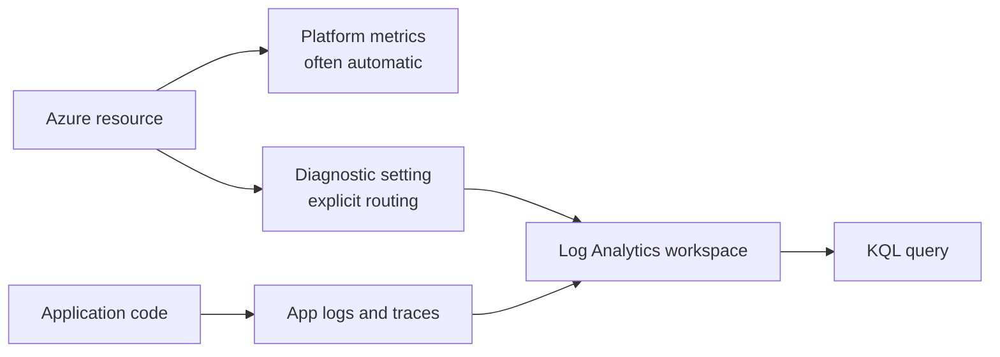

## Table of Contents

1. [The Problem](#the-problem)
2. [Azure Monitor](#azure-monitor)
3. [Diagnostic Settings](#diagnostic-settings)
4. [Log Analytics Workspace](#log-analytics-workspace)
5. [Tables](#tables)
6. [KQL](#kql)
7. [Retention](#retention)
8. [Cost And Access](#cost-and-access)
9. [Putting It All Together](#putting-it-all-together)
10. [What's Next](#whats-next)

## The Problem

The previous article gave the observability map: logs, metrics, traces, and alerts answer different questions. Now the checkout team has a more specific problem.

`devpolaris-orders-api` logs this error:

```text
receipt upload failed: AuthorizationPermissionMismatch
```

The app team wants the storage account side of the story. Did Blob Storage see the request? Which identity made it? Which operation failed? Was the request blocked by permissions, network rules, or a bad container name?

They open Log Analytics and find nothing.

That blank screen might mean the storage account had no matching failure. It might also mean the storage account resource logs were never collected. This is the first beginner trap in Azure logging: a resource can exist, and platform metrics can exist, while useful resource logs are still absent because nobody routed them.

## Azure Monitor

Azure Monitor is the umbrella for Azure observability. It collects and analyzes telemetry from Azure resources, applications, and other environments. Under that umbrella, logs and metrics use different stores. Azure Monitor Metrics stores numeric time-series data. Azure Monitor Logs stores log and performance data in Log Analytics workspaces.

That separation matters because the collection behavior is different. Many Azure resources create platform metrics automatically. Resource logs are different. For many resources, resource logs are not collected until you configure diagnostic settings.

Think of Azure Monitor as the system that knows how to receive evidence. It does not mean every useful log has already been saved. You still choose what to collect, where to send it, how long to keep it, and who can read it.



The diagram shows the subtle part. Metrics may be ready before you do anything. Many resource logs need a routing decision.

## Diagnostic Settings

A diagnostic setting tells Azure what data to send from a resource and where to send it. Common destinations include a Log Analytics workspace, a storage account, an event hub, or a partner destination. For this module, the important destination is the Log Analytics workspace because the team wants searchable incident evidence.

Each resource that needs resource log collection needs its own diagnostic setting. That is the part beginners often miss. The workspace is the destination. Diagnostic settings are the routes that send resource logs into it.

For checkout, the storage account might need a diagnostic setting that sends Blob Storage read, write, and delete logs to the production workspace. Azure SQL might need its own diagnostic configuration for database-level signals. The app runtime might send application logs through Application Insights or another logging path.

There are two gotchas worth keeping close.

First, a missing log is ambiguous. It may mean the event did not happen, or it may mean the resource was not configured to collect that category. During incidents, that ambiguity is expensive.

Second, diagnostic settings can outlive assumptions. If you delete, rename, move, or recreate resources, review diagnostic settings. Microsoft documents a warning that stale settings can be applied to a recreated resource in some cases. Logging routes are part of the resource lifecycle, not a one-time checkbox.

## Log Analytics Workspace

A Log Analytics workspace is the data store where Azure Monitor Logs keeps log data. It is also the query boundary most learners meet first. When someone says, "search the Azure logs," they often mean "open the workspace and run a KQL query."

The workspace has region, retention, access control, table plans, cost behavior, and sometimes organizational boundaries. A small learning system can use one production workspace for app and resource logs. A larger company may split workspaces by environment, compliance boundary, team ownership, or data residency.

For the orders app, the beginner-friendly workspace design might look like this:

| Workspace | Environment | Example data | Reason |
| --- | --- | --- | --- |
| `law-devpolaris-prod` | Production | API request telemetry, storage resource logs, SQL diagnostic logs, alert records | One place to investigate production checkout. |
| `law-devpolaris-dev` | Development | Lower-volume app and resource logs | Keeps experiments away from production evidence and cost. |

Do not split workspaces just to make the diagram look professional. Split when the split protects access, cost, compliance, or operational ownership. Every split also creates another place investigators may have to search.

## Tables

Logs inside a workspace live in tables. A table gives records a schema, time column, and query surface. Application telemetry may appear in tables for requests, dependencies, traces, and exceptions depending on the instrumentation path. Azure resource logs may appear in resource-specific tables or shared Azure diagnostics tables depending on the service and configuration.

The exact table names are less important than the habit:

1. Choose the time window.
2. Choose the table that probably contains the signal.
3. Filter to the resource, operation, request ID, status, or error.
4. Summarize only after you have narrowed the data enough to trust the result.

A table is what turns a pile of events into something queryable. If your app logs everything as one unstructured message string, tables still store the logs, but the team has to parse meaning out of text. If your logs carry stable fields such as `operation`, `requestId`, `dependency`, `status`, and `errorCode`, KQL becomes much more useful.

## KQL

Kusto Query Language, usually called KQL, is how you ask questions of Azure Monitor Logs. You do not need to memorize the language before you understand the job. KQL lets you filter, project, summarize, join, and sort records.

A useful first question is often plain English:

```text
In the last 30 minutes, show failed checkout requests for the orders API,
then group them by dependency and error code.
```

The KQL shape might look like this:

```text
requests
| where timestamp > ago(30m)
| where cloud_RoleName == "devpolaris-orders-api"
| where name == "POST /checkout"
| where success == false
| summarize failures = count() by resultCode
| order by failures desc
```

The habit matters more than this exact table and column shape. Time first. Narrow to the app and operation. Filter failure. Summarize after you have the right slice.

KQL is also where inconsistent logging hurts. If half your services write `requestId`, a few write `correlation_id`, and one buries the ID in a sentence, queries become fragile. The language can help, but it cannot fully rescue sloppy telemetry design.

## Retention

Retention decides how long log data stays available for analytics. Short retention lowers cost but makes older incidents harder to investigate. Long retention helps audit and trend analysis but costs more and may raise privacy or compliance questions.

For the orders app, not every table needs the same retention. Detailed debug traces might be useful for a few days. Security-relevant audit records may need much longer retention. High-volume noisy logs may need filtering, transformation, lower-cost table plans, or different destinations.

The beginner mistake is letting retention be an accident. If checkout failed last week and the logs expired after three days, the team cannot query its way back to evidence. If verbose debug logs are retained for a year without a reason, the team may pay to keep data nobody reads.

Treat retention as an operating promise:

| Data | Possible retention reason |
| --- | --- |
| Recent app requests and exceptions | Debug current incidents and recent deployments. |
| Storage and database resource logs | Prove resource-side behavior during failures. |
| Security and audit records | Support investigation, compliance, and access review. |
| High-volume debug traces | Keep briefly unless they answer a known operational need. |

## Cost And Access

Logs cost money because collecting, storing, and querying data uses a service. The main cost mistake is collecting high-volume data without knowing who will use it or how long it should live. The main access mistake is giving broad log access without noticing that logs can contain sensitive operational details.

Cost and access are linked. A workspace that holds production checkout logs may include user IDs, resource names, error messages, endpoint paths, and operational details. It should be readable by people who need to operate the system, not by everyone who can deploy a demo resource.

This is why workspace design is an observability and ownership decision. Ask:

| Design question | Why it matters |
| --- | --- |
| Which teams need to query this workspace? | Determines access boundaries and investigation speed. |
| Which tables are high volume? | Determines ingestion and retention cost risk. |
| Which logs include sensitive details? | Determines masking, transformation, and RBAC choices. |
| Which logs must exist during an incident? | Determines diagnostic settings and retention promises. |

The healthiest beginner rule is simple: collect the logs you know how to use, give them stable fields, retain them for a reason, and revisit the noisy tables after the first few real incidents.

## Putting It All Together

Return to the blank Log Analytics screen.

- Azure Monitor was the umbrella, but it did not guarantee every resource log existed.
- The storage account needed diagnostic settings to route resource logs to the workspace.
- The Log Analytics workspace was the searchable destination, not an automatic vacuum for every Azure event.
- Tables made the data queryable, but only if the right data reached them.
- KQL helped narrow the investigation from "checkout failed" to a time window, resource, operation, and error code.
- Retention, cost, and access decided whether the evidence would still be available and who could read it.

The key lesson is that logs are designed before incidents and queried during incidents. If the design is missing, the query cannot invent evidence after the fact.

## What's Next

Logs show events. The next article follows one user request through Application Insights so the team can connect requests, dependencies, exceptions, traces, correlation, and the application map.

---

**References**

- [Azure Monitor overview](https://learn.microsoft.com/en-us/azure/azure-monitor/fundamentals/overview)
- [Azure Monitor Logs overview](https://learn.microsoft.com/en-us/azure/azure-monitor/logs/data-platform-logs)
- [Diagnostic settings in Azure Monitor](https://learn.microsoft.com/en-us/azure/azure-monitor/platform/diagnostic-settings)
- [Log Analytics workspace overview](https://learn.microsoft.com/en-us/azure/azure-monitor/logs/log-analytics-workspace-overview)
- [Kusto Query Language overview](https://learn.microsoft.com/en-us/kusto/query/?view=microsoft-fabric)
