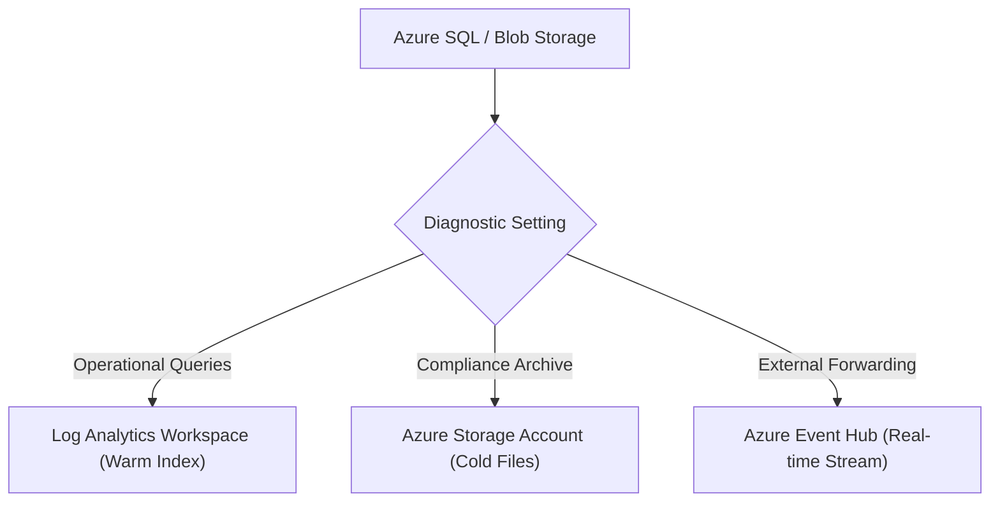
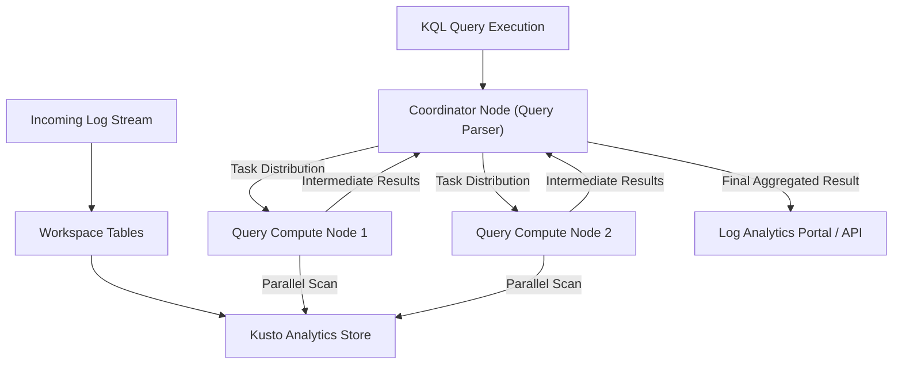

## Table of Contents

1. [The Routing Problem](#the-routing-problem)
2. [Diagnostic Settings and Telemetry Routing](#diagnostic-settings-and-telemetry-routing)
3. [Log Analytics Workspace Architecture](#log-analytics-workspace-architecture)
4. [Columnar Storage and Ingestion Pipeline Mechanics](#columnar-storage-and-ingestion-pipeline-mechanics)
5. [Log Analytics Workspace Bicep Configuration](#log-analytics-workspace-bicep-configuration)
6. [Mastering Kusto Query Language (KQL)](#mastering-kusto-query-language-kql)
7. [KQL Analytical Query Examples](#kql-analytical-query-examples)
8. [Data Lifecycle: Retention Tiers and Archival Retrieval](#data-lifecycle-retention-tiers-and-archival-retrieval)
9. [Putting It All Together](#putting-it-all-together)
10. [What's Next](#whats-next)

## The Routing Problem

When an application experiences an intermittent failure in production, diagnosing the issue requires immediate access to system event records.
However, in a cloud environment, resource logs are not collected or indexed by default.
If a managed database encounters a transaction deadlock, or if a storage account rejects a file upload due to a firewall rule, the diagnostic evidence remains dormant on the physical host hardware.

Unless you establish explicit routing rules, these logs are permanently lost when containers scale down or virtual machines restart.
A robust release process requires centralizing all diagnostic logs in a queryable database before any traffic moves.
Azure Monitor provides the data routing and storage fabric to capture these logs, while Log Analytics workspaces serve as the central repository for operational analysis.

## Diagnostic Settings and Telemetry Routing

A Diagnostic Setting is the routing rule that tells an Azure resource where to send its logs and metrics. It exists because many Azure resources do not automatically place detailed diagnostic records into a queryable workspace.

Example: a Storage Account diagnostic setting can send blob read, write, and delete records to `law-orders-prod` for KQL search and to a storage account for long-term audit files.

A Diagnostic Setting is the telemetry routing rule for a resource, directing raw resource logs to a workspace, archive bucket, or streaming endpoint.



A Diagnostic Setting supports three data destinations:
- **Log Analytics Workspace**: The primary destination for operational monitoring, routing logs to warm, column-oriented tables that are queryable within seconds.
- **Azure Storage Account**: A low-cost archival path that writes raw logs to blob containers as compressed JSON files, suitable for long-term compliance audits where active query access is not needed.
- **Azure Event Hub**: A real-time ingestion pipeline that streams log bytes to external SIEM or observability platforms, such as Splunk, Datadog, or elasticsearch.

When declaring a Diagnostic Setting, you must explicitly check the log and metric categories you want to collect.
On a Storage Account, this includes checking write, read, and delete operations.
On an Azure SQL Database, this includes auditing connection attempts, query executions, and block timeouts.
Leaving these categories unselected creates a diagnostic blind spot during active incidents.

## Log Analytics Workspace Architecture

A Log Analytics Workspace is Azure Monitor's queryable database for operational logs. It is the place where routed logs become tables that engineers can search with KQL.

Example: `law-orders-prod` can contain `AzureActivity`, `StorageBlobLogs`, `AppRequests`, and `AppExceptions` rows for the production orders system.

It is the fundamental security boundary, billing root, and storage container for your operational logs.
Unlike flat log directories on a server, a workspace organizes data into highly structured, schema-enforced tables.

It behaves like a centralized analytics database designed specifically to ingest, index, and query structured log records from cloud resources.

```plain
Workspace Table Catalog:
  AzureActivity: Subscription control-plane modifications
  StorageBlobLogs: API-level blob write, read, and delete transactions
  AppRequests: Application-level HTTP request logs and durations
  AppExceptions: Code-level exception traces and error callstacks
```

When designing a cloud environment, you must choose between a centralized workspace and a segmented workspace topology.
A centralized topology routes all logs from development, staging, and production environments to a single workspace.
This simplifies cross-service diagnostics but complicates data-plane access control.
A segmented topology deploys isolated workspaces per environment (e.g., `law-orders-prod` and `law-orders-dev`), enforcing strict security boundaries at the cost of unified query visibility.

## Columnar Storage and Ingestion Pipeline Mechanics

Columnar storage is the table layout that lets the query engine scan only the fields your query needs. To write efficient queries during production incidents, you must understand the underlying physical storage mechanics of the Log Analytics Workspace.
The database is built on the Kusto query engine, which organizes data in a columnar format rather than horizontal rows.

Column-oriented storage organizes data into vertical columns on disk, meaning the engine only reads the specific fields requested by your query.



When logs are ingested, they pass through a volatile in-memory buffer before being written to persistent disk shards.
The ingestion pipeline automatically indexes every column, compressing repeating strings and categorizing shards by ingestion time boundaries.

At runtime, the Kusto engine processes queries using a distributed, coordinator-worker architecture:
- A coordinator node receives the log query, compiles the search syntax, and checks permissions.
- The coordinator analyzes the time filter, pruning all database shards that fall outside the query window.
- It distributes scanning tasks to multiple query compute worker nodes.
- The worker nodes scan the specific columnar shards in parallel, evaluating filters and computing intermediate summaries.
- The workers return these intermediate summaries to the coordinator node.
- The coordinator aggregates the data streams and returns the final query result.

This distributed parallel scan executes within seconds, provided that your query contains a restrictive time filter to prune irrelevant storage shards.

## Log Analytics Workspace Bicep Configuration

To manage log routing programmatically, we declare our workspaces and diagnostic settings using Bicep.
The template below provisions a Log Analytics Workspace with a 30-day retention window and configures a Diagnostic Setting to route storage logs directly to the workspace:

```bicep
param workspaceName string = 'law-devpolaris-prod'
param storageAccountName string = 'stordersprod'
param location string = resourceGroup().location

resource logAnalyticsWorkspace 'Microsoft.OperationalInsights/workspaces@2022-10-01' = {
  name: workspaceName
  location: location
  properties: {
    sku: {
      name: 'PerGB2018'
    }
    retentionInDays: 30
    features: {
      enableLogAccessUsingOnlyResourcePermissions: true
    }
  }
}

resource storageAccount 'Microsoft.Storage/storageAccounts@2023-01-01' existing = {
  name: storageAccountName
}

resource storageBlobDiagnosticSettings 'Microsoft.Insights/diagnosticSettings@2021-05-01-preview' = {
  name: 'diag-storage-blob-routing'
  scope: storageAccount
  properties: {
    workspaceId: logAnalyticsWorkspace.id
    logs: [
      {
        category: 'StorageRead'
        enabled: true
      }
      {
        category: 'StorageWrite'
        enabled: true
      }
      {
        category: 'StorageDelete'
        enabled: true
      }
    ]
    metrics: [
      {
        category: 'AllMetrics'
        enabled: true
      }
    ]
  }
}
```

This declarative configuration ensures that all blob reads, writes, and deletions are automatically captured and indexed inside the workspace database.

## Mastering Kusto Query Language (KQL)

Kusto Query Language (KQL) is a read-only data processing language designed for fast telemetry search.
KQL is structured as a left-to-right query pipeline, where each pipe-delimited step filters, reshapes, or summarizes the result set from the previous step.

KQL is a read-only query language where each operator refines and shapes the data stream before passing it to the next step.

Example: start with `StorageBlobLogs`, filter to the last hour, keep only `StatusCode == 403`, select the useful columns, and summarize failures by blob path.

To write performant, reliable queries during production incidents, build your KQL pipeline using these core operators:

### 1. Table Source
The table source is the log table you want to inspect. Every KQL query starts with one table name as the primary data source:

```plain
StorageBlobLogs
```

### 2. Time Filtering (`where TimeGenerated > ago()`)
Time filtering limits the query to a recent window. Always place your time filter as the first operator immediately following the table source.
This tells the coordinator node to prune historical disk shards, scanning only the data blocks written within the specified window.

```plain
| where TimeGenerated > ago(1h)
```

### 3. Logical Operations (`where`)
Logical filters keep only rows that match the condition you care about. Apply `where` filters to isolate specific failures, HTTP status codes, or client IPs:

```plain
| where OperationName == "PutBlob"
| where StatusCode == 403
```

### 4. Projection (`project`)
Projection chooses which columns should appear in the result. Select only the columns required for your analysis to reduce the data payload sizes transferred from the query nodes back to your browser:

```plain
| project TimeGenerated, OperationName, ObjectKey, RequesterIpAddress
```

### 5. Summarization (`summarize`)
Summarization groups many rows into counts, percentiles, or averages. Aggregate rows to compute transaction counts, error distributions, or average latency over time:

```plain
| summarize FailureCount = count() by ObjectKey, RequesterIpAddress
```

## KQL Analytical Query Examples

To diagnose a production checkout failure where receipt PDF uploads are failing, we execute a KQL query that traces authorization errors on our storage accounts.

First, we compile our filters and projections into a single query pipeline:

```plain
StorageBlobLogs
| where TimeGenerated > ago(24h)
| where ResourceId contains "stordersprod"
| where OperationName == "PutBlob"
| where StatusCode == 403
| project TimeGenerated, OperationName, ObjectKey, RequesterIpAddress, StatusCode
| summarize FailureCount = count() by ObjectKey, RequesterIpAddress
| order by FailureCount desc
| take 10
```

Executing this query scans only the storage logs written within the last 24 hours, returning the aggregated transaction summary below:

| ObjectKey | RequesterIpAddress | FailureCount |
| --- | --- | --- |
| `receipts/2026/05/order-417.pdf` | `10.240.12.84` | 37 |
| `receipts/2026/05/order-418.pdf` | `10.240.12.84` | 14 |
| `exports/finance-may.csv` | `10.240.14.92` | 3 |

This output proves that the orders API instance at IP `10.240.12.84` is encountering HTTP 403 authorization errors when attempting to write PDF receipts.
An operator can now immediately inspect the Entra ID role assignments for that container's managed identity.

To track application performance, we can run a KQL query against the `AppRequests` table to analyze request latency distributions:

```plain
AppRequests
| where TimeGenerated > ago(6h)
| summarize p50 = percentile(DurationMs, 50), p95 = percentile(DurationMs, 95), TotalCount = count() by Url, ResultCode
| order by p95 desc
```

This query calculates the median (p50) and 95th percentile (p95) durations for incoming requests, highlighting slow endpoints and their correlation with specific HTTP status codes.

## Data Lifecycle: Retention Tiers and Archival Retrieval

Log retention is the rule for how long telemetry stays searchable and how long it remains archived. It exists because active query storage is faster and more expensive than cold long-term retention.

Example: production API logs might stay searchable for 90 days, while compliance audit logs are archived for seven years and restored only during investigations.

Ingesting high-volume telemetry logs requires managing storage capacity budgets.
Log Analytics workspaces partition data storage into two distinct pricing and retention lifecycles:

- **Analytics Retention (Interactive)**: Keeps logs active and warm inside the columnar Kusto index, allowing for sub-second searches, dashboards, and alert evaluations. Analytics retention can be configured between 30 and 730 days.
- **Long-Term Retention (Archive)**: Moves older logs to an optimized cold storage archive to comply with regulatory mandates (up to 12 years). Archived logs incur lower storage costs but cannot be searched directly.

```plain
Telemetry Data Lifecycle:
  Ingestion -> Warm Index (Analytics Retention: 30 Days) -> Cold Archive (Long-Term Retention: 7 Years)
```

To query archived logs during a compliance audit or security investigation, you can execute a Search Job or a Restore operation:
- **Search Job**: An asynchronous KQL query that scans archived data blocks and outputs the matching records to a new, temporary analytics table. You are billed only for the volume of data scanned.
- **Restore**: Re-indexes a specific table and time range from the cold archive back into active, warm analytics tables for active querying. The restored state is billed daily until the tables are dismissed.

By keeping active analytics retention short (such as 30 days) and archiving compliance logs for several years, cloud teams maintain visibility while managing data ingestion costs.

## Putting It All Together

Centralizing and analyzing cloud logs requires a coordinated routing, storage, and query strategy.
- Diagnostic Settings act as routing switches to send resource logs to workspaces, storage accounts, or event hubs.
- Log Analytics workspaces serve as central databases, organizing telemetry data into structured tables.
- Under-the-hood Kusto engines store logs in column-oriented persistent shards, pruning disk blocks based on time filters.
- Bicep configurations declare the workspaces, tables, and diagnostic routing rules as version-controlled code.
- KQL operates as a sequential data pipeline, filtering and summarizing rows using pipe-delimited operations.
- Data retention strategies balance warm interactive debugging windows with cheap long-term compliance archives.

By routing diagnostic logs securely, the platform ensures that operational failures are visible, queryable, and actionable.

## What's Next

The next article covers Application Insights.
We will examine how to track application performance, trace distributed user requests across microservice boundaries using OpenTelemetry standards, and correlate requests, dependencies, and exceptions.

---

**References**

- [Diagnostic settings in Azure Monitor](https://learn.microsoft.com/en-us/azure/azure-monitor/essentials/diagnostic-settings) - Technical reference for routing resource logs and platform metrics.
- [Log Analytics workspace overview](https://learn.microsoft.com/en-us/azure/azure-monitor/logs/log-analytics-workspace-overview) - Guide to designing LAW boundaries, workspaces, and schemas.
- [Kusto Query Language overview](https://learn.microsoft.com/en-us/kusto/query/) - Comprehensive guide to KQL syntax, operators, and functions.
- [Manage data retention in a Log Analytics workspace](https://learn.microsoft.com/en-us/azure/azure-monitor/logs/data-retention-archive) - Documentation on active analytics retention, archival pricing, and data retrieval.
