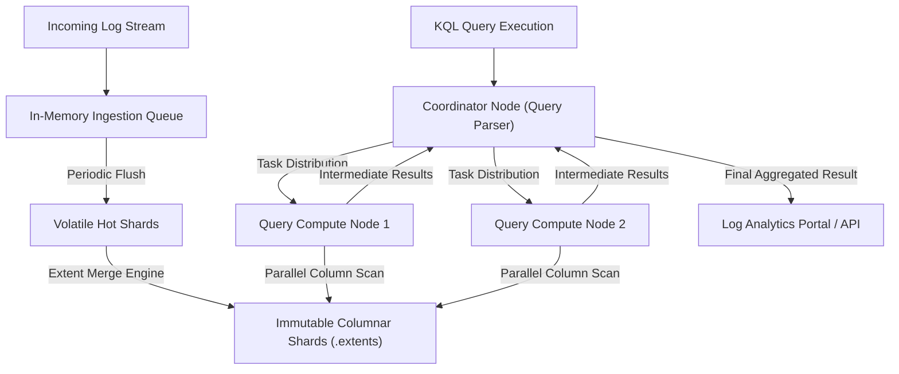
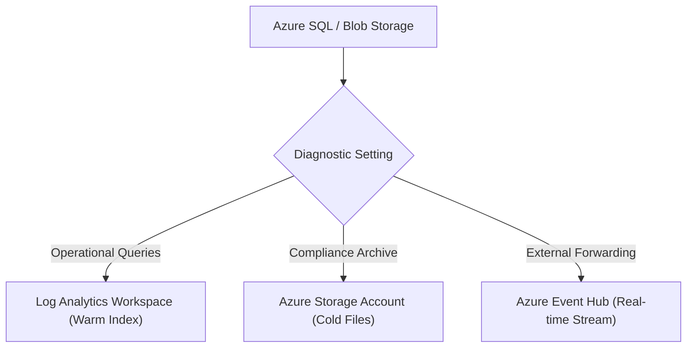

## Table of Contents

1. [What Is Logs and Workspaces](#what-is-logs-and-workspaces)
2. [Diagnostic Settings and Data Routing](#diagnostic-settings-and-data-routing)
3. [Log Analytics Workspace Architecture](#log-analytics-workspace-architecture)
4. [Mastering Kusto Query Language (KQL)](#mastering-kusto-query-language-kql)
5. [Retention Policies and Cost Optimization Tiers](#retention-policies-and-cost-optimization-tiers)
6. [Putting It All Together](#putting-it-all-together)
7. [What's Next](#whats-next)

## What Is Logs and Workspaces

Cloud logging is the process of generating, collecting, routing, and indexing timestamped text records that describe specific events, transactions, or state alterations inside running resources. In the Azure ecosystem, these logs are centralized and queried inside a Log Analytics Workspace. While platform metrics are gathered and plotted automatically, resource logs—such as database transaction executions, network connection logs, and storage access audits—remain completely dormant and uncollected on their physical hosts until you configure explicit routing rules to capture them.

If you have built logging infrastructures on AWS, you can map these concepts directly to the Azure logging fabric:

* **Log Analytics Workspace vs. CloudWatch Log Group**: An AWS CloudWatch Log Group behaves as a logical folder containing discrete log streams. In contrast, an Azure Log Analytics Workspace is a unified relational-like database. All routed logs from different resources converge into specialized, structured tables (such as `StorageBlobLogs` or `AzureDiagnostics`) inside a single workspace boundary, allowing you to run cross-resource joins and multi-component correlation queries in a single query editor.
* **KQL vs. CloudWatch Logs Insights**: While CloudWatch Logs Insights utilizes a custom, basic search syntax, Azure Monitor uses Kusto Query Language (KQL). KQL is a highly performant, read-only data processing language characterized by a sequence of pipe-delimited (`|`) operations, letting you execute complex filtering, aggregation, statistical analysis, and data mapping.

Understanding workspaces means recognizing that a log is not merely a string of text printed to standard output. A log is a structured data asset that must be actively routed, stored in the correct table, retained for compliance, and optimized for query performance.

:::expand[Under the Hood: Kusto Columnar Storage, Compression, and Parallel Query Execution]{kind="design"}
Log Analytics Workspaces are built on Azure Data Explorer, a highly scalable analytics engine powered by Microsoft's Kusto database technology:

* **Columnar Storage Format**: Traditional relational databases store data by rows, which requires reading entire data blocks from disk even if a query only evaluates a single column (like `errorCode`). Kusto organizes logs as a columnar database. It stores the data for each individual column contiguous on physical disk sectors. This layout yields extreme data compression ratios (often exceeding 90% via specialized LZ77 and bit-packing compression algorithms) and allows the engine to scan individual columns across millions of rows without loading irrelevant columns into memory.
* **Ingestion Shards and Merging**: As log records stream from your compute, database, and storage resources, they hit ingestion endpoints. The ingestion gateway writes these events to highly optimized, volatile in-memory queues (hot shards) to minimize write-latency overhead. A background process continuously aggregates, indexes, and writes these hot shards to persistent SSD media as immutable columnar data fragments (extents). These fragments are periodically consolidated into larger, highly optimized data extents.
* **Distributed Query execution**: When you execute a KQL query, the Log Analytics coordinator node parses the query and generates an execution plan. It distributes the filter and aggregation tasks across a cluster of query compute nodes. Each compute node scans a specific subset of the immutable columnar storage fragments concurrently. The coordinator aggregates the intermediate results from these nodes and returns the final table to the client.


:::

This columnar structure allows Log Analytics to execute analytical queries over petabytes of operational data in seconds, provided that your query is designed to prune unnecessary data partitions.

## Diagnostic Settings and Data Routing

To capture resource-level operational events, you must configure a Diagnostic Setting for each individual Azure resource. The Diagnostic Setting is an Azure Resource Manager (ARM) control plane configuration that defines which telemetry categories to collect and where to route them.

A Diagnostic Setting supports three distinct data destinations:

* **Log Analytics Workspace**: The recommended destination for operations. Pushes logs into warm, indexed tables, making them instantly searchable via KQL queries and ready for alert evaluation.
* **Azure Storage Account**: Routes logs to cheap, cold storage containers as raw JSON files. This is highly effective for long-term compliance retention (e.g., keeping audit logs for 7 years) where active query access is not required.
* **Azure Event Hub**: Streams raw log bytes to a real-time messaging pipeline. Use this when you must forward telemetry to external SIEM or observability platforms (such as Splunk, Datadog, or Elasticsearch) in real time.



When creating a Diagnostic Setting, you must explicitly check the log categories you need. For example, on a Storage Account, you check `StorageRead`, `StorageWrite`, and `StorageDelete` categories. Leaving these categories unchecked means the physical storage host discards the access events, leaving you with a silent black hole when trying to investigate security breaches or file deletions.

## Log Analytics Workspace Architecture

A Log Analytics Workspace represents the physical data boundary, security perimeter, and billing root for your operational logs. Deciding whether to deploy a single centralized workspace or multiple isolated workspaces requires balancing query visibility against administrative isolation:

* **Centralized Workspace (Single LAW)**: Routes all development and production resources to a single, shared workspace. This is highly performant for operations, allowing you to trace an execution path across load balancers, APIs, databases, and storage tables in a single query window.
* **Segmented Workspaces (Multiple LAWs)**: Deploys isolated workspaces separated by environment (e.g., `law-devpolaris-prod` vs. `law-devpolaris-dev`), business unit, or compliance boundary. This ensures strict isolation of billing, access controls, and network security perimeters, but prevents cross-workspace queries without complex, multi-workspace permissions.

Data inside a workspace is organized into structured tables. Unlike unstructured log folders, every table inside a workspace enforces a strict, documented schema:

| Table Name | Telemetry Source | Typical Operational Fields | Systems Purpose |
| --- | --- | --- | --- |
| `AzureActivity` | Subscription Activity Log | `Caller`, `OperationNameValue`, `ActivityStatus` | Tracks ARM control-plane changes, resource creations, and administrator logins. |
| `StorageBlobLogs` | Storage Account Blob Service | `OperationName`, `RequesterIpAddress`, `StatusCode` | Logs API-level reads, writes, and deletions executed against blob containers. |
| `AzureDiagnostics` | Standard Azure PaaS Resources | `ResourceProvider`, `Category`, `ResultSignature` | A shared, legacy table utilized by diverse PaaS services to write custom log fields. |
| `AppRequests` | Application Insights Core | `Url`, `ResultCode`, `DurationMs`, `operation_Id` | Indexes incoming application HTTP requests and execution durations. |

To maintain a secure workspace, configure Azure Role-Based Access Control (RBAC) to grant `Monitoring Reader` or `Log Analytics Reader` scopes. This prevents unauthorized teams from reading operational logs that may contain sensitive configuration paths, transaction hashes, or resource connection strings.

## Mastering Kusto Query Language (KQL)

Kusto Query Language (KQL) is a read-only database query language designed for fast log search and data aggregation. Every KQL query is structured as a continuous pipeline: you begin with a target table source, and apply a sequence of pipe-delimited (`|`) filtering, projection, and aggregation operators.

To write performant, reliable queries during production incidents, build your KQL pipeline around the following core operators:

### 1. The Time Filter (`where TimeGenerated > ago()`)
Always place your time filter as the very first operator in your query pipeline. This is a critical physical constraint; placing the time filter at the top tells the Kusto engine to prune all historical storage shards, scanning only the data blocks written within the specified window. Failing to do this forces Kusto to execute a full-scan across terabytes of historical disk blocks, slowing down queries and wasting query resources.

```text
StorageBlobLogs
| where TimeGenerated > ago(1h)
```

### 2. Logical Filtering (`where`)
Apply logical filters to narrow the rows to your specific target resource, operation name, or failure signature:

```text
| where ResourceId contains "stordersprod"
| where OperationName == "PutBlob"
| where StatusCode == 403
```

### 3. Column Projection (`project`)
Select only the columns required for your analysis. This minimizes the data payload sizes transferred from the query nodes back to your browser:

```text
| project TimeGenerated, OperationName, ObjectKey, RequesterIpAddress, UserAgentHeader
```

### 4. Data Aggregation (`summarize`)
Summarize rows to compute counts, averages, p95 latencies, or error distributions over time:

```text
| summarize WriteCount = count() by ObjectKey, StatusCode
```

### Complete Query Pipeline Example

To investigate permission mismatches occurring on your storage account, construct a complete pipeline:

```text
StorageBlobLogs
| where TimeGenerated > ago(24h)
| where ResourceId contains "stordersprod"
| where OperationName == "PutBlob"
| where StatusCode == 403
| project TimeGenerated, OperationName, ObjectKey, RequesterIpAddress, StatusCode, AuthenticationType
| summarize FailureCount = count() by ObjectKey, RequesterIpAddress
| order by FailureCount desc
| take 10
```

This KQL query yields a highly structured, aggregated results table:

| ObjectKey | RequesterIpAddress | FailureCount |
| --- | --- | --- |
| `receipts/2026/05/order-417.pdf` | `10.240.12.84` | 37 |
| `receipts/2026/05/order-418.pdf` | `10.240.12.84` | 14 |
| `exports/finance-may.csv` | `10.240.14.92` | 3 |

This output isolates the exact storage keys and requesting internal IPs encountering HTTP 403 errors, allowing your security team to verify managed identity assignments for those specific compute hosts.

## Retention Policies and Cost Optimization Tiers

Centralizing operational logs introduces storage capacity costs. To balance budget constraints with operational visibility, configure your workspace's ingestion and retention boundaries:

* **Ingestion Pricing**: Azure bills for the cumulative volume of data ingested into the workspace, measured in Gigabytes (GB). 
* **Data Retention Tiers**: Workspaces support distinct storage tiers to align with data access lifecycles:
    * **Analytics (Interactive) Tier**: Keeps logs highly available in hot, memory-cached indexes for rapid KQL query access and real-time alert evaluation. Supports retention periods from 30 days to 2 years (with the first 31 days included at zero storage cost).
    * **Archive Tier**: Shifts older, cold logs into low-cost physical storage grids for up to 7 years. Archived data remains fully preserved for compliance audits but cannot be queried directly via standard, real-time KQL.
    * **Search Jobs and Restore**: To read archived data during deep audits, run an asynchronous Search Job or execute a Restore operation. This extracts the archived blocks back into active Analytics tables, billing for the volume of data scanned and restored.

To optimize operational budgets, pair high-volume tables (such as detailed application trace tables) with a short 30-day Analytics retention policy, and archive long-term compliance logs to keep monthly costs predictable.

## Putting It All Together

Log Analytics Workspaces and KQL deliver a robust operational repository to store and query structured logs across all Azure resources.

* **Columnar Retrieval**: Leverage Kusto's columnar compression format and parallel compute nodes to scan millions of log records instantly.
* **Diagnostic Settings**: Establish explicit Diagnostic Settings to route resource-level write, read, and delete operations out of physical host blades into warm search indices.
* **Workspace Design**: Route development and production environments to separate workspaces to enforce network and RBAC access perimeters.
* **Optimized KQL**: Write KQL queries starting with table sources, place the `TimeGenerated` filter first to prune storage partitions, and apply pipe operators to filter and aggregate rows.
* **Retention Lifecycle**: Pair a short Analytics tier window for active debugging with the cheap Archive tier for long-term compliance records to manage ingestion costs.

## What's Next

Now that we have routed and queried structured resource logs, we will explore Application Insights. We will examine how to track application performance, trace distributed user requests across network boundaries using OpenTelemetry standards, and correlate requests, dependencies, and exceptions.

---

**References**

* [Azure Monitor overview](https://learn.microsoft.com/en-us/azure/azure-monitor/fundamentals/overview)
* [Azure Monitor Logs overview](https://learn.microsoft.com/en-us/azure/azure-monitor/logs/data-platform-logs)
* [Diagnostic settings in Azure Monitor](https://learn.microsoft.com/en-us/azure/azure-monitor/essentials/diagnostic-settings)
* [Log Analytics workspace overview](https://learn.microsoft.com/en-us/azure/azure-monitor/logs/log-analytics-workspace-overview)
* [Kusto Query Language overview](https://learn.microsoft.com/en-us/kusto/query/)
