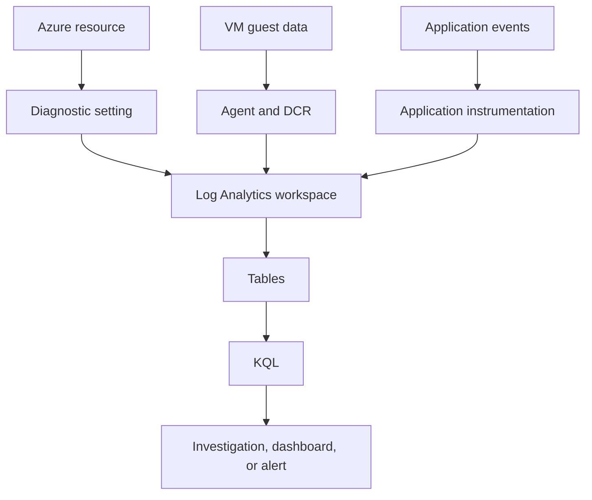

## Table of Contents

1. [What Production Questions Should Logs Answer?](#what-production-questions-should-logs-answer)
2. [How Do Azure Monitor Logs and Diagnostic Settings Connect?](#how-do-azure-monitor-logs-and-diagnostic-settings-connect)
3. [How Do You Verify the Log Route?](#how-do-you-verify-the-log-route)
4. [What Does a Log Analytics Workspace Store?](#what-does-a-log-analytics-workspace-store)
5. [How Do Tables and KQL Organize Queries?](#how-do-tables-and-kql-organize-queries)
6. [How Do You Trace One Checkout Failure?](#how-do-you-trace-one-checkout-failure)
7. [How Do Retention, Cost, and Access Affect Logs?](#how-do-retention-cost-and-access-affect-logs)
8. [How Should You Design Workspace Boundaries?](#how-should-you-design-workspace-boundaries)
9. [Check Your Answers](#check-your-answers)
10. [References](#references)

A checkout request fails, and the customer reports it five minutes later. The request has already ended. To investigate the database timeout that occurred inside it, you need a record created while the operation was happening.

Logs preserve that history. In Azure, useful investigation depends on the full path: a resource or application produces a record, collection routes it to a Log Analytics workspace, a table stores it, and a query finds it. Each part has a separate job, and each can explain why expected evidence is missing.

1. **What Production Questions Should Logs Answer?**
2. **How Do Azure Monitor Logs and Diagnostic Settings Connect?**
3. **How Do You Verify the Log Route?**
4. **What Does a Log Analytics Workspace Store?**
5. **How Do Tables and KQL Organize Queries?**
6. **How Do You Trace One Checkout Failure?**
7. **How Do Retention, Cost, and Access Affect Logs?**
8. **How Should You Design Workspace Boundaries?**

## What Production Questions Should Logs Answer?
<!-- section-summary: Logs preserve temporary events as searchable history so investigations can identify what happened, when, where, and within which request. -->

When checkout fails, the customer may see only “Something went wrong.” Internally, the request may have passed through the Checkout API and Order service before SQL connection acquisition timed out. Once the execution ends, a debugger cannot return to that past moment.

A **log record** preserves evidence while the event occurs. For the failed request, it might contain:

```text
Time:       18:04:27
Operation:  Checkout
Result:     Failed
Reason:     SqlTimeout
Duration:   30.2 seconds
Trace ID:   7F92...
```

The original event is temporary; the record remains available for later inspection. Context about the affected customer may also be relevant where appropriate, but the record should avoid unnecessary sensitive information.

Over time, such records form a dataset:

| Time | Operation | Result | Reason |
| --- | --- | --- | --- |
| 18:00 | Checkout | Success | |
| 18:01 | Checkout | Success | |
| 18:02 | Payment | Failed | Timeout |
| 18:03 | Checkout | Success | |
| 18:04 | Checkout | Failed | SqlTimeout |

The investigation can now be expressed as questions about data. Show failures after 18:00. Select only checkout failures. Group them by reason. Find every record associated with request `7F92`.

Structured fields make those questions possible. An operation identifies the work, a result indicates its outcome, a reason identifies the failure category, and a timestamp places it in the incident. A correlation identifier supplies the relationship to other records produced during the same request.

This is the first important purpose of logging: preserving enough information to reconstruct an event after direct inspection is no longer possible. Collecting a large volume is less useful if the records omit the context needed to distinguish one failed operation from another.

## How Do Azure Monitor Logs and Diagnostic Settings Connect?
<!-- section-summary: Azure Monitor Logs stores and queries evidence, diagnostic settings route selected Azure resource telemetry, and each source needs an appropriate collection mechanism. -->

**Azure Monitor** is the broader observability platform that includes metrics, logs, alerts, and related capabilities. **Azure Monitor Logs** handles stored log and trace data and its analysis. A **Log Analytics workspace** is a data store for that evidence.

The similar name **Azure Monitor workspace** identifies a different resource type used for Prometheus-related metrics. In this article, *workspace* means a Log Analytics workspace. Keeping the names distinct prevents looking for logs in a resource intended for a different telemetry type.

Evidence originates at several layers. Azure SQL, Key Vault, Storage, and Application Gateway can produce resource logs. A VM's operating system can produce Windows events, Linux syslog, and application files. Applications can produce request records, exceptions, dependency measurements, and traces.

Creating a workspace does not automatically collect all of those sources. It creates a destination. Collection still needs a route from the source to that destination.

### Route Azure resource logs with diagnostic settings

A Key Vault may generate request, access, and audit events. **Diagnostic settings** specify which available categories of telemetry from that resource should be sent to which destinations.

Conceptually, a setting could select audit logs and some supported metrics from `production-key-vault` and send them to `prod-log-workspace`. The setting is routing configuration; it is not the place where records are stored.

Destinations can include Log Analytics workspaces, Storage accounts, Event Hubs, and supported partner solutions. The appropriate destination depends on how the evidence will be stored, processed, or queried.

For a storage resource, categories may distinguish read, write, and delete operations. A collection policy could enable writes and deletes while omitting reads if the investigation requirements do not justify their volume. More collection produces more ingestion, more stored data, potentially greater cost, and more material to search.

The choice should be explicit. Omitting a category removes the corresponding evidence from that route; enabling everything can create unnecessary expense without improving the questions the team can answer.

### Separate source, route, and destination

Three common paths illustrate the distinction:

| Evidence source | Collection or routing mechanism | Destination |
| --- | --- | --- |
| Azure SQL resource logs | Diagnostic setting | Log Analytics workspace |
| VM operating-system data | Azure Monitor Agent and Data Collection Rule | Log Analytics workspace |
| Application requests and dependencies | OpenTelemetry/Application Insights instrumentation | Log Analytics workspace |

The **Azure Monitor Agent** runs where guest operating-system evidence must be collected. A **Data Collection Rule**, or DCR, describes what to collect, how to process it, and where to send it. Application instrumentation produces evidence about the application itself.


```mermaid
flowchart TD
    resource["Azure resource"] --> diagnostic["Diagnostic setting"]
    vm["VM guest data"] --> agent["Agent and DCR"]
    app["Application events"] --> instrument["Application instrumentation"]
    diagnostic --> workspace["Log Analytics workspace"]
    agent --> workspace
    instrument --> workspace
    workspace --> tables["Tables"]
    tables --> query["KQL"]
    query --> investigate["Investigation, dashboard, or alert"]
```

Calling the entire chain “Azure Monitor” can obscure the failing part. Naming each responsibility makes both design and troubleshooting more precise.

The distinction also explains what each configuration can and cannot fix. Selecting a different workspace changes the destination; it does not add an event that the application never recorded. Enabling a resource-log category changes which resource events are routed; it does not instrument an application's internal checkout logic. Adding application instrumentation supplies that missing application evidence, but it still needs a working collection path.

For the same reason, a successful source operation and a successful logging test are different observations. The Key Vault request may finish even if its audit record is not present in the expected table. To establish the logging result, follow that known operation through its selected category, route, and destination. This is the practical benefit of treating the pipeline as several connected responsibilities instead of one switch.

## How Do You Verify the Log Route?
<!-- section-summary: Verify source events, selected categories, destination, ingestion delay, table, and query scope; a known safe event provides a concrete test. -->

A diagnostic setting does not manufacture events. If SQL has not performed an operation that generates the selected category since collection was configured, there may be no corresponding record to find.

The sequence is configuration, a relevant event, routing, and ingestion. The destination table may only appear after the first records arrive. Microsoft's diagnostic-settings guidance allows up to 90 minutes for data to begin flowing after a setting is created, so immediate absence does not by itself prove failure.

When expected logs are missing, inspect the path in order:

1. Confirm that the source generated the intended event.
2. Check that its log category was selected.
3. Check the diagnostic setting and its configuration.
4. Confirm the selected workspace.
5. Allow for the collection and ingestion interval.
6. Identify the table associated with that category.
7. Check the query's time range and filters.

Each check tests a different explanation. Repeatedly changing settings without identifying the failed stage can make the original problem harder to understand.

### Produce an event with a known time

For Key Vault logging, perform a deliberate, safe read of a known test secret at 18:15 and record the time. Then search the relevant destination around 18:14–18:17 after allowing for ingestion.

This gives the test a known input and an expected record. It is stronger evidence than assuming someone probably used the resource earlier in the day. The test should reveal whether the source emitted the chosen event and whether the intended route delivered it.

The action is a verification exercise, not a reason to expose secret contents in logs. The useful evidence is the access event and its context.

### Investigate an empty query backward

An empty result can also be approached from the query end. Suppose:

```kusto
SomeResourceTable
| where TimeGenerated > ago(1h)
```

returns no rows. First consider the query: wrong time range, overly restrictive filters, wrong workspace, or wrong table. Then check whether anything was ingested. Next inspect the route, categories, and destination, and finally confirm source activity.

This prevents the conclusion “no events happened” from being drawn solely from “no rows matched this query.” A correct event can exist in another table or outside the selected time window.

The same reasoning applies during an incident. Understanding the route gives the team a specific place to investigate instead of treating missing telemetry as one undifferentiated logging failure.

## What Does a Log Analytics Workspace Store?
<!-- section-summary: A workspace groups operational evidence in tables and also governs query context, access, retention, and ownership. -->

A workspace such as `prod-observability-workspace` provides a common location for evidence from Azure resources, non-Azure resources, and applications. It can hold `AppRequests`, `AppExceptions`, `AppDependencies`, `AzureActivity`, resource-specific tables, and custom tables.

Central storage supports correlation. If application, SQL, VM, and firewall records are stored in unrelated places, responders first have to locate each dataset. A common workspace can make the relevant evidence available for connected queries.

The data is organized into **tables**. A table defines columns—its **schema**—and each row represents a record. The schema states which fields are available and what kind of evidence the table contains.

An illustrative `AppRequests` table might contain:

| TimeGenerated | Name | Success | DurationMs | OperationId |
| --- | --- | --- | ---: | --- |
| 18:01 | Checkout | true | 182 | AAA |
| 18:02 | Checkout | false | 30021 | BBB |
| 18:03 | Products | true | 32 | CCC |

Request-shaped rows need fields such as name, duration, result code, success, and operation identifier. Exception-shaped rows need different detail, such as exception type, message, and method. Keeping those records in appropriate tables makes their structure easier to understand.

A shared field such as `OperationId` can connect requests with related exceptions or dependency calls. The workspace groups the evidence; the correlation fields preserve the relationships within it.

### Distinguish query contexts

A workspace might contain WebApp A, WebApp B, SQL A, SQL B, Key Vault, and firewall evidence. Sometimes the question concerns everything the operator can access in that workspace. At other times it concerns only SQL A.

**Workspace context** supports querying accessible data across the workspace. **Resource context** scopes the experience to records associated with a particular Azure resource or resource scope. These contexts allow a shared workspace to support focused resource investigation without beginning every query from all stored data.

The `_ResourceId` field is important when available. It associates a record with its Azure resource and supports resource-context queries and access behavior. Microsoft recommends checking this field when investigating whether records can participate correctly in resource-context experiences.

A record therefore benefits from both kinds of identity: the operation identifier connects one request across components, while the resource identifier connects evidence to the Azure resource involved.

## How Do Tables and KQL Organize Queries?
<!-- section-summary: Table schemas identify the available evidence; KQL pipelines progressively filter, select, aggregate, and connect it into an answer. -->

Before writing a query, establish which table receives the selected source category. Workspace table lists and the Azure Monitor table reference help connect a resource type and diagnostic category to their destination schema.

Historically, many Azure services wrote into the shared `AzureDiagnostics` table. That table had to accommodate several services' differing fields. Resource-specific mode places supported categories into dedicated tables.

Microsoft recommends resource-specific mode for new diagnostic settings where it is supported because it improves schema discoverability, query usability and performance, and table-level access control. The exact table still depends on the service and category. Assuming every resource log belongs in `AzureDiagnostics` can lead to searching the wrong dataset.

Examples of workspace tables include `StorageBlobLogs` and a custom table such as `MyCustomEvents_CL`, alongside application and activity tables. Inspect the actual schema instead of assuming that every table has the same columns.

### Read a query as a sequence of operations

Azure Monitor Logs uses **Kusto Query Language**, or KQL. A query starts with a dataset and applies operators to it. The pipe character, `|`, passes the result of one stage to the next.

The smallest failure query is:

```kusto
AppRequests
| where Success == false
```

It selects the request dataset and keeps rows marked unsuccessful. The query does not change the stored requests; it selects a result for analysis.

Starting from a table containing one million rows, time is usually the first useful restriction:

```kusto
AppRequests
| where TimeGenerated > ago(1h)
```

The `ago(1h)` expression identifies a point one hour before the query's current time. Comparing `TimeGenerated` with that value selects recent records.

Add the failure condition:

```kusto
AppRequests
| where TimeGenerated > ago(1h)
| where Success == false
```

Then narrow the operation:

```kusto
AppRequests
| where TimeGenerated > ago(1h)
| where Success == false
| where Name contains "checkout"
```

Select the fields needed for inspection:

```kusto
AppRequests
| where TimeGenerated > ago(1h)
| where Success == false
| where Name contains "checkout"
| project TimeGenerated, Name, ResultCode, DurationMs, OperationId
```

Finally, put the newest records first:

```kusto
AppRequests
| where TimeGenerated > ago(1h)
| where Success == false
| where Name contains "checkout"
| project TimeGenerated, Name, ResultCode, DurationMs, OperationId
| order by TimeGenerated desc
```

Every added stage answers a concrete question: when, whether it failed, which operation, which evidence fields, and in what order. The large dataset has been reduced to a focused investigation.

The distinction between rows and columns helps when reading this pipeline. A row represents a recorded request; filtering removes requests that do not match the question. A column represents one attribute of the remaining records; projection chooses which of those attributes appear in the result. Sorting changes the presentation order so the newest relevant operation is easy to inspect.

These steps should follow the investigation rather than be added mechanically. If the question is when a problem began, preserve the timestamp. If it is which operation failed, preserve the name and result. If the next step is following a dependency, retain the operation identifier even if the initial display would otherwise look simpler without it. Removing a correlation field from the query result does not erase it from storage, but it makes the next investigative step harder to take.

### Learn the core operators by their jobs

| Operator | Purpose |
| --- | --- |
| `where` | Filter rows |
| `project` | Select or reshape columns |
| `summarize` | Aggregate records |
| `count` | Count rows |
| `order by` | Sort the result |
| `take` | Return a limited selection of rows |
| `extend` | Add calculated columns |
| `join` | Connect datasets through matching fields |
| `union` | Combine datasets |

These operators cover much of an initial investigation. For example, `where TimeGenerated > ago(30m)` limits requests to the last 30 minutes, and a subsequent `where Success == false` narrows that set to failures.

Further restrictions can move from a relevant period to a service, endpoint, and eventually one request. The query structure mirrors the act of narrowing possible explanations.

### Aggregate events into patterns

To identify the operation with the most failures:

```kusto
AppRequests
| where TimeGenerated > ago(1h)
| where Success == false
| summarize Failures = count() by Name
| order by Failures desc
```

An example result is 928 Checkout failures, 31 Search failures, and 12 Login failures. Instead of inspecting each event individually, the aggregation reveals where most failures are concentrated.

Logs can also produce a time series:

```kusto
AppRequests
| summarize
    Requests = count(),
    Failures = countif(Success == false)
  by bin(TimeGenerated, 5m)
```

`count()` counts all records in each group, `countif` counts the ones satisfying the failure condition, and `bin` groups timestamps into five-minute intervals.

| Interval | Requests | Failures |
| --- | ---: | ---: |
| 18:00 | 10,421 | 12 |
| 18:05 | 10,883 | 14 |
| 18:10 | 11,101 | 822 |

The same detailed records now describe an operating trend. The last interval contains a much larger failure count, giving the next investigation a time boundary.

The example shows the aggregation itself. In an incident query, restrict the relevant time period first so the analysis concerns the intended event and not the whole retained history.

## How Do You Trace One Checkout Failure?
<!-- section-summary: Find the failed request, preserve its OperationId, then inspect matching dependencies and exceptions before comparing resource metrics. -->

A customer reports that checkout failed about ten minutes ago. Begin with recent failed checkout requests:

```kusto
AppRequests
| where TimeGenerated > ago(30m)
| where Name contains "checkout"
| where Success == false
| project TimeGenerated, Name, ResultCode, DurationMs, OperationId
| order by TimeGenerated desc
```

Suppose a row shows Checkout at 18:41:17, result code 500, duration 30,018 ms, and `OperationId=a81f729...`. That identifier connects the request to the rest of its evidence.

Find its exception:

```kusto
AppExceptions
| where TimeGenerated > ago(30m)
| where OperationId == "a81f729..."
| project TimeGenerated, ExceptionType, Message, OperationId
```

The result may identify `SqlException` with the message `Timeout expired`. In the `AppExceptions` schema, `ExceptionType` holds the exception class; `Type` identifies the table, so it would not provide the exception detail needed here. Now inspect dependency operations:

```kusto
AppDependencies
| where TimeGenerated > ago(30m)
| where OperationId == "a81f729..."
| project TimeGenerated, Name, Target, DurationMs, Success, ResultCode
| order by TimeGenerated asc
```

The ordered results could show Inventory API succeeding in 42 ms, Payment API succeeding in 182 ms, and Orders SQL failing after 30,000 ms. The request, SQL dependency, and exception now form a connected explanation of the customer's report.

Without correlation, a dataset with ten million requests, 20 million dependencies, and 500,000 exceptions leaves the responder guessing which records belong together. Preserving `OperationId` turns separate datasets into a request history. Microsoft's AppRequests query examples use that field to connect failed requests and exceptions.

### Investigate an alert across multiple requests

A broader incident may begin with an alert that checkout failure rate is above 5%. First establish the timing:

```kusto
AppRequests
| where TimeGenerated > ago(30m)
| summarize
    Requests = count(),
    Failed = countif(Success == false)
  by bin(TimeGenerated, 5m)
| order by TimeGenerated asc
```

The query returns counts from which the failure proportions can be examined. Suppose the corresponding rates are 0.2% at 18:30, 0.3% at 18:35, 7.8% at 18:40, and 9.1% at 18:45. The incident begins around 18:40.

Requests and failures need to be interpreted together. The failure count identifies the number of unsuccessful operations, while dividing it by the total requests in the same interval gives the affected proportion. A larger failure count can accompany a much larger workload, so comparing rates helps establish whether service quality changed as well as volume.

The five-minute grouping is useful because the investigation now needs a trend rather than every event. It identifies a short period worth exploring in detail. The next query returns to individual operation names, and the query after that selects actual requests. Moving between aggregate patterns and individual records is deliberate: the aggregate identifies the likely problem area, while the record provides the identifier needed to explain one occurrence.

Next, identify the affected operation:

```kusto
AppRequests
| where TimeGenerated > ago(30m)
| where Success == false
| summarize Failures = count() by Name
| order by Failures desc
```

An example result—1,821 Checkout failures, 12 Login failures, and four Search failures—focuses the investigation on checkout rather than the whole application.

Select recent failed requests:

```kusto
AppRequests
| where TimeGenerated > ago(30m)
| where Name contains "checkout"
| where Success == false
| project TimeGenerated, DurationMs, ResultCode, OperationId
| order by TimeGenerated desc
| take 20
```

Choose operation `7F92` and inspect its dependency history:

```kusto
AppDependencies
| where OperationId == "7F92"
| project TimeGenerated, Name, Target, DurationMs, Success, ResultCode
| order by TimeGenerated asc
```

The resulting records show Inventory succeeding in 41 ms, Payments succeeding in 201 ms, and Orders DB failing after 30,001 ms. Inspect the matching exception:

```kusto
AppExceptions
| where OperationId == "7F92"
| project TimeGenerated, ExceptionType, Message
```

The exception reports `SqlException: Timeout expired while obtaining connection.` The alert has led to an affected interval, an endpoint, one request, a failed SQL dependency, and a specific connection-acquisition failure.

For a live investigation, keep the relevant time restriction when moving between tables. The short correlation queries above make the shared identifier visible; the incident window helps keep the result focused.

### Combine the records with resource measurements

A SQL timeout is an observation to explain. Inspect connections, CPU, I/O latency, query duration, and resource saturation for the database. If connections reached 100% at 18:40, that measurement supports the hypothesis that pool saturation caused waiting and checkout failure.

The evidence should agree across levels: the resource metric indicates saturation, the log identifies the timeout, and the request or trace shows the user operation that failed. The combination supports a more precise explanation than treating either a resource chart or one exception as sufficient.

Time is central to this comparison. `TimeGenerated` lets the team inspect conditions before the failure, changes near its start, the signals during the incident, and whether they recover after mitigation.

### Reuse the evidence for detection

Log queries are useful beyond interactive investigation. A failure selection can be aggregated:

```kusto
AppRequests
| where Success == false
| summarize Failures = count()
```

An alert can evaluate whether the resulting count exceeds an acceptable threshold over its configured evaluation period. The stored events then support both automatic detection and the later explanation of that detection.

A log alert still needs a meaningful condition and time scope. The ability to count failures does not itself decide how many justify intervention.

## How Do Retention, Cost, and Access Affect Logs?
<!-- section-summary: Logs contain sensitive historical data, so access boundaries, table plans, retention periods, and ingestion volume are part of the design. -->

A workspace preserves operational history. That history can contain IP addresses, user identifiers, authentication events, security alerts, database activity, application payload details, error messages, and infrastructure topology.

Permission to inspect an Azure resource and permission to query its logs are therefore related security questions, not assumptions to leave implicit. Azure uses RBAC and workspace or resource access rules to govern query access. Finer-grained controls include table-level and row-level RBAC and protected tables for sensitive telemetry.

Consider a workspace containing `AppRequests`, `Performance`, `SecurityEvent`, `SigninLogs`, and `PaymentAudit_CL`. An application team may need request and performance records without unrestricted access to payment audit or security tables. Shared storage does not require identical access to every dataset.

The chosen access configuration must support the intended boundaries. This is part of workspace architecture, especially when several teams share one store.

This is also why common storage and common access should be considered separately. Grouping requests and security events in one location may help an authorized investigation connect them. It does not mean every application responder needs to read every authentication event or payment audit record. Table structure and resource identity provide information on which narrower access decisions can depend.

During design, connect each operational role to the questions it needs to answer and the datasets needed for those questions. The application team's ability to inspect request failures should remain usable, while sensitive records retain their intended restrictions. The resulting boundary should be checked with the actual query context rather than inferred solely from the fact that the person can open a workspace or resource page.

### Decide how much history remains available

Thirty-day retention is enough to examine yesterday's incident, but it cannot answer a question about suspicious activity six months ago once that data has been discarded. Retention defines how far back the team can investigate.

Azure Monitor Logs distinguishes recent interactive or analytics retention from longer-term retention. Most tables have a 30-day default, while some have a 90-day default. Analytics-plan tables support interactive retention up to two years and total retention up to 12 years. Older long-term records use different access mechanisms, such as search jobs.

These periods depend on the relevant table and plan; a maximum supported duration is not the default setting of every table. Recent data supports regular queries, alerts, and analysis. Older data may be kept for occasional investigation, security, or compliance and need a different access and cost profile.

Choose retention according to evidence value. Verbose debugging traces may be useful for days, performance records for weeks or months, security audit events for much longer, and regulatory evidence for years.

For each dataset, ask how often it is likely to be queried, the harm if it is unavailable, applicable regulatory requirements, and the cost of its volume. Retention is part of the ability to answer questions, not simply storage housekeeping.

### Consider ingestion before retention

Collection volume can already be expensive before deciding how long to keep it. One kilobyte per log, 100 logs per request, and 5,000 requests per second produce:

$$
1\text{ KB} \times 100 \times 5{,}000
= 500{,}000\text{ KB per second}
$$

Using decimal units, that is approximately 500 MB per second of telemetry. Recording everything imaginable can therefore consume substantial resources without producing a proportionate improvement in understanding.

Compare `entered function CalculateTax` emitted ten billion times with a meaningful failure record:

```text
event=checkout_failed
traceId=...
dependency=TaxAPI
durationMs=30000
reason=timeout
```

The second record, emitted for relevant failures or state changes, can provide much more diagnostic value with far less volume. Good logging aims for useful information per byte.

Filtering or transforming data before or during ingestion can reduce unnecessary or sensitive content. Collection choices should preserve the evidence needed for real questions while avoiding repeated low-value detail.

### Match the table plan to its use

Azure Monitor Logs offers table plans for different access patterns:

| Plan | Intended role |
| --- | --- |
| Analytics | Frequent interactive analysis, monitoring, and alerting |
| Basic | Lower-cost troubleshooting data with a more constrained query model |
| Auxiliary | Lower-touch, verbose, or audit-style data |

The decision depends on how often the data is queried and which capabilities those queries need. Frequently investigated failure evidence and rarely accessed historical telemetry do not necessarily justify the same economics.

A cheaper plan can also change query behavior, so selection must follow the intended use rather than price alone. The team should be able to explain how the chosen plan supports the actual investigation or retention requirement.

### Keep secrets out of historical records

Authorization bearer tokens, passwords, and credit-card values are dangerous log contents. Logs may be retained, queried by several teams, exported, used by security systems, or backed up, extending exposure beyond the original operation.

Record sufficient diagnostic context without copying unnecessary credentials or payloads. Apply appropriate filtering, transformation, redaction, and access controls. A searchable operational store should not quietly become another location containing production secrets.

## How Should You Design Workspace Boundaries?
<!-- section-summary: Choose workspace boundaries by correlation, access, retention, regional requirements, cost ownership, and operations rather than automatically centralizing or separating every resource. -->

An organization with 100 applications, 20 subscriptions, eight development teams, and three environments has a real architectural choice: one workspace or several.

The workspace simultaneously influences data aggregation, security, retention, regional placement, cost governance, operational ownership, and compliance. A resource count alone cannot decide those boundaries.

Centralization can make cross-system investigation easier. If checkout passes through an application, API, database, and Key Vault, storing their relevant evidence together helps answer what happened throughout the service at 18:42. Application, SQL, VM, network, and identity records can be queried as parts of the same incident.

Separation can also be justified. Production, development, highly regulated finance, and security operations may have different permissions, retention requirements, regional obligations, cost owners, and administrators. Separate finance, engineering, and security workspaces may make those boundaries easier to manage.

### Avoid separation without a requirement

Creating one workspace per VM, one per database, and one per application can fragment a request's evidence. An incident spanning ten components may require ten separate searches.

A different resource is not by itself a sufficient reason for a different evidence store. Meaningful reasons include access, regulatory constraints, regional or data-residency requirements, billing and ownership, or strong operational separation.

The design should preserve easy correlation where teams need to investigate a shared service. Otherwise the collection architecture recreates the same fragmentation that centralized logging was meant to reduce.

### Avoid centralization without governance

Putting every company's log into one workspace can create difficulties with sensitive tables, access, cost attribution, data sovereignty, different retention needs, and administrative responsibility.

The appropriate balance is between the correlation benefits of grouping evidence and the isolation benefits of separating it. The workspace is a governed place to store and query historical evidence, so its boundary should answer who needs to investigate together and which information must remain separated.

Table-level controls and resource context can support shared use, but the design still needs explicit ownership and access decisions. No default topology removes those responsibilities.

### Maintain the evidence path

Three habits keep the architecture useful. First, produce structured records such as `event=checkout_failed`, `reason=sql_timeout`, and `traceId=7F92` rather than an unsearchable general message.

Second, preserve relationships through `OperationId`, trace identifiers, resource identity, and deployed version. These fields allow one request, resource, or change to be followed across datasets.

Third, document the actual route: the source, collection mechanism, workspace, and table. When a query returns nothing, that record of the route gives the responder a concrete sequence to check.

The complete chain begins when something meaningful happens. A log is produced, a diagnostic setting, agent/DCR, or application instrumentation delivers it, a workspace receives it, and a table gives it structure. KQL filters and connects the records into an explanation, dashboard, or alert.

A workspace's value therefore includes several decisions at once: which evidence is grouped, who can query it, which schemas organize it, how long it remains available, what ingestion and storage cost, and which systems can correlate their activity.

The result is an evidence-management capability. Logs capture the past, collection delivers it, the workspace preserves and governs it, and queries turn it into answers about production behavior.

## Check Your Answers

:::expand[What Production Questions Should Logs Answer?]{kind="recap"}
Logs should explain what happened, when, where, with which result, and within which request. Structured records preserve events that can no longer be inspected directly.
:::

:::expand[How Do Azure Monitor Logs and Diagnostic Settings Connect?]{kind="recap"}
Azure Monitor Logs stores and queries evidence in Log Analytics workspaces. Diagnostic settings route selected Azure resource categories. VM and application evidence use their own appropriate agent or instrumentation paths.
:::

:::expand[How Do You Verify the Log Route?]{kind="recap"}
Check source activity, category, collection configuration, workspace, ingestion interval, table, and query scope. A deliberate safe event at a known time provides a concrete test. Empty results do not automatically mean no event occurred.
:::

:::expand[What Does a Log Analytics Workspace Store?]{kind="recap"}
It stores structured records in tables and supports correlation across sources. Workspace and resource contexts determine the scope of investigation, while fields such as OperationId and _ResourceId preserve request and resource identity.
:::

:::expand[How Do Tables and KQL Organize Queries?]{kind="recap"}
Tables provide schemas for different evidence types. KQL pipelines narrow records by time, outcome, and operation, select fields, aggregate patterns, and connect datasets. Check the actual destination table instead of assuming AzureDiagnostics.
:::

:::expand[How Do You Trace One Checkout Failure?]{kind="recap"}
Locate the failed request, retain its OperationId, and inspect related dependencies and exceptions. Compare the resulting explanation with resource metrics and the incident timeline.
:::

:::expand[How Do Retention, Cost, and Access Affect Logs?]{kind="recap"}
Retention controls available history, access controls protect sensitive records, and ingestion volume and table plans affect economics and query capability. Keep high-value context while excluding unnecessary sensitive data.
:::

:::expand[How Should You Design Workspace Boundaries?]{kind="recap"}
Balance shared investigation against access, regional, retention, compliance, cost, and ownership needs. Avoid a separate workspace for every resource or one universal workspace without considering those requirements.
:::

## References

- [AppExceptions column definitions](https://learn.microsoft.com/en-us/azure/azure-monitor/reference/tables/appexceptions)

- [Azure Monitor overview](https://learn.microsoft.com/en-us/azure/azure-monitor/fundamentals/overview)
- [Azure Monitor workspace](https://learn.microsoft.com/en-us/azure/azure-monitor/metrics/azure-monitor-workspace-overview)
- [Log Analytics workspace](https://learn.microsoft.com/en-us/azure/azure-monitor/logs/log-analytics-workspace-overview)
- [Azure resource logs](https://learn.microsoft.com/en-us/azure/azure-monitor/platform/resource-logs)
- [Diagnostic settings](https://learn.microsoft.com/en-us/azure/azure-monitor/platform/diagnostic-settings)
- [Diagnostic settings and initial data flow](https://learn.microsoft.com/uk-ua/azure/azure-monitor/platform/diagnostic-settings)
- [Tables and table plans](https://learn.microsoft.com/en-us/azure/azure-monitor/logs/logs-table-overview)
- [Azure Monitor table reference](https://learn.microsoft.com/en-us/azure/azure-monitor/reference/tables-index)
- [AppRequests query examples](https://learn.microsoft.com/en-us/azure/azure-monitor/reference/queries/apprequests)
- [Workspace and resource access](https://learn.microsoft.com/en-us/azure/azure-monitor/logs/manage-access)
- [Table-level access](https://learn.microsoft.com/en-us/azure/azure-monitor/logs/manage-table-access)
- [Log retention](https://learn.microsoft.com/en-us/azure/azure-monitor/logs/data-retention-configure)
- [Azure Monitor Logs best practices](https://learn.microsoft.com/en-us/azure/azure-monitor/logs/best-practices-logs)
