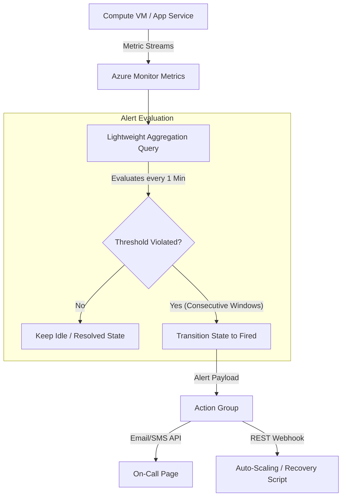
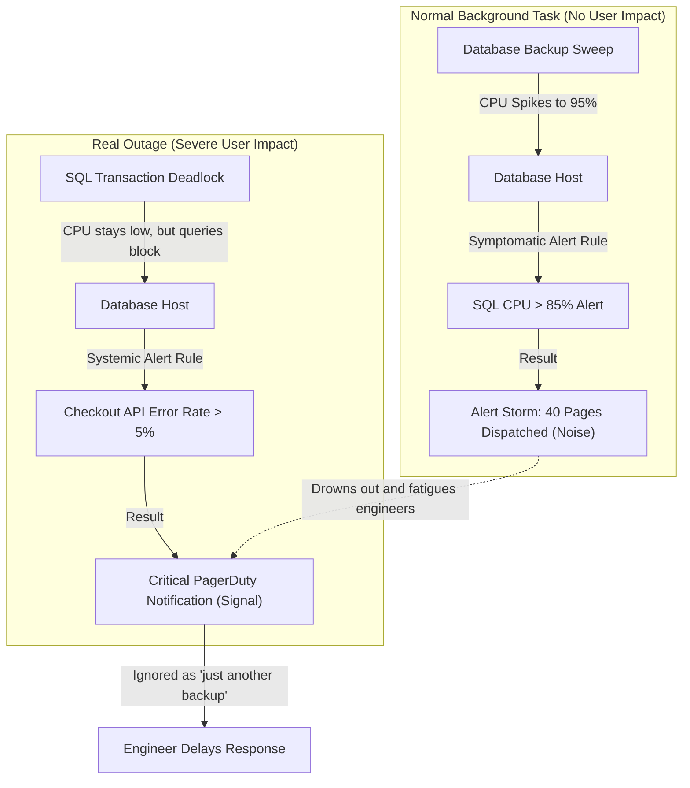

## Table of Contents

1. [What Is Metrics and Alerts](#what-is-metrics-and-alerts)
2. [Platform vs. Custom Application Metrics](#platform-vs-custom-application-metrics)
3. [Symptomatic vs. Systemic Alerts](#symptomatic-vs-systemic-alerts)
4. [Designing Resilient Alerts and Action Groups](#designing-resilient-alerts-and-action-groups)
5. [Combating Alert Noise and On-Call Fatigue](#combating-alert-noise-and-on-call-fatigue)
6. [Putting It All Together](#putting-it-all-together)

## What Is Metrics and Alerts

A metric is a lightweight, numeric data value captured at regular intervals and structured as a multi-dimensional time series. An alert rule evaluates metrics or log query results against configured conditions, then routes operational attention to engineers when those conditions are met. Alerts can be stateful or stateless depending on the rule configuration. While detailed text logs and distributed traces are designed to help you diagnose the root cause of a specific failure, metrics and alerts are built to track the overall system health, monitor trends, and notify humans before users experience service degradation.

If you operate monitoring systems on AWS, these concepts map directly to your existing mental models:

* **Time-Series Metrics**: AWS CloudWatch Metrics and Azure Monitor Metrics serve the same systems role, storing high-velocity data points with associated dimension keys. However, while CloudWatch Metrics are categorized under rigid namespaces, Azure Monitor Metrics enables multi-dimensional metric splitting directly in the metrics explorer, allowing you to filter a single host metric by instance, region, or status code in a single view.
* **Alerting and Notifications**: AWS CloudWatch Alarms and SNS notification paths map directly to Azure Monitor Alert Rules and Action Groups. The Action Group operates as a reusable routing controller, allowing you to bind a single notification list (email, SMS, voice, or custom automation webhooks) to hundreds of independent alert rules.

Understanding metrics and alerts means recognizing that you do not configure alerts for every single error or machine fluctuation. You design structured monitoring loops that separate normal system activity from user-visible pain.

:::expand[Under the Hood: Time-Series Metrics and Alert Evaluation]{kind="design"}
Azure Monitor separates metrics from logs because numeric time-series data needs different behavior from detailed event records:

* **Optimized Time-Series Database**: Azure Monitor Metrics stores numeric values with timestamps, resource identifiers, namespaces, metric names, and optional dimensions. Platform metrics are commonly collected at one-minute frequency unless a metric definition says otherwise.
* **Metric Retention**: Platform and custom metrics in Azure Monitor Metrics are retained for 93 days, which makes them useful for recent trend analysis and alerting. Send metrics or logs to Log Analytics when you need longer-term retention and richer querying.
* **Alert Evaluation**: Metric alert rules evaluate metric data on a configured frequency and over a configured time window. Some alerts automatically resolve when the condition is no longer met; stateless alerts can notify repeatedly according to their configuration. Action Groups route the resulting alert payload to email, SMS, voice, push, webhook, ITSM, or automation targets.


:::

This decoupled design means metric alerts can evaluate lightweight numeric signals without waiting for complex log searches. Use log search alerts when the condition genuinely requires KQL over detailed records.

## Platform vs. Custom Application Metrics

To build a comprehensive operating view, you must combine infrastructure-side metrics with application-side metrics:

* **Platform Metrics**: Created by Azure resources without requiring application code changes. These metrics track resource health, performance, throughput, and saturation:
    * **Compute (VM/App Service)**: CPU utilization percentage, memory saturation, replica instance count, and HTTP queue length.
    * **Databases (Azure SQL)**: CPU percentage, Database Transaction Unit (DTU) limits, remote storage I/O throughput, and active connection counts.
    * **Storage (Blob Storage)**: Total request volume, network egress bandwidth, and client throttling counts.
* **Custom Application Metrics**: Emitted intentionally from within your application code using OpenTelemetry libraries. These metrics track business logic volume, transaction rates, and application-specific performance indicators:
    * **Transaction Rates**: Total checkout attempts, order success rates, and payment authorization latencies.
    * **Functional Retries**: Database connection retry rates and queue message backlog items.

While platform metrics reveal whether your virtualized hardware is stable, custom application metrics show whether the software running on that hardware is successfully delivering business value.

## Symptomatic vs. Systemic Alerts

A common monitoring failure is configuring alert rules for every individual resource metric without evaluating the customer impact. This leads to alert noise and on-call fatigue. To design high-signal alerts, differentiate between symptomatic and systemic signals:

* **Symptomatic Alerts (Low-Level Resource Metrics)**: These rules alert on low-level machine fluctuations, such as a virtual machine crossing 90% CPU usage or a database experiencing a brief spike in active connections. Because transient background tasks (e.g., backup sweeps, scheduled log compression, or data exports) frequently trigger short CPU spikes without impacting user workflows, symptomatic alerts create constant false alarms.
* **Systemic Alerts (User-Facing Workflow Metrics)**: These rules alert on indicators that represent true customer pain, such as the checkout API returning an error rate above 5% or p95 transaction response latencies exceeding 2 seconds for consecutive minutes.

```text
Systemic Alert: Checkout HTTP 5xx Error Rate > 5% (Pages On-Call)
  |
  +-- Diagnosed by Platform Metrics (Storage Latency, Database Connection Pool Saturation)
  |
  +-- Resolved by Logs & Traces (Isolating the failing dependency operation_Id)
```

Adopt a high-signal alerting posture: configure systemic alerts to page on-call engineers for critical user-facing workflow failures, and use symptomatic platform metric alerts as low-priority tickets or dashboard indicators to assist in diagnostic investigations.

:::expand[Pitfall: Alert Storms from Symptomatic-Only Rules]{kind="pitfall"}
A classic monitoring failure occurs when a platform team configures static, high-priority alerts on low-level resource metrics (such as VM CPU utilization > 80% or SQL Database CPU > 85%). During a transient, scheduled background task—such as a database backup sweep, a nightly log compression job, or a database index rebuild—the hardware will naturally run at maximum capacity. When this happens, a flurry of 40 separate alerts will fire simultaneously, flooding team channels, triggering pager calls, and masking the true state of the platform.

The danger of this "alert storm" is two-fold:
1.  **Drowned Signals**: During the storm, a genuine, high-severity outage (like a database deadlock or a network partition) might occur. Because the team is currently receiving dozens of automated backup alerts, the critical alert is drowned in the noise and missed.
2.  **Alert Fatigue**: If engineers are repeatedly woken up at 3:00 AM by alerts that resolve themselves in ten minutes once the backup sweep finishes, they learn to ignore the paging system. This behavioral conditioning leads to delayed response times when a real database hardware failure occurs.

This exact anti-pattern is common in AWS. If you provision static CloudWatch Alarms on every EC2 or RDS instance's `CPUUtilization` metric, you will trigger constant noise during nightly batch jobs or automated Aurora snapshots. The solution in both clouds is to avoid static CPU alerts for paging, utilizing AWS CloudWatch Anomaly Detection to build dynamic baselines, or alerting strictly on high-level user indicators such as Application Load Balancer `HTTPCode_Target_5XX_Count` or API Gateway latency.

The top-down diagram below shows how low-level resource alerts create noise and drown out real user outages:



**Rule of thumb:** Never route low-level, symptomatic metric alerts to high-priority paging systems (like PagerDuty). If an alert does not require an immediate, manual action by an engineer to prevent user-visible downtime, relegate it to an offline dashboard or a low-priority ticket.
:::

## Designing Resilient Alerts and Action Groups

Azure Monitor supports two primary alert rule engines:


*Good alerts combine a metric threshold with an evaluation window so short spikes do not automatically page the team.*

* **Metric Alert Rules**: Evaluated against the Azure Monitor Metrics time-series database. They support configurable evaluation frequency and are a strong fit for primary threshold rules over numeric signals.
* **Log Search Alert Rules**: Evaluated by executing a scheduled KQL query against your Log Analytics workspace (e.g., counting the number of error rows written to `StorageBlobLogs` over the last 15 minutes). While log search alerts are highly flexible and can evaluate complex logs across multiple tables, they run against the columnar disk index, which introduces slightly higher evaluation latencies and query costs.

When an alert rule triggers, it routes the payload to a reusable **Action Group**. The Action Group decouples the alerting logic from the notification channels:

| Notification Channel | Operational Use Case | Designing for Reliability |
| --- | --- | --- |
| **SMS / Voice / Push** | Critical user-facing systemic incidents. | Limit to on-call engineers, and restrict voice notifications to high-priority production alerts. |
| **Email** | Low-priority warnings and capacity warnings. | Route to a shared team inbox rather than individual personal addresses to prevent alerts from being lost. |
| **Webhook / Function** | Automated self-healing and auto-scaling triggers. | Enforce transport security (HTTPS) and configure webhook retries to handle transient receiver downtime. |

Treat Action Groups as stable, version-controlled operational resources, ensuring that on-call rotations are managed centrally rather than hardcoded into individual alert rules.

## Combating Alert Noise and On-Call Fatigue

Alert noise occurs when alerts fire too frequently, do not require human action, or monitor variables that do not affect users. High alert noise leads to alert fatigue, training engineers to ignore pages and increasing the resolution time for real production outages.


*Alert design should reduce many events into one owned signal that a person can act on.*

Implement these five design patterns to mitigate alert noise:

1. **Alert on Sustained Rates, Not Single Events**: Do not alert on a single failed HTTP call or a brief transient CPU spike. Set rules to evaluate rates over consecutive intervals (e.g., "Failure rate is $>5\%$ across 3 consecutive 5-minute evaluation windows").
2. **Use Multi-Dimensional Metric Splitting**: Instead of creating 10 individual alert rules to monitor the CPU usage of 10 virtual machines, create a single alert rule that enables metric splitting by the `Computer` or `Instance` dimension, automatically evaluating and scaling the rule across all hosts.
3. **Configure Alert Processing Rules**: Deploy Alert Processing Rules to automatically suppress notifications during scheduled deployment windows, database maintenance windows, or infrastructure scaling sweeps.
4. **Link Contextual Runbooks**: Ensure that every alert notification payload includes a direct link to the service's operating runbook, a shared dashboard link, and a pre-saved Log Analytics KQL query, giving the receiving engineer a clear starting point for their investigation.
5. **Establish Symptomatic/Systemic Separation**: Regularly audit your alerting history. If an alert rule fires and the receiving engineer marks it as resolved without taking action, delete, disable, or adjust the threshold of the rule immediately.

## Putting It All Together

Metrics and alerts establish a proactive operational loop that tracks system trends and coordinates human attention.

* **Time-Series Metrics**: Use Azure Monitor Metrics for recent numeric trends, platform health, and fast threshold evaluation.
* **Decoupled Routing**: Separate alert evaluation logic from notification channels by utilizing reusable, centralized Action Groups.
* **Custom Context**: Combine automated platform metrics with custom application metrics to monitor both hardware constraints and business workflows.
* **High-Signal Posture**: Prioritize systemic user-facing workflow alerts to page on-call engineers, and relegate symptomatic resource alerts to dashboards and ticketing systems.
* **Noise Mitigation**: Track sustained failure rates across consecutive windows, utilize multi-dimensional metric splitting, and link operational runbooks directly to alert payloads to prevent on-call fatigue.


*Use this as the alert loop: pick the metric, define the threshold and window, route through an action group, and control noise so on-call signals stay trustworthy.*


---

**References**

* [Azure Monitor Metrics overview](https://learn.microsoft.com/en-us/azure/azure-monitor/essentials/data-platform-metrics)
* [Azure Monitor Alerts overview](https://learn.microsoft.com/en-us/azure/azure-monitor/alerts/alerts-overview)
* [Action Groups in Azure Monitor](https://learn.microsoft.com/en-us/azure/azure-monitor/alerts/action-groups)
* [Metric alert rules in Azure Monitor](https://learn.microsoft.com/en-us/azure/azure-monitor/alerts/alerts-metric-overview)
