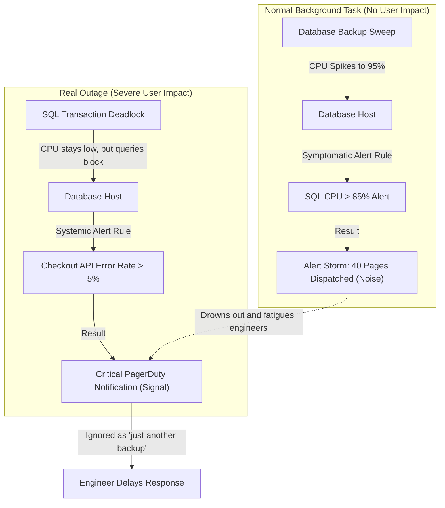
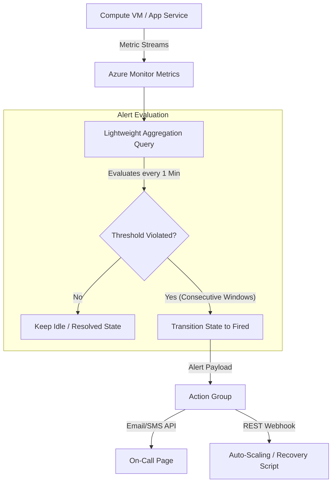
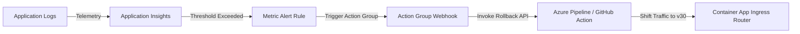

## Table of Contents

1. [The Monitoring Mandate](#the-monitoring-mandate)
2. [What Is Metrics and Alerts](#what-is-metrics-and-alerts)
3. [Platform vs. Custom Application Metrics](#platform-vs-custom-application-metrics)
4. [Symptomatic vs. Systemic Alerts](#symptomatic-vs-systemic-alerts)
5. [Systems Depth: Metric Aggregations and Alert Engine Mechanics](#systems-depth-metric-aggregations-and-alert-engine-mechanics)
6. [Declarative Metric Alert Bicep Configuration](#declarative-metric-alert-bicep-configuration)
7. [Designing Resilient Alerts and Action Groups](#designing-resilient-alerts-and-action-groups)
8. [Combating Alert Noise and On-Call Fatigue](#combating-alert-noise-and-on-call-fatigue)
9. [Putting It All Together](#putting-it-all-together)
10. [What's Next](#whats-next)

## The Monitoring Mandate

Operational logs and distributed traces are critical for diagnosing the root cause of a specific system failure.
However, during a major incident, searching through millions of text logs is too slow to detect service-wide regressions quickly.
Support teams require a high-level operational dashboard that summarizes system health in real time.

To achieve this visibility, the cloud environment must continuously measure system throughput, database latencies, and resource saturation.
Azure Monitor Metrics provides this high-velocity measurement layer, while the alert engine monitors these values on a schedule to notify engineers before user workflows degrade.

## What Is Metrics and Alerts

A metric is a number recorded over time. It is the compact signal for behavior such as CPU load, request rate, queue depth, error count, or latency.

Example: `Http5xx` can record failed web requests every minute, while `QueueLength` can show how many messages are waiting for workers.

```plain
Telemetry Signal Comparison:
  Logs: Heavyweight text records that detail what happened in a single moment
  Traces: Distributed execution trees that map a request's journey across services
  Metrics: Numeric time-series values that track system velocity and capacity
```

An alert rule is the condition checker that watches metrics or log query results and decides when to notify someone or trigger automation.

Example: an alert can fire when `Http5xx` is greater than `10` for five minutes, then route the notification through an Action Group.

If you manage monitoring platforms on AWS, Azure Monitor Metrics performs the exact same systems role as Amazon CloudWatch Metrics.
Platform and application metrics are stored in a centralized time-series database.
The alert engine evaluates these time-series streams and dispatches alert payloads to notification targets.

## Platform vs. Custom Application Metrics

Platform metrics are emitted by Azure resources, while custom application metrics are emitted by your code. To construct a comprehensive operational dashboard, you must combine both layers.

Platform metrics are built-in measurements provided automatically by the cloud host, tracking CPU, memory, request counts, storage operations, and other resource behavior without requiring changes to your application code.

Example: Azure can emit CPU percentage for an App Service Plan, but only your code can emit a business metric such as `CheckoutCompleted`.

These platform metrics include:
- **Compute Metrics**: CPU utilization percentages, memory saturation, replica instance counts, and HTTP queue lengths.
- **Database Metrics**: Active connection counts, CPU usage, Database Transaction Unit (DTU) limits, and storage I/O write throughput.
- **Storage Metrics**: Total request volumes, client throttling errors, and network egress bandwidth.

Custom metrics function as specialized business indicators, emitted from inside your application code to measure transactional volumes and operational workflows.

These application metrics include:
- **Transaction Rates**: Total checkout attempts, order success rates, and payment authorization latencies.
- **System Retries**: Database connection retry rates, transient error counts, and queue message backlogs.

```plain
Metric Source Layers:
  Compute VM (Platform Metric: Host CPU) ──> Web Server Process (Custom Metric: Checkout Rate)
```

Platform metrics tell you whether the underlying hardware is stable, while custom application metrics prove whether the software running on that hardware is successfully delivering business value.

## Symptomatic vs. Systemic Alerts

Configuring alert rules for every individual machine metric leads to high alert noise and on-call fatigue.
To design a high-signal monitoring platform, you must differentiate between symptomatic and systemic indicators.

A symptomatic alert is a low-level resource signal that may explain a problem but may not prove user impact.

Examples of symptomatic alerts include a virtual machine crossing 90% CPU usage or a database experiencing a brief spike in active connections.
These spikes are often transient, triggered by background tasks like backup sweeps or log rotation, and do not affect user transactions.

A systemic alert is a customer-impact signal that fires when core user workflows are actively failing.

Examples of systemic alerts include the checkout API returning HTTP 5xx errors above five percent, or p95 transaction response latencies exceeding two seconds.

```plain
Systemic Alert (Checkout HTTP 5xx Errors > 5%) ──> Pages On-Call
  ├── Diagnosed by platform metrics (Database I/O write latency)
  └── Resolved by logs and traces (Isolating the failing database query)
```

Adopt a high-signal alerting posture: configure systemic alerts to page on-call engineers for critical user-facing failures, and use symptomatic platform alerts as low-priority indicators or dashboard widgets to assist in diagnostics.

:::expand[Pitfall: Alert Storms from Symptomatic-Only Rules]{kind="pitfall"}
A classic monitoring failure occurs when a platform team configures static, high-priority alerts on low-level resource metrics, such as VM CPU utilization > 80% or SQL Database CPU > 85%.
During a transient, scheduled background task, such as a database backup sweep, a nightly log compression job, or a database index rebuild, the hardware will naturally run at maximum capacity.
When this happens, a flurry of 40 separate alerts will fire simultaneously, flooding team channels, triggering pager calls, and masking the true state of the platform.

The danger of this noisy alert burst is two-fold:
1. **Low Signal-to-Noise Ratio**: During a noisy alert period, a genuine, high-severity outage, like a database deadlock or a network partition, might occur. Because the team is currently receiving dozens of automated backup alerts, the critical alert is hidden among low-priority notifications and missed.
2. **Alert Fatigue**: If engineers are repeatedly woken up at 3:00 AM by alerts that resolve themselves in ten minutes once the backup sweep finishes, they learn to ignore the paging system. This behavioral conditioning leads to delayed response times when a real database hardware failure occurs.

This exact anti-pattern is common in AWS.
If you provision static CloudWatch Alarms on every EC2 or RDS instance's CPUUtilization metric, you will trigger constant noise during nightly batch jobs or automated Aurora snapshots.
The solution in both clouds is to avoid static CPU alerts for paging, utilizing AWS CloudWatch Anomaly Detection to build dynamic baselines, or alerting strictly on high-level user indicators such as Application Load Balancer HTTPCode_Target_5XX_Count or API Gateway latency.

The diagram below shows how low-level resource alerts create noise and drown out real user outages:



Never route low-level, symptomatic metric alerts to high-priority paging systems.
If an alert does not require an immediate, manual action by an engineer to prevent user-visible downtime, relegate it to an offline dashboard or a low-priority ticket.
:::

## Systems Depth: Metric Aggregations and Alert Engine Mechanics

Metric aggregation is the math Azure applies to many raw metric samples before comparing them with an alert threshold. It exists because a single second of data is usually too noisy for paging decisions.


*Alert behavior depends on the evaluation window and severity rules, not only on the raw metric line.*


Example: instead of alerting on one brief CPU spike, you can evaluate average CPU over a 5-minute lookback window and require it to stay above 85 percent.

To configure metric alert rules correctly, you must understand the underlying mathematical aggregation models utilized by the Azure Monitor Metrics engine.
When a resource emits time-series data, values are aggregated over a configurable time block called the **Granularity (Time Grain)**, and evaluated over a broader window called the **Lookback Period**.

The engine supports five primary aggregation types:
- **Average**: Calculates the mean of all values recorded during the time grain. This is a strong fit for monitoring continuous resources like CPU usage or memory saturation.
- **Minimum & Maximum**: Records the absolute lowest and highest values in the window, which is critical for tracking spike metrics like database latency or memory peaks.
- **Sum**: Adds all values together, which is ideal for calculating total request volumes or network bandwidth consumption.
- **Count**: Counts the total number of events recorded, which is useful for tracking error occurrences or container restarts.



Unlike log search alert rules that compile KQL syntax and scan columnar files on disk, metric alert rules evaluate almost instantaneously.
The time-series database holds recent metrics in volatile memory cache, allowing the evaluation engine to audit thresholds in sub-second times.

To prevent alert bouncing, where a metric fluctuates rapidly around a threshold, the alert engine supports consecutive-interval constraints.
Instead of triggering an alert the instant a threshold is crossed, the engine evaluates whether the condition remains violated across multiple consecutive intervals.
This mathematical lookback filter ensures that a brief, single-second CPU spike does not trigger paging notifications.

## Declarative Metric Alert Bicep Configuration

To manage alerts and notifications as code, we declare our alert rules and action groups using Bicep.
The template below provisions an Action Group with email and webhook receivers, and creates a Metric Alert Rule that monitors Web App HTTP server errors:

```bicep
param webAppName string = 'app-devpolaris-prod'
param actionGroupName string = 'ag-devpolaris-ops'
param location string = resourceGroup().location

resource webApp 'Microsoft.Web/sites@2022-09-01' existing = {
  name: webAppName
}

resource actionGroup 'Microsoft.Insights/actionGroups@2023-01-01' = {
  name: actionGroupName
  location: 'global'
  properties: {
    groupShortName: 'OpsActions'
    enabled: true
    emailReceivers: [
      {
        name: 'ops-email'
        emailAddress: 'ops-alerts@devpolaris.com'
        useCommonAlertSchema: true
      }
    ]
    webhookReceivers: [
      {
        name: 'ops-slack-webhook'
        serviceUri: 'https://hooks.slack.com/services/T00/B00/X00'
        useCommonAlertSchema: true
      }
    ]
  }
}

resource metricAlertRule 'Microsoft.Insights/metricAlerts@2018-03-01' = {
  name: 'alert-webapp-http-errors'
  location: 'global'
  properties: {
    severity: 1
    enabled: true
    scopes: [
      webApp.id
    ]
    evaluationFrequency: 'PT1M'
    windowSize: 'PT5M'
    criteria: {
      'odata.type': 'Microsoft.Azure.Monitor.SingleResourceMultipleMetricCriteria'
      allOf: [
        {
          name: 'webapp-5xx-errors'
          metricName: 'Http5xx'
          operator: 'GreaterThan'
          threshold: 10
          timeAggregation: 'Sum'
          criterionType: 'StaticThresholdCriterion'
        }
      ]
    }
    actions: [
      {
        actionGroupId: actionGroup.id
      }
    ]
  }
}
```

This declarative template ensures that if the Web App returns more than ten HTTP 5xx errors within a five-minute window, the platform automatically routes the alert to the operations team via email and Slack.

## Designing Resilient Alerts and Action Groups

Azure Monitor separates detecting a problem from deciding where the notification goes. Alert rules define the condition, while Action Groups define the destination.

Example: the same `Http5xx errors > 10` alert can send production incidents to PagerDuty and non-production incidents to a Teams channel by using different Action Groups.

An Action Group is the notification routing resource that separates alert detection from destinations such as email, SMS, webhook, or automation endpoints.



Designing resilient Action Groups requires setting clear notification channels based on severity:
- **High-Severity Channels (SMS, Voice, PagerDuty)**: Restricted strictly to systemic alerts that indicate active customer pain and require immediate engineering intervention.
- **Medium-Severity Channels (Email, Slack, Teams)**: Used for symptomatic warnings, capacity warnings, or non-production alerts.
- **Automated Webhooks (Azure Functions, Logic Apps)**: Linked to action groups to trigger automated recovery scripts, such as scale-out sweeps or container restarts, resolving issues before paging an engineer.

Decoupling rules from destinations ensures that if an engineer joins or leaves the on-call rotation, the platform team updates only the central Action Group resource rather than modifying hundreds of individual alert rules.

## Combating Alert Noise and On-Call Fatigue

Alert noise occurs when alerts fire too frequently, do not require human action, or monitor variables that do not affect users.
High alert noise leads to alert fatigue, training engineers to ignore pages and increasing the resolution time for real production outages.


*Good alerts route attention carefully: group noise, suppress duplicates, set severity, and send each signal to the right owner.*


To mitigate alert noise, follow these five operational design patterns:
1. **Alert on Sustained Rates, Not Single Events**: Never configure alerts on single transient errors or momentary spikes. Set rules to evaluate rates over consecutive intervals to filter out transient fluctuations.
2. **Use Multi-Dimensional Metric Splitting**: Create a single alert rule that splits by dimensions, such as `InstanceId` or `Computer`, to monitor multiple resources without creating duplicate alert rules.
3. **Configure Alert Processing Rules**: Deploy Alert Processing Rules to automatically suppress notifications during scheduled deployment windows or planned database maintenance sweeps.
4. **Link Contextual Runbooks**: Ensure every alert payload includes a direct link to the corresponding service runbook and pre-saved KQL diagnostic queries, giving the responder a clear path to resolution.
5. **Establish a Feedback Loop**: Regularly audit alert history. If an alert fires and the engineer resolves it without taking manual action, disable or adjust that rule immediately.

Reducing alert noise ensures that when a high-priority page fires, the team knows it represents a genuine production emergency that requires immediate action.

## Putting It All Together

Metrics and alerts establish a proactive operational loop that tracks system trends and coordinates human attention.
- Metrics track numeric rates and capacities at regular intervals.
- Platform metrics track infrastructure constraints automatically, while custom application metrics monitor business logic workflows.
- Systemic alerts prioritize user-facing failures to page engineers, while symptomatic alerts are relegated to dashboards.
- Under-the-hood aggregation models compile averages, sums, and counts to track resource performance.
- Declarative Bicep templates configure metric alert rules and action group webhook destinations as code.
- Action Groups separate trigger conditions from physical notification targets.
- Noise mitigation patterns, such as metric splitting and alert processing rules, prevent on-call fatigue.

By managing the alerting loop programmatically, cloud teams protect service availability and maintain high-fidelity monitoring.

## What's Next

This article completes the observability module.
The next submodule covers cost and resilience, detailing how to track cloud expenses, configure budgets, and plan disaster recovery replication across Azure regions.


*Use this as the alert loop: measure the right signal, evaluate it over a meaningful window, route it, and tune noise after real incidents.*

---

**References**

- [Azure Monitor Metrics overview](https://learn.microsoft.com/en-us/azure/azure-monitor/essentials/data-platform-metrics) - Technical reference for the time-series metric data platform.
- [Azure Monitor Alerts overview](https://learn.microsoft.com/en-us/azure/azure-monitor/alerts/alerts-overview) - Guide to creating and managing telemetry-based alerts.
- [Action Groups in Azure Monitor](https://learn.microsoft.com/en-us/azure/azure-monitor/alerts/action-groups) - Documentation on declaring and managing shared notification channels.
- [Metric alert rules in Azure Monitor](https://learn.microsoft.com/en-us/azure/azure-monitor/alerts/alerts-metric-overview) - Technical reference for configuring metric-based thresholds.
