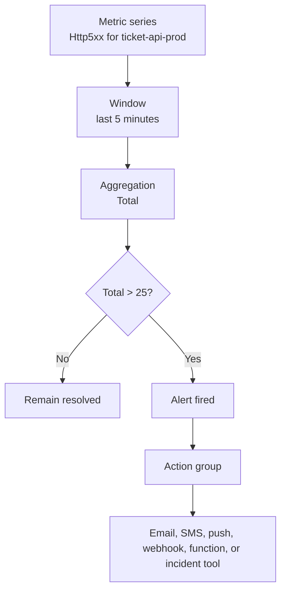

## Table of Contents

1. [The Production Question](#the-production-question)
2. [What Azure Monitor Metrics Stores](#what-azure-monitor-metrics-stores)
3. [Platform Metrics, Custom Metrics, and Dimensions](#platform-metrics-custom-metrics-and-dimensions)
4. [Dashboards and Workbooks](#dashboards-and-workbooks)
5. [Alert Rule Anatomy](#alert-rule-anatomy)
6. [Thresholds, Windows, and Noise](#thresholds-windows-and-noise)
7. [Action Groups and Routing](#action-groups-and-routing)
8. [Operating Reviews and Runbooks](#operating-reviews-and-runbooks)
9. [Metrics and Alerts as Code](#metrics-and-alerts-as-code)
10. [Putting It All Together](#putting-it-all-together)
11. [References](#references)

## The Production Question
<!-- section-summary: Metrics and alerts connect running system numbers to the people who need to respond. -->

Imagine a ticket checkout API running on Azure App Service. The API accepts payment, writes the order to Azure SQL, uploads a receipt PDF to Blob Storage, and publishes a message for a worker. The application can look normal from the resource list while customers still see slow pages, failed payments, or missing receipts.

Metrics and alerts help the team answer a practical production question: **is the system healthy enough right now, and who needs to know if it changes?** A metric gives you the number, a chart gives the team a shared view, and an alert rule turns an important change into a notification or automation.

Azure metrics and alerts connect a few pieces that show up together in almost every production system. The names can feel like separate tools at first, but they form one loop from measurement to shared visibility to response.

| Piece | Simple definition | Production example |
| --- | --- | --- |
| **Metric** | A numeric value measured over time | `Http5xx` for App Service server errors |
| **Dimension** | A label that splits one metric into smaller series | `Instance` splits App Service errors by instance |
| **Aggregation** | The math used to combine samples in a time window | Total 5xx errors over five minutes |
| **Dashboard or workbook** | A shared view for humans scanning the system | Checkout errors, latency, request volume, and SQL load |
| **Alert rule** | A scheduled evaluator that checks a metric condition | Page when 5xx errors stay above a threshold |
| **Action group** | The notification and automation target | Email, SMS, push, webhook, Azure Function, or Logic App |
| **Alert processing rule** | A routing or suppression layer applied as alerts fire | Suppress pages during a planned maintenance window |

This article follows one checkout system because metrics become easier to understand when every number has a job. A CPU chart can explain pressure on the host, a request chart can show customer impact, and an alert can bring the right person into the incident before support tickets pile up.

## What Azure Monitor Metrics Stores
<!-- section-summary: Azure Monitor Metrics stores compact time-series records that are fast to chart, query, and evaluate. -->

A **metric** is a number recorded at a point in time. Azure Monitor Metrics stores these numbers in a time-series database, which means each metric value is tied to a timestamp, a resource, a namespace, a metric name, the value itself, and optional dimensions. Microsoft describes this structure in the official [Azure Monitor Metrics data platform documentation](https://learn.microsoft.com/en-us/azure/azure-monitor/metrics/data-platform-metrics).

For the ticket checkout API, App Service can emit `Requests`, `Http5xx`, `HttpResponseTime`, `MemoryWorkingSet`, and `RequestsInApplicationQueue`. The portal may show friendly names such as "Http Server Errors," while the API and infrastructure code use metric names such as `Http5xx`. The [Microsoft.Web/sites supported metrics reference](https://learn.microsoft.com/en-us/azure/azure-monitor/reference/supported-metrics/microsoft-web-sites-metrics) lists those platform metric names, units, dimensions, and supported aggregations.

A metric is compact compared with a log. A log can tell you that one receipt upload failed because Blob Storage returned `AuthorizationPermissionMismatch`. A metric can tell you that receipt upload failures jumped from 2 per hour to 90 per hour after the latest release. That speed makes metrics a strong fit for dashboards and alert evaluation.

Azure Monitor keeps most platform and custom metrics for 93 days. That retention makes metrics useful for recent trend analysis, release comparison, and operational alerting, while long-term audit or detailed investigation usually belongs in Log Analytics tables or archived logs.


*Metrics move from running Azure resources into Azure Monitor, then split into human dashboards and alert rules that can route attention.*

Behind the scenes, Azure Monitor groups raw samples into time intervals before drawing a chart or evaluating a rule. The official [metrics aggregation documentation](https://learn.microsoft.com/en-us/azure/azure-monitor/metrics/metrics-aggregation-explained) explains five common aggregation types: **Total**, **Count**, **Average**, **Minimum**, and **Maximum**. The right one depends on the question you want the metric to answer.

For example, `Http5xx` is an event count, so a five-minute **Total** tells you how many server errors customers hit during that window. `HttpResponseTime` is a duration, so **Average** can show broad movement, while a percentile metric or Application Insights query gives better evidence for tail latency. `MemoryWorkingSet` is a current resource level, so **Average** or **Maximum** can show steady pressure or sudden spikes.

## Platform Metrics, Custom Metrics, and Dimensions
<!-- section-summary: Platform metrics come from Azure resources, custom metrics come from your app or agents, and dimensions split one metric into useful slices. -->

**Platform metrics** are the numbers Azure resources emit for you. App Service reports request counts and HTTP status classes, Azure SQL reports CPU and connection behavior, and Storage accounts report transactions, availability, latency, and throttling. These metrics give the platform side of the story without requiring application code changes.

Platform metrics help the team see whether the resource shape supports the workload. If checkout failures rise while App Service `Http5xx` rises, the application path is failing. If checkout latency rises while Azure SQL CPU and DTU usage rise, the database might be part of the pressure. If receipt uploads slow down while Storage latency and throttling rise, the object storage path deserves attention.

**Custom metrics** are numbers your application or monitoring agent publishes because the cloud platform cannot infer them from the outside. Microsoft describes custom metrics as performance indicators or business-specific metrics in the [custom metrics documentation](https://learn.microsoft.com/en-us/azure/azure-monitor/metrics/metrics-custom-overview). A ticket business might publish `CheckoutStarted`, `CheckoutCompleted`, `PaymentDeclined`, and `ReceiptUploadFailed`.

Custom metrics close the gap between resource health and business health. App Service can report that HTTP requests are flowing, but only the application can report that checkout completion dropped below normal. A good production dashboard usually needs both: platform metrics for the host and custom metrics for the workflow customers care about.

**Dimensions** are name-value labels attached to metric values. A dimension lets one metric answer smaller questions without creating a separate metric for each slice. For App Service, the `Instance` dimension can split `Http5xx` by running instance, so the team can see whether every instance is failing or one unhealthy instance is poisoning a portion of traffic.

Dimensions need careful design because every combination of dimension values creates another time series. A dimension such as `Instance`, `Region`, or `ApiName` usually has a controlled number of values. A dimension such as `customerId`, `requestId`, or `sessionId` can explode into thousands or millions of series, which makes charts harder to read and metric alerts more expensive to evaluate.

For the checkout system, useful custom metrics keep the dimensions small enough to read and route. The table below shows dimensions that help investigation, alongside dimensions that carry too much unique request-level detail.

| Metric | Useful dimensions | Risky dimensions |
| --- | --- | --- |
| `CheckoutCompleted` | `region`, `paymentProvider`, `apiVersion` | `customerId`, `cartId`, `requestId` |
| `ReceiptUploadFailed` | `storageAccount`, `failureType`, `apiVersion` | `blobName`, `traceId`, `userEmail` |
| `QueueMessageAgeSeconds` | `queueName`, `workerPool` | `messageId`, `tenantDisplayName` |


*Useful dimensions explain the failure shape, while request-level identifiers create too many tiny metric series to manage well.*

The goal is enough detail to route the investigation. If `ReceiptUploadFailed` spikes only for `failureType=AuthorizationPermissionMismatch`, the team can start with managed identity, RBAC, Key Vault, or Storage account configuration. If the same metric spikes for every failure type, the team looks for a broader release, capacity, or dependency problem.

## Dashboards and Workbooks
<!-- section-summary: Dashboards help humans scan live system behavior before an alert becomes an incident. -->

Metrics become useful to a team when they have a shared place to look. **Metrics Explorer** is the Azure Monitor tool for charting metric values over time, splitting them by dimensions, changing aggregation, and comparing resources. Microsoft documents that charts from Metrics Explorer can be pinned to Azure dashboards or saved to workbooks in the [Metrics Explorer guide](https://learn.microsoft.com/en-us/azure/azure-monitor/metrics/analyze-metrics).

A dashboard is a simple operating view. The ticket team might pin four charts for the live checkout path: App Service request volume, App Service `Http5xx`, average response time, and Azure SQL CPU. During a release, the team can keep that dashboard open and compare the candidate version with the normal production shape.

A workbook gives the team a richer investigation page. It can combine metric charts, KQL query results, text, parameters, and links into one guided view. For a checkout incident, a workbook can show the top-level metrics first, then include KQL tables for failed requests, dependency failures, and recent deployment events.

Dashboards and alerts serve different jobs. A dashboard helps a human see context, compare trends, and ask better questions. An alert handles the attention routing for conditions that deserve a response even when nobody is staring at the screen.

For a production checkout system, a useful dashboard usually starts with the customer path and then moves toward supporting resources. The first panels tell the team whether customers are affected, and the later panels help explain which dependency changed.

| Panel | Why it belongs there |
| --- | --- |
| Request volume | Shows whether the system is under normal, low, or unusual traffic |
| Server errors | Shows customer-visible failures from the API boundary |
| Response time | Shows whether requests are slowing down before they fail |
| Checkout completion | Shows whether the business workflow is succeeding |
| Database pressure | Shows whether SQL CPU, connections, or waits line up with API symptoms |
| Queue backlog or age | Shows whether async workers are falling behind |

The dashboard tells a small story from left to right. It starts with user-facing signals, then shows the likely supporting systems. That way an engineer can see whether the symptom is isolated to the API, connected to database pressure, or part of a larger dependency problem.

## Alert Rule Anatomy
<!-- section-summary: A metric alert rule combines scope, signal, condition, time window, severity, and actions. -->

An **alert rule** is the Azure Monitor resource that checks a condition on a schedule. The official [Azure Monitor alerts overview](https://learn.microsoft.com/en-us/azure/azure-monitor/alerts/alerts-overview) describes alerts as proactive notifications based on Azure Monitor data, and the [metric alert type documentation](https://learn.microsoft.com/en-us/azure/azure-monitor/alerts/alerts-types) explains that metric alerts evaluate resource metrics at regular intervals.

A metric alert rule has a few important parts that work together each time the rule runs. If one part is vague, the alert usually becomes harder to trust during an incident.

| Part | What it means | Checkout example |
| --- | --- | --- |
| **Scope** | The resource or resources being watched | `ticket-api-prod` App Service |
| **Signal** | The metric the rule evaluates | `Http5xx` |
| **Condition** | The comparison that decides firing | Total greater than 25 |
| **Window size** | The lookback period for the data | Five minutes |
| **Evaluation frequency** | How often Azure checks the condition | Every one minute |
| **Aggregation** | The math applied inside the window | Total |
| **Dimensions** | Filters or splits for smaller series | Split by `Instance` during diagnosis |
| **Severity** | The importance level from 0 to 4 | Severity 1 for customer-facing checkout failure |
| **Actions** | The action groups or automation targets | Page the web on-call and open an incident |

The alert engine works as a loop. Azure reads the metric series for the scoped resource, groups the samples over the configured window, applies the aggregation, compares the value with the threshold, and updates the alert state. If the state changes to fired, Azure routes the alert through the configured action groups.



Metric alerts can use platform metrics, custom metrics, Application Insights custom metrics, and selected logs converted to metrics. They can also use multiple conditions, dimensions, and dynamic thresholds. For one resource with multiple conditions, Azure fires the alert when all conditions are true, then resolves it after at least one condition clears for the required checks.

Metric alerts are stateful by default. A stateful alert fires once when the condition becomes true, then waits for the condition to resolve before sending more actions for the same alert. Stateless alerts fire each time the condition is met, which can be useful for some event-style notifications and noisy for paging if the rule repeats during the same incident.

Multi-resource metric alerts help with fleet monitoring. Azure supports one metric alert rule that monitors multiple resources of the same type in the same Azure region, and it sends individual notifications for each monitored resource. That fits a group of App Service apps or a set of VMs, while more complex cross-resource logic usually belongs in log search alerts or workbooks.

## Thresholds, Windows, and Noise
<!-- section-summary: Good alerts page on sustained customer impact and keep lower-level symptoms available for diagnosis. -->

The hardest part of metric alerting is choosing which numbers deserve a page. A **symptomatic metric** describes a condition that may explain trouble, such as high CPU, memory growth, queue depth, or SQL connections. A **systemic metric** describes the user-facing failure itself, such as checkout errors, payment failures, failed receipt uploads, or high response latency.

Both kinds of metrics matter, but they deserve different routing. A CPU spike during a nightly job can help explain behavior on a dashboard. A sustained rise in checkout failures means customers are actively hitting errors, so the on-call path should receive that signal quickly.

For the ticket checkout API, the first page-worthy rule might use `Http5xx` because it measures the API boundary customers touch. A strong first version could be: severity 1 when total `Http5xx` for `ticket-api-prod` is greater than 25 over five minutes, evaluated every minute. That rule avoids waking the team for one unlucky request while still catching a real burst of failures.

The next layer can use lower-priority alerts or tickets for supporting symptoms. A queue age rule can warn the platform team when async workers lag for 20 minutes. A SQL CPU rule can create a low-priority ticket if the database sits above 85 percent for half an hour. These alerts help operations without turning every resource wobble into a page.

Aggregation and window size shape the alert behavior because they decide how much evidence Azure uses before firing. The same raw metric can create a calm, useful alert or a noisy alert depending on these choices.

| Choice | Good fit | Example |
| --- | --- | --- |
| **Total over a short window** | Counted events such as errors or throttles | Total `Http5xx` greater than 25 over 5 minutes |
| **Average over a medium window** | Steady resource pressure | Average SQL CPU greater than 85 percent over 15 minutes |
| **Maximum over a short window** | Spikes that matter immediately | Maximum queue age greater than 300 seconds |
| **Dynamic threshold** | Seasonal metrics with normal daily patterns | Request volume drops sharply during business hours |
| **Dimension split** | Same condition across controlled slices | One alert instance per App Service instance |

Dynamic thresholds can help when the normal value changes by hour or day. For example, checkout volume at 2 a.m. and checkout volume at noon may have very different normal ranges. A static threshold can miss the daytime drop or overreact to a nighttime dip, while a dynamic threshold can learn the expected pattern and flag unusual movement.

Alert noise usually appears when rules lack a clear action. If the engineer receiving the alert cannot name the first investigation step, the rule needs better context, a different severity, a longer window, or a dashboard-only role. A useful page includes enough information for the responder to know which system changed, what customer path is affected, and where to start.

Alert processing rules help during planned changes. Azure Monitor can apply processing rules as alerts fire, including adding action groups, suppressing action groups, filtering alerts, or applying the rule on a schedule. That gives the team a clean way to pause notifications during a planned database failover drill while still keeping alert instances visible for review.

## Action Groups and Routing
<!-- section-summary: Action groups separate problem detection from notification and automation routing. -->

An **action group** defines who gets notified and which automations run when an alert fires. Microsoft describes action groups as collections of notification preferences and automated actions in the [Azure Monitor action groups documentation](https://learn.microsoft.com/en-us/azure/azure-monitor/alerts/action-groups). They can send email, SMS, push, voice, webhook calls, Azure Functions, Logic Apps, Automation runbooks, ITSM incidents, and Event Hub messages.

This separation is important because the same notification target can be reused by many alert rules. The ticket team can have `ag-ticket-web-oncall` for API incidents, `ag-ticket-data-team` for database incidents, and `ag-ticket-low-priority` for ticket-based operational work. The alert rule detects the condition, and the action group decides where the attention goes.

Action groups also let the team design escalation without duplicating every alert. A severity 1 checkout failure can route to the on-call engineer, incident webhook, and status-page automation. A severity 3 queue backlog can route to a team channel and work item system. A severity 4 capacity warning can send email only.

Webhook and automation receivers work best with the **common alert schema** where possible. The [common alert schema documentation](https://learn.microsoft.com/en-us/azure/azure-monitor/alerts/alerts-common-schema) explains that it gives alert notifications a standardized JSON structure across alert types. A shared schema keeps incident tools, chat integrations, and runbooks from needing separate parsers for metric alerts, log alerts, and activity log alerts.

For the checkout API, the common alert payload gives the incident tool the essentials: affected resource, severity, monitor condition, alert rule name, metric name, threshold, and current value. The webhook can use those fields to create a useful incident title such as `Sev1: ticket-api-prod Http5xx fired, value 42 over 5 minutes`.

Good routing also includes ownership. An alert for App Service `Http5xx` belongs to the application team because the API is returning server errors. An alert for SQL storage approaching a service limit may belong to the data platform team. An alert for Azure Service Health in the production region may belong to the incident commander or platform operations group.

## Operating Reviews and Runbooks
<!-- section-summary: Metrics and alerts stay trustworthy when teams review user-facing indicators, tune noisy rules, and attach clear runbooks to every page. -->

After dashboards and alert routes exist, the team needs a regular review habit. A **service-level indicator**, usually shortened to **SLI**, is a metric that describes a user-facing promise. For the checkout system, useful SLIs include checkout success rate, p95 checkout latency, receipt upload success rate, and queue message age. These indicators help the team decide which signals deserve pages and which signals belong on dashboards.

A weekly or post-release review can stay simple. Compare the main SLIs with normal traffic, inspect the alerts that fired, and ask whether each alert led to a useful action. If a rule paged the team and the first response was always "wait and see," the threshold, window, severity, or route probably needs a change. If a dashboard chart helped explain the issue, keep it. If a chart never changes any decision, remove or replace it.

Every page-worthy alert should have a short runbook. The runbook explains why the alert exists, which user workflow is affected, which dashboard to open first, which KQL query or Metrics Explorer chart starts the investigation, who owns the resource, and when to escalate. For the checkout `Http5xx` alert, the first steps might be: open the checkout workbook, check failure rate and p95 latency, inspect recent release version, query failed `POST /checkout` requests in Application Insights, then decide whether rollback or a narrow dependency fix is safer.

Planned maintenance also needs a clear rule. Alert processing rules can suppress or adjust actions during known windows, but the team should keep customer-impact signals visible somewhere. During a planned database failover drill, suppressing a low-priority SQL CPU email may make sense. Suppressing the severity 1 checkout failure page can hide a real customer problem unless the incident commander has another live watch path.

## Metrics and Alerts as Code
<!-- section-summary: Bicep keeps alert rules and action groups reviewable, repeatable, and tied to the service they protect. -->

Production alerts work best when they live near the infrastructure that depends on them. The portal is useful for discovery, but Bicep or ARM templates make the rule reviewable in pull requests, repeatable across environments, and easier to recover after accidental deletion. Microsoft provides [Resource Manager template samples for metric alerts](https://learn.microsoft.com/en-us/azure/azure-monitor/alerts/resource-manager-alerts-metric), and the same resource types work naturally in Bicep.

The template below creates an action group and a metric alert rule for the ticket checkout App Service. The rule fires when the App Service reports more than 25 HTTP 5xx responses over a five-minute window, checked every minute.

```bicep
param webAppName string = 'app-tickets-prod'
param actionGroupName string = 'ag-tickets-oncall'
param onCallEmail string = 'oncall@example.com'

@secure()
param incidentWebhookUri string

resource webApp 'Microsoft.Web/sites@2022-09-01' existing = {
  name: webAppName
}

resource actionGroup 'Microsoft.Insights/actionGroups@2021-09-01' = {
  name: actionGroupName
  location: 'global'
  properties: {
    groupShortName: 'ticketsops'
    enabled: true
    emailReceivers: [
      {
        name: 'web-oncall-email'
        emailAddress: onCallEmail
        useCommonAlertSchema: true
      }
    ]
    webhookReceivers: [
      {
        name: 'incident-webhook'
        serviceUri: incidentWebhookUri
        useCommonAlertSchema: true
      }
    ]
  }
}

resource http5xxAlert 'Microsoft.Insights/metricAlerts@2018-03-01' = {
  name: 'ma-${webAppName}-http5xx'
  location: 'global'
  properties: {
    description: 'Page the web team when ticket checkout returns sustained server errors.'
    severity: 1
    enabled: true
    scopes: [
      webApp.id
    ]
    evaluationFrequency: 'PT1M'
    windowSize: 'PT5M'
    criteria: {
      'odata.type': 'Microsoft.Azure.Monitor.SingleResourceMultipleMetricCriteria'
      allOf: [
        {
          name: 'http-5xx-total'
          metricNamespace: 'Microsoft.Web/sites'
          metricName: 'Http5xx'
          dimensions: []
          operator: 'GreaterThan'
          threshold: 25
          timeAggregation: 'Total'
          criterionType: 'StaticThresholdCriterion'
        }
      ]
    }
    actions: [
      {
        actionGroupId: actionGroup.id
      }
    ]
  }
}
```

There is a difference between the metric display language and the template language. The portal may describe a count metric as using "Sum," while the metric alert resource uses `Total` as the `timeAggregation` value. That detail matters because infrastructure code talks to the Azure Resource Manager API rather than the portal UI.

The template also keeps the webhook URI as a secure parameter. Alert routing often touches incident tools, chat systems, and automation endpoints, so those URLs deserve the same care as deployment secrets. The action group uses the common alert schema for both email and webhook receivers so downstream tools receive consistent fields.

After deployment, teams usually test the action group and review the alert instance shape. A test notification proves the email address and webhook are reachable. A real alert instance proves the metric name, threshold, severity, and incident routing make sense to the people who will respond.

## Putting It All Together
<!-- section-summary: Metrics, dashboards, alert rules, and action groups form one operating loop for production systems. -->

Metrics and alerts work best as one operating loop. Azure resources emit platform metrics, application code emits custom workflow metrics, Metrics Explorer and workbooks turn those numbers into shared views, and metric alert rules evaluate the signals that deserve response. Action groups and alert processing rules then route that response to the right people or automations.

For the ticket checkout API, the operating loop can be described as a sequence of team habits. Each habit turns raw telemetry into a clearer production response.

| Step | What the team builds |
| --- | --- |
| **Collect** | App Service, Azure SQL, Storage, and the application publish metrics |
| **Slice** | Dimensions such as `Instance`, `region`, and `failureType` keep investigations focused |
| **Visualize** | A dashboard shows request volume, 5xx errors, latency, checkout completion, SQL pressure, and queue age |
| **Page** | Severity 1 rules watch sustained customer-facing failures |
| **Diagnose** | Lower-priority platform metrics explain which dependency or resource changed |
| **Route** | Action groups send alerts to the owning team, incident tool, or automation |
| **Quiet safely** | Alert processing rules handle maintenance windows and planned suppression |

The important habit is connecting every alert to a real response. A metric can exist for curiosity, a dashboard can exist for context, and an alert should exist because somebody can do something useful when it fires. That line keeps the monitoring system helpful during quiet days and trustworthy during real incidents.


*The full loop turns raw signals into context, pages only on meaningful impact, and routes each alert to a useful response path.*

## References
<!-- section-summary: Microsoft Learn documentation backs the metric storage, dashboard, alert, action group, common schema, and infrastructure-as-code behavior in this article. -->

- [Azure Monitor Metrics data platform](https://learn.microsoft.com/en-us/azure/azure-monitor/metrics/data-platform-metrics) - Microsoft overview of metric time series, retention, dimensions, namespaces, and metric storage.
- [Metrics aggregation explained](https://learn.microsoft.com/en-us/azure/azure-monitor/metrics/metrics-aggregation-explained) - Microsoft explanation of Total, Count, Average, Minimum, and Maximum aggregation behavior.
- [Analyze metrics with Azure Monitor Metrics Explorer](https://learn.microsoft.com/en-us/azure/azure-monitor/metrics/analyze-metrics) - Microsoft guide for charting metrics, splitting by dimensions, pinning charts, and using metric views.
- [Azure Monitor alerts overview](https://learn.microsoft.com/en-us/azure/azure-monitor/alerts/alerts-overview) - Microsoft overview of Azure Monitor alert rules, alert processing, and action routing.
- [Metric alert rules in Azure Monitor](https://learn.microsoft.com/en-us/azure/azure-monitor/alerts/alerts-types) - Microsoft documentation for metric alert evaluation, state, dimensions, and multi-resource behavior.
- [Create or edit a metric alert rule](https://learn.microsoft.com/en-us/azure/azure-monitor/alerts/alerts-create-metric-alert-rule) - Microsoft guide to alert scopes, conditions, action groups, and alert processing rules.
- [Create and manage action groups](https://learn.microsoft.com/en-us/azure/azure-monitor/alerts/action-groups) - Microsoft documentation for notification and automation receiver types.
- [Common alert schema](https://learn.microsoft.com/en-us/azure/azure-monitor/alerts/alerts-common-schema) - Microsoft documentation for standardized alert payloads across Azure Monitor alert types.
- [Resource Manager template samples for metric alerts](https://learn.microsoft.com/en-us/azure/azure-monitor/alerts/resource-manager-alerts-metric) - Microsoft samples for defining metric alerts as ARM templates, which map naturally to Bicep.
