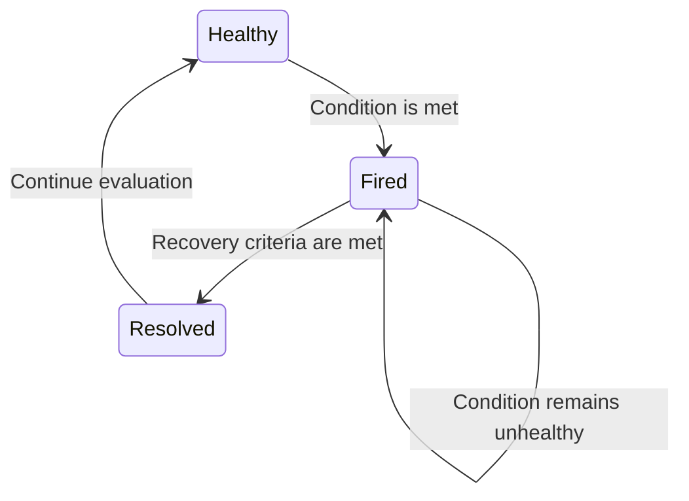
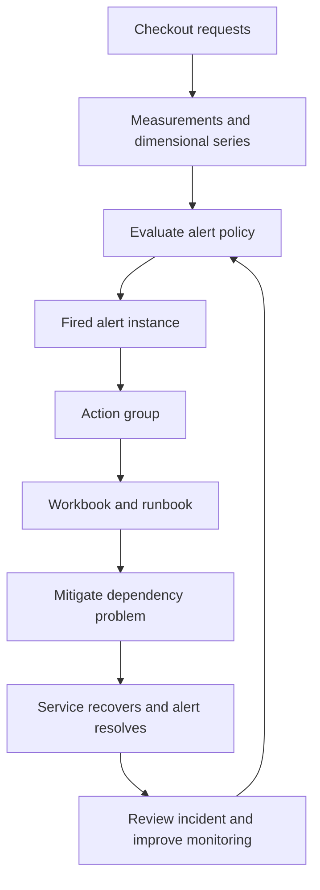

## Table of Contents

1. [What Problem Do Metrics and Alerts Solve?](#what-problem-do-metrics-and-alerts-solve)
2. [What Does Azure Monitor Metrics Store?](#what-does-azure-monitor-metrics-store)
3. [How Do Platform, Custom Metrics, and Dimensions Differ?](#how-do-platform-custom-metrics-and-dimensions-differ)
4. [How Do Dashboards and Workbooks Help?](#how-do-dashboards-and-workbooks-help)
5. [What Makes Up an Alert Rule?](#what-makes-up-an-alert-rule)
6. [How Do Thresholds and Windows Control Noise?](#how-do-thresholds-and-windows-control-noise)
7. [How Do Action Groups and Runbooks Route Response?](#how-do-action-groups-and-runbooks-route-response)
8. [How Do You Operate Metrics and Alerts as Code?](#how-do-you-operate-metrics-and-alerts-as-code)
9. [Check Your Answers](#check-your-answers)
10. [References](#references)

An API handling 10,000 requests each minute produces more activity than anyone can inspect one request at a time. To see whether checkout is getting slower, you need a few measurements that summarize the traffic. To decide whether someone should respond, you need a rule that explains which changes matter.

Those are the two jobs in this article: **metrics describe behavior, and alerts make decisions about that behavior**. A useful alert connects the measurements to an action, with enough context for the person or automation receiving it to respond.

1. **What Problem Do Metrics and Alerts Solve?**
2. **What Does Azure Monitor Metrics Store?**
3. **How Do Platform, Custom Metrics, and Dimensions Differ?**
4. **How Do Dashboards and Workbooks Help?**
5. **What Makes Up an Alert Rule?**
6. **How Do Thresholds and Windows Control Noise?**
7. **How Do Action Groups and Runbooks Route Response?**
8. **How Do You Operate Metrics and Alerts as Code?**

## What Problem Do Metrics and Alerts Solve?
<!-- section-summary: Metrics compress many observations into numbers, while alerts decide when those numbers justify intervention. -->

A running application changes continuously. Requests arrive, CPU consumption varies, queues fill and drain, dependencies slow down, and deployments alter behavior. Some changes are expected. Others indicate that users cannot complete the work they came to do.

Individual request records provide detail:

```text
12:00:01 GET /checkout 200 143ms
12:00:01 GET /products 200 31ms
12:00:02 GET /checkout 500 911ms
12:00:02 GET /checkout 200 187ms
```

The path identifies the operation, the status indicates its result, and the duration shows how long it took. These records are useful when investigating a particular request. At production scale, however, there may be billions of them.

A **metric** compresses observations into numerical measurements. Instead of reading every checkout record to decide whether performance changed, compare summaries over time:

| Time | Requests | Failures | Average latency |
| --- | ---: | ---: | ---: |
| 12:00 | 10,142 | 47 | 183 ms |
| 12:01 | 10,937 | 513 | 742 ms |

The second minute shows more requests, substantially more failures, and a higher average response time. The summary gives a reason to investigate without revealing the cause on its own.

Azure Monitor Metrics stores numerical data over time so it can be aggregated, charted, queried, and used in alerts. Azure Monitor also provides logs for richer event-oriented investigation. Metrics commonly help identify that something is wrong; logs and traces provide the detail needed to understand why.

An alert adds a decision to the measurement. A chart can show rising failure rates, but people cannot continuously watch every chart. The alert policy defines when the observed behavior calls for attention and initiates the response path.

## What Does Azure Monitor Metrics Store?
<!-- section-summary: Metric samples identify a measurement, timestamp, value, and dimensions; aggregation determines what a chart or rule says about them. -->

A metric sample has four useful parts: its name, timestamp, value, and dimensions. For example:

```text
metric: request_latency_ms
time: 12:05:00
value: 231
dimensions: region=uksouth, endpoint=/checkout
```

The name states what was measured. The timestamp places the measurement in time. The value is the number recorded, and the dimensions identify the relevant part of the system.

Measurements with the same identity form a **time series**. Successive latency values might be 231, 245, 238, 811, 930, and 864 milliseconds. Looking at the series reveals a change that is hard to see from one sample alone.

You can think of the lookup as a function of time and dimensions that returns a number. CPU on `web-01` might be 63% at 12:05, 71% at 12:06, and 89% at 12:07. The monitoring system can inspect these numerical samples directly instead of reconstructing millions of individual events every time someone opens a CPU chart.

### Know how the samples are combined

**Aggregation** combines multiple measurements into the value being displayed or evaluated. Suppose five CPU measurements are:

```text
31  35  42  98  37
```

The average is approximately 49%, the maximum is 98%, and the minimum is 31%. Each result describes the same underlying samples but answers a different question.

A rule written only as “CPU above 90%” is incomplete. A maximum above 90% can identify a short spike in the interval. An average above 90% requires enough high measurements to raise the combined value. Counts and totals answer other questions, such as how many events or operations occurred.

This is why aggregation belongs in both chart configuration and alert configuration. Before interpreting a value, establish whether it is an average, maximum, minimum, count, total, or another supported summary. Otherwise two people can read the same underlying data and believe it tells contradictory stories.

The time range matters as well. A short interval can expose a burst that disappears inside a much longer average. Later sections combine aggregation with alert windows to show how this affects detection.

## How Do Platform, Custom Metrics, and Dimensions Differ?
<!-- section-summary: Platform metrics describe infrastructure, custom metrics describe application behavior, and dimensions split those measurements into useful subsets. -->

Azure resources already have information about their own activity. A VM can report CPU consumption, a storage service can report operations, and a database can report resource usage. Azure exposes many of these as **platform metrics**, generally without requiring application code changes.

The infrastructure cannot automatically know whether a business operation succeeded. An airline reservation application illustrates the gap. CPU might be 37%, with apparently normal memory and networking, while the application reports a booking success rate of 42%, 1,823 payment failures per minute, and an 8.4-second seat-availability lookup.

Those application-specific measurements are **custom metrics**. Applications and monitoring agents can publish them through Azure Monitor, Application Insights, and OpenTelemetry-based instrumentation. They describe behavior that the application understands but the hosting resource does not.

The useful distinction is the source of knowledge. Platform metrics report what infrastructure can observe about itself. Custom metrics report what the application or business operation can observe. A complete view normally uses both so that resource behavior can be related to user outcomes.

### Give measurements the dimensions needed for investigation

A total of 30,000 requests per minute gives useful volume information, but it cannot show whether a problem affects only the UK. A `region` dimension allows separate series for the UK, US, and Germany.

Adding `endpoint` can isolate checkout within the UK. Adding `status` can isolate checkout responses with status 500. Azure describes dimensions as name-value pairs that let a metric be filtered or split into separate time series.

The choice determines which questions can be answered later. A service-wide total cannot recover a regional distinction that was never recorded in the numerical series.

### Control the number of distinct series

Each combination of dimension values can create another series. Five regions, 50 endpoints, and six status codes can produce:

$$
5 \times 50 \times 6 = 1{,}500\text{ time series}
$$

Adding a `customer_id` with one million possible values can multiply that collection dramatically. This is **high cardinality**: a label has many distinct values, producing a large number of separately identified series.

Useful bounded dimensions often include region, environment, service, endpoint, status code, and dependency. Request IDs, user IDs, order IDs, session IDs, GUIDs, and timestamps often have too many distinct values for this role. Those identifiers usually belong in logs or traces, where a particular event can be investigated without creating a metric series for every identity.

The tradeoff is explicit: dimensions add useful questions and also add series. Choose them according to the comparisons and alert boundaries the service needs.

## How Do Dashboards and Workbooks Help?
<!-- section-summary: Metrics Explorer supports exploration, dashboards show established status views, and Workbooks guide a sequence of investigative questions. -->

A useful threshold begins with an understanding of normal behavior. Seven days of request-volume data might show 2,000 requests per minute at 02:00, 15,000 at 08:00, 40,000 at 13:00, and 27,000 at 19:00.

A threshold chosen from a quiet hour may therefore describe normal lunchtime traffic as an incident. Looking across a representative time range reveals patterns that one snapshot cannot show.

**Metrics Explorer** supports this examination. It lets you select metric series and aggregations, filter or split dimensions, adjust time ranges, and investigate spikes or trends visually. It is the place to establish what a particular measurement is doing before deciding how to act on it.

A **dashboard** collects the status views the team already knows it cares about. Request rate, error rate, p95 latency, queue depth, CPU, and dependency failures can provide a shared service overview. The p95 latency indicates the duration below which 95% of the measured requests fall, making it useful alongside an average when slower requests matter.

A **Workbook** supports a more directed investigation. Azure Workbooks combine metrics, log queries, parameters, explanatory text, and visualizations in an interactive report. Rather than showing only a fixed collection of numbers, a workbook can guide the responder through connected questions.

For example, the investigation might begin with abnormal traffic, narrow it to a region and endpoint, compare the start of the change with a deployment, identify a failing dependency, and then open the corresponding logs. The workbook connects numerical detection to event-level evidence.

These tools have complementary jobs. Metrics Explorer helps investigate a metric. A dashboard displays known operating status. A Workbook helps follow an investigative sequence. None of them replaces the need to decide which observed conditions deserve an alert.

## What Makes Up an Alert Rule?
<!-- section-summary: An alert rule applies a defined scope, signal, aggregation, window, threshold, evaluation schedule, and response policy to measurements. -->

Suppose checkout failure rates are 0.7%, 0.9%, and 0.8% in successive minutes, followed by 6.4%, 7.1%, and 8.3%. A person looking at the chart sees a significant change. An alert rule expresses the decision to act on that change, such as considering a failure rate above 5% unhealthy under specified conditions.

Azure Monitor evaluates metric alert conditions periodically and fires an alert when their configured requirements are met. The rule interprets measurements; it is not an additional measurement itself.

A complete rule answers several questions:

| Question | Configuration concept |
| --- | --- |
| Which system is being monitored? | Scope |
| Which measurement matters? | Signal or metric |
| Which part of the system? | Dimensions |
| How are samples combined? | Aggregation |
| How much history is examined? | Window |
| What condition requires attention? | Operator and threshold |
| How often is it checked? | Evaluation frequency |
| How urgent is the result? | Severity |
| Who or what receives it? | Action group |
| When does it return to healthy? | Resolution and state behavior |

For example, a rule can monitor `failure_rate` for `checkout-service`, limited to `region=uksouth`. Every minute it calculates the average over the previous five minutes and checks whether that value exceeds 5%.

The plain-language rule is: **each minute, examine the preceding five minutes of UK South checkout failures and raise the configured condition if their average exceeds 5%**. That statement makes the behavior reviewable before anyone inspects configuration syntax.

### Evaluate the right subsets

A global failure rate of 3% can hide unequal impact. The same measurements split by region might show 17% in the UK, 0.4% in the US, 0.6% in Germany, and 0.5% in France. The total conceals a severe regional problem.

Dimensional metric alerts can evaluate separate time series so that a region's condition is considered independently. A rule split by `region` can examine the UK, US, Germany, and other combinations as separate alert conditions.

Dimensions are therefore part of alert design as well as chart design. They determine whether localized harm is visible to the decision.

### Combine conditions where one measurement is insufficient

High latency during a tiny amount of traffic may need a different response from high latency affecting many users. A conceptual condition might require latency above two seconds **and** a request rate above 100 requests per minute.

Azure Monitor multi-condition metric rules combine their configured criteria so that all must be met for the alert to fire. This allows a rule to distinguish an unusual measurement from a condition with enough operational impact to justify action.

### Separate a rule from an alert occurrence

A rule is the policy. An **alert instance** is an occurrence of its condition being met. One rule can produce many alert instances over its lifetime.

Metric alerts are stateful by default. If an error rate stays above 5% for 30 minutes, repeated evaluations do not simply need to create a separate identical incident every minute. The alert can remain fired and later resolve when the signal recovers according to its configured evaluation behavior. Stateless behavior is also available when repeated notifications are intended.


```mermaid
stateDiagram-v2
    Healthy --> Fired: Condition is met
    Fired --> Fired: Condition remains unhealthy
    Fired --> Resolved: Recovery criteria are met
    Resolved --> Healthy: Continue evaluation
```

State behavior is another reason to review the complete rule. The threshold alone does not explain when notifications repeat or when an incident is considered resolved.

## How Do Thresholds and Windows Control Noise?
<!-- section-summary: Windows, evaluation frequency, and threshold type balance fast detection against noise; alerts should represent conditions that justify action. -->

**Window size** states how much historical evidence each evaluation uses. **Evaluation frequency** states how often the rule makes its decision. They are separate controls.

With a 15-minute window and five-minute evaluation frequency, an evaluation at 12:30 considers 12:15–12:30. At 12:35 it considers 12:20–12:35. At 12:40 it considers 12:25–12:40. These windows overlap because the evidence period is longer than the interval between decisions.

Short windows tend to detect changes quickly and react to brief spikes. Longer windows tend to be more stable but can hide short disruptions inside a wider average. A single 900 ms latency spike might trigger a one-minute rule while barely affecting a 15-minute average.

The design balances time to detect, false positives, false negatives, and operating impact. A false positive demands attention when intervention is unnecessary. A false negative misses a condition that needed attention. Neither can be addressed by choosing a threshold without considering the signal and its time behavior.

### Use a threshold that fits the signal

Suppose CPU normally follows this daily pattern:

| Time | CPU |
| --- | ---: |
| 09:00 | 30% |
| 10:00 | 45% |
| 11:00 | 82% |
| 12:00 | 91% |
| 13:00 | 78% |
| 14:00 | 43% |

A rule that pages above 80% will repeatedly fire during ordinary lunchtime operation. The monitoring system is applying its rule correctly; the definition of abnormal behavior needs improvement.

A **static threshold** compares against a fixed boundary. Examples include a queue backlog above 50,000, free disk capacity below 10%, or an error rate exceeding the allowance associated with a service-level objective. An SLO states the service outcome the team aims to provide, so that boundary can have a meaning beyond the metric's historical shape.

A **dynamic threshold** compares behavior with patterns learned from the metric's history. Azure Monitor supports this approach for identifying deviations from an expected baseline. It can help with seasonal signals whose normal level changes over time.

Dynamic thresholds still need judgment. A change can be unusual without harming users, while a harmful condition can recur so often that it appears normal. The alert needs a reason for intervention, regardless of how its threshold is obtained.

### Prefer actionable symptoms

A CPU value above 85% does not explain what the on-call engineer should do. The resource may be performing useful work normally. A checkout failure rate above 5% for 10 minutes while handling more than 1,000 requests per minute has a clearer relationship to user harm.

Infrastructure signals such as CPU, memory, threads, connections, and disk activity help explain the cause of a problem. User-facing symptoms such as availability, error rate, latency, throughput, queue delay, and successful business transactions help establish whether the service needs attention.

> Design an alert around a condition that warrants human or automated action, and make that action understandable to its recipient.

An actionable alert can still use infrastructure measurements, but its owner should be able to explain the consequence and the response. Otherwise repeated notifications train the team to ignore the system.

## How Do Action Groups and Runbooks Route Response?
<!-- section-summary: Action groups separate notification routing from detection; severity and runbooks give responders the urgency, context, and steps needed to act. -->

After a rule fires, the information needs a destination. An Azure **action group** defines notification and automation targets. It can send email, SMS, push, or voice notifications, and invoke mechanisms such as webhooks, Functions, and Logic Apps. Several alert rules can reuse the same group.

The resulting path is measurement, rule evaluation, alert instance, action group, and then a person or automation. Observing, deciding, routing, and acting are separate responsibilities.

Keeping routing separate makes changes easier to manage. If 200 rules contain individual engineers' email addresses, a team change can require editing all 200. A rule that refers to a Payments production on-call action group keeps the detection condition separate from its response ownership. Routing can be updated without redefining what counts as a database failure.

### Assign severity from consequences

Azure alert payloads support Sev0 through Sev4. The organization should define what those levels mean operationally rather than deriving them mechanically from CPU bands.

An illustrative policy could use Sev0 for a major customer-facing outage, Sev1 for significant degradation requiring immediate response, Sev2 for an important issue requiring timely investigation, and Sev3 or Sev4 for lower-impact or informational conditions.

The important question is the urgency of response. CPU at 70%, 80%, and 90% does not automatically correspond to three meaningful incident severities. The service consequence determines the priority.

### Give the responder a usable runbook

A 03:00 notification named `QueueDepthHigh` leaves important questions unanswered. Which queue is affected? Why does its backlog matter? How high is the observed value? Which customers are affected, what usually causes it, and which checks come first?

A **runbook** records the operational knowledge needed to move from the signal to diagnosis and safe action. It should explain the measurement, expected impact, likely causes, relevant dashboards or queries, verification steps, mitigations, escalation routes, and how to confirm recovery.

The complete response therefore extends beyond delivery of the message. The recipient needs to inspect evidence, choose a suitable mitigation, and verify that the affected service has recovered. A notification without this context has only transferred the unresolved problem to another person.

## How Do You Operate Metrics and Alerts as Code?
<!-- section-summary: Monitoring needs versioned configuration, clear ownership, and reviews of actual incident outcomes so detection and response improve over time. -->

Monitoring configuration changes production behavior: it determines which failures are noticed, how quickly, and who receives them. Configuring 50 services manually can produce unexplained differences.

Production might have an 80% threshold while staging uses 90%. One service might evaluate every minute and another every five minutes. The EU region might have an alert that the US region lacks. Some differences may be intentional, but without a record nobody can explain which ones are deliberate.

Metric rules, action groups, dashboards, and Workbooks benefit from version control, code review, repeatable deployment, environment parameters, change history, testing, and explicit ownership. Azure exposes deployable resources such as `Microsoft.Insights/metricAlerts` and `Microsoft.Insights/actionGroups` through ARM/Bicep and related infrastructure-as-code tooling.

A monitoring directory could contain `checkout-alerts.bicep`, `payment-alerts.bicep`, `action-groups.bicep`, and separate dashboard and workbook definitions. The files then follow the same controlled change process as the application infrastructure they monitor.

### Review whether alerts helped

An alert that fired 80 times in a month deserves investigation. The underlying system may be unreliable. Alternatively, the metric, threshold, or window may be unsuitable; the alert may describe expected behavior; nobody may have needed to act; or a recurring issue may be ready for automation.

An operating review asks whether monitoring helped the team run the service. Examine frequency, repeated incidents, false positives, alerts that nobody acted on, detection time, acknowledgment time, recovery time, missing owners, and incidents that occurred without any alert.

The outcome feeds back into metric selection, thresholds, routing, and runbooks. Monitoring is an operating system that needs maintenance, not a configuration task completed once.

### Follow the complete checkout example

An online checkout service emits `checkout_requests`, `checkout_failures`, and `checkout_duration`, with `region` and `payment_provider` dimensions. Metrics Explorer shows a normal failure rate around 0.3–0.8%, while serious incidents usually exceed 4%.

The team chooses an illustrative alert policy:

| Setting | Value |
| --- | --- |
| Metric | `checkout_failure_rate` |
| Dimension split | `region` |
| Aggregation | Average |
| Window | 5 minutes |
| Condition | Greater than 5% |
| Evaluation frequency | Every minute |
| Severity | Sev1 |
| Action group | `checkout-production-oncall` |

The average here is the aggregation specified by this example; its meaning should be checked against how the underlying failure-rate samples are produced.

Suppose UK South then reports 1.2% at 12:01, 3.8% at 12:02, 7.1% at 12:03, 8.4% at 12:04, and 9.0% at 12:05. The average of those five values is 5.9%, exceeding the 5% threshold.

Azure Monitor stores the measurements in time series, with the region dimension preserving the UK South condition independently. The rule evaluates the recent samples, an alert instance fires, and the action group routes its notification.

The engineer opens the checkout Workbook, follows the evidence to the payment provider, and uses the runbook to choose a mitigation. When the failure rate returns to normal and the resolution criteria are satisfied, the alert resolves. A later incident review improves the monitoring or runbook based on what happened.


```mermaid
flowchart TD
    users["Checkout requests"] --> metric["Measurements and dimensional series"]
    metric --> rule["Evaluate alert policy"]
    rule --> alert["Fired alert instance"]
    alert --> route["Action group"]
    route --> investigate["Workbook and runbook"]
    investigate --> mitigate["Mitigate dependency problem"]
    mitigate --> recover["Service recovers and alert resolves"]
    recover --> review["Review incident and improve monitoring"]
    review --> rule
```

The system connects actual behavior to measurements, measurements to numerical history, history to an alert policy, and the policy to a response. Dimensions and aggregation make the evidence meaningful; windows and thresholds define the decision; routing and runbooks make action possible.

Start by identifying observable behavior that tells you the service needs intervention. The Azure resources then implement that decision in a repeatable, reviewable way.

## Check Your Answers

:::expand[What Problem Do Metrics and Alerts Solve?]{kind="recap"}
Metrics summarize large volumes of activity numerically. Alerts apply a policy to those measurements so important changes can receive attention without someone watching every chart.
:::

:::expand[What Does Azure Monitor Metrics Store?]{kind="recap"}
A sample identifies the metric, time, value, and dimensions. Related samples form a time series. Aggregation determines whether a chart or rule represents an average, maximum, minimum, count, total, or another summary.
:::

:::expand[How Do Platform, Custom Metrics, and Dimensions Differ?]{kind="recap"}
Platform metrics report infrastructure behavior; custom metrics add application and business knowledge. Dimensions preserve useful subsets but multiply time series, so high-cardinality identifiers usually belong in logs or traces.
:::

:::expand[How Do Dashboards and Workbooks Help?]{kind="recap"}
Metrics Explorer helps establish patterns in a signal. Dashboards collect known status views. Workbooks combine parameters, metrics, logs, text, and visualizations to guide investigation.
:::

:::expand[What Makes Up an Alert Rule?]{kind="recap"}
Define scope, signal, dimensions, aggregation, window, threshold, frequency, severity, routing, and resolution behavior. A rule is the policy; an alert instance is one occurrence. Dimension splits and multiple criteria refine the decision.
:::

:::expand[How Do Thresholds and Windows Control Noise?]{kind="recap"}
The window selects evidence history, while frequency selects how often to evaluate it. Short windows are more sensitive; longer ones are more stable. Static or dynamic thresholds still need a connection to actionable service impact.
:::

:::expand[How Do Action Groups and Runbooks Route Response?]{kind="recap"}
Action groups route notifications or automation separately from detection. Severity expresses response urgency, and a runbook provides impact, evidence, safe mitigation, escalation, and recovery checks.
:::

:::expand[How Do You Operate Metrics and Alerts as Code?]{kind="recap"}
Version and review monitoring definitions, deploy them repeatably, and give them owners. Review alerts and incidents to improve signals, policies, routing, and runbooks based on whether they helped restore service.
:::

## References

- [Metrics in Azure Monitor](https://learn.microsoft.com/en-us/azure/azure-monitor/metrics/data-platform-metrics?azure-portal=true)
- [Metrics Explorer](https://learn.microsoft.com/en-us/azure/azure-monitor/essentials/metrics-getting-started)
- [Metric alert rules and dimensions](https://learn.microsoft.com/th-th/azure/azure-monitor/alerts/alerts-create-new-alert-rule?tabs=metric)
- [Metric alert tutorial: aggregation and evaluation](https://learn.microsoft.com/en-us/Azure/azure-monitor/alerts/tutorial-metric-alert)
- [Azure Workbooks](https://learn.microsoft.com/en-us/azure/azure-monitor/visualize/workbooks-overview)
- [Azure Monitor alert types](https://learn.microsoft.com/en-us/azure/azure-monitor/alerts/alerts-types)
- [Dynamic thresholds](https://learn.microsoft.com/en-us/azure/azure-monitor/alerts/alerts-dynamic-thresholds)
- [Common alert schema](https://learn.microsoft.com/en-us/azure/azure-monitor/alerts/alerts-common-schema)
- [Metric alert state and troubleshooting](https://learn.microsoft.com/en-us/azure/azure-monitor/alerts/alerts-troubleshoot-metric)
- [Action groups](https://learn.microsoft.com/en-us/azure/azure-monitor/alerts/action-groups)
- [Metric alert infrastructure resource](https://learn.microsoft.com/en-us/azure/templates/microsoft.insights/2026-01-01/metricalerts)
