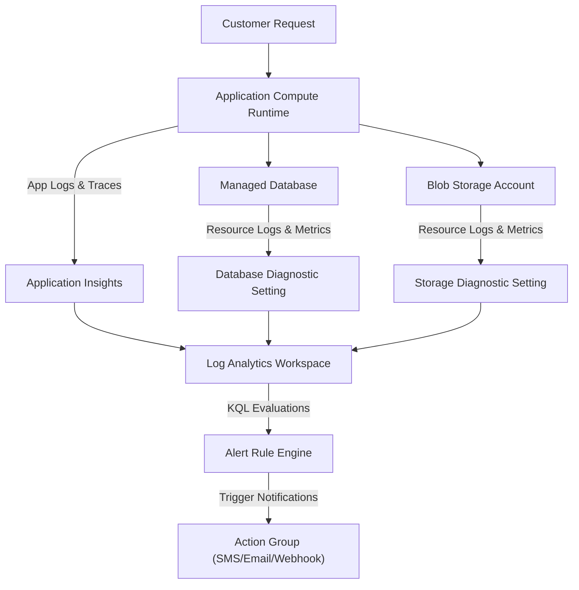
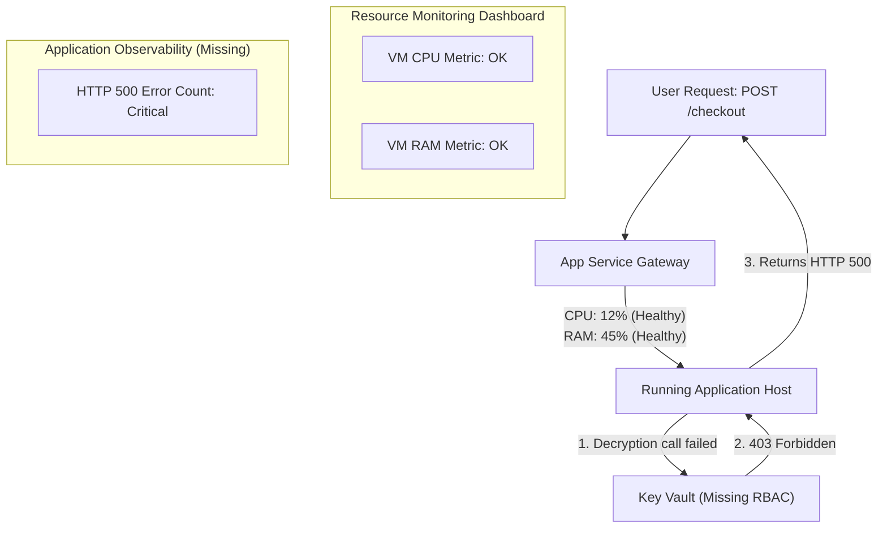

## Table of Contents

1. [What Is Observability](#what-is-observability)
2. [The Azure Monitor Ecosystem](#the-azure-monitor-ecosystem)
3. [The Four Pillars of Telemetry](#the-four-pillars-of-telemetry)
4. [Systems Depth: Columnar Storage and Distributed Shards](#systems-depth-columnar-storage-and-distributed-shards)
5. [Ecosystem Mapping: Azure vs. AWS](#ecosystem-mapping-azure-vs-aws)
6. [Observability Data Flow Pipelines](#observability-data-flow-pipelines)
7. [Putting It All Together](#putting-it-all-together)
8. [What's Next](#whats-next)

## What Is Observability

Cloud observability is the practice of collecting enough evidence from a running system to understand what happened without logging into every server. The evidence comes from logs, metrics, traces, and alerts.

Example: if checkout returns HTTP 500, observability should let you connect the failed request, SQL dependency call, Blob Storage upload error, and alert notification into one timeline.

While traditional infrastructure monitoring focuses on raw resource availability, observability addresses the health of active user-facing workflows.
A container runtime or database can report positive health checks and normal CPU usage while still failing to execute critical workflows due to identity permission errors, network security rules, or downstream dependency timeouts.

Observability is the telemetry practice that lets you reconstruct what happened inside a running system from logs, metrics, traces, and alerts without attaching a debugger to production.

```plain
System Health Evaluation:
  Resource Monitoring: CPU < 80%, RAM < 90%, Port 443 responsive
  User Workflow Monitoring: Checkout success rate > 99%, Database query latency < 100ms
  Actionable Evidence: Structured application logs, transaction traces, and alert triggers
```

Relying exclusively on resource checks creates a massive blind spot where operational dashboards are green, but the business is down.
If an application container runs at low CPU utilization but cannot decrypt database connection settings due to a missing role assignment, standard ping tests will report success.
However, every customer transaction attempt will fail.
Observability ensures that your team gathers the metrics, logs, and traces needed to reconstruct the timeline of an execution failure.

## The Azure Monitor Ecosystem

Azure Monitor is the central Azure platform for collecting, querying, evaluating, and alerting on operational telemetry. It brings resource metrics, resource logs, application traces, dashboards, and alert rules under one monitoring umbrella.


*Observability starts by separating the signal types, then routing them into tools that answer different operational questions.*


Example: a single production app can send App Service metrics, Azure SQL logs, Application Insights traces, and alert notifications through Azure Monitor resources.

Azure Monitor functions as the central collection and evaluation platform for Azure resource metrics, logs, traces, and alerts.



Rather than managing separate, fragmented tools for server telemetry, application performance, and diagnostic logs, Azure Monitor aggregates all telemetry channels into a single backend database.
You route all logs from your virtual networks, virtual machines, databases, and containers to this database.
You then use a single, shared query language to search logs, build visualizations, and trigger alerts.

:::expand[Pitfall: Resource Health Does Not Equal User Workflow Health]{kind="pitfall"}
A dangerous monitoring trap is assuming that healthy system-level metrics, such as CPU, RAM, disk space, and VM availability, guarantee a healthy application experience for your users.
A VM or App Service container can run smoothly at 12% CPU usage with 100% infrastructure availability, while every single customer attempt to check out is silently crashing due to a misconfigured Key Vault role assignment or a blocked database network rule.

Relying exclusively on infrastructure metrics creates a massive blind spot where operational dashboards are green, but the business is completely down.
In these scenarios, the application is technically online and reachable, so the platform-level health checks return success.
However, the logical transactions are failing.
Without application-level telemetry, such as tracking HTTP 5xx responses, failed database transactions, or logical auth drops, your team will only learn about the outage from frustrated customer support tickets.

This exact blind spot exists in AWS.
If you monitor your Amazon EC2 instances or ECS tasks using only the standard CPUUtilization and StatusCheckFailed metrics, you will miss catastrophic failures caused by your instance's IAM role lacking permissions to decrypt a KMS key or fetch from DynamoDB.
In both clouds, you must supplement resource-level monitoring with synthetic canaries, structured application error logs, and custom metrics representing actual user success rates.

The diagram below illustrates how infrastructure metrics mask application-level outages:



Never design dashboards around resources alone; monitor user workflows.
Always pair resource-level monitoring with application-level telemetry, such as tracking HTTP error rates, transaction execution traces, and database exceptions, to capture the true health of your running system.
:::

## The Four Pillars of Telemetry

Telemetry signals are the structured evidence your systems emit while they run. To diagnose system failures, you must gather enough evidence to reconstruct the timeline of an incident.
The Azure Monitor telemetry model organizes this evidence into four primary signals: logs, metrics, traces, and alerts.
Each signal represents a different data structure optimized to answer a specific operational question.


*Logs, metrics, traces, and alerts are different evidence shapes, so they should not be designed or queried as one thing.*


### 1. Logs

A log is a discrete, timestamped text record describing an isolated event within the system.
Modern cloud logging relies on structured logs formatted as queryable JSON documents.

A structured log is an event record with searchable fields alongside the message string.

```json
{
  "timestamp": "2026-05-16T10:24:18.102Z",
  "level": "ERROR",
  "service": "orders-api",
  "operation": "checkout",
  "requestId": "req_7a91_checkout",
  "dependency": "blob-storage",
  "target": "stordersprod.blob.core.windows.net",
  "message": "invoice pdf upload failed",
  "errorCode": "AuthorizationPermissionMismatch"
}
```

Structured logs include rich context fields to ensure that engineers can search, filter, and aggregate logs across thousands of active processes.
The JSON payload above immediately isolates the failure to a permission issue during a Blob Storage write.
This diagnostic detail points the operator directly toward Entra ID role assignments and storage network rules rather than code logic.

### 2. Metrics

A metric is a numeric value measured at regular intervals, stored as a time-series record.
Metrics are lightweight, highly compressed, and fast to evaluate.

A metric is a compact numeric sample for speed, volume, latency, saturation, or capacity over time.

For an API backend, a standard metrics set includes request counts, p95 response latencies, error percentages, host CPU utilization, and database lock times.
While a log records the details of one failure, a metric tells you if that failure represents an isolated incident, a gradual capacity degradation, or a catastrophic service-wide outage.

### 3. Traces

A trace follows the execution path of a single transaction as it travels across different process and network boundaries in a distributed system.
The trace is composed of a series of correlated spans, where each span represents a specific unit of work.

Distributed tracing uses shared trace identifiers in network headers so separate services can connect their local spans into one request timeline.

```plain
Transaction: op_6f2a91 (POST /checkout) - Total Duration: 1840ms
|
+-- [Compute] API Authentication (Duration: 50ms, Success: True)
|
+-- [Dependency] Azure SQL: Insert Order Record (Duration: 160ms, Success: True)
|
+-- [Dependency] Blob Storage: Upload Invoice PDF (Duration: 1220ms, Success: False)
|   |
|   +-- Error: AuthorizationPermissionMismatch (HTTP 403)
|
+-- [Compute] Exception Thrown: ReceiptUploadError (Duration: 5ms)
```

Application performance monitoring agents inject unique tracking identifiers into outgoing HTTP and gRPC headers.
This context propagation allows the platform to stitch together the entire workflow path.
Distributed tracing connects isolated logs and metrics into a unified timeline, revealing exactly which dependency caused a slow response or triggered an execution failure.

### 4. Alerts

An alert is a rule that continuously evaluates metrics or log query results against configured conditions to determine if human attention or automated self-healing is required.

An alert rule is a scheduled evaluator that checks metric or log conditions and triggers a notification path when thresholds are crossed.

```plain
Alert Trigger Definition:
  Evaluated query: failed request rate over 5 minutes
  Threshold: > 5 percent of total traffic
  Action target: alert action group webhook
```

Alerting is not a separate form of telemetry; it is an active evaluation loop.
A robust alerting rule defines a strict threshold and links to an Action Group.
The Action Group handles notification routing to channels such as SMS, email, messaging tools, or automated webhooks.

## Systems Depth: Columnar Storage and Distributed Shards

Kusto is the columnar analytics engine behind Azure Monitor Logs. Columnar means values from the same field are stored together, which makes searches over a few fields much faster than scanning every full log row.

Example: a query that only needs `TimeGenerated`, `StatusCode`, and `Url` can scan those columns without reading every message body in the table.

Under the hood, Azure Monitor's logging database is built on the Kusto query engine.
Understanding the low-level systems mechanics of this engine explains why certain log query topologies perform efficiently while others experience CPU bottlenecks.

Unlike a relational database that stores records as horizontal rows on a disk page, Kusto is a columnar database:
- Columns are stored in separate, highly compressed physical file blocks called shards.
- Shards are partitioned primarily by ingestion time boundaries.
- When a query filters by a specific column, the engine reads only the disk shards corresponding to that column.
- This design eliminates the need to scan irrelevant fields, minimizing physical disk read operations.
- The columnar format allows the engine to compress repeating log patterns, reducing the storage footprint on disk.

When logs are ingested, they pass through a volatile in-memory buffer before being committed to persistent columnar shards.
To handle massive throughput, the Kusto engine implements a distributed parallel scanning architecture:
- A central coordinator node receives the log query and parses the syntax.
- The coordinator analyzes the time boundary filter and identifies the target shards.
- It distributes execution tasks to multiple query compute worker nodes.
- Each worker node performs a parallel scan on a subset of columnar shards.
- The worker nodes run logical filters and compute intermediate summaries in local RAM.
- They return these intermediate summaries to the coordinator node.
- The coordinator aggregates the data streams and returns the final result.

Placing time filters at the very beginning of a query pipeline is a physical constraint.
Failing to specify a time window forces the coordinator node to scan every persistent shard in the database, resulting in high disk utilization and query timeouts.

### Metrics Storage Engine vs. Logs Sharding

Metrics and logs use different storage engines because they answer different questions. Metrics are small numeric samples for fast trend checks, while logs are richer records for investigation.

Example: use metrics to alert quickly when p95 latency crosses two seconds, then use logs to inspect which route, dependency, or exception caused the latency.

Azure Monitor Metrics uses a completely different physical database engine compared to Azure Monitor Logs.
While Logs rely on the columnar, partition-sharded Kusto database, Metrics are directed to a specialized time-series database.
A time-series database is an indexed numeric store optimized around timestamped samples and resource labels for fast trend retrieval.

In this time-series store, values are kept in memory and aggregated at pre-defined intervals.
This design allows the platform to evaluate millions of system metrics per second without physical disk operations or heavy query compilation overhead.
Because of this distinction, metric alerts evaluate almost instantaneously.
In contrast, log queries require the coordinator node to parse the KQL syntax, locate the target table, and spin up compute tasks across worker nodes.

Understanding this difference is critical when designing alerting strategies:
- Use metric-based alert rules for high-velocity resource limits, such as high CPU usage or low memory pools.
- Use log-based alert rules when you require deep schema correlation, such as joining auth logs with transaction exceptions.


## Ecosystem Mapping: Azure vs. AWS

The consolidated architecture of Azure Monitor contrasts with the partitioned observability tools found in AWS.
If you have built monitoring infrastructures on AWS, understanding the conceptual mapping between the two platforms simplifies system design.

The table below maps common AWS observability concepts to their Azure Monitor equivalents:

| Operational Dimension | AWS Resource | Azure Monitor Resource | High-Level Concept Explanation |
| --- | --- | --- | --- |
| Log Storage & Query | CloudWatch Logs | Log Analytics Workspace | A Log Analytics Workspace is a database-like store for log events, using a specialized search language to query tables. |
| Log Query Language | CloudWatch Insights | Kusto Query Language (KQL) | Kusto Query Language is a read-only query language styled as a left-to-right pipeline of filtering and shaping operators. |
| Time-Series Metrics | CloudWatch Metrics | Azure Monitor Metrics | Azure Monitor Metrics is a fast time-series store optimized for tracking system utilization and rate trends. |
| Performance Alerts | CloudWatch Alarms | Azure Monitor Alert Rules | Alert rules are scheduled evaluators that trigger when metrics or log counts cross configured thresholds. |
| Alert Routing | Simple Notification Service (SNS) | Action Groups | Action Groups are notification routers that forward alert payloads to email, SMS, or webhook destinations. |
| Distributed Tracing | AWS X-Ray | Application Insights | Application Insights is an application performance monitoring service that tracks requests, dependencies, exceptions, and traces. |

Understanding this structural mapping ensures that your cloud teams can transfer their operational habits cleanly when managing infrastructure across multiple cloud platforms.

## Observability Data Flow Pipelines

An observability data flow pipeline is the path telemetry follows from running code to storage, query, dashboard, and alert. It exists so teams know where evidence is created, transformed, stored, and evaluated.

Example: `orders-api` emits a trace, Application Insights stores it in a workspace, a KQL query reads it, and an alert rule evaluates whether the failure rate should page the on-call engineer.

Understanding the exact data flow pipeline from application events to operator dashboards is critical to constructing high-signal monitoring platforms.
When an application executes a transaction, a multi-tier telemetry cascade occurs.

The operational pipeline follows a highly structured data path:
- The application container process receives an incoming customer checkout request.
- The application performance monitoring agent initializes a unique trace context span.
- As the container executes code, it records logical events as JSON logs.
- The container runtime writes these structured logs to standard stdout streams.
- The hosting platform's logging daemon intercepts the stdout stream.
- It batches the JSON records and routes them to the Log Analytics Workspace.
- Simultaneously, the application agent issues an outbound gRPC call to Application Insights with request latency metrics.
- Downstream PaaS resources, such as Azure SQL, generate independent diagnostic logs.
- The database engine writes these logs to its local diagnostic buffer.
- The resource's Diagnostic Setting reads the database logs and pushes them to the central workspace.
- The Kusto ingestion pipeline receives all concurrent log streams, parses their schemas, and writes them to their respective tables.
- The Azure Monitor Alert Engine runs scheduled evaluations against these workspace tables.
- If the failed request count crosses the alert threshold, the engine triggers an Action Group.
- The Action Group dispatches SMS alerts and executes a webhook to rollback the deployment candidate.

By isolating these steps, the platform ensures that operational metrics remain highly visible and fully actionable.

## Putting It All Together

Observability is the practice of designing your systems to emit clear evidence so that operators can understand and resolve production failures from the outside.
- Azure Monitor centralizes collection and evaluation for resource metrics, logs, traces, and alerts.
- Structured logs provide queryable event records carrying diagnostic context keys.
- Time-series metrics track resource utilization, request rates, and latency trends.
- Distributed tracing propagates trace identifiers in network headers to map transactional execution paths across services.
- Under-the-hood Kusto engines store logs in columnar shards, scanning data in parallel across worker nodes.
- Observability data pipelines route trace and resource logs to central workspaces to trigger automated rollback loops.
- Alert rules continuously evaluate metrics and log queries to detect system failures.
- Action Groups route alert payloads to engineers or automated remediation scripts.

By establishing a thorough observability pathway, engineering teams can detect performance regressions, isolate dependency failures, and maintain system health.

## What's Next

The next article covers Logs and Workspaces.
We will configure Azure Diagnostic Settings to route resource logs, provision a Log Analytics workspace, establish log retention rules, and learn to write Kusto Query Language (KQL) queries.


*Use this as the observability checklist: start with the question, then choose the signal that can answer it.*

---

**References**

- [Azure Monitor overview](https://learn.microsoft.com/en-us/azure/azure-monitor/fundamentals/overview) - Introduction to the core collection and analysis capabilities of Azure Monitor.
- [Azure Monitor Logs overview](https://learn.microsoft.com/en-us/azure/azure-monitor/logs/data-platform-logs) - Explanation of the workspace-based log data platform.
- [Azure Monitor Metrics overview](https://learn.microsoft.com/en-us/azure/azure-monitor/metrics/data-platform-metrics) - Technical details on the time-series metric data platform.
- [Application Insights overview](https://learn.microsoft.com/en-us/azure/azure-monitor/app/app-insights-overview) - Guide to tracing requests, dependencies, and exceptions inside application code.
- [Azure Monitor alerts overview](https://learn.microsoft.com/en-us/azure/azure-monitor/alerts/alerts-overview) - Guide to configuring rules, metrics thresholds, and automated actions.
