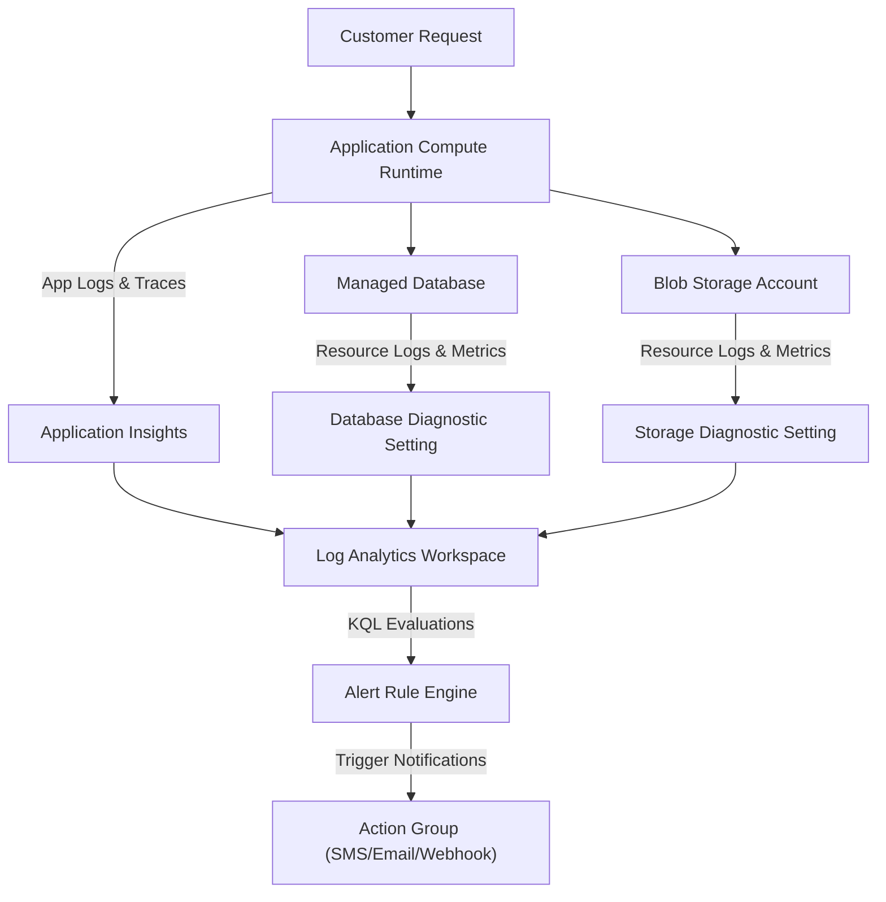

## Table of Contents

1. [What Is Observability](#what-is-observability)
2. [The Four Pillars of Telemetry](#the-four-pillars-of-telemetry)
3. [The Azure Monitor Ecosystem vs. AWS](#the-azure-monitor-ecosystem-vs-aws)
4. [Putting It All Together](#putting-it-all-together)
5. [What's Next](#whats-next)

## What Is Observability

Cloud observability is the operational capability to infer the internal states, performance characteristics, and execution behaviors of a running distributed system by analyzing the external telemetry data it emits. While traditional infrastructure monitoring focuses on raw resource availability—evaluating simple binary states such as whether a virtual machine is online, a database is running, or a port is responsive—observability addresses the health of active user-facing workflows. A container runtime or database can report positive health checks and normal CPU usage while still actively failing to execute critical workflows due to identity permission errors, network security rules, or downstream dependency timeouts.

If you are experienced with AWS, the Azure observability platform operates under a consolidated brand umbrella called Azure Monitor. While AWS partitions monitoring across distinct tools—CloudWatch Logs for logs, CloudWatch Metrics for time-series data, AWS X-Ray for tracing, and SNS for alert notifications—Azure Monitor integrates all telemetry channels into a single, shared platform infrastructure.

The core mapping between the two platforms is clear:

* **Log Analytics Workspaces** serve as the direct equivalent of Amazon CloudWatch Logs, providing centralized, queryable repositories for all resource and system logs.
* **Azure Monitor Metrics** corresponds to CloudWatch Metrics, storing high-velocity, lightweight numeric time-series data.
* **Application Insights** operates as the application performance monitoring (APM) and distributed tracing layer, serving the same role as AWS X-Ray combined with CloudWatch ServiceLens.
* **Alert Rules and Action Groups** map directly to CloudWatch Alarms and SNS notification paths, evaluating conditions and routing alerts.

:::expand[Under the Hood: The Azure Monitor Ingestion Pipeline and Storage Telemetry Fabric]{kind="design"}
Azure Monitor runs on a dedicated, globally distributed telemetry collection fabric isolated from the primary customer application control planes:

* **Host Blade Collection**: Within each Azure datacenter scale unit, physical host blades run lightweight hypervisor agents. These agents extract system-level telemetry, kernel execution logs, and physical network utilization metrics from guest environments without consuming guest CPU cycles.
* **Ingestion Gateways and Buffering**: Telemetry streams are pushed over high-speed physical storage networks to Regional Ingestion Gateways. These gateways act as high-throughput endpoints that validate incoming schemas, apply rate-limiting controls, and buffer incoming data using internal Event Hub structures to protect downstream indexers from traffic spikes.
* **Decoupled Storage Tiers**: Once validated, Azure Monitor splits the telemetry stream based on the data shape:
    * **Time-Series Engine**: Metrics are routed to an in-memory, highly compressed time-series database grid. This grid is optimized for high-speed write operations and sub-second query retrievals, powering real-time portal graphs and alert evaluation loops.
    * **Log Search Index**: Resource logs, audit events, and application traces are written to the Azure Data Explorer columnar storage engine (the core engine behind Log Analytics). This storage engine writes data in highly compressed columnar arrays, organizing them into timed shards and indexing them to allow rapid parallel Kusto query execution.
:::

Rather than viewing observability as a menu of separate Azure products, think of it as a single pipeline designed to answer operational questions. You decide what telemetry your applications and resources must emit, route it through Diagnostic Settings to a central workspace, and use queries and alerts to make the system's behavior fully transparent.



## The Four Pillars of Telemetry

To diagnose system failures, you must gather enough evidence to reconstruct the timeline of an incident. The Azure Monitor telemetry model organizes this evidence into four primary signals: logs, metrics, traces, and alerts. Each signal represents a different data structure optimized to answer a specific operational question.

### 1. Logs (What Happened in This Moment?)
A log is a discrete, timestamped text record describing an isolated event within the system. Unlike unstructured legacy logs that record arbitrary strings, modern cloud logging relies on structured logs formatted as queryable JSON documents. Structured logs include rich context fields—such as the service role, active operation, associated request ID, targeted dependency, and specific error codes—to ensure that engineers can search, filter, and aggregate logs across thousands of active processes.

A high-value structured log record contains specific, actionable fields:

```json
{
  "timestamp": "2026-05-16T10:24:18.102Z",
  "level": "ERROR",
  "service": "orders-api",
  "operation": "checkout",
  "requestId": "req_7a91_checkout",
  "dependency": "blob-storage",
  "target": "stordersprod.blob.core.windows.net",
  "message": "invoice pdf upload failed",
  "errorCode": "AuthorizationPermissionMismatch"
}
```

This log entry isolates the failure to a permission issue during a Blob Storage write, immediately pointing the operator toward Entra ID role assignments and storage network rules.

### 2. Metrics (How Often or How Much?)
A metric is a numeric value measured at regular intervals, stored as a time-series record. Metrics are lightweight, highly compressed, and fast to evaluate. They are designed to show high-level trends, overall performance, and resource utilization patterns over time.

For an API backend, a standard metrics set includes request counts, p95 response latencies, error percentages, host CPU utilization, and database lock times. While a log records the details of one failure, a metric tells you if that failure represents an isolated incident, a gradual capacity degradation, or a catastrophic service-wide outage.

### 3. Traces (Where Did the Request Go?)
A trace follows the execution path of a single transaction as it travels across different process and network boundaries in a distributed system. The trace is composed of a series of correlated spans, where each span represents a specific unit of work (e.g., an incoming HTTP call, a SQL query execution, or a remote object store write).

By injecting unique tracking identifiers into network headers, distributed tracing allows you to trace the exact timeline of a single transaction:

```text
Transaction: op_6f2a91 (POST /checkout) - Total Duration: 1840ms
|
+-- [Compute] API Authentication (Duration: 50ms, Success: True)
|
+-- [Dependency] Azure SQL: Insert Order Record (Duration: 160ms, Success: True)
|
+-- [Dependency] Blob Storage: Upload Invoice PDF (Duration: 1220ms, Success: False)
|   |
|   +-- Error: AuthorizationPermissionMismatch (HTTP 403)
|
+-- [Compute] Exception Thrown: ReceiptUploadError (Duration: 5ms)
```

Distributed tracing connects isolated logs and metrics into a unified timeline, revealing exactly which dependency caused a slow response or triggered an execution failure.

### 4. Alerts (Should Someone Look Now?)
An alert is a rule that continuously evaluates metrics or log query results against configured conditions to determine if human attention or automated self-healing is required. 

Alerting is not a separate form of telemetry; it is an active evaluation loop. A robust alerting rule defines a strict threshold (e.g., "checkout failure rate exceeds 5% over a 10-minute window") and links to an Action Group to route the alert to the appropriate channel (such as SMS, email, PagerDuty, or an automated webhook).

## The Azure Monitor Ecosystem vs. AWS

The following table maps common AWS observability concepts to their Azure Monitor equivalents:

| Operational Dimension | AWS Resource | Azure Monitor Resource | Architectural Role in Cloud Design |
| --- | --- | --- | --- |
| **Log Storage & Query** | CloudWatch Logs | Log Analytics Workspace | Centralized columnar repository that compresses, indexes, and queries structured operational logs. |
| **Log Query Language** | CloudWatch Insights | Kusto Query Language (KQL) | Piping query language used to filter, aggregate, and join database records. |
| **Time-Series Metrics** | CloudWatch Metrics | Azure Monitor Metrics | Lightweight, in-memory numeric database for tracking system utilization and rate trends. |
| **Performance Alerts** | CloudWatch Alarms | Azure Monitor Alert Rules | Stateless background evaluators that trigger when metrics or log counts cross configured thresholds. |
| **Alert Routing** | Simple Notification Service (SNS) | Action Groups | Unified routing layer that dispatches alert payloads to email, SMS, voice, or webhook automations. |
| **Distributed Tracing** | AWS X-Ray | Application Insights | Application Performance Monitoring (APM) engine that traces distributed request context across networks. |

Understanding this structural mapping ensures that your cloud teams can transfer their operational habits cleanly when managing infrastructure across multiple cloud platforms.

## Putting It All Together

Observability is the practice of designing your systems to emit clear evidence so that operators can understand and resolve production failures from the outside.

* **Decoupled Architecture**: Azure Monitor runs on a dedicated, regional telemetry collection fabric isolated from your primary compute workloads, leveraging fast time-series engines and columnar indexes.
* **Structured Logs**: Structure your logs as JSON documents with consistent context fields (`requestId`, `operation`, `errorCode`) to ensure they are highly searchable across processes.
* **Trend Analysis**: Monitor time-series metrics to track high-level throughput trends and resource utilization patterns over time.
* **Context Propagation**: Leverage distributed tracing and correlated spans to reconstruct the chronological timeline of a single user transaction.
* **Actionable Alerts**: Build alert rules based on systemic thresholds, and link them to Action Groups to route notifications to on-call engineers.

## What's Next

Now that we have established the core observability model, we will explore Logs and Workspaces. We will configure Azure Diagnostic Settings, provision a Log Analytics workspace, establish log retention rules, and learn to write Kusto Query Language (KQL) queries.

---

**References**

* [Azure Monitor overview](https://learn.microsoft.com/en-us/azure/azure-monitor/fundamentals/overview)
* [Azure Monitor Logs overview](https://learn.microsoft.com/en-us/azure/azure-monitor/logs/data-platform-logs)
* [Azure Monitor Metrics overview](https://learn.microsoft.com/en-us/azure/azure-monitor/metrics/data-platform-metrics)
* [Application Insights overview](https://learn.microsoft.com/en-us/azure/azure-monitor/app/app-insights-overview)
* [Azure Monitor alerts overview](https://learn.microsoft.com/en-us/azure/azure-monitor/alerts/alerts-overview)
