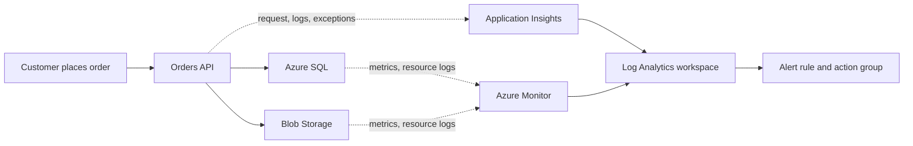

## Table of Contents

1. [The Problem](#the-problem)
2. [What Is Observability](#what-is-observability)
3. [Telemetry](#telemetry)
4. [Logs](#logs)
5. [Metrics](#metrics)
6. [Traces](#traces)
7. [Alerts](#alerts)
8. [Azure Map](#azure-map)
9. [Putting It All Together](#putting-it-all-together)
10. [What's Next](#whats-next)

## The Problem

A team deploys `devpolaris-orders-api` to Azure. The app is running. The database is online. The storage account exists. The public endpoint answers a health check.

Then checkout starts failing.

- The Azure resource list says the app is healthy, but customers see `500` errors.
- The database graph looks normal, but checkout latency jumps after a deployment.
- A receipt upload fails, but nobody can tell whether the app skipped the call, Blob Storage rejected it, or the identity lost permission.
- The on-call engineer learns about the issue from support instead of an alert.

This article is about the evidence you need when a running system does something surprising. Observability is not one Azure service. It is the ability to ask a question about a live system and find useful evidence: what happened, how often it happened, where one request spent time, and whether a human should look now.

Azure Monitor is the broad Azure observability service. Log Analytics workspaces hold searchable logs. Application Insights follows application requests. Azure Monitor Metrics stores numeric time series. Alert rules and action groups turn selected signals into attention. Those names make more sense after the evidence model is clear.

## What Is Observability

Observability is the practice of leaving enough evidence for future you to understand a running system from the outside. You cannot pause production, attach a debugger to every component, and replay a customer problem exactly. The system has to explain itself through telemetry.

That word, telemetry, just means data emitted by the system while it runs. A backend API emits request records, logs, dependency calls, exceptions, and custom measurements. Azure resources emit platform metrics and, when configured, resource logs. Alerting rules read that data and decide when it matters enough to notify someone.

The important beginner shift is this: a resource being "up" is not the same as a user workflow being healthy. Checkout is a workflow. It crosses an API, an identity, a database, storage, and sometimes a queue or payment provider. Observability connects those pieces so the team can reason about the workflow instead of staring at separate resources.



Read the dotted lines as evidence paths. They are not the business path for checkout. They are how the team learns what happened after the business path succeeds, slows down, or fails.

## Telemetry

Telemetry is useful only when it answers a question. New teams often collect too little evidence, then overcorrect and collect everything. Both paths hurt. Too little telemetry leaves you guessing. Too much noisy telemetry makes the useful signal expensive and hard to find.

Start with four questions:

| Question | Signal | Azure place to start |
| --- | --- | --- |
| What happened in this moment? | Logs | Log Analytics, Application Insights traces, resource logs |
| How often or how much is it happening? | Metrics | Azure Monitor Metrics, metrics explorer, Application Insights metrics |
| Where did one request go? | Traces | Application Insights transactions and application map |
| Should someone look now? | Alerts | Azure Monitor alert rules and action groups |

These signals overlap, but they are not interchangeable. A log can describe one failed upload in detail. A metric can show that upload failures jumped from 1 per hour to 200 per hour. A trace can show that the failed checkout request spent most of its time waiting on Blob Storage. An alert can tell the on-call person when that pattern crosses a threshold.

The mistake is treating the Azure product menu as the model. The model is the question. Once you know the question, the product names become routing signs.

## Logs

A log is a written event. It says something happened at a time. Good logs include enough context to connect the event to a request, operation, resource, identity, or dependency.

For checkout, a useful log includes more than:

```text
checkout failed
```

A useful log gives the next person a direction:

```text
2026-05-16T10:24:18Z ERROR service=devpolaris-orders-api
operation=checkout requestId=req_7a91 dependency=blob-storage
message="receipt upload failed"
storageAccount=stordersprod container=receipts
error=AuthorizationPermissionMismatch
```

Now the team knows the app reached the receipt upload step, the dependency was Blob Storage, and the first checks are identity, role assignment, network rules, and the blob operation. That is very different from guessing whether the database caused the `500`.

Azure has two broad log sources to keep separate in your head. Application logs are emitted by your code or app runtime. Resource logs are emitted by Azure resources about operations inside that resource. A strong investigation often needs both. The app tells you what it tried. The resource tells you what Azure saw.

## Metrics

A metric is a number collected over time. Metrics are for shape. They help you see whether a problem is one event, a rising pattern, or a system-wide incident.

For `devpolaris-orders-api`, these are metric-shaped questions:

| Metric question | Why it helps |
| --- | --- |
| How many checkout requests are arriving? | Separates real traffic drops from quiet periods. |
| What percentage of checkout requests fail? | Shows user-visible impact. |
| What is the p95 response time? | Shows whether most users are fast while a tail is slow. |
| How many dependency calls fail? | Points toward SQL, storage, HTTP APIs, or another downstream service. |
| Is CPU, memory, database pressure, or replica count changing? | Separates app logic problems from capacity and runtime pressure. |

Azure platform metrics are especially helpful because many Azure resources create them without extra configuration. That does not mean every metric is useful, and it does not mean every log is already collected. Metrics show the shape. You still need logs and traces to explain many causes.

The practical habit is pairing each metric with the next question. If failed requests rise, ask which route fails. If latency rises, ask which dependency is slow. If database pressure rises, ask whether traffic rose too. Metrics should point the investigation, not replace it.

## Traces

A trace follows one unit of work across steps. In a backend API, that unit is often one request. The trace connects the incoming request to dependency calls, exceptions, and log messages that happened while handling it.

This is the evidence you want when a user says, "I clicked Place order and it failed." The metric can tell you whether many users are affected. The logs can show detailed events. The trace connects the story:

```text
operation_Id: op_6f2a91
request: POST /checkout
duration: 1840 ms
result: 500

dependency: Azure SQL insert order
duration: 160 ms
success: true

dependency: Blob Storage upload receipt
duration: 1220 ms
success: false
result: AuthorizationPermissionMismatch

exception: ReceiptUploadError
message: receipt upload failed
```

Now the failure has a shape. SQL was not the failing step. Blob upload was. The exception belongs to the same operation. The next move is focused instead of theatrical.

Application Insights is Azure's application performance monitoring feature in Azure Monitor. It is the main Azure place beginners should associate with request traces, dependency calls, exceptions, application map views, and application-level performance.

## Alerts

An alert is a rule that turns telemetry into attention. It is not a separate kind of evidence. It is a decision that a signal matters enough to notify a person or trigger an action.

Azure Monitor alert rules watch a resource, a signal, and a condition. When the condition is met, the alert fires and can call an action group. The action group decides who gets notified or what automation runs.

A useful checkout alert might be:

| Alert part | Example |
| --- | --- |
| Resource | Application Insights component for `devpolaris-orders-api` |
| Signal | Failed `POST /checkout` requests |
| Condition | Failure rate above 5 percent for 10 minutes |
| Action group | `orders-api-oncall` |
| First check | Open Application Insights failures, then dependency failures for checkout |

The last row is an operational gift rather than an Azure requirement. An alert should help the receiver start. Alerts that fire without direction train people to ignore them.

## Azure Map

If you already know AWS monitoring, Azure's observability names are familiar but not identical. Use the comparison to orient yourself, not to assume the consoles behave the same way.

| AWS idea | Azure idea | Beginner translation |
| --- | --- | --- |
| CloudWatch Logs | Azure Monitor Logs and Log Analytics | Store and query operational logs. |
| CloudWatch metrics | Azure Monitor Metrics | Store numeric time series for resources and apps. |
| CloudWatch alarms | Azure Monitor alert rules | Fire when a signal meets a condition. |
| SNS notification path | Action group | Decide who or what receives an alert. |
| X-Ray or APM trace | Application Insights transaction | Follow one request through app code and dependencies. |

Azure Monitor is the umbrella. Log Analytics is a workspace and query experience for logs. Application Insights is the application performance monitoring part. Metrics, dashboards, and alerts are ways to see and act on the signals.

That map prevents two common mistakes. Do not expect every Azure resource log to be in Log Analytics just because the resource exists. Many resource logs need diagnostic settings. Also do not expect one screen to answer every question. Azure separates metrics, logs, traces, and alerting because they are different jobs.

## Putting It All Together

Return to the failing checkout app.

- The resource list said the app was running, but observability asked whether checkout was healthy.
- The `500` error became a log question: what happened, and which request or dependency was involved?
- The incident size became a metric question: one user, one route, or the whole service?
- The slow or failed request became a trace question: where did this operation spend time, and which dependency failed?
- The delayed response became an alerting question: which signal should have notified a human earlier?

The lesson is not "open Azure Monitor first." The lesson is to ask what evidence would answer the question, then use the Azure tool that holds that evidence.

## What's Next

The next article goes one layer deeper into logs. It explains Azure Monitor, diagnostic settings, Log Analytics workspaces, tables, Kusto Query Language, retention, cost, and access. That is where "we should have logs" becomes "we know which logs are collected and where to query them."

---

**References**

- [Azure Monitor overview](https://learn.microsoft.com/en-us/azure/azure-monitor/fundamentals/overview)
- [Azure Monitor Logs overview](https://learn.microsoft.com/en-us/azure/azure-monitor/logs/data-platform-logs)
- [Azure Monitor Metrics overview](https://learn.microsoft.com/en-us/azure/azure-monitor/metrics/data-platform-metrics)
- [Application Insights overview](https://learn.microsoft.com/en-us/azure/azure-monitor/app/app-insights-overview)
- [Azure Monitor alerts overview](https://learn.microsoft.com/en-us/azure/azure-monitor/alerts/alerts-overview)
