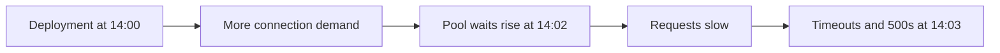
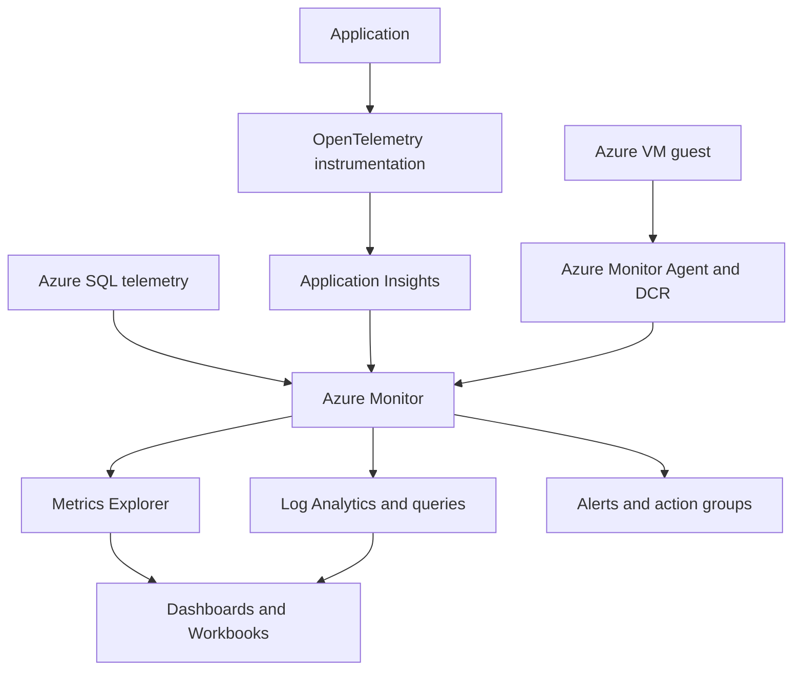
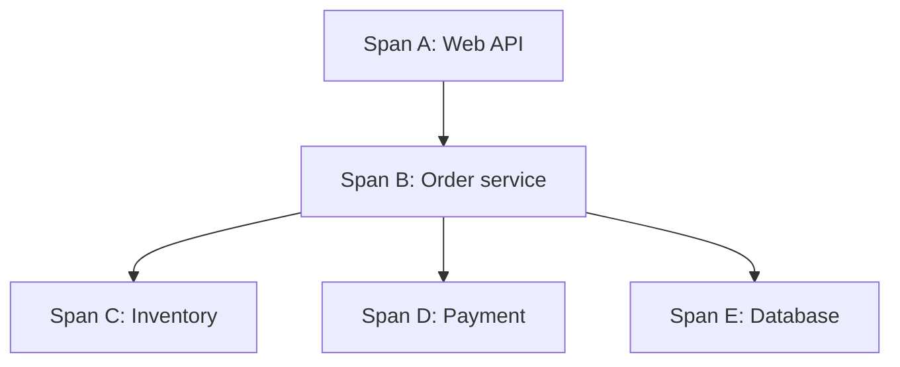

## Table of Contents

1. [Why Is Deployment Not Enough?](#why-is-deployment-not-enough)
2. [What Is Observability?](#what-is-observability)
3. [How Does Azure Monitor Collect Evidence?](#how-does-azure-monitor-collect-evidence)
4. [What Do Logs, Metrics, Traces, and Events Explain?](#what-do-logs-metrics-traces-and-events-explain)
5. [How Does Telemetry Reach Azure Monitor?](#how-does-telemetry-reach-azure-monitor)
6. [How Does Correlation Follow One Request?](#how-does-correlation-follow-one-request)
7. [How Do Dashboards and Alerts Support Response?](#how-do-dashboards-and-alerts-support-response)
8. [How Do You Build and Maintain a Practical Setup?](#how-do-you-build-and-maintain-a-practical-setup)
9. [Check Your Answers](#check-your-answers)
10. [References](#references)

On your laptop, you can pause an application at a breakpoint, inspect a variable, and follow a database call. After deployment, thousands of requests may be moving through several services at once. A problem might affect one customer, one region, or one request in 50,000.

You need evidence that survives the request and connects the parts of its journey. Metrics show changes across the service, logs describe particular events, and traces show where a request spent its time. Observability is the ability to use that evidence to understand behavior you cannot inspect directly.

The following questions build that understanding before introducing the collection, query, and response tools:

1. **Why Is Deployment Not Enough?**
2. **What Is Observability?**
3. **How Does Azure Monitor Collect Evidence?**
4. **What Do Logs, Metrics, Traces, and Events Explain?**
5. **How Does Telemetry Reach Azure Monitor?**
6. **How Does Correlation Follow One Request?**
7. **How Do Dashboards and Alerts Support Response?**
8. **How Do You Build and Maintain a Practical Setup?**

## Why Is Deployment Not Enough?
<!-- section-summary: Production introduces concurrent requests, remote dependencies, and intermittent failures that require recorded evidence rather than direct inspection. -->

Local development gives you access to an application's internal state. You can step through code, inspect variables, threads, and memory, examine the database, restart the process, and watch console output. When an exception occurs, the failing operation may be directly in front of you.

Production changes that relationship. A user request may enter through a load balancer, reach an application instance, and then call a cache, database, and API service. Many requests take those paths concurrently. Attaching a debugger to every request is neither the practical means of inspection nor a record of what happened earlier.

Problems also depend on conditions that are difficult to reproduce locally. They may occur only under load, for one customer, in one region, when a dependency slows down, after a particular deployment, or once every 50,000 requests. Several services can appear healthy separately while interacting badly.

Without useful outputs, the running system is effectively a black box to its operators. Deployment has placed the code where it can execute, but it has not automatically provided a way to understand every execution.

Imagine that inside a service CPU has reached 87%, a queue contains 14,000 items, the database connection pool is exhausted, the payment API is slow, retries are multiplying, and user requests are waiting. An operator cannot necessarily see all those conditions directly.

The system may instead emit three pieces of evidence: request latency is 4.2 seconds, a log says SQL connection acquisition timed out, and a trace shows 3.8 seconds spent in the checkout-to-orders-to-SQL path. Those outputs make it possible to investigate the hidden conditions.

The requirement for production is therefore broader than “the application is running.” It must also produce enough information to explain whether it is doing the right work, where time is spent, and what failed.

## What Is Observability?
<!-- section-summary: Observability uses emitted evidence to infer internal behavior and investigate unexpected questions, complementing predefined monitoring. -->

**Observability** is the ability to infer a system's internal state and behavior from the evidence it produces. A dashboard, logging library, or monitoring product can contribute to that ability. Their presence alone does not prove that the evidence answers useful questions.

The practical test appears during an unexpected problem. Can the team identify what happened, when and where it happened, why it happened, and whom it affected? Millions of repetitive log messages may contribute less than a smaller set of meaningful, correlated records.

This is an inference process. Suppose a deployment was recorded at 14:00. At 14:02, database latency and connection-pool waiting increased. At 14:03, the HTTP 500 rate rose.

The sequence supports a hypothesis: the new application version increased database connections, exhausted the pool, caused waiting and slow requests, and eventually produced timeouts and HTTP failures. The evidence suggests a causal path to investigate; timing alone does not prove the explanation.

A **connection pool** is a managed set of database connections that application operations can use. Rather than treating every database call as independent of all other calls, the runtime has to supply a connection from the available set. If all usable connections are occupied, another operation may wait. That waiting can increase the time seen by the user even before the database begins the intended query.

This explains why the evidence in this example is complementary. A slow request does not tell you whether the delay came from obtaining a connection or executing SQL. A pool-wait measurement and a connection-acquisition timeout make the first possibility more specific. The deployed version supplies a place to examine what changed, such as how much work the application allows to run concurrently.

Retries also belong in this investigation because a failed attempt can produce additional attempts while the original resource is already constrained. The earlier example includes both a full pool and a retry storm for this reason. The investigator needs to establish which condition preceded the others, rather than reading each symptom as a separate incident.


```mermaid
flowchart LR
    release["Deployment at 14:00"] --> pool["More connection demand"]
    pool --> wait["Pool waits rise at 14:02"]
    wait --> latency["Requests slow"]
    latency --> error["Timeouts and 500s at 14:03"]
```

A useful observability system lets the operator test that hypothesis with the relevant metrics, logs, and request traces. A poor one may only reveal that the service stopped behaving normally.

### Distinguish known checks from unexpected investigation

**Monitoring** commonly answers predefined questions: is CPU above 90%, is the website reachable, are HTTP 500s increasing, or is disk space low? A known question becomes a measurement, a threshold or condition, and an alert.

Observability also supports questions that were not specified in advance. For example, why are checkout requests slow only for customers in one region who use a particular payment provider? The team may never have created that exact dashboard.

To investigate, operators need enough context to filter by region and version, inspect traces and dependency calls, and correlate errors. A useful shorthand is that monitoring detects a problem while observability helps explain it. The terms overlap; the shorthand describes their emphasis rather than an absolute product boundary.

### Narrow the investigation

A system with 500 components creates a large initial search space. Evidence can reduce it progressively: checkout errors occur only in UK South, only on version 4.18, and only on requests using the Orders database. Those requests contain connection-pool timeouts, and the associated configuration change increased concurrency.

Each observation removes possible explanations. The value is a faster, better-supported path from a user-visible symptom to the component and change that explain it.

That path affects incident duration. Suppose a failure begins at 14:00, is noticed at 14:45, its cause is identified at 16:30, and repair finishes at 17:00. Health signals and alerts address the first delay. Logs, traces, correlation, dashboards, and historical change records address diagnosis and repair after detection.

Mean time to detect and mean time to repair describe these operating delays across incidents. Better evidence can reduce both by revealing the problem earlier and making the subsequent investigation more focused.

## How Does Azure Monitor Collect Evidence?
<!-- section-summary: Azure Monitor supports collection, analysis, visualization, and action, while the evidence itself originates in infrastructure, operating systems, applications, and business operations. -->

**Telemetry** is information emitted by a running system. Metrics, logs, and traces are its main forms; events are sometimes discussed separately. Azure Monitor brings these forms together across cloud and hybrid environments so they can be queried, visualized, and used to trigger action.

It is useful to think of Azure Monitor as a platform for handling evidence. Applications, VMs, SQL services, and Kubernetes workloads produce the evidence. Collection mechanisms transport it into the platform, and query and visualization tools make it accessible.

The source determines what can be known:

| Source layer | Examples of evidence |
| --- | --- |
| Azure platform | VM CPU, storage operations, and service-level metrics |
| Operating system | Processes, memory, and operating-system logs |
| Application | Requests, exceptions, dependency calls, and trace spans |
| Business operation | Successful orders, payments, and checkout failures |

No one layer explains the entire service. CPU at 36% and memory at 52% can coexist with completely broken checkout if the application cannot use a dependency.

Application Insights supplies Azure Monitor's application-performance-monitoring capability. For supported application stacks, OpenTelemetry-based instrumentation collects information about requests, exceptions, dependencies, timings, and distributed operations. Infrastructure measurements complement that application view rather than replacing it.

### Start with the service users need

For an online shop, the initial question is whether users can place orders. How many try, how many succeed, how long does it take, and why do attempts fail?

The investigation can then move downward from failed orders to API errors, dependency errors, the database, networking, and CPU. Starting with 200 infrastructure graphs risks spending time on resources that are healthy while the actual business operation remains unusable.

This gives four connected levels: the business operation, the application that implements it, its runtime or operating system, and the infrastructure beneath it. Each contributes a different kind of explanation.

The collection design should therefore begin by identifying the layers that matter to the workload. Azure Monitor cannot infer a successful payment or a failed order if the application never emits evidence that distinguishes those outcomes.

## What Do Logs, Metrics, Traces, and Events Explain?
<!-- section-summary: Metrics summarize overall behavior, logs describe individual events, and traces connect timed operations; the four golden signals identify what service properties to observe. -->

Telemetry type and service property are two different choices. Metrics, logs, and traces describe forms of evidence. Latency, traffic, errors, and saturation describe the behavior you want that evidence to reveal.

### Metrics summarize behavior over time

A metric is a numerical measurement recorded over time. CPU readings might progress through 78%, 82%, 89%, 91%, and 93%. Request rates might rise from 245 to 251, 267, 281, and 302 per second. These series reveal rates, trends, magnitudes, changes, and threshold crossings.

A service view might contain CPU at 87%, memory at 72%, 4,210 requests per second, a 3.7% HTTP error rate, p95 latency of 640 ms, and queue depth of 12,450. The numbers show different aspects of the same operating state.

Metrics are compact. Rather than retain every detail of 100,000 requests in the metric store, a summary can record 100,000 requests, 1,210 errors, and p95 latency of 480 ms. That form is particularly useful for dashboards and alerts.

Azure Monitor analyzes time-series metrics. Application Insights supports standard or preaggregated metrics, log-based metrics, and custom metrics. Preaggregation prepares numerical summaries for responsive dashboards and near-real-time alerting instead of rebuilding every value from individual events at query time.

A metric does not necessarily establish the cause. CPU rising sharply at 14:03 could reflect legitimate demand, an infinite loop, garbage collection, encryption work, faulty database retries, malicious traffic, or a large batch job. Richer evidence distinguishes those possibilities.

### Logs describe a particular event

A log records something that happened. “Error occurred” supplies almost no context. A useful record might preserve the operation, affected resource, timing, error, and correlation information:

```text
timestamp=14:03:18
level=Error
operation=CreateOrder
orderId=84271
customerId=2918
exception=SqlTimeout
database=orders-prod
durationMs=30124
traceId=91af...
```

That example answers when the event occurred, which operation failed, which database was involved, how long it took, and which trace can provide the surrounding request. Identifiers in teaching records illustrate correlation; production collection should still apply the minimization and access controls discussed later.

**Structured logs** make those attributes separately searchable. A prose message saying that User 8127 failed checkout with payment provider A can be represented as fields:

```text
event=checkout_failed
user_id=8127
payment_provider=A
reason=timeout
region=uksouth
```

The fields let a query count checkout failures by payment provider and region over the previous 30 minutes. The system can filter, group, and correlate the values without first extracting them from arbitrary sentences.

The field names are part of that usability. An operation field explains which work was attempted; a dependency field identifies the next service involved; an exception field describes the technical outcome. A timestamp allows comparison with the incident timeline, while a trace identifier joins the event to surrounding work. These fields answer different questions, so one long error message cannot automatically replace all of them.

The goal is a record with a clear purpose. Keeping a request identifier helps investigate a particular request, while grouping by region helps identify a broader pattern. Designing the record around those questions makes the evidence easier to use than adding arbitrary details and hoping an incident will reveal what they mean.

### Traces show the request's operations

A distributed trace follows a request through connected operations. A browser may call a frontend API, which calls an Order service that uses Inventory, Payment, and SQL. The user sees one overall duration, but the trace shows the timed work behind it.

For example:

| Operation | Duration |
| --- | ---: |
| POST /checkout | 4.80 seconds |
| Validate cart | 0.04 seconds |
| Inventory request | 0.12 seconds |
| Payment request | 0.26 seconds |
| Create order | 4.31 seconds |
| SQL INSERT within Create order | 4.27 seconds |

The nested database operation accounts for most of the slow request. The trace provides a much more specific starting point than “checkout took 4.8 seconds.”

A **span** represents one operation within the trace. It can record start time, duration, service name, operation, success or failure, attributes, and its parent span. The trace is the complete journey; spans describe its individual steps and relationships.

Metrics, logs, and traces then complement one another. A metric shows that the error rate increased. Logs identify SQL timeouts. Traces show the failing Orders-to-SQL dependency and the operation preceding it. Each contributes a different part of the explanation.

### Observe latency, traffic, errors, and saturation

The **four golden signals** organize the properties worth measuring.

**Latency** is how long work takes. A product lookup might take 42 ms while checkout takes 680 ms. An average can hide very different experiences: nine requests at 100 ms and one at 5,000 ms average 590 ms. Most users were fast, while one experienced a long delay.

Percentiles expose more of that distribution. The p50 describes the middle of the observations; p95 and p99 describe points below which approximately 95% and 99% of measured durations fall. They help inspect tail latency instead of relying only on an average.

**Traffic** measures how much work arrives: HTTP requests, transactions, messages, orders, bytes, or database queries per time interval. Rising latency could mean a slower application, but it could also mean traffic doubled and exhausted available capacity. Volume gives the delay context.

**Errors** measure unsuccessful work, including HTTP 5xx responses, failed SQL queries, exceptions, message-processing failures, technical payment failures, and dependency timeouts. A rate often conveys more than a count:

$$
100 / 1{,}000 = 10\%
$$

$$
100 / 10{,}000{,}000 = 0.001\%
$$

The same 100 errors describe very different failure proportions.

The denominator is the amount of relevant work attempted. This is why traffic and errors should be inspected together: the count says how many operations failed, while the rate describes the share of work affected. A change in error count during a large traffic increase needs a different interpretation from the same change while traffic remains stable.

Latency supplies another part of that experience. A request can succeed eventually and still take much longer than users can comfortably wait. Conversely, a quick failed request contributes little to average duration while failing the business operation. The four signals keep these differences visible instead of allowing one attractive number to stand in for overall health.

**Saturation** measures proximity to a limit. CPU at 98%, nearly exhausted memory, a full thread or database connection pool, deep disk queues, growing message backlogs, or maximum concurrency can indicate that little capacity remains.

Saturation may precede user-visible errors. Requests initially wait for resources, latency rises, timeouts begin, and the error rate increases. Looking at the four signals together can reveal that sequence: more traffic produces saturation, saturation produces delay, and delay eventually produces failed work.

## How Does Telemetry Reach Azure Monitor?
<!-- section-summary: Useful telemetry needs a working source-to-query path using platform collection, diagnostic settings, agents and DCRs, or application instrumentation as appropriate. -->

Telemetry travels through a chain: source, instrumentation or collector, transport, Azure Monitor, a storage and query engine, and finally a dashboard, query, or alert.

A failure at any stage reduces usefulness. If the application emits no meaningful record, nothing downstream can reconstruct it. If collection is misconfigured, emitted evidence may never arrive. If data arrives in a form that cannot be queried effectively, it remains difficult to use during an incident.

This is why enabling a product is only part of observability. The complete path must preserve the evidence needed to answer the service's questions.

### Platform metrics, activity, and resource logs

For many Azure resources, platform metrics such as CPU, request count, storage operations, latency, and capacity are collected automatically. They describe measurements the service already knows about its own operation.

The **Activity Log** records subscription-level control-plane activity. Control-plane operations concern management of resources, so those records provide context about changes to the Azure environment.

**Resource logs** follow a different collection path and generally need configuration. **Diagnostic settings** specify which resource logs and supported metrics should be sent to destinations such as Log Analytics, Storage, or Event Hubs. Having a resource in Azure does not automatically mean all of its detailed logs have been routed to the place where the team investigates them.

### Guest operating-system evidence

Azure can observe a VM's existence, stopped state, and host-side measurements from outside the guest. Windows event logs, Linux syslog, process behavior, guest performance counters, and application log files exist inside the operating system.

Collecting that data requires an agent or application instrumentation. The **Azure Monitor Agent**, or AMA, runs on machines and uses **Data Collection Rules**, or DCRs, to describe what data to collect, how it should be processed, and where it should be sent.

A DCR provides collection policy rather than business context automatically. The team still chooses the relevant sources and destinations for the investigation it needs to support.

### Application requests and dependencies

Application instrumentation produces information that infrastructure collection cannot infer: HTTP operations, exceptions, dependency calls, database timings, spans, and custom business events. OpenTelemetry standardizes instrumentation, collection, and propagation across languages and vendors, while Application Insights integrates with that telemetry for application monitoring.

A compact Azure arrangement can combine these sources:


```mermaid
flowchart TD
    app["Application"] --> otel["OpenTelemetry instrumentation"]
    otel --> insights["Application Insights"]
    vm["Azure VM guest"] --> agent["Azure Monitor Agent and DCR"]
    sql["Azure SQL telemetry"] --> monitor["Azure Monitor"]
    insights --> monitor
    agent --> monitor
    monitor --> metrics["Metrics Explorer"]
    monitor --> logs["Log Analytics and queries"]
    monitor --> alerts["Alerts and action groups"]
    metrics --> views["Dashboards and Workbooks"]
    logs --> views
```

The diagram groups related capabilities to show the collection and investigation responsibilities; the exact resource layout depends on the workload. The important distinction is between producing evidence, transporting it, storing it, and interpreting it.

## How Does Correlation Follow One Request?
<!-- section-summary: Shared trace context and parent-child span relationships connect events across services so metrics, logs, and traces can support one explanation. -->

At thousands of requests per second, matching log messages by their wording is unreliable. The frontend may record “checkout received,” the Order service “creating order,” Payment “payment authorised,” and a database call “query timeout.” Those lines may belong to many different requests.

**Correlation** supplies a shared identifier. If the relevant records all include `trace_id=abc123`, they can be found as parts of the same request rather than four isolated messages.

A trace also needs relationships within that request. Consider Trace `7F92`: Span A represents the Web API operation and has no parent. Span B represents the Order service call and has A as its parent. Inventory Span C, Payment Span D, and Database Span E each have B as their parent.


```mermaid
flowchart TD
    a["Span A: Web API"] --> b["Span B: Order service"]
    b --> c["Span C: Inventory"]
    b --> d["Span D: Payment"]
    b --> e["Span E: Database"]
```

The shared trace identifies the journey; the parent-child links establish the call tree. OpenTelemetry standardizes propagation and collection of this context so supported services and libraries can preserve the relationships across boundaries.

### Follow the change in one checkout

A normal order request includes validation, stock reservation, payment, a SQL write, and an API response. Trace `7F92` might show:

| Operation | Normal request | Slow request |
| --- | ---: | ---: |
| POST /checkout | 835 ms | 5.32 seconds |
| Validate | 12 ms | 12 ms |
| Inventory | 105 ms | 103 ms |
| Payment | 190 ms | 181 ms |
| SQL | 501 ms | 5.01 seconds |

The comparison localizes the delay to SQL rather than inventory or payment. The parent request duration includes the overall operation, so its timing need not equal a simple sum of the displayed children.

Now inspect the corresponding database or connection-pool metrics. If connection usage is saturated, the team has a stronger hypothesis: SQL operations waited for a connection, increasing checkout latency and eventually causing HTTP timeouts.

A related log can provide the specific failure:

```text
SqlConnectionPoolTimeout
waiting=30000ms
poolSize=100
```

The metric describes capacity pressure, the trace identifies the expensive dependency, and the log describes connection acquisition timing out. Together they support an explanation that none of the signals supplies alone.

### Preserve timing and meaningful transitions

Correlation also depends on sensible time information. If Service A records sending a request at 14:03:02 while Service B records receiving it at 14:02:49, ordering events becomes confusing. Reasonably synchronized clocks and propagated trace context help establish which operations belong together and when they occurred.

Logs should capture meaningful state changes rather than every executed line. For an order, those changes might be `order_received`, `inventory_reserved`, `payment_authorized`, `order_persisted`, and `checkout_completed`.

If payment is authorized and order persistence then fails, those transitions explain what completed before the interruption. A sequence of “entered method,” “line 42,” and “returned from method” is less useful for understanding the business state.

Record both the technical failure and its operational consequence where appropriate. `ConnectionTimeoutException` describes the database-level problem. An event such as `checkout_failed` with `reason=orders_database_unavailable` explains which user operation failed. Engineering needs the component detail; the business needs to know how many customers could not buy.

## How Do Dashboards and Alerts Support Response?
<!-- section-summary: Dashboards provide a quick service view, while actionable alerts route attention to user-impacting conditions instead of every unusual resource value. -->

A dashboard compresses selected evidence into a quick operating view. For a checkout API, it might show traffic at 3.2 thousand requests per second, p95 latency at 420 ms, an error rate of 0.12%, database saturation at 78%, and a marker for version 4.18 deployed at 13:45.

The purpose is to help the operator decide whether to investigate. It does not need every possible diagnostic detail on the first screen. Azure Monitor provides Metrics Explorer, Log Analytics, Workbooks, dashboards, and Grafana integrations to support different parts of exploration and presentation.

Alerts automate conditions that people should not have to watch continuously. For example, a rule could notify the on-call team when the HTTP error rate remains above 2% for five minutes.

Azure Monitor can evaluate metric or log conditions. **Action groups** define notification or automated response destinations, such as email, SMS, webhooks, Azure Functions, or Logic Apps workflows. The alert decides when the condition is met; routing determines who or what receives it.

### Connect alerts to user impact

CPU above 80% describes a resource condition. Checkout success below 99.5% describes a failure of the service people are trying to use.

High CPU can accompany a healthy workload doing useful work. Low CPU can accompany complete checkout failure if the database is unreachable. User-visible symptoms and service objectives therefore make a strong starting point for alerting, with resource signals supplying diagnostic context.

Alerting on every unusual value can produce fatigue. Rules for CPU above 70%, memory above 60%, disk above 50%, one exception, one timeout, and one failed dependency can generate hundreds of notifications. If most require no action, responders learn to discount them.

An alert should generally imply that someone or an automated process needs to act. Information that is useful for investigation but requires no immediate intervention can remain on a dashboard or in a query.

### Keep changes beside operating signals

A latency graph may show a sharp rise without explaining it. Adding the time when version 4.18 was deployed supplies a concrete hypothesis to test. Deployment markers connect a behavior change with an application change.

Configuration edits, feature-flag changes, infrastructure changes, and database migrations deserve the same treatment. The goal is not to assume every incident came from the latest deployment, but to preserve the relevant timeline so the hypothesis can be examined.

An effective view combines current health, changes, and links to more detailed evidence. It helps the responder move from a symptom to the relevant request, dependency, or configuration rather than browse unrelated graphs.

## How Do You Build and Maintain a Practical Setup?
<!-- section-summary: Design evidence before deployment, test the complete path, and manage dimensions, sampling, cost, and sensitive data according to the questions the service must answer. -->

Observability belongs in service design. Identify important operations, telemetry, trace context, health indicators, and alerts before deployment. Waiting until production fails to add logging loses the evidence from the incident that revealed the need.

A minimal useful setup should still form a complete loop from user behavior to response.

### Begin with one service and its success condition

For a Checkout API, define success as the user being able to complete checkout. Measure the four signals: checkout requests per second, p50/p95/p99 duration, failed checkouts divided by total attempts, and saturation in connection pools, CPU, queues, and dependencies.

Instrument the request's calls to inventory, payment, and the database. Preserve shared trace context so a responder can follow one operation across those dependencies.

Capture useful exceptions with enough context to connect them to the service:

```text
operation=checkout
dependency=orders-db
exception=SqlTimeout
duration=30000
trace_id=7F92
deployment=v4.18
```

This records the operation, dependency, failure, time spent, request context, and deployed version. Each field has a role in narrowing an investigation.

Collect relevant infrastructure evidence alongside it: CPU, memory where available, database utilization, storage latency, queue length, service-specific errors, and network or resource logs. Use diagnostic settings for applicable resources and AMA/DCR collection when guest operating-system evidence is required.

Build one useful dashboard around traffic, latency, errors, and saturation. Add dependency latency, deployed version, and top exceptions when they help explain the service. The initial view should let the team assess health within seconds rather than require navigating 100 charts.

Choose a small set of actionable alerts: unacceptable error rate or p95 latency, service unavailability, a queue that grows without recovering, or failure of a critical dependency. Give each alert an owner, severity, meaning, and next action, ideally with a runbook leading into investigation.

### Test the complete evidence path

Use a safe, controlled test failure, such as a test request that produces an intended exception. Check whether the metric changes, the exception appears, the trace can be found, and the dependency remains correlated.

Then verify the response path. Did the expected alert fire? Can its recipient understand what happened and what to inspect? A successful telemetry ingestion test does not by itself establish that the alert and investigation path work.

This exercise exposes gaps before they matter during an unexpected incident. An observability design remains incomplete if it produces data that the intended responder cannot locate or interpret.

Testing should follow the same sequence a responder would use. Start from the changed service measurement, locate the relevant exception, and then follow its trace to the dependency involved. This verifies more than whether three isolated data records exist. It verifies that the relationship between them survived collection and that the available fields support the investigation.

The final check is comprehension. An alert may arrive correctly while saying too little about the service or its impact. The test request provides a known event against which to compare the evidence: the team knows what it caused and can see whether the resulting measurements and records explain it. Fixing a missing field, broken correlation, or unclear response instruction at this stage improves the handling of future events whose causes are unknown.

### Choose dimensions without unlimited growth

A 4% error rate identifies a broad condition. Dimensions can reveal that errors occur only in West Europe, only on version 4.18, or only with payment provider B. Region, version, endpoint, and dependency turn a global number into useful subsets.

Dimensions also multiply the amount of data. Using `user_id` on every metric in a service with ten million users can create ten million label values. High cardinality makes telemetry more expensive, slower, and harder to aggregate.

Use bounded, aggregatable dimensions for metrics. Keep richer request-level identifiers and context in logs and traces when that is the appropriate form of evidence. This preserves investigation capability without assuming every identifier should create its own numerical series.

### Make sampling an explicit evidence decision

At 100,000 requests per second, with 20 telemetry records per request, the system produces:

$$
100{,}000 \times 20 = 2{,}000{,}000
$$

telemetry items every second. Retaining every successful request may add more cost than information.

**Sampling** keeps a selected portion of telemetry. A policy might aim to retain representative successful requests, important errors, and critical traces. The collection path must actually support and implement the intended selection; it should not be assumed that every sampling setting preserves all errors.

The tradeoff is the evidence left available afterward. Microsoft notes that sampling can affect log-based metric accuracy because fewer underlying events remain. A team needs to understand which queries and conclusions depend on sampled records.

### Pay for useful information

More telemetry is not automatically better. Fifty log events per request across one billion monthly requests can create substantial ingestion and retention costs.

For each class of record, ask what it helps diagnose, whether it duplicates another event, whether it needs 30 days of retention, and whether aggregation or sampling would preserve the required information at lower cost. DCRs can filter or transform incoming data before it reaches destinations, supporting collection-volume control and a more useful data shape.

Cost should be evaluated with information value. Deleting necessary failure context to reduce volume undermines the reason for collecting telemetry; retaining repetitive detail nobody uses can be equally wasteful.

### Protect the evidence itself

Logs can accidentally contain passwords, access tokens, credit-card data, personal information, or connection strings. A debugging system needs data minimization, redaction, access control, retention limits, and privacy-aware design.

Record what is necessary to explain operations, and avoid turning telemetry into an uncontrolled copy of application data or secrets. Rich context is useful only when it can be collected and accessed appropriately.

### Use a consistent troubleshooting sequence

When someone reports that the site is slow, first confirm elevated latency in metrics. Use dimensions to identify the affected endpoint or service. Inspect traces to find the operation consuming time, then logs and exceptions to understand what happened inside it.

Next, inspect the relevant infrastructure metrics and logs for constrained resources. Finally, compare the timing with deployments and configuration events. This progression uses increasingly specific evidence instead of beginning with random log searches.

The practical measure is the questions the team can answer. Ten terabytes of logs can still leave important questions unresolved: is the service working and fast enough, who is affected, when did the problem start, what changed, which component or dependency is responsible, and is the situation improving?

The team should also be able to reconstruct the request path and assess impact. These answers are more useful evidence of observability than total ingestion volume.

### Close the engineering loop

Deployment leads to running software, observation, understanding, improvement, and another deployment. Operational evidence feeds back into software and configuration changes rather than remaining only in an incident dashboard.

The seven underlying ideas remain connected: production needs emitted evidence; that evidence supports inference; metrics, logs, and traces provide different views; the golden signals organize health; correlation joins distributed work; Azure Monitor provides the collection and analysis capabilities around its sources; and the objective is faster understanding.

A successful setup provides enough trustworthy, correlated evidence to explain unexpected behavior and choose an informed action without directly inspecting every internal operation.

## Check Your Answers

:::expand[Why Is Deployment Not Enough?]{kind="recap"}
Production requests run remotely and concurrently across dependencies. Failures can depend on load, region, customer, version, or rare interactions. The service must emit evidence that remains available for investigation.
:::

:::expand[What Is Observability?]{kind="recap"}
It is the ability to infer internal behavior from emitted evidence. It complements predefined monitoring by supporting unexpected questions, narrowing the investigation, and reducing delays in detection and diagnosis.
:::

:::expand[How Does Azure Monitor Collect Evidence?]{kind="recap"}
Azure Monitor handles telemetry from platform, operating-system, application, and business layers. The sources still need to produce the evidence. Application health and successful user operations cannot be inferred from infrastructure health alone.
:::

:::expand[What Do Logs, Metrics, Traces, and Events Explain?]{kind="recap"}
Metrics summarize overall behavior, logs describe particular events, and traces connect timed operations. Latency, traffic, errors, and saturation identify the service properties those forms of evidence should reveal.
:::

:::expand[How Does Telemetry Reach Azure Monitor?]{kind="recap"}
It passes from source through collection and transport into storage, queries, views, and alerts. Platform collection, diagnostic settings, AMA with DCRs, and application instrumentation cover different sources.
:::

:::expand[How Does Correlation Follow One Request?]{kind="recap"}
Shared trace identifiers connect records, and parent-child span relationships establish the request tree. Timing, meaningful state transitions, and related infrastructure evidence then help explain where and why work failed.
:::

:::expand[How Do Dashboards and Alerts Support Response?]{kind="recap"}
Dashboards provide a quick health view and access to investigation. Alerts route actionable conditions to people or automation. User symptoms, meaningful ownership, and change markers make the response more focused.
:::

:::expand[How Do You Build and Maintain a Practical Setup?]{kind="recap"}
Define service success, instrument requests and dependencies, collect relevant infrastructure data, create focused views and alerts, and test them end to end. Review dimensions, sampling, privacy, retention, and incident lessons so the evidence remains useful.
:::

## References

- [Azure Monitor overview](https://learn.microsoft.com/en-us/azure/azure-monitor/fundamentals/overview)
- [Application Insights metrics](https://learn.microsoft.com/en-us/azure/azure-monitor/app/metrics-overview)
- [OpenTelemetry with Application Insights](https://learn.microsoft.com/en-us/azure/azure-monitor/app/opentelemetry-enable)
- [Diagnostic settings](https://learn.microsoft.com/en-us/azure/azure-monitor/platform/diagnostic-settings)
- [Data Collection Rules](https://learn.microsoft.com/en-us/azure/azure-monitor/data-collection/data-collection-rule-overview)
- [Application Insights overview](https://learn.microsoft.com/en-us/azure/azure-monitor/app/app-insights-overview)
- [Monitoring Azure resources](https://learn.microsoft.com/en-us/azure/azure-monitor/essentials/monitor-azure-resource)
