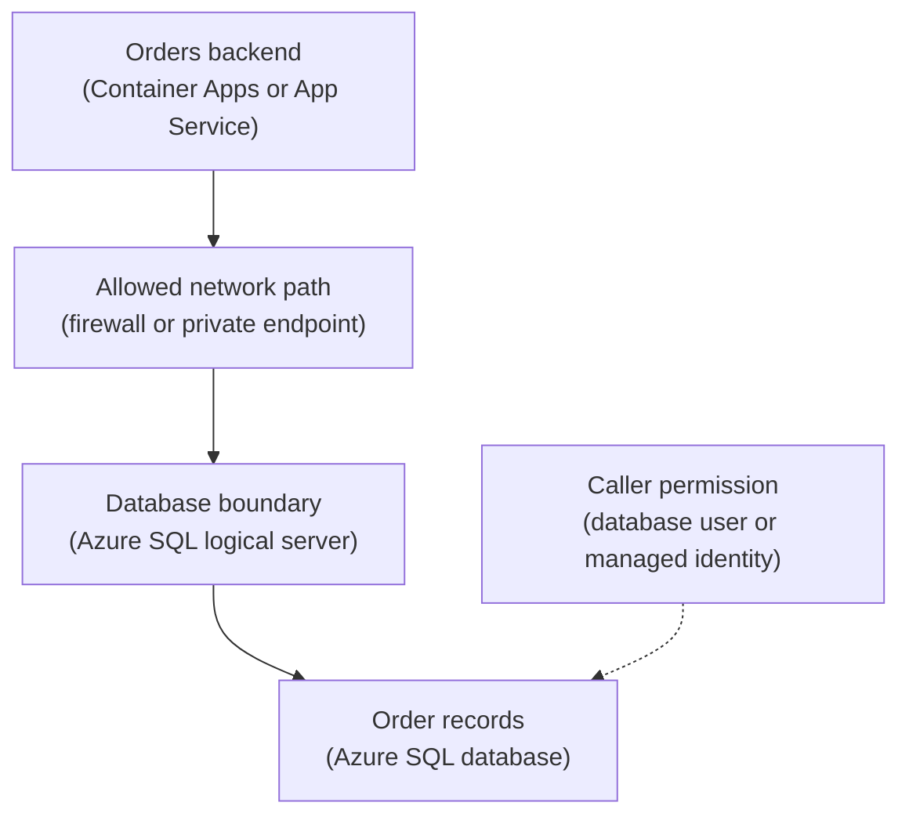

## Table of Contents

1. [Business Records Need More Than A File](#business-records-need-more-than-a-file)
2. [If You Know RDS](#if-you-know-rds)
3. [The Database Fits The Order Shape](#the-database-fits-the-order-shape)
4. [The Logical Server Is Not Your Application Server](#the-logical-server-is-not-your-application-server)
5. [Connections Need Network And Identity To Agree](#connections-need-network-and-identity-to-agree)
6. [Transactions Protect Checkout From Half-Writes](#transactions-protect-checkout-from-half-writes)
7. [Schema Changes Are Part Of Deployment](#schema-changes-are-part-of-deployment)
8. [Backups Matter Only If Restore Is Usable](#backups-matter-only-if-restore-is-usable)
9. [Failure Modes And First Checks](#failure-modes-and-first-checks)
10. [A Practical Azure SQL Review](#a-practical-azure-sql-review)

## Business Records Need More Than A File

Some application data needs rules. An order should
belong to one customer. An order should have line
items. A payment attempt should point to the order it
tried to pay for. A receipt row should point to a
receipt file that the right customer can access. Those
facts are not just bytes. They are business records.
Azure SQL Database exists for this kind of data. It is
a managed relational database service. Relational means
the data lives in tables and the tables can refer to
each other. Managed means Azure runs the database
service, but your team still owns schema, queries,
permissions, migrations, connection behavior, and
recovery decisions.

For `devpolaris-orders-api`, Azure SQL Database is the
natural starting point for core order data. The app
needs to answer questions like: which orders belong to
this customer? Which payment attempts failed yesterday?
Which orders have receipts that were generated but not
downloaded? Which exports are still running? Those
questions can change as the product changes. SQL gives
the team room to ask new questions without redesigning
every object name or key pattern. The key beginner idea
is simple: use a relational database when the data has
relationships, rules, transactions, and changing
business questions.

## If You Know RDS

If you know AWS RDS, Azure SQL Database will feel
familiar in the broad sense. Both are managed
relational database services. Both can host application
records. Both require careful connection, network,
identity, backup, and schema decisions. The Azure shape
still has its own nouns.

| AWS idea you may know | Azure idea to learn | Why it matters |
|---|---|---|
| RDS DB instance or cluster | Azure SQL logical server plus database | The logical server is a management boundary, not your app server |
| Security group access | Firewall rules, private endpoint, and network integration | Network access is designed with Azure networking primitives |
| IAM auth patterns | Microsoft Entra authentication, database users, and managed identity | Identity may flow through Entra and Azure RBAC-related setup |
| Automated backups | Azure SQL automated backups and point-in-time restore | Restore design is still your operational responsibility |

The useful callback is this: if you would reach for RDS
because the feature needs SQL records, Azure SQL
Database is the first Azure service to inspect. Then
learn the Azure connection model instead of assuming
the AWS details carry over.

## The Database Fits The Order Shape

The orders system has connected facts. The customer
places an order. The order has line items. The payment
provider returns attempts and status changes. The
receipt file is generated later. The admin export reads
many paid orders and writes a CSV to Blob Storage. That
shape is relational. Here is a small sketch of the
data.

```text
customers
  id
  email

orders
  id
  customer_id
  status
  total_cents
  created_at

order_items
  id
  order_id
  sku
  quantity
  unit_price_cents

payment_attempts
  id
  order_id
  provider_reference
  status
  created_at
```

This is not a full schema. It is enough to show why the
data is not just a document or file. The order row and
order item rows should agree. The payment attempts
should stay attached to the order. The app should be
able to query across those tables. If the team stored
every order as one JSON blob in Blob Storage, simple
downloads might work at first. Then support asks for
failed payments by customer and time range. Finance
asks for revenue by day. Product asks for the most
common product bundles. The app now has to list,
download, parse, and filter files to answer database
questions.

That is a sign the data shape was wrong for object
storage.

## The Logical Server Is Not Your Application Server

Azure SQL uses a logical server as a management
boundary for databases. The word server can confuse
beginners. It does not mean the same thing as the Linux
server or VM that runs your app. Your
`devpolaris-orders-api` might run in Azure Container
Apps. Azure SQL Database runs as a managed database
service. The logical server gives the database a name,
endpoint, firewall settings, identity settings, and
administrative boundary. The database is where your
tables and data live. Here is the small picture.



The app needs a path to the server. The caller also
needs permission inside the database. Those are
separate checks. A network path can exist while the
login still fails. A login can be valid while the
network path is blocked. This distinction helps debug
most first Azure SQL problems.

## Connections Need Network And Identity To Agree

A database connection is not just a string copied into
an environment variable. It is an agreement between the
app, the network, the database server, and the database
identity. The app needs the right server name. It needs
the right database name. It needs credentials or a
managed identity flow. It needs a network path that
Azure SQL accepts. It needs database permission to
perform the query. If any one of those is wrong, the
app says "database is down" even when the database is
healthy. For a Node.js app, the configuration might
include values like this:

```text
DB_SERVER=devpolaris-prod-sql.database.windows.net
DB_NAME=orders
DB_AUTH=managed-identity
DB_ENCRYPT=true
```

The exact library settings depend on the driver and
authentication method. The teaching point is the
checklist. Server name, database name, encryption,
identity, network path, and database permissions must
line up. A common beginner mistake is to fix only the
connection string. The string can be correct while the
database firewall rejects the app. The firewall can
allow the app while the managed identity has no
database user. The identity can exist while the SQL
role does not allow the needed operation. Break the
problem into layers. That is slower for one minute and
faster for the whole incident.

## Transactions Protect Checkout From Half-Writes

Checkout is dangerous because several facts must change
together. The app creates an order. It inserts line
items. It records a payment attempt. It may write an
idempotency key. If only some of those writes succeed,
the customer experience becomes confusing. A
transaction protects that group. In plain English, a
transaction says: make all of these database changes
together, or leave the database as if none of them
happened. That does not solve every distributed systems
problem. It does solve an important local database
problem.

For `devpolaris-orders-api`, the transaction boundary
might include:

| Write | Why it belongs in the same transaction |
|---|---|
| Insert order row | The order is the main business object |
| Insert order item rows | The order should not exist without items |
| Insert payment attempt row | The payment trail must match the order |
| Insert idempotency marker, if kept in SQL | Duplicate requests should not create duplicate orders |

The receipt PDF upload to Blob Storage is different.
Azure SQL Database cannot put a Blob Storage upload in
the same SQL transaction. That means the app must
design the workflow carefully. One common pattern is:
create the order and payment records in SQL. Generate
the receipt. Upload the receipt blob. Then mark the
receipt row ready only after the upload succeeds. If
the upload fails, the database can show
`receipt_status=failed` or `pending_retry`. That state
is much easier to repair than pretending the receipt is
ready when the blob is missing.

## Schema Changes Are Part Of Deployment

Application code and database schema move together. If
the code writes a new column before the column exists,
the deployment fails. If the schema removes a column
while old app instances still read it, the deployment
fails in a different way. That is why database
migrations are part of runtime operations, not an
afterthought. A migration is a controlled change to the
database schema or data.

For example, the team may add `receipt_status` to the
`orders` table. The safe deployment question is: can
the old code and new code both survive while the change
rolls out? A common safe pattern is expand, deploy,
contract. First expand the schema by adding the new
column in a backward-compatible way. Then deploy code
that writes and reads the new column. Later, after old
code is gone, contract by removing old columns or
paths. This matters in Azure the same way it matters in
AWS, Linux VMs, or any other production environment.
The database remembers old and new app versions at the
same time during a rollout.

Your migration plan should respect that.

## Backups Matter Only If Restore Is Usable

Azure SQL Database includes automated backup and
restore features. That is helpful, but the operational
question is not "does backup exist?" The real question
is: can the team restore the data to a usable place
when something goes wrong? Usable means the restored
database has a name, network path, permissions,
secrets, and application plan around it. If a developer
accidentally deletes paid orders, the team may need
point-in-time restore. Point-in-time restore means
recovering the database to an earlier moment. That
restored database does not magically replace every
application setting. The team must decide how to
compare restored data, copy back affected rows, or
switch an app safely if that is the chosen recovery
path.

For `devpolaris-orders-api`, a backup review should
include:

| Question | Why it matters |
|---|---|
| What restore point would we choose after a bad migration? | The team needs a time boundary |
| Where does the restored database live? | The app and humans need a target |
| Who can access it? | Restore data can contain customer information |
| How do we test the restored database? | A backup is only useful if it opens correctly |
| How do we avoid overwriting newer valid orders? | Recovery may need selective repair |

Backups are not a checkbox. They are part of the
operating plan for data mistakes.

## Failure Modes And First Checks

Azure SQL failures usually fall into recognizable
groups. The app cannot reach the server.

```text
error=ETIMEOUT
server=devpolaris-prod-sql.database.windows.net
database=orders
message="connection timeout"
```

First check network path, firewall rules, private
endpoint configuration, DNS, and whether the app is
running in the expected network. The app reaches the
server but cannot log in.

```text
error="Login failed for user '<token-identified principal>'"
auth=managed-identity
```

First check managed identity assignment, database user
mapping, and database roles. The app logs in but cannot
run the query.

```text
error="The SELECT permission was denied on the object 'orders'"
```

First check database permissions for that user or role.
The query runs but violates a rule.

```text
error="Violation of UNIQUE KEY constraint 'uq_orders_idempotency_key'"
```

First check whether the database is correctly blocking
a duplicate request. Do not remove the constraint just
because it caused an error. Understand which invariant
it protected. The database works but the app is slow.
First check query plans, indexes, connection pool
behavior, long transactions, and whether the app is
doing repeated queries for data it could fetch once.
The important habit is to inspect the layer that
matches the error. Randomly changing the connection
string, scaling the database, and restarting the app
may hide the real issue.

## A Practical Azure SQL Review

Before building a feature on Azure SQL Database, answer
these questions in plain English. What business facts
are stored in this database? Which facts must stay
consistent? Which writes need a transaction? Which
queries must be fast on day one? Which future questions
are likely? How will the app connect? Which identity
does the app use? Which network path allows the
connection? Where do migrations run? What is the
rollback or repair plan for a bad migration? How would
the team restore data after accidental deletion? Here
is a compact review for the orders system.

| Area | Good first answer |
|---|---|
| Data shape | Orders, items, payments, receipt metadata |
| Service | Azure SQL Database |
| Main reason | Relationships, transactions, and flexible queries |
| Connection | Managed identity from app environment, private network path if required |
| Migration habit | Backward-compatible schema changes during rollout |
| Recovery habit | Test point-in-time restore and document repair path |

That review is short, but it prevents a lot of pain.
The database is not just where the app stores rows. It
is where the business rules become durable. Treat it
with the same care you give the application code that
writes to it.

---

**References**

- [What is Azure SQL Database?](https://learn.microsoft.com/en-us/azure/azure-sql/database/sql-database-paas-overview) - Microsoft describes Azure SQL Database as a managed relational database service.
- [Azure SQL Database automated backups](https://learn.microsoft.com/en-us/azure/azure-sql/database/automated-backups-overview) - Microsoft explains the backup behavior and retention model for Azure SQL Database.
- [Recover an Azure SQL database using backups](https://learn.microsoft.com/en-us/azure/azure-sql/database/recovery-using-backups) - Microsoft explains point-in-time restore and related recovery operations.
- [Microsoft Entra authentication with Azure SQL](https://learn.microsoft.com/en-us/azure/azure-sql/database/authentication-aad-overview) - Microsoft explains identity-based authentication options for Azure SQL.
