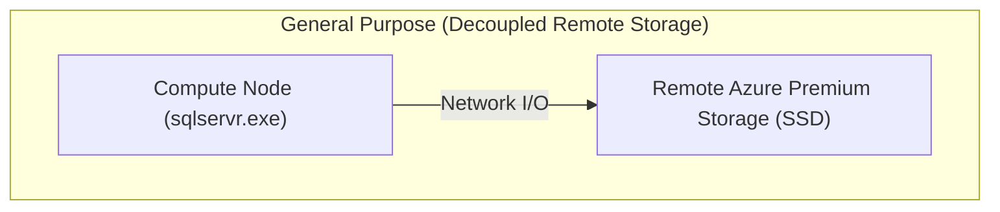
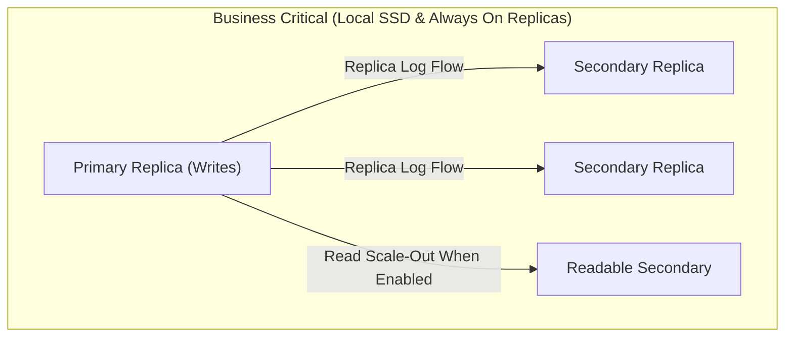
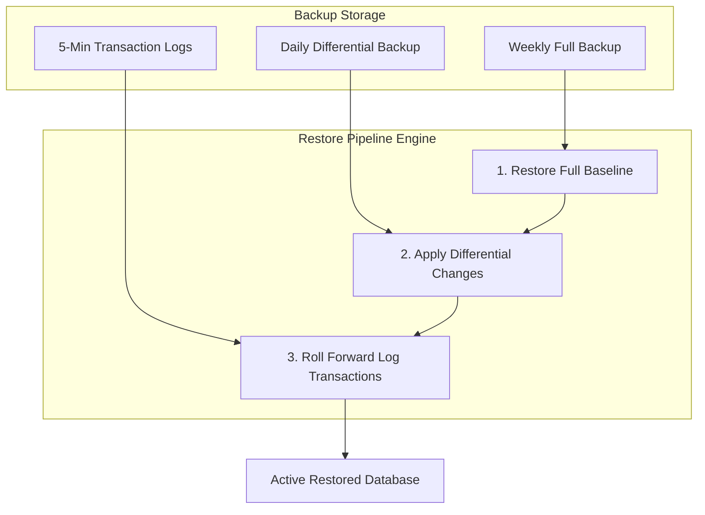

## Table of Contents

1. [What Is Azure SQL Database](#what-is-azure-sql-database)
2. [Logical Server and Database Provisioning](#logical-server-and-database-provisioning)
3. [Relational Tables and Constraints](#relational-tables-and-constraints)
4. [ACID Transactions and Log Writes](#acid-transactions-and-log-writes)
5. [Connections and Network Pathways](#connections-and-network-pathways)
6. [Schema Deployments and Migrations](#schema-deployments-and-migrations)
7. [Automated Backups and Recovery](#automated-backups-and-recovery)
8. [Putting It All Together](#putting-it-all-together)
9. [What's Next](#whats-next)

## What Is Azure SQL Database

Azure SQL Database is a fully managed relational database platform built on Microsoft's SQL Server database engine. Relational databases store structured records inside tables with strict schemas, enforcing transactional boundaries and referential integrity between tables using keys and constraints. Managed service delivery means Microsoft automates host operating system patching, physical storage capacity scaling, high-availability replication, and backup scheduling, freeing your engineering team to focus entirely on database schema design, index tuning, transaction boundaries, and query performance.

If you deploy workloads on AWS, Azure SQL Database serves as the managed relational equivalent of Amazon RDS and Amazon Aurora. However, their service shapes differ. Azure SQL Database exposes a logical server and managed databases instead of a customer-managed VM. Its service tiers choose different combinations of compute, storage, availability, and latency behavior, so tier selection is part of the application architecture rather than a cosmetic billing choice.

:::expand[Under the Hood: General Purpose vs. Business Critical Architectures]{kind="design"}
Azure SQL Database configures physical compute, network, and storage layouts differently depending on the chosen architectural tier:

* **General Purpose Tier (Remote Storage)**: This tier separates compute from remote storage. It is a good fit for many business applications because Azure can move or replace compute while the database files remain on durable remote storage. The tradeoff is that reads and writes use a remote storage path, so latency-sensitive workloads may need a higher tier.

* **Business Critical Tier (Local SSD and Replicas)**: This tier is designed for lower latency and higher availability by using local SSD storage and Always On availability group replicas. The primary replica accepts writes, and secondary replicas support high availability and, when configured, read scale-out. This is the tier to consider when transaction latency, failover behavior, and read replica options matter more than the lowest hosting cost.




:::

Understanding these structural separations enables teams to select tiers based on business impact: General Purpose provides budget-friendly relational hosting for standard dev-test and balanced production workloads, while Business Critical delivers low-latency local disk throughput and rapid failover recovery for high-transaction payment rails and real-time checkout engines.

## Logical Server and Database Provisioning

An Azure SQL logical server operates exclusively as a centralized control plane and administrative management boundary for one or more underlying databases. It provides a unique, globally addressable Domain Name System (DNS) endpoint, governs administrative logins, manages server-level firewall rules, configures Microsoft Entra ID authentication integrations, and applies security policies. It is not a dedicated virtual machine. You cannot SSH into a logical server or install operating system packages; all configuration changes occur through ARM APIs, the Azure portal, or database tools.

When provisioning database capacity under an Azure SQL logical server, you must choose between two distinct resource allocation models:

* **vCore Model**: Independently allocates virtual processor cores (vCores), memory, and physical storage capacity. This model maps directly to traditional server provisioning paradigms, matching the resource choices you make when choosing EC2 or RDS instance classes. It supports two compute paths:
    * **Provisioned Compute**: Allocates a fixed number of vCores and memory that remain continuously online, billing for resources regardless of active database queries.
    * **Serverless Compute**: Dynamically scales vCores and memory on demand based on query workloads. It automatically pauses the database compute layer during prolonged periods of inactivity, billing only for storage, and resumes compute in seconds when a new client query arrives.
* **DTU Model**: Bundles CPU, memory, and read-write IOPS into a single, pre-packaged metric called a Database Transaction Unit (DTU). Tiered into Basic, Standard, and Premium packages, it abstracts resource configurations. While simple for early development, DTUs prevent you from scaling memory or CPU independently of storage, making it difficult to optimize resources for specific high-performance application patterns.

For enterprise environments, the vCore model is recommended. It provides direct control over resource allocation and allows you to use Azure Hybrid Benefit to save on licensing costs.

## Relational Tables and Constraints

A relational database structures application records into rigid tables consisting of columns and rows. Unlike NoSQL engines that allow arbitrary JSON documents to coexist in the same collection, a relational engine enforces structural uniformity. Every row in a table must comply with the defined columns, data types, and system-level constraints.

In a checkout system, data assets are modeled as interconnected tables rather than single documents:

| Table Name | Column Name | Data Type | Constraint Type | Architectural Role |
| --- | --- | --- | --- | --- |
| `customers` | `id` | `INT` | `PRIMARY KEY` | Globally identifies one customer profile. |
| `customers` | `email` | `VARCHAR(255)` | `UNIQUE` | Guarantees email addresses are never duplicated in the system. |
| `orders` | `id` | `INT` | `PRIMARY KEY` | Globally identifies a specific checkout transaction. |
| `orders` | `customer_id` | `INT` | `FOREIGN KEY` | Relates the order to `customers.id`, blocking orders for non-existent customers. |
| `order_items`| `order_id` | `INT` | `FOREIGN KEY` | Relates item to `orders.id`. Cascades deletions if an order is scrubbed. |
| `order_items`| `quantity` | `INT` | `CHECK` | Enforces that quantities must be greater than zero at the database level. |

These database constraints act as a final line of defense for data consistency. Even if a software bug in your application bypasses a validation check, the database engine will reject a write attempt that violates unique constraints, foreign key mappings, or invalid data boundaries.

## ACID Transactions and Log Writes

Relational databases guarantee data integrity using ACID transactional properties. When an application commits a transaction, the engine ensures that all updates either succeed completely or roll back entirely (Atomicity), transition the database from one valid state to another (Consistency), execute without interference from concurrent operations (Isolation), and remain written even during power failures or system crashes (Durability).

Under the hood, Azure SQL Database enforces durability using a Write-Ahead Logging (WAL) mechanism. When your application inserts a new order and its corresponding line items within a transaction, the engine executes the following physical steps:

1. **Memory Manipulation**: The engine locates the target database pages inside the system memory buffer pool. If the pages are not in RAM, they are read from persistent storage. The engine updates the data pages in memory, marking them as dirty pages.
2. **Synchronous Log Write**: The engine generates a sequential transaction log record detailing the exact physical changes. The transaction log record must be flushed from memory and written synchronously to persistent physical SSD storage (the `.ldf` file) before the engine acknowledges the commit success back to the client application.
3. **Asynchronous Checkpoints**: The dirty data pages inside the RAM buffer pool are not immediately written to the main database file (`.mdf`). Instead, an asynchronous background lazy writer process or a scheduled database checkpoint writes the modified pages to physical disks.

If the database node experiences a sudden power loss, no data is lost. Upon reboot, the engine scans the synchronous transaction log. It rolls forward any committed changes that were not yet written to the `.mdf` data files, and rolls back any uncommitted changes from incomplete transactions.

## Connections and Network Pathways

Applications connect to Azure SQL Database using standard TCP/IP connection strings. Managing database connections requires configuring secure network routes, robust authentication mechanisms, and connection pooling settings to prevent resources from exhausting.


*Private SQL access depends on both the private endpoint path and the DNS answer clients receive.*

An application client's connection path relies on two connection redirection modes:

* **Redirect Mode (Inside Azure)**: When the application client establishes a connection, it queries the Azure SQL Gateway over port 1433 to authenticate and locate the active database node. The gateway returns the direct IP address of the compute node hosting the database. The client then routes all subsequent database queries directly to the compute node over ports 11000 to 11999. This minimizes gateway bottlenecks and delivers optimal query latencies.
* **Proxy Mode (Outside Azure)**: When connecting from an external network, all queries and responses route directly through the Azure SQL Gateway over port 1433. While this increases gateway round-trip latency, it simplifies enterprise firewall security, requiring you to open only a single port (1433) to the gateway's IP address.

To secure these pathways, avoid public internet access paths. Connect your application compute resources (such as App Services or AKS clusters) using Private Endpoint configurations via Azure Private Link. This assigns a private IP address from your Virtual Network (VNet) to your logical database server, keeping the private connection on the Microsoft network instead of exposing the database endpoint directly to the public internet.

Additionally, eliminate database passwords and connection string secrets from your codebases by using Managed Identities cabled to Microsoft Entra ID. The application authenticates using its system-assigned identity, and the database maps permissions directly to the application's Entra object, removing credential leakage vectors.

## Schema Deployments and Migrations

Relational schema changes—such as adding table columns, altering indices, or dropping old constraints—must be treated as critical deployment steps. Because the database holds persistent business facts, schema updates cannot simply overwrite old structures like container updates do; they must transform active data in place.

To manage database deployments safely in a continuous integration and continuous delivery (CI/CD) pipeline, adopt the following operational practices:

* **Repeatable Migrations**: Use migration tools (such as Entity Framework Core Migrations, Flyway, or DACPAC packages) to generate incremental, versioned SQL migration scripts. These scripts must be checked into version control alongside your application code.
* **Online Schema Changes**: SQL Server supports online index creation and online table rebuilding. Ensure that DDL changes do not acquire exclusive table locks that block active read and write operations on high-traffic production databases.
* **Backward-Compatible Rollouts**: When deploying a schema update, ensure that the change is backward-compatible with the active version of your application. For example, if you must rename a database column, do not drop the old column immediately. Execute the change in phases: add the new column, update your application code to write to both columns, migrate the historical data, update the application to read from the new column, and only then drop the old column.

Never execute ad-hoc schema alterations directly on production systems. Run all migrations through verified pipelines that test schema changes against staging environments before execution.

:::expand[Renaming Columns on Live Traffic]{kind="pitfall"}
A common database deployment trap is executing a direct column rename—such as running `sp_rename 'Orders.customer_id', 'client_id', 'COLUMN'` in T-SQL—in a single database migration script. While simple on a local workstation, running this on a live production database triggers immediate client-side crashes. Because the old application container replicas are still serving active traffic while your CI/CD pipeline deploys the new code version, any query from an active worker attempting to read `customer_id` will fail instantly with a `207 Invalid column name` error, leading to transaction rollbacks and a spike in HTTP 500 errors.

This database constraint applies universally across all relational engines, including **Amazon RDS (Postgres or MySQL)** and **Amazon Aurora**. Relational schema alterations must always follow the **Expand-Contract Pattern** (or Parallel Run pattern) to decouple database changes from application code deployments.

To execute a zero-downtime column migration, structure your deployment into five distinct, backward-compatible phases:

1.  **Phase 1 (Expand):** Add the new column, keeping it fully nullable.
    ```sql
    ALTER TABLE Orders ADD client_id INT NULL;
    ```
2.  **Phase 2 (Dual Write):** Deploy a new application version that reads from the old column (`customer_id`) but writes identical, duplicated data to both columns on every new write.
3.  **Phase 3 (Backfill):** Run a background, batch-migration script to copy historical data from the old column to the new column:
    ```sql
    UPDATE TOP (1000) Orders SET client_id = customer_id WHERE client_id IS NULL;
    ```
4.  **Phase 4 (Read Transition):** Deploy another application version that reads entirely from the new column (`client_id`) and writes only to the new column.
5.  **Phase 5 (Contract):** Drop the old, now-unused column and enforce the required `NOT NULL` constraint on the new column:
    ```sql
    ALTER TABLE Orders ALTER COLUMN client_id INT NOT NULL;
    ALTER TABLE Orders DROP COLUMN customer_id;
    ```

**Rule of thumb:** Never drop or rename a relational column in a single step. Always execute schema refactoring using the Expand-Contract method to protect your live transactional traffic from version-mismatch outages.
:::

## Automated Backups and Recovery

A database's recovery system is the foundation of operational reliability. Azure SQL Database provides automated backups that are maintained continuously without manual configuration.


*Point-in-time restore works by replaying backups and transaction logs to the selected moment, usually into a new database.*

The platform creates three distinct types of backups to enable Point-in-Time Restore (PITR) operations:
* **Full Backups**: A complete copy of the database structure and data, generated weekly.
* **Differential Backups**: Captures all changes made since the last weekly full backup, generated daily.
* **Transaction Log Backups**: Captures sequential transaction log modifications, generated every 5 to 10 minutes.

Azure SQL stores backups in separate backup storage, and you can configure backup storage redundancy options such as locally redundant, zone-redundant, geo-redundant, or geo-zone-redundant storage depending on service and region support.

Using these three backup types, PITR enables you to restore a database to a selected point within your retention window (typically 7 to 35 days for short-term retention). When you trigger a point-in-time restore, the Azure platform provisions a new database, restores the closest full backup, applies differential changes, and rolls forward transaction logs to the selected restore time.



Keep in mind that restoring a database does not overwrite your active production database in place. It spins up a new database beside the active instance. To complete a recovery, your operations team must re-point your application connection strings to the new database, or surgically export recovered rows from the restored database back into the active database.

## Putting It All Together

Azure SQL Database delivers a managed relational environment for application data that requires strict transactional consistency and structured schema guarantees.

* **Service Tier Fit**: Select the General Purpose tier for balanced remote-storage workloads, or select the Business Critical tier when local SSD latency, Always On replicas, and read scale-out are worth the extra cost.
* **Logical Management**: Provision database capacity using the vCore model to control virtual cores and scale memory independently of storage.
* **Strict Constraints**: Structure business records using rigid tables, and enforce referential integrity and data validity using system-level database constraints.
* **WAL Durability**: Rely on Write-Ahead Logging to guarantee ACID transaction durability, flushing log records synchronously to physical media before committing.
* **Secure Connections**: Establish network isolation using Private Link and Private Endpoints, and authenticate using passwordless Managed Identities cabled to Microsoft Entra ID.
* **Automated Recovery**: Leverage Point-in-Time Restore capabilities powered by automated full, differential, and transaction log backups to recover from data corruptions or accidental deletions.

## What's Next

Now that we have structured our relational business records, we will explore Azure Cosmos DB. We will examine how to manage semi-structured documents, distribute data globally, optimize partition key hashing, and select the correct tunable consistency level.


*Use this as the Azure SQL safety path: protect the network path, treat schema changes as releases, rely on the transaction log for durability, and verify backup and restore behavior.*


---

**References**

* [Azure SQL Database documentation](https://learn.microsoft.com/en-us/azure/azure-sql/database/)
* [Azure SQL Database Service Tiers](https://learn.microsoft.com/en-us/azure/azure-sql/database/service-tiers-general-purpose-business-critical)
* [vCore purchasing model overview](https://learn.microsoft.com/en-us/azure/azure-sql/database/vcore-resource-limits-single-databases)
* [Automated backups in Azure SQL Database](https://learn.microsoft.com/en-us/azure/azure-sql/database/automated-backups-change-settings?view=azuresql)
* [Private Link for Azure SQL Database](https://learn.microsoft.com/en-us/azure/azure-sql/database/private-endpoint-overview)
