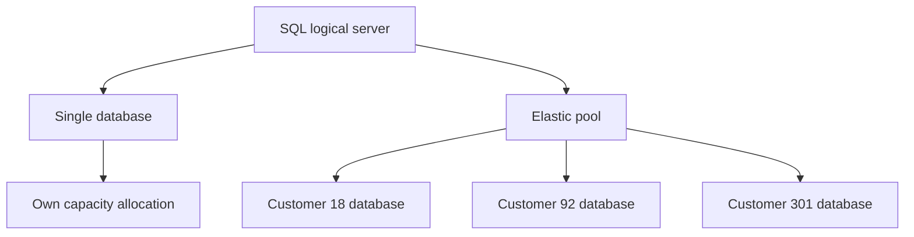
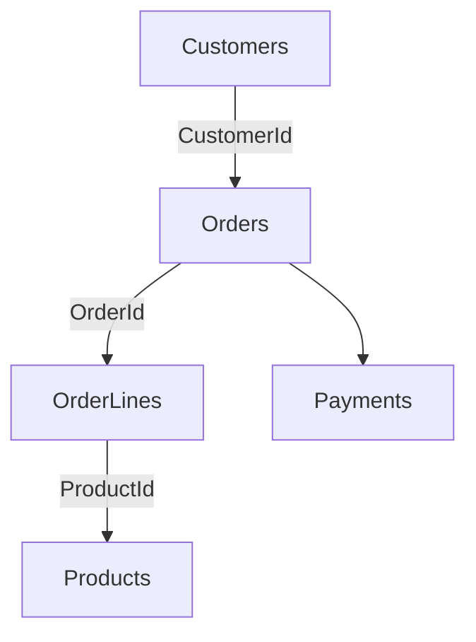
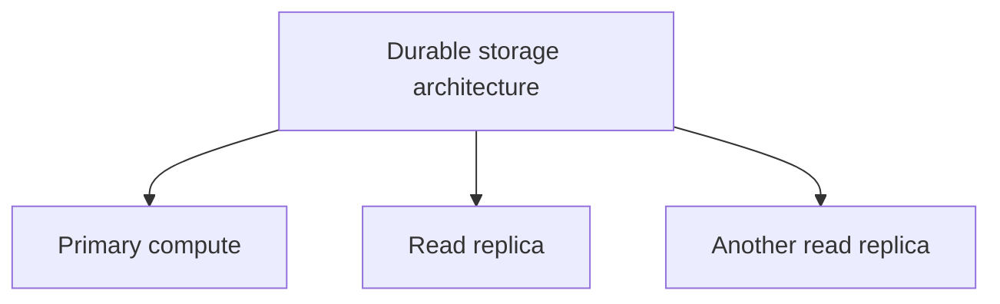
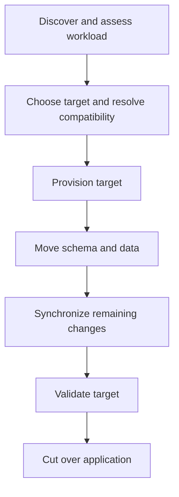

## Table of Contents

1. [What Is Azure SQL Database?](#what-is-azure-sql-database)
2. [How Do Logical Servers and Databases Organize Access?](#how-do-logical-servers-and-databases-organize-access)
3. [How Do Tables, Keys, and Constraints Protect Data?](#how-do-tables-keys-and-constraints-protect-data)
4. [How Do Transactions Preserve Correctness?](#how-do-transactions-preserve-correctness)
5. [How Do Connections, Identity, and Network Access Work?](#how-do-connections-identity-and-network-access-work)
6. [How Do Service Tiers and Capacity Affect Performance?](#how-do-service-tiers-and-capacity-affect-performance)
7. [How Do You Migrate Safely?](#how-do-you-migrate-safely)
8. [How Do Backup and Restore Protect the Database?](#how-do-backup-and-restore-protect-the-database)
9. [Check Your Answers](#check-your-answers)
10. [References](#references)

An online shop has to remember customers, orders, products, payments, and inventory. Saving those facts is only the beginning. An order must belong to a real customer, its ID must be unique, and a purchase must not leave stock reduced while the payment and order records remain unchanged.

The application also needs to ask questions of those facts. Which orders for customer 928 are still pending? How much does that customer owe? Two application servers might ask or change these things at the same time, so correctness cannot depend on one process happening to finish before another starts.

A relational database supplies the structure and coordination needed for this work. Azure SQL Database provides Microsoft's relational database engine as a managed Azure service. You still define the business rules and queries, while Azure handles much of the infrastructure, patching, availability, and backup machinery.

Understanding the database first makes the Azure choices easier to explain. The same order that needs a valid customer also needs an authorized connection, enough capacity to finish its transaction, and a recovery plan if a bad script changes its data. The following questions connect those responsibilities:

1. **What Is Azure SQL Database?**
2. **How Do Logical Servers and Databases Organize Access?**
3. **How Do Tables, Keys, and Constraints Protect Data?**
4. **How Do Transactions Preserve Correctness?**
5. **How Do Connections, Identity, and Network Access Work?**
6. **How Do Service Tiers and Capacity Affect Performance?**
7. **How Do You Migrate Safely?**
8. **How Do Backup and Restore Protect the Database?**

## What Is Azure SQL Database?

Azure SQL Database is a **relational database platform service**. Relational data has declared structure and relationships: customers place orders, orders contain lines, lines refer to products, and payments belong to orders. A database engine stores those facts, enforces rules about them, answers queries, and coordinates concurrent changes.

This is more than object storage with a query interface. Blob Storage can preserve bytes in objects such as `customers.json`, `orders.json`, and `payments.json`. But if two application servers rewrite the orders file simultaneously, something must coordinate their writes. If a process crashes halfway through, something must establish the valid state. If the application needs all unpaid orders for London customers created during the last seven days, something must find them without repeatedly reading every file.

As those requirements accumulate, application code would effectively be rebuilding database mechanisms. A database engine supplies them as a coherent system rather than asking each application to invent its own approach.

### Ask for a result rather than disk operations

SQL is **declarative**: a query describes the result wanted, while the engine decides how to obtain it. For example:

```sql
SELECT *
FROM Orders
WHERE CustomerId = 928
  AND Status = 'Pending';
```

The application asks for matching orders. It does not specify which data file to open, which storage page to seek, or which internal pointer to follow. Likewise, sorting can be part of the requested result:

```sql
SELECT *
FROM Orders
WHERE CustomerId = 928
ORDER BY CreatedAt DESC;
```

The engine parses SQL, chooses an execution strategy through its query optimizer, manages buffers and caches, and accesses durable storage. For changes, it also manages transactions, locking or versioning, and logging.

Consider this update:

```sql
UPDATE Accounts
SET Balance = Balance - 100
WHERE AccountId = 42;
```

The application expresses the intended change. The engine determines where the row is, which access path to use, whether another transaction is changing it, and what must be recorded durably. Application code does not directly manipulate disk sectors.

That division is valuable as data grows. A query can express the same result while the engine chooses a different execution strategy for a larger table or a different available index. Declarative SQL does not guarantee that every written query is efficient, but it provides the engine with responsibility for execution rather than hard-coding storage traversal into the application.

### Understand what Azure manages

A self-managed SQL Server installation traditionally involves a physical or virtual machine, Windows or Linux, the SQL Server installation and instance, and the databases within it. The operator is responsible for substantial parts of OS management, installation, patching, engine upgrades, storage, availability configuration, backups, and hardware replacement.

Azure SQL Database removes several of those layers from direct customer management. Azure runs the database-engine infrastructure and manages platform patching, upgrades, automated backups, availability mechanisms, storage infrastructure, and the underlying compute lifecycle. Azure also operates the physical machines, datacenter networking, power, and cooling.

You remain responsible for schema, tables, indexes, queries, transactions, users, permissions, application correctness, capacity choices, and recovery objectives. These are the decisions that describe what the database should contain and what successful operation means for the business.

| Responsibility | Main owner in this service model |
|---|---|
| Tables, relationships, constraints, queries, and transaction design | Application team |
| Users, database permissions, capacity decisions, and recovery requirements | Application team |
| Database platform, patching, automated backup workflow, and infrastructure availability | Azure SQL Database |
| Physical machines, datacenter infrastructure, power, and cooling | Azure |

This is the practical meaning of database **Platform as a Service**, or PaaS. It transfers much of the platform operation, not ownership of the business logic.

For example, an authorized statement such as the following can be syntactically valid while being disastrous for the application:

```sql
UPDATE Employees
SET Salary = 0;
```

Azure cannot infer that the caller intended something else. Nor can it know that customer 928 should receive a 20% discount unless the application or schema encodes that rule. Managed infrastructure does not make every authorized data change correct.

### Choose storage according to the state

An `invoice.pdf` naturally fits Blob Storage: a name identifies document bytes. Invoice facts such as `InvoiceId`, `CustomerId`, `InvoiceDate`, `Amount`, and `Status` naturally fit relational tables when the application needs queries such as:

```sql
SELECT SUM(Amount)
FROM Invoices
WHERE CustomerId = 928
  AND Status = 'Unpaid';
```

The services can work together. An invoice row might contain invoice 92811, customer 928, amount 79.99, and a `BlobName` pointing to `invoices/928/92811.pdf`. SQL stores the structured business facts and the reference; Blob Storage stores the larger document bytes.

Cosmos DB addresses a different design emphasis: document- or key-based access, partitioning, and globally distributed request patterns. Azure SQL Database is a natural candidate when complex relational integrity, joins, rich SQL, and traditional transaction-processing semantics are the difficult requirements. Neither service should be chosen merely because it can hold the data.

## How Do Logical Servers and Databases Organize Access?

Azure SQL Database is not SQL Server installed on a VM that you administer. SQL Server on an Azure VM exposes a recognizable machine, operating system, and SQL Server instance. Azure SQL Database exposes a database-oriented service without operating-system administrator access or a conventional user-managed instance underneath it.

This difference explains the term **logical server**. It is an administrative and namespace construct for databases and elastic pools, not a virtual machine. Microsoft describes it as a grouping that provides the connection endpoint and server-level policies.

For example, a logical server called `sql-prod-1` could organize databases named `orders`, `customers`, and `billing`. That hierarchy tells you how the resources are named and administered. It does not mean those databases are files attached to one visible SQL Server process.

### Use the namespace without assuming a machine

A logical server named `acme-prod` has an endpoint resembling:

```text
acme-prod.database.windows.net
```

Applications use that server name together with a database name when connecting. The server also supplies a boundary for network and firewall configuration, the Microsoft Entra administrator, auditing and policies, database administration, and failover-group relationships.

Databases under one logical server are in the same Azure region as that server. However, the administrative grouping does not guarantee traditional instance-style physical colocation. Database A and Database B are not necessarily two files served by one customer-visible VM.

Keeping these meanings separate prevents incorrect assumptions about both management and performance. Sharing an endpoint namespace does not by itself establish that two databases share one fixed compute allocation. That is a separate resource choice.

### Give one database its own capacity

A **single database** is an isolated managed database resource with allocated service characteristics, including compute, storage, and service tier. It is administered through the logical server while retaining its own scaling and lifecycle decisions.

For example, an orders service can use `OrdersDB`, a billing service can use `BillingDB`, and an identity service can use `IdentityDB`. The grouping lets each database's capacity follow its workload rather than treating every application as one inseparable machine-sized deployment.

This does not mean that independent databases no longer need coordinated application design. It means the Azure resource model gives each database a distinct capacity and management unit. Deciding what belongs in each database remains an application architecture decision.

### Share capacity through an elastic pool

Now consider a SaaS product with 500 customers, each assigned a database from `customer-001` through `customer-500`. Their peaks do not necessarily happen together. At 09:00, customer 18 may be busy while customers 92 and 301 are idle. At 14:00, customer 18 may be idle, customer 92 busy, and customer 301 moderately active.

Provisioning every database for its individual maximum could leave a great deal of capacity unused. An **elastic pool** lets multiple databases share compute, memory, and related resources so differing usage patterns can make more economical use of a common allocation.


```mermaid
flowchart TD
    A["SQL logical server"] --> B["Single database"]
    A --> C["Elastic pool"]
    B --> D["Own capacity allocation"]
    C --> E["Customer 18 database"]
    C --> F["Customer 92 database"]
    C --> G["Customer 301 database"]
    class A control
    class B,C,E,F,G storage
    class D data
```

The databases remain separate logical databases. The pool is a capacity-sharing mechanism, not an instruction to merge all customers into one table. Its suitability depends on the aggregate workload: the benefit in this example comes from peaks occurring at different times.

Database-versus-pool allocation and service-tier selection answer different questions. The first determines whether capacity is dedicated to one database or shared among a group. The second determines the performance, storage, and availability architecture that provides that capacity. Before choosing the latter, it helps to understand the work the engine performs inside each database.

## How Do Tables, Keys, and Constraints Protect Data?

A table gives stored facts a declared shape. Consider two customer rows:

| CustomerId | Name | Email |
|---|---|---|
| 928 | Alice | alice@example.com |
| 412 | Bob | bob@example.com |

A row represents an entity or fact. Columns define its attributes: an integer customer ID, a text name, and a text email address. This resembles a relation—a set of rows with a defined structure—rather than an arbitrary sequence of bytes.

An introductory table definition could be:

```sql
CREATE TABLE Customers
(
    CustomerId INT,
    Name       NVARCHAR(200),
    Email      NVARCHAR(320)
);
```

Here, `INT` describes an integer and `NVARCHAR` describes text with the declared length. The engine can distinguish attributes by name and type rather than relying on an application to interpret positions in a file.

An orders table might contain:

| OrderId | CustomerId | Total | Status |
|---|---|---|---|
| 1001 | 928 | 79.99 | Paid |
| 1002 | 928 | 15.00 | Pending |
| 1003 | 412 | 42.50 | Paid |

The application can retrieve the order ID and total for customer 928:

```sql
SELECT OrderId, Total
FROM Orders
WHERE CustomerId = 928;
```

The result follows from the structure and values in the table. The engine knows which field represents a customer and which represents an order total.

### Give each row a stable identity

A **primary key** identifies a row and prevents duplicate identities. The following is an alternative, simplified definition of the customer table, showing the key rather than an additional statement to run after the earlier creation example:

```sql
CREATE TABLE Customers
(
    CustomerId INT PRIMARY KEY,
    Name       NVARCHAR(200)
);
```

With that key, rows `928 | Alice` and `928 | Bob` cannot both claim the same customer identity. The database enforces uniqueness instead of relying only on the application to avoid duplicates.

An order needs identity too. An `OrderId` should distinguish order 381 from every other order, while its `CustomerId` can state that it belongs to customer 928. These fields answer different questions: which order is this, and which customer does it reference?

### Enforce relationships with foreign keys

A **foreign key** expresses a relationship between tables. If an order refers to customer 928, the database can require that a customer with that identity exists.

The relevant constraint fragment is:

```sql
FOREIGN KEY (CustomerId)
REFERENCES Customers(CustomerId)
```

This expresses the relationship from `Orders.CustomerId` to `Customers.CustomerId`. It prevents an order from referencing a nonexistent customer such as 99999999. Enforcing valid references is called **referential integrity**.

The rule belongs next to the data, where every writer must obey it. A web application may validate customer IDs before sending a request, but another application or a defective code path could bypass that validation. A database constraint still applies to the stored result.

### Declare the values that are allowed

The same reasoning applies to quantities. If a line's quantity must be positive, the database can enforce:

```sql
CHECK (Quantity > 0)
```

This is stricter than merely disallowing negative numbers: it also rejects zero. State the actual business rule before choosing the constraint so the database enforces the intended condition.

Different constraints address different invariants, or truths that should remain valid:

| Constraint | Rule it expresses |
|---|---|
| `PRIMARY KEY` | Each row has a distinct primary identity |
| `FOREIGN KEY` | A referenced row exists in the related table |
| `UNIQUE` | Values covered by the constraint do not duplicate |
| `NOT NULL` | A required value must be present |
| `CHECK` | Values satisfy a declared allowed-value condition |

These rules do not replace all application validation. They establish a durable boundary around important facts, so correctness does not depend exclusively on the last application that happened to write them.

### Use indexes to find structured facts efficiently

A valid table can still be expensive to search. With one billion orders, locating order 823,918,221 by scanning rows could inspect an enormous amount of data.

An **index** is an additional structure optimized for finding data. A book's index provides a useful analogy: instead of reading every page until Alice appears, look up Alice and follow the entry to page 417. A database index similarly gives the engine an efficient path toward matching rows, though its internal implementation is more sophisticated than a printed lookup list.

Indexes are not free copies of performance. They occupy storage, and data changes may require corresponding index changes. More indexes can improve some reads while increasing write work. The right set follows from the queries and modifications the application actually performs.

This connects structure to declarative SQL. A query states which result is wanted; an index offers an execution path that may help obtain it. The optimizer decides which path to use. Adding capacity without considering schema, queries, and indexes can leave the engine doing unnecessary work.

### Put the order relationships together

A complete order model can include `Customers`, `Products`, `Orders`, `OrderLines`, and `Payments`. Customer keys connect customers to orders. Order keys connect orders to their lines and payments. Product keys connect each line to a product.


```mermaid
flowchart TD
    A["Customers"] -->|"CustomerId"| B["Orders"]
    B -->|"OrderId"| C["OrderLines"]
    C -->|"ProductId"| D["Products"]
    B --> E["Payments"]
    class A,B,C,D,E storage
```

Primary and foreign keys protect these relationships. However, a schema containing valid relationships can still be left in the wrong business state if only some steps of a purchase succeed. That is the problem transactions address.

## How Do Transactions Preserve Correctness?

A transaction treats related changes as one logical unit. Suppose a purchase for £100 requires reducing stock, creating a payment record, and marking the order paid. If stock changes but the database process crashes before the other steps, the stored facts disagree about what happened.

Another coordinated operation might subtract £100 from available credit, create a payment, and mark the order paid. In either case, the requirement is not simply that each individual row is valid. The changes must succeed together or not be committed at all.

The logical sequence is to begin a transaction, perform the required operations, and commit only if all of them succeed. If a required operation fails, roll back the transaction. This sequence describes the transaction boundary; it is not a complete executable payment implementation.

### Treat commit as the boundary

Before `COMMIT`, the transaction's work is tentative. A successful commit makes the changes committed as a unit. `ROLLBACK` undoes the transaction instead of leaving an arbitrary subset of its steps committed.

For changes A, B, and C, a failure in C should not leave A and B independently accepted when the business operation requires all three. The database is maintaining one connected state change, not performing three unrelated file edits.

The order example makes that requirement concrete. Customer 928 buys two units of product 42. A transaction can verify stock, create the order, create its order line, reduce inventory, and commit. If any required step fails, rollback prevents an incomplete order operation from remaining as the committed result.

The transaction boundary must correspond to the business operation. Merely putting some statements between transaction commands does not prove that the correct statements were included or that the business conditions were checked. Defining those conditions remains the application's responsibility.

### Understand the four ACID properties

**Atomicity** means the changes are handled as a unit. If A and B succeed but C fails, A and B should not remain committed on their own when they belong to the same transaction.

**Consistency** means the committed result satisfies the database's declared rules. Foreign keys remain valid, unique keys remain unique, and constraints remain satisfied. In this context, consistency concerns valid state; it is not the same topic as choosing a freshness guarantee for globally replicated reads.

**Isolation** governs interaction between concurrent transactions. Other work must not interfere arbitrarily with a transaction's reads and changes. The chosen isolation model determines what concurrent state can be observed and how conflicting work is coordinated.

**Durability** means successfully committed changes are preserved despite ordinary infrastructure failures. The system needs a recoverable record of what was committed, not merely modified memory that disappears with a process.

These properties explain why a database engine includes more than table storage. It needs transaction management, concurrency control, logging, and recovery to uphold them.

### Coordinate concurrent buyers

Imagine stock is 1. Transaction A reads 1, and transaction B also reads 1 before either completes its purchase. Both conclude that they can sell the last unit. Without appropriate coordination, two sales can imply stock of -1.

This is a concurrency problem. Database engines use mechanisms such as locks and row versioning, governed by isolation rules, to coordinate competing transactions. The key questions are what another transaction may observe and when both transactions may change the same state.

Allowing only one transaction at a time would simplify some coordination but severely limit throughput. Database engines instead allow substantial concurrency while protecting relevant state where needed. Stronger coordination can introduce waiting and contention.

That waiting can dominate performance even when CPU is not busy. Transaction A may block B, B may block C, and C may block D. An investigation that checks only processor utilization will miss the reason requests are slow. Waits, blocking, locks, deadlocks, query execution, I/O, and resource limits all belong in database observability.

The stock example also shows why “the database supports transactions” is not enough by itself. The application must use a transaction and isolation approach that matches the competing operation. The engine supplies the coordination mechanisms; the application defines the state change that needs their protection.

### Record committed work durably

Changing a row can require updates to several internal storage pages. If the server crashes partway through those writes, the engine needs to determine which transactions committed and how to recover their state.

A **transaction log** provides an ordered durable record for that purpose. Suppose account 42 changes from 500 to 400. The engine records the required transaction information durably before acknowledging commit, then persists data pages according to its storage and recovery mechanisms.

This explains both a correctness mechanism and a performance limit. A write-heavy workload can saturate transaction-log throughput while CPU or ordinary data-file I/O still looks acceptable. The log is part of the work required to commit safely, not optional bookkeeping.

In the Azure-hosted order system, an internet-facing web API can connect through a private endpoint using managed identity, then execute the transaction in `OrdersDB` under its logical server. The network path establishes reachability and the identity supplies credentials; the transaction inside the database coordinates the business changes. These mechanisms cooperate but do not replace one another.

The resulting responsibility boundary is straightforward: Azure operates much of the database platform, while the application defines and uses the rules that keep orders correct. The next section follows how that application establishes a usable, appropriately authorized SQL session.

## How Do Connections, Identity, and Network Access Work?

An application does not normally open Azure SQL data files. It establishes a SQL connection using a server name, database name, identity or credentials, and encryption settings. TCP, TLS, and the SQL protocol carry the session to the appropriate database, where the application sends commands.

There are separate questions to answer: can packets reach the service, can the caller authenticate, and what is that caller authorized to do? A success at one layer does not imply success at the others.

### Follow the network path

Azure SQL Database has a public endpoint architecture with server and database firewall policies controlling allowed source addresses. Connection attempts that do not match the relevant allowed rules are denied. A simple development arrangement might allow one specific client IP, while a production design should establish the network boundary its workload requires.

The public connection begins through the Azure SQL gateway, rather than a hostname pointing permanently to one dedicated database VM. A simplified connection starts on TCP port `1433`. Depending on the connection policy, the gateway can proxy the session or redirect the client toward the infrastructure hosting the database.

Microsoft recommends **Redirect** where practical because it reduces latency and improves throughput. The important architectural point is the routing layer: the logical-server hostname is a managed endpoint, not proof that the client is connecting to a conventional customer-owned SQL Server machine.

A **private endpoint** provides a privately reachable address within the network design. The application reaches that private IP from its VNet path and connects to Azure SQL Database through Private Link. For a private-only architecture, public network access should also be disabled. Creating a private path and leaving a public path available are separate configuration decisions.

DNS and routing must support the intended connection. An online database with broken private DNS is still unusable to the application. A private endpoint is therefore one component of reachability, not a guarantee that every client will automatically resolve and use it correctly.

### Authenticate without confusing identity with permissions

Traditional SQL authentication uses a username and password. That is straightforward, but the application now has a secret that must be stored, protected, rotated, and distributed.

Azure SQL Database also supports **Microsoft Entra authentication**. A Microsoft Entra administrator is configured on the logical server to establish Entra-based database identities. An Azure workload can then use a managed identity to obtain an access token rather than maintaining a long-lived database password.

For an App Service application using `OrdersDB`, the contrast is simple. A password design places values such as `DB_USERNAME` and `DB_PASSWORD` in application configuration. A managed-identity design uses the application's Azure identity and an Entra token.

In both designs, the database still needs authorization rules. Authentication answers who the caller is. Database permissions answer what the caller may do. Assigning an identity to an application is not the same action as granting that identity access to the required tables or operations.

A web API that reads orders, creates orders, and updates order status usually does not need database-owner authority. A reporting service might need `SELECT` while having no reason to receive `DELETE`, `ALTER TABLE`, or `DROP DATABASE` permissions. Narrow permissions reduce the range of damage that an erroneous or compromised caller can cause.

The complete production arrangement can therefore combine managed identity, database permissions, a private endpoint, and disabled public access. None of those controls substitutes for the others: identity establishes the caller, permissions limit actions, and the network establishes the allowed path.

### Reuse established connections

Opening a database connection can require network setup, TLS negotiation, authentication, and SQL session initialization. Repeating all of that for every small query wastes time and resources under load.

**Connection pooling** maintains reusable connections. A request borrows a connection, executes its work, and returns it to the pool. Another request can then reuse the established session instead of repeating the entire setup process.

This is why a high-traffic pattern of opening, querying, and closing needs effective client-library pooling. The application-level lifecycle should cooperate with the pool rather than accidentally forcing every operation through a new physical connection.

Managed availability does not mean every connection lasts forever. Failover, transient interruption, or a connection drop can still require sensible connection retry behavior. Pooling reduces repeated setup; retry handling addresses temporary failures. They solve different parts of reliable connectivity.

### Verify the actual caller and path

When the application cannot connect, separate the checks. Confirm the application is using the intended server and database. Establish whether authentication succeeds. Check firewall rules, any VNet-related access rules, private DNS, and routing for the intended network design. Then verify the database is online and the caller has the permissions needed for its command.

A successful administrator connection proves only that the administrator's identity and path work. The application may use another identity or network route. Likewise, a successful connection does not prove that its query is permitted or that its transaction produces correct results.

Following the application's own path provides stronger evidence than treating “database problem” as one undifferentiated diagnosis. Once the connection is usable, performance investigation can move to the resources and queries behind that session.

## How Do Service Tiers and Capacity Affect Performance?

Database capacity has several dimensions: CPU, memory, data I/O, transaction-log write rate, worker threads, connections, and storage capacity. Buying more capacity should address an observed limit, not an undefined feeling that the database needs to be faster.

For example, CPU at 30% does not exclude a bottleneck. Transaction-log throughput could be saturated. Data I/O could also be the limiting resource while CPU remains nearly idle. Adding an index or increasing a processor allocation may not address the resource the workload is actually waiting for.

### Separate the purchasing model from the architecture

Azure SQL Database offers **vCore-based** and **DTU-based** purchasing models. A vCore represents logical CPU capacity and exposes resource choices more directly. A database's capacity profile combines the service tier, hardware configuration, vCore count, and storage.

The **DTU**, or Database Transaction Unit, model bundles compute, memory, and I/O into a blended measure. Labels such as S2, S3, and P1 simplify purchasing but provide a less direct view of individual CPU and memory resources.

The purchasing model is not the entire architecture. A service tier determines broader storage, performance, scaling, and availability behavior. Two choices with a comparable-looking capacity number can still be built differently underneath.

### Compare the service tiers

**General Purpose** is the balanced, cost-conscious option for many ordinary relational workloads. Its architecture combines compute with durable premium remote storage and managed availability. Business applications, ordinary APIs, internal systems, and many standard OLTP databases are candidates if their latency and throughput requirements fit.

**Business Critical** targets workloads particularly sensitive to I/O latency and failover time, such as payment authorization, trading, and high-volume order processing. It uses multiple database-engine replicas with local SSD-oriented storage. The standard architecture described in Microsoft's service-tier guidance has four database-engine nodes: one primary and additional replicas using synchronous replication.

That richer architecture costs more because it supplies more than a larger processor allocation. Storage locality and replica arrangements contribute to the performance and availability characteristics.

**Hyperscale** separates compute more strongly from durable storage. It addresses needs such as tens of terabytes of data, rapid compute scaling, multiple read replicas, and different large-database backup and restore behavior. The documented storage limit is up to 128 TB.


```mermaid
flowchart TD
    A["Durable storage architecture"] --> B["Primary compute"]
    A --> C["Read replica"]
    A --> D["Another read replica"]
    class A storage
    class B,C,D workload
```

This separation means increasing compute does not necessarily require moving the entire database's data to a new machine. It enables more independent scaling of compute and storage, supports large data volumes and read-scale patterns, and changes some backup and restore economics.

| Service tier | Architectural emphasis |
|---|---|
| General Purpose | Balanced compute with durable remote storage |
| Business Critical | Local SSD-oriented replicas, low I/O latency, and fast failover |
| Hyperscale | More independent compute and storage scaling for large and growing databases |

These descriptions explain why the tiers exist. They are not a universal ranking. The appropriate tier follows the workload's requirements and measured behavior.

### Choose provisioned or serverless compute separately

A **compute tier** is a different choice from the service tier. Provisioned compute keeps a selected amount of capacity continuously available and is a natural fit for steady demand.

Serverless compute adjusts capacity within configured bounds and charges according to usage. It still runs on computers; Azure manages their allocation more dynamically instead of requiring a continuously fixed compute choice.

Serverless is available in the vCore model for General Purpose and Hyperscale. General Purpose serverless can auto-pause during qualifying inactivity and resume when work returns. Hyperscale serverless does not support auto-pause. This difference matters because “serverless” does not promise the same pause behavior in both service tiers.

A paused database must resume before it serves returning work. Applications requiring uniformly immediate responsiveness may prefer provisioned compute. The decision is about the workload's usage pattern and tolerance for that behavior, not merely whether automatic scaling sounds convenient.

### Fix unnecessary work as well as resource limits

Consider a query like this:

```sql
SELECT *
FROM Orders
WHERE LOWER(CustomerEmail) = 'alice@example.com';
```

Depending on the available schema and indexes, applying the function may prevent an efficient access path and lead to excessive scanning. If every request scans a billion rows, moving from 4 vCores to 32 vCores may reduce the symptom while preserving the wasteful work.

Performance reflects schema design, indexes, query design, concurrency behavior, resource capacity, and data distribution together. Cloud scaling adds options; it does not replace database engineering.

Useful runtime observations differ:

| Observation | What it suggests investigating |
|---|---|
| CPU at 96% | Processor demand and expensive execution |
| CPU at 30%, data I/O at 100% | Data access and I/O limits |
| CPU at 15%, log write at 100% | Transaction-log demand and write limits |
| Resource usage looks fine but sessions are blocked | Locks, waits, and transaction interaction |

Azure SQL governs resources at database and pool levels. Reaching a resource ceiling can cause queuing and higher latency. Check the allocation the workload is actually using: a pool's aggregate capacity and an individual database's behavior are both relevant.

### Measure success beyond an online resource

An Azure resource can report online while private DNS prevents the application from reaching it. A connection can work while every request takes 30 seconds due to blocking. Queries can run quickly while the application commits incorrect totals.

Health evidence therefore needs to move toward the user outcome: the resource is healthy, the connection works, the query succeeds, the transaction succeeds, the business result is correct, and the user can check out.

Investigate the application, identity, network, database state, resource saturation, expensive queries, and concurrency behavior before accepting the result. The last check is business correctness, because a technically successful transaction can still represent the wrong operation.

This same standard applies when moving a database to Azure. A completed transfer and an online target are only early pieces of migration evidence.

## How Do You Migrate Safely?

A migration begins by assessing compatibility, not by copying bytes. An existing SQL Server workload can include tables, views, stored procedures, SQL Server Agent jobs, server-level configuration, linked servers, Windows authentication, and other instance-level features.

Azure SQL Database intentionally does not expose a full traditional SQL Server instance. Some dependencies may be unsupported or require redesign. Asking whether an MDF file can be copied to Azure therefore misses the central question: does the workload fit the database-level service abstraction?

### Select the target after understanding dependencies

Azure offers different SQL deployment models because applications need different levels of control. SQL Server on an Azure VM provides the most recognizable machine and instance environment. Azure SQL Managed Instance provides a more managed instance-oriented option. Azure SQL Database provides the strongest database-level PaaS abstraction among these choices.

If an application heavily depends on instance behavior, Managed Instance or a SQL Server VM may be the more natural target. If it primarily needs a relational database and fits the database-level model, SQL Database can remove more platform operation from the team's responsibilities.

The migration assessment must include more than tables. Jobs and server-scoped dependencies can be operationally essential even if the row data itself looks ordinary. Discovering them after cutover leaves the application moved but incomplete.

### Follow an assessed migration sequence

A sensible sequence is discovery, assessment, target selection, compatibility remediation, target provisioning, schema and data transfer, synchronization of remaining changes where applicable, validation, and application cutover.


```mermaid
flowchart TD
    A["Discover and assess workload"] --> B["Choose target and resolve compatibility"]
    B --> C["Provision target"]
    C --> D["Move schema and data"]
    D --> E["Synchronize remaining changes"]
    E --> F["Validate target"]
    F --> G["Cut over application"]
    class A,B,F decision
    class C,D,E control
    class G workload
```

Azure Migrate can assist discovery, assessment, and sizing. Azure Database Migration Service is one of the migration services identified in Microsoft's guidance for transferring workloads to Azure SQL. The tooling supports the workflow, but it does not eliminate the need to assess what the application requires.

The diagram includes synchronization because a source database can continue changing during a transfer. Whether that step is needed, and how it is carried out, depends on the migration method and downtime requirement. It should not be silently assumed that an initial copy is current at cutover.

### Match the method to the downtime window

For a small database with acceptable downtime, an offline approach can stop the application, export or copy data, import it into Azure SQL, change the connection string, and restart the application. The interruption is explicit and must fit the business requirement.

A larger system may need a low-downtime approach. Perform an initial transfer, keep source changes synchronized, verify the target, then use a shorter cutover window to switch applications. Source and target consistency must be checked before treating the transfer as complete.

These approaches solve the same migration problem under different availability constraints. “Low downtime” does not mean no preparation or no validation. It shifts much of the work ahead of the final switch and requires careful handling of changes that arrive during that work.

### Validate schema, data, and application behavior

**Schema migration** moves structures such as tables, indexes, foreign keys, views, and stored procedures. **Data migration** moves the facts stored in those structures—for example, 2 TB of row data.

A target containing rows but missing required constraints or indexes is not equivalent to the source. A target containing all structures but missing recent data is not equivalent either. Both aspects need verification.

Security, application compatibility, performance, connection changes, and operational readiness are also part of the migration. A transfer that technically succeeds but leaves the application ten times slower is not a successful production result.

Validation should exercise the application's own identity, network path, queries, and transactions. The same checkout operation used to explain the data model can demonstrate whether the target supports the intended business workflow. Merely showing that an administrator can connect does not establish that result.

Capacity selection also belongs here. The target may use a different managed architecture from the original SQL Server installation. Assessment and measured behavior should guide the service tier and allocation, rather than assuming that a superficially similar number of processors guarantees the same result.

### Include the rest of the application state

SQL is often only one part of the application. Blob Storage may contain documents, Redis may hold cached state, Service Bus may contain queued work, and Key Vault may hold secrets used by the system.

This matters during recovery as well as migration. Restoring SQL to 10:00 while every other component remains at 10:30 can create cross-system inconsistency. The database's recovered rows may refer to work or documents whose surrounding state reflects a later time.

Ask which systems together represent one business state. Database migration and point-in-time restore address the SQL portion. Application readiness requires considering the connected components and the operations that use them.

This is a useful bridge to recovery planning. Moving a database and restoring a database both require more than producing a target resource: the application must connect, interpret its state correctly, and complete the intended business operations.

## How Do Backup and Restore Protect the Database?

High availability and backup address different failures. If a machine serving the database fails, the service should continue through healthy infrastructure or replicas. If an authorized statement deletes the wrong data and commits, those same availability mechanisms should preserve and reproduce the committed change.

For example, this statement is a destructive illustration, not an instruction to run:

```sql
DELETE FROM Customers;
```

A healthy replica does not know that the deletion was unintended. Recovering the previous customer data requires historical state, not just another copy of the latest database.

### Rely on managed availability without assuming permanent connections

Azure SQL Database manages local infrastructure availability. The exact storage and replica mechanisms differ among General Purpose, Business Critical, and Hyperscale. You do not need to construct SQL Server failover clustering on VMs merely to use the database service.

Applications must still expect transient interruptions. Connections can drop, failovers can occur, and sessions may need to be reestablished. Sensible connection retry logic remains necessary even though Azure manages the underlying availability machinery.

This distinction is important operationally. The service can meet its availability design while an application that never recovers a dropped connection continues failing. Managed infrastructure and resilient client behavior work together.

### Restore a recent point in time

Azure SQL Database automatically creates the backup information required for point-in-time recovery. For General Purpose and Business Critical, the workflow includes full, differential, and transaction-log backups. Short-term retention is generally configurable from 1 to 35 days, with 7 days as the default.

The team does not normally schedule a nightly `BACKUP DATABASE` to a local disk as it might on a self-managed SQL Server machine. Azure owns the underlying automated workflow; the team still chooses retention and recovery objectives appropriate to the application.

Suppose a bad script runs at 14:03:00. At 14:05:00, the team discovers that 100,000 rows were corrupted. The useful recovery request is for the database state immediately before the script, approximately 14:02:59.

**Point-in-time restore**, or PITR, restores that state into a **new database**. It does not rewind the running database in place. The new database allows the team to inspect the recovered state before deciding how the application should use it.


```mermaid
flowchart LR
    A["Current database"] --> B["Backup and log history"]
    B --> C["Select 14:02:59"]
    C --> D["New restored database"]
    D --> E["Validate data and application access"]
    class A,B,D storage
    class C decision
    class E workload
```

The time selection, restore operation, and validation are distinct steps. A successful restore operation establishes that Azure produced a database from the selected history. It does not establish that the chosen time was correct or that the application is ready to use the restored resource.

### Keep longer history when required

Short-term PITR addresses recent operational mistakes. A different requirement might be to keep annual backups for seven years. **Long-Term Retention**, or LTR, can retain selected full backups for up to ten years.

PITR and LTR should therefore be described separately. One supplies recent operational recovery points; the other preserves selected backups over a much longer historical period. Choosing long retention does not remove the need to know how the application would recover from a mistake this afternoon.

Microsoft recommends periodic recovery drills for mission-critical LTR scenarios. Retained backup history is valuable only if the team can turn it into usable recovered state when required.

### Test recovery through a business operation

A useful drill follows the whole chain: confirm the backup exists, perform the restore, verify database access, check users and permissions, connect the application, inspect logical data correctness, and complete a business operation.

Each step can uncover a different failure. The restore may succeed while the application identity lacks access. Connectivity may work while the selected recovery time still contains the bad update. Data may look reasonable while connected systems remain at an incompatible point in time.

The order system provides a concrete acceptance test. Can the intended application identity reach the recovered database through its intended network path? Can it read the correct customer and order relationships? Does the relevant transaction produce the expected result? These checks turn “we have backups” into evidence that recovery works.

Recovery is therefore larger than a storage operation. It includes permissions, network configuration, application configuration, and the business meaning of the restored data. A backup that has never been restored represents an expectation; a completed drill tests that expectation.

### Plan separately for a regional failure

Local availability mechanisms address failures within a region. A major regional outage introduces another failure domain and may require a database in another region.

Azure SQL Database supports active geo-replication for individual databases and failover groups for coordinated patterns across databases, with stable listener endpoints. A primary in region A can asynchronously replicate to a secondary in region B.

Asynchronous replication avoids requiring every commit to wait for a round trip across regions. A transaction committed in London would otherwise inherit the network delay of traveling to another region and back before acknowledgment.

The trade-off is a possible gap: the primary has transaction X while the secondary has not yet received it. If the primary region is lost during that window, forced disaster-recovery failover can lose some recent data. A graceful synchronized failover and a forced failover with possible data loss are different operations.

This is a **Recovery Point Objective**, or RPO, decision: how much recent state can the recovery plan tolerate losing? The business requirement must guide the replication and failover plan. Merely configuring a second region does not answer that question.

### Bring the design back to its core requirements

An Azure SQL design should explain six things: the truths enforced by the schema; the changes that must be atomic; the identities allowed to connect; the networks from which they can connect; the capacity model; and the response to infrastructure failure or human error.

These questions connect tables and constraints to transaction boundaries, managed identity and permissions to firewall or private paths, databases and pools to service tiers, and local availability to PITR, LTR, geo-replication, failover, and tested recovery.

The service can be understood in three layers. Relational state contains customers, orders, payments, products, keys, constraints, transactions, and indexes. The SQL engine parses and optimizes queries, coordinates concurrency, writes the transaction log, and recovers committed state. The managed Azure platform supplies compute, storage, replication, patching, endpoints, backup, availability, and service management.

The application mostly designs the first layer, relies on SQL technology for the second, and configures and uses the Azure-managed third layer. That boundary explains both the service's value and its limits.

Choose Azure SQL Database when related facts and their state changes need to remain correct under concurrent use. Then judge the result by the application's behavior, not only by whether a resource exists: the correct caller can connect, the intended transaction succeeds, the resulting state is valid, and the team can recover that state after a failure or mistake.

## Check Your Answers

:::expand[What Is Azure SQL Database?]{kind="recap"}
Azure SQL Database provides a relational database engine as a managed platform service. The engine handles structured queries, concurrency, transactions, logging, and storage. Azure operates much of the platform, while the application team owns schema, business rules, queries, permissions, capacity decisions, and recovery requirements. Blob Storage and Cosmos DB serve different data-access needs.
:::

:::expand[How Do Logical Servers and Databases Organize Access?]{kind="recap"}
A logical server supplies a namespace and administrative boundary, not a VM or traditional SQL Server instance. A single database has its own managed capacity characteristics. An elastic pool lets multiple databases share resources, which can suit customers whose workloads peak at different times. Sharing a logical server does not guarantee physical colocation.
:::

:::expand[How Do Tables, Keys, and Constraints Protect Data?]{kind="recap"}
Tables declare the structure of facts. Primary keys establish identity, foreign keys enforce valid relationships, and constraints restrict invalid values. Indexes help locate data efficiently but require storage and write maintenance. Together, these mechanisms let several applications rely on rules enforced at the data layer rather than only in individual code paths.
:::

:::expand[How Do Transactions Preserve Correctness?]{kind="recap"}
Transactions group related changes so they commit together or roll back. ACID describes atomicity, valid state, concurrency isolation, and durability. Locks and row versioning help coordinate competing work, while the transaction log records committed changes for recovery. The application still has to define the correct transaction boundary and business conditions.
:::

:::expand[How Do Connections, Identity, and Network Access Work?]{kind="recap"}
A SQL session needs a usable network path, valid authentication, and appropriate database permissions. Public firewall controls and private endpoints govern reachability. SQL credentials or Entra identities authenticate callers, and managed identity can remove a long-lived application password. Connection pools reuse sessions, while retry handling addresses transient connection failures.
:::

:::expand[How Do Service Tiers and Capacity Affect Performance?]{kind="recap"}
Capacity includes CPU, memory, data I/O, log throughput, workers, connections, and storage. General Purpose, Business Critical, and Hyperscale provide different architectures; provisioned and serverless describe compute allocation. Runtime metrics, query behavior, and blocking identify actual limits. More vCores do not automatically repair wasteful queries or incorrect transactions.
:::

:::expand[How Do You Migrate Safely?]{kind="recap"}
Assess dependencies and compatibility before choosing SQL Database, Managed Instance, or a SQL Server VM. Move both schema and data, synchronize changes where needed, and validate identity, network access, performance, and business behavior before cutover. Offline and low-downtime methods fit different interruption windows. Connected application systems also belong in readiness and recovery planning.
:::

:::expand[How Do Backup and Restore Protect the Database?]{kind="recap"}
Availability preserves service through infrastructure failures; backup preserves historical state after wrong changes. PITR creates a new database for a recent recovery point, while LTR retains selected backups longer. Regional replication addresses another failure domain and asynchronous failover can involve data loss. Recovery is proven by restoring and completing the intended application operation.
:::

## References

1. [Azure SQL Database PaaS overview](https://learn.microsoft.com/en-us/azure/azure-sql/database/sql-database-paas-overview?view=azuresql)
2. [Logical servers](https://learn.microsoft.com/en-us/azure/azure-sql/database/logical-servers?view=azuresql)
3. [Single database overview](https://learn.microsoft.com/en-us/azure/azure-sql/database/single-database-overview?view=azuresql)
4. [Network access controls](https://learn.microsoft.com/en-us/azure/azure-sql/database/network-access-controls-overview?view=azuresql)
5. [Connectivity architecture](https://learn.microsoft.com/en-us/azure/azure-sql/database/connectivity-architecture?view=azuresql)
6. [Private Link overview](https://learn.microsoft.com/en-us/azure/azure-sql/database/private-endpoint-overview?view=azuresql)
7. [Microsoft Entra authentication](https://learn.microsoft.com/en-us/azure/azure-sql/database/authentication-aad-overview?view=azuresql)
8. [Purchasing models](https://learn.microsoft.com/en-us/azure/azure-sql/database/purchasing-models?view=azuresql)
9. [vCore service tiers](https://learn.microsoft.com/en-us/azure/azure-sql/database/service-tiers-sql-database-vcore?view=azuresql)
10. [Hyperscale FAQ](https://learn.microsoft.com/en-us/azure/azure-sql/database/service-tier-hyperscale-frequently-asked-questions-faq?view=azuresql)
11. [Hyperscale service tier](https://learn.microsoft.com/en-us/azure/azure-sql/database/service-tier-hyperscale?view=azuresql)
12. [Serverless compute tier](https://learn.microsoft.com/en-us/azure/azure-sql/database/serverless-tier-overview?view=azuresql)
13. [Resource management](https://learn.microsoft.com/en-us/azure/azure-sql/database/resource-limits-logical-server?view=azuresql)
14. [Long-term retention overview](https://learn.microsoft.com/en-gb/azure/azure-sql/database/long-term-retention-overview?view=azuresql-mi)
15. [Long-term retention and recovery drills](https://learn.microsoft.com/en-us/azure/azure-sql/database/long-term-retention-overview?view=azuresql)
16. [Configure geo-replication and failover](https://learn.microsoft.com/en-us/azure/azure-sql/database/active-geo-replication-configure-portal?view=azuresql)
17. [Disaster recovery guidance](https://learn.microsoft.com/en-us/azure/azure-sql/database/disaster-recovery-guidance?view=azuresql)
18. [Migration assessment rules](https://learn.microsoft.com/en-us/data-migration/sql-server/database/assessment-rules)
19. [Migrate from SQL Server](https://learn.microsoft.com/en-us/data-migration/sql-server/overview)
20. [SQL Server to Azure SQL Database migration guide](https://learn.microsoft.com/en-us/azure/azure-sql/database/migrate-to-database-from-sql-server?view=azuresql)
21. [Reliability in Azure SQL Database](https://learn.microsoft.com/en-us/azure/reliability/reliability-sql-database)
