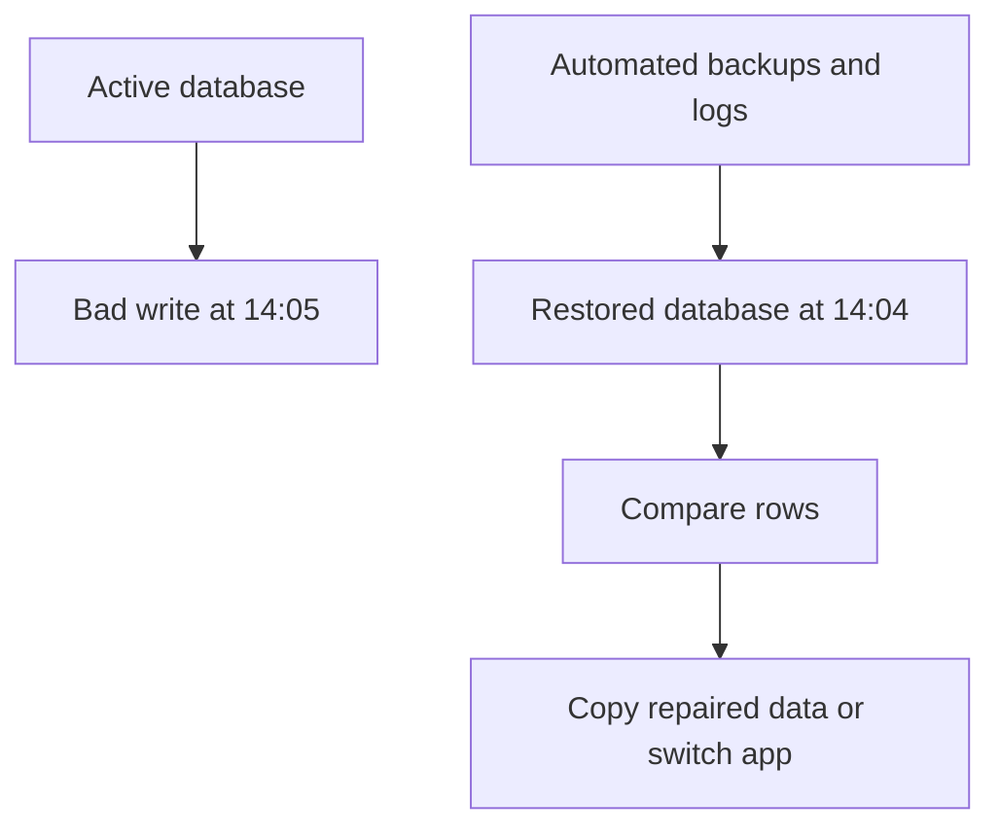
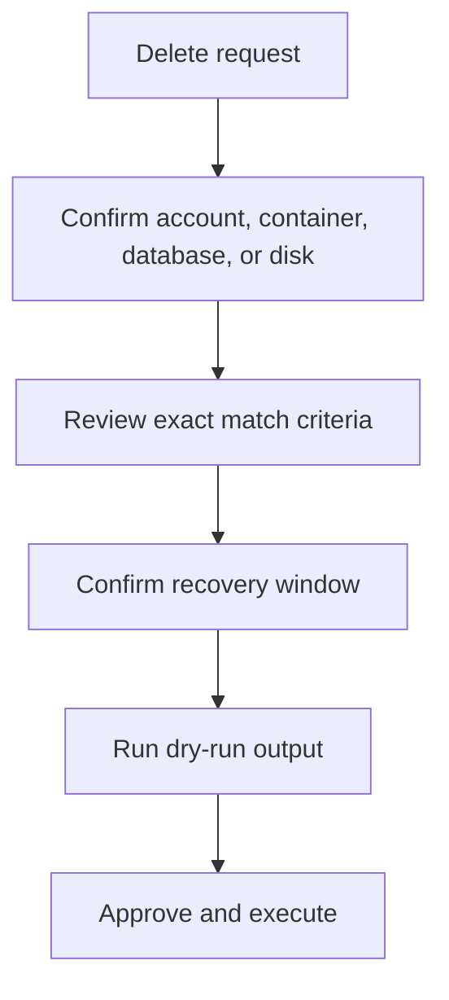

## Table of Contents

1. [Backup vs Restore](#backup-vs-restore)
2. [Retention](#retention)
3. [Recovery Objectives](#recovery-objectives)
4. [Blob Versioning](#blob-versioning)
5. [Database Restore](#database-restore)
6. [Disk and File Share Recovery](#disk-and-file-share-recovery)
7. [Vaults and Immutability](#vaults-and-immutability)
8. [Safe Deletion](#safe-deletion)
9. [Putting It All Together](#putting-it-all-together)
10. [What's Next](#whats-next)

## Backup vs Restore

A backup is a previous copy or recovery point. A restore is the process of turning that copy into useful data again. Both parts matter.

It is easy to say "we have backups" and still be unable to recover cleanly. The backup may exist, but the team may not know which point to choose, where to restore it, how long the restore takes, how to compare it with live data, or how to avoid overwriting good transactions that happened after the mistake.

The useful recovery question is concrete: if this data is corrupted or deleted, which previous copy can we restore, where will we restore it, and what application path will use the recovered data?

## Retention

Retention is how long a recovery copy remains available before the platform or a lifecycle rule removes it. It turns recovery from a vague hope into a time boundary.

Example: if Blob soft delete keeps deleted objects for 14 days, the team has a 14-day window to recover an accidental delete. If Azure SQL Database short-term retention keeps point-in-time restore coverage for 7 days by default, a corruption found after that window may need long-term retention, exports, or another recovery mechanism.

Retention must match discovery time. A temporary import file may only need a few days. Customer receipts may need years. SQL point-in-time restore may need enough time for the team to discover bad data and react. Compliance records may need immutable retention that normal administrators cannot shorten casually.

Longer retention usually increases cost. Blob versions, soft-deleted data, database backups, disk snapshots, and restored copies can all consume storage. Cost is not a reason to skip recovery, but it is a reason to make retention deliberate.

## Recovery Objectives

Recovery Point Objective, or RPO, is the maximum amount of data loss the business can tolerate. Recovery Time Objective, or RTO, is the maximum acceptable time to get back to an operating state.

*Recovery design separates the live system from previous copies, restore targets, and the RPO/RTO promises the business needs.*

Example: if the orders database can lose at most 10 minutes of writes, the recovery design needs a restore point no older than 10 minutes. If support must access receipts within one hour after a bad delete, the restore workflow must be tested to finish inside that hour.

| Data asset | Recovery question | Typical Azure mechanism |
| --- | --- | --- |
| Azure SQL orders | Which second should we restore to? | Automated backups and point-in-time restore |
| Receipt blobs | Can we recover a deleted or overwritten file? | Blob versioning, blob soft delete, container soft delete |
| Cosmos DB items | Can we restore a container or account to a previous point? | Periodic or continuous backup mode |
| VM disks | Can we rebuild the VM or disk state? | Snapshots and Azure Backup |
| Azure Files share | Can we recover a deleted share or file state? | Share snapshots, soft delete, and Azure Backup |

RPO and RTO should be written down before the team chooses retention settings. Otherwise, the settings may be copied from defaults that do not match the business need.

## Blob Versioning

Blob versioning keeps previous versions of a blob when the current blob changes. Blob soft delete keeps deleted blobs, snapshots, or versions recoverable for a retention period. Container soft delete protects against deleting the whole container.

Example: if a cleanup script deletes `receipts/2026/05/order-417.pdf`, soft delete can keep the deleted object recoverable during the retention window. If a bug overwrites the PDF with the wrong bytes, versioning can preserve the earlier good version.

Blob protection is usually strongest when versioning, blob soft delete, and container soft delete are considered together. Lifecycle management should also include old versions, not only current blobs, or the account may keep more data than expected.

Versioning is not the same as business approval. A previous blob version still needs a restore decision. The team must know which version is correct, how to promote or copy it, and whether any database metadata also needs repair.

## Database Restore

Database restore is the process of rebuilding a database state from backups. Azure SQL Database automated backups support point-in-time restore within the configured retention window. For non-Hyperscale databases, Azure SQL uses weekly full backups, differential backups every 12 or 24 hours, and transaction log backups approximately every 10 minutes.

Example: if a migration corrupts rows at `14:05`, the team can restore a separate database to around `14:04`. That restored database should usually sit beside production first. It gives the team a safe place to inspect the previous state without immediately replacing the live database.

Full replacement is not always safe. If users continued placing orders after `14:05`, replacing production with the restored database can lose valid new orders. Many recoveries require comparison and selective repair.

Cosmos DB has its own backup modes and restore behavior. Continuous backup can support point-in-time restore within the available window. Periodic backup gives a different recovery shape. Choose the mode based on how much loss the workload can tolerate and what restore scope the team needs.

## Disk and File Share Recovery

Disk and file share recovery protects operating system storage paths. Managed disk snapshots capture disk state at a point in time. Azure Backup can protect VMs and file shares through vault-based policies. Azure Files also has soft delete behavior for accidental share deletion scenarios.

Example: before a risky VM software upgrade, the team can take a managed disk snapshot. If the upgrade breaks the VM, the snapshot gives the team a previous disk state to restore or attach for investigation.

Snapshots and backups should be tested from the restore side. A snapshot that has never been used to create a working disk is only an assumption. A file share backup that restores to a path nobody can mount is not an operational recovery path yet.

Application consistency matters for disks. A crash-consistent disk snapshot may preserve block state, but a busy database engine may need application-aware backup behavior or its own database backup process to guarantee clean restore semantics.

## Vaults and Immutability

A Recovery Services vault is an Azure resource used by Azure Backup to store and manage recovery points for supported workloads. A vault gives the team a central place to apply backup policies, monitor jobs, and control backup security settings.

Immutability is a protection setting that prevents backup recovery points from being deleted or shortened before their retention period ends. It exists because attackers and accidents often target backups after they target production data.

Example: a locked backup policy can keep recovery points for the required period even if an administrator account tries to remove them early. This kind of control is important for ransomware resistance and compliance evidence.

Immutability should be tested carefully before locking because locked policies are intentionally hard to reverse. Use the unlocked test phase to verify retention, restore, cost, and ownership before turning a protection control into a long-lived commitment.

## Safe Deletion

Safe deletion is the operating habit of proving scope, recovery, and approval before destructive changes run. It prevents recovery from being the only line of defense.

*Safe deletion layers buy time to notice a mistake, prove scope, and recover before data is permanently gone.*

Example: a cleanup job that deletes blobs under `exports/tmp/` should print the storage account, container, prefix, matched object count, and sample names in dry-run mode. The reviewer should also confirm that soft delete or versioning can recover an accidental target before the job runs.

Resource locks can help protect critical Azure resources from accidental deletion at the control plane. They are not a substitute for backup, and they do not validate application-level deletes inside a database or blob container. They are one more guardrail in the deletion path.

## Putting It All Together

Backups and retention are not a checkbox. They are a restore design for each data shape.

Blob data needs versioning, soft delete, lifecycle, and sometimes vaulted backup. Azure SQL needs point-in-time restore and retention choices. Cosmos DB needs the right backup mode for the account and workload. Managed Disks and Azure Files need snapshots, Azure Backup, or share recovery settings that have been tested. Critical backup policies may need immutability. Destructive scripts need dry-run and scope review before they run.

The practical test is simple: can the team name the recovery copy, restore it to a safe place, choose the correct point, and make the application use the repaired data without causing more loss? If not, the backup design is unfinished.

## What's Next

This completes the Azure Storage and Databases module. The next module moves from data services into deployment, runtime, and operations, where these storage choices become part of release and production workflows.

*Use this as the restore habit: recover into an isolated place first, verify the data, and only then decide how production should use it.*

---

**References**

* [Automated backups in Azure SQL Database](https://learn.microsoft.com/en-us/azure/azure-sql/database/automated-backups-overview?view=azuresql) - Backup frequency, retention, redundancy, and restore capabilities.
* [Restore a database from backups](https://learn.microsoft.com/en-us/azure/azure-sql/database/recovery-using-backups?view=azuresql) - Point-in-time restore operations for Azure SQL Database.
* [Data protection overview for Azure Blob Storage](https://learn.microsoft.com/en-us/azure/storage/blobs/data-protection-overview) - Blob versioning, soft delete, container soft delete, and backup options.
* [Soft delete for blobs](https://learn.microsoft.com/en-us/azure/storage/blobs/soft-delete-blob-overview) - Retention behavior for deleted or overwritten blobs.
* [Azure Cosmos DB continuous backup mode](https://learn.microsoft.com/en-us/azure/cosmos-db/migrate-continuous-backup) - Continuous backup and point-in-time restore behavior.
* [Create and configure Recovery Services vaults](https://learn.microsoft.com/en-us/azure/backup/backup-create-recovery-services-vault) - Vault creation, security settings, and backup management.
* [Secure by default with soft delete for Azure Backup](https://learn.microsoft.com/en-us/azure/backup/backup-azure-security-feature-cloud) - Soft delete protection for Azure Backup data.
* [Immutable vault support for Azure Backup](https://learn.microsoft.com/en-us/azure/backup/backup-azure-immutable-vault-concept) - Immutability concepts for backup recovery points.
