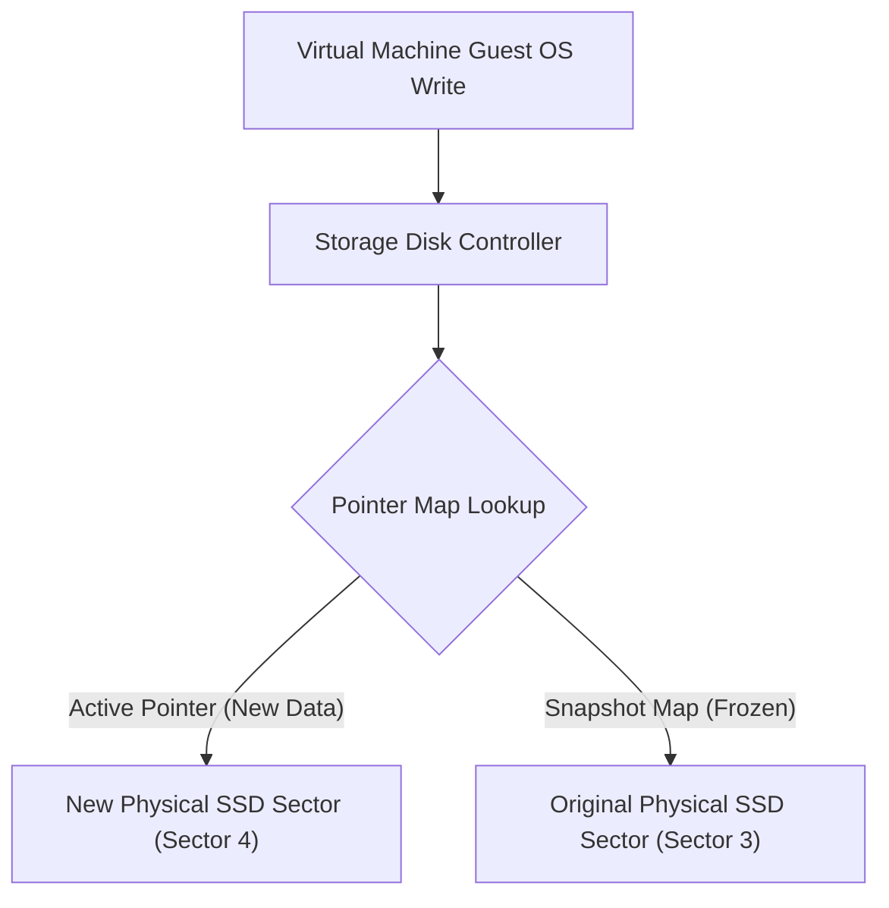
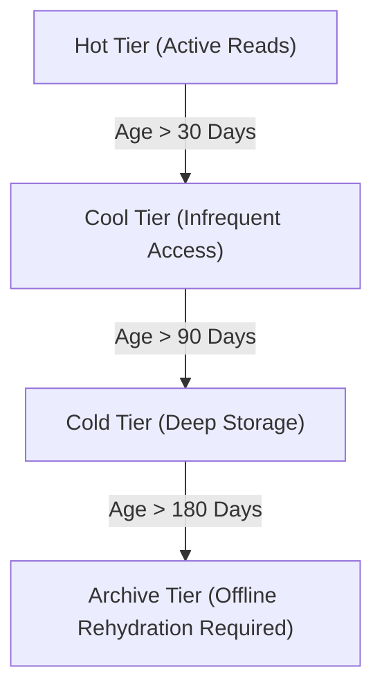

## Table of Contents

1. [What Is Backups and Retention](#what-is-backups-and-retention)
2. [Recovery Point Objectives (RPOs) and Recovery Time Objectives (RTOs)](#recovery-point-objectives-rpos-and-recovery-time-objectives-rtos)
3. [Blob Storage Durability and Lifecycle Rules](#blob-storage-durability-and-lifecycle-rules)
4. [Database Recovery (SQL and Cosmos DB)](#database-recovery-sql-and-cosmos-db)
5. [Disk Volume and Network File Share Recovery](#disk-volume-and-network-file-share-recovery)
6. [Safe Deletion Policies and Dry Runs](#safe-deletion-policies-and-dry-runs)
7. [Putting It All Together](#putting-it-all-together)
8. [What's Next](#whats-next)

## What Is Backups and Retention

A data backup is a persistent, point-in-time copy of application state isolated from the primary running database or storage engine to guarantee recovery following data corruption, accidental deletion, or hardware failure. Retention is the operational policy that defines how long these recovery points remain valid and readable before they are permanently purged to minimize storage costs and comply with data privacy regulations. A backup architecture is not defined by how many copies are stored; it is defined by whether your engineering team can reliably restore the correct bytes to an active, operational production environment when an incident occurs.

If you host cloud systems on AWS, Azure's backup and recovery services map directly to your existing mental models:

* **Centralized Backups**: AWS Backup serves the same role as Azure Backup and the Azure Recovery Services Vault, coordinating centralized snapshot policies across multiple data resources.
* **Object Versioning and Locks**: Amazon S3 Versioning, Soft Delete, and Object Lock map to Azure Blob Storage Versioning, Soft Delete, and Immutable Storage WORM (Write Once, Read Many) policies.
* **Block Storage Snapshots**: Amazon EBS Snapshots correspond directly to Azure Managed Disk Snapshots, capturing volume sectors at a chosen timestamp.

Rather than relying on generic statements like "the cloud handles backups," engineering teams must evaluate each storage resource's replication limits, deletion protections, and point-in-time recovery constraints to build a verified restore strategy.

:::expand[Under the Hood: Redirect-on-Write Snapshots, Soft Delete Pools, and Immutable Vaults]{kind="design"}
Azure coordinates low-level storage fabric operations to generate recovery points without degrading primary application I/O performance:

* **Redirect-on-Write (RoW) Snapshots**: Traditional virtual disk systems use copy-on-write snapshots, which copy old data blocks to a separate backup file before overwriting the primary sector, causing a double-write performance penalty. Azure Managed Disks use redirect-on-write. When you create an incremental disk snapshot, the storage controller freezes the original block sectors (marked as Snapshot A) and updates the active pointer map. When the VM guest OS writes new data, the controller writes it to a new physical SSD sector and updates the active pointer map to point to the new sector, while Snapshot A's pointer map remains cabled to the original physical SSD sector. This ensures zero write-latency overhead.

* **Soft Delete Platform Pools**: When soft delete is enabled for Blob Storage or Azure Files, deleting a resource does not scrub the underlying SSD flash cells. Instead, the platform marks the object's metadata as deleted and shifts its directory pointer into a hidden platform garbage collection bin (the soft delete pool). The actual physical data blocks are preserved for the configured retention window (e.g., 14 days) and continue to be billed at standard rates. If an accident occurs, the platform restores the metadata pointers to the active directory tree.
* **Recovery Services Vault Immutability**: To protect backup recovery points from being deleted by compromised administrative credentials or ransomware scripts, Azure Recovery Services Vaults support Immutable Vault configurations. When locked, the policy uses WORM rules that prevent any caller (including root Subscription Owners and global Azure administrators) from deleting, overwriting, or shortening the retention period of existing backup points until their configured lifespan has expired.
:::

Understanding these underlying mechanisms ensures that recovery policies are configured with realistic expectations regarding latency, storage capacity growth, and security protection boundaries.

## Recovery Point Objectives (RPOs) and Recovery Time Objectives (RTOs)

Every data recovery plan is designed around two core metrics that dictate your technical choices and resource budgets:

* **Recovery Point Objective (RPO)**: The maximum acceptable age of the data that must be restored when recovery occurs, defining how much data loss the business can tolerate, measured in time. For example, if your checkout transaction logs are backed up every 5 minutes, your transaction RPO is 5 minutes.
* **Recovery Time Objective (RTO)**: The maximum acceptable duration of database downtime and system restoration before operations must be fully restored, measured in time.

| Data Asset | Shape | RPO Target | Technical Solution | RTO Driver |
| --- | --- | --- | --- | --- |
| Customer Orders | Relational | 5 Minutes | Continuous transaction log backups and geo-replicated Always On standbys. | Database connection redirect latency and client failover times. |
| Invoice PDFs | Object File | 24 Hours | Soft delete enabled for 30 days and cross-region blob replication. | Metadata restoration times and DNS record updates. |
| VM Operating System | Block Disk | 24 Hours | Scheduled daily incremental redirect-on-write managed disk snapshots. | Time required to provision a new VM and attach the restored disk. |
| Job Idempotency | NoSQL Item | 1 Hour | Periodic container backups and short-lived TTL configurations. | Time required to reconstruct missing processing checkpoints. |

To bridge the gap between these metrics and real-world incidents, your operations team must regularly test restore workflows. A backup is merely a promise until a successful restore demonstrates that your RTO can be met under active incident conditions.

## Blob Storage Durability and Lifecycle Rules

Unstructured files in Blob Storage require a combination of versioning, soft delete, and lifecycle policies to manage storage costs while protecting data integrity:

* **Object Versioning**: When versioning is enabled, modifying or overwriting a blob does not destroy the original bytes. Instead, the platform marks the modified blob as the active version and keeps the old version as a read-only historical copy. If a buggy export script overwrites customer profile blobs with empty structures, you can programmatically restore the previous version.
* **Soft Delete for Blobs**: This feature preserves deleted blobs, allowing you to restore them for a designated window (from 1 to 365 days). Soft delete is highly effective for recovering from accidental prefix deletions or wildcards run by automated cleanup daemons.
* **Lifecycle Management**: Keeping every version and soft-deleted blob forever on high-performance hot storage tiers will rapidly balloon your monthly Azure storage bill. Use lifecycle management policies to automate the movement of old blob versions to cooler, cost-optimized storage tiers based on their age:

Keep in mind that the Archive tier is offline storage. You cannot read archived blobs directly. To access an archived blob, you must execute a rehydration process, which copies the blob back to a Hot or Cool tier. Rehydration is not instant; depending on the priority selected (Standard vs. High), rehydration can take from one to fifteen hours to complete, directly impacting your recovery time objectives.

## Database Recovery (SQL and Cosmos DB)

Managed databases require robust point-in-time recovery plans due to the high transactional rate and relational complexity of the records they store:

* **Azure SQL Point-in-Time Restore**: Azure SQL Database automatically generates a continuous stream of transaction log backups every 5 to 10 minutes. When a bad database migration or accidental update corrupts production rows, triggering a PITR does not overwrite your active production database in place. Instead, the platform provisions a brand-new database beside the active instance. Once the restore finishes, your database administration team must surgically compare tables and run scripts to copy the corrected rows from the restored database back into the active production database, minimizing downtime.
* **Cosmos DB Backup Modes**: Cosmos DB supports two backup modes:
    * **Periodic Backup Mode**: The default mode, which takes database snapshots at a configured interval (e.g., every 4 hours) and keeps them in secondary regional storage. Restoring a periodic backup requires contacting Azure support, which directly extends your RTO.
    * **Continuous Backup Mode**: Allows you to restore a container self-service to any specific second within a 30-day window. Just like Azure SQL, the restore generates a new container instance, requiring you to update your application configuration paths or copy the restored JSON items back to the primary container.

Configure your database resources with continuous backup modes for critical transactional containers, and ensure that your database permissions restrict who can execute schema migrations.

## Disk Volume and Network File Share Recovery

Virtual machines and legacy shared folders rely on block-level and file-system level recovery tools to protect mounted volumes:

* **Managed Disk Snapshots**: Disk snapshots are incremental, redirect-on-write recovery points that capture a VM managed disk's sector map. When you restore a managed disk snapshot, you create a new Azure Managed Disk resource from the snapshot. To use the recovered disk, you must stop the active VM, detach the corrupted disk, attach the newly provisioned disk to the VM's storage controller interface, and reboot the operating system.
* **Azure Files Share Snapshots**: A share snapshot is a read-only, point-in-time copy of an Azure Files network share. Share snapshots capture the file system directory structure and active files, allowing you to restore individual files or the entire share using standard protocols like SMB or NFS. Integrate your Azure Files shares with Azure Backup to manage snapshot retention schedules centrally and protect shared templates or legacy directories from deletion.

Avoid utilizing disk snapshots as a generic database backup solution. Because a database engine keeps active pages in memory, capturing a disk snapshot of a running VM database without freezing database writes will result in a crash-consistent backup that may suffer from data corruption when restored.

## Safe Deletion Policies and Dry Runs

The most effective way to optimize your recovery system is to prevent accidental deletions from occurring in the first place. Establish clear operational boundaries around destructive changes:

* **Resource Locks (ReadOnly and CanNotDelete)**: Apply `CanNotDelete` resource locks to production logical servers, storage accounts, and key vaults. These locks prevent administrators from accidentally deleting entire resources through the Azure portal or CLI commands. The lock must be explicitly removed before the resource can be deleted.
* **Dry-Run Validations**: Any automated script that deletes expired blobs, drops database tables, or prunes snapshots must support a dry-run flag. The script must log the target scope and print the exact list of files or rows scheduled for deletion without executing the changes, allowing engineers to verify the logic before executing destructive tasks.

| Before Deleting | Verification Question | Operational Requirement |
| --- | --- | --- |
| **Target Scope** | Which exact Subscription, Resource Group, and storage resource is the script targeting? | Require explicit env variables instead of defaulting to active CLI sessions. |
| **Match Criteria** | What prefix, tags, age filters, or row parameters are matching the target data? | Validate that matching criteria do not contain wildcards that match production. |
| **Restore Path** | If this deletion is incorrect, how will the team recover the deleted data? | Verify that soft delete or backups are actively enabled on the target resource. |
| **Approval** | Who reviewed the dry-run logs and approved the execution of this script? | Require two-person approval for destructive production cleanups. |

Adopting these practices transforms safe deletion from an ad-hoc action into a standardized operational pipeline, reducing the likelihood of data-loss events.

## Putting It All Together

Designing resilient cloud architectures requires matching each data asset to its correct backup, retention, and restore workflow.

* **Decoupled Vaults**: Coordinate daily and weekly backups using Azure Backup and Recovery Services Vaults, configuring Immutable Vault rules to protect recovery points from ransomware.
* **Low-Latency Snapshots**: Utilize redirect-on-write managed disk snapshots to capture VM volume sectors without impacting active disk I/O performance.
* **Soft Delete Buffers**: Enable soft delete pools for Blob Storage and Azure Files to keep deleted files in a hidden, recoverable bin during the retention window.
* **Point-in-Time Restore**: Leverage continuous transaction log backups to execute millisecond-precise Point-in-Time Restores for Azure SQL databases and Cosmos DB containers.
* **Tier Optimization**: Pair Blob versioning with lifecycle management rules to transition older versions to Cool, Cold, and Archive tiers, taking into account rehydration latencies.
* **Operational Defense**: Apply `CanNotDelete` resource locks to critical production endpoints, and enforce dry-run validations on all automated cleanup scripts to prevent accidental data-loss incidents.

## What's Next

Now that we have fully explored the Storage and Databases module—covering Blob Storage, Disks, File Shares, Relational Databases, NoSQL document containers, and data recovery systems—we will transition to the next module. In the next chapter, we will explore Identity and Security, examining Microsoft Entra ID, Azure Role-Based Access Control (RBAC), and network security boundaries.

---

**References**

* [Azure Backup documentation](https://learn.microsoft.com/en-us/azure/backup/)
* [Soft delete for Azure Storage blobs](https://learn.microsoft.com/en-us/azure/storage/blobs/soft-delete-blob-overview)
* [Point-in-Time Restore in Azure SQL Database](https://learn.microsoft.com/en-us/azure/azure-sql/database/recovery-using-backups)
* [Continuous backup with point-in-time restore in Azure Cosmos DB](https://learn.microsoft.com/en-us/azure/cosmos-db/continuous-backup-restore-introduction)
* [Managed disk incremental snapshots](https://learn.microsoft.com/en-us/azure/virtual-machines/disks-incremental-snapshots)
