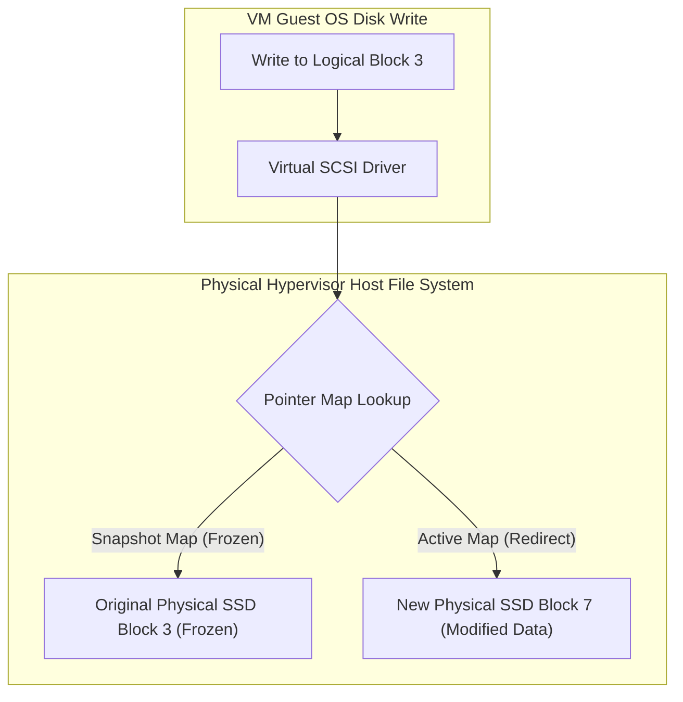
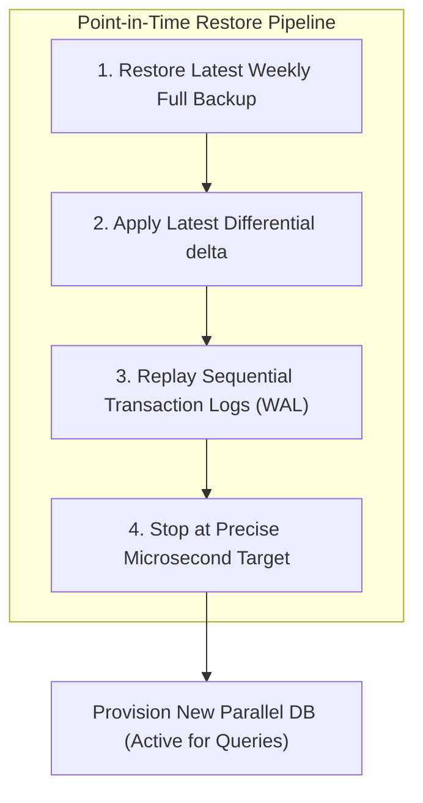
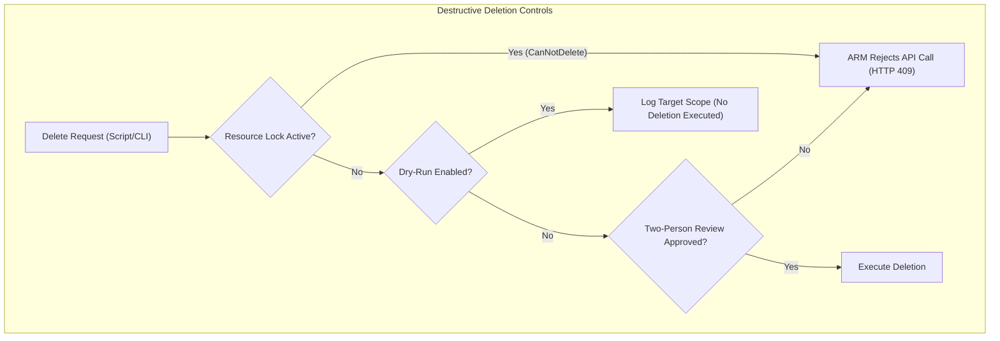

## Table of Contents

1. [The Problem: The Illusory Safety of Backups](#the-problem-the-illusory-safety-of-backups)
2. [Recovery Point Objectives (RPOs) and Recovery Time Objectives (RTOs)](#recovery-point-objectives-rpos-and-recovery-time-objectives-rtos)
3. [Declarative Recovery Services Bicep and Restore CLI Previews](#declarative-recovery-services-bicep-and-restore-cli-previews)
4. [Under the Hood: Redirect-on-Write Snapshots and Hidden Soft Delete Indices](#under-the-hood-redirect-on-write-snapshots-and-hidden-soft-delete-indices)
5. [Database Point-in-Time Restore Mechanics](#database-point-in-time-restore-mechanics)
6. [Surgical Data Synchronization and T-SQL Verification](#surgical-data-synchronization-and-t-sql-verification)
7. [Recovery Services Vault Immutability Locks](#recovery-services-vault-immutability-locks)
8. [Safe Deletion Policies and Dry Runs](#safe-deletion-policies-and-dry-runs)
9. [Putting It All Together](#putting-it-all-together)
10. [What's Next](#whats-next)

## The Problem: The Illusory Safety of Backups

A backup and retention design is the recovery contract for your data: it defines what copy exists, how far back you can restore, how long recovery takes, and what deletion protections stand between an error and permanent loss.

When managing cloud storage architectures, engineering teams frequently operate under a dangerous security illusion.
We configure scheduled backups, verify that the green completion checkmarks appear in our administrative dashboards, and assume our systems are fully protected.
Then, a real disaster occurs.

An engineer accidentally runs an unvalidated database optimization script against the active production environment instead of the staging database, dropping critical payment ledger tables.
The application immediately crashes, users flood the support channels, and the business faces significant financial losses.
The operations team opens the backup vault, only to discover that mounting the backup files requires manual schema conversions.
They find that the database restoration takes ten hours to copy the raw gigabyte files over the regional virtual network.

Furthermore, they realize that swapping the active connection string immediately to the restored database will erase all legitimate customer transactions that occurred between the corruption event and the restore start.
A backup architecture is not defined by how many compressed archive files are stored in your storage vaults.
It is defined solely by whether your engineering team can reliably restore the correct bytes to an active, operational production environment within your business downtime constraints.
To build a trustworthy recovery system, we must look beneath the high-level dashboard metrics and design precise point-in-time restores, soft-delete safety zones, and immutable backup locks.

## Recovery Point Objectives (RPOs) and Recovery Time Objectives (RTOs)

RPO and RTO are the two numbers that turn recovery from a vague promise into an engineering target. Every data recovery plan is designed around these core metrics because they dictate your technical choices and resource budgets.

First is the Recovery Point Objective (RPO).
This is the maximum acceptable age of the data that must be restored when recovery occurs.
It defines how much data loss the business can tolerate during an outage, measured in units of time.
For example, if your payment database flushes transaction logs to secondary storage every five minutes, your transaction RPO is five minutes.

Second is the Recovery Time Objective (RTO).
This is the maximum acceptable duration of database downtime and system restoration before application operations must be fully restored to users.

If you host cloud systems on AWS, Azure's backup and recovery services map directly to your existing mental models.
AWS Backup serves the same role as Azure Backup and the Azure Recovery Services Vault, coordinating centralized snapshot policies across multiple data resources.
Amazon S3 Versioning, Soft Delete, and Object Lock map to Azure Blob Storage Versioning, Soft Delete, and Immutable Storage WORM (Write Once, Read Many) policies.
Amazon EBS Snapshots correspond directly to Azure Managed Disk Snapshots, capturing volume sectors at a chosen timestamp.

| Data Asset | Shape | RPO Target | Technical Solution | RTO Driver |
| --- | --- | --- | --- | --- |
| Customer Orders | Relational | 5 Minutes | Azure SQL automated backups for PITR, with separate high-availability or geo-replication design if the workload also needs fast failover. | Restore duration, data comparison time, and connection redirect latency. |
| Invoice PDFs | Object File | 24 Hours | Soft delete enabled for 30 days and cross-region blob replication. | Metadata restoration times and DNS record updates. |
| VM Operating System | Block Disk | 24 Hours | Scheduled daily incremental redirect-on-write managed disk snapshots. | Time required to provision a new VM and attach the restored disk. |
| Job Idempotency | NoSQL Item | 1 Hour | Periodic container backups and short-lived TTL configurations. | Time required to reconstruct missing processing checkpoints. |

## Declarative Recovery Services Bicep and Restore CLI Previews

To manage VM and disk recovery centrally, we deploy a Recovery Services Vault with an active backup policy using a declarative Bicep configuration.
The template below establishes the vault and configures a daily backup policy.

```bicep
resource recoveryVault 'Microsoft.RecoveryServices/vaults@2023-04-01' = {
  name: 'vault-recovery-prod'
  location: resourceGroup().location
  sku: {
    name: 'RS0'
    tier: 'Standard'
  }
  properties: {
    publicNetworkAccess: 'Disabled'
  }
}

resource backupPolicy 'Microsoft.RecoveryServices/vaults/backupPolicies@2023-04-01' = {
  parent: recoveryVault
  name: 'policy-daily-vm'
  properties: {
    backupManagementType: 'AzureIaasVM'
    schedulePolicy: {
      schedulePolicyType: 'SimpleSchedulePolicy'
      backupPeriodFrequency: 'Daily'
      scheduleRunTimes: [
        '2026-05-31T23:00:00Z'
      ]
    }
    retentionPolicy: {
      retentionPolicyType: 'LongTermRetentionPolicy'
      dailySchedule: {
        retentionTimes: [
          '2026-05-31T23:00:00Z'
        ]
        retentionDuration: {
          count: 30
          durationType: 'Days'
        }
      }
    }
    timeZone: 'UTC'
  }
}
```

Once the backup policies are active, we can manage restores programmatically.
The Azure CLI commands below check the status of active backups and trigger a disk recovery from our daily snapshot.

```plain
az backup item list \
  --resource-group rg-ecommerce-prod \
  --vault-name vault-recovery-prod \
  --output table

az backup restore restore-disks \
  --resource-group rg-ecommerce-prod \
  --vault-name vault-recovery-prod \
  --container-name vm-app-server-01 \
  --item-name vm-app-server-01 \
  --rp-name latest-daily-snapshot \
  --storage-account saecommercefiles \
  --target-resource-group rg-ecommerce-prod
```

## Under the Hood: Redirect-on-Write Snapshots and Hidden Soft Delete Indices

Redirect-on-write snapshots and soft delete indices are two storage-engine patterns for preserving previous state without copying every byte immediately. They exist so Azure can keep recovery points available while active disks, blobs, and file shares continue serving normal traffic.

Example: a managed disk snapshot can preserve the old version of block `3` while the VM writes a new version elsewhere, and Blob soft delete can hide a deleted object from normal listings while keeping its metadata recoverable during the retention window.

To guarantee that backup processes do not degrade active application performance, Azure storage engines utilize virtualized block structures and logical indexing tricks.
The underlying mechanics differ significantly depending on the resource type.

Incremental Managed Disk Snapshots utilize a Redirect-on-Write (RoW) allocation design.
When an administrator triggers a disk snapshot, the host hypervisor storage controller does not copy the physical disk blocks to a secondary file.
Instead, the controller freezes the active pointer map of the virtual disk at that precise microsecond.

When the virtual machine guest OS issues subsequent write commands to modify existing data, the host hypervisor intercepts the command.
It redirects the write to a newly allocated physical SSD sector on the storage cluster, leaving the original sector untouched.
The snapshot map continues to point to the original, frozen sector, while the active VM pointer map is updated to point to the new sector coordinates.



By utilizing Redirect-on-Write, Azure eliminates the high write latency penalty of legacy Copy-on-Write (CoW) systems, which require reading the old block, writing it to the snapshot space, and then overwriting the original block.
An incremental snapshot only stores the delta blocks since the previous snapshot, saving storage space.

Soft Delete for Blob Storage and Azure Files utilizes logical index decoupling rather than data erasure.
When a user deletes a blob container, a file share, or an individual document, the underlying storage controller does not clear the physical NVMe sectors or launch a disk scrubbing sweep.

Instead, it detaches the targeted object metadata pointer from the public directory prefix index.
It moves the pointer to a hidden, isolated secondary logical directory index that is inaccessible to standard REST API list requests.
The physical sectors remain fully intact on the SSD hardware, and a metadata leasing timer (representing the retention window) begins counting down in the storage metadata engine.

If an administrator triggers a restore request within the retention window, the storage controller simply moves the metadata pointer back to the active public directory prefix index, instantly recovering the object.
Once the leasing timer reaches zero, a background garbage collection daemon asynchronously reclaims and overwrites the physical SSD blocks.

## Database Point-in-Time Restore Mechanics

Point-in-time restore (PITR) is a restore pipeline that rebuilds a separate database at a selected timestamp. Managed relational databases like Azure SQL Database and NoSQL engines like Azure Cosmos DB provide point-in-time recovery by continuously streaming transaction logs.
Understanding how these databases recover state requires looking at the sequence of full, differential, and transaction log files.

Azure SQL Database automatically schedules full database backups every week, differential backups every 12 to 24 hours, and transaction log backups every 5 to 10 minutes.
When you trigger a point-in-time restore, the Azure database fabric does not execute an in-place rollback on your active database.
Instead, it provisions a brand-new, parallel database instance inside your SQL server scope.



To reconstruct the database state to the exact second you requested, the restore engine first provisions the baseline weekly full backup.
It then applies the latest differential backup delta to skip ahead 12 hours.
Finally, it mounts the continuous transaction log stream and sequentially replays the write-ahead log (WAL) transaction entries, stopping at the precise microsecond timestamp you declared.

Once the log replay completes, the new parallel database is brought online.
Your application connection strings are not automatically updated.
To complete the recovery, your team must execute a manual connection string swap.
Alternatively, you must run custom data surgery scripts to copy the dropped tables or corrected records from the restored parallel database back into the active production database, ensuring you do not overwrite healthy transactions that occurred during the restore window.

## Surgical Data Synchronization and T-SQL Verification

Surgical data synchronization is the process of copying only the missing or corrected rows from a restored database back into the active one. It exists because a full restore can discard valid transactions that happened after the failure.

Example: if `db-ecommerce-prod` lost 200 orders from `13:00` to `13:05`, the team can restore `db-ecommerce-restore-pitr` to `13:04` and copy only the missing order rows instead of replacing the entire live database.

When a database point-in-time restore completes, the DBA team is presented with two active databases: the live, corrupted database `db-ecommerce-prod` and the restored parallel snapshot database `db-ecommerce-restore-pitr`.
To recover the dropped transaction tables without overwriting or losing the live orders that were placed between the corruption window and the restoration completion, we must perform surgical table copies.

First, we establish a linked server or configure cross-database query credentials.
The T-SQL transaction script below demonstrates how we safely isolate missing transactions, compare table states, copy missing rows, and reconcile primary keys.

```sql
BEGIN TRANSACTION;

INSERT INTO db-ecommerce-prod.dbo.Orders (
    OrderId,
    CustomerId,
    Amount,
    OrderStatus,
    CreatedTimestamp
)
SELECT
    r.OrderId,
    r.CustomerId,
    r.Amount,
    r.OrderStatus,
    r.CreatedTimestamp
FROM db-ecommerce-restore-pitr.dbo.Orders r
WHERE NOT EXISTS (
    SELECT 1
    FROM db-ecommerce-prod.dbo.Orders p
    WHERE p.OrderId = r.OrderId
);

UPDATE p
SET
    p.OrderStatus = r.OrderStatus,
    p.ModifiedTimestamp = r.ModifiedTimestamp
FROM db-ecommerce-prod.dbo.Orders p
INNER JOIN db-ecommerce-restore-pitr.dbo.Orders r
    ON p.OrderId = r.OrderId
WHERE p.ModifiedTimestamp < r.ModifiedTimestamp;

COMMIT TRANSACTION;
```

This surgical copy approach guarantees that we maintain complete database continuity.
We preserve active transactional histories while successfully wiping out the effects of accidental schema drops or batch updates.

## Recovery Services Vault Immutability Locks

An immutability lock is a protection setting that prevents backup recovery points from being deleted or shortened before their retention period ends. It exists to keep recovery data available even if an attacker or administrator tries to remove backups.

Example: a locked vault policy can keep daily VM backups for 30 days, and no subscription owner can delete those recovery points early after the policy is locked.

When you enable an immutability lock, the security boundaries of the ARM control plane are updated.

The lock operates in two sequential phases:

* **Unlocked State**: Allows the security administrator to test policies, adjust retention durations, and evaluate lock rules. The lock can be disabled or modified during this testing window.
* **Locked State**: Once the administrator locks the vault policy, the configuration becomes completely irreversible. The ARM control plane enforces a strict Write-Once-Read-Many (WORM) security block.

Once the vault is locked, the platform blocks all delete requests targeting active recovery points.
No user, not even the subscription owner or a global administrator holding full contributor roles, can delete a backup, shorten a retention duration, or disable the immutability lock.
The only way a backup recovery point can be removed is through the natural expiration of its configured retention duration, ensuring that ransomware cannot wipe out your recovery path.

## Safe Deletion Policies and Dry Runs

The most effective way to optimize your recovery system is to prevent accidental deletions from occurring in the first place.
Establish clear operational boundaries around destructive changes:



Apply `CanNotDelete` resource locks to critical production resource groups, database servers, and key vaults.
These locks block any delete API call at the ARM control plane, requiring an administrator to explicitly delete the lock before the resource can be removed.

Furthermore, ensure that any automated clean-up script that deletes old blobs, prunes snapshots, or drops databases supports a mandatory dry-run validation flag.
The script must log the target scope and print the exact list of files scheduled for deletion without executing the changes, allowing engineers to verify the logic before executing destructive tasks.

| Before Deleting | Verification Question | Operational Requirement |
| --- | --- | --- |
| **Target Scope** | Which exact Subscription, Resource Group, and storage resource is the script targeting? | Require explicit env variables instead of defaulting to active CLI sessions. |
| **Match Criteria** | What prefix, tags, age filters, or row parameters are matching the target data? | Validate that matching criteria do not contain wildcards that match production. |
| **Restore Path** | If this deletion is incorrect, how will the team recover the deleted data? | Verify that soft delete or backups are actively enabled on the target resource. |
| **Approval** | Who reviewed the dry-run logs and approved the execution of this script? | Require two-person approval for destructive production cleanups. |

## Putting It All Together

Designing resilient cloud architectures requires matching each data asset to its correct backup, retention, and restore workflow.

* **Decoupled Vaults**: Coordinate daily and weekly backups using Azure Backup and Recovery Services Vaults, configuring Immutable Vault rules to protect recovery points from ransomware.
* **Incremental Snapshots**: Use managed disk incremental snapshots to capture VM disk recovery points efficiently, and validate the restore workflow before relying on them during an outage.
* **Soft Delete Buffers**: Enable soft delete pools for Blob Storage and Azure Files to keep deleted files in a hidden, recoverable bin during the retention window.
* **Point-in-Time Restore**: Use Azure SQL and Cosmos DB point-in-time restore features to recover to a selected moment in the supported retention window, then reconcile restored data with live application state.
* **Tier Optimization**: Pair Blob versioning with lifecycle management rules to transition older versions to Cool, Cold, and Archive tiers, taking into account rehydration latencies.
* **Operational Defense**: Apply `CanNotDelete` resource locks to critical production endpoints, and enforce dry-run validations on all automated cleanup scripts to prevent accidental data-loss incidents.

## What's Next

Now that we have fully explored the Storage and Databases module - covering Blob Storage, Disks, File Shares, Relational Databases, NoSQL document containers, and data recovery systems - we will transition to the next major module.
In the next chapter, we will explore Submodule 6: Deployment, Runtime & Operations.
We will examine declarative infrastructure pipelines, App Configuration engines, and safe zero-downtime release rollouts.

---

**References**

* [Azure Backup documentation](https://learn.microsoft.com/en-us/azure/backup/) - Central coordination of snapshots and backup policies.
* [Soft delete for Azure Storage blobs](https://learn.microsoft.com/en-us/azure/storage/blobs/soft-delete-blob-overview) - Guide to hidden garbage-collection directories.
* [Point-in-Time Restore in Azure SQL Database](https://learn.microsoft.com/en-us/azure/azure-sql/database/recovery-using-backups) - Walkthrough of weekly, differential, and WAL replays.
* [Continuous backup with point-in-time restore in Azure Cosmos DB](https://learn.microsoft.com/en-us/azure/cosmos-db/continuous-backup-restore-introduction) - Continuous backups and restore parallel account behaviors.
* [Managed disk incremental snapshots](https://learn.microsoft.com/en-us/azure/virtual-machines/disks-incremental-snapshots) - Guide to Redirect-on-Write block structures.
* [Immutable vault support for Azure Backup](https://learn.microsoft.com/en-us/azure/backup/backup-azure-immutable-vault-concept) - Technical analysis of WORM policies in Recovery Services Vaults.
