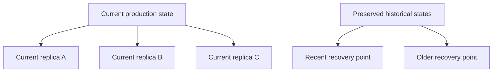

## Table of Contents

1. [What Does the Recovery Map Protect?](#what-does-the-recovery-map-protect)
2. [How Do Retention Windows Set Recoverability?](#how-do-retention-windows-set-recoverability)
3. [How Does Blob Storage Recovery Work?](#how-does-blob-storage-recovery-work)
4. [How Does Azure SQL Restore Work?](#how-does-azure-sql-restore-work)
5. [How Do Cosmos DB Backup Modes Differ?](#how-do-cosmos-db-backup-modes-differ)
6. [How Are Managed Disks and Azure Files Protected?](#how-are-managed-disks-and-azure-files-protected)
7. [How Do Vaults, Immutability, and Soft Delete Help?](#how-do-vaults-immutability-and-soft-delete-help)
8. [How Do You Practice Safe Deletion and Restore?](#how-do-you-practice-safe-deletion-and-restore)
9. [Check Your Answers](#check-your-answers)
10. [References](#references)

Three database replicas each contain a customer balance of £10,000. Then someone runs `UPDATE accounts SET balance = 0;`. Replication copies the update correctly, leaving all three replicas with a balance of £0. The storage can be durable and the service available while the data is wrong.

Backups exist for this situation: you need an earlier valid state, not another copy of the current one. Choosing how to preserve that history requires knowing what might fail, how much recent data you can lose, how long recovery may take, and how far into the past you might need to go.

The Azure features below address different parts of that requirement. These questions will help you choose between them and check that the resulting restore actually works:

1. **What Does the Recovery Map Protect?**
2. **How Do Retention Windows Set Recoverability?**
3. **How Does Blob Storage Recovery Work?**
4. **How Does Azure SQL Restore Work?**
5. **How Do Cosmos DB Backup Modes Differ?**
6. **How Are Managed Disks and Azure Files Protected?**
7. **How Do Vaults, Immutability, and Soft Delete Help?**
8. **How Do You Practice Safe Deletion and Restore?**

## What Does the Recovery Map Protect?
<!-- section-summary: Backups preserve earlier valid states, while replication protects the current state; recovery mechanisms must match the actual failure and restored object. -->

A database or filesystem changes over time. Imagine states A, B, C, and D at times T1, T2, T3, and T4. Under normal conditions, the application uses the latest state, D. If an accidental deletion produced D, however, the useful state is the last valid one before that change, perhaps C at T3.

A recovery system preserves enough history to return to that earlier state. That is different from keeping the current data available. Hardware durability protects against losing bytes because a device fails, and high availability keeps service running through supported infrastructure failures. Neither guarantee means an incorrect update can be undone.

### Separate replication from history

**Replication** maintains copies of the current state across infrastructure. It can protect against disk or hardware failures, some zone failures, and interruptions to service availability. It also normally propagates changes. A valid `DELETE file.txt` can remove the file from replica A, replica B, and replica C just as efficiently as a correct write reaches them all.

**Backup** preserves older states while the current state continues to change. You might retain yesterday's state, last week's, last month's, or last year's. Replication places current copies across space; backup history preserves recoverable states across time. Important systems commonly require both.


```mermaid
flowchart TD
    state["Current production state"] --> a["Current replica A"]
    state --> b["Current replica B"]
    state --> c["Current replica C"]
    history["Preserved historical states"] --> recent["Recent recovery point"]
    history --> older["Older recovery point"]
    class state workload
    class a,b,c,recent,older storage
    class history control
```

The two branches answer different failure questions. Current replicas can keep a good state accessible when infrastructure disappears. Historical points help when the current state itself is bad. A design review should name which failure each selected feature survives rather than counting how many copies exist.

### Match the failure to the recovery requirement

The recovery map begins with the object and the event that threatens it:

| Failure or request | Recovery requirement |
| --- | --- |
| A disk fails | Redundant or persistent storage |
| A VM fails | High availability or redeployment with persistent data |
| A user deletes one file | File or version recovery |
| A developer corrupts records | Database point-in-time recovery |
| An entire database is deleted | Database-level recovery |
| A Storage account is maliciously deleted | Isolated or vaulted recovery copies |
| An administrator deletes backups | Protected deletion and immutability |
| A region is unavailable | Geo-resilient recovery |
| An auditor requests records from seven years ago | Long-term retention |

The table explains why enabling one backup checkbox cannot answer every requirement. A recovery point inside an account may help undo a recent mistake while remaining vulnerable to destruction of that account. A long-term archive may preserve records for an audit while taking too long to restore for an urgent outage.

Before selecting technology, ask what can fail, what must be restored, how far back the recovery needs to reach, how much data loss is acceptable, and how quickly the system must recover. These questions define the needed recovery behavior before product names enter the decision.

### Understand the recovery mechanisms

**Soft delete** delays final destruction after a deletion. With a 14-day safety window, a deleted item remains recoverable between day 0 and the end of that window. This is useful for deletion mistakes, but it is not automatically a complete history of every earlier content state or every form of corruption.

**Versioning** retains previous states of an object. If `report.csv` progresses through V1, V2, V3, and current V4, a bad V5 can leave V4 available for recovery. Instead of treating the current object name as the only surviving state, you can retrieve or promote an earlier version.

A **snapshot** captures storage at a particular moment. If a disk changes through A, B, C, D, and E, a snapshot taken at C can preserve that state while the current disk advances to E. Modern snapshots are often incremental: an initial base is followed by changed data rather than copying all 10 TB again at every point.

**Point-in-time recovery**, or **PITR**, reconstructs an earlier timestamp using the relevant change history. **Operational backup** supports recent recovery near the source, while an **isolated or vaulted backup** places recovery information behind another boundary. Moving toward broader protection can increase cost, complexity, or restore duration, so these options must be judged against the actual requirement.

A snapshot's name alone does not establish independence. If the production disk and all its snapshots share an administrative security boundary, an attacker with sufficient permissions might delete both. Ask whether the failure or credentials that can destroy production can also destroy its recovery history. That question will return when we discuss vaults and immutability.

## How Do Retention Windows Set Recoverability?
<!-- section-summary: RPO measures acceptable recent data loss, RTO measures acceptable recovery time, and retention measures how long historical recovery states remain available. -->

A **recovery point** represents a state you can restore. Suppose backups occur at `00:00`, `06:00`, `12:00`, and `18:00`. If corruption occurs at `17:47`, the last clearly valid point may be the `12:00` backup. Restoring it would leave the changes between noon and `17:47` outside that restored state.

This immediately separates two questions: how close can the recovery point be to the failure, and how long does the restore take? They have different objectives and may require different technical choices.

### Set the loss and time objectives separately

The **Recovery Point Objective**, or **RPO**, describes how much recent data loss is acceptable. With one backup every 24 hours, a failure on Monday at `23:59` just before Tuesday's midnight backup could require returning almost a full day. Frequent or continuous recovery history can provide much finer granularity, such as selecting recent timestamps at `14:00`, `14:01`, `14:02`, and `14:03`.

The backup schedule illustrates potential granularity; the actual available, valid recovery points must support the objective. A configured schedule by itself does not prove that every expected backup completed or that each point predates the corruption.

The **Recovery Time Objective**, or **RTO**, describes how long the service may remain unavailable during recovery. Restoring a snapshot to a usable disk can have a very different duration from retrieving a 20 TB archive, transferring it, reconstructing a database, replaying logs, validating data, and starting the application.

Both systems can contain valid backups while serving very different recovery-time needs. RPO concerns how much recent work may be missing; RTO concerns how long the recovery process may take. Neither number describes how many years of history remain available.

### Distinguish frequency from retention

**Retention** is the length of time older recovery states are preserved. With seven-day retention, an eight-day-old point expires even if the system continues taking successful backups today. Backup frequency determines the spacing between recovery points; retention determines how long those points survive.

An hourly policy with two-day retention produces roughly 48 recent points. It offers fine recent granularity but little historical depth. A monthly policy retained for ten years provides much more history, but its points are widely spaced. Corruption discovered halfway through March can require selecting a much earlier monthly point rather than a timestamp close to March 15.

A practical design can therefore combine fine recent recovery with coarser long-term history. Recent points may be continuous, hourly, or daily. Older selected points may be weekly, while monthly or yearly points support historical retention. This approach reflects different recovery uses instead of treating every age of backup identically.

### Read the retention window as a moving boundary

On August 23, an approximately 30-day recovery window can reach back to July 24. On August 24, the earliest part of that history expires and July 25 is approximately the oldest available day. This is a **rolling retention window**: its start advances as time passes.

Long-term policies often select points instead of retaining every short-term point forever. An illustrative policy might retain daily points for 35 days, weekly points for 12 weeks, monthly points for seven years, and yearly points for ten years. The selected historical samples reduce storage consumption while preserving the intended audit or historical evidence.

The policy still has to match the event's discovery delay. If an error is not noticed until after its last valid recovery point expires, taking today's backups more frequently does not recover that lost history. Fine time precision and long historical reach remain independent requirements.

### Treat retention changes as data-protection changes

Reducing a retention window from 35 days to seven days can make the older points, from day minus 35 through day minus 8, eligible for removal. Azure SQL specifically warns that reducing PITR retention removes restoration ability outside the new window; see its [backup-settings guidance][13].

Increasing retention later cannot reconstruct points that were already discarded. If seven-day retention changes to 30 days today, the existing history still covers roughly seven days. A week later it may cover 14 days, and after another two weeks roughly 28 days, eventually reaching the intended 30-day window as new history accumulates.

This makes retention a consequential operational setting. Shortening it can remove recovery options. Lengthening it preserves future history but does not prove that the full newly configured window already exists. Before relying on a date in the past, inspect the recovery points actually available.

For an important customer database, write four requirements explicitly: RPO five minutes, RTO one hour, operational retention 35 days, and long-term retention seven years. These are example requirements, not a promise supplied by one setting. They make it possible to judge whether the selected Azure recovery mechanisms meet the intended behavior.

## How Does Blob Storage Recovery Work?
<!-- section-summary: Blob soft delete, versions, PITR, operational backup, and vaulted backup provide different recovery histories and source-failure boundaries. -->

Blob Storage illustrates the layered model because an object can have soft-delete protection, retained versions, point-in-time restore, and vaulted backup. Each feature protects a different aspect of the object's history or the account containing it.

**Blob soft delete** retains supported deleted or overwritten blob data for a configured period. Azure documents a range of **1 to 365 days** in the [soft-delete overview][1]. If `photo.jpg` is deleted, the configured recovery window can preserve the ability to undelete it before final removal.

The general soft-delete idea delays destruction; the particular behavior depends on the service and operation. It should not be treated as a substitute for deliberately retaining previous versions or establishing an independent backup boundary.

### Preserve earlier object content

Blob versioning can retain version 1, version 2, version 3, and current version 4 of a document. A mistaken overwrite of correct content can leave an earlier valid version available. Those versions remain until explicitly removed or removed by an applicable lifecycle policy.

Microsoft recommends combining versioning with soft delete for stronger Blob protection in the [same data-protection guidance][1]. The two features address related mistakes from different directions: versions preserve previous states, while soft delete provides a safety window around supported deletions and overwrites.

The existence of an old version is still a retention and access question. If a lifecycle policy or an authorized deletion removes it, that state is no longer available merely because versioning is enabled now. This follows the same rule as backup windows: current configuration cannot recreate discarded history.

### Recover many changes to an earlier time

Suppose a faulty deployment changes 100,000 blobs between `14:17` and `14:23`. Individually selecting and restoring each damaged object's earlier version would be difficult, especially if you do not know every affected name.

**Blob point-in-time restore** lets the recovery task identify a prior time, such as `14:16`, and restore the selected blob set toward that earlier state. It builds on underlying change, version, and deletion-history capabilities. Azure requires the PITR window to be shorter than the Blob soft-delete window, according to the [PITR overview][2].

That relationship is a configuration dependency, not just two unrelated durations. The higher-level timestamp restore needs the supporting history to remain available. A review must therefore check the combination rather than recording only that PITR is enabled.

### Choose operational and vaulted protection by failure boundary

**Operational protection** keeps recent history close to the production Storage account so recent mistakes can be undone. Azure Blob operational backup uses continuous protection built on Blob PITR and associated platform features.

**Vaulted backup** stores recovery points outside the source Storage account. Azure describes it as periodic protection with retention available up to **ten years**, while operational protection is continuous. The [Blob Backup overview][3] explains this distinction.

| Recovery need | Useful model |
| --- | --- |
| Quickly undo recent source-side changes | Operational history and PITR |
| Recover after broader source-account destruction | Recovery points outside the source account |
| Preserve selected historical points for years | Appropriate vaulted retention |

Consider an attacker who gains Storage permissions, deletes or encrypts blobs, removes previous versions, and deletes the Storage account. In-account protection remains valuable against ordinary mistakes, but an independently protected vault supplies another recovery boundary when the source is destroyed.

Immutability can protect those separate recovery points against premature deletion as well. The resulting cyber-recovery design must be assessed against what the attacker can control, rather than assuming an extra copy automatically survives the same compromise. We will examine that protection after the workload-specific restore mechanisms.

## How Does Azure SQL Restore Work?
<!-- section-summary: SQL backups and transaction history support recent timestamp recovery into a new database, while long-term retention preserves selected full backups for historical use. -->

A transactional database already records changes over time. Conceptually, its history might include an insert at `10:00`, an order update at `10:01`, an invoice deletion at `10:02`, and an account update at `10:03`. Database backups combined with transaction logs can reconstruct a state much closer to an exact time such as `10:02:37` than a single midnight filesystem copy.

To restore Wednesday at `14:37`, the recovery process can start with an appropriate base backup and apply later recorded changes until that target time. In a simplified sequence, the database starts from the full backup, replays changes through `14:35` and `14:36`, and stops at `14:37`.

This is the mechanism behind **point-in-time restore**. The full backup supplies a base state, and later history supplies changes needed to reach the chosen point. Fine-grained reconstruction is useful only while the necessary history remains within the supported recovery window.

### Use short-term and long-term retention for different jobs

Azure SQL Database automatically manages backups for PITR. Its ordinary default retention is **seven days**, generally configurable between **1 and 35 days**, with a smaller supported range for the Basic tier. **Long-term retention**, or **LTR**, can preserve selected full backups for **up to ten years**. These ranges and distinctions are described in the [automated-backup overview][4].

Recent PITR addresses questions such as recovering the state from ten minutes before a deletion. LTR addresses historical questions such as an audit, legal evidence, regulatory retention, year-end records, or investigation of older data.

For example, an organization might need operational recovery across the last 35 days and month-end backups retained for seven years. A seven-year archive is not normally the most useful response to a mistake made a few minutes ago. Conversely, a 35-day PITR window cannot supply records preserved in a much earlier year.

Using one retention strategy for both jobs can either waste storage on unnecessarily dense long-term points or leave insufficient detail for recent recovery. Naming the operational and historical requirements separately helps select the appropriate points to retain.

### Restore beside the existing database

Azure SQL PITR creates a **new database** rather than overwriting the existing database in place, as the [restore guidance][5] explains. This allows the current production database to remain available for inspection while the recovered database is validated.

The restored copy is a candidate for recovery work, not an automatic declaration that the incident is over. Compare it with the original, check the needed data, and determine whether to extract selected records or perform a controlled cutover. The separate destination gives you room to assess those choices before replacing the application's active data path.

### Follow an accidental deletion

Suppose this statement runs at `16:04`:

```sql
DELETE FROM Orders;
```

The mistake is discovered at `16:06`. The failure is logical database state. It does not, by itself, require another Azure region or a seven-year archive. The useful recovery category is a recent point-in-time restore before the deletion.

A database named `OrdersRecovery` can be restored to `16:03:59`, then inspected before data extraction or cutover. The exact target is chosen relative to the observed bad change, not merely because it is the newest available restore time. A newer point after `16:04` could already contain the deletion.

Now contrast an auditor asking for records preserved in **2021** while today's database is healthy. Operational PITR across 35 days is irrelevant to that request. A retained 2021 year-end point, alongside selected 2022, 2023, 2024, and 2025 year-end points, is the kind of historical coverage needed. These examples illustrate different recovery tasks using the same underlying principle of preserved earlier states.

## How Do Cosmos DB Backup Modes Differ?
<!-- section-summary: Periodic backup preserves discrete samples; continuous backup offers timestamp selection inside its retained window, but neither can restore history that has expired. -->

Cosmos DB exposes a distinction between **periodic** and **continuous** backup. A periodic policy captures discrete points separated by a schedule. Continuous protection instead supports selecting a timestamp within the available recovery window.

These models differ in recovery granularity. If backups are taken at `09:00` and `13:00`, corruption at `12:55` may leave the `09:00` point as the useful pre-corruption copy. A backup taken after the bad update may be more recent without containing the desired valid state.

Cosmos DB's periodic defaults are a full backup every **four hours**, retaining the latest **two** backups. The interval and retention can be changed within documented bounds. The [periodic-backup guide][6] explains this scheduled sampling model.

### Select a timestamp within continuous history

Continuous backup lets you choose a time inside the retained window. Suppose the database is good at `10:30`, a bad deployment starts at `10:31`, and the damage is noticed at `10:44`. Restoring to `10:30:59` targets the moment immediately before the faulty process began rather than choosing among much more widely spaced periodic copies.

As of August 2026, Cosmos DB documents continuous tiers with **seven-day and 30-day windows**, plus a **35-day tier in preview**. The [continuous-backup reference][7] distinguishes these options. The preview status matters when assessing whether the 35-day tier fits a production recovery requirement.

The finer time selection does not create unlimited historical reach. If corruption started 45 days ago but the retained continuous window covers only 30 days, the relevant valid state may already be gone. Precision within the window cannot restore a date outside it.

This is the same RPO-versus-retention distinction introduced earlier. One question asks how close you can get to a target time within preserved history. The other asks whether that history reaches far enough back to include the target at all.

### Match the mode to discovery and recovery needs

When comparing modes, identify the likely time between a bad change and its discovery. Then compare the needed granularity with the available retained window. A four-hourly history and a timestamp-based history can support different data-loss objectives even if they are both described broadly as backups.

Do not rely on the word continuous alone. Record which tier is configured, which window is available, and whether the required restore timestamp exists within it. Likewise, do not infer a long-term retention strategy from frequent recent capture. Historical retention needs remain separate from the ability to undo a recent deployment.

These checks keep the lesson consistent across services. Azure SQL, Cosmos DB, and Blob PITR have different implementations and limits, but all need preserved history that includes a suitable valid point. Choosing the correct workload feature starts with that recovery requirement.

## How Are Managed Disks and Azure Files Protected?
<!-- section-summary: Disk snapshots preserve block states with a specific consistency level; file and whole-share recovery use different mechanisms and must fit snapshot-count limits. -->

A Managed Disk presents block storage beneath a filesystem and, potentially, a database. A snapshot can capture its state at a time such as `10:00`, `12:00`, or `14:00`. **Azure Disk Backup** automates incremental managed-disk snapshots and their lifecycle.

The service describes these as **crash-consistent operational backups**. For VM or application-consistent protection where required, Azure directs you to the VM backup path. The [Disk Backup overview][8] explains that boundary, which is particularly important when the disk contains database files.

### Understand consistency at the captured moment

At the instant of a snapshot, a database may have transaction information in memory, partly updated data files on disk, and recovery information in its transaction log. A **crash-consistent** snapshot captures a state comparable to the storage state after a sudden loss of power.

A database may recover from that state using its normal crash-recovery mechanisms. However, the snapshot itself has not necessarily coordinated a clean checkpoint with the application. It records storage state rather than proving that every application-level operation is represented exactly as an application-aware backup would arrange it.

An **application-consistent** backup coordinates with the application. The backup process can ask the database to flush work, temporarily quiesce relevant activity, or otherwise participate before the snapshot. Quiescing means bringing activity to a controlled pause or stable point for that coordinated operation.

The distinction is therefore about the application's involvement in producing the recovery point. Storage consistency should not be automatically promoted to an application-consistency claim. A restore test must show that the actual application can recover and use the captured state under the selected mechanism.

### Separate a deleted file from a deleted share

Azure Files has at least two different deletion cases. Deleting `/shared/report.xlsx` removes one file. Deleting `/shared` removes the whole share. These require different recovery features.

**Share snapshots** preserve earlier file/share states and can support file recovery; see the [snapshot documentation][9]. **Azure Files soft delete** protects an accidentally deleted share as a whole, with a configurable retention range of **1 to 365 days**, described in the [share soft-delete guidance][10].

| Event | Relevant recovery mechanism |
| --- | --- |
| One file changes or is deleted | Earlier snapshot or backup containing that file |
| Entire share is deleted | Share soft delete, within its retained window |
| Broader protected recovery is required | Appropriate Azure Backup or vaulted protection |

The whole-share feature should not be mistaken for a history of every file edit. As elsewhere, name the object being restored before choosing the setting. An enabled share soft-delete policy does not answer the same question as whether yesterday's version of `report.xlsx` remains available.

### Calculate the number of retained snapshots

Azure Files allows up to **200 share snapshots per share**, according to the [snapshot reference][9]. This turns frequency and retention into a capacity calculation as well as a recovery choice. For a regularly spaced policy, the number of points is approximately the capture frequency multiplied by the retention duration.

$$
\text{recovery points} \approx \text{snapshots per day} \times \text{retention in days}
$$

At four snapshots per day for 30 days, the policy produces `4 × 30 = 120` points. At 24 snapshots per day for the same period, it produces `24 × 30 = 720`, exceeding that 200-snapshot limit.

A fixed point limit means that increasing frequency may require shorter retention or a different recovery strategy. Storage consumption, frequency, retention, point count, service limits, and cost all constrain the design together. Calculating only the interval between snapshots misses whether the accumulated history can fit.

The workload map is therefore broader than a single snapshot feature. Managed Disks can use snapshots, Disk Backup, and VM/application-aware backup where needed. Azure Files can use share snapshots, share soft delete, and Azure Backup or vaulted protection. The choice depends on the restored object, consistency requirement, and failure boundary.

## How Do Vaults, Immutability, and Soft Delete Help?
<!-- section-summary: Backup isolation separates recovery data from source compromise, while immutability and backup soft delete protect the retained points themselves. -->

Suppose production data, snapshots, and backup configuration are all controlled through the same credentials. An attacker who steals those credentials may delete production, delete snapshots, disable backup, and remove the remaining recovery points. Backups existed, but the protection did not survive the threat being designed against.

A vault helps establish another boundary for the recovery data. The production environment sends backup information through a controlled process to retained points outside the immediate source environment. This is **backup isolation**: separating the recovery history from the failure or compromise that can destroy the live system.

The word vault is still not a substitute for reviewing actual control. Ask who can delete its points, whether the same administrator or compromised subscription controls both environments, whether source deletion affects the copy, and whether the relevant attacker can shorten retention. The useful boundary is the one that survives the specified risk.

### Protect the retained history from premature deletion

**Immutability** restricts modification or deletion before the protected retention period expires. A normal backup might be retained because administrators usually choose not to delete it. An immutable configuration enforces restrictions through the system itself.

Azure Backup immutable vaults can block operations that would destroy recovery points early or reduce protected retention. The immutability setting can be locked irreversibly, preventing it from being disabled; supported locked configurations use WORM-style protection. **WORM** means Write Once, Read Many. The [immutable-vault documentation][11] explains these controls.

This is relevant to ransomware because attackers often look for snapshots, replicas, backups, and recovery accounts as well as live files. If they can encrypt production and delete ordinary snapshots but cannot remove a protected recovery point before its allowed expiry, a recovery option can remain.

Immutability must match the configuration and supported behavior. Do not infer that merely having a vault enables every immutable guarantee. Check the setting, whether it is locked, and the protected operations as part of the actual backup design.

### Design retention and immutability together

Suppose the requirement is to preserve a recovery point for seven years. A seven-year policy that an attacker can immediately reduce to one day offers a weaker guarantee than its displayed duration suggests. Protecting against that reduction is part of preserving the history.

Azure's immutable-vault behavior restricts policy changes that reduce existing retention. An attempt to shorten protected seven-year history to one day can therefore be rejected rather than making the points eligible for early deletion. This connects the retention requirement directly to protection of the backup configuration.

Retention states how long a point should survive. Immutability helps enforce that survival against premature deletion or policy changes within the supported protection model. Treating them together is important for both compliance-related retention and recovery from source compromise.

### Keep a safety window for deleted backups

Backup systems can also provide **soft delete for backup data**. Instead of a backup deletion request immediately destroying the recovery data, the deleted points enter an additional recoverable safety period before permanent removal.

Azure Backup guidance describes a **14-day default** safety period, with extended configurable retention in supported configurations. The [data-protection best-practices guide][12] covers this behavior. This is distinct from soft delete on production objects: one protects live-service deletions, while the other protects the recovery system's own data.

The layers can therefore include production soft delete, retained versions, operational PITR, isolated vaulted copies, immutability, and backup soft delete. Each protects a different event or boundary. Their value comes from covering the identified failure cases, rather than from treating every feature as an interchangeable backup copy.

## How Do You Practice Safe Deletion and Restore?
<!-- section-summary: Treat deletion and retention changes as recovery decisions, and validate restores through application and business checks while measuring total recovery time. -->

Before deleting important production data, identify the latest valid recovery point, where it is stored, how long it will remain, and whether it can still be restored after the source is gone. Check whether that restore has actually been tested. A green backup-job indicator does not answer all of those questions.

A safe lifecycle verifies the backup and retention, performs a restore test, deletes production only under the intended procedure, preserves the recovery copy through the safety period, and eventually lets it expire according to policy. The deletion is part of a data-recovery lifecycle, not merely removal of an Azure resource.

Retention reductions deserve the same care. They can remove older recovery choices even when production remains untouched. Raising the setting again does not recreate the lost states. Before either deletion or policy change, review which historical recovery options will cease to exist.

### Test more than job completion

A backup that reports success may still fail to support recovery because permissions are missing, the chosen destination is unsupported, an encryption key is unavailable, the application cannot start, important logical data is wrong, retention was misunderstood, or restoring takes 18 hours when the service can tolerate much less.

A restore drill tests these assumptions before an incident. For a database, select a recovery point, restore it, confirm the database opens, run consistency checks, validate important tables, connect the application, perform a relevant business transaction, and measure the total duration.

That final measurement is needed to judge the RTO. Timing only creation of the restored database omits work required to make the application usable. The service's recovery objective concerns the whole recovery procedure, including validation and the application's return to its intended operation.

Similarly, the selected point must meet the RPO and contain the correct state. A technically successful restore from after a destructive update can faithfully reproduce the problem. Validating data is how the drill distinguishes a recoverable earlier state from an arbitrary available copy.

### Match evidence to the business requirement

Suppose the platform reports “restore succeeded,” but the application reveals that customer orders are missing. The infrastructure operation completed, yet the business recovery requirement was not met. Evidence must reach the highest relevant layer: infrastructure, storage, database, application, and the required business data.

This does not mean every drill needs an unrelated full business simulation. It means the validation should demonstrate the particular recovery claim. If the objective is restoring customer records, inspect those records and the application operation that depends on them rather than stopping at a healthy database process.

Keep the three earlier examples separate. The accidental SQL deletion at `16:04` calls for recent operational recovery to a valid point such as `16:03:59`. An attacker who destroys a Storage account calls for recovery data that survived outside the compromised source boundary. An auditor requesting preserved 2021 records calls for an appropriate long-term point. The evidence for success differs because the requirements differ.

### Review the complete protection design

A layered architecture can include availability to keep the current service running, recent operational recovery to undo mistakes, isolated recovery to survive source destruction, long-term retention for historical needs, and immutability to protect recovery points themselves.

For each important workload, record the four numbers from earlier: RPO, RTO, operational retention, and long-term retention. Then add the failure boundary. Can one administrator destroy production and backup? Can one compromised subscription affect both? Does source deletion remove the recovery copy? Can a retention change erase required history? Can ransomware delete the surviving points?

If a risk matters and the current design cannot survive it, strengthen isolation or protected retention rather than assuming another frequent source-side snapshot solves the problem. Conversely, use recent operational mechanisms for the quick rollback cases they are suited to rather than depending on a slow historical archive for every incident.

The final recovery decision follows a clear order. Determine what happened and what must be restored. Identify when the data was last good. Check the required precision and historical reach, the allowed restore duration, and the boundary the recovery point must survive. Then select and test the appropriate combination of soft delete, versioning, snapshots, PITR, vaults, LTR, and immutability.

This is what makes a backup design useful in practice: recoverable historical states for known failure scenarios, with measured recovery behavior and protected retention. The successful restore, including the required application and data checks, is the evidence that the design can do its job.

## Check Your Answers

:::expand[What Does the Recovery Map Protect?]{kind="recap"}
It connects a failure to the object and earlier state that must be recovered. Replication preserves current copies through infrastructure failures, while backup history helps when the current data is wrong. File deletion, logical corruption, source destruction, and historical requests require different protection.
:::

:::expand[How Do Retention Windows Set Recoverability?]{kind="recap"}
RPO concerns acceptable recent data loss, RTO concerns recovery duration, and retention concerns historical reach. Frequent points can still expire quickly. Reducing retention can remove options, while increasing it cannot recreate history that was already discarded.
:::

:::expand[How Does Blob Storage Recovery Work?]{kind="recap"}
Blob soft delete provides a recovery window, versions preserve prior object states, and PITR supports timestamp-based recovery using retained history. Operational backup supports recent recovery near the source; vaulted points provide a separate boundary and longer retention for broader failures.
:::

:::expand[How Does Azure SQL Restore Work?]{kind="recap"}
Database backups and transaction history reconstruct a selected recent time. PITR restores into a new database for validation rather than overwriting production. Short-term history addresses recent mistakes; selected LTR full backups address historical and audit needs.
:::

:::expand[How Do Cosmos DB Backup Modes Differ?]{kind="recap"}
Periodic backup preserves scheduled samples, while continuous backup allows timestamp selection within its retained window. The default periodic schedule is four-hourly with two latest copies. Continuous precision still cannot recover a valid state outside the configured historical window.
:::

:::expand[How Are Managed Disks and Azure Files Protected?]{kind="recap"}
Disk Backup automates incremental crash-consistent snapshots; application-aware recovery may require VM backup. File recovery can use share snapshots or backups, while share soft delete protects deletion of the whole share. Frequency and retention must fit limits such as 200 share snapshots.
:::

:::expand[How Do Vaults, Immutability, and Soft Delete Help?]{kind="recap"}
Isolation separates recovery data from the source failure boundary. Immutability restricts premature deletion and retention reduction, with irreversible locking where configured. Backup soft delete adds a safety period for deleted recovery data, independently of production soft delete.
:::

:::expand[How Do You Practice Safe Deletion and Restore?]{kind="recap"}
Verify a valid point, its location and retention, and restoration after source deletion before relying on it. A drill must validate the database, application, and required business data and measure total recovery time. Successful backup or restore job status alone is insufficient evidence.
:::

## References

- [Blob soft delete overview][1]
- [Point-in-time restore for block blobs][2]
- [Azure Blob Backup overview][3]
- [Azure SQL automated backups][4]
- [Restore Azure SQL from backups][5]
- [Cosmos DB periodic backup and restore][6]
- [Cosmos DB continuous backup and PITR][7]
- [Azure Disk Backup overview][8]
- [Azure Files share snapshots][9]
- [Azure Files share soft delete][10]
- [Immutable vaults for Azure Backup][11]
- [Azure Backup data-protection best practices][12]
- [Change Azure SQL backup settings][13]

[1]: https://learn.microsoft.com/en-us/azure/storage/blobs/soft-delete-blob-overview
[2]: https://learn.microsoft.com/en-us/azure/storage/blobs/point-in-time-restore-overview
[3]: https://learn.microsoft.com/en-us/azure/backup/blob-backup-overview
[4]: https://learn.microsoft.com/fi-fi/Azure/Azure-sql/database/automated-backups-overview?view=azuresql-db
[5]: https://learn.microsoft.com/en-us/azure/azure-sql/database/recovery-using-backups?view=azuresql
[6]: https://learn.microsoft.com/en-us/azure/cosmos-db/periodic-backup-restore-introduction
[7]: https://learn.microsoft.com/en-us/azure/cosmos-db/continuous-backup-restore-introduction
[8]: https://learn.microsoft.com/en-us/azure/backup/disk-backup-overview
[9]: https://learn.microsoft.com/en-us/azure/storage/files/storage-snapshots-files
[10]: https://learn.microsoft.com/en-us/azure/storage/files/storage-files-prevent-file-share-deletion
[11]: https://learn.microsoft.com/en-us/azure/backup/backup-azure-immutable-vault-concept
[12]: https://learn.microsoft.com/en-us/azure/backup/azure-backup-data-protection-best-practices
[13]: https://learn.microsoft.com/en-us/azure/azure-sql/database/automated-backups-change-settings?view=azuresql
