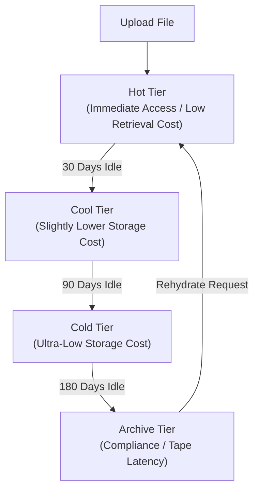

## Table of Contents

1. [What Is Blob Storage](#what-is-blob-storage)
2. [Storage Accounts And Containers](#storage-accounts-and-containers)
3. [Replication](#replication)
4. [SAS Tokens](#sas-tokens)
5. [Lifecycle Management](#lifecycle-management)
6. [Putting It All Together](#putting-it-all-together)
7. [What's Next](#whats-next)

## What Is Blob Storage

Azure Blob Storage is a fully managed object storage service designed to store and serve massive amounts of unstructured file data (blobs). Unlike traditional database management systems that store structured records in indexed tables, Blob Storage is optimized for holding raw binary and text bytes, such as generated PDF receipts, CSV logs, support attachments, database backup archives, and application logs. It decouples file storage from your virtual machines or container runtimes, ensuring that files remain highly durable and accessible even when compute instances scale to zero or restart.

:::expand[Under the Hood: LRS/ZRS/GRS Replication and SAS Cryptography]{kind="design"}
When you write a file to Blob Storage, the physical data persistence loop is governed entirely by your chosen replication strategy:
* **Locally Redundant Storage (LRS)**: Stores three synchronous copies of your data in a single physical location in the primary region, protecting against local hardware failures.
* **Zone-Redundant Storage (ZRS)**: Stores synchronous copies across three Azure availability zones in supported regions, protecting against a zone-level outage.
* **Geo-Redundant Storage (GRS/GZRS)**: Adds asynchronous replication to a secondary region, protecting against a regional disaster at the cost of a replication delay.

For secure access control, Shared Access Signature (SAS) tokens use signed permissions rather than shared passwords. A User Delegation SAS is based on a short-lived user delegation key requested from Microsoft Entra ID by an authorized security principal. Your service signs the allowed resource path, permissions, start and expiry time, optional IP range, and protocol. When a client submits the signed URI, Azure Storage validates the signature and policy fields before allowing the request.
:::

If you are experienced with AWS, Blob Storage is cabled to the exact developer problems solved by Amazon S3. However, their structural namespaces differ. In AWS, an S3 bucket is a flat, global resource namespace where every bucket must have a unique name worldwide. In Azure, a Blob Container lives inside a regional Storage Account. The Storage Account serves as the unique, global namespace boundary (e.g., `stordersprodweu.blob.core.windows.net`), and containers are top-level groupings inside that account. Blob names can include `/` characters to simulate folders, and hierarchical namespace accounts add directory behavior for analytics-style workloads.

The platform provides standard HTTP/HTTPS REST endpoints for every blob you write. Rather than managing complex block disks, your application streams files using simple REST client commands, allowing the platform to manage physical storage boundaries.

| Platform Component | Functional Role inside Blob Storage |
| --- | --- |
| Storage Account | The global namespace, billing boundary, network access controller, encryption configuration, and regional replication root |
| Blob Container | A top-level grouping of blobs inside the account, commonly used to separate lifecycle and access patterns |
| Block Blob | The standard blob format designed for streaming files, consisting of independent committed blocks |
| Blob Name | The unique string identifier inside the container, utilizing `/` characters to simulate folders |
| SAS Token | Cryptographically signed URIs providing secure, time-limited access without account keys |
| Access Tier | Optimization tiers (Hot, Cool, Cold, Archive) that trade storage rates for retrieval fees |

## Storage Accounts And Containers

The Storage Account is the outer resource gateway that contains all your blob, queue, table, and file share configurations. When you provision a storage account, you select the primary region, the hardware tier (Standard vs. Premium), and the global replication profile. Because the storage account name forms the primary subdomain of your public REST endpoint, the name must be globally unique across all Azure accounts.

Inside the storage account, you organize files using Blob Containers. A container is a logical bucket for blobs, with its own name, metadata, and access level settings. Network firewall rules, private endpoints, replication, and default encryption settings are configured at the storage account layer, so containers are not a substitute for separate accounts when you need strong network or encryption separation. If your e-commerce system generates public marketing flyers, private customer invoices, and internal database backups, create separate containers for each lifecycle and access pattern (e.g., `public-marketing`, `private-invoices`, `system-backups`) and use account-level controls where isolation must be stronger.

A critical security practice is disabling public container access at the Storage Account level. When public access is disabled, the platform blocks all anonymous internet requests to your blobs, even if individual containers are marked public, protecting your file repositories from accidental configuration leaks.

## Replication

Replication defines how Azure stores redundant copies of your blobs. With LRS, Azure synchronously stores three copies in one physical location in the primary region. With ZRS, Azure synchronously stores copies across three availability zones. With GRS and GZRS, Azure also asynchronously copies data to a secondary region, so the secondary can lag behind the primary.

A critical systems distinction in Blob Storage is the choice between flat namespaces and Hierarchical Namespaces (ADLS Gen2). By default, standard Blob Storage uses a flat namespace. When you name a blob `receipts/2026/05/order-417.pdf`, the slashes are merely string characters inside a single, flat index. There are no physical directories. If you rename the "folder" `receipts` to `invoices`, the storage engine must execute a slow metadata update on every individual blob containing that string.

If you enable Hierarchical Namespaces, the storage account organizes blobs using directory-aware metadata for Azure Data Lake Storage Gen2. In this mode, directories behave like real folders for operations such as rename and permission management, which is highly efficient for big data pipelines, CI/CD operations, and high-volume file moves.

## SAS Tokens

Shared Access Signatures (SAS) allow you to grant limited, secure access to containers and blobs without exposing your storage account's master access keys. Exposing master access keys inside your frontend application code is a severe security risk, as anyone who extracts the key inherits full administrative read/write privileges over your entire storage account.

*A SAS token is a narrow delegated permission, not the storage account key itself.*

Azure supports three categories of SAS tokens:
* **Account SAS**: Grants broad access across multiple services (blobs, queues, shares) using the account's master key.
* **Service SAS**: Grants targeted access to a specific container or blob inside a single service using the master key.
* **User Delegation SAS**: The standard for secure cloud architectures. It does not use the storage account's master key. Instead, the token is generated using a short-lived User Delegation Key fetched from Microsoft Entra ID.

To secure customer invoice downloads, implement a User Delegation SAS workflow. When a customer clicks "Download Invoice", your API gateway validates the user's active session, requests a User Delegation Key from Entra ID using its own system-assigned managed identity, cryptographically signs a time-limited SAS URI restricted to that specific blob's container path, and returns the URI as a redirect link. The customer downloads the file directly from Azure's edge networks, and the token automatically expires after 15 minutes, ensuring passwordless, time-bound isolation.

## Lifecycle Management

As your application writes data over time, your total storage footprint grows, which can quietly increase your cloud bill. To optimize costs without manually running deletion scripts, implement Lifecycle Management policies.

*Lifecycle rules turn object age into storage-tier movement, which changes cost and restore speed.*

Lifecycle Management uses rule engines to shift blobs automatically between access tiers based on their age and last-modified timestamps:
* **Hot Tier**: High storage rates, zero retrieval fees; designed for frequently read files like active images.
* **Cool Tier**: Lower storage rates, small retrieval fees; designed for files read occasionally (such as 30-day-old invoices).
* **Cold Tier**: Ultra-low storage rates, moderate retrieval fees; designed for files rarely read (such as 90-day-old logs).
* **Archive Tier**: Lowest storage rates, highest retrieval fees; designed for compliance archives that can tolerate rehydration latencies.

The Archive tier introduces a physical constraint: it is an offline storage medium. You cannot read an archived blob directly. To access it, you must initiate a rehydration request, which copies the archived blocks back to a Hot or Cool online tier. This rehydration process takes several hours to complete depending on the size and priority queue, meaning the Archive tier is completely unsuitable for files that must open instantly during customer interactions.

:::expand[The Archive Tier Rehydration Delay]{kind="pitfall"}
Azure Storage's **Archive Tier** is an offline storage medium designed to minimize storage costs for long-term data. However, moving blobs to the Archive tier comes with a severe operational catch: the data is taken fully offline. If your application or an engineer attempts to read a blob in the Archive tier directly, the storage gateway returns an immediate `409 BlobArchived` error.

This mirrors the behavior of **AWS S3 Glacier** (both Glacier Flexible Retrieval and Deep Archive). To access an archived object in AWS or Azure, you must initiate a "Rehydration" or "Restoration" request. This moves the blocks back to an online tier (Hot/Cool in Azure, Standard in AWS) before the file is readable.

Standard rehydration in Azure takes **1 to 15 hours** to complete. Even High-Priority rehydration (which carries an expensive premium fee and is restricted to blobs under 10 GB) can take up to **1 hour**.

A platform team that implements an aggressive lifecycle policy to tier all application logs to Archive after 7 days will discover this during a high-severity production outage. When the on-call engineer tries to pull a transaction log from 8 days ago, they must wait 8 hours for rehydration, sending their Mean Time to Resolution (MTTR) skyrocketing.

Use this decision table to audit your lifecycle placements:

| Blob Data Class | Recommended Access Tier | Access Latency SLA | Storage vs. Retrieval Cost |
| :--- | :--- | :--- | :--- |
| **Active user-uploaded media** | **Hot** | Milliseconds | High storage / Zero retrieval fee |
| **30-day-old invoices** | **Cool** | Milliseconds | Moderate storage / Small retrieval fee |
| **90-day-old troubleshooting logs** | **Cold** | Milliseconds | Low storage / Moderate retrieval fee |
| **7-year corporate compliance audits** | **Archive** | **1 to 15 hours** | **Lowest storage** / High rehydration fee |

**Rule of thumb:** Never tier operational troubleshooting assets, database backups, or active system configurations to the Archive tier. Utilize the **Cold Tier** (which offers immediate millisecond access at lower storage rates) for operational logs, reserving the Archive tier strictly for write-once, read-never compliance records.
:::

## Putting It All Together

Azure Blob Storage provides durable, scalable object storage cabled to regional storage accounts.

* **Replication Choices**: Blob data is stored using the redundancy option you choose: LRS in one physical location, ZRS across availability zones, or geo-redundant options with asynchronous copies in a secondary region.
* **Hierarchical Namespaces**: Flat namespaces store paths as plain strings. ADLS Gen2 hierarchical namespaces enable true POSIX directory trees for fast file system directory moves.
* **Passwordless SAS Tokens**: User Delegation SAS tokens utilize short-lived keys fetched from Entra ID to sign time-limited, IP-restricted REST endpoints, avoiding key exposure.
* **Cost Lifecycle Tiers**: Automating lifecycle tier transitions from Hot to Cool, Cold, and Archive optimizes costs. Reading archived blobs requires hours of rehydration latency.

By decoupling files from your VMs and container instances and securing them using cryptographically signed SAS tokens cabled to managed identities, you can build secure, highly durable cloud media and logging backends.

## What's Next

In the next chapter, we will look at Azure Disks and File Shares. We will explore managed block storage, contrast Premium SSD v1/v2 IOPS caps, analyze VM host caching write safety, and mount shared network folders over SMB and NFS protocols.

*Use this as the Blob Storage path: the account, container, and object name form the address, while replication, SAS tokens, lifecycle rules, and access tiers control durability, access, and cost.*

---

**References**

- [Azure Blob Storage Introduction](https://learn.microsoft.com/en-us/azure/storage/blobs/storage-blobs-overview) - Official overview of object storage.
- [Storage Account Redundancy](https://learn.microsoft.com/en-us/azure/storage/common/storage-redundancy) - Detailed comparison of LRS, ZRS, and GRS topologies.
- [Shared Access Signatures (SAS)](https://learn.microsoft.com/en-us/azure/storage/common/storage-sas-overview) - Guide to cryptographically signed tokens and User Delegation keys.
- [Access Tiers for Blobs](https://learn.microsoft.com/en-us/azure/storage/blobs/access-tiers-overview) - Cost and latency tradeoffs of Hot, Cool, Cold, and Archive storage.
