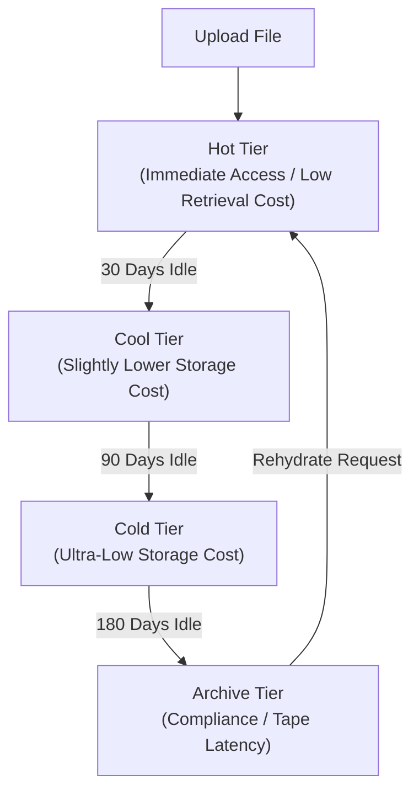

## Table of Contents

1. [What Is Blob Storage](#what-is-blob-storage)
2. [Declaring Storage and Lifecycle with Bicep](#declaring-storage-and-lifecycle-with-bicep)
3. [Storage Accounts And Containers](#storage-accounts-and-containers)
4. [Replication](#replication)
5. [SAS Tokens](#sas-tokens)
6. [Lifecycle Management](#lifecycle-management)
7. [Putting It All Together](#putting-it-all-together)
8. [What's Next](#whats-next)

## What Is Blob Storage

Azure Blob Storage is Azure's managed object store for application files that are read and written as whole objects rather than relational rows. It is a fully managed object storage service designed to store and serve massive amounts of unstructured file data (blobs). Unlike traditional database management systems that store structured records in indexed tables, Blob Storage is optimized for holding raw binary and text bytes, such as generated PDF receipts, CSV logs, support attachments, database backup archives, and application logs. It decouples file storage from your virtual machines or container runtimes, ensuring that files remain highly durable and accessible even when compute instances scale to zero or restart.

:::expand[Under the Hood: LRS/ZRS/GRS Replication and SAS Cryptography]{kind="design"}
When you write a file to Blob Storage, the physical data persistence loop is governed entirely by your chosen replication strategy:

Behind the API endpoints, Locally Redundant Storage (LRS) stores three synchronous copies of your data in a single physical location attached to one facility boundary in the primary region. This provides high-throughput write performance and low latency, protecting against drive or rack failures, but leaves your files vulnerable if the entire building has a problem.

To mitigate local disasters, Zone-Redundant Storage (ZRS) replicates your data synchronously across three physically separate Availability Zones within the primary region. The platform does not acknowledge a write request as committed until the byte stream is written to disk in at least two zones, guaranteeing that your data survives zonal power grid or cooling loop outages.

For regional disaster recovery, Geo-Redundant Storage (GRS) performs synchronous LRS replication inside the primary region and then asynchronously streams copies to a paired secondary region located hundreds of miles away. While GRS protects against total region failures, it introduces a replication delay, meaning a secondary failover can result in minor data loss representing the recovery point objective lag.

For secure access control, Shared Access Signature (SAS) tokens use signed permissions rather than shared passwords. A User Delegation SAS is based on a short-lived user delegation key requested from Microsoft Entra ID by an authorized security principal. Your service signs the allowed resource path, permissions, start and expiry time, optional IP range, and protocol. When a client submits the signed URI, Azure Storage validates the signature and policy fields before allowing the request.
:::

### Declaring Storage and Lifecycle with Bicep

To provision a secure, enterprise-grade storage backend using Infrastructure as Code, you declare the Storage Account, Blob Containers, and Lifecycle Management policies in a single Bicep template. This template disables anonymous public access, restricts network ingress, and automatically tiers inactive files:

```bicep
resource storageAccount 'Microsoft.Storage/storageAccounts@2022-09-01' = {
  name: 'stordersinvoiceprod'
  location: resourceGroup().location
  sku: {
    name: 'Standard_ZRS'
  }
  kind: 'StorageV2'
  properties: {
    accessTier: 'Hot'
    supportsHttpsTrafficOnly: true
    minimumTlsVersion: 'TLS1_2'
    allowBlobPublicAccess: false
    networkAcls: {
      bypass: 'AzureServices'
      defaultAction: 'Deny'
      ipRules: [
        {
          value: '203.0.113.50'
          action: 'Allow'
        }
      ]
    }
  }
}

resource blobService 'Microsoft.Storage/storageAccounts/blobServices@2022-09-01' = {
  parent: storageAccount
  name: 'default'
}

resource privateInvoicesContainer 'Microsoft.Storage/storageAccounts/blobServices/containers@2022-09-01' = {
  parent: blobService
  name: 'private-invoices'
  properties: {
    publicAccess: 'None'
  }
}

resource publicMarketingContainer 'Microsoft.Storage/storageAccounts/blobServices/containers@2022-09-01' = {
  parent: blobService
  name: 'public-marketing'
  properties: {
    publicAccess: 'None'
  }
}

resource managementPolicy 'Microsoft.Storage/storageAccounts/managementPolicies@2022-09-01' = {
  parent: storageAccount
  name: 'default'
  properties: {
    policy: {
      rules: [
        {
          enabled: true
          name: 'tier-and-delete-invoices'
          type: 'Lifecycle'
          definition: {
            actions: {
              baseBlob: {
                tierToCool: {
                  daysAfterModificationGreaterThan: 30
                }
                tierToCold: {
                  daysAfterModificationGreaterThan: 90
                }
                delete: {
                  daysAfterModificationGreaterThan: 2555
                }
              }
            }
            filters: {
              blobTypes: [
                'blockBlob'
              ]
              prefixMatch: [
                'private-invoices/'
              ]
            }
          }
        }
      ]
    }
  }
}
```

This Bicep configuration encapsulates a production-ready, comment-free setup demonstrating storage-plane network hardening and automatic lifecycle auditing.

If you are experienced with AWS, Blob Storage maps to the same developer problems solved by Amazon S3. However, their structural namespaces differ. In AWS, an S3 bucket is a flat, global resource namespace where every bucket must have a unique name worldwide. In Azure, a Blob Container lives inside a regional Storage Account. The Storage Account serves as the unique, global namespace boundary (e.g., `stordersprodweu.blob.core.windows.net`), and containers are top-level groupings inside that account. Blob names can include `/` characters to simulate folders, and hierarchical namespace accounts add directory behavior for analytics-style workloads.

The platform provides standard HTTP/HTTPS REST endpoints for every blob you write. Rather than managing complex block disks, your application streams files using simple REST client commands, allowing the platform to manage physical storage boundaries.

| Platform Component | Functional Role inside Blob Storage |
| --- | --- |
| Storage Account | The global namespace, billing boundary, network access controller, encryption configuration, and regional replication root |
| Blob Container | A top-level grouping of blobs inside the account, commonly used to separate lifecycle and access patterns |
| Block Blob | The standard blob format designed for streaming files, consisting of independent committed blocks |
| Blob Name | The unique string identifier inside the container, utilizing `/` characters to simulate folders |
| SAS Token | Cryptographically signed URIs providing secure, time-limited access without account keys |
| Access Tier | Optimization tiers (Hot, Cool, Cold, Archive) that trade storage rates for retrieval fees |

## Storage Accounts And Containers

A Storage Account is the outer Azure resource that owns the namespace, billing, network rules, and replication settings for storage services. A container is the named grouping inside Blob Storage where related blobs live.

Example: `stordersinvoiceprod` can be the storage account, and `private-invoices` can be the container holding blobs such as `2026/05/order-417.pdf`.

When you provision a storage account, you select the primary region, the hardware tier (Standard vs. Premium), and the global replication profile. Because the storage account name forms the primary subdomain of your public REST endpoint, the name must be globally unique across all Azure accounts.

Inside the storage account, you organize files using Blob Containers. A container is a logical bucket for blobs, with its own name, metadata, and access level settings. Network firewall rules, private endpoints, replication, and default encryption settings are configured at the storage account layer, so containers are not a substitute for separate accounts when you need strong network or encryption separation. If your e-commerce system generates public marketing flyers, private customer invoices, and internal database backups, create separate containers for each lifecycle and access pattern (e.g., `public-marketing`, `private-invoices`, `system-backups`) and use account-level controls where isolation must be stronger.

A critical security practice is disabling public container access at the Storage Account level. When public access is disabled, the platform blocks all anonymous internet requests to your blobs, even if individual containers are marked public, protecting your file repositories from accidental configuration leaks.

To declare a standard storage account with these container requirements using the Azure CLI, you run the following setup commands:

```bash
az storage account create \
  --name stordersinvoiceprod \
  --resource-group rg-portal-prod \
  --location westus3 \
  --sku Standard_ZRS \
  --allow-blob-public-access false
```

## Replication

Replication is the copy policy for blob data: it decides whether Azure keeps redundant copies in one facility, across zones, or across regions. With LRS, Azure synchronously stores three copies in one physical location in the primary region. With ZRS, Azure synchronously stores copies across three availability zones. With GRS and GZRS, Azure also asynchronously copies data to a secondary region, so the secondary can lag behind the primary.

A critical systems distinction in Blob Storage is the choice between flat namespaces and Hierarchical Namespaces (ADLS Gen2). By default, standard Blob Storage uses a flat namespace. When you name a blob `receipts/2026/05/order-417.pdf`, the slashes are merely string characters inside a single, flat index. There are no physical directories. If you rename the "folder" `receipts` to `invoices`, the storage engine must execute a slow metadata update on every individual blob containing that string.

If you enable Hierarchical Namespaces, the storage account organizes blobs using directory-aware metadata for Azure Data Lake Storage Gen2. In this mode, directories behave like real folders for operations such as rename and permission management, which is highly efficient for big data pipelines, CI/CD operations, and high-volume file moves.

To update an active storage account's replication setting dynamically from ZRS to GZRS via CLI, you execute:

```bash
az storage account update \
  --name stordersinvoiceprod \
  --resource-group rg-portal-prod \
  --sku Standard_GZRS
```

## SAS Tokens

A Shared Access Signature (SAS) is a signed URL token that grants limited access to a blob or container for a limited time. It exists so a client can download or upload a specific object without receiving the storage account's master keys.

Example: an API can issue a 15-minute read-only SAS for `private-invoices/2026/05/order-417.pdf`, allowing one customer download without exposing broader account permissions.

Exposing master access keys inside your frontend application code is a severe security risk, as anyone who extracts the key inherits full administrative read/write privileges over your entire storage account.


*A SAS token is a narrow delegated permission, not the storage account key itself.*

An Account SAS grants broad permissions across multiple storage services (such as blobs, queues, tables, and files) and is signed using the storage account's master access key. Because a compromised Account SAS grants access to your entire storage footprint, it should never be shared with clients or embedded in client-side applications.

A Service SAS narrows the target scope to a specific container or blob inside a single service, but is still cryptographically signed using the account's master access key. While more restrictive than an Account SAS, it still presents an operational liability: if the token is leaked, you cannot revoke it without rotating the storage account's master key, which immediately invalidates all other active SAS tokens and services using that key.

A User Delegation SAS is the preferred SAS pattern for secure cloud architectures. Instead of using the storage account master access keys, the token is signed using a short-lived User Delegation Key fetched from Microsoft Entra ID. The generator must hold `Microsoft.Storage/storageAccounts/blobServices/generateUserDelegationKey/action` permissions through an Entra managed identity, ensuring that the token inherits active RBAC scopes and can be audited cleanly.

To secure customer invoice downloads, implement a User Delegation SAS workflow. When a customer clicks "Download Invoice", your API gateway validates the user's active session, requests a User Delegation Key from Entra ID using its own system-assigned managed identity, cryptographically signs a time-limited SAS URI restricted to that specific blob's container path, and returns the URI as a redirect link. The customer downloads the file directly from Azure's edge networks, and the token automatically expires after 15 minutes, ensuring passwordless, time-bound isolation.

You can implement this user-delegation workflow in your application layer using the Azure Identity and Blob Storage SDKs. The following JavaScript code declares a secure, comment-free function that obtains a user delegation key through a system managed identity, generating a read-only 15-minute lease link:

```javascript
const { DefaultAzureCredential } = require('@azure/identity');
const { BlobServiceClient, generateBlobSASQueryParameters, BlobSASPermissions } = require('@azure/storage-blob');

async function getInvoiceDownloadLink(containerName, blobName) {
  const credential = new DefaultAzureCredential();
  const blobServiceClient = new BlobServiceClient(
    'https://stordersinvoiceprod.blob.core.windows.net',
    credential
  );

  const userDelegationKey = await blobServiceClient.getUserDelegationKey(
    new Date(),
    new Date(Date.now() + 3600 * 1000)
  );

  const sasToken = generateBlobSASQueryParameters({
    containerName,
    blobName,
    permissions: BlobSASPermissions.parse('r'),
    startsOn: new Date(),
    expiresOn: new Date(Date.now() + 15 * 60 * 1000),
    protocol: 'https'
  }, userDelegationKey, 'stordersinvoiceprod').toString();

  return `https://stordersinvoiceprod.blob.core.windows.net/${containerName}/${blobName}?${sasToken}`;
}
```

## Lifecycle Management

Lifecycle Management is Blob Storage's rule engine for moving or deleting objects as they age. It exists because files that are useful today may become cheaper archive data later.

Example: invoices can stay in Hot tier for 30 days, move to Cool tier after 90 days, and be deleted after seven years if your retention policy allows it.

As your application writes data over time, your total storage footprint grows, which can quietly increase your cloud bill. To optimize costs without manually running deletion scripts, implement Lifecycle Management policies.


*Lifecycle rules turn object age into storage-tier movement, which changes cost and restore speed.*

Lifecycle Management uses rule engines to shift blobs automatically between access tiers based on their age and last-modified timestamps:
* **Hot Tier**: High storage rates, zero retrieval fees; designed for frequently read files like active images.
* **Cool Tier**: Lower storage rates, small retrieval fees; designed for files read occasionally (such as 30-day-old invoices).
* **Cold Tier**: Ultra-low storage rates, moderate retrieval fees; designed for files rarely read (such as 90-day-old logs).
* **Archive Tier**: Lowest storage rates, highest retrieval fees; designed for compliance archives that can tolerate rehydration latencies.



The Archive tier introduces a physical constraint: it is an offline storage medium. You cannot read an archived blob directly. To access it, you must initiate a rehydration request, which copies the archived blocks back to a Hot or Cool online tier. This rehydration process takes several hours to complete depending on the size and priority queue, meaning the Archive tier is completely unsuitable for files that must open instantly during customer interactions.

:::expand[The Archive Tier Rehydration Delay]{kind="pitfall"}
Azure Storage's **Archive Tier** is an offline storage medium designed to minimize storage costs for long-term data. However, moving blobs to the Archive tier comes with a severe operational catch: the data is taken fully offline. If your application or an engineer attempts to read a blob in the Archive tier directly, the storage gateway returns an immediate `409 BlobArchived` error.

This mirrors the behavior of **AWS S3 Glacier** (both Glacier Flexible Retrieval and Deep Archive). To access an archived object in AWS or Azure, you must initiate a "Rehydration" or "Restoration" request. This moves the blocks back to an online tier (Hot/Cool in Azure, Standard in AWS) before the file is readable.

Standard rehydration in Azure takes **1 to 15 hours** to complete. Even High-Priority rehydration (which carries an expensive premium fee and is restricted to blobs under 10 GB) can take up to **1 hour**.

A platform team that implements an aggressive lifecycle policy to tier all application logs to Archive after 7 days will discover this during a high-severity production outage. When the on-call engineer tries to pull a transaction log from 8 days ago, they must wait 8 hours for rehydration, sending their Mean Time to Resolution (MTTR) skyrocketing.

Use this decision table to audit your lifecycle placements:

| Blob Data Class | Recommended Access Tier | Access Latency SLA | Storage vs. Retrieval Cost |
| :--- | :--- | :--- | :--- |
| **Active user-uploaded media** | **Hot** | Milliseconds | High storage / Zero retrieval fee |
| **30-day-old invoices** | **Cool** | Milliseconds | Moderate storage / Small retrieval fee |
| **90-day-old troubleshooting logs** | **Cold** | Milliseconds | Low storage / Moderate retrieval fee |
| **7-year corporate compliance audits** | **Archive** | **1 to 15 hours** | **Lowest storage** / High rehydration fee |

**Rule of thumb:** Never tier operational troubleshooting assets, database backups, or active system configurations to the Archive tier. Utilize the **Cold Tier** (which offers immediate millisecond access at lower storage rates) for operational logs, reserving the Archive tier strictly for write-once, read-never compliance records.
:::

## Putting It All Together

Azure Blob Storage provides durable, scalable object storage inside regional storage accounts.

* **Replication Choices**: Blob data is stored using the redundancy option you choose: LRS in one physical location, ZRS across availability zones, or geo-redundant options with asynchronous copies in a secondary region.
* **Hierarchical Namespaces**: Flat namespaces store paths as plain strings. ADLS Gen2 hierarchical namespaces enable true POSIX directory trees for fast file system directory moves.
* **Passwordless SAS Tokens**: User Delegation SAS tokens utilize short-lived keys fetched from Entra ID to sign time-limited, IP-restricted REST endpoints, avoiding key exposure.
* **Cost Lifecycle Tiers**: Automating lifecycle tier transitions from Hot to Cool, Cold, and Archive optimizes costs. Reading archived blobs requires hours of rehydration latency.

By decoupling files from your VMs and container instances and securing them using cryptographically signed SAS tokens issued through managed identities, you can build secure, highly durable cloud media and logging backends.

## What's Next

In the next chapter, we will look at Azure Disks and File Shares. We will explore managed block storage, contrast Premium SSD v1/v2 IOPS caps, analyze VM host caching write safety, and mount shared network folders over SMB and NFS protocols.


*Use this as the Blob Storage path: the account, container, and object name form the address, while replication, SAS tokens, lifecycle rules, and access tiers control durability, access, and cost.*


---

* [Azure Blob Storage Introduction](https://learn.microsoft.com/en-us/azure/storage/blobs/storage-blobs-overview) - Official technical overview of Azure managed object storage, endpoints, and containers.
* [Storage Account Redundancy Topologies](https://learn.microsoft.com/en-us/azure/storage/common/storage-redundancy) - Systems reference comparing LRS, ZRS, GRS, and GZRS replication locks.
* [Shared Access Signatures (SAS)](https://learn.microsoft.com/en-us/azure/storage/common/storage-sas-overview) - In-depth guide on cryptographically signed tokens, delegation keys, and user-delegation workflows.
* [Access Tiers for Blobs](https://learn.microsoft.com/en-us/azure/storage/blobs/access-tiers-overview) - Structural details on Hot, Cool, Cold, and Archive storage tiers, and rehydration times.
* [Hierarchical Namespaces in ADLS Gen2](https://learn.microsoft.com/en-us/azure/storage/blobs/data-lake-storage-namespace) - Guide to enabling true directories and POSIX compliance on blob storage containers.
* [Azure Storage Security Hardening Guide](https://learn.microsoft.com/en-us/azure/storage/common/storage-security-guide) - Best practices on securing accounts with Entra ID, managed identity, and storage firewalls.
