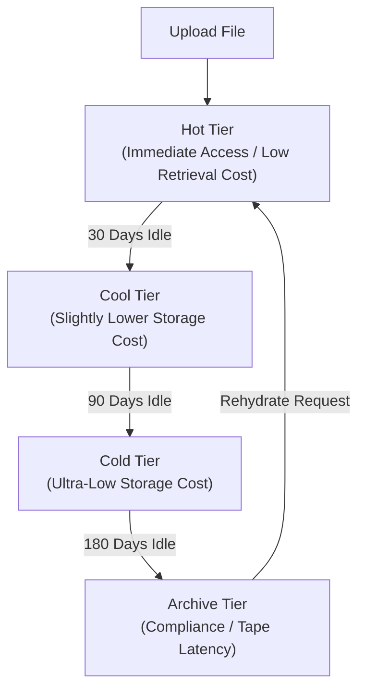

## Table of Contents

1. [What Is Blob Storage](#what-is-blob-storage)
2. [Storage Accounts And Containers](#storage-accounts-and-containers)
3. [Replication](#replication)
4. [SAS Tokens](#sas-tokens)
5. [Lifecycle Management](#lifecycle-management)
6. [Putting It All Together](#putting-it-all-together)
7. [What's Next](#whats-next)

## What Is Blob Storage

Azure Blob Storage is a fully managed object storage service designed to store and serve massive amounts of unstructured file data (blobs). Unlike traditional database management systems that store structured records in indexed tables, Blob Storage is optimized for holding raw binary and text bytes, such as generated PDF receipts, CSV logs, support attachments, database backup archives, and application logs. It decouples file storage from your virtual machines or container runtimes, ensuring that files remain highly durable and accessible even when compute instances scale to zero or restart.

:::expand[Under the Hood: LRS/ZRS/GRS Physical Replication and SAS Cryptography]{kind="design"}
When you write a file to Blob Storage, the physical data persistence loop is governed entirely by your chosen replication strategy:
* **Locally Redundant Storage (LRS)**: Replicates your data blocks synchronously across three separate physical storage cabinet enclosures located inside a single datacenter building, protecting against individual disk, rack, or power supply failures.
* **Zone-Redundant Storage (ZRS)**: Replicates your data blocks synchronously across three distinct physical Availability Zones (individual datacenters cabled to separate power and networking meshes) within the target region, surviving zone-level outages.
* **Geo-Redundant Storage (GRS)**: Pairs synchronous LRS/ZRS replication in the primary region with asynchronous replication over high-speed dark fiber to a secondary geographic region located hundreds of miles away, protecting against regional disasters.

For secure access control, dynamic Shared Access Signature (SAS) tokens utilize symmetric key cryptography. A User Delegation SAS is cabled directly to an Entra ID security principal. The token-generating API calls Entra ID to fetch a User Delegation Key (a short-lived cryptographic key), then uses a SHA256 HMAC algorithm to sign the target container path, permissions, IP address ranges, and expiration times. When a client browser submits the signed URI request, the Blob Storage front-end gateways decrypt and validate the HMAC signature, confirming that the token is authentic and has not been altered, permitting secure, passwordless browser uploads and downloads.
:::

If you are experienced with AWS, Blob Storage is cabled to the exact developer problems solved by Amazon S3. However, their structural namespaces differ. In AWS, an S3 bucket is a flat, global resource namespace where every bucket must have a unique name worldwide. In Azure, a Blob Container lives inside a regional Storage Account. The Storage Account serves as the unique, global namespace boundary (e.g., `stordersprodweu.blob.core.windows.net`), allowing you to create hundreds of nested containers without worrying about global naming collisions.

The platform provides standard HTTP/HTTPS REST endpoints for every blob you write. Rather than managing complex block disks, your application streams files using simple REST client commands, allowing the platform to manage physical storage boundaries.

| Platform Component | Functional Role inside Blob Storage |
| --- | --- |
| Storage Account | The global namespace, billing boundary, network access controller, and regional replication root |
| Blob Container | The logical subdirectory and policy boundary used to partition blobs within the account |
| Block Blob | The standard blob format designed for streaming files, consisting of independent committed blocks |
| Blob Name | The unique string identifier inside the container, utilizing `/` characters to simulate folders |
| SAS Token | Cryptographically signed URIs providing secure, time-limited access without account keys |
| Access Tier | Optimization tiers (Hot, Cool, Cold, Archive) that trade storage rates for retrieval fees |

## Storage Accounts And Containers

The Storage Account is the outer resource gateway that contains all your blob, queue, table, and file share configurations. When you provision a storage account, you select the primary region, the hardware tier (Standard vs. Premium), and the global replication profile. Because the storage account name forms the primary subdomain of your public REST endpoint, the name must be globally unique across all Azure accounts.

Inside the storage account, you organize files using Blob Containers. A container is a logical bucket that owns network access control rules, default encryption keys, public access overrides, and metadata tags. If your e-commerce system generates public marketing flyers, private customer invoices, and internal database backups, do not store them in the same container. Create separate containers for each lifecycle scope (e.g., `public-marketing`, `private-invoices`, `system-backups`) to ensure that security controls remain isolated.

A critical security practice is disabling public container access at the Storage Account level. When public access is disabled, the platform blocks all anonymous internet requests to your blobs, even if individual containers are marked public, protecting your file repositories from accidental configuration leaks.

## Replication

Replication defines how Azure guarantees the physical durability of your blobs. When a client application performs a write block operation, the storage controller receives the payload and writes it concurrently across three physical disks in separate cabinets before returning a success code.

A critical systems distinction in Blob Storage is the choice between flat namespaces and Hierarchical Namespaces (ADLS Gen2). By default, standard Blob Storage uses a flat namespace. When you name a blob `receipts/2026/05/order-417.pdf`, the slashes are merely string characters inside a single, flat index. There are no physical directories. If you rename the "folder" `receipts` to `invoices`, the storage engine must execute a slow metadata update on every individual blob containing that string.

If you enable Hierarchical Namespaces, the storage account organizes blobs using true POSIX directory trees cabled to an internal metadata index. In this mode, directories behave like real folders. Renaming a directory requires updating a single directory metadata node rather than iterating through millions of blobs, which is highly efficient for big data pipelines, CI/CD operations, and high-volume file moves.

## SAS Tokens

Shared Access Signatures (SAS) allow you to grant limited, secure access to containers and blobs without exposing your storage account's master access keys. Exposing master access keys inside your frontend application code is a severe security risk, as anyone who extracts the key inherits full administrative read/write privileges over your entire storage account.

Azure supports three categories of SAS tokens:
* **Account SAS**: Grants broad access across multiple services (blobs, queues, shares) using the account's master key.
* **Service SAS**: Grants targeted access to a specific container or blob inside a single service using the master key.
* **User Delegation SAS**: The standard for secure cloud architectures. It does not use the storage account's master key. Instead, the token is generated using a short-lived User Delegation Key fetched from Microsoft Entra ID.

To secure customer invoice downloads, implement a User Delegation SAS workflow. When a customer clicks "Download Invoice", your API gateway validates the user's active session, requests a User Delegation Key from Entra ID using its own system-assigned managed identity, cryptographically signs a time-limited SAS URI restricted to that specific blob's container path, and returns the URI as a redirect link. The customer downloads the file directly from Azure's edge networks, and the token automatically expires after 15 minutes, ensuring passwordless, time-bound isolation.

## Lifecycle Management

As your application writes data over time, your total storage footprint grows, which can quietly increase your cloud bill. To optimize costs without manually running deletion scripts, implement Lifecycle Management policies.

Lifecycle Management uses rule engines to shift blobs automatically between access tiers based on their age and last-modified timestamps:
* **Hot Tier**: High storage rates, zero retrieval fees; designed for frequently read files like active images.
* **Cool Tier**: Lower storage rates, small retrieval fees; designed for files read occasionally (such as 30-day-old invoices).
* **Cold Tier**: Ultra-low storage rates, moderate retrieval fees; designed for files rarely read (such as 90-day-old logs).
* **Archive Tier**: Lowest storage rates, highest retrieval fees; designed for compliance archives that can tolerate rehydration latencies.

The Archive tier introduces a physical constraint: it is an offline storage medium. You cannot read an archived blob directly. To access it, you must initiate a rehydration request, which copies the archived blocks back to a Hot or Cool online tier. This rehydration process takes several hours to complete depending on the size and priority queue, meaning the Archive tier is completely unsuitable for files that must open instantly during customer interactions.

## Putting It All Together

Azure Blob Storage provides durable, scalable object storage cabled to regional storage accounts.

* **Replication Cabinets**: Physical block writes are replicated synchronously across three cabinets in LRS, three datacenters in ZRS, or asynchronously to paired regions in GRS.
* **Hierarchical Namespaces**: Flat namespaces store paths as plain strings. ADLS Gen2 hierarchical namespaces enable true POSIX directory trees for fast file system directory moves.
* **Passwordless SAS Tokens**: User Delegation SAS tokens utilize short-lived keys fetched from Entra ID to sign time-limited, IP-restricted REST endpoints, avoiding key exposure.
* **Cost Lifecycle Tiers**: Automating lifecycle tier transitions from Hot to Cool, Cold, and Archive optimizes costs. Reading archived blobs requires hours of rehydration latency.

By decoupling files from your VMs and container instances and securing them using cryptographically signed SAS tokens cabled to managed identities, you can build secure, highly durable cloud media and logging backends.

## What's Next

In the next chapter, we will look at Azure Disks and File Shares. We will explore managed block storage, contrast Premium SSD v1/v2 IOPS caps, analyze VM host caching write safety, and mount shared network folders over SMB and NFS protocols.

---

**References**

- [Azure Blob Storage Introduction](https://learn.microsoft.com/en-us/azure/storage/blobs/storage-blobs-overview) - Official overview of object storage.
- [Storage Account Redundancy](https://learn.microsoft.com/en-us/azure/storage/common/storage-redundancy) - Detailed comparison of LRS, ZRS, and GRS topologies.
- [Shared Access Signatures (SAS)](https://learn.microsoft.com/en-us/azure/storage/common/storage-sas-overview) - Guide to cryptographically signed tokens and User Delegation keys.
- [Access Tiers for Blobs](https://learn.microsoft.com/en-us/azure/storage/blobs/access-tiers-overview) - Cost and latency tradeoffs of Hot, Cool, Cold, and Archive storage.
