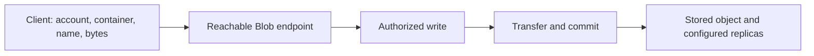
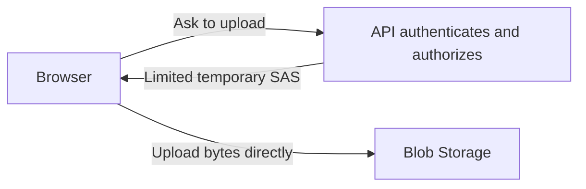

## Table of Contents

1. [What Storage Contract Does Blob Storage Provide?](#what-storage-contract-does-blob-storage-provide)
2. [How Do Containers, Names, Types, and Metadata Identify Objects?](#how-do-containers-names-types-and-metadata-identify-objects)
3. [How Does Upload and Download Work?](#how-does-upload-and-download-work)
4. [How Should Identity and Authorization Protect Blobs?](#how-should-identity-and-authorization-protect-blobs)
5. [When Should You Use SAS Tokens?](#when-should-you-use-sas-tokens)
6. [How Do Redundancy and Network Reachability Affect Access?](#how-do-redundancy-and-network-reachability-affect-access)
7. [How Do Tiers and Lifecycle Rules Control Cost?](#how-do-tiers-and-lifecycle-rules-control-cost)
8. [How Do Versioning, Soft Delete, and Retention Protect Data?](#how-do-versioning-soft-delete-and-retention-protect-data)
9. [Check Your Answers](#check-your-answers)
10. [References](#references)

A photograph, an invoice PDF, a video, and a model file contain different kinds of information, but they share a simple storage requirement: keep these bytes under a name and return them when an authorized client asks. The storage service does not need to understand the photograph or execute a query inside the PDF to do that job.

**Azure Blob Storage** provides this object-storage interface. An application identifies an account, a container, and a blob name, then reads or writes the object through an API. Around those operations, the design needs decisions about who can use the object, which networks can reach it, how it is replicated, what it costs to access, and which previous states remain recoverable.

The following questions start with that basic object and follow it through transfer, access, and its lifetime in storage:

1. **What Storage Contract Does Blob Storage Provide?**
2. **How Do Containers, Names, Types, and Metadata Identify Objects?**
3. **How Does Upload and Download Work?**
4. **How Should Identity and Authorization Protect Blobs?**
5. **When Should You Use SAS Tokens?**
6. **How Do Redundancy and Network Reachability Affect Access?**
7. **How Do Tiers and Lifecycle Rules Control Cost?**
8. **How Do Versioning, Soft Delete, and Retention Protect Data?**

## What Storage Contract Does Blob Storage Provide?
<!-- section-summary: Blob Storage maps object names to arbitrary bytes through an API, while the account supplies the namespace and major storage policy boundaries. -->

A **blob** contains a name, a byte payload, and associated properties or metadata. The bytes could represent a JPEG, PDF, ZIP, MP4, CSV, Parquet dataset, JSON file, machine-learning model, or backup. Names such as `photo.jpg`, `invoice.pdf`, `backup.tar`, `video.mp4`, `model.bin`, `logs.json`, and `dataset.parquet` identify useful objects to the application, while Storage manages their underlying byte content.

Even a byte sequence such as `01101000 01100101 01101100 01101100 01101111` is just stored data from this perspective. The service's basic operation does not depend on understanding the document format or the application's business meaning. Microsoft describes Blob Storage as a cloud service for large amounts of unstructured text and binary data in its [introduction][1].

**Object storage** names that interface: store an object under a name and retrieve it through an API. Typical operations include PUT, GET, DELETE, and LIST. The application supplies coordinates and credentials rather than attaching the underlying storage device to its operating system.

### Compare the requirement with a database

Consider a 20 GB video. The immediate requirements may be to store it durably, retrieve it, stream selected ranges, control access, avoid managing many manual copies, and archive it later. Those requirements do not primarily involve joining video bytes to another table, grouping by the bytes, indexing every byte, or transactionally changing byte `18,371,291`.

A relational database can store binary content, but its rows, columns, indexes, joins, and transaction mechanisms solve a richer structured-data problem. Blob Storage specializes in large objects, large-scale namespaces, economical capacity, HTTP access, durability, streaming, and lifecycle policies.

The two services often work together. A customer record containing ID, name, email, balance, and last-login time belongs naturally in a database when the application needs queries such as:

```sql
SELECT *
FROM customers
WHERE balance > 1000
ORDER BY last_login;
```

The customer's `passport-scan.pdf` can instead live in Blob Storage. The database can record `customer_id = 928` and `blob_name = customers/928/passport.pdf`, while the blob contains the actual document. Queryable relationships remain in the database, and the large byte object has a separate storage location.

Similarly, a photo record can contain `photo_id`, `user_id`, caption, upload time, and a blob name pointing to `users/928/photos/38182.jpg`. This arrangement lets the database query business metadata and maintain relationships or transactions without requiring it to serve every large binary payload itself.

### Compare the interface with files and disks

A traditional filesystem exposes a hierarchy such as `/home/alice/photos/cat.jpg`, accessed through operating-system operations such as `open()`, `read()`, `write()`, and `close()`. A shared filesystem also supplies its own directory and locking semantics.

Blob Storage instead exposes object operations over a network API. This is useful when hundreds of machines, thousands of applications, or millions or billions of objects need access without depending on one machine's local filesystem.

If the application expects `open("/mnt/shared/report.pdf")` and ordinary shared-file behavior, Azure Files may fit that requirement better. If it expects PUT and GET operations, object listings, and URLs, Blob Storage is the more direct interface. A Managed Disk is different again: it supplies a block device such as `/dev/sdc`, on which the operating system or database builds its own storage structures.

These comparisons do not claim one service is universally better. They identify which layer owns the interface the application needs: rows and queries, files and directories, a machine-oriented block device, or named objects through an API.

### Give the account a deliberate boundary

Blob Storage's hierarchy consists of a **storage account**, **containers**, and **blobs**. For example, account `acmeprod` can contain container `customer-uploads`, with blob `2026/08/customer-928/invoice.pdf`. Its URL is:

```text
https://acmeprod.blob.core.windows.net/customer-uploads/2026/08/customer-928/invoice.pdf
```

The account creates the namespace and service endpoint. Under `https://acmeprod.blob.core.windows.net`, different containers and names identify `images/a.jpg`, `videos/b.mp4`, or `backups/c.tar`. The address is part of the storage model, not an incidental display label.

An account also supplies major security, network, redundancy, billing, service-endpoint, and scaling boundaries. General-purpose storage accounts can host other services such as Files, Queues, and Tables as well. The [storage-account overview][2] explains this broader account role.

Imagine public website images and sensitive payroll archives. They can require different network exposure, redundancy, lifecycle, immutability, and RBAC policies. A public-media account might be internet-reachable with ordinary redundancy and aggressive cleanup, while a payroll-archive account might use private endpoints, geo-redundancy, strict authorization, and immutability.

Separate accounts can make those differences clearer. The architectural question is which data should share the same storage-level policies and operational boundary. That choice comes before organizing individual objects within a container because many important decisions govern the enclosing account.

## How Do Containers, Names, Types, and Metadata Identify Objects?
<!-- section-summary: Containers group named blobs; flat names, blob write types, system properties, metadata, and index tags provide different aspects of object identity and behavior. -->

A **container** groups blobs within an account. An account might have `images`, `documents`, and `backups` containers. A blob always belongs to a container, so an object coordinate has the shape `account/container/blob`, such as `acmeprod/customer-uploads/photo.jpg`.

Containers resemble directories because they organize sets of objects, as the [Blob introduction][1] explains. The resemblance should not be extended to every filesystem behavior. Ordinary Blob Storage uses a flat blob namespace, even when tools display slashes as folders.

### Read a blob name as one string

Inside `customer-uploads`, names such as `alice/photo.jpg`, `bob/photo.jpg`, and `carol/photo.jpg` can look like three subdirectories. In the ordinary flat model, each full name is simply the object's name. A string such as `customers/928/invoices/2026/august.pdf` does not require every apparent directory to be an independent filesystem object.

Applications and tools can interpret `/` as a delimiter and display a hierarchy. That view helps people browse related names while the underlying object identity remains the full string. The [listing guidance][3] and [REST reference][4] describe these object and delimiter conventions.

The simpler name-to-object primitive helps object stores scale without requiring every operation to maintain the same directory locks, metadata, and huge-tree rename behavior as a traditional filesystem. For example, `customer/123/photo.jpg` identifies bytes directly rather than first requiring a client-mounted filesystem to manage them.

**Azure Data Lake Storage Gen2** builds on Blob Storage and can enable a **hierarchical namespace** with stronger directory semantics. Keep this distinct from slash-delimited virtual folders. Feature support also differs: the [data-protection reference][5] notes that Blob versioning is not supported on accounts with hierarchical namespace enabled. Namespace choice is therefore part of feature compatibility, not just a display preference.

### Choose the write pattern that matches the object

Azure has three principal blob types: **block blobs**, **append blobs**, and **page blobs**. They exist because applications update stored bytes in different ways. The [object-model reference][6] describes these types.

Block blobs are the usual choice for images, documents, video, archives, backups, datasets, and application assets. A large file can be split into blocks and uploaded in pieces. The client later submits the ordered block list that defines the complete object.

Append blobs support adding new data to the end, such as repeated log lines. They are block-based objects optimized for append operations. Instead of replacing an entire log object for every new line, the application uses the append-oriented operation supported by this type.

Page blobs support random-range access. A workload might write at offsets `4096`, `8192`, and `1048576` rather than appending or replacing the entire object. This makes page blobs relevant to disk-like and virtual-disk scenarios. For ordinary file/object uploads, block blobs are usually the type being discussed.

| Blob type | Main write pattern | Examples |
| --- | --- | --- |
| Block | Upload blocks and commit an object | Documents, video, datasets, backups |
| Append | Add data at the end | Log-style records |
| Page | Update specific ranges | Random-access and virtual-disk workloads |

The type describes how bytes are changed. It is separate from the file extension or the business meaning of those bytes. A PDF does not receive storage-level legal-document semantics merely because its name ends in `.pdf`.

### Separate application metadata from system properties

A blob containing `contract.pdf` can have user-defined metadata such as `customer-id = 72812`, `department = legal`, and `source = upload-portal`. Other application metadata might record `uploaded-by = billing-service` or `document-id = 49202`.

This information describes the object for the application without being inserted into its payload. Blob Storage exposes metadata separately from contents, as its [service REST reference][8] explains. Reading the PDF bytes and reading attached descriptive metadata are related but distinct operations on the object's representation.

System properties describe storage-level facts such as content length, last-modified time, ETag, content type, and access tier. An **ETag** is a value used to identify a particular stored representation for checks such as conditional writes. System properties and user-defined metadata should not be treated as one interchangeable collection of business fields.

Azure also supports **blob index tags**, which participate in a secondary indexing and filtering mechanism. Metadata such as `invoice-number = 527` is attached information; tags such as `status = unpaid` and `region = uk` can help server-side identification or filtering of blobs. The [REST interface][9] describes the secondary-index role.

This distinction matters when designing searches or lifecycle filters. Attaching an arbitrary metadata field does not automatically mean it participates in the tag index. Use the appropriate representation for descriptive content, stored-object properties, and indexed tags.

With identity, write type, and descriptive information established, the next step is how the application moves bytes into and out of this named object.

## How Does Upload and Download Work?
<!-- section-summary: Upload requires a destination, a reachable endpoint, authorization, byte transfer, and commit; block staging, range reads, and concurrency control refine that basic path. -->

Suppose the application stores `photo.jpg` at account `acmeprod`, container `uploads`, and blob name `customers/92/photo.jpg`. Those three values define the destination. The client then has to reach the endpoint and establish that its credentials permit the requested write.

A network allow with an authorization deny still fails. Valid authorization with a blocked network path also fails. These outcomes occur at different layers, so identify both the object coordinates and the access path before troubleshooting a transfer.

The write request commonly uses Microsoft Entra ID and RBAC, a SAS token, or Shared Key authorization. Once accepted, the service receives the bytes and commits the object, with storage infrastructure maintaining the replicas required by the account's redundancy policy.


```mermaid
flowchart LR
    client["Client: account, container, name, bytes"] --> network["Reachable Blob endpoint"]
    network --> auth["Authorized write"]
    auth --> transfer["Transfer and commit"]
    transfer --> store["Stored object and configured replicas"]
    class client workload
    class network boundary
    class auth decision
    class transfer control
    class store storage
```

### Separate uploading pieces from publishing the object

For a sufficiently small block blob, the client can use a single `Put Blob` operation. Larger transfers can upload blocks A, B, C, and D individually, then submit `Put Block List` with `[A, B, C, D]`. Azure supports both approaches through its [REST API][4], while SDKs and tools often hide the transfer details.

The block-list step is important. Uploaded but **uncommitted blocks** do not yet define the current contents returned to readers of the existing blob. Committing the chosen block list publishes the object assembled from those blocks. The [Put Block List reference][7] distinguishes committed and uncommitted lists.

For a 200 GB object, this provides a practical recovery unit during transfer. If block 4 fails after blocks 1, 2, and 3 succeed, the client can retry affected work instead of necessarily restarting a single whole-object transfer. Clients can also send blocks in parallel before committing the desired ordered list.

These are separate operations with separate outcomes. Successful transmission of a set of pieces is not the same observation as a successful commit of the intended blob. When diagnosing an incomplete upload, keep the state of the uploaded blocks and the current committed object distinct.

After a successful committed write, Azure maintains the object's redundancy according to LRS, ZRS, GRS, GZRS, or the applicable configured model. The client does not manually send separate object uploads to each physical replica. Replication and its failure boundaries are managed beneath the object API.

### Read a whole object or a selected range

A download starts with `Get Blob`. The client addresses the object, passes network and authorization checks, and receives the byte content with relevant properties and metadata. The [Blob REST reference][8] documents this retrieval operation.

Large-object access does not always require downloading the entire payload. Range-oriented retrieval can return a selected part, supporting media streaming, partial downloads, large-dataset access, and resumed transfers. The object remains one named blob while the client asks for the portion relevant to its current work.

This capability matters to the earlier 20 GB video example. An application may need streaming ranges rather than a complete copy in memory before playback. The storage interface can support that access pattern while the application remains responsible for interpreting the media.

### Understand consistency and competing writes

Blob Storage provides strong consistency for its primary operations. A useful simplified model is that a subsequent primary read sees the state of a successful committed write. This is distinct from the timeliness of a geographically replicated secondary copy: cross-region replication is asynchronous and the secondary can lag. The [Blob introduction][1] and [redundancy reference][10] cover those separate properties.

Strong primary consistency does not decide the application's intent when writers compete. Suppose processes A and B both read blob version 7. A writes its update as version 8, while B attempts its own update based on the earlier version. The storage service cannot infer which business change should win or merge arbitrary application meaning on its own.

Applications may need ETags, conditional writes, leases, or other coordination. A **conditional write** requires a condition, such as an expected representation, to hold before the write proceeds. A **lease** provides a storage coordination mechanism for controlling access. The application's strategy has to match how competing writers should behave; the [SDK guidance][11] warns that concurrent writes to one blob need this consideration.

Durable named objects therefore remain different from an arbitrary multi-writer transaction system. Correct transfer and consistency guarantees provide building blocks, while the application defines the acceptable sequence of changes.

## How Should Identity and Authorization Protect Blobs?
<!-- section-summary: Keep caller identity, allowed data operations, and network reachability separate, and prefer scoped Entra-based access to broadly distributed account keys. -->

Blob access involves three distinct questions. **Identity** determines who is making the request. **Authorization** determines which operations that caller may perform. **Network reachability** determines whether its traffic can reach an accepted endpoint.

For example, a managed workload identity can authenticate an application whose RBAC role permits reads only, while its network path uses an approved private endpoint. That combination permits a read without granting a write. The private route does not broaden the data role, and the data role does not create a route.

### Understand the authority of account keys

A storage account has access keys that an application can use to sign requests with **Shared Key authorization**. These are powerful account-level credentials. They are not naturally scoped to one narrow application identity and one small set of needed operations.

If ten services each store a value such as `STORAGE_ACCOUNT_KEY = very-powerful-secret`, the organization has to track who has copied it, where it is stored, whether it leaked, and how rotation affects every consumer. It also has to ask whether each service needs the authority that credential supplies.

Distributing one powerful secret creates both a security and operational burden. Rotating it can affect applications that were not included in the team's current inventory, while a leaked copy may grant far more authority than the leaking component needed.

Microsoft recommends Entra ID with managed identities where possible and disabling Shared Key authorization for stronger designs, as described in the [Entra authorization guidance][12]. This moves the steady-state application access model toward identified callers and scoped roles rather than broad shared account secrets.

### Give the workload an identity and data role

An application running in an AKS pod, VM, App Service, or Function can use the appropriate workload identity mechanism to obtain an Entra token. Blob Storage evaluates that identity through the configured role-based access controls instead of requiring an embedded storage-account key.

The distinction lets different workloads have different permissions. An `image-viewer` needs blob reads. An `upload-service` may need reads and writes. An `archive-job` can require reads, writes, and deletes. The allowed operations follow each job rather than automatically inheriting one universal key's authority.

Azure provides roles such as **Storage Blob Data Reader**, **Storage Blob Data Contributor**, and **Storage Blob Data Owner** for Blob data access. The [authorization reference][12] describes these data roles. Select the role and scope based on the required operations rather than treating all named storage roles as equivalent.

### Distinguish resource management from reading data

A person who can create storage accounts, change storage settings, or configure networking does not automatically gain Entra-based permission to read `customers/private/payroll.csv`. Azure distinguishes **management-plane operations** on the resource from **data-plane operations** on the stored blobs.

For example, Storage Account Contributor does not itself automatically grant Blob data access through Entra authorization. Data roles are separate. This boundary makes it possible to distinguish administration of the storage resource from ordinary access to the sensitive records stored within it.

The distinction is important during both access reviews and troubleshooting. A user can see and configure a storage resource in Azure while a data read remains unauthorized. Adding a networking exception would not resolve the missing data permission, and granting broad account keys would bypass the more precise identity model rather than explaining the requirement.

For long-running application access, scoped identity and roles provide a clear model. A browser receiving a temporary upload opportunity has a different need: limited direct access to one object without receiving the application's long-term credential. That is where a Shared Access Signature is useful.

## When Should You Use SAS Tokens?
<!-- section-summary: A SAS delegates narrow time-limited access to a resource, allowing direct transfers while requiring secret handling, limited scope, and a permitted network path. -->

A **Shared Access Signature**, or **SAS**, grants a client constrained access without giving it the storage account key. Consider a customer browser uploading a large image. The application should not hand the browser its account-level secret, and proxying every 5 GB upload through the application server may be unnecessary.

Instead, the application can authorize the user and issue temporary access for the particular upload. A conceptual grant might allow writes to `uploads/customer-928/photo.jpg` between `18:00` and `18:15`. The browser then sends bytes directly to Blob Storage using that delegated permission.

The application remains responsible for the business decision that this user may perform this upload. Blob Storage handles the data transfer and validates the supplied access parameters. This separates authorization logic from carrying every byte through the application process.

### Treat the signed URL as a secret

A SAS appears as signed parameters associated with a resource URI. Conceptually, a URL identifies the account, container, and blob and includes encoded permissions, expiry, and a signature. The actual parameter names and encoding are defined by Azure; the teaching model is a description of delegated access plus a cryptographic signature that Storage can validate. The [SAS overview][13] explains the forms and validation model.

A SAS is a **capability**: possession of the valid token allows the granted actions while its conditions remain satisfied. It should therefore be handled as a secret, not as an ordinary harmless link.

URLs can leak through logs, browser history, analytics, chat, email, screenshots, or HTTP referrers in poorly designed flows. Scope the grant to the smallest necessary resource, the minimum operation set, and the shortest useful time. These limits reduce the consequences of a copied URL; they do not make leaking it acceptable.

Suppose a user should upload only `users/928/profile.jpg`. A grant to write that exact object for ten minutes is much narrower than account-wide read, write, and delete for 24 hours. The scope and lifetime should reflect the task the client is carrying out rather than an unnecessarily broad convenience credential.

### Choose the appropriate SAS model

Azure distinguishes **user delegation SAS**, **service SAS**, and **account SAS**. A user delegation SAS is signed using a delegation key obtained through Microsoft Entra credentials. Service and account SAS forms rely on the storage account key. The [SAS reference][13] describes these differences, and the [Entra authorization guidance][12] recommends user delegation SAS where possible.

For an `upload-api`, an identity-based design can use managed identity, obtain the appropriate Entra authorization, and create a limited SAS for the browser. The browser still receives direct temporary access, but the application's long-term authority is based on identity and RBAC rather than possession of the account master key.

This combines centralized identity with narrow delegation. The identity establishes which application may create the relevant access, and the resulting SAS limits what the recipient can do. Those are different parts of the same access flow.

SAS also has an operational limitation: tokens are generated client-side, and Azure Storage does not maintain a central inventory of every individual SAS issued. If a system distributes 10,000 long-lived SAS URLs, tracking and revoking a leaked grant can be more awkward than disabling a single centrally managed user credential. The [SAS overview][13] identifies this tracking boundary.

That limitation reinforces the case for short lifetimes and narrow scopes. Treating SAS URLs as permanent passwords accumulates access that is difficult to review. The grant should be designed for the temporary transfer or access need that justified it.

### Move large payloads directly where appropriate

In a photo-sharing application, a browser might upload a 100 MB image to the web API, which then uploads the same 100 MB again to Blob Storage. The API handles the entire payload, increasing bandwidth use, CPU and memory pressure, request duration, and scaling demand.

With direct-to-Blob upload, the browser first asks the API for permission. The API authenticates and authorizes the user, returns a constrained SAS, and the browser sends the image to the storage endpoint. The API owns the business permission; the object service owns the large transfer.


```mermaid
flowchart LR
    browser["Browser"] -->|"Ask to upload"| api["API authenticates and authorizes"]
    api -->|"Limited temporary SAS"| browser
    browser -->|"Upload bytes directly"| blob["Blob Storage"]
    class browser workload
    class api decision
    class blob storage
```

The download case is similar. If a private video is 4 GB, proxying the entire download through the API makes that process carry the payload. A permitted client can instead receive a temporary download SAS and retrieve the video from Blob Storage. The application decides who may access it while Storage delivers the bytes.

The recipient still needs a working, permitted network path. A SAS authorizes operations; it does not bypass a storage firewall or a disabled public endpoint. Direct browser transfer is suitable only where that browser can reach the allowed storage path. This matters when combining a direct-transfer pattern with a private-only account design.

## How Do Redundancy and Network Reachability Affect Access?
<!-- section-summary: Network controls determine permitted paths, while LRS, ZRS, and geo-redundancy protect different infrastructure failures without supplying historical recovery. -->

Blob Storage is a managed service reached through a network endpoint. A VM does not normally contain the Blob Storage disk. Its requests cross an allowed network path to the service, and the account's network controls determine which paths are accepted.

A public endpoint can be reachable from the internet or Azure networks while still requiring authentication for every private object. Public network reachability and anonymous data access are separate properties. A caller that can contact the service can still receive an authorization failure.

### Restrict the accepted network path

Storage firewall rules can restrict public-endpoint access by permitted IP ranges, VNets, certain resource instances, and trusted-service exceptions. For example, a policy might allow an office IP and an application VNet while rejecting other sources. The [Storage firewall reference][14] explains the available categories.

A **Private Endpoint** provides a private address in the network design through which the application reaches Storage using Private Link. For a private-only account, public network access can be disabled after the intended private path is configured. Azure's [Blob architecture guidance][15] describes this security-sensitive pattern.

An AKS workload can therefore use workload identity and Entra authorization for its caller permissions while reaching Storage through a private endpoint. RBAC still decides the allowed data operations. Network and identity controls reinforce each other because they answer different questions.

The existence of a private endpoint should not be mistaken for permission to use any other path. Likewise, issuing a SAS to an external client does not create reachability through a disabled public endpoint. Review the intended caller, address resolution, network route, and service access configuration together.

### Choose the failure domains that copies should survive

Storage infrastructure can lose disks, servers, racks, datacenters, zones, or regions. If an object existed only on one drive, losing that drive could lose the object. Azure's redundancy options maintain additional copies, but their placement determines which failures they cover.

**Locally redundant storage**, or **LRS**, keeps copies within a single physical datacenter in the primary region. It protects against supported disk, server, and rack failures without providing the same protection against loss of the whole datacenter. The [redundancy overview][10] describes this local boundary.

**Zone-redundant storage**, or **ZRS**, synchronously spreads copies across availability zones in the primary region. If one zone is unavailable, the service can use surviving zones. This addresses regional high-availability needs that require protection across zones rather than only within one datacenter.

**Geo-redundant storage**, or **GRS**, keeps primary-region redundancy and asynchronously replicates to a secondary region. The asynchronous path creates a possible lag between the latest primary write and the data available in the secondary. Catastrophic loss of the primary can therefore have a recovery-point or data-loss exposure.

**Geo-zone-redundant storage**, or **GZRS**, combines zone redundancy in the primary region with asynchronous replication to a secondary region. It covers both primary-zone failure scenarios and a broader regional disaster boundary, subject to the configured service behavior.

| Redundancy model | Main placement | Failure consideration |
| --- | --- | --- |
| LRS | Multiple copies in one primary datacenter | Hardware failures within that boundary |
| ZRS | Synchronous copies across primary-region zones | Availability-zone failures |
| GRS | Primary copies plus asynchronous secondary-region copy | Regional recovery, with possible replication lag |
| GZRS | Primary zone redundancy plus asynchronous secondary region | Zonal protection combined with regional recovery |

### Distinguish secondary read access from replication

**RA-GRS** and **RA-GZRS** add read access to the geo-replicated secondary. The primary endpoint supports reads and writes, while the secondary endpoint provides reads. An application designed for read-only operation can use that capability in relevant primary-region failure scenarios.

Ordinary GRS and GZRS keep the secondary primarily for disaster recovery; the RA variants add the pre-failover read-access capability. The secondary's asynchronous lag still matters. Strong consistency for primary operations does not imply that a read from every geographic copy has the latest primary write. The [redundancy reference][10] explains both properties.

### Keep redundancy separate from backup

If someone deletes `customer-backup.zip`, the replicas must eventually reflect that deletion. An accidental overwrite is propagated as well. Replication maintains the current object state; it cannot infer that the operation was a mistake and preserve the desired older state on your behalf.

That is why redundancy does not replace versioning, soft delete, immutability, or independent backup. Copies across infrastructure protect against infrastructure loss. Historical and retention protections address unwanted changes or destruction of the logical data. The choice of replica placement and the choice of recovery history belong in the same design, but neither substitutes for the other.

With access and failure domains established, the next question concerns the object's lifetime: how often will it be read, how quickly must it be available, and how long is it worth keeping?

## How Do Tiers and Lifecycle Rules Control Cost?
<!-- section-summary: Access tiers trade capacity cost against retrieval cost and latency, while lifecycle rules automate transitions and expiry within the account's supported feature combination. -->

A homepage banner read ten million times per month has different economics from `tax-records-2012.zip`, which might be read once every five years. Treating their storage and retrieval costs as the same problem would miss the reason access tiers exist.

Tier choice balances capacity charges, access charges, and retrieval latency. It also includes transaction charges, data transfer, and possible early-deletion charges. The lowest capacity price is not necessarily the lowest total cost for an object that is frequently read or moved too soon.

If monthly storage cost is S, read cost per access is R, and expected reads are N, then S plus N times R describes only part of the bill. Add transactions, transfer, and applicable early-deletion costs before comparing the expected total. This is a usage-dependent decision rather than a rule that the coldest tier is always cheapest.

### Compare online and offline access

**Hot** targets frequently accessed data. It has higher storage cost and lower access cost among the ordinary temperature tiers, with online retrieval in milliseconds. Website assets, active documents, recent uploads, and frequently used datasets fit this pattern. The [access-tier overview][16] describes these economics.

**Cool** lowers storage cost while raising access cost and remains online. For general-purpose v2 accounts, its economics include early-deletion considerations around a 30-day minimum retention period. Older documents, short-term backups, and infrequently accessed media can fit when their expected access and retention match that trade-off.

**Cold** pushes the same trade-off further: lower storage cost, higher access cost, and still online-style millisecond retrieval. Its general-purpose v2 early-deletion economics use a longer period, approximately 90 days.

**Archive** is different because it is offline. Retaining the object cheaply does not mean its content is immediately available to a normal read. It must be **rehydrated**, meaning moved back into an online tier before ordinary retrieval. Rehydration can take hours, up to around 15 hours depending on priority, and Archive has a 180-day minimum-retention economics model.

| Tier | Access behavior | Cost and retention consideration |
| --- | --- | --- |
| Hot | Online, millisecond retrieval | Higher capacity cost, lower access cost |
| Cool | Online | Lower capacity cost, higher access cost; roughly 30-day early-deletion window |
| Cold | Online | Further capacity/access trade-off; roughly 90-day window |
| Archive | Offline until rehydrated | Slow retrieval preparation; roughly 180-day window |

These durations concern the described tier economics, not a universal instruction that every object must be deleted on that day. A file can remain longer. The design question is whether its actual retention and access pattern justify the chosen cost model.

### Understand automatic online tiering

As of the 2026 service generation described in the [tier reference][16], **Smart tier** for block blobs automatically moves objects among Hot, Cool, and Cold based on usage. It observes access behavior and adjusts online-tier placement to help optimize cost.

Archive is not part of that automatic online-tier movement. The distinction remains useful even when placement is automated: Hot, Cool, and Cold preserve online access, while Archive changes the retrieval process by requiring rehydration.

Automatic tier selection also does not remove the need to understand object usage, recovery needs, or feature compatibility. It changes how online placement is managed, rather than supplying a universal lifecycle and retention policy for all objects.

### Automate transitions and expiry with lifecycle rules

For millions of blobs, having an engineer manually move each aging object every morning is impractical. **Lifecycle management** declares conditions under which Azure should retain, change the tier of, or expire objects. Rules can filter using containers, blob-name prefixes, and blob index tags, among other supported conditions. The [lifecycle overview][17] explains the mechanism.

An illustrative policy can move a blob to Cool after 30 days without modification, move it to Cold after 120 days without modification, and delete it after seven years. The conditions and filters determine which objects the rule applies to.

The service evaluates the declared policy against object age, supported access-related conditions, prefixes, or tags rather than requiring a human to examine each name. This is a desired-policy mechanism: define the behavior, then let the storage service apply it to matching objects over time.

Rules should reflect the retention requirement and the exact data category. A policy suitable for processed media may be wrong for records under an immutable retention period. Automation increases the importance of the filter because it applies the decision repeatedly across many objects.

### Design a media account as a combination of policies

Consider a production media-storage design with `incoming`, `processed`, and `archive` containers. Its logical account label is `media-prod`. Example object names include `incoming/customer/184/input.mp4`, `processed/customer/184/720p.mp4`, `processed/customer/184/1080p.mp4`, and `archive/customer/184/original.mp4`.

Separate workload permissions by their jobs. The `upload-api` writes incoming data. The `media-worker` reads incoming objects and writes processed outputs. The frontend reads processed objects. The `archive-job` handles the relevant copy or movement into archival storage. None of these roles automatically needs the universal account key.

The internal workload path might come from AKS through a private endpoint, with public network access disabled. Any external-client SAS access must still use a permitted path; a token alone does not make that private-only account reachable from the public internet.

The design might select GZRS for zonal and geographic protection, depending on region, feature, and cost requirements. Processed video policy could keep data Hot for days 0–30, Cool for days 31–180, and Cold from day 181 onward.

Original videos might seem suitable for Archive after processing, but the feature combination constrains that choice. Archive is supported with **LRS, GRS, and RA-GRS**, not **ZRS, GZRS, or RA-GZRS**, according to the [tier overview][16]. The proposed GZRS account therefore cannot simply add Archive as another independent checkbox. The architecture must choose a compatible account and redundancy arrangement for the objects needing that tier.

This example illustrates why storage decisions should be reviewed together. Object naming, workload identity, accepted network path, redundancy, tiering, and recovery policies act on the same data. A locally sensible choice can conflict with another requirement if compatibility is not considered.

## How Do Versioning, Soft Delete, and Retention Protect Data?
<!-- section-summary: Versioning retains previous content, soft delete preserves a recovery window, and immutability prevents forbidden changes; these complement infrastructure redundancy and independent recovery. -->

Suppose `report.pdf` initially contains version A. A later upload replaces its current content with version B. If B is wrong, the useful recovery object is the earlier valid A, not another perfectly replicated copy of B.

**Blob versioning** preserves earlier object states across relevant changes. The current version and prior versions can remain separately identifiable, allowing inspection or recovery of earlier content. The [data-protection guidance][5] describes the role of versioning alongside soft delete.

Without versioning, the usual object coordinate is container and name. With retained versions, a more precise reference includes the version as well. For `invoice.pdf`, versions `101`, `102`, and current `103` represent different states of the same named blob.

This allows the application or operator to retrieve a previous state, investigate changes, or promote a prior version when appropriate. It does not mean the application should ignore its concurrency strategy. Version history and preventing an unintended competing write address different parts of the write lifecycle.

### Account for the storage used by history

Retained history has a cost. If a 10 GB object is overwritten repeatedly, the current 10 GB and successive retained 10 GB versions can materially increase consumed storage. The number and size of preserved states matter to the account's capacity bill.

The [data-protection reference][5] warns about increased storage costs and recommends lifecycle rules to clean up old versions when appropriate. Version retention should therefore be deliberate: retain the history the recovery requirement needs, and define expiry without unintentionally deleting the last useful state.

This is another example of lifecycle and recovery policy interacting. A cost-saving cleanup rule can remove the state needed for a later investigation. The correct duration depends on the data's recovery and retention requirements rather than the existence of a convenient automatic-delete option.

### Preserve a window after deletion

**Soft delete** handles a related but different event: deleting `invoice.pdf`. During the configured retention window, the deleted object remains recoverable before permanent removal. Azure provides both blob soft delete and container soft delete for their respective recovery cases.

An overwrite of correct content with bad content and the deletion of an object are different mistakes. Versioning is useful for previous content states; soft delete is useful for recovery of supported deleted data. Using them together provides stronger protection against application or operator errors than relying on only one mechanism.

A soft-delete window still has an end. Once the applicable retained data expires, enabling the feature afterward cannot recreate the deleted state. The setting must exist and the recovery must occur while the required history remains available.

### Prevent changes that must not be allowed

Some data has a stronger requirement than recoverability after a mistake. Audit, financial, legal, or regulated records may need to remain unmodified and undeletable for a defined period. **Immutability** supplies a prevention-oriented control for those cases.

**WORM**, Write Once, Read Many, describes the intended behavior: content can be read while protected, but forbidden modification and deletion are rejected during the active retention period. Azure immutable Blob Storage supports time-based retention and legal-hold-style protection, described in the [immutability overview][18].

Soft delete permits a deletion while preserving a temporary recovery path. Immutability prevents the protected deletion or modification in the first place. They are different promises and can be combined when the required protection calls for both.

An immutability policy also changes lifecycle expectations. A planned cleanup must respect protected retention; it should not be described as permission to delete any old object regardless of its legal hold or retention state. The design must account for the policy governing that object's permitted changes.

### Map protections to their failure cases

The layers protect different events:

| Layer | Failure or requirement addressed |
| --- | --- |
| Hardware redundancy | Disk or server loss |
| Zone redundancy | Zone or datacenter failure |
| Geo-redundancy | Broader regional disaster recovery |
| Versioning | Earlier object content states |
| Soft delete | Recoverable deletion during a window |
| Immutability and retention | Prevention of prohibited modification or deletion |
| Independent backup and recovery strategy | Broader recovery boundary beyond the immediate source |

No single layer replaces the rest. Redundancy can preserve an accidental deletion across replicas. Version history can still need protection against premature removal. A private endpoint can restrict network reachability without supplying any historical recovery point.

Return to the media design. It might enable versioning, retain soft-deleted blobs for 30 days, retain soft-deleted containers for 30 days, and apply immutability to critical archival data. Those controls address different mistakes and obligations while the tier rules address access economics.

### Review the object from creation to expiry

A blob can move through creation, Hot, Cool, Cold, possibly Archive in a compatible account, and eventual deletion. Along that timeline, versioning, soft delete, immutability, and redundancy provide independent protections. A tier transition does not by itself establish backup or legal retention, and a recovery feature does not determine the cheapest access tier.

Five questions make the complete design understandable. Identify the account, container, and name of the object. Identify the allowed callers and their permissions, whether through Entra identity, SAS, explicitly public access, or Shared Key where still used. Identify the accepted network path. Identify the required redundancy failure domains. Finally, describe tiering, retained versions, recoverable deletion, protected retention, and final expiry over the object's lifetime.

For example, an object identity could be account `proddata`, container `invoices`, and name `2026/customer-928/august.pdf`. Knowing that coordinate is only the start. A complete operational description also states who can read it, where their requests can originate, how copies are placed, and what state survives an overwrite or deletion.

At the API level, the core remains account, container, blob name, credentials, and bytes used with PUT, GET, LIST, or DELETE. Azure adds authentication, authorization, network isolation, replication, encryption, tier placement, lifecycle automation, versioning, soft delete, and retention around those operations.

This is the useful boundary between the application and object storage. The application supplies meaning and supported coordination for its named data. Blob Storage provides the object interface and configured storage guarantees. Keeping both responsibilities visible helps prevent the mistaken assumption that storing bytes automatically supplies database transactions, filesystem semantics, or every form of recovery.

## Check Your Answers

:::expand[What Storage Contract Does Blob Storage Provide?]{kind="recap"}
Blob Storage maps account, container, and blob names to arbitrary byte objects through an API. It fits files and large payloads accessed as objects. Databases handle queryable facts and relationships, filesystems handle file operations, and Managed Disks provide block devices; the application chooses the required interface.
:::

:::expand[How Do Containers, Names, Types, and Metadata Identify Objects?]{kind="recap"}
Containers group blobs, and ordinary blob names form a flat namespace even when slashes look like folders. Block, append, and page blobs serve different write patterns. System properties describe storage facts, metadata supplies application descriptions, and index tags support secondary indexing and filtering.
:::

:::expand[How Does Upload and Download Work?]{kind="recap"}
The client identifies the object, reaches the endpoint, passes authorization, transfers bytes, and commits the write. Staged blocks remain distinct from the committed object. Downloads can read ranges, primary consistency differs from asynchronous geo-replication, and competing writers still need coordination.
:::

:::expand[How Should Identity and Authorization Protect Blobs?]{kind="recap"}
Separate caller identity, permitted operations, and network reachability. Entra-based workload identity with scoped Blob data roles avoids broadly distributing account keys. Management permissions on the resource do not automatically grant Entra-based access to its blob contents.
:::

:::expand[When Should You Use SAS Tokens?]{kind="recap"}
Use SAS for narrow temporary delegation, such as direct upload or download after application authorization. Protect the URL as a secret and minimize resource scope, permissions, and lifetime. User delegation SAS uses Entra-derived delegation authority, and every recipient still needs a permitted network path.
:::

:::expand[How Do Redundancy and Network Reachability Affect Access?]{kind="recap"}
Firewalls and private endpoints govern accepted paths without replacing data permissions. LRS, ZRS, GRS, and GZRS protect different infrastructure boundaries, with asynchronous secondary lag and optional RA read access. Replication propagates changes, so it does not replace historical recovery.
:::

:::expand[How Do Tiers and Lifecycle Rules Control Cost?]{kind="recap"}
Hot, Cool, and Cold remain online with different capacity and access economics. Archive needs rehydration, while Smart tier moves among online tiers. Lifecycle rules automate transitions and expiry. Review retrieval, early-deletion costs, filters, and compatibility such as Archive's redundancy restrictions together.
:::

:::expand[How Do Versioning, Soft Delete, and Retention Protect Data?]{kind="recap"}
Versioning preserves previous content, soft delete provides a limited recovery window, and immutability prevents prohibited changes during protected retention. These mechanisms complement redundancy and independent backup. Define which states must survive and when history may expire rather than relying on one setting.
:::

## References

- [Introduction to Blob Storage][1]
- [Storage account overview][2]
- [Blob listing and delimiters][3]
- [Azure Storage REST API][4]
- [Blob soft delete and related data protection][5]
- [Blob object model and types][6]
- [Put Block List][7]
- [Blob service REST operations][8]
- [Blob service REST reference for tags][9]
- [Azure Storage redundancy][10]
- [Upload blobs and coordinate writes][11]
- [Authorize Blob access with Entra ID][12]
- [Shared Access Signatures][13]
- [Storage firewall rules][14]
- [Blob Storage architecture practices][15]
- [Blob access tiers][16]
- [Blob lifecycle management][17]
- [Immutable Blob Storage][18]

[1]: https://learn.microsoft.com/en-us/azure/storage/blobs/storage-blobs-introduction
[2]: https://learn.microsoft.com/en-us/azure/storage/common/storage-account-overview
[3]: https://learn.microsoft.com/en-us/azure/storage/blobs/storage-blobs-list-go
[4]: https://learn.microsoft.com/en-us/rest/api/storageservices/
[5]: https://learn.microsoft.com/en-us/azure/storage/blobs/soft-delete-blob-overview
[6]: https://learn.microsoft.com/en-us/azure/storage/blobs/storage-blob-object-model
[7]: https://learn.microsoft.com/en-us/rest/api/storageservices/put-block-list
[8]: https://learn.microsoft.com/en-us/rest/api/storageservices/blob-service-rest-api
[9]: https://learn.microsoft.com/hi-in/rest/api/storageservices/blob-service-rest-api
[10]: https://learn.microsoft.com/en-us/azure/storage/common/storage-redundancy
[11]: https://learn.microsoft.com/en-us/azure/storage/blobs/storage-blob-upload-javascript
[12]: https://learn.microsoft.com/en-us/azure/storage/blobs/authorize-access-azure-active-directory
[13]: https://learn.microsoft.com/en-us/azure/storage/common/storage-sas-overview
[14]: https://learn.microsoft.com/en-us/azure/storage/common/storage-network-security?toc=%2Fazure%2Fstorage%2Ffiles%2Ftoc.json
[15]: https://learn.microsoft.com/en-us/azure/well-architected/service-guides/azure-blob-storage
[16]: https://learn.microsoft.com/en-us/azure/storage/blobs/access-tiers-overview
[17]: https://learn.microsoft.com/en-us/azure/storage/blobs/lifecycle-management-overview
[18]: https://learn.microsoft.com/en-us/azure/storage/blobs/immutable-storage-overview
