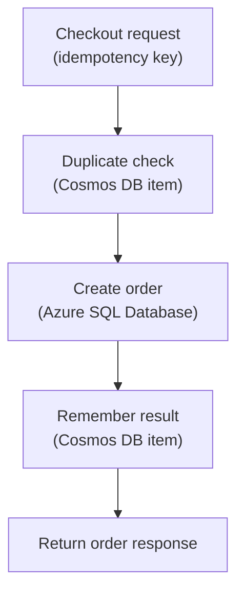

## Table of Contents

1. [NoSQL Starts With The Read Path](#nosql-starts-with-the-read-path)
2. [If You Know DynamoDB](#if-you-know-dynamodb)
3. [Documents Are Not A Shortcut Around Design](#documents-are-not-a-shortcut-around-design)
4. [The Orders API Has Good Cosmos DB Candidates](#the-orders-api-has-good-cosmos-db-candidates)
5. [Partition Keys Are A Product Decision](#partition-keys-are-a-product-decision)
6. [Use TTL For Data That Should Expire](#use-ttl-for-data-that-should-expire)
7. [Do Not Move Relational Questions Into Cosmos DB By Accident](#do-not-move-relational-questions-into-cosmos-db-by-accident)
8. [Failure Modes And First Checks](#failure-modes-and-first-checks)
9. [A Practical Cosmos DB Review](#a-practical-cosmos-db-review)

## NoSQL Starts With The Read Path

Cosmos DB is Azure's managed NoSQL database family.
NoSQL can sound like "no schema" or "no planning." That
is the wrong lesson. With NoSQL systems, you often plan
the read path earlier than you would with a relational
database. The read path means the exact way the
application will ask for data. Will it read one item by
ID? Will it read all items for one customer? Will it
update one job-status record by job ID? Will it search
across many customers by date range? Those questions
matter before you create the container. A Cosmos DB
container stores items.

An item is often a JSON document. The app reads and
writes items through keys, queries, and partitions. A
partition is how Cosmos DB groups and spreads data. For
a beginner, a partition key is the value Cosmos DB uses
to decide where an item belongs and how requests are
routed. If that sounds important, it is. A bad
partition key can make a workload expensive, slow, or
awkward to change.

This article uses `devpolaris-orders-api` as the
running example. The app has relational data, object
files, and some small known-key records. The small
known-key records are where Cosmos DB becomes
interesting. The goal is not "use Cosmos DB for
everything." The goal is to recognize when a NoSQL item
model is a good fit.

## If You Know DynamoDB

If you know AWS DynamoDB, Cosmos DB will feel familiar
in one important way: you should think about access
patterns before you build the table or container. Both
services reward known reads. Both services can feel
painful when the team starts with vague future queries.
The mapping is not perfect.

| AWS idea you may know | Azure idea to compare first | What to watch |
|---|---|---|
| DynamoDB table | Cosmos DB container | Cosmos DB has container-level partitioning and throughput choices |
| Partition key | Partition key | Same core design pressure, but the APIs and limits differ |
| Item | Item or document | JSON document shape is common in Cosmos DB for NoSQL |
| TTL attribute | Time to live | Expiring short-lived records can be part of the data model |
| RCUs and WCUs | Request units | Cosmos DB measures work with request units |

The useful AWS callback is the discipline: write down
the access pattern before choosing the key. If nobody
can say how the app will read the data, Cosmos DB is
probably too early. If the app always reads by a known
key or partition, Cosmos DB may be a very natural fit.

## Documents Are Not A Shortcut Around Design

A JSON document feels friendly to a JavaScript
developer. You can imagine storing one object and
reading it back. That friendliness is useful, but it
can hide the design work. Here is a job-status item for
an export job:

```json
{
  "id": "job_913",
  "type": "order-export",
  "customerId": "admin_17",
  "status": "running",
  "startedAt": "2026-05-03T09:41:12Z",
  "updatedAt": "2026-05-03T09:42:08Z",
  "resultBlob": null
}
```

The document shape is easy to read. The real design
question is not "can JSON store this?" Of course it
can. The real questions are: how does the UI find this
item? Does the worker update the same item? Does
support need to search by customer, date, status, or
failure reason? When should this item expire? What
partition key keeps the normal reads efficient? If the
UI always polls by `job_913`, the design is simple. If
support needs rich reporting across thousands of jobs,
the design may need Azure SQL Database or a separate
reporting path.

Cosmos DB can query, but you should not treat it like a
relational database with a different file format. The
more flexible and unknown the questions become, the
more careful you should be.

## The Orders API Has Good Cosmos DB Candidates

`devpolaris-orders-api` has two records that make good
beginner examples. The first is an idempotency record.
The second is a job-status record. An idempotency
record prevents duplicate work. If a browser retries
the same checkout request, the API should not create
two paid orders. The app can store a record that says:
this request key already produced this result.

```json
{
  "id": "checkout_7f13",
  "kind": "idempotency",
  "customerId": "cus_77",
  "requestHash": "sha256:91fd4b",
  "orderId": "ord_1042",
  "status": "completed",
  "createdAt": "2026-05-03T09:43:17Z",
  "expiresAt": "2026-05-10T09:43:17Z"
}
```

The access pattern is direct. When the checkout request
arrives, the app already knows `checkout_7f13`. It asks
whether that key exists. If it exists, the app returns
the existing result or rejects a mismatched retry. If
it does not exist, the app carefully creates the new
order path. The job-status record is similar. The
export worker creates `job_913`. The UI asks for
`job_913`. The worker updates `job_913`. That can fit
Cosmos DB because the app knows the item it needs. Here
is the small flow.



This diagram is intentionally small. It shows Cosmos DB
as a supporting store around a known key. It does not
move the whole order system into a document database.

## Partition Keys Are A Product Decision

Partition keys are easy to treat as a storage setting.
They are more important than that. A partition key
shapes how the application stores and finds data. It
can be hard to change later. For a beginner, ask this
plain question: which value will the app usually know
when it needs this item? For idempotency records, the
app knows the idempotency key. For job status, the app
often knows the job ID. For customer session state, the
app might know the customer ID. Those are candidate
partition keys, not automatic answers. You also need to
ask whether the value spreads work evenly.

If all writes use the same partition key, one partition
becomes too busy. That is often called a hot partition.
A hot partition means too much work is aimed at the
same logical place. For example, this partition key is
suspicious:

```text
partitionKey = "orders-api"
```

Every item goes into the same logical group. That does
not help Cosmos DB spread work. This is usually more
useful:

```text
partitionKey = customerId
id = checkout_7f13
```

Or for job status:

```text
partitionKey = jobId
id = job_913
```

The right answer depends on the reads and writes. That
is why partition key review belongs near product and
application design, not only infrastructure. If a
teammate says "we can choose the partition key later,"
slow down. That is like saying "we can choose the
primary address of every record later." Sometimes you
can migrate, but migration is work. Designing the
access path early is cheaper.

## Use TTL For Data That Should Expire

Some records should not live forever. Idempotency
records may only be needed for a limited retry window.
Job-status records may only be needed for debugging and
user visibility. Temporary checkout session state may
expire after the customer abandons the flow. Cosmos DB
supports time to live, often called TTL. TTL means
items can expire after a configured amount of time.
That is useful when the data has a natural lifetime.
The key word is natural. Do not use TTL because nobody
wants to decide retention.

Use TTL when the product and operations story agree
that the data should disappear. For
`devpolaris-orders-api`, the team might decide:

| Record | Natural lifetime | Why |
|---|---|---|
| Checkout idempotency key | Several days | Browser and payment retries should settle |
| Export job status | 30 days | Admins need recent debugging history |
| Temporary session state | A few hours | Abandoned sessions should not grow forever |
| Order record | Not a TTL candidate | The business must keep order history |

That last row matters. Cosmos DB can store many kinds
of items, but not every item should expire. Core
business records need a different retention
conversation. TTL is a cleanup tool when the data
really is temporary. It is not a substitute for
understanding data ownership.

## Do Not Move Relational Questions Into Cosmos DB By Accident

Cosmos DB is a good tool. It is not a magic escape from
relational modeling. If `devpolaris-orders-api` needs
to answer changing business questions about orders,
Azure SQL Database may still be the better home. Here
are questions that often point back toward SQL: show
revenue by day and product. Find all failed payments
for one customer in a date range. Join orders to line
items and receipt files. Enforce that every line item
belongs to a valid order. Update several related
records together. You can build many things in Cosmos
DB with careful design. The question is whether that
design fits the team's real workload.

A common bad pattern is storing one huge order document
because it feels easy at first. Then different parts of
the app want to update payment state, fulfillment
state, refunds, support notes, and receipt metadata.
Now the document becomes a shared battlefield. Another
bad pattern is scattering small JSON files into Blob
Storage because "we already have storage." That makes
even simple questions expensive to answer. The senior
habit is to avoid identity politics around databases.
Do not say "NoSQL is modern" or "SQL is old." Say what
the data needs. If the app needs known-key item access
with a clear partition key, Cosmos DB is a good
candidate.

If the app needs relations, transactions, and changing
queries, Azure SQL Database may be the calmer choice.

## Failure Modes And First Checks

Cosmos DB failures usually tell you what kind of design
or runtime issue you have. If the app omits the
partition key, reads and writes may fail or become
inefficient.

```text
2026-05-03T09:50:14.882Z ERROR devpolaris-orders-api requestId=req_52d
cosmos operation failed
container=idempotency
error="PartitionKey value must be supplied for this operation."
```

First check whether the app is passing the partition
key that matches the container design. If many requests
slow down or receive rate-limit responses, the workload
may be consuming more request units than expected.

```text
2026-05-03T09:51:22.104Z WARN export-worker jobId=job_913
cosmos status update throttled
statusCode=429 retryAfterMs=340
```

First check request volume, retry behavior, partition
distribution, and throughput configuration. If one
customer or tenant creates most of the traffic, inspect
whether the partition key creates a hot partition. If
an item cannot be found, check both the item ID and the
partition key.

```text
lookup failed
id=checkout_7f13
partitionKey=cus_77
result=not_found
```

The same ID under a different partition key is a
different lookup path. If old job-status records
disappear earlier than expected, check TTL settings.
That may be correct cleanup or an accidental retention
bug. The point is to debug Cosmos DB as Cosmos DB. Do
not treat every error as "database is down." The error
often points to partition key, throughput, item
identity, TTL, or access permission.

## A Practical Cosmos DB Review

Before choosing Cosmos DB for a feature, ask these
questions. What exact item does the app read? What key
does the app already know at read time? What partition
key will the container use? Can the partition key
change after the item is created? Does one partition
key value get too much traffic? Does the data need
transactions across several unrelated records? Does
support need flexible reporting? Should the item
expire? What happens when the item is missing? What
happens when a duplicate create happens? Here is a
compact review for idempotency records.

| Area | Good first answer |
|---|---|
| Data shape | Small item keyed by checkout idempotency key |
| Service candidate | Cosmos DB |
| Main read | Check key before creating order |
| Partition question | Use a value the request already knows and that spreads traffic |
| Lifetime | Expire after the retry window |
| Failure behavior | Duplicate key returns existing result or safe conflict |

That answer is specific enough to review. "Use Cosmos
DB because it scales" is not specific enough. The
service choice should explain the data behavior, not
hide it.

---

**References**

- [Azure Cosmos DB overview](https://learn.microsoft.com/en-us/azure/cosmos-db/overview) - Microsoft introduces Cosmos DB and the database models it supports.
- [Partitioning and horizontal scaling in Azure Cosmos DB](https://learn.microsoft.com/en-us/azure/cosmos-db/partitioning) - Microsoft explains logical partitions, partition keys, and why partition key choice affects performance.
- [Time to Live in Azure Cosmos DB for NoSQL](https://learn.microsoft.com/en-us/azure/cosmos-db/nosql/time-to-live) - Microsoft explains how TTL can automatically expire items when a workload needs that behavior.
- [Request units in Azure Cosmos DB](https://learn.microsoft.com/en-us/azure/cosmos-db/request-units) - Microsoft explains request units, the measurement Cosmos DB uses for database operations.
