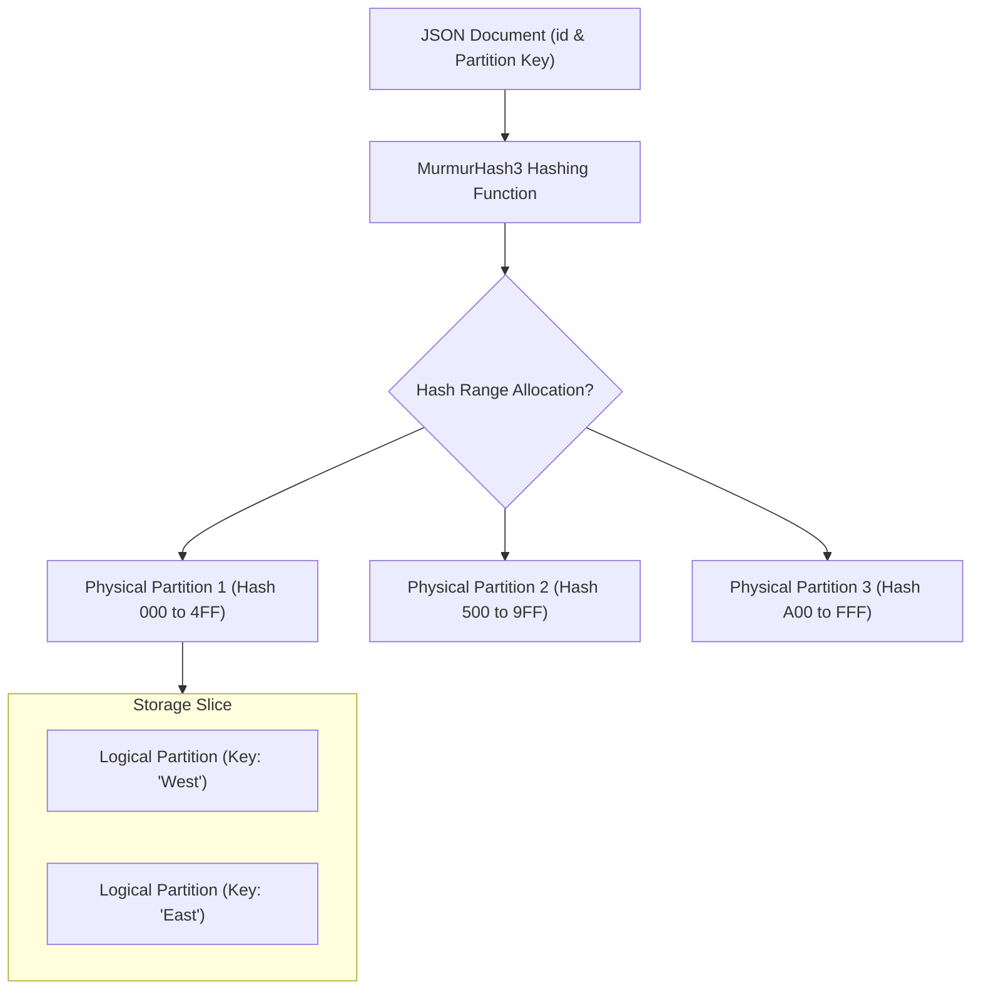
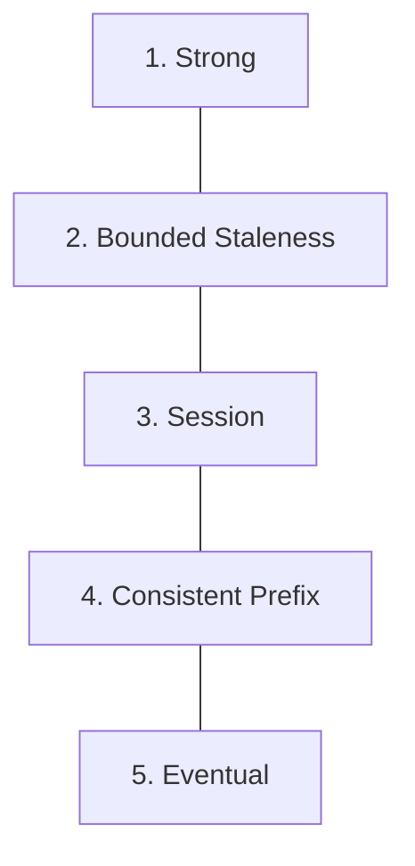

## Table of Contents

1. [What Is Cosmos DB](#what-is-cosmos-db)
2. [Partition Key Strategies and Horizontal Scale](#partition-key-strategies-and-horizontal-scale)
3. [The Five Tunable Consistency Levels](#the-five-tunable-consistency-levels)
4. [Request Units and Capacity Management](#request-units-and-capacity-management)
5. [Time-To-Live (TTL) Automations](#time-to-live-ttl-automations)
6. [Access Patterns and Relational Transitions](#access-patterns-and-relational-transitions)
7. [Putting It All Together](#putting-it-all-together)
8. [What's Next](#whats-next)

## What Is Cosmos DB

Azure Cosmos DB is a fully managed, globally distributed NoSQL database service engineered for horizontal scale, single-digit millisecond response latencies, and high availability. NoSQL databases organize data as semi-structured documents, key-value pairs, or graph nodes rather than rigid relational tables. In Cosmos DB, data is stored as JSON-like documents within logical collections called containers. The platform automates data replication, regional failovers, and partition management, allowing applications to sustain heavy read and write throughput globally.

If you build applications using AWS, Azure Cosmos DB serves as the direct architectural equivalent of Amazon DynamoDB. Both systems decouple NoSQL operations from fixed server nodes and rely on hashed partition boundaries to distribute data across physical machine clusters. 

However, their terminology and capacity designs differ:

* **Table vs. Container**: An Amazon DynamoDB Table maps directly to an Azure Cosmos DB Container.
* **Throughput Units**: While DynamoDB measures performance in Read Capacity Units (RCUs) and Write Capacity Units (WCUs), Cosmos DB bundles CPU, memory, and database I/O into a single combined metric called Request Units (RUs).
* **Indexing and Partitioning**: DynamoDB relies on a partition key and an optional sort key to structure access, whereas Cosmos DB relies on a single logical partition key and automatically indexes every single property within your JSON document by default.
* **Tunable Consistency**: While DynamoDB restricts you to a binary choice between Strongly Consistent and Eventually Consistent reads, Cosmos DB provides five distinct, mathematically proven consistency levels that let you balance network replication speed with data precision.

Understanding NoSQL means recognizing that "schemaless" does not mean "design-free." While Cosmos DB allows JSON documents to adopt varying structures, it places strict design pressure on your team to map out all database access patterns before provisioning your first container.

:::expand[Under the Hood: Hashing Algorithms, Logical Partitions, and RU Mathematics]{kind="design"}
Cosmos DB achieves massive horizontal scale by dividing data into physical storage units using consistent hashing algorithms:

* **Consistent Hashing**: When an application writes a JSON document to a container, the engine extracts the document's partition key value. It runs this value through a MurmurHash3 hashing function, yielding a 128-bit hash value. This hash determines the logical partition boundary of the document.
* **Logical vs. Physical Partitions**: All documents sharing the same partition key value form a single logical partition. Logical partitions are mapped to physical partitions, which are managed server replicas running SSD-backed storage nodes. 
    * **Storage and Throughput Limits**: A single logical partition cannot exceed a strict physical storage limit of 20 GB. A physical partition can hold up to 50 GB of data and deliver a maximum throughput of 10,000 RUs per second.
    * **Partition Splits**: As your database grows, Cosmos DB monitors physical storage allocations. If a physical partition approaches its 50 GB threshold, or if the collective throughput demands exceed 10,000 RUs, the Fabric Controller executes a partition split. It splits the hash range, provisions a new physical replica set, and moves half of the logical partitions to the new hardware without causing database downtime or query interruption.
* **Request Unit (RU) Math**: One RU represents the database resources (CPU, RAM, and disk I/O) required to execute a point read (retrieving a single 1 KB JSON document by its `id` and partition key). Writing that same 1 KB document requires 5 RUs due to synchronous storage replication and indexing. 


:::

Designing NoSQL database containers requires choosing logical partition keys that distribute both data storage volume and query traffic evenly across these physical boundaries, avoiding the bottleneck of a hot physical partition.

## Partition Key Strategies and Horizontal Scale

Selecting a partition key is the single most critical architectural choice in Cosmos DB. Once a container is provisioned, its partition key is immutable; if you select an ineffective key, the only path to resolution is provisioning a new container with the correct key and executing an offline or online data migration.

An ineffective partition key leads to two operational failure modes:

* **Hot Partitions**: If you partition an e-commerce container by `tenantStatus` (where 99% of orders are marked `active`), the logical partition for `active` will rapidly exceed the 20 GB storage limit and bottleneck the physical partition's 10,000 RU limit. This creates a hot partition that throttles concurrent writes, throwing HTTP 429 (Too Many Requests) exceptions.
* **Fan-Out Queries**: When you query a container by a property other than the partition key (for example, querying an orders container by `createdDate` when it is partitioned by `customerId`), Cosmos DB cannot route the query to a specific physical node. Instead, it must broadcast the query to every single physical partition slice. This fan-out query consumes massive RUs and degrades query performance.

A resilient partition key distributes writes uniformly and aligns with your high-frequency query filters:

| Proposed Key | Cardinality | Write Distribution | Query Alignment | Architectural Evaluation |
| --- | --- | --- | --- | --- |
| `requestId` | Ultra-High | Excellent | Strong for point reads by request. | Highly recommended for transaction idempotency logs. |
| `customerId` | High | Excellent | Strong for customer histories. | Highly recommended for customer profile or shopping cart containers. |
| `createdYear` | Low | Poor (Creates hot partitions) | Weak | Anti-pattern. Data accumulates on the current year node. |
| `deviceId` | High | Excellent | Strong for iot telemetry. | Highly recommended for real-time device tracking engines. |

To achieve horizontal scale, ensure that your key exhibits high cardinality (possessing thousands or millions of unique values) and appears in the `WHERE` clause of your most expensive database operations.

## The Five Tunable Consistency Levels

Traditional relational databases prioritize immediate, global consistency, which requires locking rows and coordinating replicas across regions. Cosmos DB recognizes that distributed applications have diverse performance needs. It provides five distinct consistency levels, allowing you to choose the exact trade-off between read latency, availability, and data consistency.



These levels represent a spectrum from strict data alignment to high-performance asynchronous replication:

### 1. Strong Consistency
Strong consistency offers linearizable guarantees. Replicas write data synchronously across all coordinate nodes in your global replica sets before acknowledging a commit. 
* **Read Guarantee**: A read always returns the absolute latest committed version of a document. You will never observe an outdated write.
* **Trade-off**: This level exhibits the highest write latency, suffers a throughput penalty, and limits write availability if a network partition isolates any regional datacenter.

### 2. Bounded Staleness
Bounded staleness ensures that reads may lag behind writes by a configured maximum threshold, defined either by a time window (e.g., 5 seconds) or a version lag (e.g., 100 document updates).
* **Read Guarantee**: Once the lag threshold is crossed, reads are strongly consistent. Within the staleness boundary, reads are consistent in their sequence.
* **Trade-off**: This is highly effective for global multi-region applications that want low write latency but require predictable, bounded limits on how far secondary regions can fall behind.

### 3. Session Consistency (Default)
Session consistency is the most common configuration, providing a scoped read-your-own-writes guarantee within the context of a client session.
* **Read Guarantee**: Within an active client session (tracked via a session token passed in client SDK headers), you are guaranteed to immediately read your own writes. Outside this session, readers observing updates from other clients will eventually catch up, adhering to Consistent Prefix rules.
* **Trade-off**: This delivers optimal write latency and high RU efficiency while providing a predictable user experience for active web visitors.

### 4. Consistent Prefix
Consistent prefix guarantees that readers will never observe document updates out of order.
* **Read Guarantee**: If updates occur in the order A, B, and then C, a client querying the database might see A, or A and B, but they will never see B before A, or C before B.
* **Trade-off**: This allows asynchronous replication over wide areas without global locking overhead, guaranteeing that sequential workflows do not appear scrambled to readers.

### 5. Eventual Consistency
Eventual consistency is the weakest consistency model, offering no ordering or timing guarantees.
* **Read Guarantee**: Replicas update completely asynchronously. Reads can return stale data, but replica nodes will eventually converge on the same state if no further writes occur.
* **Trade-off**: This delivers the absolute lowest write latency, highest query throughput, and maximum database availability.

By understanding these five levels, engineering teams can configure session consistency for customer-facing shopping carts, select bounded staleness for regional dashboards, and leverage eventual consistency for low-priority audit trails.

## Request Units and Capacity Management

To manage costs and throughput inside a Cosmos DB container, you must configure a capacity model that aligns with your application's traffic patterns:

* **Provisioned Throughput (Manual)**: You allocate a fixed number of RUs per second (minimum 400 RUs) directly to the container or database. You are billed hourly for the provisioned capacity, regardless of whether the application executes queries. If traffic spikes and exceeds the provisioned RUs, Cosmos DB immediately rejects excess requests with an HTTP 429 error.
* **Provisioned Throughput (Autoscale)**: You define a maximum RU threshold (e.g., 10,000 RUs). Cosmos DB automatically scales active capacity down to 10% of the maximum (1,000 RUs) when idle and scales up to the maximum instantly when traffic surges, mitigating HTTP 429 throttling.
* **Serverless**: You provision a serverless container with no predefined RU allocations. You are billed purely for the cumulative RUs consumed by your queries. While cost-effective for low-traffic dev-test environments, serverless containers do not support multi-region replication and are capped at a maximum of 20,000 RUs per container.

In production environments, monitor your database metrics for HTTP 429 exceptions. A sudden surge in throttled requests indicates either that your overall RU threshold is too low, or that a poor partition key is routing all write traffic to a single physical node.

## Time-To-Live (TTL) Automations

Cosmos DB includes a built-in, engine-level Time-to-Live (TTL) mechanism that automates document deletion without consuming query throughput. This is highly effective for temporary data assets like idempotency records, session tokens, and telemetry logs.

You can configure TTL behavior at two distinct layers:

* **Container-Level Default**: You set a default TTL in seconds (e.g., `86400` for 24 hours) on the container. Every document written to the container is automatically deleted exactly 24 hours after its last update.
* **Document-Level Override**: You inject a metadata property named `"ttl"` (in seconds) directly into a specific JSON document. This value overrides the container's default rule. Setting `"ttl": 3600` ensures that a specific document expires in one hour, while setting `"ttl": -1` exempts it from deletion entirely.

```json
{
  "id": "req_83b_checkout",
  "customerId": "cust_914",
  "status": "completed",
  "ttl": 604800
}
```

When a document's TTL expires, the Cosmos DB engine marks the document as expired and schedules it for deletion. The background cleanup process runs at a low priority, ensuring that deletions do not consume your provisioned query throughput or impact active application workloads.

## Access Patterns and Relational Transitions

Cosmos DB is highly effective when your application accesses data using predictable primary keys, but it is not a direct replacement for relational databases.

To decide when to transition between NoSQL and relational SQL architectures, map your data requirements to your query patterns:

* **Choose Azure SQL Database when**: Your application requires complex relational joins, multi-table transactions (ACID), flexible ad-hoc reports, and strict foreign key constraints.
* **Choose Cosmos DB when**: Your data is document-shaped, queries are known in advance, you require single-digit millisecond response latencies under heavy write volumes, and you need horizontal scaling or global multi-region replication.

Avoid the anti-pattern of choosing Cosmos DB purely to bypass schema planning. An unplanned NoSQL database often leads to inefficient queries, high request unit costs, and complex, manual data migrations.

## Putting It All Together

Azure Cosmos DB provides a managed NoSQL environment for document-shaped data that requires horizontal scale, predictable performance, and tunable consistency guarantees.

* **Transferable Habits**: Align your Cosmos DB designs with access patterns, matching DynamoDB practices by focusing on partition boundaries and throughput budgets.
* **Hashed Partitioning**: Rely on logical partition keys and hashing algorithms to distribute data across physical storage replicas.
* **Tunable Consistency**: Leverage five distinct consistency levels (Strong, Bounded Staleness, Session, Consistent Prefix, and Eventual) to balance latency with data precision.
* **RU Management**: Monitor request unit consumption and choose between manual, autoscale, or serverless throughput models to manage capacity.
* **Automated Cleanup**: Use the native engine-level Time-to-Live (TTL) mechanism to automate document deletion without impacting query performance.
* **Relational Boundaries**: Keep transactional, relation-heavy business records inside Azure SQL Database, and allocate isolated NoSQL containers for item-shaped, key-based data assets.

## What's Next

Now that we have structured both relational databases and NoSQL document containers, we will explore Disks and File Shares. We will examine how virtual machines mount block-level Managed Disks and share directory structures over Azure Files network protocols.

---

**References**

* [Azure Cosmos DB documentation](https://learn.microsoft.com/en-us/azure/cosmos-db/)
* [Partitioning and horizontal scaling in Azure Cosmos DB](https://learn.microsoft.com/en-us/azure/cosmos-db/partitioning-overview)
* [Consistency levels in Azure Cosmos DB](https://learn.microsoft.com/en-us/azure/cosmos-db/consistency-levels)
* [Request units in Azure Cosmos DB](https://learn.microsoft.com/en-us/azure/cosmos-db/request-units)
* [Time to live in Azure Cosmos DB](https://learn.microsoft.com/en-us/azure/cosmos-db/time-to-live)
