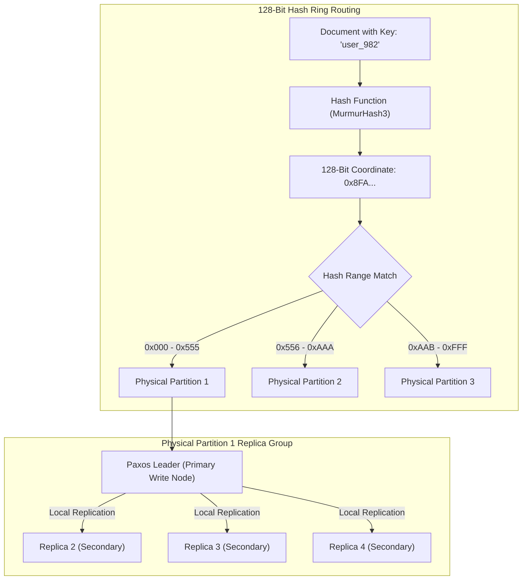
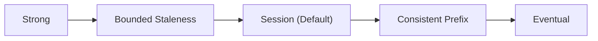

## Table of Contents

1. [The Problem: Scaling Dynamic Documents Globally](#the-problem-scaling-dynamic-documents-globally)
2. [What Is Cosmos DB](#what-is-cosmos-db)
3. [Declarative Provisioning and Passwordless SDK Previews](#declarative-provisioning-and-passwordless-sdk-previews)
4. [Under the Hood: Hashing Rings and Partition Physics](#under-the-hood-hashing-rings-and-partition-physics)
5. [Partition Key Strategies and Horizontal Scale](#partition-key-strategies-and-horizontal-scale)
6. [The Five Tunable Consistency Levels](#the-five-tunable-consistency-levels)
7. [Request Units and Capacity Management](#request-units-and-capacity-management)
8. [Time-To-Live (TTL) Automations](#time-to-live-ttl-automations)
9. [Access Patterns and Relational Transitions](#access-patterns-and-relational-transitions)
10. [Putting It All Together](#putting-it-all-together)
11. [What's Next](#whats-next)

## The Problem: Scaling Dynamic Documents Globally

E-commerce checkout portals, real-time gaming inventories, and global IoT tracking systems manage massive streams of volatile, highly dynamic JSON data. During high-traffic events, millions of global users simultaneously read catalog items, update user carts, and submit telemetry events. If we try to persist this volume using a traditional relational database, we run directly into physical scaling bottlenecks.

Relational systems enforce strict ACID guarantees by locking database rows and coordinating transaction states across compute nodes. When multiple users write to the same table partitions simultaneously, the database manager serializes the requests, creating lock contention queues.

If we attempt to solve this by placing read replicas in global datacenters, the primary database node must still coordinate writes synchronously, or asynchronously push replication logs over high-latency fiber links. Under heavy write surges, this centralized architecture introduces latency delays, connection timeouts, and regional data inconsistencies.

To scale dynamic document workloads across physical earth boundaries without incurring database locks or connection latency bottlenecks, we require a database architecture that abandons rigid tables. We need a system designed from the ground up to partition data horizontally, replicate writes asynchronously, and allow developers to trade global consistency for sub-millisecond network performance. Azure Cosmos DB solves these challenges by acting as a distributed, multi-model NoSQL document platform.

## What Is Cosmos DB

Azure Cosmos DB is Azure's managed database for JSON-like items that are usually read by a known key and scaled across partitions. It is a fully managed, globally distributed NoSQL database service engineered for low-latency point reads and writes, horizontal partition scaling, and high regional availability. Unlike relational databases that store structured rows in fixed tables, NoSQL engines organize semi-structured data as JSON-like documents within logical containers. The platform automates data replication, regional failovers, and partition management, allowing applications to sustain heavy throughput when the data model and partition key are designed well.

If you build cloud systems using AWS, Azure Cosmos DB serves as the direct architectural equivalent of Amazon DynamoDB. Both systems decouple database operations from fixed virtual servers and rely on hashed partition boundaries to distribute data across physical machine clusters.

However, their underlying terminology and performance capacity models differ in critical areas. An Amazon DynamoDB table maps directly to an Azure Cosmos DB container. While DynamoDB measures performance in separate Read Capacity Units (RCUs) and Write Capacity Units (WCUs), Cosmos DB bundles CPU, memory, and database I/O into a single combined metric called Request Units (RUs).

Furthermore, DynamoDB relies on a partition key and an optional sort key to structure access, whereas Cosmos DB utilizes a single logical partition key and automatically indexes every single property within your JSON document by default. Finally, while DynamoDB restricts you to a binary choice between strongly consistent and eventually consistent reads, Cosmos DB provides five distinct consistency levels that allow you to balance network replication latency with absolute data precision.

## Declarative Provisioning and Passwordless SDK Previews

To establish a production-grade Cosmos DB deployment, we declare our infrastructure using Bicep. The configuration below provisions a globally redundant Cosmos DB account configured for session consistency, a database, and a customer shopping carts container partitioned by `/cartId`.

```bicep
resource cosmosAccount 'Microsoft.DocumentDB/databaseAccounts@2023-09-15' = {
  name: 'cosmos-ecommerce-prod'
  location: resourceGroup().location
  kind: 'GlobalDocumentDB'
  properties: {
    consistencyPolicy: {
      defaultConsistencyLevel: 'Session'
    }
    locations: [
      {
        locationName: resourceGroup().location
        failoverPriority: 0
        isZoneRedundant: true
      }
    ]
    databaseAccountOfferType: 'Standard'
    capabilities: [
      {
        name: 'EnableServerless'
      }
    ]
  }
}

resource cosmosDb 'Microsoft.DocumentDB/databaseAccounts/sqlDatabases@2023-09-15' = {
  parent: cosmosAccount
  name: 'ecommerce'
  properties: {
    resource: {
      id: 'ecommerce'
    }
  }
}

resource cosmosContainer 'Microsoft.DocumentDB/databaseAccounts/sqlDatabases/containers@2023-09-15' = {
  parent: cosmosDb
  name: 'carts'
  properties: {
    resource: {
      id: 'carts'
      partitionKey: {
        paths: [
          '/cartId'
        ]
        kind: 'Hash'
      }
      defaultTtl: 86400
    }
  }
}
```

Once the database and container are provisioned, we can connect our application code. Rather than utilizing static storage account primary keys, which are vulnerable to credential theft, we enforce passwordless authentication using Microsoft Entra ID. The Node.js SDK example below initializes a secure Cosmos DB client using managed identities and executes a point write to update a user's shopping cart.

```javascript
import { CosmosClient } from "@azure/cosmos";
import { DefaultAzureCredential } from "@azure/identity";

const endpoint = "https://cosmos-ecommerce-prod.documents.azure.com:443/";
const credential = new DefaultAzureCredential();

const client = new CosmosClient({
  endpoint,
  credential
});

async function updateShoppingCart(cart) {
  const container = client.database("ecommerce").container("carts");
  const { resource } = await container.items.upsert(cart);
  return resource;
}

const activeCart = {
  id: "cart_user_982",
  cartId: "user_982",
  status: "active",
  items: [
    { itemId: "item_laptop_43", qty: 1 }
  ],
  lastUpdated: Date.now()
};

updateShoppingCart(activeCart)
  .then(res => console.log(res.id))
  .catch(err => console.error(err));
```

## Under the Hood: Hashing Rings and Partition Physics

Cosmos DB partitioning is the routing system that decides which backend partition owns each item. Cosmos DB achieves horizontal scale by routing JSON items through a highly coordinated partitioning fabric. Understanding this physical routing mechanism requires looking beneath the managed service boundary at logical partitions, physical partitions, and the 128-bit hash ring.

When an application writes a JSON document to a container, the Cosmos DB engine extracts the document's partition key value. The service passes this string value to a proprietary hashing function (historically MurmurHash3) to generate a 128-bit hash coordinate.

The overall container throughput is mapped across a series of physical partitions, which are the service-managed compute and storage units that run the database engine. Each physical partition is assigned a contiguous, non-overlapping range on the 128-bit hash ring.

When your application SDK or ARM gateway receives a read or write request, it computes the hash of the target partition key, identifies which physical partition owns that hash range, and routes the TCP connection directly to that physical node. This is called direct-mode routing. It bypasses HTTP intermediary gateways to deliver sub-ten-millisecond point reads.



Every physical partition is backed by a highly redundant replica set consisting of four database engine instances. These four instances form a local database quorum group utilizing a Paxos-style consensus protocol.

The Paxos leader handles incoming write requests, writes the transaction to its local write-ahead log, and replicates the updates to the secondary followers. A write is only acknowledged back to the calling client once a quorum of local replica nodes confirms the log flush, guaranteeing high availability even if a host disk fails within the server rack.

Physical partitions have strict architectural boundaries. A single physical partition can support a maximum storage capacity of 50 GB and deliver a maximum throughput of 10,000 RUs per second.

Within a physical partition, Cosmos DB manages logical partitions, which group all documents that share the exact same raw partition key value. A single logical partition (e.g., all documents where `cartId` equals `user_982`) cannot exceed a strict physical storage limit of 20 GB.

As your data grows, Cosmos DB monitors physical partition utilization. When a physical partition approaches the 50 GB threshold or the 10,000 RU ceiling, the service automatically splits the physical partition.

It splits the hash range in half, maps the new sub-ranges to a new physical partition replica group, and migrates the corresponding logical partitions to the new hardware. This partition split occurs completely background-transparent to your application code.

## Partition Key Strategies and Horizontal Scale

A partition key is the item field Cosmos DB uses to group related documents and distribute load. Selecting it is the single most critical architectural decision you will make in Cosmos DB. Once a container is provisioned, its partition key is completely immutable. If you select an ineffective key, the only path to resolution is provisioning a new container with the correct key and executing an offline or online data migration to stream your records.

An ineffective partition key leads directly to two major operational failure modes. The first is a hot partition.

If you partition an e-commerce orders container by `orderStatus` (where 99% of orders are marked `completed`), almost all writes will hash to the exact same logical partition. This logical partition will rapidly exceed the 20 GB physical storage limit.

More critically, 99% of your write requests will target the single physical partition hosting that hash range. This physical partition's 10,000 RU limit will be saturated, causing the Paxos leader to reject excess connections and throw HTTP 429 exceptions, even if the overall container-level RU budget has ample headroom.

The second failure mode is a fan-out query. When you query a container by a property other than the partition key (for example, querying an orders container by `createdDate` when it is partitioned by `customerId`), Cosmos DB cannot route the query to a specific physical node.

Instead, the ARM gateway must broadcast the query to every single physical partition slice. This fan-out query consumes massive RUs, blocks thread queues, and degrades query performance.

A resilient partition key distributes writes uniformly and aligns with your high-frequency query filters. We evaluate potential partition keys across these metrics:

| Proposed Partition Key | Cardinality Level | Write Distribution | High-Frequency Query Alignment | Architectural Evaluation |
| --- | --- | --- | --- | --- |
| `requestId` | Ultra-High | Excellent | Strong for point reads by request. | Recommended for transaction idempotency logs. |
| `customerId` | High | Excellent | Strong for customer histories and carts. | Recommended for user profile or shopping cart containers. |
| `createdYear` | Low | Poor | Weak | Severe anti-pattern; creates hot partitions on the current year. |
| `deviceId` | High | Excellent | Strong for iot telemetry. | Recommended for real-time device tracking engines. |

To achieve horizontal scale, select a partition key that exhibits high cardinality (possessing thousands or millions of unique values) and appears in the `WHERE` clause of your most expensive database operations.

## The Five Tunable Consistency Levels

Cosmos DB consistency levels are read guarantees that trade latency and availability against how fresh a returned value must be. Traditional relational databases prioritize immediate, global consistency, which requires locking rows and coordinating replica states across regions. Cosmos DB recognizes that distributed applications have diverse performance needs. It provides five distinct consistency levels, allowing you to choose the exact trade-off between read latency, availability, and data consistency.



These levels represent a spectrum from strict data alignment to high-performance asynchronous replication:

### 1. Strong Consistency

Strong consistency means every read sees the latest committed write. Cosmos DB must coordinate replicas before it confirms the write, so this option favors correctness over speed and regional availability.

Example: if a payment status changes from `pending` to `paid`, every reader must see `paid` immediately after the write commits.

Replicas write data synchronously across all coordinate nodes in your global replica sets before acknowledging a commit.

A read always returns the absolute latest committed version of a document. You will never observe an outdated write.

This level exhibits the highest write latency, suffers a throughput penalty, and limits write availability if a network partition isolates any regional datacenter.

### 2. Bounded Staleness

Bounded staleness means reads may be behind, but only within a limit you choose. The limit can be a time window or a number of versions.

Example: product inventory shown to users may lag by at most `5` seconds or `100` updates, which gives replicas room to catch up without allowing unbounded drift.

Once the lag threshold is crossed, reads are strongly consistent. Within the staleness boundary, reads are consistent in their sequence.

This is highly effective for global multi-region applications that want low write latency but require predictable, bounded limits on how far secondary regions can fall behind.

### 3. Session Consistency

Session consistency means one client can immediately read its own writes, while other clients may see the update later. Cosmos DB tracks this with a session token passed through SDK calls.

Example: after a shopper updates their cart, that shopper sees the new item right away, while another support dashboard may catch up shortly after.

Within an active client session (tracked via a session token passed in client SDK headers), you are guaranteed to immediately read your own writes. Outside this session, readers observing updates from other clients will eventually catch up, adhering to Consistent Prefix rules.

This delivers optimal write latency and high RU efficiency while providing a predictable user experience for active web visitors.

### 4. Consistent Prefix

Consistent prefix means readers see updates in the correct order, even if they are not fully caught up. They may see an older prefix of the write history, but not a scrambled history.

If updates occur in the order A, B, and then C, a client querying the database might see A, or A and B, but they will never see B before A, or C before B.

This allows asynchronous replication over wide areas without global locking overhead, guaranteeing that sequential workflows do not appear scrambled to readers.

### 5. Eventual Consistency

Eventual consistency means replicas are allowed to catch up asynchronously with no ordering or freshness promise for a specific read. It favors low latency and high availability when stale reads are acceptable.

Example: a public like counter or non-critical telemetry dashboard can tolerate briefly stale counts if the system converges later.

Replicas update completely asynchronously. Reads can return stale data, but replica nodes will eventually converge on the same state if no further writes occur.

This delivers the absolute lowest write latency, highest query throughput, and maximum database availability.

## Request Units and Capacity Management

A Request Unit (RU) is Cosmos DB's combined charge unit for CPU, memory, and I/O work required by a database operation. RUs let Cosmos DB price and limit very different operations using one shared measure.

Example: reading one small item by ID may cost about `1` RU, while a cross-partition query that scans many items can cost hundreds or thousands of RUs.

To manage costs and throughput inside a Cosmos DB container, you must configure a capacity model that aligns with your application's traffic patterns. Cosmos DB offers three capacity modes:

First is provisioned throughput in manual mode. You allocate a fixed number of RUs per second (minimum 400 RUs) directly to the container or database. You are billed hourly for the provisioned capacity, regardless of whether the application executes queries. If traffic spikes and exceeds the provisioned RUs, Cosmos DB immediately rejects excess requests with an HTTP 429 error.

Second is provisioned throughput in autoscale mode. You define a maximum RU threshold (e.g., 10,000 RUs). Cosmos DB automatically scales active capacity down to 10% of the maximum (1,000 RUs) when idle and scales up to the maximum instantly when traffic surges, mitigating HTTP 429 throttling.

Third is serverless mode. You provision a serverless container with no predefined RU allocations. You are billed strictly for the RUs consumed by database operations and the storage used. Serverless is highly effective for intermittent or unpredictable workloads, but serverless accounts run in a single Azure region and do not provide predictable throughput or latency guarantees. Throughput capacity depends on the number of physical partitions, so treat it as a burst-friendly model rather than a replacement for provisioned RU/s on critical steady workloads.

## Time-To-Live (TTL) Automations

Time to Live (TTL) is an expiry rule on Cosmos DB items. Cosmos DB includes a built-in TTL mechanism that automates document deletion after an item reaches its configured expiry. This is highly effective for temporary data assets like idempotency records, session tokens, and telemetry logs.

Example: a checkout idempotency record can expire after `86400` seconds, so retry protection lasts for one day without permanently growing the container.

You can configure TTL behavior at two distinct layers:

First is the container-level default. You set a default TTL in seconds (e.g., `86400` for 24 hours) on the container. Every document written to the container becomes eligible for automatic deletion after that interval from its last update.

Second is the document-level override. You inject a metadata property named `"ttl"` (in seconds) directly into a specific JSON document. This value overrides the container's default rule. Setting `"ttl": 3600` ensures that a specific document expires in one hour, while setting `"ttl": -1` exempts it from deletion entirely.

```json
{
  "id": "req_83b_checkout",
  "customerId": "cust_914",
  "status": "completed",
  "ttl": 604800
}
```

When a document's TTL expires, Cosmos DB marks it as expired and schedules it for deletion. The cleanup is a background operation and can consume available throughput, so monitor RU consumption and throttling instead of assuming TTL deletion is completely free under every capacity mode.

## Access Patterns and Relational Transitions

Cosmos DB is highly effective when your application accesses data using predictable primary keys, but it is not a direct replacement for relational databases.

To decide when to transition between NoSQL and relational SQL architectures, map your data requirements to your query patterns:

First, choose Azure SQL Database when your application requires complex relational joins, multi-table transactions (ACID), flexible ad-hoc reports, and strict foreign key constraints.

Second, choose Cosmos DB when your data is document-shaped, queries are known in advance, you need low-latency point reads and writes, and you need horizontal scaling or global multi-region replication in a provisioned-throughput account.

Avoid the anti-pattern of choosing Cosmos DB purely to bypass schema planning. An unplanned NoSQL database often leads to inefficient queries, high request unit costs, and complex, manual data migrations.

## Putting It All Together

Azure Cosmos DB provides a managed NoSQL environment for document-shaped data that requires horizontal scale, predictable performance, and tunable consistency guarantees.

* **Transferable Habits**: Align your Cosmos DB designs with access patterns, matching DynamoDB practices by focusing on partition boundaries and throughput budgets.
* **Hashed Partitioning**: Rely on logical partition keys and hashing algorithms to distribute data across physical storage replicas.
* **Tunable Consistency**: Leverage five distinct consistency levels (Strong, Bounded Staleness, Session, Consistent Prefix, and Eventual) to balance latency with data precision.
* **RU Management**: Monitor request unit consumption and choose between manual, autoscale, or serverless throughput models to manage capacity.
* **Automated Cleanup**: Use the native Time-to-Live (TTL) mechanism to automate document deletion, and monitor RU consumption because background cleanup still performs service work.
* **Relational Boundaries**: Keep transactional, relation-heavy business records inside Azure SQL Database, and allocate isolated NoSQL containers for item-shaped, key-based data assets.

## What's Next

Now that we have structured both relational databases and NoSQL document containers, we will explore Disks and File Shares. We will examine how virtual machines mount block-level Managed Disks and share directory structures over Azure Files network protocols.

---

**References**

* [Azure Cosmos DB documentation](https://learn.microsoft.com/en-us/azure/cosmos-db/) - Official documentation homepage for Cosmos DB.
* [Partitioning and horizontal scaling in Azure Cosmos DB](https://learn.microsoft.com/en-us/azure/cosmos-db/partitioning-overview) - Guide to logical and physical partitions.
* [Consistency levels in Azure Cosmos DB](https://learn.microsoft.com/en-us/azure/cosmos-db/consistency-levels) - Deep-dive into consistency model mechanics.
* [Request units in Azure Cosmos DB](https://learn.microsoft.com/en-us/azure/cosmos-db/request-units) - Reference for RU modeling and capacity.
* [Choose between provisioned throughput and serverless](https://learn.microsoft.com/en-us/azure/cosmos-db/throughput-serverless) - Comparison of provisioning choices.
* [Time to live in Azure Cosmos DB](https://learn.microsoft.com/en-us/azure/cosmos-db/time-to-live) - Guide to configuring TTL rules.
