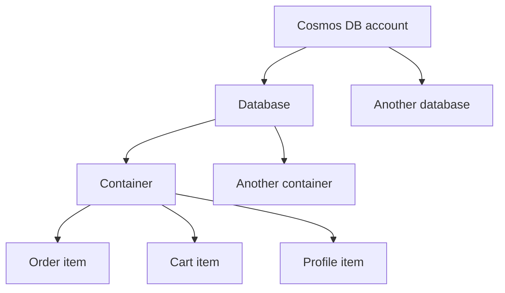
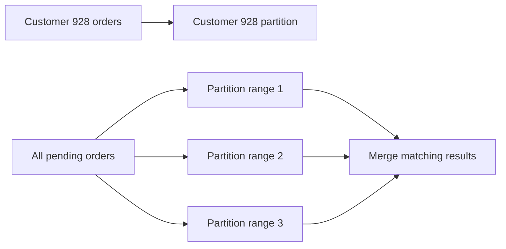
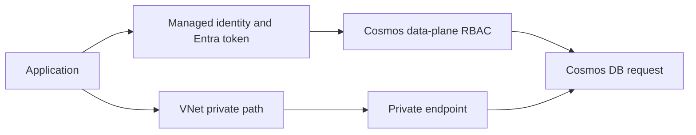
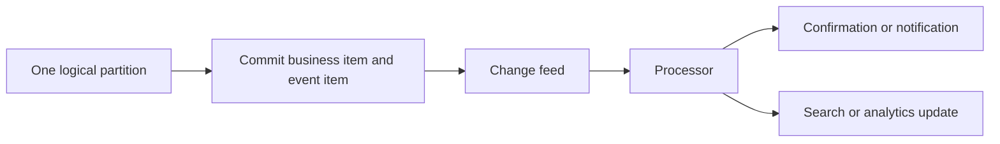

## Table of Contents

1. [What Workloads Fit Cosmos DB?](#what-workloads-fit-cosmos-db)
2. [Why Must Access Patterns Come First?](#why-must-access-patterns-come-first)
3. [How Do Accounts, Databases, Containers, and Items Organize Data?](#how-do-accounts-databases-containers-and-items-organize-data)
4. [Why Is the Partition Key So Important?](#why-is-the-partition-key-so-important)
5. [How Do Request Units, Throughput, Indexing, and Queries Affect Cost?](#how-do-request-units-throughput-indexing-and-queries-affect-cost)
6. [How Do Consistency and Regions Change Behavior?](#how-do-consistency-and-regions-change-behavior)
7. [How Do Private Access, Backup, and TTL Protect Data?](#how-do-private-access-backup-and-ttl-protect-data)
8. [What Transaction Boundaries and Fit Questions Matter?](#what-transaction-boundaries-and-fit-questions-matter)
9. [Check Your Answers](#check-your-answers)
10. [References](#references)

A shopping application needs to retrieve a customer's cart whenever that customer opens the app. A game needs the current state of one player. A connected-device service needs the latest state of one device. These requests ask for a small, identifiable piece of data, even if the application stores billions of other pieces.

Now put those users in London, Sydney, and New York. Each still expects a response in milliseconds. As traffic grows from 10,000 requests per second to 100,000 and eventually 10,000,000, continually buying a larger database server is not a sufficient plan. The data and work need to spread across machines, and the application needs an efficient way to find the right data among them.

Azure Cosmos DB addresses this distributed-data problem. This article uses **Azure Cosmos DB for NoSQL**, where application data is stored as JSON items. Other Cosmos DB APIs expose other models. The examples below start with an order and a shopping cart because their shape makes the central design decision visible: what should the application retrieve together, and which key tells the database where it belongs?

That decision connects the rest of the lesson. A convenient document can still be expensive to find, and a well-distributed database can still return data with a freshness guarantee the application did not expect. These questions explain how to make those choices deliberately:

1. **What Workloads Fit Cosmos DB?**
2. **Why Must Access Patterns Come First?**
3. **How Do Accounts, Databases, Containers, and Items Organize Data?**
4. **Why Is the Partition Key So Important?**
5. **How Do Request Units, Throughput, Indexing, and Queries Affect Cost?**
6. **How Do Consistency and Regions Change Behavior?**
7. **How Do Private Access, Backup, and TTL Protect Data?**
8. **What Transaction Boundaries and Fit Questions Matter?**

## What Workloads Fit Cosmos DB?

Cosmos DB is a managed, distributed database designed around low-latency application access, horizontal scaling, and global availability. **Horizontal scaling** means spreading data and operations across more machines. It differs from vertical scaling, where a workload depends on giving one machine more CPU, memory, or storage capacity. The distinction matters when a database must hold something like 10 PB and serve millions of operations per second: one server is no longer a practical place for all that work.

Many suitable workloads repeatedly read or update independent pieces of application state. User profiles, shopping carts, game state, device telemetry, product catalog entries, sessions, messages, and personalization data all provide examples. They do not all have identical requirements, but each can have a natural lookup such as a user ID, device ID, or product ID. The database can route that request toward the relevant part of the data instead of inspecting the entire collection. [Microsoft's Cosmos DB overview](https://learn.microsoft.com/en-us/cosmos-db/overview) describes this distributed service model.

Consider four common application patterns:

| Application | Typical lookup | Data retrieved together |
|---|---|---|
| Gaming | `playerId` | One player's game state |
| IoT | `deviceId` | The latest state of one device |
| SaaS | `tenantId` | Documents belonging to one tenant |
| Shopping | `customerId` | A customer's cart, orders, or preferences |

These keys are candidates, not automatic answers. A tenant might be much larger than the others, or one device might generate an exceptional amount of traffic. The useful starting point is that the application can describe how it normally finds data. Partitioning decisions then test whether that description will distribute both storage and requests adequately.

Cosmos DB is especially attractive when several needs appear together: very large scale, high request volumes, flexible JSON documents, fast key-based reads, global distribution, and access patterns that divide naturally into groups. Microsoft's examples include gaming, e-commerce, IoT, web and mobile applications, and other real-time systems. A service does not need every characteristic, but the combination explains why the architecture exists.

### How this differs from a relational workload

Azure SQL Database starts from a different strength. You describe entities, relationships, constraints, joins, and transactions, then use a relational engine to query those relationships. An order can relate to customers, order lines, contracts, invoices, and payments without copying all of their data into one document.

Suppose the central requirement is to group sales by customer, region, product category, account manager, and quarter, while joining those related tables. Suppose transactions also modify many unrelated entities together. That workload has a strong relational shape. It is not merely asking for one customer's current cart.

The same distinction applies at smaller scale. A 20 GB database handling 200 requests per second in one region, with rich relationships and complex reporting, may not need the distributed access model that Cosmos DB asks you to design. Cosmos DB can store the data, but storing it successfully does not establish that it is the most natural database for querying and changing it.

The choice is therefore not “JSON is modern, tables are old.” It is a choice about the operations the application needs. Relational modeling often favors normalization and flexible combinations at query time. Cosmos DB modeling often favors keeping an aggregate together: an order with a customer snapshot, order lines, shipping information, and calculated totals. Each approach trades work at one point in the lifecycle for work at another.

Before choosing either service, describe the most frequent reads, the writes that must succeed together, and the expected distribution of traffic. Those facts are more useful than the label “NoSQL.” The next section turns that general advice into a concrete document design.

## Why Must Access Patterns Come First?

An **access pattern** describes how an application reads or changes data. “Get customer 928's cart” is an access pattern. So is “find every pending order worldwide,” but the second request reaches across far more data. Two applications can store the same fields and still need different models because they ask different questions of those fields.

Start with an order represented relationally:

| OrderId | CustomerId | Status |
|---|---|---|
| 1001 | 928 | Paid |

Its order lines might live separately:

| OrderId | ProductId | Quantity |
|---|---|---|
| 1001 | P100 | 2 |
| 1001 | P205 | 1 |

A relational query combines the order and its lines. In Cosmos DB for NoSQL, an application can instead store the useful business object as one JSON item:

```json
{
  "id": "order-1001",
  "customerId": "customer-928",
  "status": "paid",
  "total": 79.99,
  "lines": [
    {
      "productId": "P100",
      "quantity": 2
    },
    {
      "productId": "P205",
      "quantity": 1
    }
  ]
}
```

The item contains its identity, the property used for partitioning, ordinary JSON properties, and an array of nested line objects. If the application usually displays the order with its lines, reading one item provides the data it needs without joining several separate records.

That does not make embedding the right answer for every relationship. The reason for placing these values together is the read that uses them together. First identify that read; then decide which data belongs in the document. Starting with an arbitrary JSON shape and discovering the application's dominant queries afterward reverses the reasoning.

### Flexible documents still need a schema

“Schema-less” can suggest that structure no longer matters. Applications still make assumptions about fields such as `order.id`, `order.customerId`, `order.status`, and `order.lines`. Those assumptions form an application-level schema even if the database does not require a centrally declared relational table definition.

For example, these two documents do not offer the same interface to application code:

```json
{
  "customerId": 928
}
```

```json
{
  "customer": {
    "id": "928"
  }
}
```

One uses a number in a top-level property. The other uses a string inside a nested object. Code expecting the first cannot simply read the second in the same way. Flexible document storage gives teams room to evolve data structures, but it does not remove the need for writers and readers to agree on those structures.

A more accurate description is **application-defined document structure**. The application determines the useful shape, including which values are nested or repeated. It must also account for how that shape is read and changed over time.

### Model the request before the relationships

If the overwhelmingly common request is “give me customer 928's shopping cart,” the following document directly supports it:

```json
{
  "id": "cart",
  "customerId": "928",
  "items": [
    { "product": "A", "quantity": 2 },
    { "product": "B", "quantity": 1 }
  ]
}
```

The application asks for a cart, so it receives a cart rather than assembling one from several independently located records. Relational modeling commonly normalizes entities first and combines them through joins. Distributed document modeling asks earlier which data should be colocated so that the common operation requires less distributed work.

This also explains deliberate **denormalization**, or storing a value in more than one place. If every order display needs the customer's name, an order could contain a snapshot:

```json
{
  "orderId": "1001",
  "customerId": "928",
  "customerName": "Alice",
  "total": 79.99
}
```

The customer name also exists elsewhere, so information is duplicated. The benefit is that a read does not repeatedly coordinate with another location just to obtain a few bytes. The trade-off is extra stored data and an application decision about what the copied value means. Calling it a snapshot makes clear that the document includes the value used for that order, rather than implying that duplication has no consequences.

At large scale, spending a little more storage can avoid substantial repeated coordination. This is the reasoning behind the aggregate model, not a general instruction to copy every related object. Common reads should guide which information travels together.

Finally, document shape alone does not guarantee a targeted read. The database still needs to locate the item. Its resource hierarchy and item identity explain how the shape chosen here connects to the distributed storage underneath it.

## How Do Accounts, Databases, Containers, and Items Organize Data?

The principal resource hierarchy for Cosmos DB for NoSQL is an account containing databases, databases containing containers, and containers containing items.


```mermaid
flowchart TD
    A["Cosmos DB account"] --> B["Database"]
    A --> C["Another database"]
    B --> D["Container"]
    B --> E["Another container"]
    D --> F["Order item"]
    D --> G["Cart item"]
    D --> H["Profile item"]
    class A control
    class B,C,D,E storage
    class F,G,H data
```

The **account** is the broad Azure-level configuration boundary. Its settings cover concerns such as regions, default consistency, networking, authentication, and other service behavior. These affect how the managed database is exposed and operated, rather than defining the fields of one order.

A **database** groups containers. A **container** is a more direct data-design boundary: it is a major unit of partitioning, throughput, indexing, and scalability. An **item** is the actual application record, usually a JSON document for the NoSQL API. Cosmos DB automatically partitions containers so their storage and throughput can grow horizontally.

This hierarchy prevents a common misunderstanding. A container is not merely a folder name around some JSON files. Choosing its partition key and indexing policy affects how all of its items are distributed and queried. Organizing documents into containers therefore has operational consequences beyond making the resource list tidy.

### Locate an item with its ID and partition key

Suppose an item contains these values:

```json
{
  "id": "order-1001",
  "customerId": "customer-928"
}
```

If the container uses `/customerId` as its partition-key path, locating this item requires both the partition-key value `customer-928` and the item ID `order-1001`. The path identifies the property to read from each document; the value identifies the particular logical group for this document.

These are different pieces of information. The ID identifies the item within the relevant partition. The partition-key value tells Cosmos DB which group contains it. Supplying only the order ID does not express the same complete location.

A **point read** supplies both values and requests that exact item. The service does not need to search for partitions that might contain a matching order. It can route the request to the right partition and locate the item directly. Microsoft uses a point read of an approximately 1 KB item as the canonical operation costing about 1 Request Unit, or RU. The size and consistency assumptions matter; the example is not a promise that every possible read costs exactly one RU.

A profile read works the same way: partition key `user-928`, item ID `profile`. The application already knows where the item belongs. A query such as “find the document with this email address” instead describes a condition the database must evaluate. Even if that query returns one item, it is not automatically equivalent to a point read.

### Keep the application view separate from the infrastructure view

The application sees JSON items and logical groups such as customers. Cosmos DB manages physical partitions, indexes, replica sets, and the machinery needed to execute requests. Azure also supplies the regions, identity, networking, backup, availability, and managed infrastructure around that engine.

These layers are connected, but the application does not normally choose a server for each customer. It chooses a data model and partition key. Cosmos DB maps that choice to physical infrastructure. The partition key is consequently the bridge between a business-level grouping and the distributed database that serves it.

This is why understanding the hierarchy must lead to understanding partitioning. The account and container can be created successfully while the chosen key still concentrates nearly all the traffic in one place. Resource creation establishes the structure; a sound key makes that structure useful under load.

## Why Is the Partition Key So Important?

Partitioning divides a container's data so different machines can perform work at the same time. If a database needs more capacity, the service can distribute its partitions across more physical resources. The application benefits only if its data and requests can actually spread across those resources.

Suppose the partition-key path is `/customerId`. Every item with `customerId = 928` belongs to the same **logical partition**. That group might contain `order-1001`, `order-1052`, `cart`, and `profile`. Items with `customerId = 412` belong to a different logical partition, perhaps containing `order-2001`, `order-2104`, and that customer's cart and profile.

Cosmos DB hashes partition-key values and maps logical partitions onto **physical partitions** that it manages. A physical partition can contain several customer groups. For example, one might hold customers 928, 17, and 86, while another holds customers 412, 39, and 702. These placements are illustrations of grouping, not instructions to place specific customers on specific servers.

Azure handles physical placement and the splitting or redistribution needed as the container grows. Your application defines the logical grouping through the key; Cosmos DB manages the physical implementation. You do not normally rebalance servers manually when another customer signs up.

### Balance distribution with locality

A useful key has many distinct values and reasonably even traffic. The number of distinct values is called **cardinality**. A key with only a few possible values offers fewer groups across which to distribute work.

Consider using `/status` with values `Pending`, `Paid`, and `Cancelled`. If 80% of requests concern `Paid`, a single logical partition receives most of the work. This is a **hot partition**. The account may have substantial total capacity while that particular group is overwhelmed.

Low-cardinality properties such as status, type, or country can therefore be poor choices when they concentrate storage or throughput. The ordinary logical-partition limits described in Microsoft's partitioning guidance are 20 GB and 10,000 RU/s. These limits make the risk concrete: adding account-wide capacity does not make one ordinary logical partition unlimited.

On the other hand, scattering every related item as widely as possible can make normal operations expensive. If the application usually reads a customer's cart, orders, and preferences, `/customerId` offers locality as well as many potential values. Those operations have a meaningful group to target.

A good key balances both needs. Review the expected data volume per value, write distribution, query patterns, and transaction boundaries. A large number of customers does not prove that traffic is even, and a convenient business grouping does not prove that its largest member fits. There is no universally best property independent of the workload.

### Understand the cost of crossing partitions

With data partitioned by customer, a request for customer 928's orders can be routed toward that customer's partition. A request for every pending order worldwide has a different scope. It may need to contact many partition ranges and merge their results.

That is a **cross-partition**, or fan-out, query. Cosmos DB supports it; support does not mean that it costs the same as a targeted request. More partitions generally mean more work, greater RU consumption, and potentially more latency.


```mermaid
flowchart LR
    A["Customer 928 orders"] --> B["Customer 928 partition"]
    C["All pending orders"] --> D["Partition range 1"]
    C --> E["Partition range 2"]
    C --> F["Partition range 3"]
    D --> G["Merge matching results"]
    E --> G
    F --> G
    class A,C workload
    class B,D,E,F storage
    class G control
```

The distinction is useful when reviewing an API. If the normal request already contains the customer ID, make sure the data access uses it. If the normal request intentionally spans all customers, acknowledge that it is distributed work instead of judging it by point-read expectations.

### Subdivide large tenants with hierarchical keys

Multitenant applications expose a common tension. Keeping data together by `TenantId` makes tenant-specific requests easier to route, but one very large tenant might exceed the storage or throughput of a single ordinary logical partition.

**Hierarchical partition keys** support up to three levels, such as `TenantId`, `UserId`, and `SessionId`. This allows a large tenant to subdivide its data rather than forcing every item for that tenant into one ordinary key value. A query that supplies a prefix such as `TenantId` can still be directed toward the subset of physical partitions containing that tenant's data.

The hierarchy preserves useful locality without treating “one tenant” as an indivisible storage unit. Tenant A and Tenant B can each contain many users, with sessions grouped beneath those users. The design still needs an understanding of traffic and query patterns; the feature provides additional grouping choices rather than selecting a correct key automatically.

### Follow the same lookup as the application grows

For an international retailer, the hottest request may be “get or update this user's cart.” A fuller cart document could be:

```json
{
  "id": "cart",
  "customerId": "928",
  "items": [
    {
      "productId": "A19",
      "quantity": 2,
      "priceAtAdd": 12.50
    },
    {
      "productId": "B77",
      "quantity": 1,
      "priceAtAdd": 9.99
    }
  ]
}
```

With `/customerId` as the key, customer 928's cart is located by the pair `("928", "cart")`. The application can keep using that lookup as the retailer grows from 10,000 customers to 1,000,000 and then 500,000,000. Cosmos DB spreads customer partitions across increasing physical capacity underneath the same logical request.

A drawing might divide customers into alphabetic groups to illustrate distribution, but the actual mapping is hash-based. The essential point is that the application does not replace its targeted lookup with a global search just because the database now holds more customers.

Partitioning explains where work goes. The next question is how much work each operation requires and how much capacity the service has to perform it.

## How Do Request Units, Throughput, Indexing, and Queries Affect Cost?

A virtual machine exposes resources such as vCPUs, memory, and disk IOPS. Azure SQL Database planning can involve vCores, memory, I/O, and transaction-log throughput. Cosmos DB uses **Request Units** to combine the CPU, memory, and I/O work of database operations into one performance measure.

An **RU** measures the cost of an operation. **RU/s** measures throughput capacity: how much of that work can be performed each second. Confusing the two is like confusing the size of a task with the rate at which tasks can be completed.

A point read of an approximately 1 KB item by ID and partition key costs about 1 RU under the canonical conditions. A query that filters hundreds of thousands of items across partitions, sorts them, and returns a large result requires more work. Operation type, item size, query complexity, result size, indexing, and consistency all influence the charge.

Microsoft describes the RU charge as deterministic for a given operation over the same data. That makes measurement useful for planning. Rather than guessing from the number of API requests alone, measure what those requests ask the database to do.

For an idealized workload with 10,000 RU/s available and a uniform operation cost of 5 RU:

$$
\text{Operations per second} = \frac{10{,}000\ \text{RU/s}}{5\ \text{RU}} = 2{,}000
$$

Real traffic mixes cheap reads, writes, queries, small documents, and large documents. The calculation explains the units, but capacity planning needs the measured distribution of operation costs. Two APIs receiving the same request count can impose very different database demand.

### Recognize throttling before blaming availability

If 1,000 RU/s is available and requests demand 1,400 RU in one second, the excess work cannot all receive capacity immediately. Cosmos DB can return HTTP `429 Too Many Requests`, including retry timing guidance. SDKs generally handle many of these responses by waiting for the indicated interval and retrying.

A 429 therefore does not automatically mean that the database is broken. It can mean that demand exceeded provisioned throughput, or that one partition received a disproportionate share of the work. Retries may hide some responses from the final application result, but the time spent waiting still contributes to user-visible latency.

This is why total throughput and partition distribution must be examined together. An account-wide chart can look comfortable while one physical partition is saturated and others are mostly idle. Normalized RU metrics help reveal that uneven utilization.

### Choose a throughput model for the load

With **manual provisioned throughput**, you set capacity—for example, 20,000 RU/s—and pay for the capacity provisioned. This is a straightforward model for steady, predictable demand.

With **autoscale**, you set a maximum and Cosmos DB adjusts throughput within the permitted range as usage changes. This suits variable demand, but its maximum remains a real limit. Autoscale does not remove the effects of a hot partition.

With **serverless**, you do not pre-provision RU/s in the same way. Charges are based more directly on the RUs consumed by operations. Intermittent or lower-volume workloads may fit that model. The decision should follow measured demand rather than an assumption that the newest-sounding option is always preferable.

Global distribution changes the calculation too. If configured throughput is 10,000 RU/s and the account has three associated regions, the configured capacity is made available in each region. Microsoft's simple global-capacity expression is:

$$
\text{Global available RU capacity} \approx R \times N
$$

Here, `R` is configured RU/s and `N` is the number of regions. In this example, that is approximately 30,000 RU/s across the regions. It is not 30,000 RU/s available to one hot logical partition. The expression describes regional capacity, and those regional deployments also affect cost.

For the retailer's sale, normal demand might consume 50,000 RU/s while sale traffic requires 300,000 RU/s. If the available capacity cannot meet that demand, the SDK may wait and retry after 429 responses. Autoscale can expand within its configured maximum, but demand above that maximum or concentrated on one partition can still be throttled.

### Account for indexing work

Flexible JSON can still be queryable because Cosmos DB for NoSQL indexes properties automatically by default. A new container's default policy indexes properties, with range indexes for strings and numbers. Documents need not all have identical shapes:

```json
{
  "id": "1",
  "name": "Alice",
  "city": "London"
}
```

```json
{
  "id": "2",
  "product": "Camera",
  "price": 999,
  "tags": ["photo", "electronics"]
}
```

The indexes make those properties available for queries without requiring a traditional index-design exercise for every field on the first day. That convenience still has a write cost. An item with 100 indexed properties can require substantial index maintenance when written.

An indexing policy can include or exclude property paths. Early development may benefit from broad indexing while the team learns its access patterns. Later, observed queries can guide removal of unnecessary indexes and addition of specialized indexes where useful. The aim is to retain the query support the application needs while avoiding write work that provides no benefit.

An index does not erase the difference between a point read and a query:

```sql
SELECT *
FROM c
WHERE c.email = "alice@example.com"
```

If `email` is not the partition key, the service may still need to coordinate across partition ranges. Knowing a matching condition is not the same as supplying the exact item ID and partition-key value.

A useful performance order is: a small item read by ID and partition key; a query with the partition key supplied; a query across partitions; then a cross-partition operation with a large scan, sorting or aggregation, and a large result. This is a design guide, not a fixed pricing formula. Measure the real operations before making a capacity decision.

When latency rises, work through application timing, SDK diagnostics, network latency, 429s, RU consumption, hot partitions, point-read versus query behavior, cross-partition work, index usage, and document size. Each step asks for evidence about a different cause. Increasing throughput before identifying that cause can leave an inefficient request or concentrated partition unchanged.

## How Do Consistency and Regions Change Behavior?

Regional copies introduce a question that a document shape cannot answer. If Alice changes an order to `status = "paid"` in London, how soon must a reader in Sydney see that change? A third copy in Virginia raises the same question. Information takes time to travel, so the service must define what reads may observe while replicas coordinate.

**Consistency** describes those read guarantees. It connects freshness to latency, availability, coordination, throughput, and cost. Choosing a level is therefore part of application correctness, not just a performance preference.

### Compare the five consistency levels

**Strong consistency** offers the intuitive model that a read observes the latest committed value. Once an update from `v1` to `v2` commits, a subsequent read should not treat `v1` as the current value. Maintaining that guarantee across distributed replicas requires stronger coordination, with corresponding latency, availability, and throughput trade-offs.

**Eventual consistency** permits replicas to differ temporarily. London might have `v2` while Sydney and Virginia still have `v1`; later, the replicas converge on `v2`. This relaxes synchronization requirements, but the application must tolerate stale reads in the meantime.

**Session consistency** addresses a common user expectation: after making a change, a user should see that change in the relevant session. If Alice changes her profile name to Alicia and refreshes, seeing Alice again would be confusing. Session consistency provides guarantees including read-your-own-writes within the session, while distant clients can catch up asynchronously. It is the default account consistency and the most widely used level described in the supplied service guidance.

**Bounded staleness** permits lag within an explicit limit, expressed through versions or time. The application accepts that a read may be behind, but not without a defined bound. This differs from simply hoping that replication will be fast enough.

**Consistent prefix** allows lag but preserves the order of writes as observed by readers. If writes occurred as A, B, C, and D, a reader might temporarily see A B or A B C. It should not see A D while missing the intervening sequence.

| Level | Main guarantee to understand |
|---|---|
| Strong | Reads observe the latest committed value |
| Bounded staleness | Reads may lag only within the configured bound |
| Session | The relevant session receives guarantees including reading its own writes |
| Consistent prefix | Readers can lag but do not observe the write sequence out of order |
| Eventual | Replicas may differ temporarily and converge afterward |

The levels are not five grades from “bad” to “good.” They describe different contracts. A requirement to read one's own profile change does not automatically imply that every distant reader must synchronously observe every write.

### Include the resource cost of the guarantee

Strong and bounded-staleness reads consult more replica state than comparable relaxed reads. Microsoft's RU guidance describes their read cost as approximately twice that of comparable session, consistent-prefix, or eventual reads.

This is another reason the 1 RU point-read example needs its assumptions. Keeping the same item and access method while changing the consistency requirement can change the read cost. Capacity planning needs the guarantee the application will actually use.

Start with the business behavior that would be unacceptable. Would a temporarily old profile be confusing only to the person who changed it, or would any stale observation violate the application's requirement? The answer gives meaning to the consistency setting. Selecting the strongest label without considering its cost and behavior is not a substitute for that decision.

### Distinguish read distribution from write topology

A single-write-region design directs writes to a principal region, such as London, and replicates data to regions such as Sydney and Virginia. This gives remote readers copies nearer to them while keeping one principal write location.

A multi-region write configuration allows independent regions to accept writes closer to their users. It also introduces the possibility that two regions update the same item concurrently. Conflict handling is consequently part of that write model.

Neither topology eliminates the need to choose a consistency guarantee. Regions describe where service capacity and replicas exist; consistency describes what observations are allowed while those replicas communicate. The application's preferred region, write behavior, and tolerated freshness must be considered together.

For the shopping-cart example, Alice's mobile app calls an application API. The API uses the Cosmos DB SDK with the relevant identity, preferred region, customer ID, and cart ID. The SDK can then route toward the customer partition and exact item. Regional placement can shorten part of the network journey, but it does not turn an unknown-key search into a point read or remove the need for authorization.

The same regional design also needs a recovery plan. A replica can keep service available after an infrastructure failure, but a replica is expected to reproduce valid changes—including a mistaken deletion.

## How Do Private Access, Backup, and TTL Protect Data?

Access, recovery, and expiration solve separate problems. Access controls who can reach and use the database. Backup preserves recoverable history. Time to Live removes data whose useful lifetime has ended. Treating any one of these as a replacement for the others leaves gaps.

### Separate network reachability from authorization

A request must have an allowed network path and a permitted identity. Valid credentials cannot compensate for a blocked path. A working connection cannot compensate for missing authorization.

Cosmos DB supports account keys, but these are powerful credentials rather than ordinary application passwords. A production approach for Azure workloads uses a **managed identity**, Microsoft Entra ID tokens, and Cosmos DB data-plane role-based access control. The identity establishes who the application is; the data-plane role defines the database actions it may perform.

Local or key-based authentication can also be disabled so access requires Microsoft Entra identities. This removes a long-lived account secret from application configuration. It does not remove the requirement to assign appropriate data access.

**Private Link** provides a private endpoint through which workloads on an appropriate network can reach Cosmos DB. An AKS workload, App Service application, or VM uses its VNet-connected path to the endpoint's private IP, then the managed database service. Combined with disabled public network access, this limits access to approved private paths.


```mermaid
flowchart LR
    A["Application"] --> B["Managed identity and Entra token"]
    B --> C["Cosmos data-plane RBAC"]
    A --> D["VNet private path"]
    D --> E["Private endpoint"]
    C --> F["Cosmos DB request"]
    E --> F
    class A workload
    class B,C control
    class D,E boundary
    class F storage
```

The branches describe two requirements for the request, not two interchangeable routes. Identity limits who may act. Networking limits where a connection can originate and which path it uses. A private endpoint does not itself grant permission to read an item.

### Recover from a wrong change

Imagine copies in London, Paris, and Virginia. An authorized operation accidentally deletes customer 928's data. Replication should propagate that operation to the other copies. Its job is to maintain the database's replicated state, not to decide that a valid delete was a mistake.

Regional replication addresses machine, partition, and regional availability failures. It does not preserve the previous state after a valid-but-wrong delete, bad application update, or operator error. Those failures require a separate historical recovery mechanism.

In **periodic backup mode**, Cosmos DB takes backups on a schedule. The supplied defaults are a full backup every four hours with the latest two backups retained; interval and retention can be adjusted within the mode's constraints. These backups do not consume the application's provisioned RU/s. The recovery limitation is the interval between backup points.

**Continuous backup** supports point-in-time recovery. If a bad update occurs at 09:03, the desired recovery point might be 09:02:59. This addresses “the data was corrupted 17 minutes ago,” rather than “a physical replica disappeared.”

The August 2026 material describes second-level restore granularity, 7-day and 30-day continuous retention tiers, and a 35-day option in preview. The distinction between supported tiers and a preview option matters when planning recovery; they should not be presented as equally established choices.

Multi-region availability and point-in-time restore can both be necessary. One keeps service operating through infrastructure disruption. The other recovers historical data after logical damage. A production design should say which requirement each mechanism satisfies.

### Give temporary items a defined lifetime

Login sessions, shopping-cart reservations, temporary device telemetry, cache records, and ephemeral workflow state often have an expiration requirement. Keeping them forever adds storage and cleanup work without preserving useful application state.

**Time to Live**, or TTL, lets a container define a lifetime and individual items override it. The countdown is based on the item's last modification time. Expired items are eligible for background deletion, so the lifetime rule should not be described as a guarantee that a physical delete finishes at one exact instant.

For example:

```json
{
  "id": "session-92817",
  "userId": "928",
  "ttl": 1800
}
```

A TTL of 1,800 seconds expresses a 30-minute lifetime. Because modification time is the basis, understanding updates is part of understanding this record's lifetime. The application cannot interpret the value independently of the container's TTL configuration and the item's modification behavior.

Without this capability, a team might schedule an hourly job to find and delete old sessions. TTL places the lifecycle rule in the persistence model instead. That can reduce cleanup code, stale data, and storage consumption, particularly for large streams of short-lived items.

Expiration is intentional deletion, not backup. A design that automatically removes temporary data still needs a recovery strategy for data that should not have been removed. Clear lifecycle rules and clear recovery rules complement each other.

## What Transaction Boundaries and Fit Questions Matter?

A **transaction** groups changes that must succeed or fail together. ACID transaction behavior matters when a partial result would leave the application in an invalid state. In the traditional Cosmos DB model, the important multi-item transaction boundary is one logical partition.

Suppose customer 928's cart, order, and event or audit item all use the same partition-key value. A transactional batch can update the cart, create the order, and create the associated item atomically: all operations commit, or all roll back.

Colocation makes that coordination local. Spreading the required records across customer 928, customer 412, and customer 781 creates a distributed coordination problem instead. The key therefore affects correctness as well as performance. It helps determine which related operations fit within the straightforward transactional boundary.

This is why transaction requirements belong in partition-key design, not merely in the final application implementation. A convenient lookup key that separates records needing frequent atomic changes may create a problem that additional throughput cannot solve.

### Keep preview capabilities separate from the baseline

The August 2026 material records distributed transactions for Cosmos DB for NoSQL in public preview. Through the preview .NET SDK, that capability can atomically span logical partitions, containers, and databases within the same account and region.

The documented restrictions in that material include enrollment requirements, no SLA, a single-write-region account, no serverless support, and compatibility limits with other features. These boundaries are part of the capability description, not a footnote to omit.

For established architecture reasoning, one logical partition remains the safe baseline for multi-item transactional batches. Do not assume that arbitrary distributed transactions are universally available or cost the same as local operations. Even where a feature permits atomic coordination across partitions, the additional communication and complexity do not disappear.

The useful design principle survives the feature change: place frequently coordinated state together where the workload permits it. A preview expands possible implementations; it does not make data locality irrelevant.

### React to changes without repeatedly scanning everything

The **change feed** exposes database changes as a stream that applications can process. If order 1001 is created, order 1002 is created, and order 1001 is updated, downstream work might send confirmations, update a search index, update analytics, or generate notifications.

This is different from repeatedly scanning the entire container to discover whether anything changed. Workers can react to the stream of changes instead of treating every check as a new search over all stored data.

The transactional-outbox pattern connects that stream to the transaction boundary. Business state and an event item can be committed in the same logical partition. A change-feed processor then publishes the event downstream. The local transaction preserves the relationship between the state change and the event record; the processor handles the downstream publication.


```mermaid
flowchart LR
    A["One logical partition"] --> B["Commit business item and event item"]
    B --> C["Change feed"]
    C --> D["Processor"]
    D --> E["Confirmation or notification"]
    D --> F["Search or analytics update"]
    class A storage
    class B,C,D control
    class E,F workload
```

The diagram shows why the event item belongs with the business state that creates it. The change feed is useful on its own, but the transaction provides the local all-or-nothing relationship needed by this pattern.

### Review the whole design, not just the database choice

Five questions expose most important Cosmos DB decisions. What are the dominant access patterns? Which key makes them local? How many RUs do they consume, and where is the load concentrated? What consistency does the business require? What happens after deletion, regional failure, or a sudden 100-fold workload increase?

For the retailer, these questions connect the complete request. Alice opens the cart in London; the mobile app calls the API; the API authenticates using managed identity; the SDK uses its preferred region and the known customer and item IDs; Cosmos DB hashes the key, locates the partition, and reads the cart. Growth changes the physical distribution without changing that logical lookup.

A traffic spike then tests capacity and key distribution, not just the presence of autoscale. A regional problem tests the availability design. An accidental update tests historical recovery. A cart update tests the chosen consistency and any required transaction. Each test corresponds to a specific design choice already discussed.

The overall model has four layers: application JSON items; logical distribution through partition keys; the database engine's physical partitions, indexes, replicas, queries, transactions, and RU accounting; and Azure's regions, networking, identity, backup, and managed infrastructure. Applications primarily design the first two. Cosmos DB and Azure manage much of the latter two, within the configuration and guarantees selected.

Use Cosmos DB when that partitioned access model fits the work. Prefer relational reasoning when rich joins, constraints, reporting, and transactions across unrelated entities dominate. The most useful conclusion is not that one service is more powerful. It is that local, predictable requests and well-distributed keys are central to getting the intended behavior from this distributed database.

## Check Your Answers

:::expand[What Workloads Fit Cosmos DB?]{kind="recap"}
Cosmos DB fits applications needing fast access to large amounts of distributed state, especially when JSON items have natural lookup keys and traffic can be spread across them. Player state, device state, tenant documents, and customer carts illustrate that shape. Rich joins, cross-entity transactions, and complex relational reporting may point toward Azure SQL instead.
:::

:::expand[Why Must Access Patterns Come First?]{kind="recap"}
The common request determines which data should be retrieved together. An order can embed its lines, and a cart can contain its items, avoiding repeated distributed assembly. Flexible JSON still has an application-defined schema. Denormalization trades extra stored values, such as a customer-name snapshot, for less read-time coordination.
:::

:::expand[How Do Accounts, Databases, Containers, and Items Organize Data?]{kind="recap"}
Accounts contain databases, databases group containers, and containers hold items. The account controls broad service settings; the container is an important partitioning, throughput, and indexing boundary. A point read locates an exact item using both its ID and partition-key value, connecting the application record to its logical location.
:::

:::expand[Why Is the Partition Key So Important?]{kind="recap"}
The key groups items into logical partitions that Cosmos DB maps to physical infrastructure. It affects locality, distribution, query work, and transaction scope. A few heavily used values can create hot partitions. Customer keys and hierarchical tenant/user/session keys illustrate ways to balance useful grouping against the need to spread storage and requests.
:::

:::expand[How Do Request Units, Throughput, Indexing, and Queries Affect Cost?]{kind="recap"}
RUs measure operation work; RU/s measures available throughput. Reads, writes, document size, queries, indexing, and consistency influence cost. Insufficient or concentrated capacity can produce 429 responses and retries. Choose provisioned, autoscale, or serverless based on the workload, then inspect diagnostics and partition-level evidence before assuming more total throughput is the answer.
:::

:::expand[How Do Consistency and Regions Change Behavior?]{kind="recap"}
Regions provide distributed copies and capacity; consistency defines what reads may observe while those copies coordinate. Strong, bounded staleness, session, consistent prefix, and eventual provide different guarantees. Stronger reads can require more replica work. Multi-region writes also require conflict handling when independent regions update the same item.
:::

:::expand[How Do Private Access, Backup, and TTL Protect Data?]{kind="recap"}
Managed identity and data-plane RBAC authorize actions, while private endpoints and network settings control reachability. Replication maintains availability but can reproduce mistaken changes, so historical recovery needs backup or point-in-time restore. TTL expresses the lifetime of temporary items from their last modification time and makes them eligible for background deletion after expiration.
:::

:::expand[What Transaction Boundaries and Fit Questions Matter?]{kind="recap"}
Transactional batches group operations sharing one logical partition. The restricted distributed-transaction preview should not replace that baseline assumption. Change-feed processing can publish event items committed with business data using the transactional-outbox pattern. Review access patterns, locality, RU demand, consistency, and failure behavior together before deciding the model fits.
:::

## References

1. [Cosmos DB overview](https://learn.microsoft.com/en-us/cosmos-db/overview)
2. [Partitioning and horizontal scaling](https://learn.microsoft.com/en-us/azure/cosmos-db/partitioning)
3. [Request Units as a throughput and performance currency](https://learn.microsoft.com/en-us/azure/Cosmos-db/request-units)
4. [Hierarchical partition keys](https://learn.microsoft.com/en-us/azure/cosmos-db/hierarchical-partition-keys)
5. [Optimizing throughput cost](https://learn.microsoft.com/en-us/azure/cosmos-db/optimize-cost-throughput)
6. [Indexing policies](https://learn.microsoft.com/en-us/cosmos-db/indexing-policies)
7. [Consistency level choices](https://learn.microsoft.com/uk-ua/azure/cosmos-db/consistency-levels)
8. [Manage consistency](https://learn.microsoft.com/en-us/azure/cosmos-db/nosql/how-to-manage-consistency?source=recommendations&tabs=portal%2Cdotnetv2%2Capi-async)
9. [Connect using RBAC and Microsoft Entra ID](https://learn.microsoft.com/en-us/azure/cosmos-db/how-to-connect-role-based-access-control)
10. [Configure Azure Private Link](https://learn.microsoft.com/en-us/azure/cosmos-db/how-to-configure-private-endpoints)
11. [Time to Live](https://learn.microsoft.com/en-us/cosmos-db/time-to-live)
12. [Transactional batch operations](https://learn.microsoft.com/en-us/azure/cosmos-db/transactional-batch)
13. [Use distributed transactions](https://learn.microsoft.com/en-us/azure/cosmos-db/how-to-configure-and-use-distributed-transactions)
14. [Transactional-outbox design pattern](https://learn.microsoft.com/en-us/samples/azure-samples/cosmos-db-design-patterns/transactional-outbox/)
15. [Periodic backup and restore](https://learn.microsoft.com/en-us/azure/cosmos-db/periodic-backup-restore-introduction)
16. [Migrate to continuous backup](https://learn.microsoft.com/en-us/azure/cosmos-db/migrate-continuous-backup)
17. [Common use cases and scenarios](https://learn.microsoft.com/en-us/azure/cosmos-db/use-cases)
18. [Troubleshoot request-rate-too-large exceptions](https://learn.microsoft.com/en-us/azure/cosmos-db/nosql/troubleshoot-request-rate-too-large?tabs=resource-specific)
19. [Monitor normalized Request Units](https://learn.microsoft.com/en-us/azure/cosmos-db/monitor-normalized-request-units)
20. [Reliability in Azure Cosmos DB](https://learn.microsoft.com/en-us/azure/reliability/reliability-cosmos-db)
