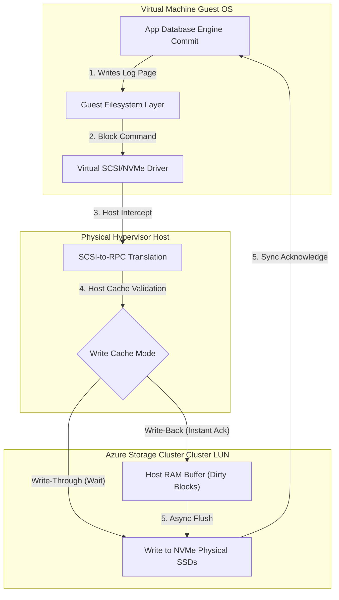

## Table of Contents

1. [The Problem: Storage Isolation and Concurrency Boundaries](#the-problem-storage-isolation-and-concurrency-boundaries)
2. [What Is a Disk or File Share](#what-is-a-disk-or-file-share)
3. [Declarative Bicep and Mount CLI Previews](#declarative-bicep-and-mount-cli-previews)
4. [Under the Hood: SCSI Virtualization and Write Cache Physics](#under-the-hood-scsi-virtualization-and-write-cache-physics)
5. [Managed Disk Tiers and Performance Sizing](#managed-disk-tiers-and-performance-sizing)
6. [VM SKU Bottlenecks vs. Disk Sizing Limits](#vm-sku-bottlenecks-vs-disk-sizing-limits)
7. [Shared Disks for Clustered Workloads](#shared-disks-for-clustered-workloads)
8. [Host Caching Mechanics](#host-caching-mechanics)
9. [Host-Level Encryption and Key Management](#host-level-encryption-and-key-management)
10. [Azure Files: Shared Directory Mounts](#azure-files-shared-directory-mounts)
11. [SMB Opportunistic Locks and NFS Lease Revocation](#smb-opportunistic-locks-and-nfs-lease-revocation)
12. [Putting It All Together](#putting-it-all-together)
13. [What's Next](#whats-next)

## The Problem: Storage Isolation and Concurrency Boundaries

Managed disks and file shares solve two different OS-level storage contracts: one VM needs block storage it can mount as its own disk, while several hosts may need a shared network directory.

When building high-availability application fleets, legacy content management systems, or stateful transactional databases on virtual machines, engineering teams face a fundamental physical data storage challenge.
We must select the right storage boundaries to isolate machine boot processes, optimize high-speed local database operations, and enable multiple compute hosts to share access to the same assets.

Suppose we deploy a fleet of three legacy web-server virtual machines running a shared content management system.
The application requires direct, local filesystem path access to read configuration templates and write user uploads.
If we attempt to attach a standard virtual block storage volume to the first VM, the other two compute nodes remain blind to those files.
If we attempt to bypass this by configuring low-level shared clustered block devices, we introduce immense operational complexity.

We must deploy specialized distributed locking managers to prevent the guest operating system kernels from corrupting the disk partition tables when writing simultaneously.
Alternatively, if we force the application to use modern cloud object APIs like Blob Storage, we must rewrite our legacy codebase to eliminate direct POSIX file path system calls.
We require a system that maps block-level physical storage directly to virtual machine hypervisors, and a managed network filesystem that handles concurrent file locking.
Azure Managed Disks and Azure Files address these challenges.

## What Is a Disk or File Share

Azure Managed Disks and Azure Files provide operating-system-attached cloud storage for virtual machine workloads.
Managed Disks are persistent, virtualized block storage volumes attached directly to virtual machine hypervisors, allowing a single guest operating system to partition, format, and mount the drive.

Azure Files represents a managed network file share that allows multiple distinct compute hosts to mount the same shared directory concurrently over local virtual networks.
Both resources decouple machine-level storage from the physical server blade hardware, ensuring that local directories and operating system volumes survive physical blade failures.

If you run operating system volumes on AWS, Azure Managed Disks are the direct equivalent of AWS EBS (Elastic Block Store) volumes, and Azure Files is the equivalent of AWS EFS (Elastic File System).
Contrast their configuration models: while AWS EBS relies on custom AWS task execution fabrics, Azure Managed Disks offer Premium SSD v2 options that allow you to scale IOPS and throughput independently of disk size, whereas AWS EBS GP3 provides similar independent scaling with different performance limits.

Decouple your application data from your machine OS disks.
If your application code is standard and does not require low-level guest filesystem API calls, Blob Storage is the simpler, faster, and more cost-effective object storage choice.

| Storage Option | Access Protocol | Concurrency Bound | Systems Use Case |
| --- | --- | --- | --- |
| Managed Disk | Azure-managed virtual block disk | Attached to one VM; shared disk is a specialized clustered workload option | Operating system boot drives, local databases, and raw scratch directories |
| Azure Files Share | SMB (v2.1/v3.0) or NFS (v4.1) | Concurrent multi-node mounts | Shared legacy templates, central configurations, and migration directory bridges |

## Declarative Bicep and Mount CLI Previews

To establish our storage architecture, we can provision a Premium SSD v2 Managed Disk and an Azure File Share using a declarative Bicep configuration.
The template below sets up both resources.

```bicep
resource dataDisk 'Microsoft.Compute/disks@2023-04-02' = {
  name: 'disk-database-prod'
  location: resourceGroup().location
  sku: {
    name: 'PremiumV2_LRS'
  }
  properties: {
    creationData: {
      createOption: 'Empty'
    }
    diskSizeGB: 128
    diskIOPSReadWrite: 5000
    diskMBpsReadWrite: 125
  }
}

resource storageAccount 'Microsoft.Storage/storageAccounts@2023-01-01' = {
  name: 'saecommercefiles'
  location: resourceGroup().location
  sku: {
    name: 'Premium_LRS'
  }
  kind: 'FileStorage'
}

resource fileShare 'Microsoft.Storage/storageAccounts/fileServices/shares@2023-01-01' = {
  name: 'shared-templates'
  parent: reference('Microsoft.Storage/storageAccounts/fileServices/default')
  properties: {
    enabledProtocols: 'SMB'
    shareQuota: 100
  }
}
```

Once the managed disk is provisioned, we attach it to our target Virtual Machine.
The Azure CLI command below locates the disk, updates the VM configuration, and attaches the volume as a logical unit number (LUN).

```plain
az vm disk attach \
  --resource-group rg-ecommerce-prod \
  --vm-name vm-app-server-01 \
  --name disk-database-prod \
  --new-disk-size-gb 128 \
  --sku PremiumV2_LRS
```

To mount the SMB network share inside our Linux virtual machine, we run the following sequence of commands to install utility packages, configure credential files, and map the path.

```plain
sudo apt-get update
sudo apt-get install -y cifs-utils

sudo mkdir -p /mnt/templates

sudo mount -t cifs //saecommercefiles.file.core.windows.net/shared-templates /mnt/templates \
  -o vers=3.0,username=saecommercefiles,password=MOCK_KEY,dir_mode=0777,file_mode=0777,serverino
```

## Under the Hood: SCSI Virtualization and Write Cache Physics

Managed Disks do not exist as physical hard drives shoved inside a physical server blade slot.
Instead, the virtual disk is a virtualized logical unit number abstracted by the hypervisor host.

When a guest operating system inside a Virtual Machine issues a block-level write request, the guest OS kernel passes the command to its virtual storage controller driver (SCSI or NVMe).
The virtual machine hypervisor intercepts these SCSI/NVMe block instructions and packages them into internal network RPC calls.

These packets travel over high-speed physical Ethernet networks to the underlying Azure Storage cluster.
The storage cluster receives the RPC payload, hashes the request coordinates, writes the data to physical NVMe cells across three separate storage racks, and returns a network acknowledgment to the host hypervisor.
The hypervisor then translates this success back into a hardware interrupt, signaling to the guest OS kernel that the block write is complete.



To manage the performance of this network block path, the host hypervisor utilizes an intermediate cache layer.
The write safety of your data is governed by the host caching mode you select.

First is write-through caching, which is active when host caching is disabled or set to read-only.
When a write is issued, the host hypervisor immediately routes the block request down to the remote Azure Storage cluster.
The write is only acknowledged back to the guest OS after it is physically committed to the three-way redundant NVMe storage sectors.
This is the only safe option for database transactional log drives.

Second is write-back caching, which is active when host caching is set to read-write.
The host hypervisor intercepts the block write and stores it in its local server RAM cache, immediately returning a success signal to the guest OS without waiting for the network round trip to the storage cluster.
The hypervisor asynchronously flushes the dirty cache blocks to the storage cluster in the background.

While this provides maximum write throughput, it creates a massive data loss hazard.
If the physical server blade hosting the VM experiences a sudden power loss before the dirty blocks are flushed, the database files suffer corruption.

To bypass this caching hazard, database engines utilize Force Unit Access (FUA) and FLUSH commands.
When a database engine (such as SQL Server or PostgreSQL) completes a transaction, it writes to its log file and issues a system-level flush command (e.g., `fsync`).

The virtual SCSI driver translates this into a block write command with the FUA bit enabled.
The host hypervisor intercepts this FUA flag, bypasses the local RAM cache entirely, flushes the blocks directly to the remote NVMe storage cluster, and only returns success once the storage cluster confirms write durability.

## Managed Disk Tiers and Performance Sizing

Managed Disk tiers are performance envelopes for block storage. Selecting the correct tier is key to preventing I/O bottleneck delays during database operations.
Azure provides three distinct SSD tiers.

First is Premium SSD (v1).
On this legacy tier, IOPS and throughput limits are hard-locked to the capacity of the disk size you provision.
For example, a 128 GB P10 disk is capped at a baseline of 500 IOPS, while a 1 TB P30 disk provides 5,000 IOPS.
Database teams frequently buy a 1 TB disk when they only have 50 GB of data, purely to secure the higher performance budget, paying for useless, empty storage.

Second is Premium SSD (v2).
This is the modern cloud standard.
It allows you to provision disk capacity, IOPS, and throughput completely independently of each other.
You can configure a 128 GB disk and provision it with 5,000 IOPS and 125 MBps of throughput, paying only for the performance you consume, which saves significant costs.

Third is Ultra Disk.
Designed for extremely performance-critical workloads, Ultra Disks support sub-millisecond write latencies.
They allow you to dynamically adjust IOPS and throughput values while the disk remains active and online.

If your database experiences read/write latency spikes, inspect the host-level Disk Queue Depth metric.
A high queue depth indicates that the guest OS is submitting block requests faster than the disk's IOPS limit can process, causing requests to stack up in hypervisor buffers.
Upgrading the disk to a Premium SSD v2 or scaling IOPS independently resolves this bottleneck.

## VM SKU Bottlenecks vs. Disk Sizing Limits

A VM SKU is also a storage throughput limit, not only a CPU and memory choice. The VM controls how many disk operations can pass through the guest host, even if the attached disk can handle more.

Example: a Premium SSD v2 disk configured for `10,000` IOPS will still be throttled if the VM size can only submit `3,200` uncached IOPS.

A common architectural trap is matching a high-performance disk to an under-sized Virtual Machine SKU.
Virtual machines have their own hard performance ceilings for storage I/O, independent of the attached disk limits.
These VM-level constraints are split into cached and uncached throughput.

If you attach a Premium SSD v2 disk configured for 10,000 IOPS to a VM SKU that caps uncached storage throughput at 3,200 IOPS, your application will be silently throttled at the VM boundary.
The guest OS cannot submit blocks fast enough to utilize the disk capacity.
Azure Monitor will show the VM hitting its uncached IOPS limit while the disk appears under-utilized.

To prevent this host-level bottleneck, you must cross-reference your required workload IOPS with the official VM SKU specifications.
Select a VM size (such as the D-series or E-series memory-optimized lines) whose storage limits equal or exceed the combined performance of all attached data disks.

## Shared Disks for Clustered Workloads

Shared Disks are Azure Managed Disks that more than one VM can attach to at the same time. They are only safe for clustered systems that already know how to coordinate block-level writes.

Example: a failover cluster can attach one shared disk to two VMs, but only the active node should write the protected volume at a time through cluster-aware locking.

While standard disks attach to one virtual machine at a time, specialized architectures (such as active-passive database clusters or failover nodes) require multi-mount block configurations.
Azure Managed Disks address this through the Shared Disks feature.
By provisioning a disk with the `maxShares` property set higher than one, you allow multiple VMs to attach the volume concurrently.

Shared block access does not provide a managed shared folder out of the box.
If two standard VMs attempt to write to a standard NTFS or ext4 partition on a shared disk concurrently, they will corrupt the metadata and crash the filesystem.
Instead, you must utilize cluster-aware filesystems (such as GFS2 for Linux or Cluster Shared Volumes for Windows).
These engines employ SCSI-3 Persistent Reservations under the hood to coordinate physical lock blocks, ensuring that only one node updates a target block at a time.

## Host Caching Mechanics

Host caching is a VM-host read or write buffer placed in front of the managed disk path. It uses physical CPU and RAM resources on the VM host to accelerate disk operations.
Example: a SQL data file that is read frequently can sometimes use ReadOnly host caching, while a SQL transaction log should use no caching so commits are written durably.

The mechanics of the three primary caching profiles are:

* **None**: Disables all caching. Guest OS reads and writes travel directly to the storage cluster. This is the mandatory choice for transactional log drives (such as SQL Server `.ldf` files) to ensure write serialization and durability.
* **Read-Only**: Caches read operations in host RAM. Subsequent reads of unchanged blocks are served directly from host memory, bypassing the storage network. This is highly effective for read-heavy database data files (`.mdf` files) and static application web roots.
* **Read-Write**: Caches both read and write operations. It provides the lowest local write latency but must never be used for databases. It is reserved for temporary scratch space, volatile compilation build directories, or applications that manage their own file synchronization rules.

## Host-Level Encryption and Key Management

Disk encryption controls where block data is encrypted along the path from guest OS memory to Azure storage. It exists so data remains unreadable outside the approved VM, host, or storage encryption boundary.

Example: a managed disk can use default server-side encryption at rest, while a regulated database VM may also enable host-level encryption and keep customer-managed keys in Key Vault.

Securing stateful data at the block level requires encrypting data before it leaves the VM memory boundary or when it lands on the physical SSD sectors.
Azure provides two primary layers of disk encryption.

First is Azure Disk Storage Encryption at Rest.
By default, all managed disks are encrypted using server-side encryption with platform-managed keys.
This is implemented at the physical storage cluster layer using 256-bit AES encryption in XTS mode.

Second is host-level encryption.
When enabled, data is encrypted directly on the physical host hypervisor running your VM before it travels over the internal network to the storage cluster.
This secures data in transit within the Azure backbone and protects temporary scratch files stored on the host's local SSDs.

For guest-level encryption, you can utilize Azure Disk Encryption (ADE).
ADE leverages the BitLocker feature of Windows and the DM-Crypt/LUKS feature of Linux to encrypt operating system and data volumes.
The guest OS handles all cryptographic operations, and the encryption keys are securely stored and retrieved from Azure Key Vault during VM boot processes.

## Azure Files: Shared Directory Mounts

Azure Files is Azure's managed network filesystem for workloads that need a shared mounted directory rather than object-storage API calls. It provides fully managed serverless file shares accessible over industry-standard SMB and NFS protocols.
It removes the administrative burden of running dedicated Windows File Servers or Linux Samba VMs inside your virtual networks.

When you mount an Azure Files share to an App Service container or an AKS pod, the integration utilizes secure internal network mounts.
If your containerized API needs to read shared document templates, the platform mounts the share as a local directory path, allowing your standard Node.js or Python code to read and write files using ordinary filesystem libraries.

## SMB Opportunistic Locks and NFS Lease Revocation

SMB oplocks and NFS leases are file-sharing coordination mechanisms that decide which client may cache or update a file safely. They exist because two machines writing the same shared file at the same time can corrupt application state.

Example: if two report workers both open `month-end.csv`, the file protocol must decide whether one worker may cache the file locally or whether another worker's write requires that cache to be revoked.

When managing concurrent access to a shared network filesystem across multiple virtual machines, Azure Files relies on deep file locking protocols to prevent write collisions.
The execution mechanics depend entirely on whether you utilize the SMB or the NFS protocol.

The SMB protocol utilizes opportunistic locks (oplocks).
When a virtual machine opens a file on an SMB share, the client requests an oplock from the Azure Files server.
If no other client has the file open, the server grants the oplock, allowing the client to cache read and write changes locally in its own system RAM.
This delivers rapid local file access.

When a second virtual machine requests access to that same file, the Azure Files server intercepts the request and identifies the active oplock.
The server sends a lease break notification to the first client.
The first client immediately flushes its locally cached write blocks back over the network to the file share, releases its oplock, and the server permits the second client to access the file safely.
This dynamic lock transition prevents concurrent file corruption while maintaining local read performance.

The NFS protocol (v4.1) utilizes stateful lease-based locking designed for Linux environments.
When a Linux VM mounts an NFS file share and locks a file, the client establishes an active lease state with the Azure Files server.
The client must periodically send heartbeat messages to the server to renew its lease.

If a network partition occurs and the Linux VM loses connection to the network share, the server's lease timer eventually expires.
Once the lease expires, the server automatically revokes the locks held by that client.
This prevents the partitioned host from blocking database or application locks indefinitely.
Any subsequent lock request from a healthy VM is immediately granted.
This lease-based revocation guarantees cluster-wide forward progress during network failures.

## Putting It All Together

Virtual machine and shared folder storage require matching performance limits to your physical access patterns.

* **Managed Block Storage**: Guest operating systems see Managed Disks as attached block devices, while Azure manages the backing storage, durability, and disk redundancy options.
* **Host Caching write safety**: Host caching can improve selected disk workloads, but read-write caching must match the application's durability requirements and the documented VM caching guidance.
* **Premium SSD v2 Scaling**: Modern Premium SSD v2 volumes allow developers to scale disk capacity, IOPS, and throughput independently, avoiding unnecessary disk over-provisioning.
* **Network SMB/NFS Shares**: Azure Files manages shared directory mounts over SMB and NFS protocols, while your application design still owns safe concurrent writes.

## What's Next

Now that we have structured raw virtual disk volumes and managed shared network folders, we will examine how to protect these storage resources.
In the next chapter, we will explore Backups and Retention.
We will inspect Recovery Services Vaults, soft delete lifecycles, and point-in-time database restoration workflows.

---

**References**

* [Azure Managed Disks Overview](https://learn.microsoft.com/en-us/azure/virtual-machines/managed-disks-overview) - Official overview of virtual block storage.
* [VM Host Caching Details](https://learn.microsoft.com/en-us/azure/virtual-machines/caching-and-performance) - Technical guide to read/write caching and write-safety.
* [What is Azure Files?](https://learn.microsoft.com/en-us/azure/storage/files/storage-files-introduction) - Overview of managed SMB and NFS file shares.
* [Azure Files SMB and NFS Planning](https://learn.microsoft.com/en-us/azure/storage/files/storage-files-planning) - Performance and network guide for network mounts.
