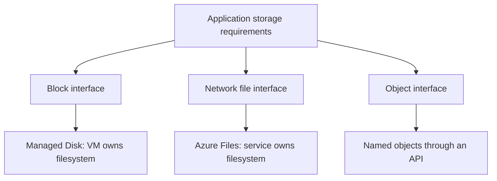

## Table of Contents

1. [When Do Disks and File Shares Fit?](#when-do-disks-and-file-shares-fit)
2. [What Storage Contract Does the Workload Need?](#what-storage-contract-does-the-workload-need)
3. [How Do Managed and Temporary Disks Work?](#how-do-managed-and-temporary-disks-work)
4. [How Do Performance, Caching, and Shared Disks Change Behavior?](#how-do-performance-caching-and-shared-disks-change-behavior)
5. [What Does Azure Files Provide?](#what-does-azure-files-provide)
6. [How Do Protocols, Identity, and Network Paths Protect File Access?](#how-do-protocols-identity-and-network-paths-protect-file-access)
7. [What Evidence Supports Snapshots and Migration?](#what-evidence-supports-snapshots-and-migration)
8. [How Does the Complete Storage Choice Fit Together?](#how-does-the-complete-storage-choice-fit-together)
9. [Check Your Answers](#check-your-answers)

A database and a shared document folder both store files, but they can ask very different things of storage. A database may need a transaction log write to reach durable storage before it reports a successful payment. Ten machines using a shared folder need a file service that coordinates their access to names, directories, and locks.

The useful starting question is therefore what the application expects to read and write, who must share that data, and which failures the data must survive. Managed Disks, temporary storage, shared disks, and Azure Files provide different answers to those questions.

We will build those distinctions from blocks and files, then examine performance, access, and recovery:

1. **When Do Disks and File Shares Fit?**
2. **What Storage Contract Does the Workload Need?**
3. **How Do Managed and Temporary Disks Work?**
4. **How Do Performance, Caching, and Shared Disks Change Behavior?**
5. **What Does Azure Files Provide?**
6. **How Do Protocols, Identity, and Network Paths Protect File Access?**
7. **What Evidence Supports Snapshots and Migration?**
8. **How Does the Complete Storage Choice Fit Together?**

## When Do Disks and File Shares Fit?
<!-- section-summary: Block storage gives a machine numbered storage locations, while a file service owns a filesystem and exposes file operations to clients. -->

A computer's CPU uses RAM for fast working memory. RAM normally loses its contents when power disappears, so applications need another place for information that must survive. Persistent storage supplies that place, but the interface presented to the application can differ substantially.

A traditional disk behaves like a numbered array of locations: block 0, block 1, block 2, and so on, perhaps through block 10,000,000. A **block** is a unit of storage that can be addressed and read or written. These locations do not inherently have useful names such as `customer.db` or `photo.jpg`.

The operating system builds a **filesystem** over those blocks. It manages files, directories, names, permissions, timestamps, locks, and the allocation of storage to them. Paths such as `/data/customer.db`, `/logs/app.log`, and `/images/photo.jpg` belong to that filesystem view rather than to the raw numbered-block interface.

This is the central distinction between block storage and file storage. A block device supplies locations that the machine organizes. A file service already owns the filesystem and accepts file-level operations from its clients.

### Compare the three access models

With block storage, a Linux VM might see `/dev/sdc`, format it with a filesystem, and mount it for data under `/var/lib/database`. The operating system generally controls the filesystem placed on the disk. Azure Managed Disks supply this persistent VM-oriented block-storage model.

With a file share, VM A, VM B, and VM C connect through a network file protocol such as SMB or NFS. The service on the other end owns the filesystem and mediates file access. Azure Files supplies this managed network-file-share model.

Object storage provides a third interface: named objects accessed through an object API. It is useful to recognize that alternative, but the focus here is the first two contracts. An application that needs a block device or a shared filesystem has requirements beyond simply finding somewhere that can retain a byte payload.


```mermaid
flowchart TD
    app["Application storage requirements"] --> block["Block interface"]
    app --> file["Network file interface"]
    app --> object["Object interface"]
    block --> disk["Managed Disk: VM owns filesystem"]
    file --> share["Azure Files: service owns filesystem"]
    object --> objects["Named objects through an API"]
    class app workload
    class block,file,object control
    class disk,share,objects storage
```

### Ask where coordination belongs

The interface determines who coordinates access. For an ordinary managed disk, the VM's operating system manages filesystem allocation and locking. For a shared block disk, cluster-aware software must coordinate participating machines. For Azure Files, the file service participates in the namespace, file operations, and locking semantics used by clients.

These arrangements solve different problems. A managed disk is appropriate when a VM needs persistent block storage. A file share fits clients that need ordinary shared file access. A shared disk is a specialized choice for software designed to coordinate over the same block device.

The distinction becomes especially important for databases because their visible tables ultimately rely on lower-level writes, ordering, and recovery rules. Choosing storage only because it can contain a file skips the properties that make those writes correct.

## What Storage Contract Does the Workload Need?
<!-- section-summary: Database storage must meet supported ordering, flushing, latency, concurrency, and failure guarantees, rather than merely holding enough bytes. -->

A database presents tables, indexes, and transactions, but the engine works through database pages and transaction-log records stored in files. Those files sit in a filesystem that eventually reads and writes blocks. Each layer depends on guarantees made by the next one.

For example, a customer transfers £100. The database creates a transaction-log record, writes it, asks storage to make it durable, and only then reports that the commit succeeded. The request to make the write durable is a **flush**: the database is asking the storage path to honor its durability guarantee rather than leaving the only copy in volatile working memory.

If some cache reports completion while the required data exists only in volatile memory, a crash could erase a transaction the application was already told had committed. The storage configuration has then violated the assumption on which the database reports success.

This explains why database storage choices involve write latency, write ordering, flush semantics, random I/O, durability, concurrency, and failure behavior. Capacity is necessary, but a disk large enough to contain the files can still provide the wrong performance or recovery behavior.

### Follow a crash through the layers

At time `t1`, a data page might contain an old value while the transaction log contains the record describing a new value. If the machine crashes at `t2`, the database may replay the durable log to recover the intended state.

That recovery depends on which writes actually reached durable storage and in which order. A low-level caching or storage choice can therefore affect database recovery, which in turn affects whether the business transaction survives. These are connected guarantees, not independent settings that can be selected solely for a benchmark improvement.

Different database files can also create different I/O patterns. Data files often receive random reads and writes. Transaction logs often receive append-oriented writes. Temporary database work can have yet another pattern and a different requirement for persistence. Each should be evaluated according to the database engine's supported configuration.

### Compare an attached filesystem with a remote one

An attached block-storage path passes from the database through the filesystem to the block device. A network share adds a filesystem client, SMB or NFS, a network path, and a remote filesystem service. Those additional layers can change latency, locking, caching, failure, and durability behavior.

This does not mean a database can never use a file share. Some database and application architectures explicitly support that arrangement. The correct requirement is that the storage semantics and performance be supported by the particular engine for the workload involved.

The same caution applies to the argument that every database consists of files, so every network filesystem should work. The meaningful questions concern operations, latency, concurrency, locks, flush guarantees, failure handling, and explicit database support. Storing the bytes is only part of that contract.

### Describe the required behavior before selecting a service

For each data location, ask whether the application needs arbitrary block reads and writes, normal file and directory operations, or shared access from several machines. Ask whether the data must survive a compute-host failure, how quickly a write must be durable, and which ordering and locking guarantees are required.

These questions distinguish a database data disk from a reconstructable cache and from a shared reports directory. They also explain why one application can use several storage products without those products being competing substitutes. Different parts of the system ask for different interfaces and guarantees.

## How Do Managed and Temporary Disks Work?
<!-- section-summary: Managed Disks provide block-storage resources independent of a specific compute host, while host-local temporary storage is suitable only for disposable or reconstructable data. -->

An **Azure Managed Disk** provides a VM with a block-storage interface backed by Azure-managed infrastructure. Linux might expose attached devices as `/dev/sda`, `/dev/sdb`, and `/dev/sdc`; Windows presents attached volumes through its disk and drive mechanisms, such as `C:`, `D:`, and `E:`. These are examples of operating-system views, not a universal mapping of Azure disk roles to particular letters or names.

The operating system can format supported disks with filesystems such as NTFS, ReFS, ext4, or XFS and then expose ordinary files to applications. The VM perceives a disk and generally remains responsible for the filesystem placed on it.

The word **managed** refers to the infrastructure supplying the disk resource. Azure handles the physical storage work underneath, replacing tasks such as buying an SSD, installing it, configuring storage hardware and RAID, monitoring devices, and replacing failed hardware.

You create a disk with the required properties, attach it to the VM, and use it. You still own the filesystem layout, database configuration, backups, capacity planning, and application-level recovery. Azure managing the block-storage infrastructure does not mean it automatically manages the meaning or recoverability of every file stored there.

### Separate OS, data, logs, and scratch work

A database VM can use an OS disk for Windows or Linux and database software, data disks for database files, log disks for transaction logs, and temporary storage for disposable processing. This separates different roles instead of treating every byte written by the VM as equivalent.

Data-file random I/O and log-file append I/O can stress storage differently. Keeping their roles explicit makes performance and recovery discussions easier, although the exact layout must still follow the database's supported design rather than an assumption that more disks always improve it.

The same application architecture can include a shared file location used by its application servers. That share has a multi-client filesystem role, while the database VM's managed disks provide persistent block devices. The products complement each other because the responsibilities differ.

### Treat host-local storage as disposable

A disk-like device is not automatically durable across changes to the compute host. Azure VMs may expose temporary or local runtime storage associated with the host. If the VM moves or the underlying host changes, that data can disappear.

Managed persistent storage is logically independent of the specific compute host. A VM on Host A can move to Host B while its durable disk remains a separate storage resource. Host-local scratch storage has a different promise because it is tied to the current runtime location.

A useful test is whether the data can be rebuilt after loss. Temporary files, caches, scratch processing, download staging, reconstructable intermediate results, and suitable temporary database workloads can fit disposable storage. The only copy of a customer database, a financial transaction log, or master business records does not fit that requirement.

If VM relocation must not lose the data, host-local temporary storage should not be its authoritative copy. **Authoritative** means the copy treated as the source of truth, rather than a cache that can be reconstructed from a durable source.

### Understand why temporary storage exists

Durability requires work. A persistent write can involve replication, persistence, consistency handling, and protection against failures. A temporary local device may provide a shorter path from the VM to nearby storage because it does not offer the same survival guarantees.

That can make disposable storage useful for performance or cost reasons. The trade-off is between a short local path with acceptable loss and a persistent service with the required protection. It is a deliberate choice of guarantee, not a reason to assume temporary storage is inherently unusable.

A design should make the consequence of loss explicit. If a cache disappears, the system may rebuild it. If the authoritative transaction log disappears, there may be no valid reconstruction path. The acceptable behavior after failure determines which role belongs on which storage.

## How Do Performance, Caching, and Shared Disks Change Behavior?
<!-- section-summary: Measure operations, bytes, latency, and queueing across disk and VM limits; caches affect the write contract, and shared disks need cluster-aware coordination. -->

Storage speed has several dimensions. **IOPS** measures input/output operations per second. **Throughput** measures bytes transferred per second. **Latency** measures the time one operation takes to complete. These measures answer different workload questions and should not be collapsed into one “fast disk” label.

For a database using 8 KB pages, 10,000 reads per second is roughly 10,000 IOPS. Many small random accesses, such as index-page lookups followed by reading a row, can make the operations-per-second limit important.

A large sequential scan can instead depend heavily on MB/s or GB/s. Throughput is approximately IOPS multiplied by I/O size:

$$
\text{throughput} \approx \text{IOPS} \times \text{I/O size}
$$

Using approximate decimal units, `10,000 IOPS × 8 KB` is about `80 MB/s`, while `1,000 IOPS × 1 MB` is about `1,000 MB/s`. The second workload performs fewer operations but moves far more data. Comparing IOPS without I/O size would miss that difference.

### Measure latency and queueing together

A transaction that updates an account, writes its log record, flushes the log, and commits may wait on storage latency before responding to the user. High aggregate throughput does not necessarily make that individual flush quick.

A road can carry many cars per hour while one journey still takes a long time. Similarly, storage can transfer many bytes per second while one database operation waits too long for completion. Throughput and latency therefore need separate measurements.

**Queue depth** describes outstanding work submitted to storage. Instead of submitting one request and waiting before submitting the next, the operating system can have requests 1 through 5 in progress together. This concurrency can use the storage system more fully.

However, increasing IOPS accompanied by rapidly rising latency and queueing can indicate saturation. Monitor operations, bytes, latency, queue size, and throttling together. A large operation count alone does not show that the application receives acceptable response times.

### Check the whole path's limits

A fast disk can still be constrained by the VM's I/O capability or another part of the path. If the disk can provide 40,000 IOPS but the VM can process only 20,000 IOPS, the effective result is approximately at most 20,000 IOPS before considering other limits.

$$
\text{usable performance} \lesssim \min(\text{disk capability},\ \text{VM capability},\ \text{other path limits})
$$

The formula is a conceptual upper-bound model. It explains why independently choosing a disk and VM from their advertised maxima does not establish the workload's achieved performance. Both resources participate in the same I/O path.

Capacity alone is especially misleading. Two databases can each contain 2 TB while one requires about 500 IOPS and occasional analytical scans, and the other requires 30,000 IOPS for thousands of transactional users. They have the same stored size and very different workload demands.

Record capacity, IOPS, I/O sizes such as 4 KB, 8 KB, 64 KB, or 1 MB, throughput, latency, read/write ratio, random versus sequential access, and burstiness. A workload that is 90% reads differs from a 50/50 mix, and a steady load differs from a sharp burst even if their average is similar.

### Use caches with a clear understanding of writes

A **host cache** keeps data near the VM so repeated reads can avoid the full trip to managed storage. The first read may miss the cache, fetch data from the disk, and retain a nearby copy. A later cache hit can return that copy with less remote I/O and lower latency.

The benefit depends on reuse. A one-time sequential scan of 5 TB may gain little from a small cache. A repeatedly accessed 20 GB working set can benefit much more if useful data stays available in that cache. Cache effectiveness is a property of the workload and path, not an automatic improvement for every read pattern.

Writes require more care. If a database issues `WRITE X` followed by `FLUSH`, it expects the storage path's promised durability. A cache that reports completion before satisfying that guarantee could lose X on failure after the database believed it was safe.

This is why data files, transaction logs, and temporary files may need different supported caching choices. The correct mode depends on the engine and storage architecture. A setting that improves one benchmark should not be adopted without checking the write-ordering and flush assumptions it must preserve.

Database engines already have caches of their own. A read can encounter a database buffer cache in RAM, an operating-system cache, a host cache, and finally the managed disk. When discussing caching, identify which layer, which data, and which consistency or durability guarantee is involved.

### Coordinate every writer to a shared disk

An ordinary managed disk is commonly used by one VM, whose operating system controls its filesystem. Sharing the same writable block device with two independent filesystems creates a different problem. VM A and VM B could both believe block `1000` is free, then each allocate it to a different file. Their writes conflict and filesystem data can be corrupted.

A **shared disk** permits several cluster nodes to attach to the same block-storage device. It does not provide automatic safe multi-client file sharing. Coordination has to come from cluster-aware software, a cluster filesystem, database clustering technology, or distributed locking and fencing above the disk.

**Fencing** prevents a failed or isolated node from continuing to write stale data when it no longer owns the resource. The cluster needs to decide who owns the storage, who may write, what happens after a node fails, and how an excluded node is stopped from interfering.

Shared disks are useful when the application architecture explicitly expects shared block storage and provides this coordination. If several ordinary machines merely need the same files, a file service is often the more appropriate interface because it owns the filesystem layer they otherwise would have to coordinate themselves.

## What Does Azure Files Provide?
<!-- section-summary: Azure Files supplies a managed remote filesystem for multiple clients, rather than making each client manage the same raw block device. -->

Suppose ten machines need access to `\\company\reports` or `/mnt/shared`. They usually need operations such as opening a file, reading 64 KB, writing bytes, renaming a file, deleting a directory, or acquiring a lock. They are not asking to read block `918273` or overwrite block `284611` directly.

**Azure Files** provides managed network file shares. Azure operates the file-service infrastructure, and clients mount or connect to the share. The service manages the remote filesystem through which clients access names such as `report.xlsx`, `data.csv`, and an `images` directory.

This model fits shared application files, user home directories, shared configuration and content, document repositories, and lift-and-shift applications that expect a file server. A **lift-and-shift** migration moves an existing application with limited redesign, so preserving a familiar file-share interface may be important. Some supported application or database architectures also use network shares, subject to their specific storage requirements.

### Compare ownership and access directly

| Question | Managed Disk | Azure Files |
| --- | --- | --- |
| Exposed interface | Block device | Remote filesystem |
| Typical consumer | Attached VM | Multiple network clients |
| Filesystem owner | Usually the VM operating system | Azure file service |
| Access operations | Disk I/O under the local filesystem | Network file operations |
| Protocol or interface | Block-storage interface | SMB or NFS |
| Ordinary multi-client sharing | Requires a specialized shared-disk architecture | Supplied through the file-service model |
| Useful comparison | Virtual hard drive | Managed file server |

A managed disk lets the VM build and use a filesystem over its blocks. Azure Files lets the VM access a filesystem already owned by the remote service. Both can ultimately store files, but the location of filesystem ownership and coordination differs.

### Keep shared files and shared blocks separate

Consider twenty web servers that need `/shared/images`. Attaching the same raw writable disk to all twenty would make them responsible for agreeing on filesystem metadata, locks, and write ownership. Without appropriate cluster coordination, that is unsafe.

Using a file service gives those clients SMB or NFS access to an existing shared namespace. The service participates in coordinating file operations rather than presenting the same raw block device to unrelated operating systems.

Conversely, an application cluster that expects the same block device on several nodes may require a shared-disk architecture. Replacing that interface with an ordinary share merely because both can store bytes can change the application's supported semantics. The sharing requirement must specify the layer: shared files or shared blocks.

### Expect additional network boundaries

A network filesystem introduces more steps than an attached block path: the application calls the operating system, the file-protocol client sends the operation through the network stack, and the request crosses the network to the file service and its storage.

Those steps are useful because they provide shared access, but they add places where latency, limits, caching, failures, and permissions can affect the result. More layers do not inherently make the service unsuitable. They explain which behavior must be measured and configured for the workload using it.

The existence of the share therefore does not prove that a client can mount it. Mounting means making the remote filesystem available through a local path or drive. That operation still needs a compatible protocol, a working network path, and the required access permissions.

## How Do Protocols, Identity, and Network Paths Protect File Access?
<!-- section-summary: Remote file access needs a supported protocol, correct DNS and routing, permitted traffic, accepted identity, share access, and file-level permissions. -->

A network filesystem requires the client and service to agree on a protocol. **SMB**, Server Message Block, has a strong historical association with Windows environments. **NFS**, Network File System, has a strong historical association with Unix and Linux. Both have evolved, and the actual choice depends on supported workload and platform requirements rather than that historical shorthand alone.

A protocol defines what an operation means and how the client and server exchange it. Conceptually, a client could open `/shared/orders.csv`, receive handle `42`, and then ask to read from offset `0` with length `65536`. The handle identifies the opened file in that exchange, and the service returns the requested bytes.

```text
Client: OPEN /shared/orders.csv
Server: OK, handle=42
Client: READ handle=42 offset=0 length=65536
Server: file data
```

This is an illustrative operation exchange rather than a command to execute. It shows why the remote filesystem involves protocol semantics and a network path for file access instead of only a local disk read.

### Check reachability before identity

The client needs DNS resolution, a route, firewall and network-policy permission, and working protocol connectivity. It also needs an accepted identity and sufficient authorization. These dependencies are related but independent.

A VM with perfect credentials but no route to the service cannot reach the point at which those credentials are evaluated. A VM with a working route can reach the service and still be rejected because its identity or permissions are wrong.

A useful diagnostic order is: resolve the service name, inspect the route, check network policy, test the protocol connection, authenticate the caller, check share-level authorization, and then check file or directory permissions. Share access and permissions on an individual path are separate things to inspect when only some operations fail.

The broader path also involves encryption, protocol versions, and network latency. These factors explain why a problem described as “storage does not work” might arise at the name-resolution layer, a protocol compatibility boundary, or a file-permission check rather than in the storage capacity underneath.

### Understand public and private access paths

A storage service can be reached through different network arrangements. A private-endpoint-style design represents the service through an address associated with the private network, allowing a VM in the VNet to reach that interface and then the managed service behind it.

This can be desirable when access should not depend on a publicly exposed service path. It also makes correct DNS, subnet configuration, routes, and network policies essential. The client must resolve the intended destination and have a permitted path to it.

A private address does not replace authentication or file authorization. The route determines whether the client can contact the service; the identity and permission layers determine what it can do after reaching it. Confirm each part of the path rather than treating “private” as proof of every security property.

This layered model is also useful during migration. Copying files to a share may succeed from one administrative machine while the application runtime lacks the correct DNS view, route, credentials, or file permissions. Validation must run from the intended consumer and exercise the operations it actually needs.

## What Evidence Supports Snapshots and Migration?
<!-- section-summary: Snapshots preserve point-in-time storage state, while recovery and migration require separate filesystem, database, application, and performance validation. -->

A **snapshot** captures storage at a particular time while the live disk continues to change. Imagine three blocks, A, B, and C. At T1 they contain A, B, and C. At T2, B changes to B-prime. At T3, C changes to C-prime. At T4, B changes again to B-double-prime.

A snapshot at T3 preserves the state A, B-prime, C-prime even while the current disk later contains A, B-double-prime, C-prime. This point-in-time state can support recovery, cloning, migration, testing, and forensic or reference copies.

The snapshot establishes what storage contained at that moment. It does not automatically establish a clean application-level state, because the application may have been partway through a coordinated update when the snapshot was taken.

### Distinguish storage capture from application consistency

At snapshot time, database memory might contain an updated page X, the disk might still contain the old page, and the transaction log might represent an intermediate stage of the operation. The snapshot can accurately capture the disk while the application's logical operation is incomplete.

A **crash-consistent** snapshot resembles the state of storage after a sudden power loss. An **application-consistent** backup coordinates with the application to produce an internally consistent recovery point. Database engines can recover from certain crash-consistent states, but the supported recovery requirements depend on the engine and architecture.

This distinction is why a snapshot should not be described as proof that every database can immediately start with every expected transaction intact. It supplies storage-state evidence. Application recovery and consistency checks supply the next layer of proof.

### Prepare evidence before migrating

Before a database-server migration, identify the source storage, measure capacity and performance, ensure an appropriate backup or snapshot exists, and test the recovery procedure. This establishes both the baseline the target must reproduce and the fallback needed if migration fails.

After creating the target, check that files are present, the filesystem is healthy, the database starts and validates, important row or data checks pass, and performance is acceptable. A successful migration preserves the application's required behavior, not just the apparent amount of stored data.

For example, a 2 TB source database and 2 TB of target files do not prove equivalence. The target could have missing transactions, corrupted blocks, inconsistent application state, wrong permissions or ownership, unsupported filesystem behavior, or degraded performance.

A layered validation makes those gaps visible:

| Layer | Useful evidence |
| --- | --- |
| Storage | Capacity, checksums, and available recovery copies |
| Filesystem | Successful mount, ownership and permissions, integrity |
| Database | Recovery completes and consistency checks pass |
| Application | Required queries, transactions, and functional tests work |
| Performance | Acceptable latency, IOPS, and throughput under the intended workload |

Checksums compare the copied bytes; they do not establish that the copied state was logically valid before the copy. Likewise, database consistency does not alone establish that the application runtime has the correct permissions or acceptable latency. Each observation supports the particular layer being tested.

The highest abstraction that matters to the business determines the final acceptance check. If the system needs a successful transaction, merely mounting the filesystem is insufficient. If the application depends on specific shared-file locking behavior, a completed copy does not show that concurrent clients work correctly.

### Keep historical recovery separate from redundancy

Durable and replicated storage can faithfully preserve a mistaken deletion. If document versions 1, 2, and 3 are followed by an accidentally destroyed version 4, replication can spread that unwanted state. A historical recovery copy preserves a usable earlier state such as version 3.

Redundancy therefore protects against supported infrastructure failures, while snapshots and backups can preserve history needed after unwanted state changes. These protections complement one another. One should not be claimed to provide the other's recovery behavior merely because both involve copies of data.

## How Does the Complete Storage Choice Fit Together?
<!-- section-summary: Choose the interface and coordination model first, size the full performance path, then verify persistence, availability, durability, and recoverability against specific failures. -->

Consider users reaching application servers that rely on a database VM. The VM can have an OS Managed Disk containing its operating system and database software, data Managed Disks holding database files, log Managed Disks holding transaction logs, and temporary storage for reconstructable work.

Separately, application servers A, B, and C can share common files through Azure Files. That gives the application a shared network filesystem without asking the database VM's block device to serve as an uncoordinated multi-client share.

A cluster has another possible branch: nodes A, B, and C can attach to a shared Managed Disk if the application and cluster software provide the required ownership, locking, and fencing. This branch should only be selected when those coordination requirements are satisfied.

### Choose the interface before the product size

Start by asking whether several machines need ordinary file-level access. If so, consider a file share such as Azure Files. If a VM instead needs persistent block storage, Managed Disk supplies that interface. If the data is disposable and can be recreated after host loss, temporary storage may fit.

Then ask separately whether multiple cluster nodes need the same block device. If they do, verify that the application is cluster-aware. Without that support, exposing shared blocks does not provide safe sharing and the design needs to be reconsidered.

After the interface is selected, characterize performance. The capacity requirement is only one dimension. Include operation rate, I/O size, throughput, latency, read/write mix, access pattern, bursts, and the combined disk and VM limits. Measure cache behavior under realistic reuse patterns instead of assuming any cache improves every workload.

### Define which failures the design survives

For each storage location, ask what happens when the VM reboots, the host fails, the VM is redeployed, a storage path becomes unavailable, a region or site fails, data is deleted, or corruption occurs. These events test different guarantees.

**Persistence** asks whether data survives the lifetime or placement of the compute instance. **Availability** asks whether it remains accessible when components fail. **Durability** concerns the likelihood that already-acknowledged data is permanently lost. **Recoverability** asks whether an earlier or valid state can be restored after deletion, corruption, or disaster.

A service can provide persistent and durable storage while having poor recoverability because no useful backup history exists. It can also retain valid backups without meeting an application's availability requirement or recovery-time needs. Keep those claims distinct during design and validation.

A durable disk does not by itself supply backup history. A backup does not automatically provide high availability. High availability does not automatically cover every disaster-recovery requirement. A storage snapshot does not automatically provide application consistency. The relevant protections must be selected and tested for the failures the workload needs to survive.

### Keep the responsibilities explicit

The complete design can be read through three sets of requirements. **Storage semantics** determine blocks versus files, filesystem ownership, and coordination. **Performance requirements** determine operation rate, bytes per second, response time, queueing, and caching behavior. **Failure requirements** determine persistence, acknowledged-write durability, availability, history, and recovery consistency.

Managed Disk, Azure Files, temporary storage, and shared disks fit into this model according to the guarantees they supply. The application should not have to rely on an unstated assumption that all disk-like devices persist, all filesystems have the same locking behavior, or all snapshots are valid database backups.

For every selected path, explain who owns the filesystem, who coordinates shared access, when a write is considered durable, and what happens after failure. Then validate those answers at the filesystem, database, and application layers that depend on them. That is the basis for a storage choice that supports the workload rather than merely holding its files.

## Check Your Answers

:::expand[When Do Disks and File Shares Fit?]{kind="recap"}
A disk supplies blocks that a machine organizes into a filesystem. A file share supplies an existing remote filesystem through file operations. Managed Disks fit persistent VM block access, Azure Files fits shared files, and shared disks require coordinated cluster access to the same blocks.
:::

:::expand[What Storage Contract Does the Workload Need?]{kind="recap"}
Identify operations, sharing, locking, ordering, flushing, durability, latency, and supported failure behavior. A database's commit and recovery logic depend on these guarantees. Capacity and the ability to contain files alone do not establish a supported database storage path.
:::

:::expand[How Do Managed and Temporary Disks Work?]{kind="recap"}
Managed Disks provide Azure-managed block infrastructure while the VM still manages its filesystem and application data. Temporary storage can be tied to the runtime host and lost on relocation. Use it for disposable or reconstructable work, never as the only authoritative copy of important data.
:::

:::expand[How Do Performance, Caching, and Shared Disks Change Behavior?]{kind="recap"}
Measure IOPS, throughput, latency, queueing, and disk/VM limits together. Read caches can shorten repeated reads, but write caching must preserve durability and flush semantics. Shared disks need cluster-aware ownership, locks, and fencing rather than independent filesystems writing the same blocks.
:::

:::expand[What Does Azure Files Provide?]{kind="recap"}
Azure Files operates a remote filesystem for network clients. It supports shared application files and other file-server workloads through SMB or NFS. The service owns filesystem coordination, which differs from exposing one raw block device to several machines.
:::

:::expand[How Do Protocols, Identity, and Network Paths Protect File Access?]{kind="recap"}
Clients need compatible file-protocol behavior, DNS, routes, permitted traffic, encryption where required, and protocol connectivity. Authentication, share authorization, and file/directory permissions are separate checks. A private path does not replace caller permissions.
:::

:::expand[What Evidence Supports Snapshots and Migration?]{kind="recap"}
Snapshots preserve point-in-time storage states, but application consistency requires appropriate coordination or validated recovery. Migration evidence should cover copied storage, filesystem access, database checks, application operations, and performance. Equal file sizes or successful copying are insufficient by themselves.
:::

:::expand[How Does the Complete Storage Choice Fit Together?]{kind="recap"}
Select the block, shared-file, disposable, or cluster-shared interface first. Size the entire I/O path for the measured workload. Then verify persistence, availability, durability, and recoverability against concrete failures, including the application's consistency and recovery requirements.
:::
