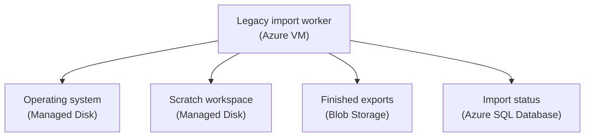

## Table of Contents

1. [Some Storage Must Look Like A Disk Or Folder](#some-storage-must-look-like-a-disk-or-folder)
2. [If You Know EBS And EFS](#if-you-know-ebs-and-efs)
3. [Managed Disks Belong To VM-Shaped Workloads](#managed-disks-belong-to-vm-shaped-workloads)
4. [Temporary VM Storage Is Not A Safe Application Store](#temporary-vm-storage-is-not-a-safe-application-store)
5. [Azure Files Gives You A Managed File Share](#azure-files-gives-you-a-managed-file-share)
6. [Blob Storage Is Often Better For Generated Files](#blob-storage-is-often-better-for-generated-files)
7. [The Orders System Uses Each Shape Differently](#the-orders-system-uses-each-shape-differently)
8. [Failure Modes And First Checks](#failure-modes-and-first-checks)
9. [A Practical Attached Storage Review](#a-practical-attached-storage-review)

## Some Storage Must Look Like A Disk Or Folder

Not all storage feels like a database or object store.
Sometimes the operating system needs a disk. Sometimes
an old application expects a folder path. Sometimes a
worker reads and writes files with normal filesystem
calls. Azure has services for those shapes. Azure
Managed Disks are block-level storage volumes used with
Azure Virtual Machines. Block-level storage means the
VM sees a disk-like device that the operating system
can format, mount, and use.

Azure Files provides managed file shares. A file share
means a mounted folder that more than one machine or
process can use, depending on the protocol and network
design. These services are useful. They also solve
different problems from Blob Storage and Azure SQL
Database. Blob Storage is usually better for durable
application files such as receipts and exports. Azure
SQL Database is usually better for relational business
records. Managed Disks and Azure Files are for
workloads that specifically need disk or filesystem
behavior.

The running example is still `devpolaris-orders-api`.
Most of its new cloud-native pieces do not need mounted
disks. But a legacy import worker might run on a VM.
That worker may need a data disk or a shared file path
while the team modernizes it. This article teaches how
to make that choice without turning every file problem
into a mounted folder.

## If You Know EBS And EFS

If you know AWS, the first comparison is
straightforward. Managed Disks feel closest to EBS.
Azure Files feels closest to EFS in the broad sense of
"shared managed file storage." The details are
different, so keep the comparison small.

| AWS idea you may know | Azure idea to compare first | Beginner translation |
|---|---|---|
| EBS volume | Managed Disk | A disk attached to a VM |
| EC2 instance store | VM temporary disk | Short-lived local storage that should not hold important application data |
| EFS filesystem | Azure Files | A managed file share mounted by clients |
| S3 object | Blob Storage | Usually better for durable generated files |

The useful habit is this: if the workload needs a disk
device, think Managed Disk. If the workload needs a
shared mounted folder, think Azure Files. If the
workload only needs to store and later download a file,
think Blob Storage first. That last sentence prevents a
lot of overengineering.

## Managed Disks Belong To VM-Shaped Workloads

Every Azure VM needs an operating system disk. That
disk contains the OS and boot files. A VM can also have
data disks. Data disks are where you normally put
application data that belongs with that VM-shaped
workload. Managed Disks are Azure resources. Azure
handles the underlying storage placement and
management. You choose disk type, size, and attachment.
The VM sees a disk. For a legacy import worker, the
design might look like this:



The data disk helps the worker process files. The
finished export still belongs in Blob Storage. The
import status still belongs in a database. That split
matters. Managed Disk storage is useful for the VM's
work. It should not quietly become the long-term
product storage layer for files that users need later.
If the VM is replaced, moved, restored, resized, or
recreated, the disk plan becomes part of the operations
plan. That is fine when the workload is truly
VM-shaped. It is unnecessary weight when the app only
needed object storage.

## Temporary VM Storage Is Not A Safe Application Store

Azure VMs may have temporary local storage depending on
the VM type. Temporary storage is for short-lived data.
It is not a promise that important application files
will survive VM lifecycle events. That makes it useful
for scratch work and dangerous for business data. For
example, an import worker may unzip a large archive
into a temporary path. It processes the files. It
writes the final report to Blob Storage. It writes job
status to Azure SQL Database or Cosmos DB. Then the
temporary files can disappear safely. That is a good
use of temporary storage.

Here is the bad version: the worker writes customer
receipts to temporary disk. The app stores only the
local path. The VM is redeployed. The receipts
disappear. The mistake is not "temporary disk failed."
The mistake is treating temporary disk like durable
application storage. Use temporary storage when the
data can be recreated or discarded. Use Managed Disks
when a VM-shaped workload needs persistent disk state.

Use Blob Storage or a database when the application
needs durable shared data.

## Azure Files Gives You A Managed File Share

Azure Files provides managed file shares. That means
clients can mount a share and interact with files
through filesystem paths. This is useful when the
application expects a shared folder and changing the
code would be expensive. Think of old software that
writes to `/mnt/shared/input`. Think of a reporting
tool that expects a folder of templates. Think of
several VM workers that must read from one common path.

Azure Files can help with those patterns. It does not
automatically make every file workflow simpler. Shared
filesystems bring coordination questions. Can two
workers write the same file? What happens if one worker
reads while another writes? How does the app handle
locks, partial files, and retries? How is the share
mounted in each environment? Who can access it? Those
are real operating questions. For
`devpolaris-orders-api`, Azure Files might be
reasonable if a legacy report generator can only read
templates from a mounted directory. The team might
mount a share at:

```text
/mnt/devpolaris-report-templates
```

The worker reads templates from that path and writes
the final generated report to Blob Storage. Again, the
shared file path supports the workload. It does not
replace the long-term object store.

## Blob Storage Is Often Better For Generated Files

New cloud backends often do not need a shared
filesystem. They need durable file storage. That is
Blob Storage's job. If the app creates a receipt PDF
and later lets the user download it, a blob is usually
simpler than a shared file mount. If the app creates a
monthly CSV export, a blob is usually simpler than a
shared file mount. If the app stores product images,
blobs are usually simpler than VM disks or file shares.
The app can store a database row with the blob pointer
and business owner. Then any running copy of the app
can find the file through the storage service.

No running copy needs to share a mounted folder. This
is the main beginner correction: do not use Azure Files
just because the word "files" appears in the feature.
Ask whether the app needs filesystem behavior or
durable object storage. Most generated-download
features need object storage. Legacy software and
shared path requirements may need a file share. VM
operating systems and VM-local workloads need disks.

## The Orders System Uses Each Shape Differently

The same backend system can use several storage shapes
without becoming messy. Messiness comes from unclear
ownership, not from using more than one service. Here
is the clean split for `devpolaris-orders-api`.

| Need | Good Azure shape | Why |
|---|---|---|
| Run a legacy import worker on a VM | Managed Disk | The VM needs OS and possibly data disks |
| Store finished receipt PDFs | Blob Storage | The file should outlive the process |
| Store order records | Azure SQL Database | The data has relationships and transactions |
| Store short-lived job status | Cosmos DB or SQL, depending on query needs | The read path decides |
| Share templates with VM workers | Azure Files | The legacy tool expects a mounted folder |
| Hold temporary unzip output | Temporary disk or data disk | The files are scratch data |

The table is deliberately practical. It does not say
one service is better in general. It says each storage
shape has a job. If the team is tempted to put
everything on a VM disk because it feels familiar, this
table pushes back. If the team is tempted to put every
file into Blob Storage even when a legacy tool demands
a mount, this table also pushes back. The point is
matching behavior.

A simple review sentence helps during design: the disk
belongs to the machine, the file share belongs to the
legacy path, and the blob belongs to the application
feature. That sentence is not perfect for every system,
but it catches many beginner mistakes. It reminds the
team that storage is not just about where bytes can fit.
It is about who needs those bytes later and what shape
the workload expects when it reads them.

## Failure Modes And First Checks

Disk and file-share failures look different from
database or blob failures. If a VM reports no space
left, inspect the disk.

```text
import-worker-01 ERROR
path=/data/imports/current
message="No space left on device"
```

First check which filesystem filled, which disk backs
it, whether old scratch files are accumulating, and
whether the final outputs are copied elsewhere. If a VM
cannot boot, inspect OS disk attachment, VM state,
recent changes, and recovery options. If a worker
cannot mount an Azure Files share, inspect network
path, authentication, DNS, private endpoint
configuration if used, and mount settings.

```text
mount error
share=devpolaris-report-templates
message="permission denied"
```

First ask whether the machine can reach the share and
whether the credentials or identity are valid. If two
workers process the same input file, inspect the
coordination model. The storage service may be healthy
while the application workflow is unsafe. If a
generated receipt disappears after a VM restart,
inspect the design. The bug may be that the receipt was
stored on local disk instead of Blob Storage. That is
not a disk reliability issue. It is the wrong storage
shape.

## A Practical Attached Storage Review

Before choosing Managed Disks or Azure Files, ask what
the workload expects from storage. Does the operating
system need a disk? Does one VM need persistent local
state? Does several-machine software require the same
mounted folder? Can the data be stored as a blob
instead? Is the data temporary scratch or durable
product data? What happens when the VM is replaced?
What happens when two workers touch the same file? How
is the data backed up or restored? Who can mount or
read the storage? Here is a compact review.

| Storage need | First service to inspect | Red flag |
|---|---|---|
| VM operating system or app disk | Managed Disk | Treating one VM disk as shared app storage |
| Shared folder for legacy workers | Azure Files | Using a file share when Blob Storage would be simpler |
| Generated receipt or export | Blob Storage | Storing it only on VM disk |
| Relational order state | Azure SQL Database | Trying to coordinate business rules through files |
| Temporary processing files | Temporary disk or data disk | Forgetting to copy results to durable storage |

This review is not glamorous. It is useful. It keeps
storage choices tied to how the workload actually
behaves. That is the difference between a file that is
easy to find later and a file that only existed on
yesterday's VM.

---

**References**

- [Introduction to Azure managed disks](https://learn.microsoft.com/en-us/azure/virtual-machines/managed-disks-overview) - Microsoft explains managed disks, disk roles, snapshots, and VM storage behavior.
- [Introduction to Azure Files](https://learn.microsoft.com/en-us/azure/storage/files/storage-files-introduction) - Microsoft explains Azure Files and managed file share use cases.
- [What is Azure Blob Storage?](https://learn.microsoft.com/en-us/azure/storage/blobs/storage-blobs-overview) - Microsoft explains Blob Storage as object storage for file-like data.
- [Backup and disaster recovery for Azure managed disks](https://learn.microsoft.com/en-us/azure/virtual-machines/backup-and-disaster-recovery-for-azure-iaas-disks) - Microsoft discusses backup and recovery choices for managed disks.
