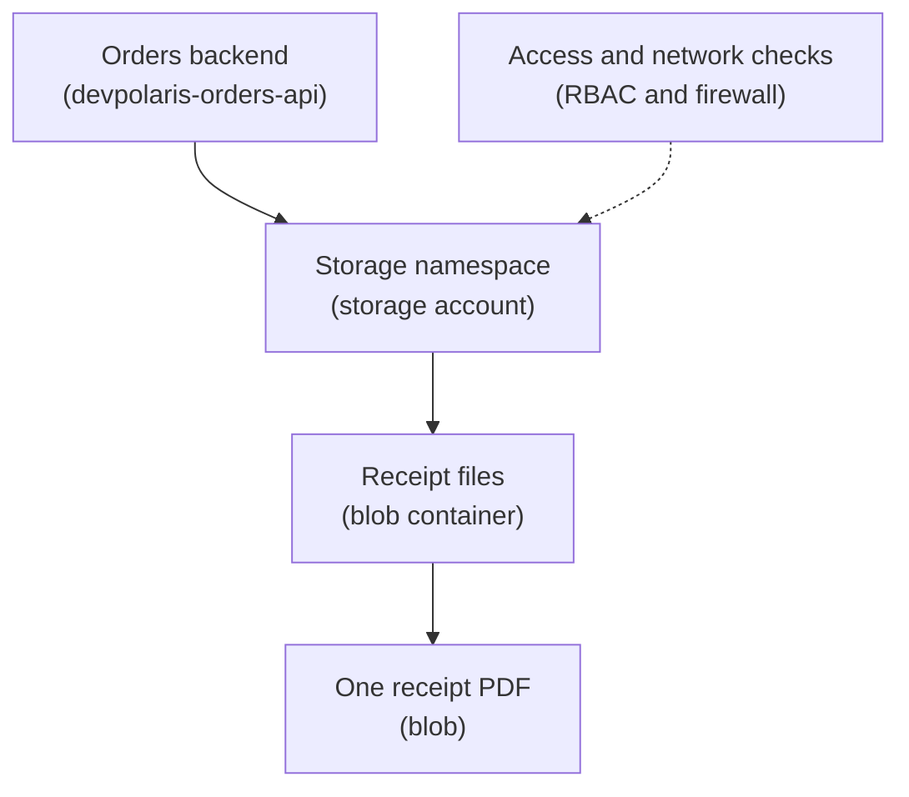

## Table of Contents

1. [Files Need A Durable Home](#files-need-a-durable-home)
2. [If You Know S3](#if-you-know-s3)
3. [The Storage Account Is The Outer Boundary](#the-storage-account-is-the-outer-boundary)
4. [Containers Group Related Blobs](#containers-group-related-blobs)
5. [Blob Names Are Not Database Records](#blob-names-are-not-database-records)
6. [The Orders API Stores Files And Metadata Separately](#the-orders-api-stores-files-and-metadata-separately)
7. [Access Should Start Private](#access-should-start-private)
8. [Tiers And Lifecycle Rules Are Cost Decisions](#tiers-and-lifecycle-rules-are-cost-decisions)
9. [Failure Modes You Will Actually See](#failure-modes-you-will-actually-see)
10. [A Practical Blob Storage Review](#a-practical-blob-storage-review)

## Files Need A Durable Home

A backend eventually creates files.

It may create a receipt PDF.

It may create a CSV export.

It may let a user upload a profile image.

It may write an archive for another system to download.

The simple version on your laptop is easy.

The app writes `receipt.pdf` into a folder.

You open the folder and see the file.

Cloud apps are different because one running copy of the app is not the whole system.

`devpolaris-orders-api` may run on Azure Container Apps today and App Service tomorrow.

It may scale from one instance to five during a sale.

It may be replaced during deployment.

If the API writes important files to the local container filesystem, those files are tied to that one running copy.

Another copy may not see them.

A redeploy may remove them.

A crash may make the path disappear.

Blob Storage exists to give file-like data a durable service outside the running app.

Azure Blob Storage stores objects called blobs.

A blob can be a PDF, image, CSV, JSON export, log archive, backup artifact, or any other bytes the app needs to keep.

For a beginner, the plain mental model is:

Blob Storage is where the app puts files that should outlive the process that created them.

The important part is not just "upload a file."

The important part is knowing what names, access rules, lifecycle rules, and database pointers make that file usable later.

## If You Know S3

If you know AWS S3, Blob Storage will feel familiar.

Both services store file-like objects.

Both use names that often look like paths.

Both are common homes for generated exports, receipts, images, and backups.

The Azure naming stack is different.

| AWS idea | Azure idea | Beginner translation |
|---|---|---|
| S3 bucket | Storage account plus blob container | Azure has a larger account boundary before the container |
| Object key | Blob name | The string name of the object inside the container |
| Bucket policy or IAM role | Azure RBAC, managed identity, network rules, and sometimes access policies | Access is split across identity and network choices |
| Storage class | Access tier | Hot, cool, cold, or archive style cost and access tradeoffs |

Do not force the mapping too far.

An Azure storage account can hold more than blob containers.

It can also be the namespace for Azure Files, queues, and tables.

That outer account boundary matters for naming, network access, redundancy, and some security settings.

If you learned S3 first, the safest Azure sentence is:

Blob Storage is the object storage part, and the storage account is the wider Azure Storage boundary around it.

## The Storage Account Is The Outer Boundary

A storage account is an Azure resource.

It provides the namespace and main settings for Azure Storage data.

That includes blobs, file shares, queues, and tables.

For `devpolaris-orders-api`, the team might create a storage account named `devpolarisprodorders`.

That name is part of the public service address, so Azure requires storage account names to be globally unique.

Globally unique means no other Azure customer can already be using the same storage account name.

That can feel surprising the first time.

You are not only naming something inside your subscription.

You are naming a reachable storage namespace.

The storage account is where the team makes several big choices.

Which region should hold the data?

Should access be public, private, or restricted to selected networks?

Which identity can read and write?

Which redundancy option should protect the data?

Which data protection features should be enabled?

Those questions are not decoration.

They change how the app behaves during failures and incidents.

Here is a small mental picture.



The dotted line is intentional.

Access rules are not another place where the file lives.

They are checks around the storage account.

That distinction helps new Azure users avoid thinking that identity, network, and storage are all the same kind of thing.

## Containers Group Related Blobs

A blob container groups blobs inside a storage account.

For the orders system, the team might use containers like this:

| Container | What belongs there | Common owner |
|---|---|---|
| `receipts` | Customer receipt PDFs | Orders API |
| `exports` | Admin CSV and JSONL exports | Export job |
| `uploads` | User-uploaded files after validation | Public API plus worker |
| `archive` | Long-retention generated files | Operations process |

Containers are useful because they let the team separate access patterns.

Receipt files are read by signed-in customers after the app checks ownership.

Exports may only be read by admins.

Uploads may need malware scanning or validation before another service uses them.

Archive files may rarely be read.

If every blob goes into one container with a loose naming convention, access rules become harder to audit.

If every feature creates a new storage account, the team may create naming and cost clutter.

The middle path is usually:

one storage account for a bounded application area, then containers for related classes of object data.

That is not a law.

It is a good first review habit.

## Blob Names Are Not Database Records

A blob name is the object's name inside a container.

It can contain slashes.

That makes blob names look like file paths.

For example:

```text
receipts/2026/05/ord_1042.pdf
exports/2026/05/orders-paid-2026-05.csv
uploads/customers/cus_77/profile-image-original.png
```

Those names are useful.

They make browsing and lifecycle rules easier.

They also help humans understand what the file is.

But a blob name is not a relational record.

Do not make the blob name carry every business rule.

For example, this name is trying to do too much:

```text
receipts/customer-cus_77/order-ord_1042/status-paid/region-eu/created-2026-05-03/final-v2.pdf
```

That path looks informative.

It is also brittle.

What happens when the order status changes?

What happens when a customer email changes?

What happens when support needs to list all receipts for a customer by payment provider?

Blob names are good for object organization.

Business facts belong in a database row.

The clean design is usually:

the blob has a stable name, and the database stores ownership, status, and business meaning.

## The Orders API Stores Files And Metadata Separately

The receipt feature is a useful example because it uses Blob Storage and Azure SQL Database together.

The API creates the receipt PDF.

It uploads the file to Blob Storage.

It writes a database row that records who owns the receipt and which blob contains the bytes.

The row might look like this:

```text
receipt_id: rec_1042
order_id: ord_1042
customer_id: cus_77
storage_account: devpolarisprodorders
container: receipts
blob_name: receipts/2026/05/ord_1042.pdf
content_type: application/pdf
created_at: 2026-05-03T09:31:00Z
```

This row is not storing the PDF.

It is storing the pointer and the business ownership.

When the customer asks to download the receipt, the app should not trust only the blob name.

The app checks the database first.

Does this order belong to the signed-in customer?

Is the receipt ready?

Which blob should be read?

Only then does the app read or authorize access to the blob.

That sequence prevents a common mistake.

If the API lets users guess blob names directly, one customer may discover another customer's file path.

Private Blob Storage plus application-level authorization is usually a safer starting point than public containers.

## Access Should Start Private

New learners often ask whether a blob should have a public URL.

Sometimes public access is right for public assets, such as a marketing image or a downloadable public file.

Private application data should start private.

Receipts, invoices, exports, and user uploads are not public web assets.

They are business data.

The app should decide who can read them.

In Azure, access can involve several layers.

The app's managed identity may need a role assignment that allows it to read or write blobs.

The storage account may restrict public network access.

The app may reach storage through private networking.

The container may disallow anonymous reads.

The application database may enforce ownership before download.

These layers can feel like too much at first.

They exist because "can reach the storage account" and "should read this customer's receipt" are different questions.

Here is the plain version:

network rules decide whether a path to the storage account exists.

Azure identity and role assignments decide whether the caller can perform a storage action.

Application authorization decides whether this user should see this business object.

Do not collapse those three into one vague word like "access."

When a blob read fails, knowing which layer failed saves a lot of time.

## Tiers And Lifecycle Rules Are Cost Decisions

Not every blob is read the same way.

A receipt may be downloaded often during the first week after purchase and rarely after that.

A monthly export may be downloaded once by an admin and then kept for audit.

A temporary import file may only be needed for a few days.

Blob Storage has access tiers that trade storage cost against access behavior.

The exact prices and limits change, so you should check current Azure pricing and docs before designing a cost model.

The beginner mental model is enough for this article:

hot data is expected to be read often.

cool or colder data is expected to be read less often.

archive-style data is kept mainly because it may be needed later.

Lifecycle rules can move or delete blobs based on age and conditions.

That sounds like housekeeping, but it is really a product and operations decision.

If a customer may download receipts for seven years, do not delete receipts after 90 days because the storage bill looked high.

If exports are only troubleshooting artifacts, maybe they can expire after 30 days.

A good lifecycle rule starts from a retention promise.

It does not start from "we should clean up old files somehow."

For `devpolaris-orders-api`, the team might write this decision record:

| Blob type | Retention promise | First lifecycle idea |
|---|---|---|
| Customer receipt PDFs | Keep while account exists plus legal retention window | Keep durable, consider lower tier after active period |
| Admin CSV exports | Keep 90 days unless marked for audit | Delete after 90 days |
| Failed import input files | Keep 14 days for debugging | Delete after 14 days |
| Public product images | Keep while product is active | Do not lifecycle-delete automatically |

The lifecycle rule should match the promise the team is willing to support.

## Failure Modes You Will Actually See

Blob Storage failures are often easier to debug once you name the layer.

Here are common shapes.

The app cannot upload because the identity lacks permission.

```text
error=AuthorizationPermissionMismatch
operation=PutBlob
container=receipts
blob=receipts/2026/05/ord_1042.pdf
```

The fix direction is not "retry harder."

Check the managed identity and role assignment for the storage account or container.

The app can write in staging but not production.

```text
storageAccount=devpolarisstgorders result=success
storageAccount=devpolarisprodorders result=network_denied
```

That often points at storage account network rules, private endpoint configuration, or the app running in the wrong network.

The customer sees a receipt row, but download returns missing blob.

```text
receipt_id=rec_1042 status=ready
blob read failed: BlobNotFound
```

That points at a mismatch between database metadata and blob upload.

Maybe the app marked the receipt ready before the upload completed.

Maybe a cleanup rule deleted the blob earlier than the product promise allowed.

Maybe the app wrote to a different container than the database recorded.

The admin export job creates huge storage bills.

That is usually not a one-line bug.

It is a lifecycle and retention design problem.

The team should inspect old exports, lifecycle rules, access tiers, and whether the app is writing duplicate files.

## A Practical Blob Storage Review

Before merging a feature that writes blobs, ask a few plain questions.

What storage account and container does this feature use?

What is the blob naming pattern?

Which database row records the business owner or status?

Which identity writes the blob?

Which identity reads it?

Can anonymous users read it?

What happens if the upload succeeds but the database write fails?

What happens if the database row says ready but the blob is missing?

How long should the file live?

How will the team restore or recover if the file is deleted by mistake?

Here is a compact review table.

| Review area | Good answer for receipts |
|---|---|
| Data shape | PDF file plus SQL metadata |
| Storage home | Private blob container |
| Naming | Stable blob name based on order ID and date |
| Ownership | Customer and order stored in SQL |
| Read path | App checks customer ownership before download |
| Failure check | Do not mark receipt ready until upload completes |
| Retention | Match product and legal promise |

This is the tone you want in a design review.

Not "we used Blob Storage because Azure docs said it stores files."

A stronger answer is:

we used Blob Storage because the receipt is a durable file, and we kept ownership in SQL because authorization is a business rule.

That answer is simple, but it shows the team understands the boundary.

---

**References**

- [What is Azure Blob Storage?](https://learn.microsoft.com/en-us/azure/storage/blobs/storage-blobs-overview) - Microsoft explains Blob Storage as object storage for unstructured data such as documents and media.
- [Overview of storage accounts](https://learn.microsoft.com/en-us/azure/storage/common/storage-account-overview) - Microsoft explains storage accounts, account types, naming, and the Azure Storage namespace.
- [Data protection overview for Azure Blob Storage](https://learn.microsoft.com/en-us/azure/storage/blobs/data-protection-overview) - Microsoft summarizes data protection features such as soft delete, versioning, and recovery-related options.
- [Manage the Azure Blob Storage lifecycle](https://learn.microsoft.com/en-us/azure/storage/blobs/lifecycle-management-overview) - Microsoft explains lifecycle management for moving or deleting blobs based on rules.
