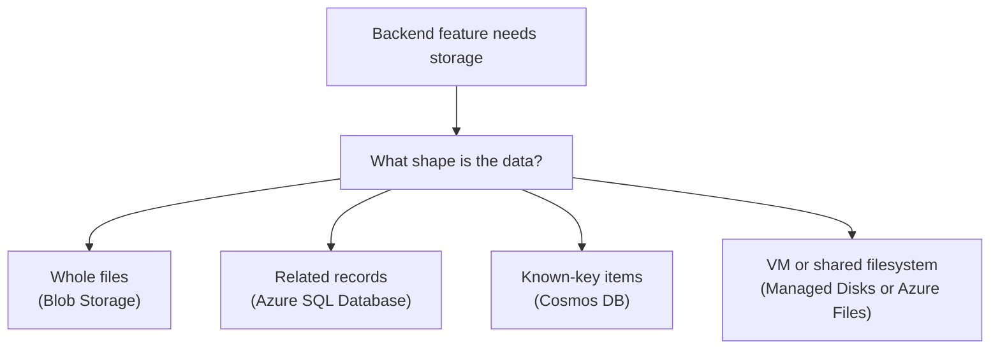

## Table of Contents

1. [Start With The Shape Of The Data](#start-with-the-shape-of-the-data)
2. [If You Know AWS Storage](#if-you-know-aws-storage)
3. [The Orders API Has Several Kinds Of Data](#the-orders-api-has-several-kinds-of-data)
4. [Files Point Toward Blob Storage](#files-point-toward-blob-storage)
5. [Business Records Point Toward Azure SQL Database](#business-records-point-toward-azure-sql-database)
6. [Known-Key Items Point Toward Cosmos DB](#known-key-items-point-toward-cosmos-db)
7. [Attached Storage Points Toward Managed Disks Or Azure Files](#attached-storage-points-toward-managed-disks-or-azure-files)
8. [The First Review Conversation](#the-first-review-conversation)
9. [Failure Modes That Reveal The Storage Layer](#failure-modes-that-reveal-the-storage-layer)
10. [The Tradeoffs You Are Really Choosing](#the-tradeoffs-you-are-really-choosing)

## Start With The Shape Of The Data

Most cloud storage confusion starts because the service
names arrive too early. Azure Blob Storage. Azure SQL
Database. Azure Cosmos DB. Managed Disks. Azure Files.
Those names matter, but they are not the best first
question. The better first question is: what shape is
the data? Some data is a file. A receipt PDF is a file.
A CSV export is a file. A product image is a file. You
usually store the whole thing, read the whole thing,
replace it, or delete it. That shape points toward
object storage, which in Azure usually means Blob
Storage.

Some data is a set of related business records. An
order belongs to a customer. An order has line items. A
payment attempt belongs to an order. Support may ask
for all failed payments for one customer this week.
That shape points toward a relational database, which
in Azure usually means Azure SQL Database. Some data is
an item you fetch by a known key. An idempotency record
says, "this checkout request already ran." A job-status
record says, "export job `job_7a1` is still
processing." The app knows the key before it asks for
the item.

That shape can point toward Cosmos DB, especially when
the access pattern is predictable. Some data is storage
attached to compute. A VM needs an operating system
disk. A worker may need a mounted directory. Several
machines may need to see the same file path. That shape
points toward Managed Disks or Azure Files. This
article teaches the beginner mental model across those
Azure families.

The running example is `devpolaris-orders-api`, a
Node.js backend that accepts checkout requests, writes
order data, generates receipt files, and runs
supporting jobs. The goal is not to memorize a vendor
chart. The goal is to look at a backend feature and
choose a good first direction before the service
details get noisy.



Read the diagram from top to bottom. The plain-English
need comes first. The Azure service name comes second.
That order is important because service-first thinking
makes every feature feel like a product comparison.
Shape-first thinking keeps you close to what the
application is trying to remember.

## If You Know AWS Storage

If you have learned AWS, you already have useful mental
hooks. Azure still has its own nouns and rules, so
treat these as bridges, not perfect translations.

| AWS idea you may know | Azure service to compare first | What changes in Azure |
|---|---|---|
| S3 bucket and object | Storage account, container, and blob | The storage account is the larger namespace that can hold multiple storage services |
| RDS database | Azure SQL Database | Azure uses logical servers and databases, with firewall and private access choices around them |
| DynamoDB table | Cosmos DB container | Cosmos DB makes partition keys and request units part of the design conversation early |
| EBS volume | Managed Disk | The disk is an Azure resource attached to a VM |
| EFS filesystem | Azure Files | Azure Files is a managed file share that can be mounted over SMB and, in some configurations, NFS |

The useful AWS habit is not memorizing one-to-one
names. The useful habit is asking what promise the app
needs from storage. If the app needs durable files,
think Blob Storage the same way you might first think
S3. If the app needs SQL records and transactions,
think Azure SQL Database the same way you might first
think RDS. If the app needs predictable key-based
items, think Cosmos DB the same way you might first
inspect DynamoDB. Then slow down and learn the
Azure-specific surface. A storage account is not just a
bucket.

Azure SQL Database is not just "RDS with a different
logo." Cosmos DB has its own partition and throughput
model. The comparison gets you oriented. The Azure
details keep you from making confident mistakes.

## The Orders API Has Several Kinds Of Data

Real backends rarely have one kind of data. That is
normal. The mistake is forcing every storage problem
into the first database or storage service the team
already knows. Imagine `devpolaris-orders-api` receives
a checkout request. The API needs to create an order,
record line items, remember payment state, and show
order history later. That data has relationships. It
needs consistency. It should not become a pile of files
just because files are easy to upload. Now imagine the
same API generates a receipt PDF after payment
succeeds. That PDF is a file. The database should
remember who owns it and where it lives.

The file bytes do not need to sit inside a SQL row. Now
imagine an admin exports last month's paid orders. The
export job reads records, creates a CSV file, and
stores the finished file for download. Again, the file
belongs in object storage. The export status and
ownership metadata can live in a database. Now imagine
the browser retries a checkout request because the
network was shaky. The API needs to avoid creating two
paid orders for one customer action. That may need an
idempotency record. Idempotency means repeating the
same request safely without doing the action twice.

That record is usually small and read by a known key.
Now imagine a legacy worker runs on an Azure VM and
needs a local-looking disk to process a large import.
That is not a database problem. It is storage attached
to compute. One system can need all of these shapes.
The clean design habit is to separate the data by
behavior. Here is a simple map for the orders system.

| Data in `devpolaris-orders-api` | What it behaves like | Azure service to consider first |
|---|---|---|
| Orders, order items, payment attempts | Related records with transactions | Azure SQL Database |
| Receipt PDFs and monthly CSV exports | Whole files stored by name | Blob Storage |
| Idempotency tokens and job status | Known-key items | Cosmos DB |
| VM operating system disk or worker scratch disk | Disk attached to one VM | Managed Disks |
| Shared folder mounted by several workers | Filesystem path shared by machines | Azure Files |

This table is not a final architecture. It is a sorting
step. After sorting, you still check network access,
identity, backup, retention, cost, and team experience.
But the conversation is already clearer.

## Files Point Toward Blob Storage

Blob Storage is Azure object storage. Object storage
means the service stores bytes as named objects. In
Azure, the outer container is usually a storage
account. Inside the storage account, a blob container
groups blobs. A blob is the object itself, such as a
PDF, CSV, image, video, backup file, or generated
report. The reason Blob Storage exists is that normal
server disks and relational tables are awkward places
for application files. If a receipt is written to one
VM's local disk, a different VM may not see it. If the
VM is replaced, the receipt may vanish unless another
backup process copied it.

If the team stores a giant PDF inside a SQL row,
backups, queries, and application code become harder to
reason about. For `devpolaris-orders-api`, Blob Storage
is a natural home for generated receipt files.

```text
Storage account: devpolarisprodorders
Blob container: receipts
Blob name: 2026/05/ord_1042.pdf
Content type: application/pdf
Owner in app database: customer cus_77
```

The blob name can contain slashes, so it looks like a
path. That does not make Blob Storage a normal
filesystem. The useful mental model is "named object
inside a container." The database stores the business
meaning. Blob Storage stores the file bytes. That split
keeps both systems honest. Azure SQL Database can
answer "does this customer own this order?" Blob
Storage can answer "where are the receipt bytes?"

When a Blob Storage failure appears in logs, the error
usually points at a storage account, container, blob
name, network rule, or permission.

```text
2026-05-03T09:14:22.418Z ERROR devpolaris-orders-api requestId=req_61b
receipt upload failed
storageAccount=devpolarisprodorders container=receipts blob=2026/05/ord_1042.pdf
error=AuthorizationPermissionMismatch
message="This request is not authorized to perform this operation using this permission."
```

That is not a SQL schema problem. The next checks are
the managed identity, role assignment, container
access, storage account network rules, and whether the
app is writing to the expected storage account. Blob
Storage is good at durable object storage. It is not a
good replacement for a database when the feature needs
joins, constraints, transactions, or flexible reporting
queries.

## Business Records Point Toward Azure SQL Database

Azure SQL Database is a managed relational database
service. Relational means the data is organized into
tables with rows and relationships. Managed means Azure
runs the database service for you, while your team
still owns schema design, queries, access, application
behavior, and recovery decisions. Relational databases
exist because business data is connected. An order is
connected to a customer. An order is connected to line
items. A payment attempt is connected to an order.
Support, finance, and product teams ask questions
across those connections.

For `devpolaris-orders-api`, the core order data points
toward Azure SQL Database. The app needs transactions.
A transaction is a group of database changes that
should succeed or fail together. Without that grouping,
checkout can leave the system in a half-updated state.
The payment could be recorded but the order row
missing. The order row could exist without line items.
The receipt could point to the wrong customer. SQL
gives the team a strong tool for those rules. Here is
the kind of business shape that belongs in a relational
database.

| Table | What it stores | Why the relation matters |
|---|---|---|
| `orders` | One checkout order | Order history starts here |
| `order_items` | Products inside the order | Each item belongs to one order |
| `payment_attempts` | Payment provider attempts | Support needs the attempt trail |
| `receipt_files` | Blob pointer and ownership | The app must authorize downloads |

The receipt PDF itself can live in Blob Storage. The
row that says which customer owns the receipt can live
in Azure SQL Database. This is a common cloud pattern:
store the large file in object storage, and store the
business pointer in a database. A database error looks
different from a blob error.

```text
2026-05-03T09:17:03.119Z ERROR devpolaris-orders-api requestId=req_92a
checkout write failed
component=orders-db server=devpolaris-prod-sql.database.windows.net database=orders
error=Login failed for user '<token-identified principal>'
```

This log points toward identity, database user mapping,
firewall/private endpoint access, or connection
configuration. It does not point toward blob
containers. When the error is a SQL constraint, the
signal changes again.

```text
2026-05-03T09:18:44.821Z ERROR devpolaris-orders-api requestId=req_11c
query=insert_order
error="Violation of UNIQUE KEY constraint 'uq_orders_idempotency_key'"
```

That second error is not necessarily bad news. It may
be the database protecting the system from a duplicate
checkout. The senior habit is to ask what the storage
layer is telling you before changing code.

## Known-Key Items Point Toward Cosmos DB

Cosmos DB is Azure's globally distributed NoSQL
database family. NoSQL here means the data model is not
the classic relational table-and-join model. In many
backend apps, Cosmos DB is useful when the app knows
the key or partition it needs and wants fast item reads
or writes around that access pattern. Do not start with
Cosmos DB because "NoSQL sounds scalable." Start with
Cosmos DB when the data shape and read path fit.

For `devpolaris-orders-api`, idempotency records are a
good teaching example. The API receives a checkout
request with an idempotency key. Before creating a new
order, it asks whether that key already produced an
order. The read path is direct. The app knows the key
at request time.

```json
{
  "id": "checkout_7f13",
  "kind": "idempotency",
  "customerId": "cus_77",
  "orderId": "ord_1042",
  "status": "completed",
  "createdAt": "2026-05-03T09:21:05Z"
}
```

This item does not need a join to line items. It needs
a safe "have I seen this request before?" check. Cosmos
DB can also fit job-status records. An export worker
starts job `job_913`. The UI polls by job ID. The
worker updates status from `queued` to `running` to
`ready` or `failed`. The read path is known before the
query starts. The risky part is pretending every future
question will be known. If support soon needs to search
by customer, date range, failure reason, worker
version, and export type, a relational database may be
more comfortable.

Cosmos DB asks you to think early about partition keys.
A partition key is the value Cosmos DB uses to place
related items and scale access. For a beginner, the
plain-English version is: which value will most reads
already know, and which value spreads work evenly
enough? That is a real design question. It is not a
detail to leave until after the app is built.

## Attached Storage Points Toward Managed Disks Or Azure Files

Some storage feels like a disk or folder, not like a
database or object store. An Azure VM needs an
operating system disk. That disk is usually an Azure
Managed Disk. A VM can also have data disks attached to
it. The app sees those disks as block storage, which
means the operating system can format and mount them
like drives. This is the Azure shape closest to an AWS
EBS volume.

The important beginner warning is that a disk attached
to one VM is not a shared application storage layer. If
`devpolaris-orders-api` runs across several instances,
writing receipts to one VM's local disk is a trap. One
request may create the file on VM A. The next request
may land on VM B. VM B cannot magically see VM A's
disk. That is why durable application files usually
belong in Blob Storage. There is another storage shape:
a shared mounted folder.

Azure Files provides managed file shares. Multiple
machines can mount the same share when the workload
really needs filesystem semantics. Filesystem semantics
means the app expects paths, directories, file handles,
and file operations rather than object names and
whole-object reads. This can help with legacy
workloads. It can also create unnecessary complexity
when the app only needs to store generated files for
download. Use the smallest storage shape that matches
the job. For new web backends, Blob Storage is often a
better first home for generated files than a shared
filesystem. For VM workloads that truly need a mounted
shared path, Azure Files may be the honest choice.

For a single VM's operating system and data disk,
Managed Disks are the normal Azure shape.

## The First Review Conversation

A good storage review starts before anyone opens the
Azure portal. The review can be short. It just needs to
describe the data clearly. Here is a useful review note
for a new receipt feature.

```text
Feature: downloadable receipt after checkout
Service: devpolaris-orders-api
Data shape: PDF file plus ownership metadata
Write path: generated once after payment succeeds
Read path: signed-in customer downloads by order id
Changes: should not be edited after creation
Bad outcome: receipt disappears, or another customer can read it
Likely Azure choice: Blob Storage for the file, Azure SQL Database for ownership and order metadata
```

Notice the split answer. The feature is not "Blob
Storage or SQL." It is "Blob Storage for the file, SQL
for the business rule." That is how many good cloud
designs feel. They do not force every piece of the
feature into one service. They let each service own the
part that matches its behavior. Use these questions
before choosing:

| Question | What it reveals |
|---|---|
| Is the data a file, a record, an item, or a disk? | The first service family |
| Does the app need joins or transactions? | Whether a relational database is likely |
| Does the app read by a known key? | Whether a NoSQL item model may fit |
| Does the app need a path mounted on a machine? | Whether file or disk storage is involved |
| What failure would hurt most? | The recovery and permission design |

The final question matters most. A storage service is
not only where bytes live. It is also where recovery,
access control, cost, and debugging habits live.

## Failure Modes That Reveal The Storage Layer

When a backend fails, the first job is to identify
which storage layer is complaining. The error message
usually gives you clues. Blob Storage failures often
mention a storage account, container, blob,
authorization mismatch, missing blob, or network rule.
The fix direction is usually identity, role assignment,
container access, private endpoint, firewall, or blob
name. Azure SQL Database failures often mention login,
database name, server name, connection timeout,
firewall, deadlock, constraint, or transaction.

The fix direction is usually connection configuration,
network access, database identity, schema, query
behavior, or transaction handling. Cosmos DB failures
often mention partition key, request charge, rate
limiting, item conflict, or missing document. The fix
direction is usually partition design, retry behavior,
throughput, item key, or access pattern. Managed Disk
failures often show up as VM boot problems, full disks,
mount failures, or disk performance limits.

The fix direction is usually VM disk attachment,
filesystem space, disk size, disk type, or
snapshot/restore. Azure Files failures often mention
mount errors, share access, credentials, private
endpoint, or file locking behavior. The fix direction
is usually share configuration, identity or key access,
network path, mount options, or whether the app really
needed shared files. Here is the practical diagnostic
habit.

| Log clue | First storage layer to inspect | First question |
|---|---|---|
| `container=receipts blob=... AuthorizationPermissionMismatch` | Blob Storage | Can this app identity write this container? |
| `database=orders Login failed` | Azure SQL Database | Is the identity mapped and allowed to connect? |
| `partition key value was not supplied` | Cosmos DB | Does the app send the partition key for this item? |
| `No space left on device` on a VM | Managed Disk | Which disk filled, and is the important data elsewhere? |
| `mount error` for a shared path | Azure Files | Can the machine reach and authenticate to the file share? |

This table saves time because it prevents random
debugging. Do not start by changing application logic
if the log says the storage account rejected the
identity. Do not rebuild a container image if SQL says
the database login is missing. Let the storage layer
tell you what kind of problem you have.

## The Tradeoffs You Are Really Choosing

Every storage choice is a tradeoff. Blob Storage gives
you durable object storage with simple names and
HTTP-based access. The tradeoff is that it does not
behave like a relational database. Azure SQL Database
gives you tables, joins, constraints, and transactions.
The tradeoff is that you must design schema, queries,
connection behavior, migrations, and recovery
carefully. Cosmos DB gives you flexible item storage
for known access patterns. The tradeoff is that
partition design and throughput behavior become part of
the application design. Managed Disks give VMs normal
disk behavior. The tradeoff is that disks are tied to
compute habits, and local VM storage is often the wrong
place for shared application files.

Azure Files gives shared filesystem access. The
tradeoff is that shared file semantics can become a
coordination problem if the app would be simpler with
objects or records. The senior habit is to say the
tradeoff out loud. For `devpolaris-orders-api`, a good
first design might look like this:

| Need | Choice | Tradeoff accepted |
|---|---|---|
| Core orders and payment state | Azure SQL Database | Schema and migrations matter |
| Receipt PDFs and export CSVs | Blob Storage | Business ownership must live elsewhere |
| Idempotency and job status | Cosmos DB or SQL, depending on query needs | Access pattern must be clear |
| Legacy VM work disk | Managed Disk | The disk is tied to VM operations |
| Shared import folder for legacy workers | Azure Files | File locking and mount behavior need testing |

This is not a fancy architecture. It is a careful one.
That is what good storage design usually feels like.
You choose the service that matches the data behavior,
then you make the failure path easy to understand.

---

**References**

- [What is Azure Blob Storage?](https://learn.microsoft.com/en-us/azure/storage/blobs/storage-blobs-overview) - Microsoft explains Blob Storage as object storage for unstructured data such as documents, media, backups, and files.
- [Overview of storage accounts](https://learn.microsoft.com/en-us/azure/storage/common/storage-account-overview) - Microsoft explains how a storage account provides the namespace for blobs, files, queues, and tables.
- [What is Azure SQL Database?](https://learn.microsoft.com/en-us/azure/azure-sql/database/sql-database-paas-overview) - Microsoft describes Azure SQL Database as a managed relational database service.
- [Azure Cosmos DB overview](https://learn.microsoft.com/en-us/azure/cosmos-db/overview) - Microsoft introduces Cosmos DB and its NoSQL database model.
- [Introduction to Azure managed disks](https://learn.microsoft.com/en-us/azure/virtual-machines/managed-disks-overview) - Microsoft explains managed disks as block-level storage volumes used with Azure VMs.
- [Introduction to Azure Files](https://learn.microsoft.com/en-us/azure/storage/files/storage-files-introduction) - Microsoft explains Azure Files as managed file shares for cloud and hybrid workloads.
