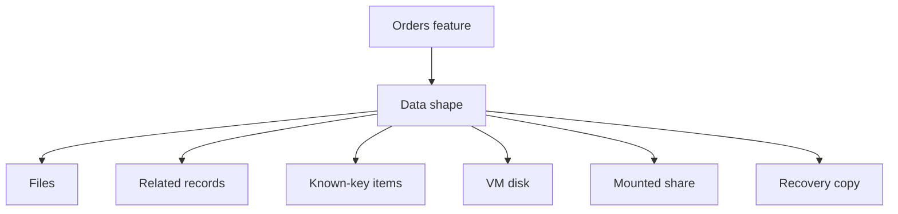

## Table of Contents

1. [The Problem](#the-problem)
2. [What Is Storage](#what-is-storage)
3. [Data Shape](#data-shape)
4. [Files](#files)
5. [Records](#records)
6. [Items](#items)
7. [Disks](#disks)
8. [File Shares](#file-shares)
9. [Recovery](#recovery)
10. [Sample Data Map](#sample-data-map)
11. [Putting It All Together](#putting-it-all-together)
12. [What's Next](#whats-next)

## The Problem

Storage is the part of a cloud system that keeps state after a request, process, container, or virtual machine stops. The first Azure storage decision is not the product name. It is the shape of the state your application is trying to keep.

An orders API usually has several kinds of state at the same time. A receipt PDF is a file. The order, payment, customer, and line item facts are related records. A retry token or checkout draft may be a small item looked up by one known key. A legacy worker may expect a mounted path such as `/mnt/templates`. A virtual machine may need a persistent operating system disk. A bad migration or deletion also creates a recovery question: which previous copy can the team restore?

Those needs should not all land in one database. They have different access patterns, different permission boundaries, different costs, and different failure modes. The useful habit is to describe the data first, then choose the Azure service whose behavior matches that description.

## What Is Storage

Storage is the persistence layer where a system keeps useful state outside the memory and local scratch space of running compute. Compute is temporary by design. A container can be replaced, an App Service instance can recycle, a Function invocation can end, and a VM can move to different physical hardware. Storage gives the system a durable home for the facts and files that must survive those changes.

Azure has several storage and database services because stored data does not all behave the same way.

| Data need | Azure service to consider first | Promise the service is built around |
| --- | --- | --- |
| File-like bytes | Blob Storage | Durable named objects in containers |
| Relational app records | Azure SQL Database | Tables, SQL, constraints, transactions, and managed database operations |
| Item-shaped app state | Cosmos DB | JSON-like items, partition keys, request units, and predictable lookups |
| VM disk paths | Managed Disks | Block storage attached to virtual machines |
| Shared mounted folders | Azure Files | SMB or NFS file shares for multiple clients |
| Previous copies | Service-specific backups, versions, snapshots, and retention | Recovery after corruption, overwrite, or deletion |

This table is a first filter, not a product catalog. A good design review can explain why each data asset belongs in one row before it discusses SKUs, regions, replication, private endpoints, or backup settings.

## Data Shape

Data shape means how the application reads, writes, updates, protects, and recovers a piece of state. The same business feature can produce several shapes.

*The storage choice starts with the access pattern: object file, relational row, document item, shared filesystem, or recovery copy.*

An order creates relational records in Azure SQL Database. The receipt PDF for that order can live in Blob Storage. A checkout idempotency key can live in Cosmos DB if the app reads it by request ID and expires it later. A legacy document generator may need Azure Files because it only knows how to read templates from a mounted folder. A VM running a vendor package may need Managed Disks because the package writes to an operating system volume. A recovery plan may need blob versions, SQL point-in-time restore, Cosmos continuous backup, disk snapshots, or file share backups.

The diagram leaves service names until the shape is clear. That is the decision habit to keep.

## Files

A file is a named group of bytes that the application normally reads, writes, serves, or deletes as one unit. Receipt PDFs, profile images, CSV exports, support attachments, database export files, and compressed logs often fit this shape.

Blob Storage is Azure's usual home for this kind of data. A storage account owns the global endpoint, region, redundancy setting, network rules, encryption behavior, and billing boundary. A container groups related blobs inside that account. A blob is the object itself, such as `receipts/2026/05/order-417.pdf`.

The application database should keep the business meaning: order ID, customer ID, payment state, and which blob name holds the receipt. Blob Storage should keep the bytes. This split keeps large files out of transactional tables, makes database backups smaller, and lets the file layer scale independently from the database.

## Records

A record is a structured business fact that needs to stay valid beside other facts. Orders belong to customers. Line items belong to orders. Payments refer to orders. Refunds refer to payments. A support query may need to join several tables to answer one customer question.

Azure SQL Database is the Azure service to learn first for this relational shape. It provides a managed SQL Server database without making your team operate the database host. Azure handles much of the platform work, such as patching, availability infrastructure, and automated backups. Your team still owns schema design, queries, indexes, migrations, permissions, connection behavior, and restore expectations.

The practical reason to choose a relational database is rule enforcement. If checkout writes an order, order items, and payment state, those writes should succeed together or fail together. A relational transaction protects that business promise. Foreign keys, unique constraints, and check constraints also protect the data when application validation misses something.

## Items

An item is a document-like record that the application usually reads or writes through a known key. Idempotency keys, session state, device telemetry points, shopping cart snapshots, and user preferences can fit this shape when the app does not need flexible joins across many tables.

Cosmos DB is Azure's managed database for this item-shaped model. It stores JSON-like items in containers and uses a partition key to decide how data and request load are distributed. It charges work through request units, commonly called RUs. A small point read by ID and partition key is cheap. A query that scans many partitions is much more expensive.

Cosmos DB is not a shortcut around design. It needs access-pattern planning earlier than many beginners expect. Before creating a container, the team should know which fields are used for frequent lookups, which data can expire, how much stale data the product can tolerate, and whether the workload truly needs horizontal scale or global distribution.

## Disks

A disk is block storage attached to a virtual machine and exposed to the guest operating system as a device. The operating system formats it with a filesystem such as NTFS or ext4, then applications read and write through normal file paths.

Azure Managed Disks are useful when the workload truly belongs on a VM and expects a local disk contract. Examples include VM boot volumes, database data drives for self-managed database engines, vendor software that writes to a fixed path, and temporary working space that must survive VM restarts.

Managed Disks are different from Blob Storage. A blob is addressed through a storage API over HTTPS. A disk is attached to a VM and used through the operating system storage stack. If a modern web app only needs to store uploaded files or generated PDFs, Blob Storage is usually a better fit than a VM disk because it avoids tying user data to one machine.

## File Shares

A file share is a managed network folder that multiple clients can mount and use through a filesystem protocol. Azure Files supports SMB and NFS scenarios, so VMs, containers, and some on-premises clients can read and write through familiar paths.

Azure Files is useful when the application or migration path requires a shared directory. A legacy worker may expect `/mnt/templates`. A Windows workload may expect an SMB share. A group of VMs may need common configuration files during a transition.

Use a file share because the workload needs file semantics, not because files feel familiar. Network filesystems have locking, metadata, session, and latency behavior that object storage does not have. For modern application uploads and downloads, Blob Storage is usually simpler. For legacy paths and shared mounts, Azure Files is the right shape to consider.

## Recovery

Recovery is the plan for getting useful data back after an overwrite, deletion, corruption, failed migration, compromised script, or platform problem. A durable service can preserve the wrong value very reliably, so durability alone is not enough.

*Backup strategy depends on how long the state must survive and which platform boundary owns it.*

Each shape has a different recovery tool:

| Data shape | Recovery mechanism to review |
| --- | --- |
| Blob files | Blob versioning, blob soft delete, container soft delete, lifecycle rules, and optional backup |
| Azure SQL records | Automated backups, point-in-time restore, long-term retention, and restore drills |
| Cosmos DB items | Periodic or continuous backup mode, point-in-time restore where enabled, and TTL for temporary data |
| Managed Disks | Snapshots, Azure Backup, VM restore procedures, and application-consistent backup choices |
| Azure Files shares | Share snapshots, Azure Backup, soft delete, and restore testing |

Replication and backup are different promises. Replication helps a service survive infrastructure failure by keeping extra copies available. Backup and retention help the team recover a previous useful state after a logical mistake. A bad delete, bad import, or bad migration can be replicated quickly. A recovery copy needs a separate time boundary the team can choose later.

## Sample Data Map

A data map is a small architecture table that names each data asset, its shape, its Azure service, and the reason for that choice. It gives reviewers a way to discuss storage without arguing from product names first.

| Data asset | Shape | Azure service | Reason |
| --- | --- | --- | --- |
| Customer profile and orders | Related records | Azure SQL Database | Needs tables, constraints, joins, transactions, and restore |
| Customer receipt PDF | File object | Blob Storage | Needs durable object storage and secure download links |
| Checkout idempotency key | Known-key item | Cosmos DB | Needs fast lookup by request ID and automatic expiry |
| VM operating system | Disk | Managed Disk | Needs a block device attached to a VM |
| Legacy invoice template folder | Shared filesystem | Azure Files | Needs a mounted SMB or NFS path for old code |
| Deleted receipt recovery window | Recovery copy | Blob versioning and soft delete | Needs previous object versions after overwrite or delete |

## Putting It All Together

Choosing Azure storage and database services starts with the state your system needs to preserve. Files belong in an object store. Relational business facts belong in a relational database. Known-key items can fit a partitioned document database. VM-bound software may need a disk. Legacy multi-client paths may need a file share. Every important shape needs a recovery story.

The beginner mistake is trying to pick one service too early. The stronger habit is to ask what the data is, who reads it, how it changes, how it is protected, and what previous copy must exist when something goes wrong. Once those answers are clear, the Azure service choice becomes much easier to defend.

## What's Next

Next we look at Blob Storage, the Azure home for generated files, uploads, exports, logs, and other object-shaped bytes.

*Use this as the data shape checklist: choose storage by object, row, item, block, file, and recovery behavior before comparing individual Azure services.*

---

**References**

* [Introduction to Azure Storage](https://learn.microsoft.com/en-us/azure/storage/common/storage-introduction) - Overview of Azure storage accounts and services.
* [Introduction to Blob Storage](https://learn.microsoft.com/en-us/azure/storage/blobs/storage-blobs-introduction) - Object storage concepts, containers, blobs, and storage account boundaries.
* [What is Azure SQL Database?](https://learn.microsoft.com/en-us/azure/azure-sql/database/sql-database-paas-overview?view=azuresql-db) - Managed relational database overview.
* [Azure Cosmos DB documentation](https://learn.microsoft.com/en-us/azure/cosmos-db/) - Cosmos DB concepts, APIs, throughput, and consistency.
* [Azure managed disk types](https://learn.microsoft.com/en-us/azure/virtual-machines/disks-types) - Managed disk choices for Azure VMs.
* [Plan for an Azure Files deployment](https://learn.microsoft.com/en-us/azure/storage/files/storage-files-planning) - SMB and NFS file share planning.
* [Data protection overview for Azure Blob Storage](https://learn.microsoft.com/en-us/azure/storage/blobs/data-protection-overview) - Blob recovery features, versioning, soft delete, and backup options.
