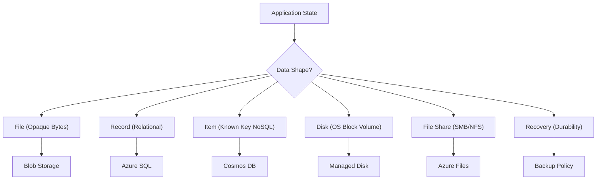

## Table of Contents

1. [What Is Data Storage](#what-is-data-storage)
2. [Data Shape](#data-shape)
3. [Files](#files)
4. [Records](#records)
5. [Items](#items)
6. [Disks](#disks)
7. [File Shares](#file-shares)
8. [Recovery](#recovery)
9. [Sample Data Map](#sample-data-map)
10. [Putting It All Together](#putting-it-all-together)
11. [What's Next](#whats-next)

## What Is Data Storage

Azure data storage is the virtualized platform layer that preserves application state outside the volatile running processes of your compute infrastructure. A virtual machine can experience hardware degradation, a container can be dynamically recycled, and a serverless function invocation will terminate after its execution window ends. Data storage resources move application facts, files, and database records out of these ephemeral compute host boundaries, guaranteeing that your data remains durable, consistent, and reachable across host migrations and restarts.

:::expand[Under the Hood: Storage Data Planes and Control Planes]{kind="design"}
Behind Azure's storage PaaS interfaces sits a managed storage platform that separates two jobs. The data plane accepts reads and writes for blobs, files, disks, and database pages. The control plane, exposed through Azure Resource Manager, creates resources, changes configuration, assigns identities, applies tags, and updates policies.

The public contract you design against is the Azure Storage redundancy model, not a specific cabinet or network card layout. Locally redundant storage keeps three synchronous copies of data in a single physical location in the primary region. Zone-redundant storage keeps synchronous copies across three availability zones in supported regions. Geo-redundant options add asynchronous replication to a secondary region.

That separation matters operationally. A blob upload, SQL transaction, Cosmos DB item write, or managed disk I/O request follows the service's data plane. Creating the storage account, changing its replication setting, assigning RBAC, or adding a private endpoint follows the control plane. When you debug storage, first ask which plane is failing: the data request, the resource configuration, or the network and identity path between them.
:::

If you host infrastructures on AWS, Azure's storage portfolio maps cleanly to the Amazon Web Services portfolio. Azure Blob Storage serves as the regional object storage equivalent of Amazon S3, Azure SQL Database serves as the managed relational equivalent of Amazon RDS, and Azure Cosmos DB maps directly to the known-key access pattern model of Amazon DynamoDB. For virtual machine block storage, Azure Managed Disks serve the same role as Amazon EBS volumes, and Azure Files maps to the managed shared directory structure of Amazon EFS.

Rather than choosing a storage service based on generic service names, evaluate the structural shape of your data. The shape of the data—whether it is a whole file, a relational table row, a NoSQL key-value document, or a mounted operating system volume—determines the access performance, billing rates, and permission scopes your system will inherit.

| Operational Question | Architectural Role inside Data Design |
| --- | --- |
| What is the primary data shape? | Whole files, database records, partition key documents, or raw OS disks dictate your database modeling and query syntax. |
| How does the application read the data? | Primary key searches, complex relational joins, full-text index lookups, or file-system directory mounts determine the engine capabilities needed. |
| How frequently does the data change? | Read-heavy archives, balanced transaction logs, or ultra-fast in-memory cache updates change your resource sizing. |
| What does Azure manage? | Managed database updates, documented redundancy behavior, platform patching, and automatic backup schedules remove infrastructure chores. |
| What must the team still own? | Schema design, indexing strategies, partition key choices, SAS token issuance, and recovery validations remain your responsibility. |

## Data Shape

To select the correct cloud data host, evaluate each application state requirement against its physical data shape. A single large enterprise application (such as an e-commerce platform) rarely relies on a single database. Different components within the system require different consistency guarantees and access patterns.

*The storage choice starts with the access pattern: object file, relational row, document item, or shared filesystem.*

A file shape represents a bundle of raw bytes that the application reads, writes, and deletes as a single, opaque block. Product images, generated PDF receipts, support attachments, CSV report exports, and log archives are all file-shaped.

A record shape represents structured business facts that possess clear relationships, consistency rules, and schemas. Order tables cabled to line-item tables, customer profiles cabled to address tables, and transaction payment logs belong to this shape. They require strict ACID (Atomicity, Consistency, Isolation, Durability) transactional integrity to guarantee that an order is never recorded without its matching line items.

An item shape represents semi-structured data cabled to a known lookup key. Idempotency checks, session tokens, user preferences, and real-time job status flags are item-shaped. They do not require complex relational joins or multi-table constraints; they require fast, predictable read/write operations and automated time-to-live (TTL) expiration policies.

A disk shape represents block storage attached to an operating system. Virtual machine boot disks, localized database data paths, and system swap files are disk-shaped. They require a VM-attached block device that the guest operating system can format and mount.

A file share shape represents a mounted network folder that must be concurrently read and written by multiple distinct compute instances using standard file system protocols (such as SMB or NFS). Shared template directories, legacy migrations, and common document shares belong to this shape.

This classification separates state by its access protocol and transaction boundary. Start by mapping each data asset to its core shape, and avoid the anti-pattern of forcing all data into a single database.

## Files

A file is a collection of binary data stored as a single object. Receipt PDFs, CSV reports, and software logs do not have database-like relationships inside their bytes; they are generated as units and must be served to users as units.

In Azure, Blob Storage is the standard PaaS resource for hosting files. If your application code attempts to write a generated receipt PDF directly to the local filesystem of an App Service instance, that file is cabled to that specific virtual machine's ephemeral drive. If the App Service scales out, another VM instance will not see the file. If the process recycles, the local directory mounts reset, and the file is permanently lost.

Blob Storage decouples the file from the compute process. Your checkout API writes the receipt PDF directly to a Blob Storage container, receives a stable URL pointer, and writes that pointer to your customer database. When a customer requests a download, your API generates a secure download link, separating the storage from your application's RAM and local disk limits.

## Records

A business record represents a fact that must be stored with high structural integrity and cabled to related facts. In an orders database, an order table must connect to a customer table, a line-items table, and a payment-attempts table.

This relational structure requires a database engine that enforces schema rules, primary key constraints, foreign key referential integrity, and transactions. Azure SQL Database provides a managed relational home equipped with Microsoft's SQL Server engine, bringing mature indexing, SQL query analysis, and transactional safety to your backend services.

The primary role of a relational database is protecting your business domain models. A checkout workflow must guarantee that if a customer's payment succeeds, the order state is updated, the inventory is decremented, and the payment record is written together within an atomic transaction. If any step fails, the entire transaction rolls back. Relational databases are designed to enforce these strict physical constraints.

## Items

An item represents an isolated document or key-value object that does not need a complex schema or multi-table joins. An idempotency check (which maps a request token to an order status) or a session token (which maps a session ID to user profile fields) are item-shaped.

These workloads are a strong fit for Azure Cosmos DB, a globally distributed, multi-model NoSQL database. Cosmos DB stores data as JSON documents and scales horizontally by partitioning data across logical partitions using partition keys. It is designed for low-latency reads and writes when the partition key, request units, consistency level, indexing policy, and regional placement match the workload.

However, Cosmos DB is not a shortcut to avoid schema planning. Operating a NoSQL database requires designing around your primary access patterns. You must select a partition key that distributes writes evenly across physical hardware nodes, monitor Request Unit (RU) costs, and select one of five tunable consistency levels to balance replication speeds with data accuracy.

## Disks

A disk represents block-level storage that is cabled directly to a virtual machine hypervisor. The guest operating system mounts this disk, formats it with a standard filesystem (such as ext4 or NTFS), and treats it as a local drive.

Azure Managed Disks provide persistent block storage for Virtual Machines. They are designed for VM-bound workloads and inherit durability from the disk type and redundancy option you choose. You should never use a managed disk as a generic file store for a web application. If your App Service or container needs to store generated PDFs, writing them to a disk attached to a single VM creates severe architectural bottlenecks and prevents horizontal scaling.

Always utilize the ephemeral temporary disk provided by your VM size exclusively for swap files, volatile caches, and scratch directories. Any data that must survive VM recycles and host hardware failures must be written to remote managed disks or PaaS storage resources.

## File Shares

A file share represents a managed network folder that multiple clients can mount concurrently using standard network protocols, specifically Server Message Block (SMB) for Windows/Linux and Network File System (NFS) for Linux.

Azure Files provides fully managed cloud file shares that can be mounted directly by virtual machines, container apps, or on-premises servers. This is highly effective when migrating legacy workloads that rely on traditional file system APIs and assume a shared directory path like `/var/shares/templates`.

Avoid using Azure Files as a replacement for Blob Storage. Writing files to a mounted file share introduces network file-locking latency, session tracking overhead, and complex ACL permission controls. If your application code is modern and can connect to storage using REST APIs or SDKs, Blob Storage is the simpler, faster, and more cost-effective object storage choice.

## Recovery

A data architecture is only as reliable as its recovery plan. Mistakes, security breaches, and hardware failures happen after data is successfully committed: a buggy automated cleanup script deletes a container of customer blobs, a bad migration script corrupts a database column, or a rogue administrator deallocates a VM disk.

*Backup strategy depends on how long the state must survive and which platform boundary owns it.*

Relying on a vague "we have backups" statement is an operational risk. You must design a specific recovery strategy for each data resource based on its shape:
* **Azure SQL**: Point-in-time restore (PITR) using automated transaction log backups cabled to active database copies.
* **Blob Storage**: Enabling Soft Delete to isolate deleted blobs in a hidden platform bin, and configuring Object Versioning.
* **Cosmos DB**: Configuring continuous backup windows and setting Time to Live (TTL) parameters to prune temporary items automatically.
* **Managed Disks**: Creating incremental redirect-on-write snapshots to capture VM disk states before executing updates.

These recovery mechanisms must be documented and tested regularly. A recovery plan is only verified when your team has successfully restored data to an active, operational target environment.

:::expand[Replication Is Not a Backup]{kind="pitfall"}
A common cloud database misconception is assuming that configuring geo-replication (such as GRS in Storage Accounts or active geo-replication in Azure SQL) constitutes a complete backup strategy. Replication protects availability when infrastructure or a region has a problem, but it can also replicate logical mistakes. If a software bug deletes table rows, or a compromised CI/CD pipeline script deletes a blob container, replication is not the same thing as a point-in-time copy you can choose independently later.

This behaves identically to AWS, where **RDS Multi-AZ replication** or **S3 Cross-Region Replication (CRR)** mirrors every database `DROP TABLE` or bucket object deletion immediately to the replica. High availability (HA) replication keeps your system running during hardware failures, but does nothing to prevent logical data loss.

To design a durable data protection layer, separate their operational capabilities:

| What Replication Provides (High Availability) | What Backup & Recovery Provides (Data Protection) |
| :--- | :--- |
| **Datacenter hardware resilience:** Auto-failover when an SSD block decays. | **Logical corruption recovery:** Point-in-Time Restore (PITR) to recover a database to 5 minutes before a bad migration. |
| **Availability Zone isolation:** Survives a physical power grid outage in Zone 1. | **Accidental deletion safety:** Storage Account Soft Delete to recover deleted blobs within a 14-day retention window. |
| **Regional disaster recovery:** Geo-replication to a secondary region. | **Immutable auditing:** Versioning, immutability policies, and locked backup policies to protect compliance records from overwrite or early deletion. |

**Rule of thumb:** High availability replication and backup recovery are completely orthogonal. Configure zone-redundant storage (ZRS) or geo-replication (GRS) to meet your system's RTO/RPO SLA commitments, but always enable service-specific backup mechanisms (such as Blob soft delete, SQL PITR, and Cosmos DB continuous backups) to protect your records from logical human and software errors.
:::

## Sample Data Map

To organize data decisions during architecture reviews, construct a data map. This map separates each component by its shape, target service, and operational rationale.

| Data Asset | Physical Shape | Azure Service | Architectural Rationale |
| --- | --- | --- | --- |
| Customer Profile & Orders | Relational Records | Azure SQL Database | Requires relational integrity, foreign key constraints, and transactional ACID guarantees. |
| Customer Invoice PDF | File | Blob Storage | Opaque binary file that must be durable and served securely via SAS links to public browsers. |
| Session Token cache | Known-Key Item | Azure Cosmos DB (Session) | Requires fast, known-key lookups with auto-expiring TTLs and a partition key that spreads traffic evenly. |
| VM Operating System | Disk | Managed Disk (Premium SSD) | Raw virtual block volume cabled to a VM hypervisor for guest OS booting. |
| Legacy Invoice Template | File Share | Azure Files (SMB mounted) | Required by a legacy VM-bound daemon that expects a shared network directory mount. |
| Deleted Assets Bin | Recovery | Soft Delete & Snapshots | Provides operational protection against accidental deletions without database restores. |

## Putting It All Together

Choosing Azure storage and database services requires matching your state requirements to the correct data shape.

* **Abstracted Infrastructure**: Ephemeral compute runtimes must decouple application state by writing data to managed storage services with documented durability and redundancy options.
* **Files as Blobs**: Unstructured binary files (receipts, CSVs, logs) belong in Blob Storage containers, decoupled from local VM drives and secured using dynamic SAS tokens cabled to managed identities.
* **Relational Records**: High-integrity business transactions belong in Azure SQL Database tables, leveraging referential constraints and ACID transaction logs.
* **Known-Key Items**: Semi-structured documents cabled to predictable key searches belong in Cosmos DB, scaling horizontally using hashed partition keys.
* **Durable Disks & Shares**: VM-bound virtual block volumes use Managed Disks, and legacy directory templates mount over Azure Files SMB/NFS protocols.
* **Tested Recovery**: All data resources must configure shape-specific recovery mechanisms (PITR, Soft Delete, snapshots) to protect state from deletion and corruption.

## What's Next

In the next chapter, we will explore Azure Blob Storage. We will configure a storage account, compare LRS, ZRS, and geo-redundant replication options, establish hierarchical namespaces, generate secure User Delegation SAS tokens, and set up automated lifecycle tier shifts.

*Use this as the data shape checklist: choose storage by object, row, item, block, file, and recovery behavior before comparing individual Azure services.*

---

**References**

- [Introduction to Azure Storage](https://learn.microsoft.com/en-us/azure/storage/common/storage-introduction) - Overview of Azure's storage account capabilities.
- [Azure SQL Database Overview](https://learn.microsoft.com/en-us/azure/azure-sql/database/) - Technical introduction to managed SQL Server engines.
- [Azure Cosmos DB Introduction](https://learn.microsoft.com/en-us/azure/cosmos-db/) - Guide to globally distributed multi-model NoSQL databases.
- [Azure Managed Disks Overview](https://learn.microsoft.com/en-us/azure/virtual-machines/managed-disks-overview) - Overview of Azure-managed block storage for virtual machines.
- [Azure Files Introduction](https://learn.microsoft.com/en-us/azure/storage/files/storage-files-introduction) - Overview of managed SMB and NFS network file shares.
