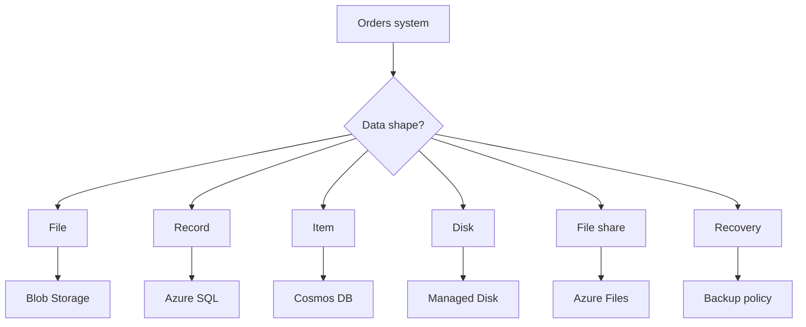

## Table of Contents

1. [The Problem](#the-problem)
2. [What Is Data Storage](#what-is-data-storage)
3. [Data Shape](#data-shape)
4. [Files](#files)
5. [Records](#records)
6. [Items](#items)
7. [Disks](#disks)
8. [File Shares](#file-shares)
9. [Recovery](#recovery)
10. [Sample Data Map](#sample-data-map)
11. [Putting It All Together](#putting-it-all-together)
12. [What's Next](#whats-next)

## The Problem

The compute module gave `devpolaris-orders-api` several places to run: App Service, Container Apps, Functions, Virtual Machines, and AKS. Now the app has to remember things after the process stops.

The first storage review looks messy:

- The checkout API writes order records, payment attempts, and line items.
- The receipt service generates PDF files customers need to download later.
- The export job writes CSV files for finance.
- The payment path needs an idempotency record so the same checkout request does not charge twice.
- A legacy VM worker expects a mounted folder while the team migrates it.
- A developer asks whether "we have backups" after a bad cleanup script deletes the wrong files.

All of those are storage questions. They are not the same question. If the team answers every one with "put it in the database" or "upload it to storage," the first demo may pass and the production system will become confusing.

This article starts with the data, not the service list. The habit is simple: ask what the app is trying to remember, how it will read it later, how it changes, and what kind of failure would hurt most.

## What Is Data Storage

Data storage is the part of the cloud architecture that keeps application state outside the running process. A process can restart. A container can be replaced. A VM can fail. A function invocation can end. The data service keeps the file, record, item, disk, or share available after that runtime changes.

Azure has several storage and database services because data has different shapes. A receipt PDF is not the same as an order record. A job-status item is not the same as a mounted VM disk. A shared legacy folder is not the same as object storage. Each shape comes with a different access path, consistency expectation, cost model, permission boundary, and recovery story.

If you know AWS, the first bridge is useful:

| Data shape | Azure starting point | AWS bridge |
| --- | --- | --- |
| File-like object | Blob Storage | S3 |
| Relational records | Azure SQL Database | RDS-style managed relational database |
| Known-key NoSQL item | Cosmos DB | DynamoDB-style access-pattern thinking |
| VM disk | Managed Disk | EBS |
| Shared file path | Azure Files | EFS-style managed file share |
| Recovery policy | Service-specific backups, soft delete, snapshots, Azure Backup | RDS backups, S3 versioning, EBS snapshots, AWS Backup |

The bridge helps orientation, but Azure's boundaries are its own. Blob Storage lives inside a storage account. Azure SQL uses logical servers and databases. Cosmos DB design turns on partition keys and request units. Managed disks attach to VM-shaped workloads. Azure Files exposes a managed share. Learn the Azure nouns after the data shape is clear.

## Data Shape

The most useful first question is not "which service is best?" It is "what promise does this data need?"

For `devpolaris-orders-api`, the promises are different. Order records need relationships and transactions. Receipt PDFs need durable file download. Idempotency checks need fast known-key lookup. A VM worker needs a disk or mounted path while it runs. Backups need a way to restore the right data after a mistake.

The diagram is not a final architecture. It is a review habit. Once the shape is clear, the service conversation becomes easier.

| Ask | Why it matters |
| --- | --- |
| Is this a whole file or a business fact? | Files fit object storage. Connected facts often fit a database. |
| Does the app read by a known key or by flexible queries? | Known-key items can fit NoSQL. Flexible relational questions often fit SQL. |
| Does the data change in place? | Updates, transactions, and concurrency rules matter. |
| Does it need to be mounted by an operating system? | A disk or file share may be required for VM-shaped work. |
| What happens after accidental delete or corruption? | Backup and restore design belongs to the feature and operations. |

## Files

A file is a bundle of bytes the app usually stores, downloads, replaces, or deletes as a unit. Receipt PDFs, product images, CSV exports, support attachments, and archive files are file-shaped.

In Azure, Blob Storage is the usual home for durable file-like data. The important word is durable. If a containerized API writes a receipt PDF to its local filesystem, the file is tied to one running copy of the app. Another replica may not see it. A redeploy may remove it. A scale event may make the path irrelevant.

Blob Storage moves the file outside the compute runtime. The app writes the receipt to a blob container, stores the metadata or pointer where the business record lives, and later serves or authorizes access to that blob.

The gotcha is that object names cannot do a database's job. A blob name such as `receipts/2026/05/order-417.pdf` looks like a path, but it does not replace an order table. Store the file in Blob Storage. Store the order state, customer relationship, and receipt pointer in the right record store.

## Records

Records are business facts with relationships and rules. An order belongs to a customer. An order has line items. A payment attempt belongs to one order. Support may ask for all failed payments from one customer in a date range.

That shape points toward a relational database. In Azure, the usual first managed choice is Azure SQL Database. SQL gives the team tables, constraints, transactions, indexes, queries, and a mature recovery model.

The important beginner idea is that a relational database protects business meaning. A checkout flow needs to avoid half-written orders. A support view needs to join facts. A migration needs to change schema deliberately. Those are relational pressures, not blob pressures.

## Items

Some data is not a file and does not need rich relational queries. It is an item the app reads by a known key or partition. An idempotency record might say, "checkout request `req_83b` already created order `417`." A job-status item might say, "export job `job_712` is running and expires tomorrow."

That can point toward Cosmos DB. The catch is that NoSQL is not a shortcut around design. Cosmos DB design starts with access patterns: how the app reads the item, what partition key groups the data, how much request work each operation costs, and whether the item should expire.

Cosmos DB can be a good fit when reads and writes are predictable. It is a bad fit when the team is secretly asking relational questions and hoping a document database will make modeling disappear.

## Disks

Some storage must look like a disk because a VM-shaped workload expects an operating system volume. The OS disk lets the VM boot. A data disk can hold application workspace, installed data, or files that belong close to a specific VM.

Managed Disks are Azure's managed block storage for VMs. They are useful, but they should not become the default place for application data. If the business needs a customer receipt, put it in Blob Storage. If the app needs order records, put them in a database. Use disks when the workload genuinely needs disk behavior attached to a machine.

Temporary VM storage needs special care. Some VM sizes expose temporary local storage, but it is not a safe application store. It can disappear during maintenance, redeployment, or host movement. Treat it as scratch space.

## File Shares

A file share is a mounted folder that one or more clients can access through filesystem protocols. Azure Files provides managed file shares for workloads that need that shape.

This is useful for legacy apps, shared templates, migration bridges, or tools that cannot easily switch to object storage yet. It is not automatically better than Blob Storage. If the app only needs to store generated files and later download them, object storage is usually simpler. If the app expects a path like `/mnt/templates/invoice.docx`, a managed file share may fit.

The review question is practical: does the workload need filesystem semantics, or does it only need durable file storage? A mounted folder adds network, permission, performance, and recovery considerations. Use it when the folder behavior is real.

## Recovery

Recovery is part of data design because mistakes happen after writes succeed. A cleanup job deletes the wrong blobs. A schema migration updates the wrong column. A job-status container keeps old records forever. A VM disk fills or is corrupted.

"We have backups" is not specific enough. A useful recovery answer says what can be restored, to which destination, how far back, how long recovery points are retained, and how the team has tested the restore. The restore story differs by service: Azure SQL point-in-time restore, Blob soft delete and versioning, Cosmos DB backup modes and time to live, disk snapshots, Azure Files snapshots, or Azure Backup.

Keep the module boundary clear. This article introduces recovery as a data promise. The later Cost and Resilience module will talk more broadly about RTO, RPO, regional design, and disaster recovery strategy.

## Sample Data Map

A first pass at the orders system can be small and clear:

| Data | Shape | Azure starting point | Why |
| --- | --- | --- | --- |
| Order, line item, payment attempt | Relational records | Azure SQL Database | Needs transactions, relationships, constraints, and flexible queries. |
| Receipt PDF | File | Blob Storage | Durable object that customers download later. |
| Finance export CSV | File | Blob Storage | Generated file that should survive compute replacement. |
| Checkout idempotency key | Known-key item | Cosmos DB or SQL table | Read by request key; may expire after a retention window. |
| Export job status | Known-key item | Cosmos DB | Short-lived item with predictable reads and possible TTL. |
| Legacy import workspace | Disk or file share | Managed Disk or Azure Files | VM-shaped or shared-folder behavior during migration. |
| Accidental delete recovery | Recovery promise | Service-specific protection | Restore must be usable in practice. |

Use this table as a conversation starter. The right answer can change with product needs, compliance rules, cost, and the team's operating skills. But the shape-first review prevents the two worst defaults: stuffing every file into a database and using object storage as a pretend database.

## Putting It All Together

The opener had six different storage needs, and now they no longer compete for one vague service.

Order records belong in a relational store because checkout needs connected business facts and transactions. Receipt PDFs and CSV exports belong in object storage because they are durable files. Idempotency and job status can fit a known-key item model when the access pattern is clear. VM disks and file shares belong to machine-shaped or filesystem-shaped work, not ordinary generated files. Recovery belongs beside every choice because storage is only trustworthy when restore is possible.

That is the core Azure data habit: describe the promise first, then choose the service.

## What's Next

Next we will look at Blob Storage, the Azure home for file-like data such as receipts, exports, images, and archives.

---

**References**

- [Introduction to Azure Blob Storage](https://learn.microsoft.com/en-us/azure/storage/blobs/storage-blobs-overview)
- [Azure SQL Database documentation](https://learn.microsoft.com/en-us/azure/azure-sql/database/)
- [Azure Cosmos DB documentation](https://learn.microsoft.com/en-us/azure/cosmos-db/)
- [Azure Managed Disks overview](https://learn.microsoft.com/en-us/azure/virtual-machines/managed-disks-overview)
- [What is Azure Files?](https://learn.microsoft.com/en-us/azure/storage/files/storage-files-introduction)
